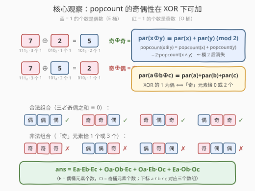
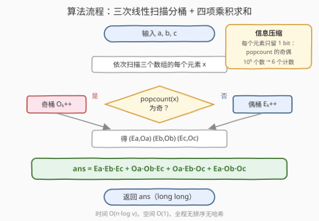
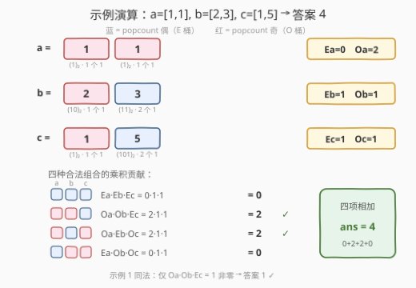

# 用偶数异或设置位计数三元组 II

- **题目名称**：用偶数异或设置位计数三元组 II
- **链接**：[3215. 用偶数异或设置位计数三元组 II 🔒](https://leetcode.cn/problems/count-triplets-with-even-xor-set-bits-ii/)
- **难度**：中等
- **标签**：位运算、数组、计数

## 1. 题目概述

> ⚠️ 本题为 LeetCode 付费题，题意描述根据官方示例用例与 hints 重建，可能与官方题面有出入。（题意已与姊妹题 3199 及官方 hints 交叉核对：函数签名取自 GraphQL `metaData`（`tripletCount(a, b, c) -> long`），两个示例的输出均用暴力枚举独立验证，核心语义与官方四条 hints 的推导路线完全吻合，出入风险较低。）

给你三个整数数组 `a`、`b`、`c`。统计满足 **`a[i] XOR b[j] XOR c[k]` 的二进制表示中 1 的个数为偶数** 的三元组 `(i, j, k)` 的数量。

**示例 1**：

```text
输入：a = [1], b = [2], c = [3]
输出：1
解释：唯一的三元组：1 ⊕ 2 ⊕ 3 = 0 = (0)₂，1 的个数为 0，是偶数 ✓
```

**示例 2**：

```text
输入：a = [1,1], b = [2,3], c = [1,5]
输出：4
解释：a[0] 与 a[1] 取值相同，各贡献 2 个合法三元组：
- 1 ⊕ 2 ⊕ 1 = 2 = (10)₂，1 个 1，奇 ✗
- 1 ⊕ 2 ⊕ 5 = 6 = (110)₂，2 个 1，偶 ✓
- 1 ⊕ 3 ⊕ 1 = 3 = (11)₂，2 个 1，偶 ✓
- 1 ⊕ 3 ⊕ 5 = 7 = (111)₂，3 个 1，奇 ✗
合计 2 × 2 = 4。
```

**约束条件**（官方题面付费锁定，以下依 I/II 难度梯度与返回类型 `long` 推断）：

- $1 \le a.length, b.length, c.length \le 10^5$
- $1 \le a[i], b[i], c[i] \le 10^9$
- 答案最大可达 $10^{15}$，必须使用 64 位整数

> 💡 读题关键：① 判定对象是 XOR 结果中 1 的个数的**奇偶性**，而不是 XOR 值本身——每个元素的有效信息瞬间塌缩成 1 个比特；② 姊妹题 [3199](https://leetcode.cn/problems/count-triplets-with-even-xor-set-bits-i/)（Easy）的官方 hint 就是「枚举所有三元组」，而本题四条 hints 全部指向「按奇偶分桶计数」——两题合起来正是「暴力 → 计数」的标准优化路径。

---

## 2. 解题思路

### 2.1 暴力思路

三重循环枚举全部三元组，逐个求 `x ^ y ^ z` 的置位个数：

```python
ans = 0
for x in a:
    for y in b:
        for z in c:
            if bin(x ^ y ^ z).count('1') % 2 == 0:
                ans += 1
```

时间 $O(n^3)$：$n \le 10^5$ 时高达 $10^{15}$ 次判定，必然超时。瓶颈在于把 $10^{15}$ 个三元组**一个一个看**——而每个三元组的合法性其实只由三个元素各自的极少量信息决定。

### 2.2 核心观察：奇偶性在 XOR 下可加，分桶计数 + 乘法原理



**观察 1（奇偶性可加）**：由恒等式

$$\mathrm{popcount}(x \oplus y) = \mathrm{popcount}(x) + \mathrm{popcount}(y) - 2 \cdot \mathrm{popcount}(x \wedge y)$$

模 2 后交叉项消失，得 $\mathrm{par}(x \oplus y) \equiv \mathrm{par}(x) + \mathrm{par}(y) \pmod 2$，其中 $\mathrm{par}(x) := \mathrm{popcount}(x) \bmod 2$。直观理解：按位异或时，**双方都是 1 的位置两两抵消成 0，每次抵消恰好减去 2 个 1**，不改变奇偶性。于是三个数也成立：

$$\mathrm{par}(a \oplus b \oplus c) \equiv \mathrm{par}(a) + \mathrm{par}(b) + \mathrm{par}(c) \pmod 2$$

**观察 2（判定条件等价转化，官方 hint 同款）**：XOR 结果 1 的个数为偶数 $\iff$ 三个数中 **popcount 为奇数的恰有 0 个或 2 个**（即三者奇偶标记之和 $\equiv 0 \pmod 2$）。

**观察 3（分桶 + 乘法原理）**：每个数组只需两个计数——$E$（popcount 为偶的元素个数）与 $O$（popcount 为奇的元素个数）。四种合法组合互斥，组内任取（乘法原理）、组间相加：

$$ans = E_aE_bE_c + O_aO_bE_c + O_aE_bO_c + E_aO_bO_c$$

数组里每个元素具体是多少**完全不重要**：$10^5$ 个元素被压缩成 2 个计数，这正是 $O(n^3) \to O(n)$ 的根源。

### 2.3 算法流程图



三个数组**各扫一遍**：对每个元素求 popcount，按 `popcount(x) & 1` 入偶桶 $E$ 或奇桶 $O$；最后四个乘积相加。全程无排序、无哈希、无嵌套枚举，瓶颈只剩 popcount 本身。

### 2.4 示例演算



以示例 2 为例，$a = [1,1]$，$b = [2,3]$，$c = [1,5]$：

| 数组 | 元素 → 二进制 → 置位数 | $E$（偶桶） | $O$（奇桶） |
|------|------------------------|------------|------------|
| $a$ | $1 \to (1)_2 \to 1$ 奇；$1 \to (1)_2 \to 1$ 奇 | 0 | 2 |
| $b$ | $2 \to (10)_2 \to 1$ 奇；$3 \to (11)_2 \to 2$ 偶 | 1 | 1 |
| $c$ | $1 \to (1)_2 \to 1$ 奇；$5 \to (101)_2 \to 2$ 偶 | 1 | 1 |

四种合法组合的贡献：

| 组合（a, b, c 各自从哪个桶取） | 乘积 | 贡献 |
|-------------------------------|------|------|
| 偶 · 偶 · 偶 | $E_aE_bE_c = 0 \cdot 1 \cdot 1$ | 0 |
| 奇 · 奇 · 偶 | $O_aO_bE_c = 2 \cdot 1 \cdot 1$ | 2 |
| 奇 · 偶 · 奇 | $O_aE_bO_c = 2 \cdot 1 \cdot 1$ | 2 |
| 偶 · 奇 · 奇 | $E_aO_bO_c = 0 \cdot 1 \cdot 1$ | 0 |

合计 $0 + 2 + 2 + 0 = 4$，与暴力枚举一致 ✓。示例 1 同法：$(E_a, O_a) = (0,1)$，$(E_b, O_b) = (0,1)$，$(E_c, O_c) = (1,0)$，仅 $O_aO_bE_c = 1$ 非零，答案 1 ✓。

---

## 3. 参考代码

### C++（三遍扫描分桶，$O(1)$ 空间）

```cpp
class Solution {
  public:
    long long tripletCount(vector<int>& a, vector<int>& b, vector<int>& c) {
        long long ea = 0, oa = 0, eb = 0, ob = 0, ec = 0, oc = 0;
        for (int x : a) (__builtin_popcount(x) & 1) ? ++oa : ++ea;   // 奇桶 / 偶桶
        for (int x : b) (__builtin_popcount(x) & 1) ? ++ob : ++eb;
        for (int x : c) (__builtin_popcount(x) & 1) ? ++oc : ++ec;
        // 四种合法奇偶组合，乘法原理 + 互斥相加
        return ea * eb * ec + oa * ob * ec + oa * eb * oc + ea * ob * oc;
    }
};
```

### Python（同逻辑）

```python
class Solution:
    def tripletCount(self, a: List[int], b: List[int], c: List[int]) -> int:
        def eo(arr):
            e = sum(1 for x in arr if bin(x).count('1') % 2 == 0)
            return e, len(arr) - e
        ea, oa = eo(a)
        eb, ob = eo(b)
        ec, oc = eo(c)
        return ea * eb * ec + oa * ob * ec + oa * eb * oc + ea * ob * oc
```

> 💡 Python 3.10+ 可用 `x.bit_count()` 替代 `bin(x).count('1')`。C++ 中 $E, O$ 本身用 `int` 也放得下（$\le 10^5$），但三个计数相乘可达 $10^{15}$，乘法必须落在 `long long` 上——干脆全部声明成 `long long`。

---

## 4. 复杂度分析

| 维度 | 复杂度 | 说明 |
|------|--------|------|
| 时间复杂度 | $O(n \log v)$ | 每个元素一次 popcount（字长 $\log v$ 级，$v \le 10^9$ 即约 30 位），三次线性扫描 + 常数次乘法 |
| 空间复杂度 | $O(1)$ | 每个数组只留 $E/O$ 两个计数 |
| 暴力对照 | $O(n^3)$ / $O(1)$ | $n = 10^5$ 时 $10^{15}$ 次判定，超时约 9 个数量级 |

---

## 5. 扩展：一步到位的闭式与 k 数组泛化

记 $D_k = E_k - O_k$（偶桶减奇桶）。由奇偶性可加，$(-1)^{\mathrm{par}(\cdot)}$ 在 XOR 下**乘法相容**，于是可以对全部三元组求和并完美分离：

$$\sum_{i,j,k} (-1)^{\mathrm{par}(a_i \oplus b_j \oplus c_k)} = \left(\sum_i (-1)^{\mathrm{par}(a_i)}\right)\left(\sum_j (-1)^{\mathrm{par}(b_j)}\right)\left(\sum_k (-1)^{\mathrm{par}(c_k)}\right) = D_aD_bD_c$$

而该和式又等于（合法数）$-$（非法数）$= 2 \cdot ans - n_an_bn_c$，解出：

$$ans = \frac{n_an_bn_c + D_aD_bD_c}{2}$$

示例 2 验证：$n_an_bn_c = 8$，$D_a = -2$，$D_b = D_c = 0$，$ans = (8 + 0)/2 = 4$ ✓。

**k 数组泛化**：目标是偶 $\iff$ 从奇桶取出的元素个数 $\equiv 0 \pmod 2$，闭式为 $\dfrac{\prod_i n_i + \prod_i D_i}{2}$；若目标改为「1 的个数为奇」，答案即 $\dfrac{\prod_i n_i - \prod_i D_i}{2}$。计数、奇偶、乘法分离三件套在这一族问题里通用。

---

## 6. 面试要点

1. **为什么 popcount 的奇偶性在 XOR 下可加？**

   $\mathrm{popcount}(x \oplus y) = \mathrm{popcount}(x) + \mathrm{popcount}(y) - 2 \cdot \mathrm{popcount}(x \wedge y)$，模 2 后第三项消失。直观：双方同为 1 的位在异或中成对湮灭，每次湮灭恰好少 2 个 1，奇偶性不变。

2. **「XOR 结果 1 的个数为偶」等价于什么组合条件？**

   $\mathrm{par}(a) \oplus \mathrm{par}(b) \oplus \mathrm{par}(c) = 0$，即 popcount 为奇的元素恰有 0 个或 2 个——对应 EEE、OOE、OEO、EOO 四种组合。

3. **为什么答案是四项乘积之和？**

   四种合法组合互斥；每种组合内，三个数组各自从对应桶里任取一个元素即构成合法三元组，方案数是三个桶计数的乘积（乘法原理）；互斥事件相加。

4. **数据范围与溢出怎么处理？**

   $n \le 10^5$ 时答案上限 $10^{15}$，超出 `int32`（官方签名返回 `long`）；C++ 里计数直接声明 `long long`（或至少在乘法处强转），Python 天然大整数无虞。

5. **如果改问「1 的个数为奇数」的三元组呢？**

   剩下的四种组合 OOO + EOO + OEO + OOE，等于总数减去偶数答案；用闭式则是 $(n_an_bn_c - D_aD_bD_c)/2$。改动一个符号，思路完全复用。

---

## 7. 同类练习题

- [3199. 用偶数异或设置位计数三元组 I 🔒](https://leetcode.cn/problems/count-triplets-with-even-xor-set-bits-i/)：本题的 Easy 姊妹题，官方 hint 就是三重循环暴力枚举——两题合看正是「暴力 → 计数」优化闭环的完整示范
- [1442. 形成两个异或相等数组的三元组数目](https://leetcode.cn/problems/count-triplets-that-can-form-two-arrays-of-equal-xor/)：同为「三元组 + XOR」计数，用前缀异或把 $O(n^3)$ 降到 $O(n)$ 的经典
- [477. 汉明距离总和](https://leetcode.cn/problems/total-hamming-distance/)：按位独立统计 0/1 个数再两两相乘，与本题「按奇偶分桶 + 乘法原理」同源的组合计数
- [1863. 找出所有子集的异或总和再求和](https://leetcode.cn/problems/sum-of-all-subset-xor-totals/)：XOR 全组合计数的另一变体，按位贡献分解
- [191. 位 1 的个数](https://leetcode.cn/problems/number-of-1-bits/)：popcount 基本功（`n & (n-1)` 逐次消去最低位 1），本题的地基
