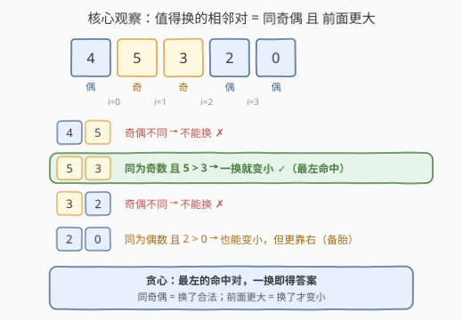
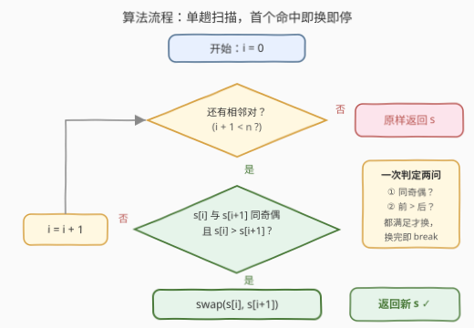
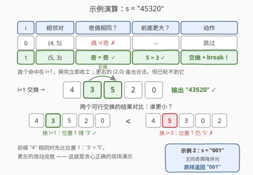

# LeetCode 交换后字典序最小的字符串 题解

## 1. 题目概述

- **标题 / 题号**：交换后字典序最小的字符串（#3216，easy）
- **链接**：https://leetcode.cn/problems/lexicographically-smallest-string-after-a-swap/
- **难度**：简单
- **标签**：贪心、字符串、字典序

**题意**：给定仅由数字组成的字符串 `s`，你可以**至多一次**交换其中的两个数字，要求被交换的两个数字：

1. **相邻**（位于 `i` 与 `i+1`）；
2. **奇偶性相同**（同为奇数或同为偶数）。

返回能得到的**字典序最小**的字符串。

> 💡 **奇偶性**：5 和 9、2 和 4 奇偶性相同；6 和 9 奇偶性不同。注意「**至多**一次」——也允许一次都不换。

**示例 1**：

```text
输入：s = "45320"
输出："43520"
解释：s[1] == '5' 与 s[2] == '3' 奇偶性相同，交换它们得到字典序最小的字符串。
```

**示例 2**：

```text
输入：s = "001"
输出："001"
解释：无需交换，s 已经是字典序最小的。
```

**约束**：

- $2 \le s.length \le 100$
- `s` 仅由数字组成。

## 2. 解题思路

### 2.1 暴力思路：枚举所有可交换对

从左到右枚举每个相邻对 $(i, i+1)$：若两个数字奇偶性相同，就交换一次生成候选串；把所有候选与原串放在一起，取字典序最小者。

- **正确性**：候选集恰好覆盖全部可行操作（换任何一个合法对 / 一次不换），取最小必对。
- **复杂度**：至多 $n-1$ 个候选，每个的拷贝与比较各 $O(n)$，总计 $O(n^2)$；$n \le 100$ 轻松可过。
- **别扭之处**：字典序比较**天生从左往右**——最左的改动永远优先级最高。暴力把每个位置的交换一视同仁地试一遍，白白丢掉了这个结构。

### 2.2 核心观察：最左的「同奇偶降序对」一换即得



**观察 1（什么交换会让串变小）**：交换相邻对 $(i, i+1)$ 后，其余位置原样不动，位置 $i$ 变成 $s_{i+1}$、位置 $i+1$ 变成 $s_i$。新旧两串的**第一个不同位置就是 $i$**，字典序大小由它一锤定音：

$$s' < s \iff s_{i+1} < s_i$$

即**前面更大才值得换**：相等则串不变（白费唯一的机会），前面更小则越换越大。

**观察 2（合法性门槛）**：再叠加题目约束——$s_i$ 与 $s_{i+1}$ **奇偶性相同**。合起来，**命中**位置 $i$ 满足：

$$\text{同奇偶} \;\text{且}\; s_i > s_{i+1}$$

**观察 3（最左命中完胜——交换论证）**：设 $i$ 为最左的命中位置，则「换 $i$」就是全局最优：

- 对 $j < i$：由 $i$ 的最左性，$j$ 要么奇偶不同（**不可换**），要么 $s_j \le s_{j+1}$（换了**不变或变大**）——都不可能变小；
- 对 $j > i$：「换 $i$」与「换 $j$」的结果前缀 $s_0 \cdots s_{i-1}$ 完全相同，但位置 $i$ 上前者是 $s_{i+1}$、后者仍是 $s_i$；由 $s_{i+1} < s_i$ 知换 $i$ 的结果**严格更小**。

于是算法无比简短：**从左到右扫一遍，遇到第一个命中对就交换、立即收工**；一路扫完都没命中，说明任何合法交换都只会不变或变大，原串已最小，原样返回。

### 2.3 算法流程图



单趟 `for` 循环承担全部逻辑：先看越界（`i + 1 < n`），再用一个 `if` 同时判「同奇偶」与「前面更大」，命中即 `swap` + `break`——「至多一次交换」直接翻译成「换完就停」。

### 2.4 示例演算



以 `"45320"` 为例：$i=0$ 的 $(4,5)$ 奇偶不同被拒；$i=1$ 的 $(5,3)$ 同为奇数且 $5>3$，**首个命中**——交换得 `"43520"`，立即 `break`。注意 $i=3$ 的 $(2,0)$ 其实也命中（换后得 `"45302"`），但它更靠右：两个结果前缀 `"4"` 相同，位置 1 上 `'3' < '5'`，最左完胜——这正是观察 3 的现场演示。

`"001"` 则扫不到任何命中：$(0,0)$ 同偶但**相等**（换了不变），$(0,1)$ 奇偶不同——原样返回 `"001"`。

## 3. 参考代码

### C++

```cpp
class Solution {
public:
    string getSmallestString(string s) {
        for (int i = 0; i + 1 < (int)s.size(); i++) {
            if ((s[i] - '0') % 2 == (s[i + 1] - '0') % 2 && s[i] > s[i + 1]) {
                swap(s[i], s[i + 1]);
                break;   // 至多一次交换，命中即收工
            }
        }
        return s;
    }
};
```

> 💡 判定顺序无所谓，奇偶与大小都是 $O(1)$。`(s[i] - '0') % 2` 也可以写成 `s[i] % 2`——'0' 的 ASCII 码 48 是偶数，减不减 `'0'` 奇偶性不变。

### Python

```python
class Solution:
    def getSmallestString(self, s: str) -> str:
        t = list(s)  # 字符串不可变，转 list 原地交换
        for i in range(len(t) - 1):
            if (int(t[i]) & 1) == (int(t[i + 1]) & 1) and t[i] > t[i + 1]:
                t[i], t[i + 1] = t[i + 1], t[i]
                break
        return "".join(t)
```

## 4. 复杂度分析

| 维度 | 复杂度 | 说明 |
|------|--------|------|
| **时间（贪心）** | $O(n)$ | 单趟扫描，每个位置两次 $O(1)$ 判定（奇偶 + 大小），命中即停 |
| **时间（暴力）** | $O(n^2)$ | 枚举 $n-1$ 个合法对，每个拷贝/比较 $O(n)$ |
| **空间** | $O(1)$ | C++ 原地交换；Python 因字符串不可变需 $O(n)$ 辅助 list |

## 5. 扩展：不限交换次数，能到多小？

每次交换的两个数字**奇偶相同** ⇒ **每个位置上的数字奇偶性是不变量** ⇒ 数字永远跨不过异奇偶的邻居。于是串被切成若干**极大同奇偶连续段**：

- **段内**：任意相邻对都同奇偶、全部可换——冒泡排序可达**任意排列**；
- **段间**：完全绝缘，谁也过不去。

所以最优解 = **每个段内部升序排序**。例如 `"45320"` 的段为 $[4] \mid [53] \mid [20]$，不限次数可到 `"43502"`，比一次交换的 `"43520"` 更小；而 `"1234"` 的四个段全是单格，一步都动不了。若再把交换次数限制成预算 $K$，就升级为 [1505. 最多 K 次交换相邻数位后得到的最小整数](https://leetcode.cn/problems/minimum-possible-integer-after-at-most-k-adjacent-swaps-on-digits/)（树状数组统计每位归位的代价）。

## 6. 面试要点

1. **为什么遇到第一个命中对就立刻交换并停止？**

   题目至多允许一次交换，且由交换论证（2.2 观察 3）：更左的位置不可能换得更小（不合法或不变/变大），更右的交换在位置 $i$ 处仍保留较大的 $s_i$——最左命中对**严格最优**。扫到即换、换完即停，继续扫描没有任何收益。

2. **同奇偶但 $s_i = s_{i+1}$，换不换？**

   不换。交换后串完全不变，却消耗了唯一一次机会；它也不满足「变小」条件。代码里写严格大于 `s[i] > s[i+1]`，相等对自然被跳过。

3. **奇偶性怎么 $O(1)$ 判断？**

   `(c - '0') % 2` 或 `(c - '0') & 1`；由于 `'0'` 的 ASCII 码 48 是偶数，直接 `c & 1` 结果相同——只看最低位二进制位即可。

4. **和 670「最大交换」有什么异同？**

   同属「字典序 + 至多一次交换」家族。670 允许换**任意**两个位置求**最大**：需预处理每个数字最右出现位置，再从左找第一个「后面有更大数字」的位置；本题限**相邻 + 同奇偶**求**最小**：约束更强、可行对少得多，一趟扫描即可。规律：约束越松，越需要预处理结构支撑。

5. **如果「同奇偶」换成别的等价关系（如大小写、模 3 同余），思路要变吗？**

   不变。「同奇偶」在证明里只用到一点：它是把相邻对分成「可换/不可换」的**等价类判定**。只要等价关系给定，结论仍是最左的「可换且前大后小」对一换即得，观察 3 的交换论证逐字成立。

## 同类练习题

| # | 题目 | 与本题的关联 |
|---|------|-------------|
| 670 | [最大交换](https://leetcode.cn/problems/maximum-swap/) | 本题的「最大」镜像——至多一次**任意位置**交换求最大，贪心 + 每个数字最右出现位置 |
| 1505 | [最多 K 次交换相邻数位后得到的最小整数](https://leetcode.cn/problems/minimum-possible-integer-after-at-most-k-adjacent-swaps-on-digits/) | 本题的预算制进阶——K 次相邻交换求最小整数，树状数组统计归位代价 |
| 31 | [下一个排列](https://leetcode.cn/problems/next-permutation/) | 交换与字典序的基石——找升序对、交换、逆转后缀 |
| 402 | [移掉 K 位数字](https://leetcode.cn/problems/remove-k-digits/) | 字典序贪心家族——单调栈「删大留小」，同样是「越早改越小」 |
| 316 | [去除重复字母](https://leetcode.cn/problems/remove-duplicate-letters/) | 字典序贪心 + 可撤销（栈顶弹出），贪心框架的进阶形态 |
