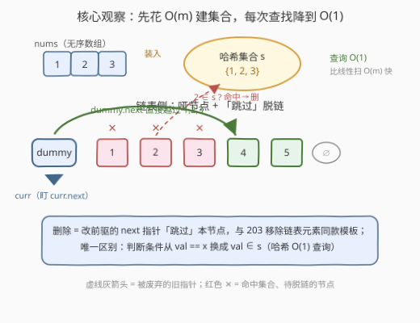
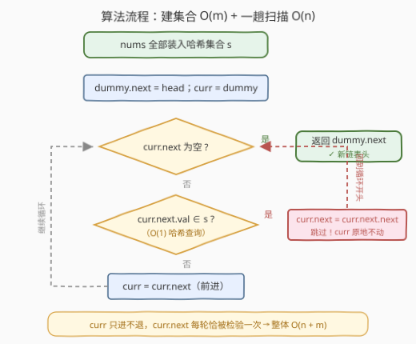
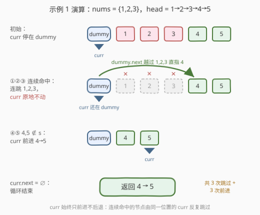

# LeetCode 从链表中移除在数组中存在的节点 题解

## 1. 题目概述

- **标题 / 题号**：从链表中移除在数组中存在的节点（#3217，medium）
- **链接**：https://leetcode.cn/problems/delete-nodes-from-linked-list-present-in-array/
- **难度**：中等
- **标签**：数组、哈希表、链表、哑节点

**题意**：给你一个整数数组 `nums` 和一个链表的头节点 `head`。从链表中**移除**所有存在于 `nums` 中的节点后，返回修改后的链表的头节点。

**示例 1**：

```text
输入：nums = [1,2,3], head = [1,2,3,4,5]
输出：[4,5]
解释：移除数值为 1, 2 和 3 的节点。
```

**示例 2**：

```text
输入：nums = [1], head = [1,2,1,2,1,2]
输出：[2,2,2]
解释：移除数值为 1 的节点。
```

**示例 3**：

```text
输入：nums = [5], head = [1,2,3,4]
输出：[1,2,3,4]
解释：链表中不存在值为 5 的节点。
```

**约束**：

- $1 \le \text{nums.length} \le 10^5$
- $1 \le \text{nums[i]} \le 10^5$
- `nums` 中的所有元素都是**唯一**的
- 链表中的节点数在 $[1, 10^5]$ 的范围内
- $1 \le \text{Node.val} \le 10^5$
- 输入保证链表中**至少有一个值**没有在 `nums` 中出现过（返回值必非空）

> 💡 读题关键：① `nums` **无序**且元素互异，链表节点**可能重复出现**（示例 2 中 1 出现 3 次要删光）——这不是「删一次」而是「全删」语义；② 约束把 `nums[i]` 和 `Node.val` 都压在 $10^5$ 以内，这个**小值域**后面有大用（见第 5 节）；③「至少保留一个节点」兜底，链表删空、返回 `nullptr` 的边界根本不会出现，但仍建议写通用模板。

## 2. 解题思路

### 2.1 暴力思路：逐节点线性扫描 nums

对链表每个节点，遍历一遍 `nums` 看值是否出现，命中就脱链：

```python
for 每个节点:
    for x in nums:          # O(m) 线性查
        if 节点.val == x: 删除
```

时间复杂度 $O(n \cdot m)$，$n, m \le 10^5$ 时最坏 $10^{10}$ 次比较，**必然超时**。

瓶颈剖析：链表侧「跳过式删除」本身是 $O(n)$ 的（203 移除链表元素的成熟模板）；慢的是**查**——`nums` 无序，每次判定「值在不在里面」都要付出 $O(m)$。**把查找从 $O(m)$ 压到 $O(1)$，本题就解决了**。

### 2.2 核心观察：哈希集合 + 哑节点脱链（203 模板换判据）



**观察 1（查找升级）**：先把 `nums` 整体装入**哈希集合** $s$，花费 $O(m)$；此后每个节点的「是否命中」判定都是均摊 $O(1)$。一次预处理换全程快查，这是「数组当判据」类题目的通用起手式（对照 128 最长连续序列、1 两数之和）。

**观察 2（删除模板不变）**：链表侧完全复用 203 的姿势——**哑节点（dummy）** 统一「删头节点」的边界，游标 `curr` 始终**盯住 `curr.next`** 做判断：

1. 若 $\text{curr.next.val} \in s$：`curr.next = curr.next.next`，把命中节点「跳过」脱链，**`curr` 原地不动**；
2. 若 $\text{curr.next.val} \notin s$：`curr = curr.next`，确认保留，前进一格。

与 203 的唯一区别：判断条件从 `val == x`（O(1) 比较）换成 `val ∈ s`（O(1) 哈希查询）。

> ⚠️ **两个易错点**（与 203 一脉相承）：
> ① 删除后 **`curr` 不能前进**——跳过一个命中节点后，新的 `curr.next` 可能仍然命中（示例 2 的 `1→2→1→2→1→2`，示例 1 的开头 `1→2→3`），必须原地继续查；
> ② 单链表删除要握**前驱**改 `next`，所以判断对象是 `curr.next` 而非 `curr` 自身。

### 2.3 算法流程图



三段式：**建集合 $O(m)$ → 初始化哑节点 → 单趟扫描**。循环体内只有两个菱形判断（空指针、命中集合），两个动作（跳过不动 / 前进），`curr` 只进不退，每个节点恰被检验一次。

### 2.4 示例演算



以示例 1（$s = \{1,2,3\}$，链表 `1→2→3→4→5`）为例：

- **第 ① 步**：`curr = dummy`，`curr.next = 1 ∈ s` → `dummy.next` 改指 2，**`curr` 不动**；
- **第 ② 步**：`curr.next = 2 ∈ s` → `dummy.next` 改指 3，**`curr` 不动**；
- **第 ③ 步**：`curr.next = 3 ∈ s` → `dummy.next` 改指 4，**`curr` 仍停在 dummy**——连续三次命中，头节点段的删除全由 dummy 一个位置完成；
- **第 ④ 步**：`curr.next = 4 ∉ s` → 保留，`curr` 前进到 4；
- **第 ⑤ 步**：`curr.next = 5 ∉ s` → 保留，`curr` 前进到 5；
- **第 ⑥ 步**：`curr.next = ∅`，循环结束，返回 `dummy.next`，即 `4→5`。

全程 **3 次跳过 + 3 次前进**，恰好是 $n + m$ 量级的一趟扫描。示例 2 同理：`curr` 在 dummy 处跳过第 1 个 1 后前进到 2，随后在 2 处再跳两个 1，最终返回 `2→2→2`。

## 3. 参考代码

### C++（哈希集合 + 哑节点）

```cpp
class Solution {
  public:
    ListNode* modifiedList(vector<int>& nums, ListNode* head) {
        unordered_set<int> s(nums.begin(), nums.end()); // O(m) 建集合
        ListNode dummy(0, head);                       // 哑节点统一「删头」边界
        ListNode* curr = &dummy;
        while (curr->next != nullptr) {
            if (s.count(curr->next->val)) {
                curr->next = curr->next->next;          // 跳过命中节点，curr 不动
            } else {
                curr = curr->next;                      // 确认保留，前进
            }
        }
        return dummy.next;
    }
};
```

### Python（哈希集合 + 哑节点）

```python
class Solution:
    def modifiedList(self, nums: List[int], head: Optional[ListNode]) -> Optional[ListNode]:
        s = set(nums)                      # O(m) 建集合
        dummy = ListNode(0, head)          # 哑节点统一「删头」边界
        curr = dummy
        while curr.next:
            if curr.next.val in s:         # O(1) 哈希查询
                curr.next = curr.next.next # 跳过命中节点，curr 不动
            else:
                curr = curr.next           # 确认保留，前进
        return dummy.next
```

## 4. 复杂度分析

| 维度 | 复杂度 | 说明 |
|------|--------|------|
| 时间复杂度 | $O(n + m)$ | 建集合 $O(m)$；扫描一趟 $O(n)$，每个节点至多被检验一次（命中查询均摊 $O(1)$） |
| 空间复杂度 | $O(m)$ | 哈希集合存放 `nums` 的 $m$ 个元素；链表修改为原地脱链，$O(1)$ 额外指针 |
| 暴力对照 | $O(n \cdot m)$ | 逐节点线性扫 `nums`，$10^{10}$ 次比较必然超时——瓶颈全在「查」不在「删」 |

## 5. 扩展：小值域 → 布尔数组当哈希

约束给了 $1 \le \text{nums[i]}, \text{Node.val} \le 10^5$——值域很小且从 1 开始，可以用一个**布尔数组**（桶）代替哈希集合：查找从「哈希计算 + 桶探测」退化为一次**数组下标访问**，常数更小、无哈希冲突：

```cpp
class Solution {
  public:
    ListNode* modifiedList(vector<int>& nums, ListNode* head) {
        vector<char> in(100001, 0);        // 值域桶，char 比 bool 更利落
        for (int x : nums) in[x] = 1;
        ListNode dummy(0, head);
        ListNode* curr = &dummy;
        while (curr->next) {
            if (in[curr->next->val]) {
                curr->next = curr->next->next;
            } else {
                curr = curr->next;
            }
        }
        return dummy.next;
    }
};
```

三种判据结构对比：

| 判据结构 | 预处理 | 单次查询 | 额外空间 | 适用场景 |
|----------|--------|----------|----------|----------|
| 线性扫数组 | 无 | $O(m)$ | $O(1)$ | m 极小（个位数）才可用 |
| `unordered_set` / `set` | $O(m)$ | 均摊 $O(1)$ / $O(\log m)$ | $O(m)$ | 值域大或未知，通用 |
| 值域布尔数组 | $O(m)$ | $O(1)$ 纯下标 | $O(V)$ | **值域小**（本题 $V = 10^5$） |

> 💡 顺带一提「不用额外空间」的路线：先把 `nums` 原地排序（$O(m \log m)$，$O(1)$ 额外空间），每个节点查询时二分 $O(\log m)$，总时间 $O(m \log m + n \log m)$、额外空间 $O(1)$。本题数据规模下哈希/桶已绰绰有余，但如果面试官追问「不许用额外空间」，这就是标准答案。

## 6. 面试要点

1. **直接线性查 `nums` 为什么不行？瓶颈在哪一侧？**

   - 逐节点扫 `nums` 是 $O(n \cdot m) \approx 10^{10}$，超时。瓶颈在**查找**而非**删除**——链表删除本身是 $O(n)$ 的成熟模板；把 `nums` 装入哈希集合，单次判定降为 $O(1)$，总复杂度 $O(n + m)$。

2. **为什么需要哑节点？**

   - 头节点本身可能命中要删（示例 1 删掉前三个节点）。没有哑节点就得在循环外反复后移 `head`；有了哑节点，「删头」变成「删 `dummy` 的下一个节点」，与删中间节点共用同一段跳过逻辑，**消除特例**，最后统一返回 `dummy.next`。

3. **跳过节点后为什么 `curr` 不能前进？**

   - 跳过后新的 `curr.next`（原命中节点的下一个）可能**仍然命中**（示例 2 的 `1→2→1→2→1→2`）。若立刻前进，它就被当作「已确认保留」而漏删。只有 `curr.next` 确认不命中时才前进——与 203/82 一脉相承的关键不对称。

4. **`unordered_set`、`set`、布尔数组怎么选？**

   - `unordered_set` 哈希查询均摊 $O(1)$，首选；`set` 红黑树 $O(\log m)$，无需要有序性时纯亏。值域小时（本题 $V \le 10^5$）布尔数组最快——一次下标寻址、零哈希开销，代价是 $O(V)$ 空间（100KB 级，完全可接受）。

5. **时间、空间复杂度各是多少？能否空间 $O(1)$？**

   - 哈希集合版 $O(n+m)$ 时间 / $O(m)$ 空间；桶版 $O(n+m)$ 时间 / $O(V)$ 空间。要 $O(1)$ 额外空间可先原地排序 `nums`，逐节点二分判定，$O(m\log m + n\log m)$ 时间——用时间换空间的经典取舍。

## 同类练习题

| # | 题目 | 与本题的关联 |
|---|------|-------------|
| 203 | [移除链表元素](https://leetcode.cn/problems/remove-linked-list-elements/)（[题解](../0201-0300/203_移除链表元素.md)） | 本题的单值版——判据从「值 ∈ 集合」退化为「值 == val」，哑节点 + 跳过的脱链模板完全同款 |
| 82 | [删除排序链表中的重复元素 II](https://leetcode.cn/problems/remove-duplicates-from-sorted-list-ii/)（[题解](../0001-0100/82_删除排序链表中的重复元素II.md)） | 同样是「全删」语义 + 哑节点整段跳过，判据从哈希表换成「有序性下的重复段」 |
| 27 | [移除元素](https://leetcode.cn/problems/remove-element/)（[题解](../0001-0100/27_移除元素.md)） | 同一题意的**数组版**原地删除，对照体会链表版「握前驱改 next」与数组版「快慢双指针覆写」的差异 |
| 2487 | [从链表中移除节点](https://leetcode.cn/problems/remove-nodes-from-linked-list/) | 名字最易混淆的变体——删「右侧存在更大值」的节点，判据不可哈希，需单调栈/递归反着做 |
| 1171 | [从链表中删去总和值为零的连续节点](https://leetcode.cn/problems/remove-zero-sum-consecutive-nodes-from-linked-list/) | 链表删除 + 前缀和哈希的进阶组合——哈希表存的不再是「值集合」而是「前缀和 → 最后出现节点」的映射 |
