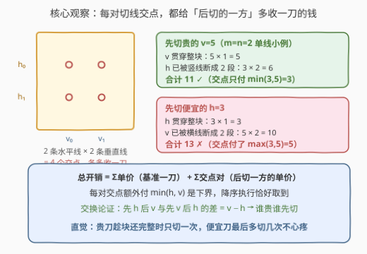
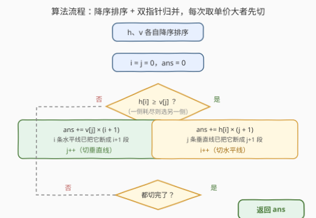
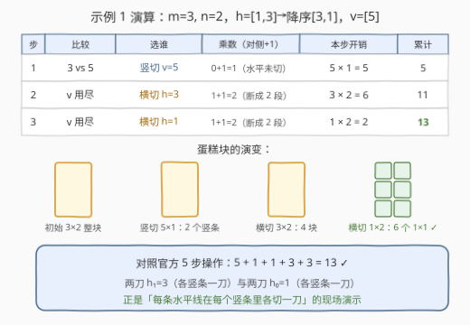

# LeetCode 切蛋糕的最小总开销 I 题解

## 1. 题目概述

- **标题 / 题号**：切蛋糕的最小总开销 I（#3218，medium）
- **链接**：https://leetcode.cn/problems/minimum-cost-for-cutting-cake-i/
- **难度**：中等
- **标签**：贪心、排序、双指针、动态规划、数组

**题意**：有一块 $m \times n$ 的矩形蛋糕，要切成 $1 \times 1$ 的小块。给你整数 $m$、$n$ 和两个数组：

- `horizontalCut[i]`：沿**水平线** $i$（第 $i$ 行与第 $i+1$ 行之间）切一刀的开销；
- `verticalCut[j]`：沿**垂直线** $j$（第 $j$ 列与第 $j+1$ 列之间）切一刀的开销。

每次操作可选任意一个**还不是 $1 \times 1$** 的矩形块，沿一条贯穿它的切割线切成两块，开销为该切割线的固定单价（不随块变小而改变）。求把蛋糕全部切成 $1 \times 1$ 的**最小总开销**。

**示例 1**：

```text
输入：m = 3, n = 2, horizontalCut = [1,3], verticalCut = [5]
输出：13
解释：先沿垂直线 0 贯穿整块切一刀（开销 5）；此后水平线 0 要在两个竖条上各切一次（1×2），
水平线 1 也要各切一次（3×2）。总计 5 + 2 + 6 = 13。
```

**示例 2**：

```text
输入：m = 2, n = 2, horizontalCut = [7], verticalCut = [4]
输出：15
解释：先沿水平线 0 切（7×1）；垂直线 0 需在上下两块各切一次（4×2）。总计 7 + 8 = 15。
```

**约束**：

- $1 \le m, n \le 20$
- `horizontalCut.length == m - 1`，`verticalCut.length == n - 1`
- $1 \le \text{horizontalCut}[i], \text{verticalCut}[j] \le 10^3$

## 2. 解题思路

### 2.1 暴力思路：枚举「下一刀」

最直接的想法是模拟：每一步从当前所有还没切成 $1 \times 1$ 的块里，任选一块、任选一条贯穿它的切割线切开，递归到底取总开销最小的方案。

- **状态空间**：当前块的集合由「已切过哪些线、按什么顺序」完全决定，本质是 $m+n-2$ 条线的一个执行序列空间，**指数级**；
- **可缓解**：注意到「先切哪一刀」只会把蛋糕分成两个**独立子矩形**，子问题互不影响——加记忆化就得到区间 DP（$O(m^2 n^2 (m+n))$，见第 5 节），$m, n \le 20$ 能过；
- **但没必要**：这题的单价是**固定的**，背后藏着更强的结构，可以直接贪到 $O(m \log m + n \log n)$。

### 2.2 核心观察：开销 = 单价 × 刀数，刀数按「交点对」分解



**观察 1（一条线要切几刀）**：水平线 $i$ 必须把**每一列**的第 $i$ 行与第 $i+1$ 行分开。若它执行时蛋糕已被之前的垂直线切成了 $k$ 个竖条，它就得**在每个竖条里各切一刀**——即刀数 = 竖条数。

**观察 2（按交点对分解）**：每条水平线与每条垂直线在原蛋糕上恰有**一个交点**。对这个交点 $(i, j)$：

- 若垂直线 $j$ **先切**：交点所在块被竖着劈开，线 $i$ 在此处被**断成两段**——这条交点给线 $i$ 的刀数 $+1$，额外付 $h_i$；
- 若水平线 $i$ **先切**：对称地，这条交点给线 $j$ 的刀数 $+1$，额外付 $v_j$。

由于线 $i$ 的刀数 = 它最终被切开的段数 = $1 + $ 被断开的交点数，总开销可以精确写成：

$$\text{总开销} \;=\; \underbrace{\sum_i h_i + \sum_j v_j}_{\text{每条线的基准一刀}} \;+\; \sum_{(i,j)\,\text{交点}} \big(\text{后切一方的单价}\big)$$

**每对交点恰好额外收一次钱，收给后切的一方**——这就是贪心的抓手。

**观察 3（贵的先切——交换论证 + 下界）**：对每对交点，额外开销要么付 $h_i$ 要么付 $v_j$，于是

$$\text{总开销} \;\ge\; \sum h + \sum v + \sum_{(i,j)} \min(h_i, v_j)$$

这个下界**取得到**：把两数组分别降序排序后，每次都先切当前**单价最大**的线。相邻两刀的交换论证也很直观——设此前已切 $x$ 条水平线、$y$ 条垂直线，接下来要切一刀水平 $h$ 和一刀垂直 $v$：

- 先 $h$ 后 $v$：$h(y+1) + v(x+2)$
- 先 $v$ 后 $h$：$v(x+1) + h(y+2)$
- 两者之差 $= v - h$ ——**谁贵谁先切**。

如此每对交点都恰好付 $\min(h_i, v_j)$（便宜的晚切、被断开、多付的只是自己的小单价），达到下界，贪心最优。

> 💡 直觉一句话：**先切贵的刀**——它贯穿的块还没被对侧刀切碎，只需切最少次；便宜的刀放到最后，被断成很多段、切很多次也无所谓，单价低。

### 2.3 算法流程图



流程只有三步：

1. `horizontalCut`、`verticalCut` 各自**降序排序**；
2. 双指针 $i, j$ 分别指向两数组头部，**归并取大者**：
   - 取水平线 $h_i$：它已被 $j$ 条垂直线断成 $j+1$ 段 → `ans += h[i] * (j + 1)`，$i{+}{+}$；
   - 取垂直线 $v_j$：它已被 $i$ 条水平线断成 $i+1$ 段 → `ans += v[j] * (i + 1)`，$j{+}{+}$；
3. 两数组耗尽时 `ans` 即答案。

### 2.4 示例演算



以示例 1（$m=3, n=2$，$h=[1,3] \to [3,1]$，$v=[5]$）走一遍归并：

| 步 | 比较 | 选谁 | 乘数（对侧已切 + 1） | 本步开销 | 累计 |
|----|------|------|----------------------|----------|------|
| 1 | $3$ vs $5$ | 竖切 $v=5$ | $0+1=1$（水平线还没切） | $5 \times 1 = 5$ | $5$ |
| 2 | $v$ 耗尽 | 横切 $h=3$ | $1+1=2$（已被竖线断成 2 段） | $3 \times 2 = 6$ | $11$ |
| 3 | $v$ 耗尽 | 横切 $h=1$ | $1+1=2$ | $1 \times 2 = 2$ | $13$ |

与官方解释的 5 步操作（$5 + 1 + 1 + 3 + 3 = 13$）完全一致——两刀水平线 0 的 $1 \times 2$ 与两刀水平线 1 的 $3 \times 2$ 正是「每条线在每个竖条各切一刀」。

## 3. 参考代码

### C++

```cpp
class Solution {
public:
    int minimumCost(int m, int n, vector<int>& horizontalCut, vector<int>& verticalCut) {
        sort(horizontalCut.begin(), horizontalCut.end(), greater<int>());
        sort(verticalCut.begin(), verticalCut.end(), greater<int>());

        int ans = 0;
        int i = 0, j = 0;                       // 双指针：各指向当前最贵的刀
        while (i < m - 1 || j < n - 1) {
            if (j >= n - 1 || (i < m - 1 && horizontalCut[i] >= verticalCut[j])) {
                ans += horizontalCut[i] * (j + 1);   // 已切 j 条垂直线 → 断成 j+1 段
                i++;
            } else {
                ans += verticalCut[j] * (i + 1);     // 已切 i 条水平线 → 断成 i+1 段
                j++;
            }
        }
        return ans;
    }
};
```

> 💡 `int` 足够：每条线至多执行 $\max(m,n) \le 20$ 次、单价 $\le 10^3$、共 $38$ 条线，上界约 $7.6 \times 10^5$。

### Python

```python
class Solution:
    def minimumCost(self, m: int, n: int, horizontalCut: List[int], verticalCut: List[int]) -> int:
        horizontalCut.sort(reverse=True)
        verticalCut.sort(reverse=True)

        ans, i, j = 0, 0, 0
        while i < m - 1 or j < n - 1:
            if j >= n - 1 or (i < m - 1 and horizontalCut[i] >= verticalCut[j]):
                ans += horizontalCut[i] * (j + 1)
                i += 1
            else:
                ans += verticalCut[j] * (i + 1)
                j += 1
        return ans
```

## 4. 复杂度分析

| 维度 | 复杂度 | 说明 |
|------|--------|------|
| **时间** | $O(m \log m + n \log n)$ | 两次降序排序主导；归并双指针仅 $O(m + n)$ |
| **空间** | $O(1)$ | 原地排序 + 常数个变量（不计排序的栈开销） |
| **对比区间 DP** | $O(m^2 n^2 (m+n))$ | $m = n = 20$ 时约 $6.4 \times 10^6$，能过但慢了三个数量级 |

## 5. 扩展：区间 DP 解法与贪心的边界

官方 hints 推荐的是**区间 DP**：设 $dp[x_1][y_1][x_2][y_2]$ 为把**完整一块**的矩形（行 $x_1..x_2$、列 $y_1..y_2$）全切成 $1 \times 1$ 的最小开销。因为状态保证当前矩形是完整一块，任何贯穿它的切割线**一刀切穿、只付一刀的钱**，切成两个更小的完整子块后交给子状态递归：

$$dp[x_1][y_1][x_2][y_2] = \min\begin{cases} \min\limits_{k=x_1}^{x_2-1} h_k + dp[x_1][y_1][k][y_2] + dp[k{+}1][y_1][x_2][y_2] \\ \min\limits_{k=y_1}^{y_2-1} v_k + dp[x_1][y_1][x_2][k] + dp[x_1][k{+}1][x_2][y_2] \end{cases}$$

> ⚠️ 常见坑：把转移写成 $h_k \cdot (\text{宽度})$、$v_k \cdot (\text{高度})$——那是「这条线最终要切几刀」的钱，但子状态内部会把同一条线再切一遍，属于**双重计费**，示例 1 会算出 23 而非 13。「一刀一份钱」由递归结构天然保证：线被对侧刀断成几段，就对应递归树里几个「完整块」节点各切一刀。

```cpp
class Solution {
public:
    int minimumCost(int m, int n, vector<int>& horizontalCut, vector<int>& verticalCut) {
        vector dp(m, vector(n, vector(m, vector(n, 0))));
        for (int hgt = 0; hgt < m; hgt++) {
            for (int wid = 0; wid < n; wid++) {
                for (int x1 = 0; x1 + hgt < m; x1++) {
                    for (int y1 = 0; y1 + wid < n; y1++) {
                        int x2 = x1 + hgt, y2 = y1 + wid;
                        if (hgt == 0 && wid == 0) continue;      // 已是 1x1
                        int best = INT_MAX;
                        for (int k = x1; k < x2; k++)            // 沿水平线 k 切一刀
                            best = min(best, dp[x1][y1][k][y2] + dp[k+1][y1][x2][y2]
                                             + horizontalCut[k]);
                        for (int k = y1; k < y2; k++)            // 沿垂直线 k 切一刀
                            best = min(best, dp[x1][y1][x2][k] + dp[x1][k+1][x2][y2]
                                             + verticalCut[k]);
                        dp[x1][y1][x2][y2] = best;
                    }
                }
            }
        }
        return dp[0][0][m - 1][n - 1];
    }
};
```

**贪心与 DP 的分界线**在于「刀的单价是否固定」：

- **本题**：一条线的单价恒定，开销 = 单价 × 刀数，刀数可按交点对独立分解 → 贪心成立。这也是 [3219. 切蛋糕的最小总开销 II](https://leetcode.cn/problems/minimum-cost-for-cutting-cake-ii/)（$m, n$ 放大到 $10^5$）唯一可行的解法——区间 DP 的四维状态直接爆掉；
- **[1547. 切棍子的最小成本](https://leetcode.cn/problems/minimum-cost-to-cut-a-stick/)**：每刀开销 = **当前块的长度**（价格随切而变），不可按交点分解 → 贪心失效，只能区间 DP。

一句话：**固定单价看交点、变价区间找 DP**。

## 6. 面试要点

1. **为什么贵的刀要先切？**

   交换论证：设已切 $x$ 条水平线、$y$ 条垂直线，接下来是一刀水平 $h$ 与一刀垂直 $v$。先 $h$ 后 $v$ 花费 $h(y{+}1) + v(x{+}2)$，先 $v$ 后 $h$ 花费 $v(x{+}1) + h(y{+}2)$，差为 $v - h$——单价大的先切恒不劣。本质：先切的刀贯穿完整块只切一次，后切的刀被对侧断成多段要切多次，自然让便宜的多受罪。

2. **为什么切水平线的乘数是 $j+1$ 而不是 $j$？**

   水平线至少要把上下两行分开一次（基准刀），之前每切一条垂直线，它就被断成两段、多切一次。执行时已有 $j$ 条垂直线切过 → 恰好被断成 $j+1$ 段，每段一刀。

3. **「先切便宜的」具体亏在哪？用 $h=3,\ v=5$ 说明。**

   先切 $v=5$：$5 \times 1 + 3 \times 2 = 11$；先切 $h=3$：$3 \times 1 + 5 \times 2 = 13$。差 $2 = |5 - 3|$——正是那对交点的额外费用从 $\min(3,5)$ 变成了 $\max(3,5)$。

4. **这题和 1547「切棍子」都是切割问题，为什么一个贪心一个 DP？**

   本题单价固定，总开销可分解为「每条线基准一刀 + 每对交点给后切方一刀」，每对独立取 $\min$ 即达全局下界，贪心可证；1547 的每刀开销是当前块长（价格随状态变化），无法分解，必须区间 DP。判断标准就是**价格是否与切割顺序无关**。

5. **如果数组不排序直接贪心行不行？**

   不行。贪心正确性依赖「每一步都取当前最大单价」，等价于全局降序归并。乱序数组里先遇到小单价就切，会把它放到「分断少」的黄金时刻，让后面的大单价承受更多段数，交换论证立刻给出反例。

## 同类练习题

| # | 题目 | 与本题的关联 |
|---|------|-------------|
| 3219 | [切蛋糕的最小总开销 II](https://leetcode.cn/problems/minimum-cost-for-cutting-cake-ii/) | 同题的规模升级版（$m, n$ 达 $10^5$），区间 DP 彻底失效，本篇贪心 $O(n \log n)$ 直接迁移 |
| 1547 | [切棍子的最小成本](https://leetcode.cn/problems/minimum-cost-to-cut-a-stick/) | 一维切割 + 变价（刀费 = 块长），贪心失效的经典反例，必须区间 DP |
| 1465 | [切割后面积最大的蛋糕](https://leetcode.cn/problems/maximum-area-of-a-piece-of-cake-after-horizontal-and-vertical-cuts/) | 同样的「水平刀 × 垂直刀」模型，改为排序求最大间隔，贪心直觉训练 |
| 1444 | [切披萨的方案数](https://leetcode.cn/problems/number-of-ways-of-cutting-a-pizza/) | 同样的「矩形上切贯穿线」模型从最优化变计数，记忆化搜索 + 前缀和 |
