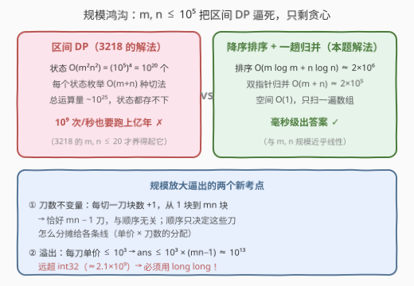
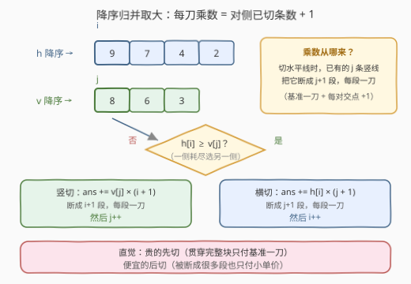
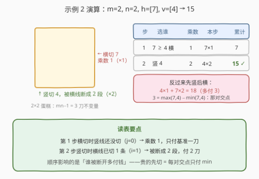

# 切蛋糕的最小总开销 II

- **题目名称**：切蛋糕的最小总开销 II
- **链接**：[3219. 切蛋糕的最小总开销 II](https://leetcode.cn/problems/minimum-cost-for-cutting-cake-ii/)
- **难度**：困难
- **标签**：贪心、排序、数组

## 1. 题目概述

**题意**：有一块 $m \times n$ 的矩形蛋糕，要切成 $1 \times 1$ 的小块。给你整数 $m$、$n$ 和两个数组：

- `horizontalCut[i]`：沿**水平线** $i$（第 $i$ 行与第 $i+1$ 行之间）切一刀的开销；
- `verticalCut[j]`：沿**垂直线** $j$（第 $j$ 列与第 $j+1$ 列之间）切一刀的开销。

每次操作可选任意一个**还不是 $1 \times 1$** 的矩形块，沿一条贯穿它的切割线切成两块，开销为该切割线的固定单价（不随块变小而改变）。求把蛋糕全部切成 $1 \times 1$ 的**最小总开销**。

> 💡 本题题面与 [3218. 切蛋糕的最小总开销 I](https://leetcode.cn/problems/minimum-cost-for-cutting-cake-i/) **完全一致**，连示例都相同，唯一区别是数据规模：3218 限定 $m, n \le 20$（区间 DP 也能过），本题放大到 $m, n \le 10^5$，逼出**唯一可行**的贪心解法。

**示例 1**：

```text
输入：m = 3, n = 2, horizontalCut = [1,3], verticalCut = [5]
输出：13
解释：先沿垂直线 0 切整块（5×1）；水平线 0、1 各需在两个竖条里切一遍
（1×2 + 3×2）。总计 5 + 2 + 6 = 13。
```

**示例 2**：

```text
输入：m = 2, n = 2, horizontalCut = [7], verticalCut = [4]
输出：15
解释：先沿水平线 0 切整块（7×1）；垂直线 0 需在上下两块各切一次（4×2）。
总计 7 + 8 = 15。
```

**约束条件**：

- $1 \le m, n \le 10^5$
- `horizontalCut.length == m - 1`，`verticalCut.length == n - 1`
- $1 \le \text{horizontalCut}[i], \text{verticalCut}[j] \le 10^3$

---

## 2. 解题思路

### 2.1 暴力思路：3218 的区间 DP 在 $10^5$ 下原地爆炸



3218 的官方 hints 推荐区间 DP：$dp[x_1][y_1][x_2][y_2]$ 表示把一个完整矩形块切成 $1 \times 1$ 的最小开销，转移枚举下一刀。它的时间复杂度是 $O(m^2 n^2 (m+n))$——在 $m, n \le 20$ 时约 $6.4 \times 10^6$，轻松通过。

但本题 $m, n \le 10^5$：

- **状态数** $O(m^2 n^2) = (10^5)^4 = 10^{20}$ 个——仅状态数组就要 $4 \times 10^{20}$ 字节，**存都存不下**；
- **转移总量**再乘 $O(m+n) \approx 10^{25}$，以 $10^9$ 次/秒也要跑上亿年。

区间 DP 彻底死亡。规模逼我们去挖掘问题的**结构性质**——好在 3218 里证明过的贪心恰好是那个结构解，且复杂度只有 $O(m \log m + n \log n)$，与 $10^5$ 的规模近乎线性。

### 2.2 核心观察：交点对分解——贵的先切（承接 3218）

贪心的正确性在 3218 篇有完整推导，这里提炼三条观察（细节与区间 DP 对比见 [3218. 切蛋糕的最小总开销 I](https://leetcode.cn/problems/minimum-cost-for-cutting-cake-i/)）：

**观察 1（一条线要切几刀）**：水平线 $i$ 必须把每一列的上下两行分开。若它执行时已有 $j$ 条垂直线切过，它就被断成 $j+1$ 段——**刀数 = 对侧已切条数 + 1**（基准一刀 + 每条对侧线带来的断口）。

**观察 2（按交点对分解，得到下界）**：每条水平线与每条垂直线恰有一个交点，该交点必给**后切的一方**多加一刀。于是

$$\text{总开销} \;=\; \sum_i h_i + \sum_j v_j \;+\; \sum_{(i,j)\,\text{交点}} \big(\text{后切一方的单价}\big) \;\ge\; \sum h + \sum v + \sum_{(i,j)} \min(h_i, v_j)$$

**观察 3（贵的先切，达到下界）**：交换论证——设此前已切 $x$ 条水平线、$y$ 条垂直线，接下来一刀水平 $h$、一刀垂直 $v$：先 $h$ 后 $v$ 花 $h(y{+}1) + v(x{+}2)$，先 $v$ 后 $h$ 花 $v(x{+}1) + h(y{+}2)$，**差为 $v - h$，谁贵谁先切恒不劣**。把两数组降序排序后归并取大，每对交点恰好付 $\min(h_i, v_j)$，达到下界，贪心最优。

**本题新增考点：答案规模与溢出**。规模放大还带来一个隐藏陷阱——答案最大能到多少？用一个**刀数不变量**来估：

> ⚠️ 每切一刀，块数恰好 $+1$；从 $1$ 块到 $mn$ 块，无论顺序如何**恰好执行 $mn - 1$ 刀**。顺序改变的只是这些刀怎么分摊给各条线（即「单价 × 刀数」的分配）。每刀单价 $\le 10^3$，故
>
> $$\text{ans} \;\le\; 10^3 \times (mn - 1) \;\le\; 10^3 \times (10^{10} - 1) \approx 10^{13}$$
>
> （上界可达：所有单价全为 $10^3$ 时总开销恰为 $10^3(mn-1)$。）这远超 `int` 上界 $2.1 \times 10^9$——**必须用 `long long`**，否则样例之外的第一发就 WA。

### 2.3 算法流程图



流程只有三步：

1. `horizontalCut`、`verticalCut` 各自**降序排序**；
2. 双指针 $i, j$ 分别指向两数组头部，**归并取大者**：
   - 取水平线 $h_i$：已被 $j$ 条垂直线断成 $j+1$ 段 → `ans += h[i] * (j + 1)`，$i{+}{+}$；
   - 取垂直线 $v_j$：已被 $i$ 条水平线断成 $i+1$ 段 → `ans += v[j] * (i + 1)`，$j{+}{+}$；
3. 两数组耗尽时 `ans` 即答案（注意累加用 64 位）。

### 2.4 示例演算



以示例 2（$m=2, n=2$，$h=[7]$，$v=[4]$）走一遍归并：

| 步 | 比较 | 选谁 | 乘数（对侧已切 + 1） | 本步开销 | 累计 |
|----|------|------|----------------------|----------|------|
| 1 | $7$ vs $4$ | 横切 $h=7$ | $0+1=1$（垂直线还没切） | $7 \times 1 = 7$ | $7$ |
| 2 | $h$ 耗尽 | 竖切 $v=4$ | $1+1=2$（已被横线断成 2 段） | $4 \times 2 = 8$ | $15$ |

反过来先竖后横则要付 $4 \times 1 + 7 \times 2 = 18$，多出的 $3 = \max(7,4) - \min(7,4)$，正是那对交点的额外费用从付 $\min$ 变成了付 $\max$——交换论证的直接体现。

---

## 3. 参考代码

### C++

```cpp
class Solution {
public:
    long long minimumCost(int m, int n, vector<int>& horizontalCut, vector<int>& verticalCut) {
        sort(horizontalCut.begin(), horizontalCut.end(), greater<int>());
        sort(verticalCut.begin(), verticalCut.end(), greater<int>());

        long long ans = 0;
        int i = 0, j = 0;                       // 双指针：各指向当前最贵的刀
        while (i < m - 1 || j < n - 1) {
            if (j >= n - 1 || (i < m - 1 && horizontalCut[i] >= verticalCut[j])) {
                ans += 1LL * horizontalCut[i] * (j + 1);   // 已切 j 条竖线 → 断成 j+1 段
                i++;
            } else {
                ans += 1LL * verticalCut[j] * (i + 1);     // 已切 i 条横线 → 断成 i+1 段
                j++;
            }
        }
        return ans;
    }
};
```

> 💡 注意两处 64 位：返回值声明为 `long long`；乘法前用 `1LL *` 提升被乘数，避免「`int × int` 先在 32 位里溢出、再赋给 `long long`」的经典错误。极端数据（$m = n = 10^5$、单价全 $10^3$）下答案约 $10^{13}$，`int` 必炸。

### Python

```python
class Solution:
    def minimumCost(self, m: int, n: int, horizontalCut: List[int], verticalCut: List[int]) -> int:
        horizontalCut.sort(reverse=True)
        verticalCut.sort(reverse=True)

        ans, i, j = 0, 0, 0
        while i < m - 1 or j < n - 1:
            if j >= n - 1 or (i < m - 1 and horizontalCut[i] >= verticalCut[j]):
                ans += horizontalCut[i] * (j + 1)
                i += 1
            else:
                ans += verticalCut[j] * (i + 1)
                j += 1
        return ans
```

> 💡 Python 的 `int` 任意精度，无溢出之忧；但仍要**口头说明**上界分析——这是本题区别于 3218 的考点之一。

---

## 4. 复杂度分析

| 维度 | 复杂度 | 说明 |
|------|--------|------|
| **时间** | $O(m \log m + n \log n)$ | 两次降序排序主导；归并双指针仅 $O(m + n)$，对 $10^5$ 规模毫秒级 |
| **空间** | $O(1)$ | 原地排序 + 常数个变量（不计排序的栈开销） |
| **对比区间 DP** | $O(m^2 n^2 (m+n))$ | $m = n = 10^5$ 时约 $10^{25}$，状态数 $10^{20}$ 连内存都放不下——唯一可行解 |

---

## 5. 扩展：值域 $10^3$，计数排序再省一个 $\log$

两个数组元素范围是 $[1, 10^3]$，值域 $V = 1000$ 极小，可用**计数排序**替代比较排序，把总复杂度压到 $O(m + n + V)$：

```cpp
class Solution {
public:
    long long minimumCost(int m, int n, vector<int>& horizontalCut, vector<int>& verticalCut) {
        auto descCountingSort = [](vector<int>& a) {
            int cnt[1001] = {0};
            for (int x : a) cnt[x]++;
            int k = 0;
            for (int v = 1000; v >= 1; v--)
                while (cnt[v]--) a[k++] = v;          // 从大到小回填，原地降序
        };
        descCountingSort(horizontalCut);
        descCountingSort(verticalCut);

        long long ans = 0;
        int i = 0, j = 0;
        while (i < m - 1 || j < n - 1) {
            if (j >= n - 1 || (i < m - 1 && horizontalCut[i] >= verticalCut[j])) {
                ans += 1LL * horizontalCut[i] * (j + 1);
                i++;
            } else {
                ans += 1LL * verticalCut[j] * (i + 1);
                j++;
            }
        }
        return ans;
    }
};
```

实际收益有限（$\log 10^5 \approx 17$，归并本身仍是 $O(m+n)$），但面试中能主动指出「**值域小 → 计数排序**」是标准的加分项；若值域放大到 $10^9$，就只能回到比较排序。

---

## 6. 面试要点

1. **3218 和 3219 题面一模一样，为什么一个中等一个困难？**

   区别全在数据规模。3218 的 $m, n \le 20$ 养得起 $O(m^2 n^2 (m+n))$ 的区间 DP，贪心只是「更优」；3219 的 $m, n \le 10^5$ 让区间 DP 的状态数达到 $10^{20}$、彻底不可行，**必须**想到并会证明 $O(n \log n)$ 贪心，同时答案规模逼出 `long long`。难度差 = 「可暴力可贪心」vs「只有一条活路 + 溢出陷阱」。

2. **如何快速判断这题需要 `long long`？**

   用刀数不变量：每切一刀块数 $+1$，从 $1$ 块到 $mn$ 块**恰好 $mn-1$ 刀**（与顺序无关）；每刀单价 $\le 10^3$，故答案 $\le 10^3 \times (mn-1) \approx 10^{13} > 2.1 \times 10^9$。乘积先按最坏情况算数量级，再对照 32 位上界——这是判断溢出的通用手法。

3. **为什么贵的刀要先切？**

   交换论证：设已切 $x$ 条水平线、$y$ 条垂直线，接下来是水平 $h$ 与垂直 $v$ 各一刀。先 $h$ 后 $v$ 花 $h(y{+}1) + v(x{+}2)$，先 $v$ 后 $h$ 花 $v(x{+}1) + h(y{+}2)$，差为 $v - h$——单价大的先切恒不劣。本质：先切的刀贯穿完整块只付基准一刀，后切的刀被对侧断成多段要多付，自然让便宜的多受罪。

4. **乘数为什么是「对侧已切条数 + 1」而不是对侧条数？**

   任何一条线都要先把相邻两行/列**至少分开一次**（基准一刀）；此前每切一条对侧线，它就被断成两段、再多切一次。执行时已有 $j$ 条对侧线 → 恰好 $j+1$ 段、$j+1$ 刀。

5. **这套贪心什么情况下失效？**

   单价必须与切割顺序/状态无关。一旦每刀开销取决于当前块的形态（如 [1547. 切棍子的最小成本](https://leetcode.cn/problems/minimum-cost-to-cut-a-stick/) 中刀费 = 当前块长），「交点对独立分解 + 每对取 $\min$」的下界论证不再成立，只能回到区间 DP。判断口诀：**固定单价看交点、变价区间找 DP**。

---

## 7. 同类练习题

- [3218. 切蛋糕的最小总开销 I](https://leetcode.cn/problems/minimum-cost-for-cutting-cake-i/)：本题的小规模版（$m, n \le 20$），区间 DP 可过；贪心的完整推导（观察 1–3）与 DP 实现在那一篇
- [1547. 切棍子的最小成本](https://leetcode.cn/problems/minimum-cost-to-cut-a-stick/)：一维变价切割（刀费 = 当前块长），贪心失效的经典反例，必须区间 DP
- [1465. 切割后面积最大的蛋糕](https://leetcode.cn/problems/maximum-area-of-a-piece-of-cake-after-horizontal-and-vertical-cuts/)：同样的「水平刀 × 垂直刀」模型，排序求最大间隔，贪心直觉训练
- [1444. 切披萨的方案数](https://leetcode.cn/problems/number-of-ways-of-cutting-a-pizza/)：同样的矩形贯穿切割模型从最优化变计数，记忆化搜索 + 前缀和
