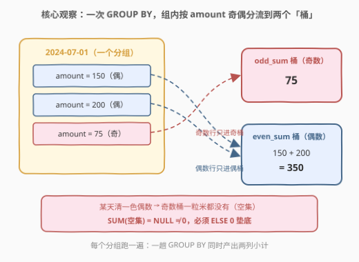
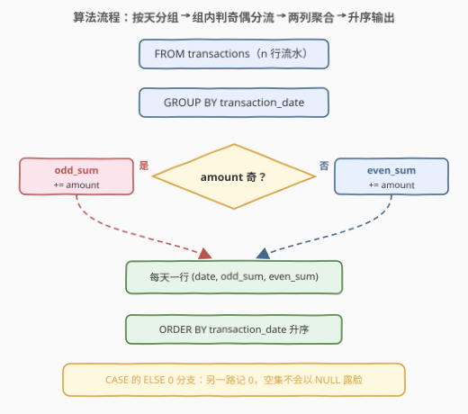
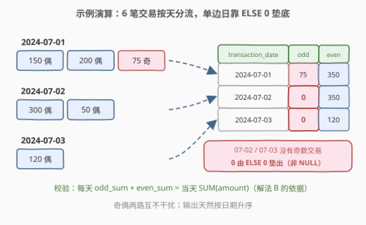

# 奇数和偶数交易

- **题目名称**：奇数和偶数交易
- **链接**：[3220. 奇数和偶数交易](https://leetcode.cn/problems/odd-and-even-transactions/)
- **难度**：中等
- **标签**：数据库、SQL、聚合、`GROUP BY`、条件聚合、`SUM()`、`CASE WHEN`、`MOD()`、位运算

## 1. 题目概述

**表结构**：`transactions`

| 列名 | 类型 |
|------|------|
| transaction_id | int |
| amount | int |
| transaction_date | date |

- `transaction_id` 唯一标识表中的每一行。
- 每行包含交易 id、金额与交易日期。

**目标**：编写一个解决方案，查找每天**奇数**交易金额和**偶数**交易金额的**总和**。如果某天没有奇数或偶数交易，显示为 `0`。

结果表以 `transaction_date` **升序**排序，包含以下列：

- `transaction_date`：交易日期。
- `odd_sum`：当天金额为奇数的交易总额。
- `even_sum`：当天金额为偶数的交易总额。

**示例 1**：

```text
输入：
transactions 表：
+----------------+--------+------------------+
| transaction_id | amount | transaction_date |
+----------------+--------+------------------+
| 1              | 150    | 2024-07-01       |
| 2              | 200    | 2024-07-01       |
| 3              | 75     | 2024-07-01       |
| 4              | 300    | 2024-07-02       |
| 5              | 50     | 2024-07-02       |
| 6              | 120    | 2024-07-03       |
+----------------+--------+------------------+

输出：
+------------------+---------+----------+
| transaction_date | odd_sum | even_sum |
+------------------+---------+----------+
| 2024-07-01       | 75      | 350      |
| 2024-07-02       | 0       | 350      |
| 2024-07-03       | 0       | 120      |
+------------------+---------+----------+
```

**解释**：

- **2024-07-01**：奇数交易金额总和 `75`；偶数交易金额总和 $150 + 200 = 350$。
- **2024-07-02**：没有奇数交易，`odd_sum = 0`；偶数交易金额总和 $300 + 50 = 350$。
- **2024-07-03**：没有奇数交易，`odd_sum = 0`；偶数交易金额总和 `120`。

> 💡 **审题关键**：① 输出的每一天都来自表中**实际出现的日期**——`GROUP BY transaction_date` 天然完成这一点，不需要补全缺失的日历；② 「没有奇数（或偶数）交易显示为 0」指的是**某天清一色单偶/单奇时另一列置 0**——而 `SUM` 作用在空集上返回的是 `NULL` 不是 `0`，这是本题唯一的坑；③ 奇偶按 **`amount` 的值**判定（示例 1：75 是奇数金额才进了 `odd_sum`），与 `transaction_id` 无关；④ 结果按日期升序。

---

## 2. 解题思路

### 2.1 暴力思路：两个子查询各自分组再对齐

最直觉的拆法：奇数一笔查询、偶数一笔查询，再按日期拼成一行——

```sql
SELECT o.transaction_date, o.s AS odd_sum, e.s AS even_sum
FROM (SELECT transaction_date, SUM(amount) AS s FROM transactions
      WHERE amount % 2 = 1 GROUP BY transaction_date) o
FULL OUTER JOIN                                        -- MySQL：没有 FULL JOIN！
     (SELECT transaction_date, SUM(amount) AS s FROM transactions
      WHERE amount % 2 = 0 GROUP BY transaction_date) e
     ON o.transaction_date = e.transaction_date;
```

- **正确性**：能修对，但要打三个补丁——MySQL 没有 `FULL OUTER JOIN`（得 `LEFT JOIN ... UNION ... RIGHT JOIN` 模拟）；只出现奇数（或偶数）的日期另一侧 miss 出 `NULL`，还得 `COALESCE` 补 0；两侧 `WHERE` 各扫一遍表。
- **效率**：两趟过滤分组 $O(2n)$，再对齐 $O(d)$（$d$ = 不同日期数），常数翻倍。
- **别扭之处**：明明是「**一个分组里的两类小计**」，却被拆成「**两张表的对齐问题**」。

> ⚠️ 瓶颈在于把组内分类当成了表间连接。突破口：**一次 `GROUP BY`，组内条件分流**——条件聚合。

### 2.2 核心观察：条件聚合——一次 GROUP BY 同时算两个和



**观察 1（分组维度唯一）**：输出粒度是「天」，分组键就是 `transaction_date`（列类型已是 `DATE`，无需截断）。`GROUP BY` 只产出表中出现过的日期，恰好满足「只输出有交易的日子」。

**观察 2（条件聚合 = 组内分流记账）**：

```sql
SUM(CASE WHEN amount % 2 <> 0 THEN amount ELSE 0 END)
```

在每个分组内部把行分成两路：奇数行贡献自己的金额，偶数行贡献 0——两列 `SUM` 在**同一次分组扫描**里各自累加、互不干扰。这就是**条件聚合（conditional aggregation）**。它与 `WHERE` 的分工是：`WHERE` 决定**哪些行进组**，`CASE` 决定**组内每行给哪列记账**。

**观察 3（ELSE 0 是空集陷阱的解药）**：某天若全是偶数，奇数路一行都没命中。`SUM(CASE WHEN ... THEN amount END)`（省略 `ELSE`）对这些组求和时参与的全是 NULL，结果为 `NULL`——而题目要 `0`。写上 `ELSE 0`，每列每组都至少累加一串 0，空集自然被垫成 0。等价写法是外层 `COALESCE(SUM(...), 0)`，但 `ELSE 0` 更内联。

**观察 4（奇偶判定的负数坑）**：MySQL 取模结果的符号跟被除数走：`MOD(-3, 2) = -1`，于是 `amount % 2 = 1` 会漏掉负奇数。写 `amount % 2 <> 0`，或用位运算 `amount & 1`（取二进制最低位，补码下负奇数也是 1），就与符号无关。本题数据大概率非负，但这是零成本的防御性写法。

### 2.3 算法流程图



**逻辑执行步骤**：

| 步骤 | 表达式 | 作用 |
|------|--------|------|
| ① 分组 | `GROUP BY transaction_date` | 每个有交易的日期各成一组 |
| ② 奇数记账 | `SUM(CASE WHEN amount % 2 <> 0 THEN amount ELSE 0 END)` | 组内奇数行累入 `odd_sum`，其余记 0 |
| ③ 偶数记账 | `SUM(CASE WHEN amount % 2 = 0 THEN amount ELSE 0 END)` | 组内偶数行累入 `even_sum`，其余记 0 |
| ④ 排序 | `ORDER BY transaction_date` | 题目要求的升序输出 |

### 2.4 示例演算



| 日期 | 组内交易（奇/偶） | odd_sum | even_sum |
|------|------------------|---------|----------|
| 2024-07-01 | 150 偶、200 偶、75 奇 | 75 | $150 + 200 = 350$ |
| 2024-07-02 | 300 偶、50 偶 | 无奇数 → **ELSE 0** | $300 + 50 = 350$ |
| 2024-07-03 | 120 偶 | 无奇数 → **ELSE 0** | 120 |

后两天没有一笔奇数交易，`odd_sum` 全靠 `CASE` 的 `ELSE 0` 分支兜底——这正是「显示为 0」要求的落点；顺带可校验每天 $\text{odd\_sum} + \text{even\_sum} = \text{当天 SUM(amount)}$，为解法 B 铺路。

---

## 3. 参考代码

### SQL（解法 A：CASE WHEN 条件聚合，推荐）

```sql
# Write your MySQL query statement below
SELECT transaction_date,
       SUM(CASE WHEN amount % 2 <> 0 THEN amount ELSE 0 END) AS odd_sum,
       SUM(CASE WHEN amount % 2 = 0  THEN amount ELSE 0 END) AS even_sum
FROM transactions
GROUP BY transaction_date
ORDER BY transaction_date;
```

> 💡 **写法要点**：
> - 一趟扫描完成分组与两列小计；`CASE` 决定组内每行给哪列记账，`ELSE 0` 保证空集得 0 而非 NULL。
> - 奇数判定用 `<> 0` 而非 `= 1`，免疫负数取模的符号问题（`MOD(-3, 2) = -1`）。
> - `CASE WHEN` 是标准 SQL，MySQL / PostgreSQL / SQL Server 通用（后者的取模运算符同为 `%`）。

### SQL（解法 B：奇偶指示位算术——用减法省掉第二个条件）

```sql
# Write your MySQL query statement below
SELECT transaction_date,
       SUM(amount * (amount & 1))               AS odd_sum,
       SUM(amount) - SUM(amount * (amount & 1)) AS even_sum
FROM transactions
GROUP BY transaction_date
ORDER BY transaction_date;
```

> 💡 **写法要点**：
> - `amount & 1` 是 0/1 **奇偶指示位**（位与取最低位，负奇数也得 1）：`amount * (amount & 1)` 让奇数行贡献原值、偶数行贡献 0——乘法版的条件聚合，天然无空集 NULL 问题。
> - 每行金额**恰好**落入奇、偶一边，故 $\text{even\_sum} = \text{SUM(amount)} - \text{odd\_sum}$，第二个 `CASE` 被减法替代。
> - 与解法 A 完全等价；面试先写 A 保清晰，再补 B 展示算术视角。

### Python（pandas）

```python
import pandas as pd


def sum_daily_odd_even(transactions: pd.DataFrame) -> pd.DataFrame:
    df = transactions.assign(
        odd_sum=transactions["amount"].where(transactions["amount"] % 2 != 0, 0),
        even_sum=transactions["amount"].where(transactions["amount"] % 2 == 0, 0),
    )
    return (
        df.groupby("transaction_date", as_index=False)[["odd_sum", "even_sum"]]
          .sum()
          .sort_values("transaction_date")
          .reset_index(drop=True)
    )
```

> 💡 **pandas 对照**：
> - `.where(cond, 0)` 对应 `CASE WHEN ... THEN amount ELSE 0 END`：条件不满足处填 0，组内全 0 求和仍是 0，空集问题从根上消失。
> - Python 的 `%` 对负数取**非负余数**（`-3 % 2 == 1`），奇偶判定无坑；若用 `& 1` 语义相同。
> - `groupby(..., as_index=False)` 让分组键留在列上，聚合后直接就是结果三列。

---

## 4. 复杂度分析

| 维度 | 复杂度 | 说明 |
|------|--------|------|
| **时间（条件聚合）** | $O(n)$ | 哈希聚合一趟扫描；排序型聚合 $O(n \log d)$，$d$ = 不同日期数 |
| **时间（暴力两趟）** | $O(2n + d)$ | 奇偶各扫一遍表再对齐连接，常数与出错面都更大 |
| **空间** | $O(d)$ | 聚合中间表每组一行，输出 $d$ 行，$d \le n$ |

> $n$ = `transactions` 行数。若表在 `transaction_date` 上有索引，分组可借有序性省去排序，整体进一步降低。

---

## 5. 扩展：条件聚合的进阶玩法

### 5.1 FILTER 子句：SQL 标准的条件聚合语法

PostgreSQL / SQLite 3.30+ 支持 `SUM(...) FILTER (WHERE ...)`，把「只对满足条件的行做聚合」写成显式语法：

```sql
SELECT transaction_date,
       COALESCE(SUM(amount) FILTER (WHERE amount % 2 <> 0), 0) AS odd_sum,
       COALESCE(SUM(amount) FILTER (WHERE amount % 2 = 0), 0)  AS even_sum
FROM transactions
GROUP BY transaction_date
ORDER BY transaction_date;
```

注意 FILTER 同样有空集 NULL 问题——单边日期的组依然要 `COALESCE` 兜 0；MySQL 8.x 尚不支持 FILTER，只能用 `CASE` / `IF`。

### 5.2 从两列到透视：条件聚合就是手写 PIVOT

本题是把行按奇偶折成两列；同一骨架可折任意多列（按金额区间、按状态……），这就是**手写透视表**：

```sql
-- 按 amount 区间折三列的骨架（MySQL 布尔表达式即 0/1）
SELECT transaction_date,
       SUM(amount * (amount <= 100))                 AS small_sum,
       SUM(amount * (amount BETWEEN 101 AND 1000))   AS mid_sum,
       SUM(amount * (amount > 1000))                 AS large_sum
FROM transactions
GROUP BY transaction_date;
```

前提是口径互斥：每行恰好命中一列时各列和守恒；区间一旦重叠就会「一钱多记」，动手前先画清楚边界。

### 5.3 真要补日历怎么办

若需求改成「没有交易的日期也输出一行 0/0」，`GROUP BY` 就不够了——得用**递归 CTE** 生成「最早日 ~ 最晚日」的连续日期序列，再与聚合结果 `LEFT JOIN` 补零。本题明确只输出有交易的日期，别画蛇添足。

---

## 6. 面试要点

1. **为什么 `SUM(CASE WHEN ... THEN amount END)` 不写 `ELSE` 会得 NULL？怎么改？**

   `SUM` 跳过 NULL；组内若没有一行命中 `THEN` 分支，参与求和的清一色是 NULL（空集），结果为 `NULL` 而非 0。补 `ELSE 0`（或外层 `COALESCE(SUM(...), 0)`）即可。本题「没有奇数/偶数交易显示 0」考的就是这一条。

2. **`amount % 2 = 1` 判奇数有什么隐患？**

   MySQL 取模结果符号跟被除数：`MOD(-3, 2) = -1`，负奇数判不中。用 `amount % 2 <> 0` 或 `amount & 1` 免疫。另外注意判的是 `amount` 的奇偶，别顺手写成 `transaction_id`——示例 1 里 id 为 1、3 的交易若按 id 判，`odd_sum` 就成 225 了。

3. **为什么不用两个子查询分别过滤奇偶再 JOIN？**

   功能上可行，但：MySQL 没有 `FULL OUTER JOIN`，单边日期要用 `LEFT JOIN UNION RIGHT JOIN` 模拟；两侧都要补 0；表扫两遍。条件聚合把「筛选」内嵌进「聚合」，一趟扫描、一个分组、两列小计，正确性与简洁性全面占优。

4. **`WHERE amount % 2 <> 0` 与 `SUM(CASE WHEN amount % 2 <> 0 ...)` 的本质区别？**

   `WHERE` 是行级过滤，发生在分组**之前**，被过滤的行整行消失——那天若是纯偶数，连日期都不出现在结果里；`CASE` 是组内记账，行保留，只决定给哪列贡献。要「每个日期都输出且两列各有小计」，必须用后者。

5. **`GROUP BY transaction_date` 之前还要 `DATE()` 截断吗？**

   本题列类型就是 `DATE`，不需要。若列是 `DATETIME` / `TIMESTAMP`，直接按原值分组会细到秒、每天碎成无数组，得先 `GROUP BY DATE(transaction_date)` 降维——这是本题最常见的一步追问。

---

## 7. 同类练习题

- [1193. 每月交易 I](https://leetcode.cn/problems/monthly-transactions-i/)：`SUM(IF(state = 'approved', amount, 0))` 的标准条件聚合，本题的多列进阶版
- [620. 有趣的电影](https://leetcode.cn/problems/not-boring-movies/)：`id % 2 = 1` 的行级奇偶过滤——对照本题「WHERE 判奇偶」与「CASE 判奇偶」的分工
- [1211. 查询结果的质量和百分比](https://leetcode.cn/problems/queries-quality-and-percentage/)：聚合内按条件换算值（rating < 3 记 0），同一「聚合中嵌条件」套路
- [1484. 按日期分组销售产品](https://leetcode.cn/problems/group-sold-products-by-the-date/)：同为按日期 GROUP BY 的小报表题，附带 `GROUP_CONCAT` 字符串聚合
- [1251. 平均售价](https://leetcode.cn/problems/average-selling-price/)：按日期区间条件加权聚合，条件聚合 + 连接的综合版
