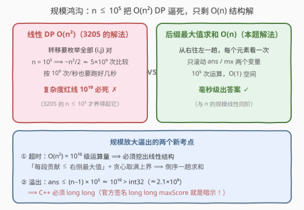
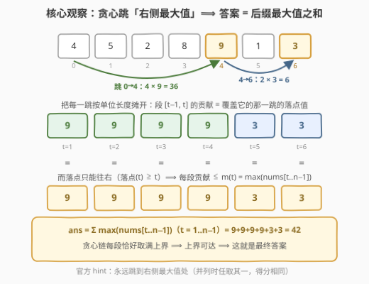
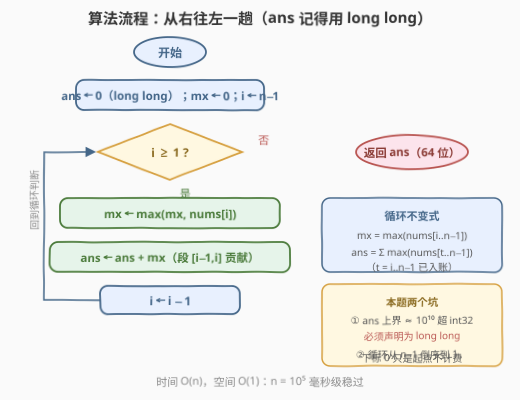
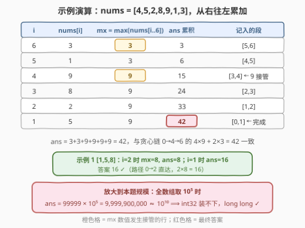

# 最大数组跳跃得分 II

- **题目名称**：最大数组跳跃得分 II
- **链接**：[3221. 最大数组跳跃得分 II 🔒](https://leetcode.cn/problems/maximum-array-hopping-score-ii/)
- **难度**：中等
- **标签**：栈、贪心、数组、单调栈

## 1. 题目概述

> ⚠️ 本题为 LeetCode 付费题（锁题），题意描述根据官方示例用例与外部资料重建，可能与官方题面有出入。（题面已与社区镜像 doocs/leetcode 的官方中文翻译交叉核对，示例输入输出与 GraphQL 接口返回一致，且两个示例答案均已用暴力 DP 独立验证，出入风险较低。）

给定一个数组 `nums`，你必须**从下标 0 开始**跳跃，直到**到达数组的最后一个元素**，使得获得**最大**分数。

每一次**跳跃**中，你可以从下标 $i$ 跳到一个 $j > i$ 的下标，并且可以得到 $(j - i) \times nums[j]$ 的分数。

返回你能够取得的最大分数。

一句话读题：从下标 0 出发、最终停在下标 $n-1$，每跳一步按「**跨度 × 落点值**」计分，求最大总分。

> 💡 本题与 [3205. 最大数组跳跃得分 I 🔒](https://leetcode.cn/problems/maximum-array-hopping-score-i/) **题面与示例完全相同**，唯一区别是数据规模：3205 限定 $n \le 10^3$（$O(n^2)$ DP 可过），本题放大到 $n \le 10^5$，逼出 $O(n)$ 解法；同时答案上界从 $10^8$ 涨到 $10^{10}$，返回类型换成 64 位整数。

**示例 1**：

```text
输入：nums = [1,5,8]
输出：16
解释：有两种方式到达最后一个元素：
     0 -> 1 -> 2，得分为 (1-0)*5 + (2-1)*8 = 13；
     0 -> 2，    得分为 (2-0)*8 = 16。取最大值 16。
```

**示例 2**：

```text
输入：nums = [4,5,2,8,9,1,3]
输出：42
解释：按 0 -> 4 -> 6 跳跃，得分为 (4-0)*9 + (6-4)*3 = 36 + 6 = 42。
```

**约束条件**：

- $2 \le nums.length \le 10^5$
- $1 \le nums[i] \le 10^5$

> 💡 读题关键盯两处：其一，$n \le 10^5$ 意味着 $O(n^2) \approx 10^{10}$ 次运算**必超时**，3205 里能混过去的平方 DP 这次彻底出局，算法必须线性（或 $n \log n$）；其二，计分公式 $(j-i) \times nums[j]$ 用**落点值**，答案上界 $(n-1) \times \max(nums) \approx 10^{10}$，**远超 32 位 `int`**——官方函数签名 `long long maxScore` 本身就是最后一道防溢出提示。

---

## 2. 解题思路

### 2.1 暴力思路：线性 DP，$O(n^2)$——这次真过不了

跳跃链是下标严格递增的路径 $0 = i_0 < i_1 < \cdots < i_m = n-1$，天然具备**无后效性**。按官方 hints 的定义，记：

$$dp[i] = \text{从下标 } i \text{ 出发跳到末尾 } n-1 \text{ 的最大得分}$$

倒序刷表，枚举下一跳的落点 $j > i$：

$$dp[i] = \max_{j > i} \big\{ (j - i) \times nums[j] + dp[j] \big\}, \qquad dp[n-1] = 0$$

答案是 $dp[0]$。算一笔账：

| 场景 | $n$ | 运算量 | 结果 |
|------|-----|--------|------|
| 3205 | $10^3$ | $\sim 5 \times 10^5$ | 轻松通过 ✓ |
| 本题 | $10^5$ | $\sim 5 \times 10^9$ | 按每秒 $10^9$ 次也要跑好几秒，**必 TLE** ✗ |



> ⚠️ 卡点：DP 对**每一对** $(i,j)$ 独立做一次比较，这是 $O(n^2)$ 的根源。突破口是把「一跳的得分」按**单位长度摊开**——摊开后每一段的贡献有一个只与位置 $t$ 有关的上界，而上界可以倒序一趟滚动维护，根本不需要逐对比较。

### 2.2 核心观察：单位段分解 + 后缀最大值，$O(n)$（承接 3205）

完整推导见 [3205 篇 2.2 节](https://leetcode.cn/problems/maximum-array-hopping-score-i/)，本题必须掌握 $O(n)$ 版，提炼三步：

**观察 1（把每一跳摊成单位段）**：落在 $i_{k+1}$ 的那一跳覆盖 $(i_k, i_{k+1}]$ 里的每段单位区间 $[t-1, t]$（共 $i_{k+1} - i_k$ 段），每段贡献 $nums[i_{k+1}]$。于是总分可以**逐段**重写：

$$\text{总分} = \sum_{t=1}^{n-1} nums[\text{落点}(t)]$$

**观察 2（每段贡献有上界）**：跳只能往右，落点(t) $\ge t$，所以：

$$nums[\text{落点}(t)] \le \max(nums[t..n-1]) \;\triangleq\; m(t) \quad\Longrightarrow\quad ans \le \sum_{t=1}^{n-1} m(t)$$

**观察 3（上界可以达到）**：贪心地「每一跳都落在右侧剩余部分的**最大值**处」（官方 hint 原话：*It's always optimal to jump to index j with the maximum value*，并列时任取其一）。对每段 $t \in (i_k, i_{k+1}]$ 两侧夹逼可得 $nums[\text{落点}(t)] = m(t)$——**每一段都恰好取满上界**，所以：

$$ans = \sum_{t=1}^{n-1} \max(nums[t..n-1])$$



**本题新增考点：溢出**。规模放大还带来一个隐藏陷阱——答案最大能到多少？由求和式，每段贡献 $\le 10^5$，共 $n - 1 \le 99999$ 段：

> ⚠️ $$ans \;\le\; (n-1) \times \max(nums) \;=\; 99999 \times 10^5 \approx 10^{10}$$
>
> （上界可达：全数组都取 $10^5$ 时每段后缀最大值都是 $10^5$。）这远超 `int` 上界 $2.1 \times 10^9$——**C++ 的 `ans` 必须声明为 `long long`**，否则除两个样例外的第一发大数据就 WA；Python 天然大整数，无感。

> 💡 一个记忆钩子：把 $[t-1, t]$ 想象成一段过路费，谁承包这段路（那一跳的落点）就按谁的价值收费——当然让**右侧还没错过的最大值**来承包。全部摊开后，答案就是**后缀最大值之和**，从右往左加一遍就完事。

### 2.3 算法流程图

求和式只需**从右往左一趟**滚动维护 $\max$：



流程共五步：

1. 初始化 `ans = 0`（**`long long`**）、`mx = 0`（后缀最大值）；
2. 倒序枚举 $i$ 从 $n-1$ 到 $1$；
3. `mx = max(mx, nums[i])`，此时 `mx = max(nums[i..n-1])`；
4. `ans += mx`，把段 $[i-1, i]$ 记为后缀最大值；
5. 循环结束返回 `ans`。

若面试官追问「具体怎么跳」，用**单调栈**还原路径（见 5.1，也是官方题解的写法）。

### 2.4 示例演算

以 `nums = [4,5,2,8,9,1,3]` 为例，从右往左逐行累加：



| $i$ | $nums[i]$ | $mx=\max(nums[i..6])$ | $ans$ 累积 | 记入的段 |
|-----|-----------|------------------------|-----------|----------|
| 6 | 3 | **3** | 3 | $[5,6]$ |
| 5 | 1 | 3 | 6 | $[4,5]$ |
| 4 | 9 | **9** | 15 | $[3,4]$，9 接管 |
| 3 | 8 | 9 | 24 | $[2,3]$ |
| 2 | 2 | 9 | 33 | $[1,2]$ |
| 1 | 5 | 9 | 42 | $[0,1]$，完成 |

$ans = 3+3+9+9+9+9 = 42$，与贪心路径 $0 \to 4 \to 6$ 的 $4 \times 9 + 2 \times 3 = 42$ 完全一致。示例 1 `[1,5,8]` 同法：$i=2$ 时 $mx=8$、$ans=8$；$i=1$ 时 $ans=16$，答案 16（路径 $0 \to 2$ 直达）。

---

## 3. 参考代码

### C++

```cpp
class Solution {
  public:
    long long maxScore(vector<int>& nums) {
        long long ans = 0;                     // 上界 ≈ 10^10，必须 64 位
        int mx = 0;                            // nums[i] ≤ 10^5，int 足够
        for (int i = (int)nums.size() - 1; i >= 1; --i) {
            mx = max(mx, nums[i]);             // mx = max(nums[i..n-1])
            ans += mx;                         // 段 [i-1, i] 记为后缀最大值
        }
        return ans;
    }
};
```

### Python

```python
class Solution:
    def maxScore(self, nums: List[int]) -> int:
        ans = mx = 0
        for i in range(len(nums) - 1, 0, -1):  # 倒序枚举每个落点区间
            mx = max(mx, nums[i])              # mx = max(nums[i..n-1])
            ans += mx                          # 段 [i-1, i] 记为后缀最大值
        return ans
```

> 💡 细节盘点：循环从 $n-1$ 跑到 $1$（下标 0 永远只是起点、不产生得分项）；`mx` 初值取 0 即可，因 $nums[i] \ge 1$，第一轮就被覆盖。与 3205 的 `int` 版相比**只差两处**（返回类型与 `ans` 类型），孪生题迁移成本极低——但漏改就是 WA，这是本题最便宜的失分点。$n \le 10^5$ 下一趟循环毫秒级完成，$O(n^2)$ DP 则要 $5 \times 10^9$ 次运算，差出 4 个数量级。

---

## 4. 复杂度分析

| 维度 | 复杂度 | 说明 |
|------|--------|------|
| 时间复杂度 | $O(n)$ | 从右往左一趟，$n = 10^5$ 毫秒级 |
| 空间复杂度 | $O(1)$ | 只滚动 `ans` / `mx` 两个变量 |
| 暴力对照 | $O(n^2)$ / $O(n)$ | 2.1 线性 DP：3205 可过、本题必 TLE 的分水岭 |

---

## 5. 扩展

### 5.1 官方单调栈解法：一遍扫描顺带还原跳跃链

官方标签里的「栈 / 单调栈」对应题解的标准写法：从左到右维护从栈底到栈顶**值严格递减**的下标栈——遇到 $nums[i]$ 时不断弹掉所有值 $\le nums[i]$ 的栈顶，再压入 $i$。最终栈中下标（自底向上）加上起点 0 就是一条**最优落点链**，按 $(j - i) \times nums[j]$ 逐跳累加。正确性与「跳右侧最大值」的贪心等价：栈中每个下标都是「右侧没有更大值」的**严格后缀记录**，相邻栈元素之间的元素值都不超过后者，恰好让每一段都取满 $m(t)$。

```cpp
class Solution {
  public:
    long long maxScore(vector<int>& nums) {
        vector<int> stk;                       // 值严格递减的下标栈
        for (int i = 0; i < (int)nums.size(); ++i) {
            while (!stk.empty() && nums[stk.back()] <= nums[i]) {
                stk.pop_back();
            }
            stk.push_back(i);
        }
        long long ans = 0;                     // 同样要 64 位
        int i = 0;                             // 当前落点，从起点 0 出发
        for (int j : stk) {                    // 栈底→栈顶 = 最优落点链
            ans += (long long)(j - i) * nums[j];
            i = j;
        }
        return ans;
    }
};
```

```python
class Solution:
    def maxScore(self, nums: List[int]) -> int:
        stk = []                               # 值严格递减的下标栈
        for i, x in enumerate(nums):
            while stk and nums[stk[-1]] <= x:
                stk.pop()
            stk.append(i)
        ans = i = 0                            # i 是当前落点，从起点 0 出发
        for j in stk:                          # 栈底→栈顶 = 最优落点链
            ans += (j - i) * nums[j]
            i = j
        return ans
```

对示例 2：栈的演化依次为 `[0] → [1] → [1,2] → [3] → [4] → [4,5] → [4,6]`，最终 `[4,6]` 即落点链，路径 $0 \to 4 \to 6$。官方 hints 的另一等价实现是预处理 `suffixMax[i] = (max(nums[i..n-1]), 对应下标)`，从 0 出发反复「跳到右侧最大值」模拟——两种写法都取满每段上界，复杂度同为 $O(n)$ / $O(n)$。

### 5.2 跳跃得分家族三题对照

| 题号 | 计分公式 | 关键和式 | 贪心策略 | 备注 |
|------|----------|----------|----------|------|
| [3205](https://leetcode.cn/problems/maximum-array-hopping-score-i/) 🔒 | $(j-i) \times nums[j]$（落点值） | $\sum$ **后缀**最大值 | 跳到右侧最大值 | $n \le 10^3$，$O(n^2)$ DP 可过 |
| **3221（本题）** 🔒 | 同上 | 同上 | 同上 | $n \le 10^5$ 逼出 $O(n)$ + `long long` |
| [3282](https://leetcode.cn/problems/reach-end-of-array-with-max-score/) | $(j-i) \times nums[i]$（**起点**值） | $\sum$ **前缀**最大值 | 跳到下一个更大值 | 免费题，周赛 414 Q3，镜像对照 |

三题同一套**单位段分解**手法，区别只在「这段路归谁承包」：落点值计分 ⟹ 后缀 $\max$；起点值计分 ⟹ 前缀 $\max$。数据规模再变，也只是「DP 能否混过」与「是否需要 64 位」两档变化。

---

## 6. 面试要点

1. **为什么 $O(n^2)$ DP 在本题必死？复杂度红线怎么估？**

   - 转移要枚举全部 $(i,j)$ 对，$n = 10^5$ 时约 $5 \times 10^9$ 次比较；按每秒 $10^9$ 次也要数秒，远超通常 1–2 秒时限。经验红线：$10^8$ 内安全、$10^9$ 危险、$10^{10}$ 必死。反推：$n = 10^5$ 基本锁定 $O(n)$ 或 $O(n \log n)$ 档位。

2. **为什么贪心「每一跳落在右侧最大值处」是最优的？**

   - 单位段分解：总分 $= \sum_{t=1}^{n-1} nums[\text{落点}(t)]$。段 $[t-1,t]$ 的落点 $\ge t$，故每段贡献 $\le \max(nums[t..n-1])$，得上界 $\sum_t m(t)$；而「跳右侧最大值」的链对每段两侧夹逼出 $m(t) = nums[\text{落点}(t)]$，**每段取满上界**，故上界可达、即最优。

3. **右侧最大值有并列时跳最左还是最右？**

   - 任取其一，得分相同：并列时先跳近的再跳远的，$(j_1 - i) M + (j_2 - j_1) M = (j_2 - i) M$，两种链总分一致。单调栈实现因用 `<=` 弹栈，天然落在**最右**那个并列最大值上。

4. **溢出上界怎么估？为什么说函数签名是提示？**

   - $ans = \sum_{t=1}^{n-1} m(t) \le (n-1) \times \max(nums) = 99999 \times 10^5 \approx 10^{10} > 2^{31} - 1 \approx 2.1 \times 10^9$（全数组取满 $10^5$ 时可达）。C++ 必须用 `long long`；官方签名 `long long maxScore` 本身就暗示了答案量级。注意 `mx` 存元素值，`int` 足够——只有累加器需要 64 位。

5. **单调栈版本为什么对？什么时候用它？**

   - 栈中下标都是「右侧无更大值」的严格后缀记录，相邻栈元素之间的值 $\le$ 后者，于是每段 $[t-1,t]$ 的落点恰为该段后缀最大值，取满上界。当题目还要**输出具体跳跃路径**（而不只是最大得分）时，栈版本天然给出落点链；只求得分时倒序求和更省（$O(1)$ 空间）。

6. **与 3282（按起点值计分）是什么关系？**

   - 互为镜像：落点值计分 ⟹ 每段贡献上界是**后缀**最大值，贪心「跳到右侧最大值」；起点值计分 ⟹ 上界是**前缀**最大值，贪心「跳到下一个更大值」。两题用同一套单位段分解，只是承包方从落点换成起点。

---

## 7. 同类练习题

- [3205. 最大数组跳跃得分 I 🔒](https://leetcode.cn/problems/maximum-array-hopping-score-i/)：孪生题，$n \le 10^3$，$O(n^2)$ DP 与 $O(n)$ 后缀最大值都能过，先做它再迁移到本题只改两处类型
- [3282. 到达数组末尾的最大得分](https://leetcode.cn/problems/reach-end-of-array-with-max-score/)：镜像题，按起点值 $(j-i) \times nums[i]$ 计分，单位段分解后答案化为前缀最大值之和（免费题，周赛 414 Q3）
- [1696. 跳跃游戏 VI](https://leetcode.cn/problems/jump-game-vi/)：同为「最大得分到达终点」的线性 DP，但跳跃范围限制在 $1..k$ 步，用单调队列优化到 $O(n)$——对照体会「转移结构决定优化手段」
- [739. 每日温度](https://leetcode.cn/problems/daily-temperatures/)：单调栈求「右侧下一个更大」的入门模板，练熟后 5.1 的栈版解法信手拈来
