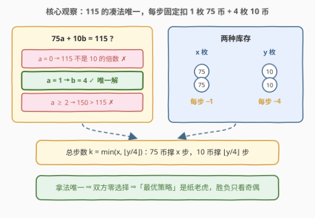
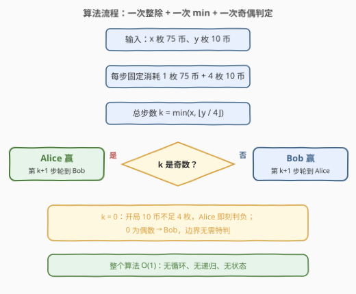
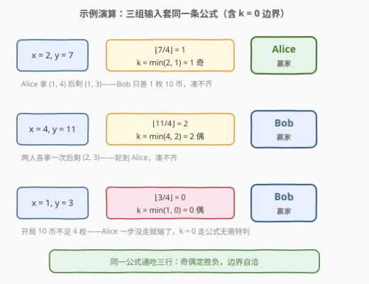

# LeetCode 硬币游戏中的赢家 题解

## 1. 题目概述

- **标题 / 题号**：硬币游戏中的赢家（#3222，easy）
- **链接**：https://leetcode.cn/problems/find-the-winning-player-in-coin-game/
- **难度**：简单
- **标签**：数学、博弈论、模拟、脑筋急转弯

**题意**：给你两个 **正** 整数 `x` 和 `y`，分别表示价值为 75 和 10 的硬币的数目。

Alice 和 Bob 正在玩一个游戏。每一轮中，Alice 先进行操作，Bob 后操作。每次操作中，玩家需要拿走价值 **总和** 为 115 的硬币。如果一名玩家无法执行此操作，那么这名玩家 **输掉** 游戏。

两名玩家都采取 **最优** 策略，请你返回游戏的赢家。

**示例 1**：

```text
输入：x = 2, y = 7
输出："Alice"
解释：游戏一次操作后结束——
Alice 拿走 1 枚价值为 75 的硬币和 4 枚价值为 10 的硬币（75 + 40 = 115）。
```

**示例 2**：

```text
输入：x = 4, y = 11
输出："Bob"
解释：游戏 2 次操作后结束——
- Alice 拿走 1 枚 75 币和 4 枚 10 币；
- Bob 拿走 1 枚 75 币和 4 枚 10 币。
```

**约束**：$1 \le x, y \le 100$。

> 💡 **审题关键**：① 「拿走价值总和为 115 的硬币」听着像可以任选组合，实则凑 115 的方案**只有一种**，这是全题题眼；② 「双方都采取最优策略」是纸老虎——每步走法唯一，双方**没有任何选择**；③ 无法操作者输且 Alice 先手，所以若开局就一步都走不了，Alice 立刻判负。

## 2. 解题思路

### 2.1 暴力思路：逐轮模拟

最朴素的做法是把游戏真的「玩」一遍：每轮 Alice、Bob 依次尝试拿走 1 枚 75 币 + 4 枚 10 币，凑不齐的一方落败：

```python
turns = 0
while x >= 1 and y >= 4:
    x, y, turns = x - 1, y - 4, turns + 1
```

由于 $y \le 100$，循环至多跑 $\lfloor 100/4 \rfloor = 25$ 轮，模拟版本身已经是 $O\!\left(\min\left(x, \lfloor y/4 \rfloor\right)\right)$ 的「伪常数」。

也有人条件反射地想上博弈搜索：`dfs(x, y)` 枚举当前玩家的所有合法拿法、看能否把对手逼进必败态——写出来会发现**合法拿法从头到尾只有一种**，枚举了个寂寞。这正暗示着本题有更本质的观察。

### 2.2 核心观察：唯一分解 → 步数注定 → 奇偶定胜负



**观察 1（115 的凑法唯一）**：设一步拿 $a$ 枚 75 币、$b$ 枚 10 币，则 $75a + 10b = 115$。逐一检查 $a$：

| $a$ | 推导 | 结论 |
|----|------|------|
| $a = 0$ | $10b = 115$，115 不是 10 的倍数 | ✗ |
| $a = 1$ | $10b = 40 \Rightarrow b = 4$ | ✓ **唯一解** |
| $a \ge 2$ | $75 \times 2 = 150 > 115$ | ✗ |

所以**每一步都固定消耗 1 枚 75 币 + 4 枚 10 币**，别无二选。

**观察 2（「最优策略」是空谈）**：走法集合只有一个元素，双方没有任何决策空间——「博弈」退化为一台**倒计时钟**，胜负在读到 $(x, y)$ 的那一刻就已注定。

**观察 3（总步数取短板）**：75 币最多支撑 $x$ 步，10 币最多支撑 $\lfloor y/4 \rfloor$ 步，两种库存谁先见底游戏就结束（木桶效应）：

$$k = \min\left(x,\ \left\lfloor \frac{y}{4} \right\rfloor\right)$$

**观察 4（奇偶定赢家）**：第 $1, 3, 5, \dots$ 步归 Alice，第 $2, 4, 6, \dots$ 步归 Bob。游戏共走 $k$ 步，第 $k+1$ 步轮到的人凑不齐、当场落败：

- $k$ 为**奇数** → 第 $k+1$ 步轮到 Bob → **Alice 赢**；
- $k$ 为**偶数**（含 $k = 0$）→ 轮到 Alice 自己 → **Bob 赢**。

> 💡 $k = 0$ 时 0 是偶数，公式统一返回 `"Bob"`，恰好就是「Alice 开局即无法操作、立刻判负」的正确语义——**边界无需特判**。

### 2.3 算法流程图



| 步骤 | 表达式 | 作用 |
|------|--------|------|
| ① 唯一分解 | $115 = 75 \times 1 + 10 \times 4$ | 确认每步固定消耗 $(1, 4)$ |
| ② 算步数 | $k = \min\left(x, \lfloor y/4 \rfloor\right)$ | 短板库存决定总步数 |
| ③ 判奇偶 | $k \bmod 2$ | 奇 → Alice，偶（含 0）→ Bob |

### 2.4 示例演算



| 输入 | $\lfloor y/4 \rfloor$ | $k = \min\left(x, \lfloor y/4 \rfloor\right)$ | 奇偶 | 赢家 | 现场还原 |
|------|------|------|------|------|----------|
| $x=2,\ y=7$ | $\lfloor 7/4 \rfloor = 1$ | $\min(2, 1) = 1$ | 奇 | **Alice** | Alice 拿 $(1,4)$ 后剩 $(1,3)$，Bob 只差 1 枚 10 币 |
| $x=4,\ y=11$ | $\lfloor 11/4 \rfloor = 2$ | $\min(4, 2) = 2$ | 偶 | **Bob** | 两人各拿一次后剩 $(2,3)$，轮到 Alice 凑不齐 |
| $x=1,\ y=3$ | $\lfloor 3/4 \rfloor = 0$ | $\min(1, 0) = 0$ | 偶 | **Bob** | 开局 10 币不足 4 枚，Alice 一步没走就输了 |

第三行是顺手补测的边界：$k = 0$ 走公式同样正确，验证了「无需特判」。

## 3. 参考代码

### C++（O(1) 公式版）

```cpp
class Solution {
public:
    string winningPlayer(int x, int y) {
        return min(x, y / 4) % 2 == 1 ? "Alice" : "Bob";
    }
};
```

> 💡 **写法要点**：`y / 4` 是整型除法，天然向下取整；`min` 之后只看奇偶。全函数两次算术、一次比较，无循环无递归。

### Python（O(1) 公式版）

```python
class Solution:
    def winningPlayer(self, x: int, y: int) -> str:
        return "Alice" if min(x, y // 4) % 2 else "Bob"
```

### Python（模拟对拍版）

```python
class Solution:
    def winningPlayer(self, x: int, y: int) -> str:
        turns = 0
        while x >= 1 and y >= 4:
            x, y, turns = x - 1, y - 4, turns + 1
        return "Alice" if turns % 2 else "Bob"
```

> 💡 模拟版忠实复刻游戏规则（凑不齐即停、按轮交替），与公式版在 $1 \le x, y \le 100$ 全区间对拍一致，可作验算基准。

## 4. 复杂度分析

| 维度 | 复杂度 | 说明 |
|------|--------|------|
| **时间（公式版）** | $O(1)$ | 一次整除、一次 `min`、一次奇偶判定 |
| **时间（模拟版）** | $O\!\left(\min\left(x, \lfloor y/4 \rfloor\right)\right)$ | 至多 25 轮（$y \le 100$） |
| **空间** | $O(1)$ | 无额外存储 |

## 5. 扩展：当「拿法」不再唯一，博弈搜索登场

本题能 $O(1)$ 的根因是**每步无选择**。一旦凑 115 出现多种方案（比如把 10 币换成 5 币：$5a + 10b = 115 \Rightarrow a + 2b = 23$，$a$ 取 $1, 3, \dots, 23$ 共 12 种凑法），玩家就有了真实决策，「最优策略」才真正生效。此时回到博弈论通用框架——**记忆化搜索判必胜/必败态**：

$$\text{win}(s) = \bigvee_{s \to s'} \neg\, \text{win}(s')$$

即：**一个状态是必胜态，当且仅当存在某个后继状态是（对手视角的）必败态**；没有后继（无合法拿法）的状态本身就是必败态。状态数 $O(x \cdot y) \le 10^4$，记忆化后每个状态只算一次：

```python
from functools import lru_cache

def winner(x, y, moves):          # moves: 所有满足总面值 = 115 的 (a, b) 组合
    @lru_cache(maxsize=None)
    def win(cx, cy):
        return any(not win(cx - a, cy - b)
                   for a, b in moves if cx >= a and cy >= b)
    return "Alice" if win(x, y) else "Bob"
```

> 💡 **博弈题通用心法**：先花一分钟确认「是不是根本没有选择」（Nim、除数博弈这类往往一行公式搞定）；确认每步有真实分支后，再上必胜态/必败态搜索或 DP。

## 6. 面试要点

1. **「双方都采取最优策略」在本题里意味着什么？**

   什么都没意味着。凑 115 的方案唯一（1 枚 75 + 4 枚 10），每步走法完全确定，双方没有任何决策空间——「博弈」退化成数步数，这是本题最大的脑筋急转弯。

2. **为什么总步数是 $\min\left(x, \lfloor y/4 \rfloor\right)$？**

   每步固定消耗 1 枚 75 币和 4 枚 10 币：75 币最多撑 $x$ 步，10 币最多撑 $\lfloor y/4 \rfloor$ 步。两种库存谁先见底谁终止游戏，总步数取短板——木桶效应。

3. **$k = 0$（Alice 开局就凑不齐）要不要特判？**

   不要。0 是偶数，奇偶公式统一给出 `"Bob"`，恰好等于「先手第一步就无法操作、当场判负」的规则语义。好公式应该让边界自洽。

4. **把 10 币换成 5 币后怎么解？**

   凑法变成 12 种（$a + 2b = 23$，$a \in \{1, 3, \dots, 23\}$），每步有了选择，$O(1)$ 公式失效。改用记忆化博弈搜索：状态 $(x, y)$ 必胜 ⟺ 存在合法拿法把对手送进必败态，共 $O(x \cdot y)$ 个状态。

5. **如何确认公式版没有翻车？**

   与逐轮模拟版在 $1 \le x, y \le 100$ 全区间对拍：模拟版忠实执行规则（凑不齐即停、按轮交替），两者 $100 \times 100$ 全一致即可放心提交。

## 同类练习题

| # | 题目 | 与本题的关联 |
|---|------|-------------|
| 292 | [Nim 游戏](https://leetcode.cn/problems/nim-game/) | 同为「博弈是幌子、数学是本质」的 $O(1)$ 公式题（4 的倍数先手必败） |
| 1025 | [除数博弈](https://leetcode.cn/problems/divisor-game/) | 从奇偶归纳出 $O(1)$ 结论，博弈入门对照题 |
| 877 | [石子游戏](https://leetcode.cn/problems/stone-game/) | 有真实决策的博弈——区间 DP + 净赚 Minimax |
| 486 | [预测赢家](https://leetcode.cn/problems/predict-the-winner/) | 877 的泛化版，先手不一定必胜，必须真算 DP |
| 1510 | [石子游戏 IV](https://leetcode.cn/problems/stone-game-iv/) | 记忆化搜索判必胜/必败态的标准模板，对应本文第 5 节的扩展 |
