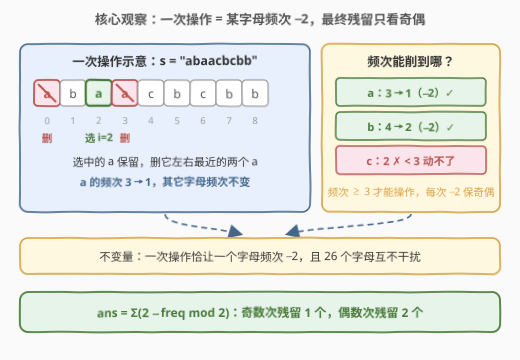
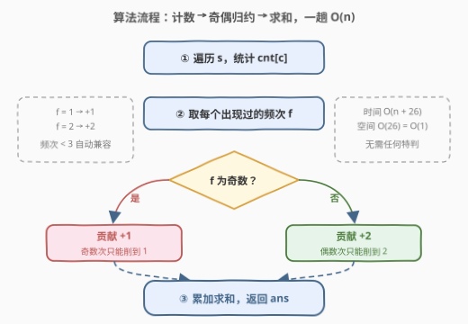
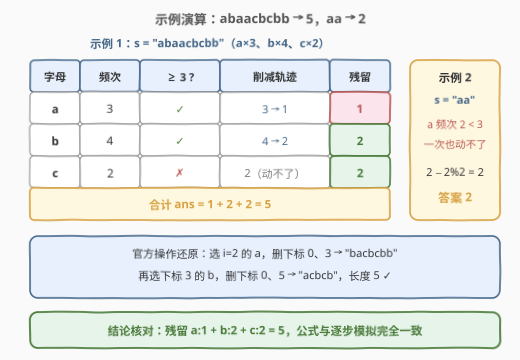

# LeetCode 操作后字符串的最短长度 题解

## 1. 题目概述

- **标题 / 题号**：操作后字符串的最短长度（#3223，medium）
- **链接**：https://leetcode.cn/problems/minimum-length-of-string-after-operations/
- **难度**：中等
- **标签**：哈希表、字符串、计数

**题意**：给你一个字符串 `s`。你需要对 `s` 执行以下操作 **任意** 次：

- 选择一个下标 `i`，满足 `s[i]` 左边和右边都 **至少** 有一个字符与它相同。
- 删除 `i` **左边** 离它 **最近** 的 `s[i]` 字符。
- 删除 `i` **右边** 离它 **最近** 的 `s[i]` 字符。

请你返回执行完所有操作后，`s` 的 **最短** 长度。

**示例 1**：

```text
输入：s = "abaacbcbb"
输出：5
解释：我们执行以下操作——
选择下标 2，然后删除下标 0 和 3 处的字符，得到 s = "bacbcbb"；
选择下标 3，然后删除下标 0 和 5 处的字符，得到 s = "acbcb"。
```

**示例 2**：

```text
输入：s = "aa"
输出：2
解释：无法对字符串进行任何操作，所以返回初始字符串的长度。
```

**约束**：$1 \le s.length \le 2 \times 10^5$；`s` 只包含小写英文字母。

> 💡 **审题关键**：① 被删的是选中字符**左右两侧最近的同款**，选中者本身保留——一次操作净删 **2 个同字母字符**；② 「最近」只约束具体删哪个下标，不约束计数——同字母字符的相对顺序永远不变；③ 删除一种字母不会增减另一种字母的频次，各字母的削减互不干扰。

## 2. 解题思路

### 2.1 暴力思路：忠实地模拟每一次操作

最直接的做法是把操作真的「做」一遍：每轮从头扫描，找到一个左右都存在相同字符的下标 `i`，删掉它两侧最近的同款字符并重建字符串，直到没有任何合法操作为止：

```python
s = list(s)
while 找得到合法 i:
    删除 i 左右最近的两个同款字符   # O(n) 定位 + O(n) 重建
```

至多执行 $\lfloor n/2 \rfloor$ 次操作，总复杂度 $O(n^2)$，在 $n = 2 \times 10^5$ 下必然超时。即使升级装备——双向链表支持 $O(1)$ 删除、每个字母维护出现下标的有序集合，把单次操作压到 $O(\log n)$——整体仍是 $O(n \log n)$ 的「工程挣扎」。数据规模其实在明示：别模拟，找规律。

### 2.2 核心观察：频次才是本质，奇偶决定残留



**观察 1（不变量：一次操作 = 某字母频次恰好 $-2$）**：选中的 `s[i]` 本身保留，被删的左右两个都是它的同款——该字母频次 $-2$，**其它字母的频次一个都不变**。整个操作过程在计数视角下只有一种原子事件：「某字母频次减 2」。

**观察 2（频次 $< 3$ 的字母动弹不得）**：合法操作要求选中字符左右各有一个相同字符，加上自身，该字母至少出现 **3 次**。出现 1 或 2 次的字母一次也删不掉，全部原样保留。

**观察 3（频次 $\ge 3$ 可以一路削到 1 或 2）**：取该字母按出现顺序排的前三个位置 $p < q < r$（中间隔着什么都无所谓），选 $i = q$，左右最近的同款正是 $p$ 与 $r$，一次合法操作达成。于是频次 $c$ 可以反复 $-2$：偶数削到 2，奇数削到 1。而奇偶性在操作中恒定不变、频次降到 2 或 1 后又不再满足门槛 $\ge 3$——这既是可达的终点，也是下界。

**观察 4（字母之间完全独立）**：任何操作只动一种字母，26 个字母的削减过程互不干扰，可以各自单独完成再求和。

四条观察合并成一个公式：

$$\text{ans} = \sum_{\text{freq}[c] > 0} \left(2 - \text{freq}[c] \bmod 2\right)$$

即每个**出现过**的字母：频次为**奇**贡献 1，为**偶**贡献 2。

> 💡 公式自动兼容频次 $< 3$ 的字母：$f = 1 \to 1$、$f = 2 \to 2$，恰好就是「动不了、全保留」的正确结果——**无需任何特判**。

### 2.3 算法流程图



| 步骤 | 操作 | 说明 |
|------|------|------|
| ① 计数 | 一趟遍历统计 `cnt[26]` | $O(n)$ 拿到每个字母的频次 |
| ② 归约 | 每个非零频次 $f \to 2 - f \bmod 2$ | 奇 $\to 1$、偶 $\to 2$，$f < 3$ 自动兼容 |
| ③ 求和 | 累加返回 | 26 个字母的残留之和即答案 |

### 2.4 示例演算



以 `s = "abaacbcbb"` 为例，先数频次：$a \times 3$、$b \times 4$、$c \times 2$。

| 字母 | 频次 | 频次 $\ge 3$？ | 削减轨迹 | 残留 |
|------|------|------|------|------|
| a | 3 | ✓ | $3 \to 1$ | 1 |
| b | 4 | ✓ | $4 \to 2$ | 2 |
| c | 2 | ✗ | $2$（动不了） | 2 |

合计 $1 + 2 + 2 = 5$，与官方两步操作的现场完全对上：

- 选 $i = 2$ 的 `a`，删下标 0、3 → `"bacbcbb"`（此时 $a$ 频次 $3 \to 1$）；
- 选下标 3 的 `b`，删下标 0、5 → `"acbcb"`（此时 $b$ 频次 $4 \to 2$），长度 **5**。

边界示例 `s = "aa"`：$a$ 频次 2，不满足门槛，公式给出 $2 - 0 = 2$，正是「一次也动不了」的答案。

## 3. 参考代码

### C++（O(n) 计数版）

```cpp
class Solution {
public:
    int minimumLength(string s) {
        int cnt[26] = {};
        for (char c : s) cnt[c - 'a']++;
        int ans = 0;
        for (int f : cnt)
            if (f) ans += 2 - f % 2;
        return ans;
    }
};
```

> 💡 **写法要点**：`2 - f % 2` 一个表达式统一奇偶两种残留（奇 $\to 1$、偶 $\to 2$）；`if (f)` 跳过未出现的字母，其实对答案无影响（$f = 0$ 时 $2 - 0 = 2$ 会多算），必须带上。

### Python（O(n) 计数版）

```python
from collections import Counter

class Solution:
    def minimumLength(self, s: str) -> int:
        return sum(2 - f % 2 for f in Counter(s).values())
```

> 💡 `Counter` 天然只保留出现过的字母，连「跳过零频次」这一步都省了。

### Python（模拟对拍版）

```python
class Solution:
    def minimumLength(self, s: str) -> int:
        s = list(s)
        while True:
            for i, c in enumerate(s):
                if c in s[:i] and c in s[i + 1:]:
                    l = i - 1 - s[i - 1::-1].index(c)   # 左边最近的 c
                    r = i + 1 + s[i + 1:].index(c)      # 右边最近的 c
                    del s[r], s[l]                      # 先删大下标，再删小下标
                    break
            else:
                return len(s)                           # 一轮下来无操作可做
```

> 💡 模拟版忠实复刻规则（左右各有一个同款才能动手、删最近的两个），复杂度 $O(n^2)$ 仅用于小数据对拍，是公式版的验算基准。`del s[r], s[l]` 从左到右先删大下标 `r` 再删小下标 `l`，避免删第一个后第二个下标位移。

## 4. 复杂度分析

| 维度 | 复杂度 | 说明 |
|------|--------|------|
| **时间（公式版）** | $O(n + \lvert\Sigma\rvert)$ | 一趟遍历计数 + 26 个字母归约求和，$\lvert\Sigma\rvert = 26$ 视作常数即 $O(n)$ |
| **空间（公式版）** | $O(\lvert\Sigma\rvert)$ | 长度 26 的计数数组，即 $O(1)$ |
| **时间（模拟版）** | $O(n^2)$ | 每次操作 $O(n)$ 定位 + $O(n)$ 重建，至多 $\lfloor n/2 \rfloor$ 次，仅作对拍 |

## 5. 扩展：换一种删法，残留看模数

本题结论的骨架是两条：**「一次操作让某字母频次 $-k$」给出不变量，「操作门槛」给出下界**。改动删法，就得到不同的「模数」：

| 规则变体 | 单次频次变化 | 操作门槛 | 每字母残留 |
|----------|--------------|----------|------------|
| 本题：删左右最近同款，自己保留 | $-2$ | 频次 $\ge 3$ | 奇 $\to 1$，偶 $\to 2$（$2 - f \bmod 2$） |
| 变体 A：连自己一起删（一次删 3 个） | $-3$ | 频次 $\ge 3$ | $f \bmod 3$ |
| 变体 B：删自己 + 右边最近同款 | $-2$ | 频次 $\ge 2$ | $f \bmod 2$（奇 $\to 1$，偶 $\to 0$） |

- **变体 A** 中 $c = 6$ 可走 $6 \to 3 \to 0$，残留恰为 $f \bmod 3$；
- **变体 B** 门槛降到 2：频次 2 选最左那个，删自己与右邻即清零——偶数频次竟能削到 0，答案形状完全不同。

> 💡 **迁移心法**：遇到「反复删除求最终态」的题，先问两件事——每次操作在**计数层面改变了什么**（不变量），以及**什么条件下不能再操作**（下界）。位置、顺序、「最近」这些细节往往只是包装，真正决定答案的是频次和模数。

## 6. 面试要点

1. **为什么只看频次，不用管字符位置和删除顺序？**

   两件事合起来：① **不变量**——任何一次操作恰好让某个字母频次 $-2$，其余频次不变；② **可达性**——只要某字母频次 $\ge 3$，取其任意三个出现位置 $p < q < r$，选 $q$ 就能合法删掉 $p$ 与 $r$。两者合并，最终态由初始频次的奇偶唯一决定。

2. **为什么频次小于 3 的字母一个都删不掉？**

   合法操作要求选中字符左右各有一个相同字符，加上自身共至少 3 次出现。频次 1、2 的字母不满足门槛，全部保留；公式里 $f = 1 \to 1$、$f = 2 \to 2$ 自动给出正确值。

3. **为什么偶数次只能削到 2、削不到 0？**

   每次操作净删 2 个但选中者本身必须保留，频次减 2 不改变奇偶性；而操作门槛是频次 $\ge 3$，从 2 出发的「$2 \to 0$」这一步根本不合法。所以偶数频次的可达最小值是 2，奇数是 1。

4. **不同字母的操作会互相干扰吗？**

   不会。一次操作删除的两个字符都是选中字母的同款，其它字母频次不变；同字母出现位置的相对顺序也不变。26 个字母的削减完全独立，可分别求解再求和。

5. **如何确认 O(n) 公式没有翻车？**

   写一个忠实模拟的暴力版（参考代码第三份），在随机小写字母小串上与公式版对拍；再代入官方示例 `"abaacbcbb" \to 5`、`"aa" \to 2` 验证边界。

## 同类练习题

| # | 题目 | 与本题的关联 |
|---|------|-------------|
| 2696 | [删除子串后的字符串最小长度](https://leetcode.cn/problems/minimum-string-length-after-removing-substrings/) | 同为「反复删除求最短长度」，改为删子串 `AB`/`CD`，用栈模拟 |
| 1047 | [删除字符串中的所有相邻重复项](https://leetcode.cn/problems/remove-all-adjacent-duplicates-in-string/) | 相邻成对删除的栈消解，对照本题的「非相邻」删除 |
| 387 | [字符串中的第一个唯一字符](https://leetcode.cn/problems/first-unique-character-in-a-string/) | 频次统计的基本功，本题的地基 |
| 1542 | [找出最长的超赞子字符串](https://leetcode.cn/problems/find-longest-awesome-substring/) | 奇偶性作为不变量的另一经典应用（前缀位掩码） |
| 2287 | [重排字符形成目标字符串](https://leetcode.cn/problems/rearrange-characters-to-make-target-string/) | 频次计数决定可行性上限，同属计数套路家族 |
