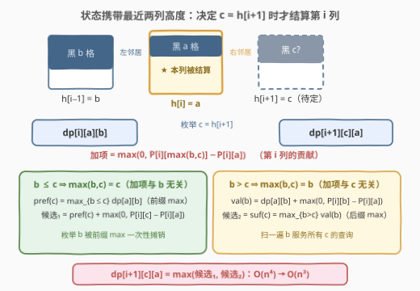
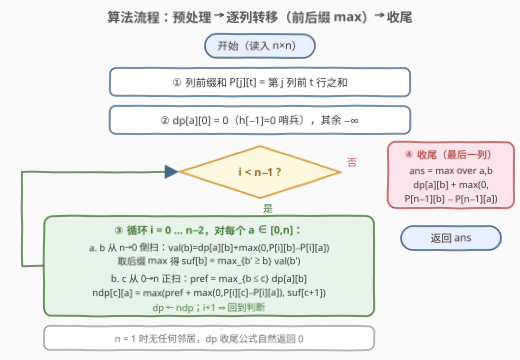
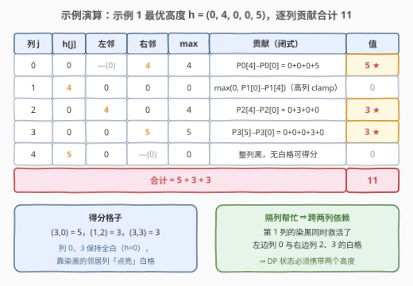

# LeetCode 网格图操作后的最大分数 题解

## 1. 题目概述

- **标题 / 题号**：网格图操作后的最大分数（#3225，hard）
- **链接**：https://leetcode.cn/problems/maximum-score-from-grid-operations/
- **难度**：困难
- **标签**：数组、动态规划、矩阵、前缀和

**题意**：给你一个大小为 $n \times n$ 的二维矩阵 `grid`，一开始所有格子都是**白色**的。一次操作中，你可以选择任意下标为 $(i, j)$ 的格子，并将第 $j$ 列中从最上面到第 $i$ 行的所有格子改成**黑色**。

如果格子 $(i, j)$ 为白色，且**左边或者右边**（同一行相邻列）的格子至少一个为黑色，那么将 $grid[i][j]$ 加到网格图的总分中。

请你返回执行**任意次**操作以后，最终网格图的**最大**总分数。

**示例 1**：

```text
输入：grid = [[0,0,0,0,0],[0,0,3,0,0],[0,1,0,0,0],[5,0,0,3,0],[0,0,0,0,2]]
输出：11
解释：第 1 列染黑到第 3 行、第 4 列整列染黑，其余不动。
      总分 = grid[3][0] + grid[1][2] + grid[3][3] = 5 + 3 + 3 = 11。
```

**示例 2**：

```text
输入：grid = [[10,9,0,0,15],[7,1,0,8,0],[5,20,0,11,0],[0,0,0,1,2],[8,12,1,10,3]]
输出：94
```

**约束**：

- $1 \le n = \text{grid.length} \le 100$
- $n = \text{grid}[i].\text{length}$
- $0 \le \text{grid}[i][j] \le 10^9$

> 💡 **审题关键**：① 操作只作用于**单列**，且染黑的永远是「从顶往下的一段前缀」——同一列多次操作等价于取最大行号的一次，因此一列的最终状态由**一个数**唯一决定：黑色高度 $h[j] \in [0, n]$（$h[j]=0$ 即这列从不操作）；② 各列操作互不干扰，**任意高度向量都可达**；③ $grid[i][j] \ge 0$，全部不操作保底 0 分，得分是纯非负项之和。于是问题从「操作序列」塌缩成「给每列选一个高度」。

## 2. 解题思路

### 2.1 暴力思路：枚举每列高度

每列 $n+1$ 种高度，枚举全部 $(n+1)^n$ 种组合，每种组合逐列求和要 $O(n^2)$——$n = 100$ 时是天文数字，完全不可行。

但换个角度看：**一列的得分只由自己的高度和左右邻居的高度决定**，与更远的列无关。这是典型的链式依赖 → 从左往右做 DP，状态携带「最近两列的高度」即可。真正要想清楚的只有两件事：单列贡献的**闭式**，以及**何时结算**。

### 2.2 核心观察：列高度模型 + 延迟一步结算的 DP

![核心观察：每列只剩一个黑色高度，第 j 列贡献 = P[max(左,右)] − P[自己]](../images/p3225_column_height_model.svg)

**观察 1（列高度模型）**：第 $j$ 列被染黑的格子永远是行 $0 \ldots h[j]-1$ 的**顶部前缀**。记 $P_j[t] = \sum_{r < t} grid[r][j]$ 为**列前缀和**，任意行区间的列和即可 $O(1)$ 取得。

**观察 2（单列贡献的闭式）**：格子 $(r, j)$ 能得分 ⇔ 白色（$r \ge h[j]$）且左/右同行邻居至少一个黑（$r < \max(h[j-1],\ h[j+1])$，边界列只有单个邻居）。两个条件拼起来，第 $j$ 列的得分就是行区间 $[h[j],\ \max(h[j-1], h[j+1]))$ 上的列和：

$$\text{contrib}(j) = \max\!\Big(0,\ P_j\big[\max(h[j-1],\, h[j+1])\big] - P_j\big[h[j]\big]\Big)$$

两个细节：**用 max 不用相加**——左右邻居都黑时格子值只计一次（天然容斥）；**与 0 取 max**——当一列比两个邻居都高时区间为空，贡献是 0 而不是负数（漏掉 clamp 会把「高列」凭空倒扣分，见面试要点 3 的反例）。

**观察 3（状态为什么要带两个高度）**：$\text{contrib}(i)$ 同时依赖 $h[i-1]$ 和 $h[i+1]$——**依赖跨两列**。从左往右决策时，只有决定 $h[i+1]$ 的那一刻才能结算第 $i$ 列，即「**延迟一步结算**」。于是定义：

$$dp[i][a][b] = \text{已决定列 } 0..i \text{ 的高度}(a = h[i],\ b = h[i-1])，\ \text{且列 } 0..i-1 \text{ 贡献已全部结算的最大分}$$

转移时枚举 $c = h[i+1]$，把第 $i$ 列的钱收进来：

$$dp[i+1][c][a] = \max_{b}\Big\{ dp[i][a][b] + \max\big(0,\ P_i[\max(b, c)] - P_i[a]\big) \Big\}$$

初始 $dp[0][a][0] = 0$——$h[-1]$ 取哨兵值 0，自动统一「第 0 列没有左邻居」的边界；终态再补上最后一列（只有左邻居 $b$）：

$$\text{ans} = \max_{a, b}\ dp[n-1][a][b] + \max\big(0,\ P_{n-1}[b] - P_{n-1}[a]\big)$$

状态 $O(n^3)$ 个、每个转移枚举 $b, c$ 双重 $O(n)$，总 $O(n^4) \approx 10^8$：C++ 勉强能过，Python 必须再压一维复杂度。

**观察 4（$\max(b,c)$ 可拆 → $O(n^3)$）**：转移里唯一的「二维耦合项」是 $\max(b, c)$。固定 $(i, a)$ 后，按 $b$ 与 $c$ 的大小把转移拆成两半：

| 分支 | $\max(b,c)$ | 加项退化成 | 摊销手段 |
|------|-------------|-----------|----------|
| $b \le c$ | $c$ | $\max(0,\ P_i[c] - P_i[a])$，**与 $b$ 无关** | 对 $b$ 取**前缀 max** 提出 |
| $b > c$ | $b$ | $\max(0,\ P_i[b] - P_i[a])$，**与 $c$ 无关** | 先吸收进 $dp$ 值，对 $b$ 做**后缀 max**，按 $c$ 查询 |

$$dp[i+1][c][a] = \max\Big(\underbrace{\max_{b \le c} dp[i][a][b] + \max(0, P_i[c] - P_i[a])}_{b \le c\ \text{分支}},\quad \underbrace{\max_{b > c}\big(dp[i][a][b] + \max(0, P_i[b] - P_i[a])\big)}_{b > c\ \text{分支}}\Big)$$

枚举 $b$ 被摊销进一次前后缀 max，每个 $(i, a)$ 只需 $O(n)$ 预处理 + $O(n)$ 填表，总复杂度降到 $O(n^3) \approx 10^6$。



### 2.3 算法流程图



| 步骤 | 操作 | 作用 |
|------|------|------|
| ① 预处理 | 逐列累加得 $P[j][t]$，$t \in [0, n]$ | 任意行区间列和 $O(1)$ |
| ② 初始化 | $dp[a][0] = 0$，其余 $-\infty$ | $h[-1]=0$ 哨兵统一「无左邻居」情形 |
| ③ 逐列转移 | $i$ 从 $0$ 到 $n-2$：对每个 $a$ 倒扫 $b$ 建后缀 max；正扫 $c$ 用前缀 max 写 $ndp[c][a]$ | 每轮 $O(n^2)$，共 $O(n^3)$ |
| ④ 收尾 | $\max_{a,b}\ dp[a][b] + \max(0,\ P_{n-1}[b] - P_{n-1}[a])$ | 最后一列只有左邻居 |

$n = 1$ 时没有任何邻居可得利，DP 自然返回 0。

### 2.4 示例演算



对示例 1，最优高度向量 $h = (0, 4, 0, 0, 5)$：第 1 列染黑到第 3 行、第 4 列整列染黑，其余列保持全白。逐列套闭式：

| 列 $j$ | $h[j]$ | 左邻高 | 右邻高 | $\max$ 邻高 | 贡献 | 得分格子 |
|--------|--------|--------|--------|-------------|------|----------|
| 0 | 0 | —(0) | 4 | 4 | $P_0[4]-P_0[0] = 0+0+0+5 = 5$ | $(3,0)$ |
| 1 | 4 | 0 | 0 | 0 | $\max(0,\ P_1[0]-P_1[4]) = 0$（高列，clamp 生效） | — |
| 2 | 0 | 4 | 0 | 4 | $P_2[4]-P_2[0] = 0+3+0+0 = 3$ | $(1,2)$ |
| 3 | 0 | 0 | 5 | 5 | $P_3[5]-P_3[0] = 0+0+0+3+0 = 3$ | $(3,3)$ |
| 4 | 5 | 0 | —(0) | 0 | $0$（整列黑） | — |

合计 $5 + 3 + 3 = 11$。注意 $(3,0)$ 与 $(3,3)$ 的得分来自「**隔列帮忙**」：第 0、3 列自己高度为 0 保持全白，靠被染黑的**邻居**列把白格子点亮——第 1 列的染黑同时救活了左边的列 0 和右边的列 2、3。这正是状态必须携带**两个**高度（跨两列依赖）的原因。

## 3. 参考代码

### C++

```cpp
class Solution {
public:
    long long maximumScore(vector<vector<int>>& grid) {
        int n = grid.size();
        // P[j][t] = 第 j 列前 t 行的值之和（列前缀和）
        vector<vector<long long>> P(n, vector<long long>(n + 1, 0));
        for (int j = 0; j < n; j++)
            for (int r = 0; r < n; r++)
                P[j][r + 1] = P[j][r] + grid[r][j];

        const long long NEG = LLONG_MIN / 4;
        // dp[a][b]：已决定到第 i 列，a = h[i]，b = h[i-1]，列 0..i-1 已结算
        vector<vector<long long>> dp(n + 1, vector<long long>(n + 1, NEG));
        for (int a = 0; a <= n; a++) dp[a][0] = 0;   // h[-1] = 0 哨兵

        for (int i = 0; i + 1 < n; i++) {            // 决定 h[i+1] 时结算第 i 列
            vector<vector<long long>> ndp(n + 1, vector<long long>(n + 1, NEG));
            const auto& Pi = P[i];
            for (int a = 0; a <= n; a++) {           // a = h[i]
                long long Pa = Pi[a];
                // suf[b] = max_{b' >= b} ( dp[a][b'] + max(0, Pi[b']-Pa) )，倒扫一遍
                vector<long long> suf(n + 2, NEG);
                for (int b = n; b >= 0; b--) {
                    long long v = dp[a][b] == NEG ? NEG
                              : dp[a][b] + max(0LL, Pi[b] - Pa);
                    suf[b] = max(suf[b + 1], v);
                }
                long long pref = NEG;                // pref = max_{b <= c} dp[a][b]
                for (int c = 0; c <= n; c++) {       // c = h[i+1]
                    pref = max(pref, dp[a][c]);
                    long long c1 = pref == NEG ? NEG
                                : pref + max(0LL, Pi[c] - Pa);   // b <= c 分支
                    ndp[c][a] = max(c1, suf[c + 1]);             // b >  c 分支
                }
            }
            dp = move(ndp);
        }
        // 最后一列只有左邻居 b
        long long ans = 0;
        const auto& Pl = P[n - 1];
        for (int a = 0; a <= n; a++)
            for (int b = 0; b <= n; b++)
                if (dp[a][b] != NEG)
                    ans = max(ans, dp[a][b] + max(0LL, Pl[b] - Pl[a]));
        return ans;
    }
};
```

> 💡 **写法要点**：① `dp[a][b] == NEG` 的判断防止 $-\infty$ 参与加法（也可改用足够小的有限负数如 $-10^{17}$ 兜底，只要无效路径的值永远爬不回 0 以上）；② `suf[b]` 建的是「$b' \ge b$」的最大值，查询时必须用 `suf[c+1]` 才是严格的 $b > c$；③ clamp `max(0LL, ...)` 在两个分支和收尾处共出现多次，缺一不可。

### Python

```python
class Solution:
    def maximumScore(self, grid: List[List[int]]) -> int:
        n = len(grid)
        P = [[0] * (n + 1) for _ in range(n)]        # 列前缀和
        for j in range(n):
            for r in range(n):
                P[j][r + 1] = P[j][r] + grid[r][j]

        NEG = float('-inf')
        dp = [[NEG] * (n + 1) for _ in range(n + 1)]
        for a in range(n + 1):
            dp[a][0] = 0                              # h[-1] = 0 哨兵

        for i in range(n - 1):                        # 决定 h[i+1] 时结算第 i 列
            ndp = [[NEG] * (n + 1) for _ in range(n + 1)]
            Pi = P[i]
            for a in range(n + 1):                    # a = h[i]
                Pa = Pi[a]
                dpa = dp[a]
                suf = [NEG] * (n + 2)                 # suf[b] = max_{b'>=b} (...)
                for b in range(n, -1, -1):
                    v = dpa[b]
                    if v != NEG:
                        v += max(0, Pi[b] - Pa)
                    suf[b] = v if v > suf[b + 1] else suf[b + 1]
                pref = NEG                            # pref = max_{b<=c} dp[a][b]
                for c in range(n + 1):                # c = h[i+1]
                    if dpa[c] > pref:
                        pref = dpa[c]
                    c1 = pref + max(0, Pi[c] - Pa) if pref != NEG else NEG
                    c2 = suf[c + 1]
                    ndp[c][a] = c1 if c1 > c2 else c2
            dp = ndp

        ans, Pl = 0, P[n - 1]                         # 最后一列只有左邻居
        for a in range(n + 1):
            for b in range(n + 1):
                if dp[a][b] != NEG:
                    ans = max(ans, dp[a][b] + max(0, Pl[b] - Pl[a]))
        return ans
```

> 💡 想验证正确性，可以写一个 $O(n^4)$ 直译版对拍：把「前后缀 max」换回「显式双重循环枚举 $b, c$」，在小矩阵上与 $O(n^3)$ 版全区间一致；再进一步用 $(n+1)^n$ 枚举高度的暴力版锚定基准（本文 $O(n^3)$ 版与 $O(n^4)$ 版均已对拍通过）。

## 4. 复杂度分析

| 维度 | 复杂度 | 说明 |
|------|--------|------|
| **时间** | $O(n^3)$ | $n$ 轮转移 × 每轮 $(n+1)$ 个 $a$ × $O(n)$ 前后缀 max 与填表 |
| **空间** | $O(n^2)$ | 两张滚动 $(n+1)^2$ dp 表 + 列前缀和 $O(n^2)$ |
| 朴素对照 | $O(n^4)$ | 三维状态 × 枚举 $b, c$ 双重循环，$10^8$ 仅 C++ 可险过 |
| 暴力对照 | $O((n+1)^n \cdot n)$ | 枚举全部高度向量，仅用于对拍锚定 |

## 5. 扩展：官方 hint 的 0/1 压维与「低估不污染」论证

官方提示给出另一条 $O(n^3)$ 路线：把第三维 $beforeLastHeight$ 压成一个 0/1 标志 $dp[i][lastHeight][isBigger]$，其中 $isBigger$ 表示「**假设**第 $i$ 列的黑格数比第 $i-2$ 列多」。转移结算第 $i-1$ 列时，$\max(b, c)$ 不再显式比较，而是按「假设成立与否」二选一地取 $c$ 或 $b$。正确性论证很漂亮：

- 假设**正确** → 恰好算出真实贡献；
- 假设**错误** → 因 $P$ 单调不减（$grid \ge 0$），按错误一侧算出的贡献只会**偏小**，该路径被低估；
- 每个真实高度向量都存在一条「全程假设正确」的路径把它**精确**算出。

于是 dp 值永远不超过真实分，而最优解在某条路径上被精确达到——最终 max 不受污染。「错误方向只会低估、正确方向恰好精确」与本文的 $\max(0, \cdot)$ clamp 异曲同工：都是利用**非负性 + 单调性**容忍不精确的中间状态。

另一个实践层面的对照：$O(n^4)$ 直译版好写好记（转移就是一行公式），C++ 在 $n=100$ 时约 $10^8$ 次简单加法比较，实测能过；Python 则必须上 $O(n^3)$（本文主代码）。**先写出正确的 $O(n^4)$、再观察耦合项做摊销**，是处理「状态 × 转移双重枚举」类 DP 的通用节奏——找到转移中唯一把两个枚举维度粘在一起的项（本题的 $\max(b,c)$），按大小关系拆开，往往就完成优化。

## 6. 面试要点

1. **为什么一列的最终状态可以用单个高度 $h[j]$ 表示？**

   操作只作用于单列、染黑的是从顶往下的一段前缀；同一列多次操作等价于取最大行号的那一次。反之，任意高度向量每列至多一次操作即可实现，且各列独立互不干扰。因此「操作序列」与「高度向量」多对一对应，优化目标变成在 $(n+1)^n$ 个高度向量里取最优。

2. **为什么 DP 状态要携带两个高度？只带一个行不行？**

   第 $i$ 列的贡献闭式同时依赖 $h[i-1]$ 与 $h[i+1]$，依赖**跨两列**。只带一个高度时，结算第 $i$ 列还缺右邻居的信息，必须「延迟一步」——决定 $h[i+1]$ 时才结算第 $i$ 列，这就要求状态同时记住 $h[i]$（自己的高度）与 $h[i-1]$（左邻居的高度）。示例 1 中第 1 列的染黑同时点亮左右两边的白格，就是这种跨两列依赖的直观体现。

3. **$\max(0, \cdot)$ 这个 clamp 为什么不能省？**

   当一列比左右邻居都高时，它的白色格子没有任何黑邻居，贡献是**空区间求和 = 0**；不加 clamp 会算出 $P[\max] - P[h] < 0$，把合法方案凭空倒扣分。反例：$grid = [[3,5],[0,0]]$，取 $h = (1, 0)$ 真实得分 5（$(0,0)$ 染黑牺牲 3，白格 $(0,1)$ 左邻黑得 5），不加 clamp 的 DP 只会算出 3——白白丢掉最优解。

4. **$O(n^4) \to O(n^3)$ 的关键一步是什么？**

   转移中唯一的耦合项是 $\max(b, c)$。按 $b \le c$ / $b > c$ 拆开：一边加项退化为只含 $c$（$dp$ 值对 $b$ 取前缀 max 摊销掉枚举），另一边退化为只含 $b$（先把加项吸收进 $dp$ 值、再对 $b$ 做后缀 max，按 $c$ 直接查询）。本质是把「对每个 $c$ 重扫一遍 $b$」变成「扫一遍 $b$ 服务所有 $c$」——与单调队列优化、前缀和优化同属一个思想家族：**当转移的附加项可按维度分离时，枚举就能被摊销**。

5. **$h[-1] = 0$ 哨兵与 $n = 1$ 边界怎么处理？**

   把「第 0 列没有左邻居」统一成 $h[-1] = 0$、把「最后一列没有右邻居」统一成 $h[n] = 0$，转移与收尾公式就不必特判边界列。$n = 1$ 时整个网格没有任何相邻列，任何格子都无法得分，DP 收尾公式自然给出 0。

## 同类练习题

| # | 题目 | 与本题的关联 |
|---|------|-------------|
| 3122 | [使矩阵满足条件的最少操作次数](https://leetcode.cn/problems/minimum-number-of-operations-to-satisfy-conditions/) | 同为「逐列推进、状态携带上一列取值」的矩阵 DP 近亲 |
| 85 | [最大矩形](https://leetcode.cn/problems/maximal-rectangle/) | 把每列抽象成一个「高度」建直方图——与本题的列高度建模同源 |
| 3148 | [矩阵中的最大得分](https://leetcode.cn/problems/maximum-difference-score-in-a-grid/) | 矩阵上按列推进取数，体会状态定义与推进方向的关系 |
| 3165 | [不包含相邻元素的子序列的最大和](https://leetcode.cn/problems/maximum-sum-of-subsequence-with-non-adjacent-elements/) | DP 状态携带「前一项是否被选」的跨一步依赖，摊销思想在序列上的另一应用 |
| 174 | [地下城游戏](https://leetcode.cn/problems/dungeon-game/) | 矩阵 DP 中「状态定义决定结算方向（从终点反向倒推）」的典范 |
