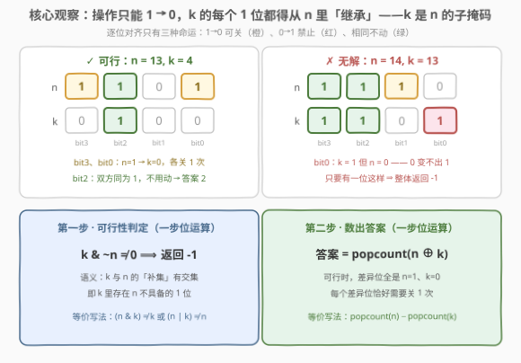
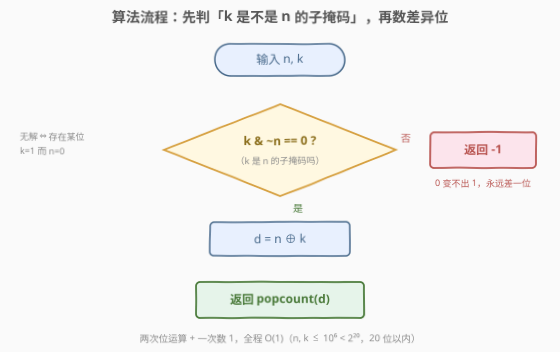
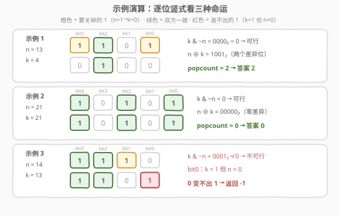

# 使两个整数相等的位更改次数

- **题目名称**：使两个整数相等的位更改次数
- **链接**：[3226. 使两个整数相等的位更改次数](https://leetcode.cn/problems/number-of-bit-changes-to-make-two-integers-equal/)
- **难度**：简单
- **标签**：位运算、子掩码（submask）、popcount

## 1. 题目概述

给你两个正整数 $n$ 和 $k$。

你可以选择 $n$ 的**二进制表示**中任意一个值为 1 的位，并将其改为 0（每次操作关掉一个 1）。

返回使得 $n$ 等于 $k$ 所需要的**最少更改次数**；如果无法实现，返回 $-1$。

**示例 1**：

```text
输入：n = 13, k = 4
输出：2
解释：n = (1101)₂, k = (0100)₂，关掉 n 的 bit0 和 bit3，
     得到 n = (0100)₂ = k，共 2 次操作。
```

**示例 2**：

```text
输入：n = 21, k = 21
输出：0
解释：n 与 k 已经相等，不需要任何操作。
```

**示例 3**：

```text
输入：n = 14, k = 13
输出：-1
解释：n = (1110)₂, k = (1101)₂，k 的 bit0 是 1 而 n 的 bit0 是 0，
     0 永远变不出 1，无法实现。
```

**约束条件**：

- $1 \le n, k \le 10^6$（均小于 $2^{20}$，二进制不超过 20 位）

> 💡 **审题关键**：操作是**单向**的——只能把 1 改成 0，不能把 0 改成 1。这意味着 $n$ 的「1 位集合」在操作过程中只会**缩小**、永远不会扩张。于是天然产生两个问题：① $k$ 的每个 1 位是否都「出生」在 $n$ 里（可行性）？② 可行时要关掉多少个 1（计数）？两个问题各由一步位运算回答。

## 2. 解题思路

### 2.1 暴力思路：逐位扫描 / 状态搜索

最朴素的写法是**逐位移位扫描**：对 0~19 每一位，取出 $n$、$k$ 在该位的值，分三类处理——

```cpp
int minChanges(int n, int k) {
    int ans = 0;
    for (int b = 0; b < 20; ++b) {            // 10^6 < 2^20
        int nb = (n >> b) & 1, kb = (k >> b) & 1;
        if (nb == 0 && kb == 1) return -1;    // 0 → 1：禁止
        if (nb == 1 && kb == 0) ++ans;        // 1 → 0：必须关一次
    }
    return ans;
}
```

这已经是 $O(20)$ 的正确解。更「笨」的暴力是把每种「关掉若干个 1」的操作序列当作搜索树，从 $n$ 出发 BFS 找 $k$——状态数最坏 $2^{\mathrm{popcount}(n)}$（$n$ 的每个子掩码都是一个可达状态），指数级爆炸。

> ⚠️ 逐位扫描虽然正确，但没抓住问题的**整体结构**：各位之间完全独立、互不影响，逐位判断的分类逻辑（哪类该计数、哪类判死）其实可以被两步**整体**位运算一次性完成。暴力是「问每个位」，最优解是「问整个数」。

### 2.2 核心观察：操作单向 1→0 —— k 必须是 n 的子掩码



把 $n$、$k$ 的二进制逐位对齐，每个位置只有三种命运：

| $n$ 的位 | $k$ 的位 | 命运 | 说明 |
|:---:|:---:|------|------|
| 1 | 0 | ✅ 关一次 | 唯一允许的「改变」，贡献 1 次操作 |
| 0 | 1 | ❌ 无解 | 0 变不出 1，永远差一位 |
| 0 / 1 | 与 $n$ 相同 | ➖ 不动 | 双方一致，无需操作 |

**观察一（可行性）**：把「$k$ 有、$n$ 无」的位一次性筛出来——

$$
k \,\&\, \sim n
$$

它非零 ⟺ 存在某位 $k=1$ 而 $n=0$ ⟺ 无解。用集合语言说：记 $S(x)$ 为 $x$ 的 1 位集合，可行 ⟺ $S(k) \subseteq S(n)$，即 **$k$ 是 $n$ 的子掩码（submask）**。

**观察二（计数）**：可行时，需要操作的位恰好是 $S(n) \setminus S(k)$ 里的每一位，每 位关一次、且只关一次（多关就错、少关不够）。而这个差集正好被异或捕获：

$$
\text{答案} = \mathrm{popcount}(n \oplus k)
$$

> 💡 为什么可行时 $n \oplus k$ 的 1 位「自动」全是要关的位？因为可行保证了 $S(k) \subseteq S(n)$，差异位只能是 $n=1, k=0$ 这一种类型——方向已经被可行性判定「背书」，数个数即可。顺带一提，此时还有 $\mathrm{popcount}(n \oplus k) = \mathrm{popcount}(n) - \mathrm{popcount}(k)$（差集的大小等于两集合大小之差）。

### 2.3 算法流程图



整个算法只有三步：

| 步骤 | 操作 | 语义 | 示例（n=13, k=4） |
|------|------|------|-------------------|
| ① 判定 | `k & ~n` | 筛出「k 有、n 无」的位 | $0100 \,\&\, \sim 1101 = 0$ → 可行 |
| ② 求差 | `n ^ k` | 标出所有差异位 | $1101 \oplus 0100 = 1001$ |
| ③ 计数 | `popcount` | 数差异位个数 | $\mathrm{popcount}(1001) = 2$ |

### 2.4 示例演算



把三个官方示例的逐位竖式列成表（高位在左）：

**示例 1**（$n=13$, $k=4$）——可行，数差异：

| | bit3 | bit2 | bit1 | bit0 | 结果 |
|------|:---:|:---:|:---:|:---:|------|
| $n = 13$ | 1 | 1 | 0 | 1 | |
| $k = 4$ | 0 | 1 | 0 | 0 | |
| 类型 | 1→0 改 | 相同 | 相同 | 1→0 改 | $k \& \sim n = 0$，答案 2 |

**示例 2**（$n=21$, $k=21$）——完全一致：$k \& \sim n = 0$，$n \oplus k = 0$，答案 0。

**示例 3**（$n=14$, $k=13$）——出现禁忌位：

| | bit3 | bit2 | bit1 | bit0 | 结果 |
|------|:---:|:---:|:---:|:---:|------|
| $n = 14$ | 1 | 1 | 1 | 0 | |
| $k = 13$ | 1 | 1 | 0 | 1 | |
| 类型 | 相同 | 相同 | 1→0 改 | **0→1 ❌** | $k \& \sim n = 0001 \neq 0$，返回 -1 |

> 💡 注意示例 3 的微妙之处：bit1 本来可以关（1→0 ✓），但 bit0 是「0→1」的死局——**一个禁忌位就足以判死全局**，与有多少「合法」的位无关。这也是为什么判定式必须先于计数执行。

## 3. 参考代码

### C++

```cpp
class Solution {
public:
    int minChanges(int n, int k) {
        if (k & ~n) {                      // k 中存在 n 没有的 1 位 → 0 变不出 1
            return -1;
        }
        return __builtin_popcount(n ^ k);  // 差异位全是 n=1,k=0，数个数即操作数
    }
};
```

> 💡 一行版：`return (k & ~n) ? -1 : __builtin_popcount(n ^ k);`。`__builtin_popcount` 是 GCC/Clang 内建函数（映射到硬件 `POPCNT` 指令）；C++20 起可写 `std::popcount`（需 `#include <bit>`）。

### Python

```python
class Solution:
    def minChanges(self, n: int, k: int) -> int:
        if k & ~n:                      # k 有 n 不具备的 1 位
            return -1
        return (n ^ k).bit_count()      # Python 3.10+；旧版本用 bin(n ^ k).count('1')
```

> 💡 Python 的 `~n` 是无限精度按位取反，$k \,\&\, \sim n$ 语义与 C++ 一致（$k$ 为正数，高位为 0，补码高位不影响结果）。`int.bit_count()` 于 Python 3.10 加入，底层同样是一条指令级操作。

## 4. 复杂度分析

| 维度 | 复杂度 | 说明 |
|------|--------|------|
| **时间复杂度** | $O(1)$ | 两次位运算 + 一次 popcount；$n, k \le 10^6 < 2^{20}$，位宽为常数 20（严格按位宽算是 $O(\log \max(n,k))$） |
| **空间复杂度** | $O(1)$ | 只使用常数个整型变量 |

> 对照 2.1：逐位扫描是 $O(20)$ 循环，位运算是三条 $O(1)$ 指令——渐近复杂度同为常数级，但后者把「逐位分类」的整个循环体压缩成了一次整字长的并行判断，这是位运算题的典型美感。

## 5. 扩展

### 5.1 子掩码判定式的等价写法

「$k$ 是 $n$ 的子掩码」有四种可以互相推导的表达，面试中任何一种都要能秒写：

| 写法 | 语义 |
|------|------|
| $k \,\&\, \sim n = 0$ | $k$ 与 $n$ 的补集无交集（本题解采用） |
| $(n \,\&\, k) = k$ | $k$ 的 1 位全部保留在与结果中 |
| $(n \,\|\, k) = n$ | 并上 $k$ 后 $n$ 不变（$k$ 没带来新位） |
| $(n \oplus k) \,\&\, n = n \oplus k$ | 差异位全部落在 $n$ 的 1 位里 |

顺带认识**子掩码枚举**这一常用技巧：`for (int s = n; s; s = (s - 1) & n)` 按递减序枚举 $n$ 的全部子掩码。本题若问「$k$ 可达吗」也能用它暴力验证（$2^{\mathrm{popcount}(n)}$ 级），但正解显然不需要。

### 5.2 popcount 的实现家族

| 环境 | 用法 |
|------|------|
| C++（GCC/Clang） | `__builtin_popcount(x)`，编译期映射到 `POPCNT` 硬件指令 |
| C++20 | `std::popcount(x)`（`<bit>` 头文件） |
| Python | `x.bit_count()`（3.10+）；旧版本 `bin(x).count('1')` |
| 手撕（无内建） | `while (x) { x &= x - 1; ++cnt; }`——每次消去最低位的 1，循环次数恰好等于答案 |

手撕版正是 [191. 位 1 的个数](https://leetcode.cn/problems/number-of-1-bits/)（[站内题解](../0001-0100/191_位1的个数.md)）的主角 $x \,\&\, (x-1)$：让 $x$ 的最低位 1 连同其后所有 0 变成 0（借位减法）。

### 5.3 位翻转题光谱：从数差异到带方向约束

本题处在一族「把 A 变成 B 要翻几个位」的题目中，按约束强度排列：

| 题目 | 允许的操作 | 答案 |
|------|-----------|------|
| [461. 汉明距离](https://leetcode.cn/problems/hamming-distance/)（[站内题解](../0401-0500/461_汉明距离.md)） | 只数不改 | $\mathrm{popcount}(x \oplus y)$ |
| [2220. 转换数字的最少位翻转次数](https://leetcode.cn/problems/minimum-bit-flips-to-convert-number/)（[站内题解](../2201-2300/2220_转换数字的最少位翻转次数.md)） | 任意位 0↔1 随便翻 | 仍是汉明距离 $\mathrm{popcount}(n \oplus k)$ |
| **3226（本题）** | 只能 1→0 | 先判子掩码可行，再数 $\mathrm{popcount}(n \oplus k)$ |
| [1318. 或运算的最小翻转次数](https://leetcode.cn/problems/minimum-flips-to-make-a-or-b-equal-to-c/)（[站内题解](../1301-1400/1318_或运算的最小翻转次数.md)） | 逐位分类讨论 $a\,\|\,b$ 与 $c$ 的关系 | 按位型三分支累计 |

可以看出：**方向约束越强，前置的可行性/分类判断越多**；约束完全自由时，一切退化成「数差异」——汉明距离就是这族题的万有引力中心。

## 6. 面试要点

1. **为什么无解条件是 $k \,\&\, \sim n \neq 0$？**

   > 操作只能把 1 改成 0，$S(n)$ 在操作下单调缩小。若某位 $k=1$ 而 $n=0$，这个 1 永远造不出来。$k \,\&\, \sim n$ 恰好把「$k$ 有、$n$ 无」的位整体筛出，非零即存在禁忌位，直接返回 $-1$。

2. **可行时为什么答案直接是 $\mathrm{popcount}(n \oplus k)$，不用再检查每位的方向？**

   > 可行性 $S(k) \subseteq S(n)$ 已保证差异位只能是 $n=1, k=0$ 这一种类型——方向自动确定，无需逐位分类。此时还有等价式 $\mathrm{popcount}(n \oplus k) = \mathrm{popcount}(n) - \mathrm{popcount}(k)$。

3. **C++ 里 `~n` 会对整个 int（含符号位）按位取反，这里有坑吗？**

   > 没有坑。$k \le 10^6$，其二进制高位全为 0；与运算结果的高位恒为 0，符号扩展位不参与有效判定。若题目允许 $k$ 为负（如按补码语义比较），才需要先掩到固定位宽再判定。

4. **如果操作改成「任意位 0↔1 互换」，答案变成什么？**

   > 就是汉明距离 $\mathrm{popcount}(n \oplus k)$——[2220](https://leetcode.cn/problems/minimum-bit-flips-to-convert-number/) 题。本题相比它多的那一步子掩码判定，正是「单向操作」约束带来的全部额外成本。

5. **不用内建函数，怎么 $O(\mathrm{popcount})$ 地数 1？**

   > 经典的 $x \,\&\, (x-1)$ 消最低位 1 循环，每轮恰消一个 1，循环次数即 1 的个数（[191](https://leetcode.cn/problems/number-of-1-bits/) 的标准解）。追求极致可再了解查表法（16 位一张表）与 SWAR 分治加法。

> 💡 **一句话总结**：3226 = 单向操作 + 子掩码判定。$k \,\&\, \sim n$ 非零返回 $-1$，否则答案就是 $\mathrm{popcount}(n \oplus k)$——两步位运算，先问「能不能」，再问「多少次」。

## 7. 同类练习题

- [2220. 转换数字的最少位翻转次数](https://leetcode.cn/problems/minimum-bit-flips-to-convert-number/)（[站内题解](../2201-2300/2220_转换数字的最少位翻转次数.md)）：本题的**无约束版本**（0↔1 随便翻），答案直接是汉明距离，对照理解方向约束的代价
- [461. 汉明距离](https://leetcode.cn/problems/hamming-distance/)（[站内题解](../0401-0500/461_汉明距离.md)）：$\mathrm{popcount}(x \oplus y)$ 的原型题，本题计数步的出处
- [1318. 或运算的最小翻转次数](https://leetcode.cn/problems/minimum-flips-to-make-a-or-b-equal-to-c/)（[站内题解](../1301-1400/1318_或运算的最小翻转次数.md)）：位翻转家族的进阶款，按位三分支分类讨论 $a\,|\,b = c$
- [191. 位 1 的个数](https://leetcode.cn/problems/number-of-1-bits/)（[站内题解](../0001-0100/191_位1的个数.md)）：手撕 popcount（$x \,\&\, (x-1)$ 消最低位 1）的基本功
- [231. 2 的幂](https://leetcode.cn/problems/power-of-two/)（[站内题解](../0201-0300/231_2的幂.md)）：同一条 $x \,\&\, (x-1)$ 技巧的判定型应用（单 1 检测）
