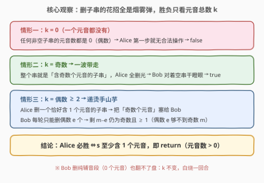
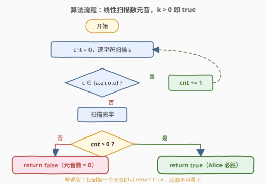
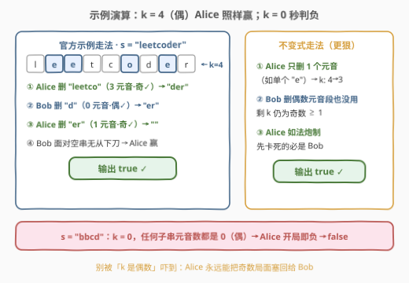

# LeetCode 字符串中的元音游戏 题解

## 1. 题目概述

- **标题 / 题号**：字符串中的元音游戏（#3227，medium）
- **链接**：https://leetcode.cn/problems/vowels-game-in-a-string/
- **难度**：中等
- **标签**：脑筋急转弯、数学、字符串、博弈论

**题意**：小红和小明在玩一个字符串元音游戏。给定一个字符串 `s`，两人**轮流**参与游戏，小红**先**开始：

- 在小红的回合，她必须移除 `s` 中包含**奇数**个元音的任意**非空**子字符串；
- 在小明的回合，他必须移除 `s` 中包含**偶数**个元音的任意**非空**子字符串。

第一个无法在其回合内进行移除操作的玩家**输掉**游戏。假设两人都采取**最优策略**。如果小红赢得游戏返回 `true`，否则返回 `false`。

英文元音字母包括 `a`、`e`、`i`、`o`、`u`。

**示例 1**：

```text
输入：s = "leetcoder"
输出：true
解释：小红可以执行如下移除操作来赢得游戏——
- 小红先手，移除子串 "leetco"（含 3 个元音），s = "der"；
- 小明移除子串 "d"（含 0 个元音），s = "er"；
- 小红移除整个串 "er"（含 1 个元音），s = ""；
- 又轮到小明，字符串为空无法移除，小红获胜。
```

**示例 2**：

```text
输入：s = "bbcd"
输出：false
解释：小红在她的第一回合无法执行任何移除操作，因此输掉游戏。
```

**约束**：$1 \le s.length \le 10^5$，`s` 仅由小写英文字母组成。

> 💡 **审题关键**：① 移除的是**子串**（连续一段），删掉中间一段后两侧会**拼接**成新串，这是暴力搜索噩梦的根源；② 小红要**奇数**个元音、小明要**偶数**个（0 也是偶数，纯辅音段小明也能删）；③ 「第一个无法操作的人输」+ 小红先手 ⇒ 若小红开局一步都走不了，直接判负；④ 「双方最优策略」是烟雾弹——胜负在你看到 `s` 的那一瞬间就注定了。

## 2. 解题思路

### 2.1 暴力思路：真刀真枪的博弈搜索（不可行）

最直接的想法是把游戏真的「搜」一遍：状态 = 剩余字符串，当前玩家枚举 $O(n^2)$ 个子串、核对元音数奇偶是否合法、删掉后把两侧拼接递归：

```python
def win(t, alice):          # t 为剩余串，alice 标记轮到谁
    for i in range(len(t)):
        for j in range(i + 1, len(t) + 1):
            if 元音数(t[i:j]) 的奇偶 == alice 要的奇偶:
                if not win(t[:i] + t[j:], not alice):
                    return True
    return False
```

问题在于：**状态是字符串本身**。删中段还会拼接出新串，状态空间指数爆炸，$n \le 10^5$ 下连状态都存不下。这条路走不通恰恰暗示：胜负**不依赖串的具体形态**，一定存在只看少数统计量的判据。

### 2.2 核心观察：只数元音总数 $k$，$k \ge 1$ 即小红必胜



**观察 1（只有元音个数重要）**：玩家唯一关心的是「我删的这段里有几个元音」。而对任意 $1 \le a \le k$，**都存在恰好含 $a$ 个元音的子串**——取「第 $i$ 个元音到第 $j$ 个元音」的极小连续段即可（段内恰好 $j-i+1$ 个元音）。辅音怎么排、串长什么样全无所谓，**局面只由元音总数 $k$ 刻画**。

**观察 2（$k = 0$ → 小红必败）**：没有元音 ⇒ 任何非空子串的元音数都是 $0$（偶数）⇒ 小红没有任何合法操作，**开局即负**。

**观察 3（$k$ 为奇数 → 小红必胜）**：整个串本身就含奇数个元音，合法！小红**一波全删**，小明面对空串无从下刀。

**观察 4（$k$ 为偶数 $\ge 2$ → 小红仍必胜，不变式锁死）**：小红删掉一个**恰好含 1 个元音**的子串（比如单个元音字符），把元音数为奇数 $m = k-1 \ge 1$ 的局面塞给小明。此后：

- 小明每轮只能删**偶数** $e$ 个元音；由 $e$ 偶、$m$ 奇知 $e \ne m$，故 $e \le m-1$，剩下 $m - e$ **仍是奇数且 $\ge 1$**——不变式自动复原；
- 小明**永远无法清空字符串**（清空 = 删走全部 $m$ 个元音，但 $m$ 为奇数，对他不合法），空串只会出现在小红操作之后；
- 小红每轮到手都保证 $\ge 1$ 个元音，永远有牌可打；每步至少删 1 个字符，游戏必然终止——**卡死的只能是小明**。

三案归一：**小红必胜 $\iff k \ge 1$**，即 `return s 中是否含元音`。

> 💡 小明删纯辅音段（0 个元音）也翻不了盘：$k$ 纹丝不动，奇数局面原样奉还，只是白烧一回合。

### 2.3 算法流程图



| 步骤 | 操作 | 作用 |
|------|------|------|
| ① 扫描计数 | 遍历 `s`，统计元音个数 `cnt` | 局面唯一刻画量 |
| ② 判定 | `cnt > 0 ?` | 有元音 → true；无元音 → false |
| ③（可选）早退 | 扫到首个元音立即 `return true` | 后面字符已无关胜负 |

### 2.4 示例演算



| 输入 | 元音 | $k$ | 奇偶 | 输出 | 现场还原 |
|------|------|-----|------|------|----------|
| `"leetcoder"` | e,e,o,e | 4 | 偶 | `true` | 官方走法：小红删 "leetco"(3) → 小明删 "d"(0) → 小红删 "er"(1) → 空，小明卡死；不变式走法：小红只删 1 个元音，此后小明怎么删都剩奇数个元音 |
| `"bbcd"` | — | 0 | — | `false` | 任何非空子串元音数都是 0（偶数），小红第一步就没有合法操作 |

第一行正是本题最迷惑人的地方：$k=4$ 是偶数、看着像「轮到小红时元音不奇」，但她照样必胜——**只要场上有元音，主动权就在小红手里**。

## 3. 参考代码

### C++（早退扫描版）

```cpp
class Solution {
public:
    bool doesAliceWin(string s) {
        for (char c : s)
            if (c == 'a' || c == 'e' || c == 'i' || c == 'o' || c == 'u')
                return true;   // 有元音即胜，后面不用看了
        return false;
    }
};
```

> 💡 **写法要点**：一旦确认「胜负 ⇔ 是否含元音」，扫描即可早退——遇到首个元音当场返回 `true`；全串扫完没见到元音才返回 `false`。最坏 $O(n)$，平均更快。

### Python（一行公式版）

```python
class Solution:
    def doesAliceWin(self, s: str) -> bool:
        return any(c in "aeiou" for c in s)
```

### Python（博弈搜索对拍版，仅限小串验证）

```python
class Solution:
    def doesAliceWin(self, s: str) -> bool:
        V = set("aeiou")

        from functools import lru_cache
        @lru_cache(maxsize=None)
        def win(t: str, alice: bool) -> bool:
            # 轮到 alice=True 时需删奇数个元音的子串，alice=False 需偶数个
            for i in range(len(t)):
                for j in range(i + 1, len(t) + 1):
                    odd = sum(c in V for c in t[i:j]) % 2 == 1
                    if odd == alice and not win(t[:i] + t[j:], not alice):
                        return True
            return False

        return win(s, True)
```

> 💡 对拍版忠实复刻规则（枚举全部子串、奇偶分角色、拼接剩余串、记忆化），状态数指数级，只适合 $n \le 8$ 的小串；与公式版在随机小串上全区间对拍一致，可作验算基准。

## 4. 复杂度分析

| 维度 | 复杂度 | 说明 |
|------|--------|------|
| **时间（公式版）** | $O(n)$ | 至多一次线性扫描，遇首个元音可早退 |
| **时间（对拍版）** | 指数级 | 状态为剩余字符串，仅用于小串验证 |
| **空间** | $O(1)$ | 无需计数器落盘，无额外存储 |

## 5. 扩展：不变式策略与「改一条规则会怎样」

本题 $O(n)$ 的根因是**不变式策略**：构造一个对手无法打破的形态（「奇数个元音」），每轮原样递回去。对手的任何合法操作都只会把不变式复原，而游戏必然终止，于是先手把「必败形态」永远焊在对手手上。这与 [292. Nim 游戏](https://leetcode.cn/problems/nim-game/) 里「凑 4 的倍数」是同一招——**博弈题先问：我能不能给对手递一个他拆不掉的死局？**

反过来体会规则的精妙，把**小明的规则也改成奇数**个元音：

- $k$ 为奇数：小红仍可一波全删获胜；
- $k$ 为偶数：小红删奇数 $a$ 个后剩奇数给小明，小明**整串全删**，小红面对空串落败——她删任何奇数个都躲不开这个结局。

一条规则的奇偶翻转，答案就从「$k \ge 1$」变成「$k$ 为奇数」。对比之下更能看清：本题小红的优势完全来自「小明被迫删偶数」这一约束——他**够不到**奇数 $m$，所以既清不了场、也破不了不变式。

## 6. 面试要点

1. **为什么只需要数元音个数，串的形态完全无关？**

   双方操作的合法性只取决于「所删子串内的元音数」。而对任意 $1 \le a \le k$，取第 $i$ 到第 $j$ 个元音之间的极小连续段即得恰好含 $a$ 个元音的子串——想删几个元音都有得选。辅音只是陪衬，局面被 $k$ 唯一刻画。

2. **$k$ 为偶数时小红第一步具体怎么走？**

   删一个恰好含 1 个元音的子串（最简单：单个元音字符），把元音数为奇数 $m = k-1 \ge 1$ 的局面交给小明，建立不变式。

3. **小明删纯辅音段（0 个元音）能不能苟住翻盘？**

   不能。0 是偶数，对他合法，但元音总数 $k$ 不变、奇偶局面原样奉还，只是白白消耗回合；游戏状态只会离终局更近，对他没有任何收益。

4. **为什么小明永远无法清空字符串？**

   清空 = 删走全部 $m$ 个元音。但不变式保证轮到小明时 $m$ 恒为奇数，与他「只能删偶数个」的合法性矛盾；空串只会出现在小红操作之后，小明接盘即输。

5. **如何确认「$k > 0$ 即胜」没有翻车？**

   写指数级博弈搜索对拍版：记忆化 `dfs(剩余串, 轮到谁)` 枚举全部子串按奇偶分角色递归，在 $n \le 8$ 的随机小串上与公式版全区间对拍一致即可放心提交。

## 同类练习题

| # | 题目 | 与本题的关联 |
|---|------|-------------|
| 292 | [Nim 游戏](https://leetcode.cn/problems/nim-game/) | 不变式策略的鼻祖——凑 4 的倍数把死局递给对手，$O(1)$ 公式 |
| 3222 | [硬币游戏中的赢家](https://leetcode.cn/problems/find-the-winning-player-in-coin-game/) | 同为脑筋急转弯式博弈，凑法唯一退化为数步数定奇偶 |
| 2029 | [石头游戏 IX](https://leetcode.cn/problems/stone-game-ix/) | 同样「只数类别出现次数」推博弈胜负，元音/辅音 ≈ 石子类别 |
| 877 | [石头游戏](https://leetcode.cn/problems/stone-game/) | 有真实决策的博弈——区间 DP + 净赚 Minimax |
| 1510 | [石头游戏 IV](https://leetcode.cn/problems/stone-game-iv/) | 必胜/必败态记忆化搜索的标准模板，对应本文第 3 节对拍版 |
