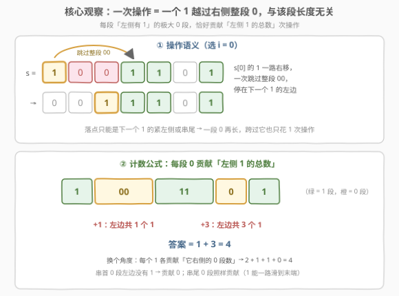
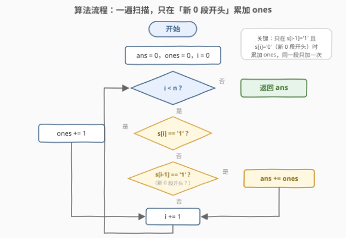
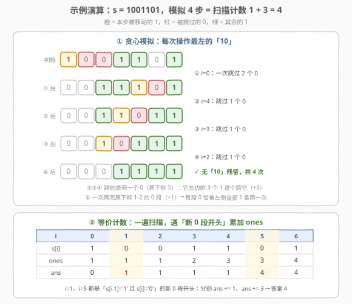

# LeetCode 将 1 移动到末尾的最大操作次数 题解

## 1. 题目概述

- **标题 / 题号**：将 1 移动到末尾的最大操作次数（#3228，medium）
- **链接**：https://leetcode.cn/problems/maximum-number-of-operations-to-move-ones-to-the-end/
- **难度**：中等
- **标签**：贪心、字符串、计数

**题意**：给你一个**二进制字符串** $s$。你可以对这个字符串执行**任意次**下述操作：

- 选择字符串中的任一下标 $i$（$i + 1 < s.length$），该下标满足 $s[i] = \text{'1'}$ 且 $s[i+1] = \text{'0'}$；
- 将字符 $s[i]$ 向**右移**直到它到达字符串的末端或另一个 $\text{'1'}$。例如，对于 $s = \text{"010010"}$，如果我们选择 $i = 1$，结果字符串将会是 $s = \text{"000110"}$。

返回你能执行的**最大**操作次数。

**示例 1**：

```text
输入：s = "1001101"
输出：4
解释：依次选 i = 0、4、3、2：
     "1001101" → "0011101" → "0011011" → "0010111" → "0001111"，共 4 次操作。
```

**示例 2**：

```text
输入：s = "00111"
输出：0
解释：不存在下标 i 满足 s[i]='1' 且 s[i+1]='0'（所有的 1 连成一片压在末尾），无法操作。
```

**约束**：

- $1 \le s.length \le 10^5$
- $s[i]$ 为 '0' 或 '1'

> 💡 **审题关键**：操作的两个细节决定一切。① 动的前提是「1 紧跟 0」——一个 1 想要能动，右边必须紧贴着 0；② 移动是「**滑行**」而不是「交换」——这个 1 一路右移，**跨过整段连续的 0**，停在下一个 1 的紧左侧或串尾。所以一次操作能吞掉一整段 0，问「最多操作几次」本质是问：**1 与 0 段之间总共能发生多少次跨越**。

## 2. 解题思路

### 2.1 暴力思路：状态搜索 / 直接模拟

**暴力一（记忆化搜索）**：从 $s$ 出发，枚举所有满足「$s[i]=\text{'1'}$，$s[i+1]=\text{'0'}$」的下标逐一尝试操作，转移到新串，递归求最大深度：

```python
from functools import lru_cache

def maxOperations_brute(s: str) -> int:
    @lru_cache(maxsize=None)
    def f(t: str) -> int:
        best = 0
        for i in range(len(t) - 1):
            if t[i] == '1' and t[i + 1] == '0':
                j = i + 1
                while j < len(t) and t[j] == '0':   # 找到 1 的落点
                    j += 1
                nt = t[:i] + t[i + 1:j] + '1' + t[j:]  # 跳过整段 0
                best = max(best, 1 + f(nt))
        return best
    return f(s)
```

不同操作序列会产生大量互不相同的中间串，状态数最坏指数级，$n = 10^5$ 完全不可行——但它是对拍利器（长度 $\le 12$ 的全部二进制串验证通过）。

**暴力二（直接模拟）**：hint 告诉我们「每次操作最左的 "10"」是最优的，那么老老实实模拟、数步数就行——正确，但依然超时：操作次数本身就可以达到 $\Theta(n^2)$ 量级（如 `1010…10` 约 $n^2/8$ 次），光是数步数就是 $10^9$ 级，必须**不模拟而直接计数**。

> ⚠️ 暴力二的困境正是本题的题眼：答案的**规模**是 $\Theta(n^2)$，但我们只有 $O(n)$ 时间——所以答案必须由一个**公式**直接算出，而不是一步步数出来。

### 2.2 核心观察：一次跨越一整段 0，每段 0 贡献其左侧 1 的总数



把 $s$ 切成交替的「1 段」和「0 段」，三个观察层层递进：

**观察一（操作的语义）**：被移动的 1 总是越过它右侧紧邻的**整段连续 0**（长度任意），落在下一个 1 的紧左侧或串尾。因此——**跨越一段 0 恰好 1 次操作，与该段长度无关**。

**观察二（单向性，给出上界）**：1 相对 0 只会右移，0 相对 1 只会左移。某个 1 一旦越过某段 0，就永远留在它右边——所以**每个 (1, 0 段) 组合至多贡献 1 次操作**。

**观察三（贪心取满上界）**：每次操作**最左**的 "10" 时，0 段像传送带一样逐段「清算」：轮到第 $k$ 段 0 时，它左侧的 $m_k$ 个 1 已连成一整块，自右向左**逐个**跨越这段 0（每人恰好 1 次操作）；清算完的 0 段沉入串首 0 区，永不再被跨越。于是每段 0 恰好被左侧全部 $m_k$ 个 1 各跨一次。

三条观察合起来得到计数公式：

$$
\text{答案} \;=\; \sum_{\text{每段前面有 1 的极大 0 段}} \big(\text{该段左侧 1 的总数}\big) \;=\; \sum_{\text{每个 1}} \big(\text{它右侧的 0 段数}\big)
$$

两种求和方向完全等价。对示例 1 验证：`1001101` 切成 `1 | 00 | 11 | 0 | 1`——第 1 段 0 左侧 1 个 1（贡献 1），第 2 段 0 左侧 3 个 1（贡献 3），合计 $4$ ✓；按 1 计则是 $2+1+1+0=4$（第一个 1 右侧有 2 段 0，以此类推）。

> 💡 最容易犯的错是按「1 右边 0 的**个数**」计数——那是逆序对数。`1001101` 的逆序对是 5，但答案是 4：第一个 1 一次跨过 `00` **两个** 0，只记 1 次。**按段计数，不按个数计数**。

### 2.3 算法流程图



公式落到代码上是一次线性扫描：

| 步骤 | 操作 | 语义 |
|------|------|------|
| ① 遇到 '1' | `ones += 1` | 维护「目前左侧 1 的总数」 |
| ② 遇到 '0' 且前一位是 '1' | `ans += ones` | 一段**新** 0 的开头：左侧每个 1 都将跨越它一次 |
| ③ 遇到 '0' 且前一位也是 '0' | 什么都不做 | 还在同一段 0 里，不产生新操作 |
| 扫描结束 | 返回 `ans` | 即 $\sum m_k$ |

注意 ② 的判定条件 `s[i-1] == '1'` 保证了**每段 0 只在开头加一次**；串首的 0 段因左侧没有 1（`ones = 0`），加了也白加，自然被处理掉。

### 2.4 示例演算



**贪心模拟**（每次操作最左的 "10"，橙 = 被移动的 1，红 = 被跨过的 0）：

| 步骤 | 选 $i$ | 被跨过的 0 | 操作后的 $s$ |
|------|:---:|------|------|
| ① | 0 | 第 1 段（2 个 0，一次跨完） | `0011101` |
| ② | 4 | 第 2 段 | `0011011` |
| ③ | 3 | 第 2 段（**还是那个 0**） | `0010111` |
| ④ | 2 | 第 2 段（仍是它） | `0001111` ✓ |

注意 ②③④ 跨的是**同一个物理 0**（原下标 5）：它左边的 3 个 1 自右向左逐个跨过它——这正是「第 2 段贡献 3」的由来；① 中最左的 1 一次跨完原下标 1–2 的 0 段——「第 1 段贡献 1」。

**一遍扫描计数**：

| $i$ | 0 | 1 | 2 | 3 | 4 | 5 | 6 |
|------|---|---|---|---|---|---|---|
| $s[i]$ | 1 | 0 | 0 | 1 | 1 | 0 | 1 |
| ones（处理后） | 1 | 1 | 1 | 2 | 3 | 3 | 4 |
| 事件 | — | **新 0 段 → +1** | 同段，不加 | — | — | **新 0 段 → +3** | — |
| ans（处理后） | 0 | **1** | 1 | 1 | 1 | **4** | 4 |

两种方法殊途同归：答案 $= 1 + 3 = 4$ ✓。

**示例 2**（`00111`）：全程没有「1 后紧跟 0」的位置，两处判定都不触发，答案 0 ✓。

**易错自测**：`1010` → 3（尾部的 0 段照样贡献 2——1 可以一路滑到**串尾**，别漏）；`0110` → 2（两个 1 都要跨过尾部那段 0）。

## 3. 参考代码

### C++

```cpp
class Solution {
public:
    int maxOperations(string s) {
        int ans = 0, ones = 0;
        for (int i = 0; i < (int)s.size(); ++i) {
            if (s[i] == '1') {
                ++ones;                          // 又见到一个 1
            } else if (i > 0 && s[i - 1] == '1') {
                ans += ones;                     // 新 0 段开头：左侧每个 1 都将跨越它一次
            }
        }
        return ans;
    }
};
```

> 💡 答案上界约 $n^2/8 \approx 1.25 \times 10^9$（$n = 10^5$，最坏形如 `1010…10`），恰好在 `int`（上限约 $2.15 \times 10^9$）范围内；若题目把 $n$ 放宽一档，记得换 `long long`。

### Python

```python
class Solution:
    def maxOperations(self, s: str) -> int:
        ans = ones = 0
        for i, c in enumerate(s):
            if c == '1':
                ones += 1                        # 又见到一个 1
            elif i > 0 and s[i - 1] == '1':
                ans += ones                      # 新 0 段开头：左侧 ones 个 1 各贡献一次操作
        return ans
```

> 💡 也可以用 `itertools.groupby` 按「段」思考：`1` 段累进 `ones`；每个前面有 1 的 `0` 段整体 `ans += ones`——与逐字符写法完全等价，只是把「新 0 段开头」的判断交给了分组。

## 4. 复杂度分析

| 维度 | 复杂度 | 说明 |
|------|--------|------|
| **时间复杂度** | $O(n)$ | 单次线性扫描，每个字符 $O(1)$ 处理 |
| **空间复杂度** | $O(1)$ | 只用 `ans`、`ones` 两个计数器 |

> 对照 2.1：直接模拟是 $\Omega(\text{答案}) = \Omega(n^2)$——因为操作次数本身就可能是平方量级。$O(n)$ 公式之所以可行，是因为它**不逐次数操作**，而是按「0 段 × 左侧 1 数」把所有操作一次性加总。

## 5. 扩展

### 5.1 最优性证明：计票（势能）论证

为什么 $\sum m_k$ 既是贪心的产出，也是任何策略的天花板？

- **引理 1（0 段不分裂）**：操作落点只能是「某个 1 的紧左侧」或串尾，绝不会落进 0 段中间；且每次跳跃跨过的是紧邻的整段连续 0。因此任意时刻的每个极大 0 段都是若干**原始** 0 段的粘连（零之间的 1 全跑右边去了），零的相对顺序不变。
- **引理 2（单向性）**：某个 1 越过一批 0 后永远在它们右边——相对位置一旦翻转不可逆。

**计票**：给每个有序对（1 $x$，原始 0 段 $Z$ 且 $Z$ 在 $x$ 右侧）发一张票，共 $\sum m_k$ 张。每次操作中，被移动的 1 至少完整越过一个原始 0 段——**至少撕掉一张票**（若该处多段已粘连，一次撕多张）；由引理 2，每张票**至多被撕一次**。故任意操作序列长度 $\le \sum m_k$。而 2.2 的贪心恰好让每张票各被撕一次，达到上界。∎

顺带一提交换论证的直觉：操作更右边的 "10" 不改变其左侧前缀，最左的机会不会被破坏——任何最优序列都可重排为「最左优先」而不减步数，这就是 hint「操作最低下标最优」的原因。

### 5.2 与逆序对 / 冒泡排序的对照

| 模型 | 每次操作 | 总次数 |
|------|---------|--------|
| 冒泡（交换相邻的 1 和 0） | 恰好跨过 **1 个** 0 | 逆序对数 $= \sum_{\text{每个 1}}(\text{右侧 0 的个数})$ |
| **本题（滑行）** | 跨过**一整段** 0 | $\sum_{\text{每个 1}}(\text{右侧 0 段的段数})$ |

两者之差就是「一次跨多 0」的折扣：`1001101` 逆序对 5、答案 4（最左的 1 一次跨 `00` 省 1）；当所有 0 段长度都为 1 时二者相等。这一对照也再次解释了为什么代码里同一段 0 的后续字符不再累加。

### 5.3 「移动 1」问题家族：求最少 vs 求最多

| 题目 | 目标 | 核心手段 |
|------|------|---------|
| [1151](https://leetcode.cn/problems/minimum-swaps-to-group-all-1s-together/) / [2134](https://leetcode.cn/problems/minimum-swaps-to-group-all-1s-together-ii/) | 聚拢所有 1 的**最少**交换 | 定长滑窗数 0 |
| [1703](https://leetcode.cn/problems/minimum-adjacent-swaps-for-k-consecutive-ones/) | 连续 K 个 1 的**最少**相邻交换 | 滑窗 + 中位数 + 前缀和 |
| **3228（本题）** | 滑行操作的**最多**次数 | 0 段计数公式 |

同一个「1 在 0/1 串里搬家」的世界观，方向不同、工具不同——但「先看清操作到底跨越了什么」是共同的第一步。

## 6. 面试要点

1. **为什么只在「新 0 段开头」处 `ans += ones`，而不是每个 '0' 都加？**

   > 一次操作跨过的是**整段**连续 0——同一段里的后续 0 不再产生新操作。每个 1 对每段 0 至多贡献 1 次，所以按「段」累加，`s[i-1]=='1' && s[i]=='0'` 正是「新段开头」的信号。

2. **怎么证明这个数就是上界，不可能操作更多次？**

   > 计票论证：给每个 (1, 其右侧的原始 0 段) 组合发一张票，共 $\sum m_k$ 张；每次操作至少完整跨越一个原始 0 段（至少撕一票），且 1 越过 0 段后永不回头（每票至多撕一次）→ 操作数 $\le \sum m_k$。最左优先贪心恰好取满。

3. **答案最大多大？C++ 的 `int` 会不会溢出？**

   > 最坏 `1010…10`：$\sum \approx n^2/8 \approx 1.25 \times 10^9$（$n = 10^5$），`int` 勉强装下但已过半程；再放宽 $n$ 就该用 `long long`。面试时主动报出这个量级是加分项。

4. **答案和逆序对数是什么关系？**

   > 逆序对按「1 右侧 0 的个数」计，本题按「1 右侧 0 的**段**数」计——一次滑行可跨多 0。答案 $\le$ 逆序对数，所有 0 段长均为 1 时取等。`1001101`：逆序对 5，答案 4。

5. **串首和串尾的 0 段分别怎么处理？**

   > 串首 0 段左侧没有 1，贡献 0（扫描时 `ones=0`，加了也是 0，天然正确）；串尾 0 段**照样贡献**——1 可以一路滑到串尾，`1010` 的答案 3 里尾 0 段贡献了 2。

> 💡 **一句话总结**：一次操作 = 一个 1 越过一整段 0。答案 $= \sum$ 每段 0 左侧 1 的总数，一遍扫描、遇「新 0 段开头」累加 `ones` 即得，$O(n)$ / $O(1)$。

## 同类练习题

| # | 题目 | 与本题的关联 |
|---|------|-------------|
| 926 | [将字符串翻转到单调递增](https://leetcode.cn/problems/flip-string-to-monotone-increasing/)（[站内题解](../0901-1000/926_将字符串翻转到单调递增.md)） | 同样靠「前缀 1 计数 + 一遍扫描」的 0/1 串套路，目标是前 0 后 1 |
| 1151 | [最少交换次数来组合所有的 1](https://leetcode.cn/problems/minimum-swaps-to-group-all-1s-together/)（[站内题解](../1101-1200/1151_最少交换次数来组合所有的1.md)） | 同族「移动 1」问题但求**最少**（定长滑窗数 0），与本题求**最多**互为镜像 |
| 2134 | [最少交换次数来组合所有的 1 II](https://leetcode.cn/problems/minimum-swaps-to-group-all-1s-together-ii/)（[站内题解](../2101-2200/2134_最少交换次数来组合所有的1II.md)） | 1151 的环形版（断环成链 + 滑窗） |
| 1703 | [得到连续 K 个 1 的最少相邻交换次数](https://leetcode.cn/problems/minimum-adjacent-swaps-for-k-consecutive-ones/)（[站内题解](../1701-1800/1703_得到连续K个1的最少相邻交换次数.md)） | 移动 1 家族的困难题，滑窗 + 中位数 + 等差数列加速 |
| 1653 | [使字符串平衡的最少删除次数](https://leetcode.cn/problems/minimum-deletions-to-make-string-balanced/)（[站内题解](../1601-1700/1653_使字符串平衡的最少删除次数.md)） | 一遍扫描维护「左侧 1 计数」的近亲结构，对照记忆两套扫描模板 |
