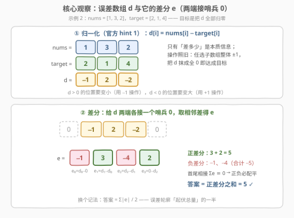
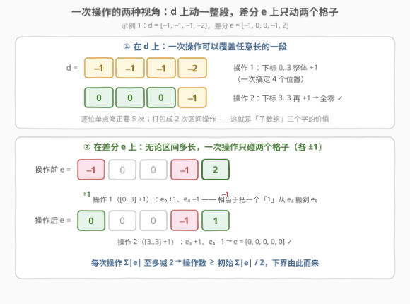
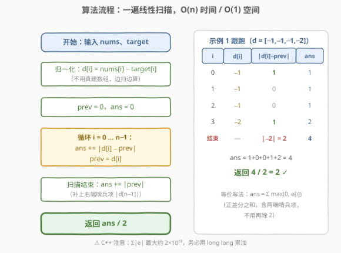
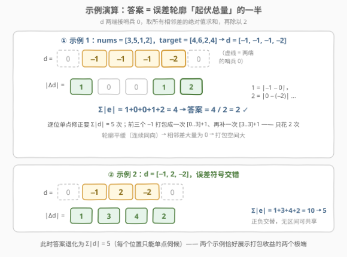

# LeetCode 使数组等于目标数组所需的最少操作次数 题解

## 1. 题目概述

- **标题 / 题号**：使数组等于目标数组所需的最少操作次数（#3229，hard）
- **链接**：https://leetcode.cn/problems/minimum-operations-to-make-array-equal-to-target/
- **难度**：困难
- **标签**：贪心、数组、差分数组、动态规划、单调栈

**题意**：给你两个**长度相同的正整数数组** `nums` 和 `target`。在一次操作中，你可以选择 `nums` 的**任何子数组**，并将该子数组内的每个元素的值**增加或减少 1**。

返回使 `nums` 数组变为 `target` 数组所需的**最少**操作次数。

**示例 1**：

```text
输入：nums = [3,5,1,2], target = [4,6,2,4]
输出：2
解释：nums[0..3] 增加 1 → [4,6,2,3]；nums[3..3] 再增加 1 → [4,6,2,4]。
```

**示例 2**：

```text
输入：nums = [1,3,2], target = [2,1,4]
输出：5
解释：5 次单点操作：nums[0]+1、nums[1]−1、nums[1]−1、nums[2]+1、nums[2]+1。
```

**约束**：

- $1 \le \text{nums.length} = \text{target.length} \le 10^5$
- $1 \le \text{nums}[i], \text{target}[i] \le 10^8$

> 💡 **审题关键**：操作的单位是「**子数组**」而非「下标」——一次操作可以同时伺候**一整段连续位置**，不管这段有多长。所以逐位看 $\sum|\text{nums}[i]-\text{target}[i]|$（每个位置单点修到目标值）只是**可行上界**而非最优：示例 1 逐位要 5 次，答案只要 2 次。全部题眼在于：**哪些位置的误差可以被「打包」进同一次区间操作**。

## 2. 解题思路

### 2.1 暴力思路：逐位修正 / 状态搜索

**暴力一（逐位单点修正）**：对每个下标 $i$ 独立执行 $|\text{nums}[i]-\text{target}[i]|$ 次长度为 1 的操作，总次数 $\sum_i |d_i|$（$d$ 见下）。正确但明显不最优——示例 1 给出 $5$ 次，而答案是 $2$ 次，浪费的正是「区间打包」能力。

**暴力二（最短路搜索）**：把整个数组视为状态，每次操作有 $2\cdot\frac{n(n+1)}{2}$ 种转移，BFS 求最少步数。状态空间随值域与 $n$ 指数爆炸，$n=10^5$、值域 $10^8$ 下毫无希望——但它是**对拍利器**（$n\le 5$、$|d_i|\le 3$ 的全部实例验证了 2.2 的公式，见下文）。

> ⚠️ 本题是 Hard，卡点不在实现而在**建模**：直接在「值」的层面怎么数都数不清，必须换一个视角，让「一次操作」的效果变得**可数**。

### 2.2 核心观察：差分数组——一次操作 = 搬运一个 1



**第一步（归一化，官方 hint 1）**：令 $d_i = \text{nums}[i] - \text{target}[i]$。目标变成「把 $d$ 全部归零」，操作照旧是「任选子数组整体 $\pm 1$」。$d_i>0$ 的位置需要「变小」（用 $-1$ 操作），$d_i<0$ 的位置需要「变大」（用 $+1$ 操作）。

**第二步（差分）**：给 $d$ **两端各接一个哨兵 $0$**，定义差分数组：

$$
e_0 = d_0 - 0,\qquad e_i = d_i - d_{i-1}\ (1\le i\le n-1),\qquad e_n = 0 - d_{n-1}
$$

首尾相接求和必然 telescoping 归零：$\sum_{i=0}^{n} e_i \equiv 0$，**正差分之和恒等于负差分绝对值之和**。

**第三步（操作的差分语义）**：子数组 $[l, r]$ 整体 $+1$，在差分视角下是

$$
e_l \mathrel{+}= 1,\qquad e_{r+1} \mathrel{-}= 1
$$

（$-1$ 操作则恰好相反。）**无论区间多长，一次操作只碰 $e$ 的两个格子、各 $\pm 1$**——相当于在差分数组上把一个「1」从一个格子**搬运**到另一个格子。



**第四步（答案）**：$d\equiv 0 \iff e\equiv 0$。由于 $\sum e\equiv 0$，只需把正格子里的每个 $+1$ **搬给**某个负格子抵消——每搬一次消除一正一负共两个单位的绝对值。于是

$$
\text{ans} \;=\; \sum_{i=0}^{n} \max(0,\, e_i) \;=\; \frac{1}{2}\sum_{i=0}^{n} |e_i| \;=\; \frac{|d_0| + \sum_{i=1}^{n-1}|d_i - d_{i-1}| + |d_{n-1}|}{2}
$$

**验证**：示例 1 中 $d=[-1,-1,-1,-2]$，$e=[-1,0,0,-1,2]$，正差分之和 $=2$ ✓；示例 2 中 $d=[-1,2,-2]$，$e=[-1,3,-4,2]$，正差分之和 $=3+2=5$ ✓。

> 💡 **直觉版理解**：把 $d$ 画成有正有负的「地形剖面」。$-1$ 操作是**削**一条水平横带，$+1$ 操作是**填**一条水平横带；正地形需要的横带数 = 正差分之和（每条横带的左端都对应一次「爬升」），负地形同理。总操作数 = 削的带数 + 填的带数。差分公式正是这个「带数」的代数表达。
>
> ⚠️ 与 1526 的单向公式对照记忆：那边只用 $+1$、只接**左**哨兵、不除 2；本题双向 $\pm1$、接**双**哨兵、除 2（详见 5.2）。

### 2.3 算法流程图



公式落到代码上是一次线性扫描，连 $d$、$e$ 数组都不用真建：

| 步骤 | 操作 | 语义 |
|------|------|------|
| ① 初始化 | `prev = 0, ans = 0` | `prev` 是「上一个 $d$ 值」，左端哨兵为 0 |
| ② 循环每个 $i$ | `d = nums[i] - target[i]; ans += abs(d - prev); prev = d` | 累加起伏量 $\|d_i - d_{i-1}\|$ |
| ③ 扫描结束 | `ans += abs(prev)` | 补上右端哨兵项 $\|d_{n-1}\|$ |
| ④ 返回 | `ans / 2` | 正差分之和 = 起伏总量的一半 |

### 2.4 示例演算



**示例 1**：$d=[-1,-1,-1,-2]$，相邻差（含两端哨兵）$= 1,0,0,1,2$，$\sum|e|=4$，答案 $=4/2=2$ ✓——三个 $-1$ 被一次 $[0..3]{+}1$ 打包、$-2$ 的「深一格」再补一次 $[3..3]{+}1$，**逐位修正的 5 次被压缩到 2 次**。

**示例 2**：$d=[-1,2,-2]$，相邻差 $= 1,3,4,2$，$\sum|e|=10$，答案 $=5$ ✓——误差**符号交错**，正负位置无法共享同一次区间操作，答案退化成 $\sum|d_i|=5$（每个位置单点伺候）。

两个示例恰是「打包收益」的两个极端：**轮廓越平缓（连续同向），$\sum|e|$ 越接近 $2\sum|d|$ 的一半以下，区间操作越划算；轮廓锯齿交错，就只能逐位修**。

**易错自测**：`nums == target` → $d\equiv 0$，答案 0；单元素 `nums=[5], target=[3]` → $d=[2]$，$\sum|e| = 2+2 = 4$，答案 2（同一个位置 $-1$ 两次，不能「一次操作改 2」）。

## 3. 参考代码

### C++

```cpp
class Solution {
public:
    long long minimumOperations(vector<int>& nums, vector<int>& target) {
        long long ans = 0;
        long long prev = 0;                       // 左端哨兵 0
        for (int i = 0; i < (int)nums.size(); ++i) {
            long long d = (long long)nums[i] - target[i];
            ans += llabs(d - prev);               // 累加起伏量 |d[i] - d[i-1]|
            prev = d;
        }
        ans += llabs(prev);                       // 右端哨兵项 |d[n-1]|
        return ans / 2;                           // 正差分之和 = 起伏总量的一半
    }
};
```

> ⚠️ **溢出**：$n\le 10^5$、$|d_i|<10^8$，故 $\sum|e|\le 2\sum|d_i|\le 2\times 10^{13}$，超出 `int`（约 $2.1\times 10^9$）三个数量级——**累加器必须 `long long`**（本题函数签名也返回 `long long`，是个提示）。

### Python

```python
class Solution:
    def minimumOperations(self, nums: List[int], target: List[int]) -> int:
        ans = 0
        prev = 0                                  # 左端哨兵 0
        for a, b in zip(nums, target):
            d = a - b
            ans += abs(d - prev)                  # 累加起伏量
            prev = d
        return (ans + abs(prev)) // 2             # 补右端哨兵项，除以 2
```

## 4. 复杂度分析

| 维度 | 复杂度 | 说明 |
|------|--------|------|
| **时间复杂度** | $O(n)$ | 单次线性扫描，每个位置 $O(1)$ |
| **空间复杂度** | $O(1)$ | 只用 `prev`、`ans` 两个变量，$d$、$e$ 都无需落地 |

> 对照 2.1：BFS 是指数级；逐位修正是 $O(n)$ 但给出的答案错。公式解同为 $O(n)$ 却一步到位——Hard 题的「难」被差分视角一次性消化。

## 5. 扩展

### 5.1 最优性证明：下界 + 构造

**下界（任何策略至少要 $\sum_{e_i>0} e_i$ 次）**：一次操作只改变 $e$ 的两个格子、各 $\pm 1$，因此 $\sum|e_i|$ 每次至多减少 $2$。初始 $\sum|e_i| = 2\sum_{e_i>0}e_i$，终态为 $0$，故操作数 $\ge \sum_{e_i>0} e_i$。∎

**构造（该下界总能取到）**：只要还有正格子 $i$（$e_i>0$）和负格子 $j$（$e_j<0$）：

- 若 $i < j$：对子数组 $[i,\, j-1]$ 做 $-1$ 操作（$e_i\mathrel{-}=1,\ e_j\mathrel{+}=1$）；
- 若 $i > j$：对子数组 $[j,\, i-1]$ 做 $+1$ 操作（$e_j\mathrel{+}=1,\ e_i\mathrel{-}=1$）。

每次操作让 $|e_i|$ 与 $|e_j|$ 各减 1、其余不变，且**从不越过 0 产生新正负**（按 $\min$ 截断即可），恰好 $\sum_{e_i>0} e_i$ 次归零。

> 💡 这个下界对**一切**操作序列一刀切，顺带封死了「用混合方向的长区间操作抖机灵」的可能——任何操作都逃不出「每次至多消除两个单位起伏」的物理上限。

### 5.2 与 1526 的联系：单向版 → 双向版

| | [1526](https://leetcode.cn/problems/minimum-number-of-increments-on-subarrays-to-form-a-target-array/)（形成目标数组的子数组最少增加次数） | **3229（本题）** |
|---|---|---|
| 起点 | 全 0 数组 | 任意 `nums`（归一化为误差 $d$） |
| 允许操作 | 仅 $+1$ 区间 | $\pm1$ 区间 |
| 差分哨兵 | 只需**左**端 | **左右两端都要** |
| 答案 | $\text{target}[0] + \sum \max(0, \Delta)$，**不除 2** | $\dfrac{|d_0| + \sum|\Delta| + |d_{n-1}|}{2}$ |

为什么 1526 不除 2？$+1$ 操作只能把「1」向**左**搬，正差分必须每单位独立支付、负差分帮不上忙；本题 $\pm1$ 双向都能搬，正负差分**互相抵消配对**，于是恰好减半。同一套「区间操作 ↔ 差分搬运」世界观的两次 instantiation。

### 5.3 官方标签里的栈与分治（另一副皮囊）

- **单调栈 / 贡献视角**：把 $d$ 看成柱状图逐层「剥皮」——维护单调栈，遇爬升把「新起的层」数累加，遇下降出栈抵扣。统计量与 $\sum\max(0,e_i)$ 完全一致，本质是同一公式的栈实现（类似 84 题家族按层结算的套路）。
- **分治（官方 hint 2）**：对区间 $[l,r]$，把整段**一次剥掉 $\min$ 层**（消耗 $\min$ 次操作），在最小值处分裂成左右两半递归。剥一层 = 一次操作，总消耗仍收敛到差分公式。

三条路殊途同归——面试里能讲清差分证明，再点一句「栈/分治是同构实现」，就到位了。

## 6. 面试要点

1. **为什么答案不是 $\sum|\text{nums}[i]-\text{target}[i]|$？**

   > 逐位单点修正只是可行上界。一次区间操作可同时伺候一整段连续、同向的误差；差分 $e$ 恰好度量了「轮廓起伏总量」，$\sum_{e_i>0}e_i$ 就是不可再压缩的最少打包次数。

2. **公式两端的 $|d_0|$、$|d_{n-1}|$ 是哪来的？为什么要除以 2？**

   > 给 $d$ 两端各接哨兵 0 后，$|d_0|$ 与 $|d_{n-1}|$ 正是首尾两个差分项。首尾相接 $\sum e\equiv 0$，正差分之和 = 负差分绝对值之和 = $\sum|e|/2$，所以总起伏量要除以 2。

3. **怎么证明不可能比 $\sum\max(0,e_i)$ 更少？**

   > 一次操作无论区间多长，只改差分的两个格子各 $\pm1$，$\sum|e|$ 至多减 2；初始 $\sum|e|=2\sum\max(0,e_i)$，故操作数有下界。配对搬运构造恰好达到它。

4. **C++ 里最可能翻车的点？**

   > 溢出：$\sum|e|$ 可达 $2\times 10^{13}$，`int` 累加必炸，用 `long long`（题目签名返回 `long long` 就是提示）。

5. **和 1526 什么关系？**

   > 1526 是「单向 $+1$、从 0 出发」的版本，答案 = 正差分之和（只接左哨兵、不除 2）；本题允许 $\pm1$，正负差分可配对抵消，答案 = 总起伏的一半。对照记忆两套公式。

> 💡 **一句话总结**：先做差 $d=\text{nums}-\text{target}$，答案就是误差轮廓**起伏总量的一半**——$\big(|d_0|+\sum|d_i-d_{i-1}|+|d_{n-1}|\big)/2$，一遍扫描 $O(n)$/$O(1)$，记得 `long long`。

## 同类练习题

| # | 题目 | 与本题的关联 |
|---|------|-------------|
| 1526 | [形成目标数组的子数组最少增加次数](https://leetcode.cn/problems/minimum-number-of-increments-on-subarrays-to-form-a-target-array/)（[站内题解](../1501-1600/1526_形成目标数组的子数组最少增加次数.md)） | 本题的单向 $+1$ 母题，$\text{ans}=\sum\max(0,\Delta)$，对照理解「为什么那边不除 2」 |
| 1109 | [航班预订统计](https://leetcode.cn/problems/corporate-flight-bookings/)（[站内题解](../1001-1100/1109_航班预订统计.md)） | 差分数组的正向应用（区间加 → 还原数组），与本题「数组 → 差分」互为镜像 |
| 1094 | [拼车](https://leetcode.cn/problems/car-pooling/)（[站内题解](../1001-1100/1094_拼车.md)） | 差分数组 + 前缀和判容量，巩固「区间事件只在两端留痕」的直觉 |
| 1589 | [所有排列中的最大和](https://leetcode.cn/problems/maximum-sum-obtained-of-any-permutation/)（[站内题解](../1501-1600/1589_所有排列中的最大和.md)） | 差分数组统计每个下标被多少区间覆盖 + 排序贪心配对，差分思想的另一副面孔 |
