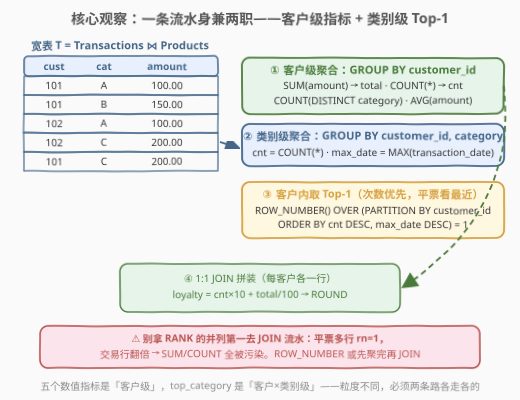
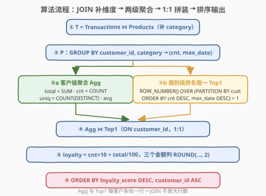
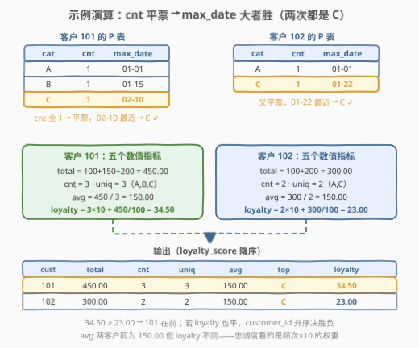

# 客户购买行为分析

- **题目名称**：客户购买行为分析
- **链接**：[3230. 客户购买行为分析 🔒](https://leetcode.cn/problems/customer-purchasing-behavior-analysis/)
- **难度**：中等
- **标签**：数据库、SQL、JOIN、`GROUP BY`、两级聚合、窗口函数、`ROW_NUMBER()`、Top-N per group、CTE、LeetCode 锁题

## 1. 题目概述

> ⚠️ 本题为 LeetCode 付费题（锁题），题意描述根据官方示例用例与外部资料重建，可能与官方题面有出入。（题面已与社区镜像 doocs/leetcode 的官方中文翻译交叉核对，示例输入输出与 GraphQL 接口返回一致，出入风险较低。）

**表结构**：`Transactions`

| 列名 | 类型 |
|------|------|
| transaction_id | int |
| customer_id | int |
| product_id | int |
| transaction_date | date |
| amount | decimal |

- `transaction_id` 是这张表的唯一标识符。
- 每行包含一次交易的信息：客户 ID、产品 ID、日期和总花费。

**表结构**：`Products`

| 列名 | 类型 |
|------|------|
| product_id | int |
| category | varchar |
| price | decimal |

- `product_id` 是这张表的唯一标识符。
- 每行包含一个产品的分类和价格。

**目标**：编写一个解决方案来分析用户购买行为。对于**每个客户**，计算：

- `total_amount`：总消费额；
- `transaction_count`：交易数量；
- `unique_categories`：购买的**不同**产品类别的数量；
- `avg_transaction_amount`：平均消费金额；
- `top_category`：**最常购买**的产品类别（如果次数相同，选择**最近交易**的那个）；
- `loyalty_score`：忠诚度分数，定义为 $(\text{交易数量} \times 10) + (\text{总消费额} / 100)$。

将 `total_amount`、`avg_transaction_amount` 和 `loyalty_score` **舍入到 2 位小数**。返回结果表以 `loyalty_score` **降序**排序，再以 `customer_id` **升序**排序。

**示例 1**：

```text
输入：
Transactions 表：
+----------------+-------------+------------+------------------+--------+
| transaction_id | customer_id | product_id | transaction_date | amount |
+----------------+-------------+------------+------------------+--------+
| 1              | 101         | 1          | 2023-01-01       | 100.00 |
| 2              | 101         | 2          | 2023-01-15       | 150.00 |
| 3              | 102         | 1          | 2023-01-01       | 100.00 |
| 4              | 102         | 3          | 2023-01-22       | 200.00 |
| 5              | 101         | 3          | 2023-02-10       | 200.00 |
+----------------+-------------+------------+------------------+--------+

Products 表：
+------------+----------+--------+
| product_id | category | price  |
+------------+----------+--------+
| 1          | A        | 100.00 |
| 2          | B        | 150.00 |
| 3          | C        | 200.00 |
+------------+----------+--------+

输出：
+-------------+--------------+-------------------+-------------------+------------------------+--------------+---------------+
| customer_id | total_amount | transaction_count | unique_categories | avg_transaction_amount | top_category | loyalty_score |
+-------------+--------------+-------------------+-------------------+------------------------+--------------+---------------+
| 101         | 450.00       | 3                 | 3                 | 150.00                 | C            | 34.50         |
| 102         | 300.00       | 2                 | 2                 | 150.00                 | C            | 23.00         |
+-------------+--------------+-------------------+-------------------+------------------------+--------------+---------------+
```

**解释**：

- **客户 101**：总消费 $100+150+200=450.00$；交易 3 次；类别 A、B、C 共 3 类；平均 $450/3=150.00$；A、B、C 各买 1 次**平票**，取最近交易（2023-02-10）的类别 **C**；忠诚度 $3\times10+450/100=34.50$。
- **客户 102**：总消费 $100+200=300.00$；交易 2 次；类别 A、C 共 2 类；平均 $300/2=150.00$；A、C 各买 1 次**平票**，取最近交易（2023-01-22）的类别 **C**；忠诚度 $2\times10+300/100=23.00$。

> 💡 **审题关键**：① 六个指标里五个是**客户级**聚合，唯独 `top_category` 的统计粒度是**客户 × 类别**——单层 `GROUP BY` 喂不饱两种粒度，必须**两级聚合**；② `top_category` 的平票规则是复合排序：**次数优先，次数相同比最近交易日期**（注意比较的是该类别的 `MAX(transaction_date)`，不是交易 ID）；③ `loyalty_score` 的公式里 `total / 100` 用**未舍入的总和**参与计算，最后才 `ROUND(..., 2)`；④ 排序键是 `loyalty_score DESC, customer_id ASC`——输出列顺序与排序键无关。

---

## 2. 解题思路

### 2.1 暴力思路：相关子查询逐指标回表

先把流水和产品表连接成宽表，再对**每个客户**逐个指标写相关子查询——五个数值指标各扫一遍、`top_category` 还要嵌套两层（先找最大次数，再在最大次数里找最近日期）：

```sql
-- T 为 JOIN 好的宽表；每个指标一条相关子查询
SELECT t.customer_id,
       (SELECT SUM(amount) FROM T WHERE T.customer_id = t.customer_id) AS total_amount,
       (SELECT COUNT(*) FROM T WHERE T.customer_id = t.customer_id) AS transaction_count,
       (SELECT COUNT(DISTINCT category) FROM T WHERE T.customer_id = t.customer_id) AS unique_categories,
       ...  -- avg 同理；top_category 还要嵌套两层子查询
FROM (SELECT DISTINCT customer_id FROM T) t;
```

- **正确性**：能对，但 `top_category` 的「次数 → 平票看日期」两级优先级写成子查询极易出错（`MAX(cnt)` 平票取哪一行是未定义的）；
- **效率**：$c$ 个客户 × 每指标全表回扫，$O(c \cdot n)$ 起步，同一份宽表被反复读；
- **别扭之处**：五个指标明明是**同一组行**上的聚合，却被拆成五条独立查询；`top_category` 的两级优先级与数值聚合的粒度完全不同，硬塞在同一层 `SELECT` 里只能靠子查询打补丁。

> ⚠️ 暴力的根源是把「两种粒度的聚合」当成了「六列独立计算」。突破口：先 `JOIN` 出一张带 `category` 的宽表，再让「客户级」和「客户 × 类别级」**两条聚合管线各走各的**，最后 1:1 拼回来。

### 2.2 核心观察：一条流水身兼两职——JOIN 一次 + 两级聚合



**观察 1（先补维度：流水 → 宽表）**：`category` 在 `Products` 表里，六个指标全都用到它，所以第一步永远是把两表 `JOIN` 成宽表 $T$（Transactions ⋈ Products）——之后所有聚合都在 $T$ 上进行，JOIN 只做一次。

**观察 2（粒度决定管线）**：SQL 单层 `GROUP BY` 只能产出一种粒度：

- **客户级管线**：`GROUP BY customer_id` 一趟，`SUM(amount)`、`COUNT(*)`、`COUNT(DISTINCT category)`、`AVG(amount)` 四个聚合函数并排放，五个数值指标（含 `avg`）全部到手；
- **类别级管线**：`GROUP BY customer_id, category` 得到中间表 $P$，每行是「某客户在某类别」的 `cnt = COUNT(*)` 与 `max_date = MAX(transaction_date)`——`top_category` 的全部原料。

**观察 3（平票规则 = 复合排序键）**：「最常购买，平票取最近」翻译过来就是每个客户内部按 $(cnt \downarrow, max\_date \downarrow)$ 排序取第一名：

$$\texttt{ROW\_NUMBER() OVER (PARTITION BY customer\_id ORDER BY cnt DESC, max\_date DESC)} = 1$$

窗口函数在 `GROUP BY` **之后**求值，所以直接对 $P$ 排名即可；「次数优先、日期次之」的优先级被完整编码进 `ORDER BY` 的先后顺序。

**观察 4（⚠️ RANK 与 ROW_NUMBER 的一线之差）**：若用 `RANK()`，$(cnt, max\_date)$ 完全并列的两个类别会并列第一，产生**多行** `rn = 1`；拿它去和交易流水 `JOIN`，每笔交易被复制成两份，`SUM`/`COUNT` 全部翻倍——聚合结果被污染且**示例数据测不出来**。两个保险：用 `ROW_NUMBER()`（每客户恰一行 `rn = 1`）；或像本题解法 A 那样，让「指标表」和「Top1 表」**各自聚合完毕**再按 `customer_id` 做 1:1 `JOIN`，行数永不放大。

### 2.3 算法流程图



**逻辑执行步骤**：

| 步骤 | SQL 片段 | 作用 | 示例数据流 |
|------|----------|------|-----------|
| ① | `T = Transactions JOIN Products USING (product_id)` | 补出 `category` | 5 行流水 × 3 行产品 → 5 行宽表 |
| ② | `P: GROUP BY customer_id, category` | 算出 `cnt`、`max_date` | 101: (A,1,01-01)(B,1,01-15)(C,1,02-10)；102: (A,1,01-01)(C,1,01-22) |
| ③a | `Agg: GROUP BY customer_id` | 五个数值指标的原料 | 101: (450, 3, 3)；102: (300, 2, 2) |
| ③b | `Top1: ROW_NUMBER(...) = 1` | 每客户选出 top_category | 101: C；102: C |
| ④ | `Agg JOIN Top1 USING (customer_id)` | 1:1 拼装，算 `loyalty_score` | 34.50 / 23.00 |
| ⑤ | `ORDER BY loyalty_score DESC, customer_id ASC` | 题目要求的输出顺序 | 101 → 102 |

> 💡 逻辑执行顺序 `FROM → JOIN → WHERE → GROUP BY → 聚合 → HAVING → 窗口函数 → SELECT → ORDER BY`：窗口函数排在聚合**之后**，所以 ③b 里 `ROW_NUMBER` 的 `ORDER BY` 能直接引用 $P$ 的聚合结果 `cnt`、`max_date`——这是「两级聚合 + 排名」能写在一个 CTE 链里的前提。

### 2.4 示例演算



**类别级中间表 $P$**（步骤 ② 的产物）：

| customer_id | category | cnt | max_date | 排名依据 |
|-------------|----------|-----|----------|----------|
| 101 | A | 1 | 2023-01-01 | 平票，日期最早 ✗ |
| 101 | B | 1 | 2023-01-15 | 平票，日期居中 ✗ |
| 101 | **C** | 1 | **2023-02-10** | 平票，日期最近 ✓ |
| 102 | A | 1 | 2023-01-01 | 平票，日期最早 ✗ |
| 102 | **C** | 1 | **2023-01-22** | 平票，日期最近 ✓ |

**客户级指标与最终输出**：

| customer_id | total_amount | cnt | uniq | avg | top | loyalty_score |
|-------------|--------------|-----|------|-----|-----|---------------|
| 101 | $100+150+200=450.00$ | 3 | 3 | $450/3=150.00$ | C | $3\times10+450/100=\mathbf{34.50}$ |
| 102 | $100+200=300.00$ | 2 | 2 | $300/2=150.00$ | C | $2\times10+300/100=\mathbf{23.00}$ |

两个客户的 `top_category` 都是「平票 → 比最近日期 → C 胜出」；`avg` 恰好同为 150.00，但忠诚度被 $\text{cnt}\times 10$ 的权重拉开——排序后 101 在前。

> 💡 本例的精妙在于**两个客户都触发了平票规则**：客户 101 三个类别各买一次、客户 102 两个类别各买一次，单看 `cnt` 无法决出 `top_category`，`max_date` 才是裁判。若「次数 + 最近日期」仍完全并列（两类别最近一笔同一天），`ROW_NUMBER` 会任取其一——判题数据通常不构造这种极端平票，见第 6 节第 3 问。

---

## 3. 参考代码

### SQL（解法 A：CTE 两级聚合 + `ROW_NUMBER`，推荐）

```sql
# Write your MySQL query statement below
WITH T AS (
    SELECT t.customer_id, t.transaction_date, t.amount, p.category
    FROM Transactions t
    JOIN Products p USING (product_id)
),
P AS (
    SELECT customer_id, category,
           COUNT(*)              AS cnt,
           MAX(transaction_date) AS max_date
    FROM T
    GROUP BY customer_id, category
),
Top1 AS (
    SELECT customer_id, category AS top_category
    FROM (
        SELECT customer_id, category,
               ROW_NUMBER() OVER (
                   PARTITION BY customer_id
                   ORDER BY cnt DESC, max_date DESC
               ) AS rn
        FROM P
    ) x
    WHERE rn = 1
),
Agg AS (
    SELECT customer_id,
           SUM(amount) AS total_amount,
           COUNT(*)    AS transaction_count,
           COUNT(DISTINCT category) AS unique_categories,
           AVG(amount) AS avg_transaction_amount
    FROM T
    GROUP BY customer_id
)
SELECT a.customer_id,
       ROUND(a.total_amount, 2) AS total_amount,
       a.transaction_count,
       a.unique_categories,
       ROUND(a.avg_transaction_amount, 2) AS avg_transaction_amount,
       t.top_category,
       ROUND(a.transaction_count * 10 + a.total_amount / 100, 2) AS loyalty_score
FROM Agg a
JOIN Top1 t USING (customer_id)
ORDER BY loyalty_score DESC, customer_id;
```

> 💡 **写法要点**：
> - 四个 CTE 各司其职：`T` 补维度、`P` 类别级、`Top1` 排名取一、`Agg` 客户级——每层只做一件事，平票规则完整暴露在 `ORDER BY cnt DESC, max_date DESC` 一行里；
> - `Agg` 存**未舍入**的 `total_amount`，`loyalty_score` 与三个金额列的 `ROUND(..., 2)` 全部推迟到最外层 SELECT，避免「先舍入再参与运算」的二次误差；
> - `Agg` 与 `Top1` 每客户各恰一行，`JOIN ... USING (customer_id)` 是严格的 1:1 拼装，行数不放大（见 2.2 观察 4）；
> - `USING (product_id)` 让两表同名列自动合一，省去 `ON t.product_id = p.product_id` 的样板代码。

### SQL（解法 B：`MAX + CONCAT` 字符串打包 argmax，少一层 JOIN）

```sql
# Write your MySQL query statement below
WITH T AS (
    SELECT t.customer_id, t.transaction_date, t.amount, p.category
    FROM Transactions t
    JOIN Products p USING (product_id)
),
P AS (
    SELECT customer_id, category,
           COUNT(*)    AS cnt,
           SUM(amount) AS cat_amount,
           MAX(transaction_date) AS max_date
    FROM T
    GROUP BY customer_id, category
)
SELECT customer_id,
       ROUND(SUM(cat_amount), 2) AS total_amount,
       SUM(cnt) AS transaction_count,
       COUNT(*) AS unique_categories,
       ROUND(SUM(cat_amount) / SUM(cnt), 2) AS avg_transaction_amount,
       SUBSTRING_INDEX(MAX(CONCAT(LPAD(cnt, 10, '0'), max_date, '|', category)),
                       '|', -1) AS top_category,
       ROUND(SUM(cnt) * 10 + SUM(cat_amount) / 100, 2) AS loyalty_score
FROM P
GROUP BY customer_id
ORDER BY loyalty_score DESC, customer_id;
```

> 💡 **写法要点**：
> - **打包 argmax**：`CONCAT(LPAD(cnt,10,'0'), max_date, '|', category)` 把「排序键 + 载荷」拼成一个字符串，`MAX` 取字典序最大者——`LPAD` 把次数补齐成定宽使字典序 = 数值序，日期 `YYYY-MM-DD` 的字典序天然 = 时间序，于是 `(cnt ↓, max_date ↓)` 的复合优先级被编码进字符串前缀；`SUBSTRING_INDEX(..., '|', -1)` 取最后一个 `|` 之后的载荷即 `top_category`；
> - **二级聚合的自给自足**：外层对 $P$ 再 `GROUP BY customer_id` 时，五个数值指标全部**由类别级行折叠**而来——`SUM(cat_amount)` = 总消费、`SUM(cnt)` = 交易数、`COUNT(*)` = 类别数（$P$ 每行本就是一个不同类别）、`SUM(cat_amount)/SUM(cnt)` = 平均（`amount` 非空时与 `AVG(amount)` 等价）——`Agg`/`Top1`/`JOIN` 三步并为一步；
> - 局限：载荷里若含 `|` 会破坏切分（类别名是受控枚举，本题无碍）；比解法 A 难读，适合作为「无窗口函数方言」下的保底手段（见 5.1）。

### Python（pandas）

```python
import pandas as pd


def customer_purchasing_behavior_analysis(
    transactions: pd.DataFrame, products: pd.DataFrame
) -> pd.DataFrame:
    df = transactions.merge(products, on="product_id", how="left")

    agg = (
        df.groupby("customer_id")
          .agg(total_amount=("amount", "sum"),
               transaction_count=("amount", "size"),
               unique_categories=("category", "nunique"))
          .reset_index()
    )

    cat = (
        df.groupby(["customer_id", "category"], as_index=False)
          .agg(cnt=("amount", "size"), max_date=("transaction_date", "max"))
    )
    top = (
        cat.sort_values(["cnt", "max_date"], ascending=False)
           .drop_duplicates("customer_id")
           .rename(columns={"category": "top_category"})[["customer_id", "top_category"]]
    )

    out = agg.merge(top, on="customer_id")
    out["avg_transaction_amount"] = (out["total_amount"] / out["transaction_count"]).round(2)
    out["loyalty_score"] = (out["transaction_count"] * 10 + out["total_amount"] / 100).round(2)
    out["total_amount"] = out["total_amount"].round(2)

    return out.sort_values(["loyalty_score", "customer_id"], ascending=[False, True])[
        ["customer_id", "total_amount", "transaction_count", "unique_categories",
         "avg_transaction_amount", "top_category", "loyalty_score"]
    ].reset_index(drop=True)
```

> 💡 **pandas 对照**（付费题无官方函数签名，函数名按题名约定，以站点模板为准）：
> - `sort_values(["cnt", "max_date"], ascending=False).drop_duplicates("customer_id")` 就是 `ROW_NUMBER() ... = 1` 的 pandas 写法——**先按复合键排好序，再每客户留第一行**，平票规则与 SQL 版逐字对应；
> - `nunique` = `COUNT(DISTINCT)`，`size` = `COUNT(*)`；`avg` 用 `total / count` 复用已有两列，省一次聚合；
> - `round(2)` 全部放在**参与完 loyalty 计算之后**，与 SQL 版「先算后舍」的次序一致；
> - `transaction_date` 无论是字符串还是 datetime，`.max()` 都取到「最近一次」（ISO 格式字典序 = 时间序，与解法 B 的打包原理同源）。

---

## 4. 复杂度分析

设 $n$ 为 `Transactions` 行数，$m$ 为不同 `(customer_id, category)` 组合数，$c$ 为客户数（$c \le m \le n$）。

| 维度 | 复杂度 | 说明 |
|------|--------|------|
| **时间（解法 A）** | $O(n + m \log m)$ | JOIN 哈希 $O(n)$ + 类别级聚合 $O(n)$ + 每客户分区排序 $O(m \log m)$ + 客户级聚合 $O(n)$ + 1:1 JOIN $O(c)$ |
| **时间（解法 B）** | $O(n + m)$ | JOIN 与两级聚合各一趟线性扫描，字符串 `MAX` 是 $O(m)$ 级比较，无排序 |
| **时间（暴力）** | $O(c \cdot n)$ | 每个客户、每个指标都把宽表回扫一遍；`top_category` 嵌套两层还要再乘 |
| **空间** | $O(n + m)$ | 宽表 $T$（$n$ 行）+ 中间表 $P$（$m$ 行）+ 两张客户级小表（$c$ 行） |

> - 解法 A 的 $m \log m$ 出在窗口排序；解法 B 用「打包 + 线性扫描 MAX」把它省掉了，但换来字符串构造的常数开销——量级上 B 略优，可读性上 A 完胜；
> - 若表按 `(customer_id, product_id)` 组织，两级 `GROUP BY` 都能吃索引有序性，聚合免哈希；判题数据规模小，任何写法都瞬时通过。

---

## 5. 扩展

### 5.1 Top-1 per group 三件套：窗口 / 打包 / 相关子查询

「每组取一行最优」是 SQL 报表的高频原子操作，通用写法有三族：

| 写法 | 核心招式 | 平票行为 | 方言依赖 |
|------|----------|----------|----------|
| **窗口函数** | `ROW_NUMBER() OVER (PARTITION BY g ORDER BY k1 DESC, k2 DESC) = 1` | 任取一行（`ROW_NUMBER`）/ 并列全取（`RANK`/`DENSE_RANK`） | MySQL 8.0+、PG、SQLite 3.25+ |
| **字符串打包** | `SUBSTRING_INDEX(MAX(CONCAT(LPAD(k1,...), k2, '\|', payload)), '\|', -1)` | 字典序更大者胜，完全并列时任取 | 纯聚合函数，几乎全方言（Oracle 需 `SUBSTR` 变体） |
| **相关子查询** | `WHERE (k1, k2) = (SELECT k1, k2 FROM ... ORDER BY k1 DESC, k2 DESC LIMIT 1)` | `LIMIT 1` 任取；行比较符还需方言支持 | 每组回扫，性能最差 |

选择顺序：**能开窗口就开窗口**（语义最清楚、平票可控），老引擎（MySQL 5.x）退到打包，临时 ad-hoc 查询才用子查询。本题解法 A/B 正好是前两族的完整示范；第 7 节的 185 题是「每组前 N 名」（`DENSE_RANK ≤ N`）的推广版。

### 5.2 业务背景：loyalty_score 是简化的 RFM 模型

- `loyalty_score = cnt×10 + total/100` 并非拍脑袋：它正是经典 **RFM 用户分层**的线性化简版——**F**requency（交易次数）与 **M**onetary（消费金额）各占一项，权重 10 : 0.01 把两个量纲拉到可比刻度；而平票规则用到的 `max_date` 恰好是第三个维度 **R**ecency（最近一次消费）的原料——一道题把 RFM 三要素凑齐了两个半；
- 工程里的 RFM 通常不直接线性加权，而是各维度按**五分位**打 1–5 分再组合（如 `R低F高M高` = 重要价值客户），避免大客户金额碾压一切——对照本题：客户 102 客单价 150 与 101 完全相同，忠诚度差距全来自频次，正是 `cnt×10` 权重的设计意图；
- `top_category` 则是「每个用户的偏好画像」列，常与 RFM 分层一起构成用户标签宽表——两级聚合 + 每组取一行的流水线，就是这类宽表的生产线。

---

## 6. 面试要点

1. **`top_category` 为什么不能直接塞进 `GROUP BY customer_id` 的 SELECT 里算？**

   > 它的统计粒度是「客户 × 类别」，而其余五个指标是「客户」级。单层 `GROUP BY` 只能输出一种粒度：按客户分组时类别边界已经消失，`COUNT(DISTINCT category)` 还能数个数，但「哪个类别最多」必须先在更细的 `(customer_id, category)` 粒度上数出 `cnt`，再回到客户粒度取最优——这就是**两级聚合**。硬写在同一层只能退化为相关子查询。

2. **「次数相同取最近交易」这条平票规则怎么落进 SQL？**

   > 复合排序键：`ORDER BY cnt DESC, max_date DESC`——排序键的**先后顺序就是优先级**，次数在前、日期在后；`PARTITION BY customer_id` 保证逐客户各选一名。注意「最近交易」指的是该类别的 `MAX(transaction_date)`（类别级聚合列），不是流水里的任意日期。

3. **`RANK` 和 `ROW_NUMBER` 在这里有什么区别？踩过坑吗？**

   > `RANK` 对 $(cnt, max\_date)$ 完全并列的类别会给出**多行** `rn = 1`；若把这多行直接和交易流水 `JOIN`，每笔交易翻倍，`SUM`/`COUNT` 全被污染——而且示例数据往往构造不出这种平票，属于「本地过了、线上错了」的隐性 bug。保险做法：用 `ROW_NUMBER`（每客户恰一行），或让指标表与 Top1 表各自聚合完再 1:1 JOIN。若业务语义是「平票的全都要」，才显式用 `RANK` 并接受多行输出。

4. **`ROUND` 的位置有什么讲究？**

   > 三个金额列都是「算完再舍入」：`loyalty_score = ROUND(cnt×10 + total/100, 2)` 里的 `total` 用**未舍入**的 `SUM(amount)`——先把 `total_amount` 舍到 2 位再除以 100，会把舍入误差二次放大进忠诚度。解法 A 的 `Agg` CTE 专门存原始和、把所有 `ROUND` 推迟到最外层，就是这个用意。另注意 MySQL 的 `/` 对 DECIMAL 是精确除法，不存在浮点尾差。

5. **`ORDER BY loyalty_score DESC, customer_id` 里的 `loyalty_score` 是 SELECT 别名，为什么能用？**

   > SQL 逻辑顺序里 `ORDER BY` 在 `SELECT` **之后**求值，MySQL（以及多数实现）允许 `ORDER BY` 引用输出列别名。但标准 SQL 不保证，可移植写法是列号 `ORDER BY 7 DESC, 1`（`loyalty_score` 是第 7 列）或再包一层子查询。`ORDER BY 1, 2` 这种「顺手写法」在本题是**错的**——题目要求的第一排序键在第 7 列，别名列顺序与排序优先级无关。

> 💡 **一句话总结**：3230 = 两级聚合 + 复合排序键取 Top-1。JOIN 出宽表后，「五个数值指标」走客户级管线、「最常购买类别」走客户 × 类别级管线，平票规则编码进 `ORDER BY cnt DESC, max_date DESC`，`ROW_NUMBER = 1` 每客户恰选一行，最后 1:1 JOIN 拼装、按忠诚度降序输出；`MAX+CONCAT` 打包是免窗口函数的备胎，相关子查询是反例教材。

---

## 7. 同类练习题

- [185. 部门工资前三高的所有员工](https://leetcode.cn/problems/department-top-three-salaries/)（[站内题解](../0101-0200/185_部门工资前三高的所有员工.md)）：Top-N per group 窗口函数母题（`DENSE_RANK ≤ N`），本题 Top-1 的直接推广
- [586. 订单最多的客户](https://leetcode.cn/problems/customer-placing-the-largest-number-of-orders/)（[站内题解](../0501-0600/586_订单最多的客户.md)）：全局众数 Top-1——没有 `PARTITION BY` 的退化版，对照「分组取一」与「全表取一」
- [1076. 项目员工II](https://leetcode.cn/problems/project-employees-ii/)（[站内题解](../1001-1100/1076_项目员工II.md)）：分组众数且**平票全输出**，正好对照第 6 节第 3 问的 `RANK` 行为
- [1158. 市场分析I](https://leetcode.cn/problems/market-analysis-i/)（[站内题解](../1101-1200/1158_市场分析I.md)）：客户宽表 + `LEFT JOIN` 数订单的报表题，「每位客户一行画像」的同款骨架
- [1084. 销售分析III](https://leetcode.cn/problems/sales-analysis-iii/)（[站内题解](../1001-1100/1084_销售分析III.md)）：JOIN + 聚合 + `HAVING` 过滤，Transactions/Products 双表组合的另一变体
