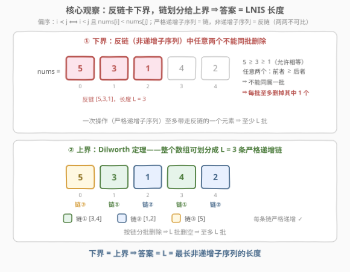
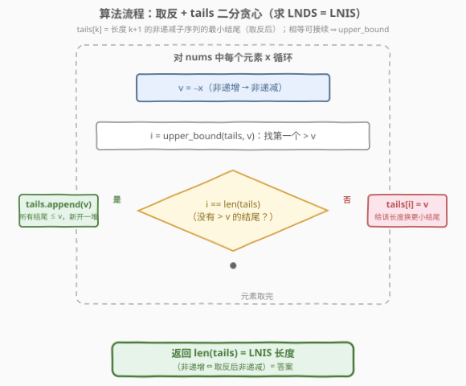

# 要删除的递增子序列的最小数量

- **题目名称**：要删除的递增子序列的最小数量
- **链接**：[3231. 要删除的递增子序列的最小数量 🔒](https://leetcode.cn/problems/minimum-number-of-increasing-subsequence-to-be-removed/)
- **难度**：困难
- **标签**：数组、二分查找、最长递增子序列、偏序集、Dilworth 定理

## 1. 题目概述

> ⚠️ 本题为 LeetCode 付费题（锁题），题意描述根据官方示例用例（`[5,3,1,4,2]` → `3`、`[1,2,3,4,5]` → `1`、`[5,4,3,2,1]` → `5`）与官方 hints（「求最长非递增子序列」「该序列中任意两个元素不可能在同一次操作中被删除」「证明答案等于该序列的长度」）重建，函数签名与约束按同类题惯例补全，可能与官方题面有出入。

给你一个整数数组 `nums`。一次操作中，你可以从数组中选出**任意一个严格递增子序列**（不要求连续），并将这些元素整批从数组中移除。

返回将数组元素**全部移除**所需的**最少**操作次数。

**示例 1**：

```text
输入：nums = [5,3,1,4,2]
输出：3
解释：第 1 批删 [3,4]，剩下 [5,1,2]；第 2 批删 [1,2]，剩下 [5]；第 3 批删 [5]。
```

**示例 2**：

```text
输入：nums = [1,2,3,4,5]
输出：1
解释：整个数组本身就是严格递增子序列，一批删空。
```

**示例 3**：

```text
输入：nums = [5,4,3,2,1]
输出：5
解释：任意两个元素都是前者 ≥ 后者，没有任何两个能同批删除，只能一批删一个。
```

**约束条件**（按同类题惯例重建）：

- $1 \le nums.length \le 10^5$
- $-10^9 \le nums[i] \le 10^9$（值域不影响算法）

> 💡 **审题关键**：三个细节决定整道题的走向。① 「子序列」不要求连续——每批删的是一串**下标递增、值严格递增**的元素；② 「**严格**递增」——两个**相等**的元素不能同批删（这决定了最终答案是「最长**非递增**」而非「最长严格递减」子序列的长度）；③ 「最少几批删完」⇔「整个数组最少能**划分**成几个严格递增子序列」——删除的先后顺序根本不重要，这是一个静态的划分问题。

## 2. 解题思路

### 2.1 暴力思路：逐批搜索 / 贪心逐批删 LIS

**暴力一（记忆化搜索）**：把每批删除看成一个决策——枚举当前数组的每个严格递增子序列作为下一批，递归求删空的最少批数：

```python
def brute(nums: list[int]) -> int:
    n = len(nums)
    subs = []                                   # 预生成所有严格递增子序列（位掩码表示）
    def gen(start, mask, last):
        if mask:
            subs.append(mask)
        for j in range(start, n):
            if last is None or nums[j] > last:  # 严格递增：只许接更大的
                gen(j + 1, mask | (1 << j), nums[j])
    gen(0, 0, None)

    from functools import lru_cache
    @lru_cache(maxsize=None)
    def f(mask: int) -> int:
        if mask == 0:
            return 0
        return 1 + min(f(mask ^ s) for s in subs if s & mask == s)
    return f((1 << n) - 1)
```

严格递增子序列最坏有 $2^n$ 个（数组本身严格递增时每个子集都合法），加上 $2^n$ 个状态——$n > 20$ 直接爆炸。但它是对拍利器：长度 $\le 9$、值域 $[1,5]$（大量重复元素，专卡「非递增 vs 严格递减」的区分）的 3000 组随机数据，全部与下述正解一致。

**暴力二（贪心逐批删最长 LIS）**：每轮求一遍最长严格递增子序列并整批删除，看似省事实则两坑：删掉**哪一条** LIS 直接改变剩余结构，没有交换论证兜底，最优性无保证；最坏 $\Theta(n)$ 轮（如严格递减数组每轮只能删一个），每轮 $O(n \log n)$，总计 $O(n^2 \log n)$，$n = 10^5$ 超时。

> ⚠️ 两种暴力共同的盲区：把「按什么**顺序**删」当成了主角。真正该问的是一个静态组合问题——**整个数组最少能划分成几条严格递增链**？顺序是干扰项。

### 2.2 核心观察：答案 = 最长非递增子序列的长度（Dilworth 定理）



把每个元素看成平面点 $(i, nums[i])$，定义偏序：

$$i \prec j \iff i < j \ \text{且} \ nums[i] < nums[j]\quad(\text{下标在前且值更小})$$

在这个偏序集里：

- 一次操作删除的**严格递增子序列 = 一条链**（元素两两可比）；
- **非递增子序列 = 一条反链**：任意 $i<j$ 都有 $nums[i] \ge nums[j]$，两两不可比。

原问题精确转化为：**最少用多少条链覆盖整个偏序集**。两条不等式夹出答案：

**下界（$\ge L$）**：设最长非递增子序列长度为 $L$。其中任意两个元素 $i<j$ 满足 $nums[i] \ge nums[j]$，绝不可能同属一个严格递增子序列——**每次操作至多删掉这条反链中的一个元素**（官方 hint 2），因此至少需要 $L$ 次。

**上界（$\le L$，Dilworth 定理）**：有限偏序集一定可以划分成 $L$ 条链，$L$ 为最长反链的长度。对应到数组：全部元素能拆成 $L$ 个严格递增子序列，按批删除即 $L$ 次删空。

$$\text{答案} \;=\; L \;=\; \text{最长非递增子序列（LNIS）的长度}$$

三个示例逐一兑现：$[5,3,1,4,2]$ 的 LNIS 是 $[5,3,1]$ 或 $[5,4,2]$，长度 3 ⇒ 答案 3 ✓；$[1,2,3,4,5]$ 的 LNIS 长度 1 ⇒ 答案 1 ✓；$[5,4,3,2,1]$ 整个数组非递增，LNIS 长度 5 ⇒ 答案 5 ✓。

> 💡 **似曾相识的对偶**：300 题 patience sorting 的「牌堆数 = LIS 长度」里，每个牌堆（自上而下非递增）恰好把数组划分成 LIS 条非递增子序列——那是 **Mirsky 定理**（最少反链划分数 = 最长链长度）。本题是它的孪生兄弟 **Dilworth 定理**（最少链划分数 = 最长反链长度）：链与反链整个对调，「严格递增」与「非递增」随之互换。同一定理家族，同一套二分贪心。

### 2.3 求 LNIS：取反转成 LNDS + 贪心二分



剩下的问题是：如何 $O(n \log n)$ 求最长非递增子序列？

**第一步（取反）**：$nums[i] \ge nums[j] \iff -nums[i] \le -nums[j]$——原数组的 LNIS = 取反数组的**最长非递减子序列（LNDS）**。取反后直接套 300 题的 tails 模板，不易写错方向。

**第二步（贪心二分）**：维护数组 `tails`，`tails[k]` 表示「长度为 $k+1$ 的非递减子序列」的**最小结尾**。对每个 $v = -x$，二分找**第一个 $> v$** 的位置（`bisect_right` / `upper_bound`）：

- 找不到（所有结尾都 $\le v$）→ $v$ 能接在最长的一堆后面，**追加**，LNDS 长度 +1；
- 找到位置 $i$ → 用 $v$ **替换** `tails[i]`：长度 $i+1$ 的子序列换上更小的结尾，给后续元素留出更多接续空间。

一个必须分清的易混点：

| 目标 | 相等元素能否接续 | 二分找的位置 |
|------|------|------|
| 最长**严格**递增（300 题） | 否（需 $v > $ 结尾） | `bisect_left`：第一个 $\ge v$ |
| 最长**非递减**（本题取反后） | 是（只需 $v \ge$ 结尾） | `bisect_right`：第一个 $> v$ |

替换/追加后 `tails` 始终保持有序，二分前提不变——这是贪心正确性的标准不变式。

### 2.4 示例演算

![示例演算：[5,3,1,4,2] 的牌堆演化](../images/p3231_example_walkthrough.svg)

`nums = [5,3,1,4,2]`，取反得 $[-5,-3,-1,-4,-2]$，逐元素过牌堆（橙色 = 本步变化的堆）：

| 步骤 | $x$ | $v=-x$ | 二分：第一个 $>v$ | 动作 | tails |
|------|:---:|:---:|------|------|------|
| ① | 5 | $-5$ | 无 → 追加 | 新开长度 1 的堆 | `[-5]` |
| ② | 3 | $-3$ | 无 → 追加 | 新开长度 2 的堆 | `[-5, -3]` |
| ③ | 1 | $-1$ | 无 → 追加 | 新开长度 3 的堆 | `[-5, -3, -1]` |
| ④ | 4 | $-4$ | $-3$（下标 1）→ 替换 | 长度 2 的结尾换小 | `[-5, -4, -1]` |
| ⑤ | 2 | $-2$ | $-1$（下标 2）→ 替换 | 长度 3 的结尾换小 | `[-5, -4, -2]` |

`len(tails) = 3` ⇒ 答案 **3** ✓

**双向验证**（2.2 的两条不等式在示例上都兑现）：

- **下界兑现**：反链 $[5,3,1]$（或 $[5,4,2]$）长度 3，每批至多删其一 ⇒ 2 批绝无可能；
- **上界兑现**：$[5,3,1,4,2]$ 确实可划分成 3 条严格递增链 $[3,4]$、$[1,2]$、$[5]$，3 批删空。

**示例 2/3（两个极端）**：$[1,2,3,4,5]$ 取反后严格递减，`tails` 被反复替换，长度始终 1 → 答案 1；$[5,4,3,2,1]$ 取反后严格递增，每个元素都追加，长度涨到 5 → 答案 5。恰好摸到答案范围 $[1, n]$ 的两端。

## 3. 参考代码

### C++

```cpp
class Solution {
public:
    int minOperations(vector<int>& nums) {
        vector<int> tails;                                          // tails[k]: 长度 k+1 的非递减子序列的最小结尾（取反后）
        for (int x : nums) {
            int v = -x;                                             // 取反：非递增 ⇔ 非递减
            auto it = upper_bound(tails.begin(), tails.end(), v);   // 相等可接续 → 找第一个 > v
            if (it == tails.end()) tails.push_back(v);              // 所有结尾 ≤ v：接在最长堆后
            else *it = v;                                           // 替换：给该长度换上更小结尾
        }
        return tails.size();                                        // LNDS 长度 = LNIS 长度 = 答案
    }
};
```

> 💡 不取反的等价写法：`tails[k]` 改存「长度 $k+1$ 的**非递增**子序列的最大结尾」（数组自身非递增），二分用逆比较器 `upper_bound(tails.begin(), tails.end(), x, greater<int>())`（在第一个 $< x$ 处替换/追加）。与取反版逐元素等价，但比较方向全反、边界易错——取反是更稳的工程选择。

### Python

```python
from bisect import bisect_right

class Solution:
    def minOperations(self, nums: List[int]) -> int:
        tails = []                       # tails[k]: 长度 k+1 的非递减子序列的最小结尾（取反后）
        for x in nums:
            v = -x                       # 取反：非递增 ⇔ 非递减
            i = bisect_right(tails, v)   # 相等可接续 → 找第一个 > v
            if i == len(tails):
                tails.append(v)          # 所有结尾 ≤ v：新开一堆
            else:
                tails[i] = v             # 替换：给该长度换上更小结尾
        return len(tails)                # LNDS 长度 = LNIS 长度 = 答案
```

## 4. 复杂度分析

| 维度 | 复杂度 | 说明 |
|------|--------|------|
| **时间复杂度** | $O(n \log n)$ | $n$ 个元素各做一次 `upper_bound` 二分 |
| **空间复杂度** | $O(n)$ | `tails` 最长 $n$（整个数组非递增时逐元素追加） |

> 对照 2.1：集合覆盖暴力是 $O(2^n)$ 量级；贪心逐批删 LIS 是 $O(n^2 \log n)$。$O(n \log n)$ 的关键一步，是把「批序问题」折叠成「LNIS 长度」这一个数字。

## 5. 扩展

### 5.1 链与反链：一对孪生定理

| 定理 | 内容 | 对应到数组 |
|------|------|-----------|
| **Dilworth**（本题） | 最少链划分数 = 最长反链长度 | 最少严格递增子序列划分数 = LNIS 长度 |
| **Mirsky**（对偶） | 最少反链划分数 = 最长链长度 | 最少非递增子序列划分数 = LIS 长度 |

Mirsky 方向的构造你一定见过——300 题 patience sorting 的牌堆：每个牌堆自上而下非递增，牌堆数恰为 LIS 长度。本题只需把链与反链的角色对调。两问共享同一套 tails 二分贪心，只是「严格/非严格」跟着对偶关系一起翻转。

### 5.2 变体：如果操作删的是「非严格递增子序列」？

相等的两个元素能同批删了 ⇒ 反链从「非递增」收紧为「**严格递减**」⇒ 答案 = 最长严格递减子序列长度。取反后即求最长严格递增，把 `bisect_right` 换成 `bisect_left` 即可。「操作的严格性」与「答案反链的严格性」的联动，是本题最值得玩味的细节，也是面试官最爱追问的点。

### 5.3 tails 模板全家桶：`bisect_left` vs `bisect_right`

| 题目 | 求什么 | 取反 | 二分 |
|------|--------|:---:|------|
| [300. 最长递增子序列](https://leetcode.cn/problems/longest-increasing-subsequence/) | 最长严格递增 | — | `bisect_left` |
| [1964. 最长有效障碍赛跑路线](https://leetcode.cn/problems/find-the-longest-valid-obstacle-course-at-each-position/) | 每个前缀的最长非递减 | — | `bisect_right` |
| [2111. 使数组 K 递增的最少操作次数](https://leetcode.cn/problems/minimum-operations-to-make-the-array-k-increasing/) | 每个模 $k$ 组的最长非递减 | — | `bisect_right` |
| **3231（本题）** | 最长非递增 | ✓ | `bisect_right` |

一套模板四种形态，判断只看一句话：**相等元素能不能接续**。能 → 右界；不能 → 左界。方向不对（递减/非递增）就取反或换比较器。

## 6. 面试要点

1. **为什么答案恰好等于最长非递增子序列的长度？**

   > 下界：LNIS 中任意两个元素满足前者 ≥ 后者，不可能同属一个严格递增子序列，每批至多删一个 ⇒ 至少 $L$ 批。上界：Dilworth 定理保证整个偏序集可划分成 $L$ 条链 ⇒ $L$ 批删得完。两边夹逼出等号。

2. **为什么反链是「非递增」而不是「严格递减」？**

   > 操作删的是**严格**递增子序列，两个相等元素不能同批；「两两不能同批」的极大集合因此是允许相等的非递增子序列。若操作改成非严格递增，反链才变成严格递减（见 5.2）。

3. **`bisect_left` 和 `bisect_right` 在这道题里怎么选？**

   > 看相等元素能否接续。本题取反后求非递减，相等可接续，用 `bisect_right`（替换第一个 $> v$ 的结尾）；若求严格递增（300 题），相等不可接续，用 `bisect_left`（替换第一个 $\ge v$ 的结尾）。

4. **不取反，直接求最长非递增子序列怎么写？**

   > `tails[k]` 改存「长度 $k+1$ 的非递增子序列的最大结尾」（数组自身非递增），二分用 `upper_bound(tails.begin(), tails.end(), x, greater<int>())` 找第一个 $< x$ 的位置替换/追加。与取反版完全等价，但比较方向全反、边界易错；面试推荐先写取反版，再口头说明等价性。

5. **这题和 300 题 patience sorting 的「牌堆数」是什么关系？**

   > 300 题牌堆数 = LIS 长度，本质是 Mirsky 定理（最少非递增子序列划分数 = 最长链长度）；本题是 Dilworth 定理（最少严格递增子序列划分数 = 最长反链长度 = LNIS）。二者互为对偶，同一套 tails 二分贪心通吃两个方向。

> 💡 **一句话总结**：最少几批删空 = 最少链划分数 =（Dilworth）最长反链长度 = 最长非递增子序列长度；取反转成 LNDS，`tails` + `bisect_right` 一遍二分贪心收工，$O(n \log n)$ / $O(n)$。

## 7. 同类练习题

- [300. 最长递增子序列](https://leetcode.cn/problems/longest-increasing-subsequence/)（[站内题解](../0201-0300/300_最长递增子序列.md)）：tails 二分贪心母题（严格递增用 `bisect_left`），本题的非递减变体只需改一个二分
- [1964. 找出到每个位置为止最长的有效障碍赛跑路线](https://leetcode.cn/problems/find-the-longest-valid-obstacle-course-at-each-position/)（[站内题解](../1901-2000/1964_找出到每个位置为止最长的有效障碍赛跑路线.md)）：非递减 LIS 的 `bisect_right` 模板，与本题取反后完全同款，只是对每个前缀各报一次答案
- [2111. 使数组 K 递增的最少操作次数](https://leetcode.cn/problems/minimum-operations-to-make-the-array-k-increasing/)（[站内题解](../2101-2200/2111_使数组K递增的最少操作次数.md)）：「保留最长非递减、改掉其余」的最少操作模型，LNDS 的分组应用
- [1671. 得到山形数组的最少删除次数](https://leetcode.cn/problems/minimum-number-of-removals-to-make-mountain-array/)（[站内题解](../1601-1700/1671_得到山形数组的最少删除次数.md)）：正反双向 LIS 组合出「最少删除」，同一偏序思路在双向的伸展
- [354. 俄罗斯套娃信封问题](https://leetcode.cn/problems/russian-doll-envelopes/)（[站内题解](../0301-0400/354_俄罗斯套娃信封问题.md)）：二维偏序上的链结构，偏序建模 + LIS 的进阶形态
