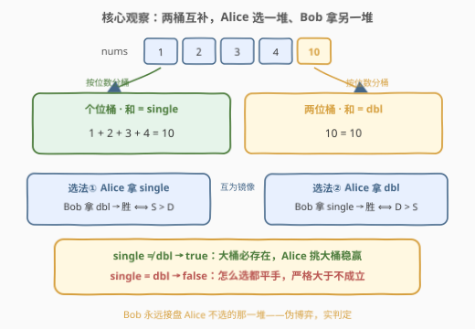
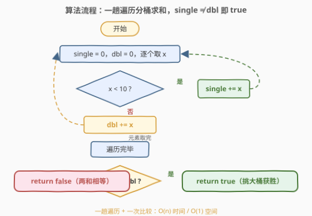
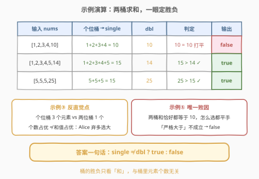

# LeetCode 判断是否可以赢得数字游戏 题解

## 1. 题目概述

- **标题 / 题号**：判断是否可以赢得数字游戏（#3232，easy）
- **链接**：https://leetcode.cn/problems/find-if-digit-game-can-be-won/
- **难度**：简单
- **标签**：数组、数学、脑筋急转弯

**题意**：给你一个**正整数**数组 `nums`。Alice 和 Bob 正在玩游戏：Alice 可以从 `nums` 中选择**所有个位数**或**所有两位数**，剩余的数字归 Bob 所有。如果 Alice 所选数字之和**严格大于** Bob 的数字之和，则 Alice 获胜。

如果 Alice 能赢得这场游戏，返回 `true`；否则返回 `false`。

**示例 1**：

```text
输入：nums = [1,2,3,4,10]
输出：false
解释：Alice 不管选个位数还是两位数都无法赢得比赛。
```

**示例 2**：

```text
输入：nums = [1,2,3,4,5,14]
输出：true
解释：Alice 选择个位数可以赢得比赛，所选数字之和为 15。
```

**示例 3**：

```text
输入：nums = [5,5,5,25]
输出：true
解释：Alice 选择两位数可以赢得比赛，所选数字之和为 25。
```

**约束**：$1 \le nums.length \le 100$，$1 \le nums[i] \le 99$。

> 💡 **审题关键**：① Alice 的选择只有**两种**——全拿个位数，或全拿两位数，不能只挑其中一部分；② 约束 $1 \le nums[i] \le 99$ 意味着每个数**非一位即两位**，不存在第三类；③ 比较要求**严格大于**，两和相等时算 Alice 输；④ Bob 全程没有任何决策，这是一道披着博弈外衣的求和判定题。

## 2. 解题思路

### 2.1 暴力思路：老老实实模拟两种选法

最直接的做法是把 Alice 仅有的两个选项逐一模拟：先算出「个位数之和 `single`」与「两位数之和 `dbl`」，再分别核对两种选法：

- 选法一（拿个位数）：Alice 得 `single`，Bob 得剩余全部 = `dbl`，胜 $\iff single > dbl$；
- 选法二（拿两位数）：Alice 得 `dbl`，Bob 得 `single`，胜 $\iff dbl > single$。

两个条件取「或」即为答案。这个做法已经是 $O(n)$，但两次条件判断略显啰嗦——**两种选法互为镜像**，Bob 拿到的永远是 Alice 不选的那一堆，说明判定还能再合并一步。

### 2.2 核心观察：两桶互补，胜负只看「两和是否相等」



**观察 1（分桶唯一且完备）**：由 $1 \le nums[i] \le 99$，每个数要么是个位数（$1 \sim 9$）要么是两位数（$10 \sim 99$）。把数组按位数分成两桶后，**每桶的和是确定的**，与 Alice 怎么选无关。

**观察 2（两种选法互为镜像）**：Alice 选个位桶，Bob 拿两位桶；Alice 选两位桶，Bob 拿个位桶。Alice 两种可能的得分恰好是 `single` 与 `dbl` 各取一次，Bob 永远接盘另一桶。

**观察 3（两个条件合一）**：

$$\text{Alice 胜} \iff single > dbl \ \text{或} \ dbl > single \iff single \ne dbl$$

两桶和不相等时，较大的那桶**一定存在**，Alice 选它、把较小的桶甩给 Bob 即稳赢；两桶和相等时，无论怎么选双方都打平，而「严格大于」不成立，Alice 必输。

> ⚠️ **false 的唯一来源**是 `single == dbl`。也正因如此，如果把规则的「严格大于」改成「大于等于」，答案将**恒为 true**——两个数中必有一个不小于另一个，比较条件里的一个词决定了整题的输出空间。

### 2.3 算法流程图



| 步骤 | 操作 | 作用 |
|------|------|------|
| ① 分桶累计 | 遍历 `nums`，`x < 10` 加进 `single`，否则加进 `dbl` | 一趟遍历得到两桶和 |
| ② 判定 | `single != dbl ?` | 不相等 → true（挑大桶）；相等 → false（平手） |

### 2.4 示例演算



| 输入 | 个位桶 | `single` | 两位桶 | `dbl` | 关系 | 输出 | Alice 的选择 |
|------|--------|----------|--------|-------|------|------|--------------|
| `[1,2,3,4,10]` | 1,2,3,4 | 10 | 10 | 10 | 相等 | `false` | 两种选法都平手，「严格大于」不成立 |
| `[1,2,3,4,5,14]` | 1,2,3,4,5 | 15 | 14 | 14 | $15 > 14$ | `true` | 拿个位桶（15），Bob 只剩 14 |
| `[5,5,5,25]` | 5,5,5 | 15 | 25 | 25 | $25 > 15$ | `true` | 反手拿两位桶（25），Bob 只剩 15 |

第三个示例最值得回味：个位桶元素个数占优（3 个 vs 1 个），却**输在和值**上——桶的胜负只看**和**，与元素个数无关；Alice 果断弃小桶拿大桶，正是「镜像选择」的意义所在。

## 3. 参考代码

### C++（一次遍历分桶版）

```cpp
class Solution {
public:
    bool canAliceWin(vector<int>& nums) {
        int single = 0, dbl = 0;
        for (int x : nums) {
            if (x < 10) single += x;
            else        dbl   += x;
        }
        return single != dbl;
    }
};
```

### Python（分桶版）

```python
class Solution:
    def canAliceWin(self, nums: List[int]) -> bool:
        single = dbl = 0
        for x in nums:
            if x < 10:
                single += x
            else:
                dbl += x
        return single != dbl
```

### Python（一行公式版）

```python
class Solution:
    def canAliceWin(self, nums: List[int]) -> bool:
        single = sum(x for x in nums if x < 10)
        return single != sum(nums) - single   # dbl = total - single
```

> 💡 一行版利用**两桶互补**：`single + dbl = total`，于是 `single != dbl` 等价于 $2 \times single \ne total$，全程只需维护一个桶的和。

## 4. 复杂度分析

| 维度 | 复杂度 | 说明 |
|------|--------|------|
| **时间** | $O(n)$ | 一次遍历分桶累计，$n \le 100$ 瞬间完成 |
| **空间** | $O(1)$ | 仅两个整型计数器（一行版只需一个） |

## 5. 扩展：把 Alice 的「选择权」放大一级会怎样

本题简单的根源在于规则把 Alice 的选择空间压缩到**仅 2 个**选项。一旦放宽：

- **任选子集**：Alice 可以挑 `nums` 的任意子集，剩余归 Bob——胜负判定变为「是否存在子集和严格大于 $total/2$」。这正是 [416. 分割等和子集](https://leetcode.cn/problems/partition-equal-subset-sum/) 与 [1049. 最后一块石头的重量 II](https://leetcode.cn/problems/last-stone-weight-ii/) 的 0-1 背包套路，$O(n \cdot total)$ 伪多项式可解，难度直升中等；
- **数值范围放开**：若允许三位数（$nums[i] \le 999$）且规则改为「选所有 $k$ 位数」，桶数变多但思路不变——Alice 能赢 $\iff$ **存在某桶严格大于其余桶之和**，逐桶判定即可。

对比之下可以看出：「博弈题」的难度几乎全在**选择空间的大小**上——空间为 2 时是签到题，空间为子集全体时是背包题，空间为「区间两端任取」时就成了 [877. 石头游戏](https://leetcode.cn/problems/stone-game/) 的区间 DP。

## 6. 面试要点

1. **为什么 Bob 没有任何决策空间？**

   规则只赋予 Alice 选择权（全拿个位数或全拿两位数），Bob 被动接收剩余数字，全程连一次「操作」都没有。因此这是纯判定题而非博弈题，不存在「最优策略」分析。

2. **为什么 `single != dbl` 就必胜？**

   两种选法互为镜像：较大的桶一定存在，Alice 选它即得较大和，Bob 只能拿较小的桶，「严格大于」自动成立；若两桶相等则任何选法都打平，必败。

3. **`false` 在什么情况下出现？改一个词会怎样？**

   仅当 `single == dbl`。若把「严格大于」改成「大于等于」，两桶相等时也算赢，答案恒为 `true`——比较方向上的一个词决定了整题的输出空间。

4. **为什么可以只用一个计数器？**

   两桶互补：`single + dbl = total`，故 `single != dbl ⟺ 2·single != total`，只累计个位桶（再顺手求总和）即可。

5. **这道题如果出现在面试里，考点是什么？**

   快速识破「伪博弈」外壳，把规则翻译成两桶求和的判定；以及边界意识——`9` 是最大个位数、`10` 是最小两位数，用 `x < 10` 分桶恰好无缝覆盖约束 $1 \sim 99$，不存在第三类遗漏。

## 同类练习题

| # | 题目 | 与本题的关联 |
|---|------|-------------|
| 416 | [分割等和子集](https://leetcode.cn/problems/partition-equal-subset-sum/) | 本题「任选子集」的放大版——判定能否分成和相等的两堆，0-1 背包 |
| 1049 | [最后一块石头的重量 II](https://leetcode.cn/problems/last-stone-weight-ii/) | 分两堆最小化和差，与本题「挑较大堆」互补的一面对 |
| 3222 | [求出硬币游戏中的赢家](https://leetcode.cn/problems/find-the-winning-player-in-coin-game/) | 同为规则定死的伪博弈，数步数定胜负即可，无需搜索 |
| 292 | [Nim 游戏](https://leetcode.cn/problems/nim-game/) | 经典「必胜条件一句话」博弈，$O(1)$ 公式判定的鼻祖 |
| 877 | [石头游戏](https://leetcode.cn/problems/stone-game/) | 有真实决策的博弈——区间 DP + 净赚 Minimax，体会「选择空间」带来的难度跃迁 |
