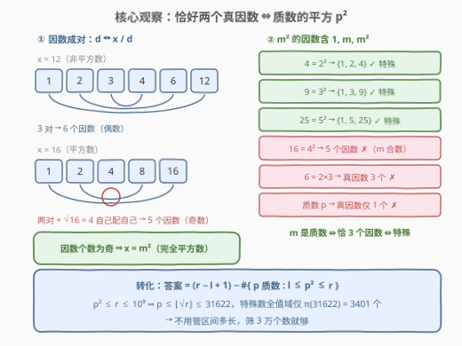
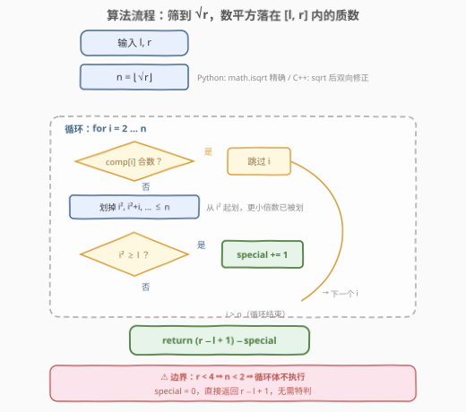
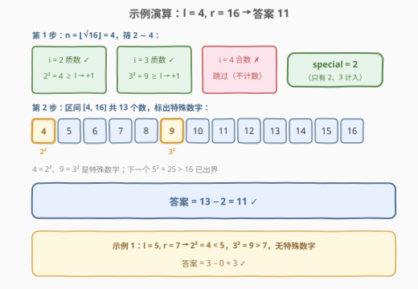

# LeetCode 统计不是特殊数字的数字数量 题解

## 1. 题目概述

- **标题 / 题号**：统计不是特殊数字的数字数量（#3233，medium）
- **链接**：https://leetcode.cn/problems/find-the-count-of-numbers-which-are-not-special/
- **难度**：中等
- **标签**：数学、数论、埃拉托斯特尼筛

**题意**：给你两个**正整数** `l` 和 `r`。对于任何数字 `x`，`x` 的所有正因数（**除了** `x` 本身）被称为 `x` 的**真因数**。

如果一个数字**恰好仅有两个真因数**，则称该数字为**特殊数字**。例如：

- 数字 4 是特殊数字，因为它的真因数为 1 和 2；
- 数字 6 不是特殊数字，因为它的真因数为 1、2 和 3。

返回区间 `[l, r]` 内**不是**特殊数字的数字数量。

**示例 1**：

```text
输入：l = 5, r = 7
输出：3
解释：区间 [5, 7] 内不存在特殊数字。
```

**示例 2**：

```text
输入：l = 4, r = 16
输出：11
解释：区间 [4, 16] 内的特殊数字为 4 和 9。
```

**约束**：

- $1 \le l \le r \le 10^9$

> 💡 **审题关键**：「真因数」= 因数去掉自身，所以任何 $x > 1$ 的真因数里永远有 1（而 1 自己的真因数个数是 0）。「恰好两个真因数」等价于「恰好**三个**因数」——多出来的第三个正是 $x$ 本身。这道题真正在问的是：**区间里有多少个恰好有三个因数的数**，再用总数一减。

## 2. 解题思路

### 2.1 暴力思路：逐个试除数因子

对 $[l, r]$ 内每个 $x$，试除到 $\sqrt{x}$ 数出全部因数，判断真因数个数是否为 2：

```python
def brute(l, r):
    def proper(x):                     # x 的真因数个数
        cnt, d = 0, 1
        while d * d <= x:
            if x % d == 0:
                cnt += 1 if d * d == x else 2   # (d, x//d) 成对
            d += 1
        return cnt - 1                 # 去掉 x 本身
    return sum(1 for x in range(l, r + 1) if proper(x) != 2)
```

单个判定 $O(\sqrt{r}) \approx 3 \times 10^4$，而区间长度最长达 $10^9$——总量 $10^{13}$ 步起步，必然超时。瓶颈在于**一个一个看**：区间太长，但「特殊数字」在整个值域里其实**极其稀疏**（见下），值得先刻画出它的形状再反着数。

### 2.2 核心观察：恰好两个真因数 ⇔ 质数的平方



**第一步（因数成对）**：$x$ 的因数总是成对出现——$d$ 是因数当且仅当 $x/d$ 是因数，两者围绕 $\sqrt{x}$ 对称配对。若 $x$ 不是完全平方数，$\sqrt{x}$ 不是整数，所有因数两两配对，**因数个数必为偶数**。

**第二步（奇数 ⟹ 平方数）**：因数个数为奇数（本题要的 3 是奇数）⟹ $x = m^2$，$\sqrt{x} = m$ 自己与自己配对，成为「落单」的那个因数。

**第三步（中间那个必须是质数）**：$x = m^2$ 的因数至少包含 $1, m, x$。若 $m$ 还有更细的分解 $m = a \cdot b$（$1 < a \le b < m$），则 $a$ 也是 $x$ 的因数且不属于 $\{1, m, x\}$，因数个数就超过 3。反过来 $m = p$ 为质数时，$p^2$ 的因数**恰好**是 $1, p, p^2$ 三个。

$$\text{特殊数字} \iff \text{真因数恰两个} \iff \text{因数恰三个} \iff x = p^2\ (p \text{ 为质数})$$

对账：$4 = 2^2$ 的真因数 $\{1, 2\}$ ✓；$9 = 3^2$ 的 $\{1, 3\}$ ✓；$6 = 2 \times 3$ 的 $\{1, 2, 3\}$ ✗；质数 $p$ 的真因数只有 $\{1\}$ ✗；$16 = 4^2$ 的因数有 $1, 2, 4, 8, 16$ 共 5 个 ✗（$m = 4$ 是合数）。

于是问题瞬间塌缩：

$$\text{答案} = (r - l + 1) - \#\{\, p \text{ 为质数} : l \le p^2 \le r \,\}$$

由 $p^2 \le r \le 10^9$ 得 $p \le \lfloor\sqrt{r}\rfloor \le 31622$——全值域内的特殊数字总共只有 $\pi(31622) = 3401$ 个，**只需在区区 3 万多的范围内筛质数**，一次埃氏筛就够了。

> 💡 **换个视角**：这一步是典型的「正向枚举 → 逆向刻画」。与其检验区间里每个候选，不如刻画出目标形状（$p^2$）后反着数稀疏的特殊数。204 题计数质数是同一套筛法的母题。

### 2.3 算法流程：埃氏筛 + 计数



1. 求 $n = \lfloor\sqrt{r}\rfloor$：Python 用 `math.isqrt` 精确无误差；C++ 的 `sqrt` 是浮点，需上下各修正一步；
2. 对 $[2, n]$ 做埃氏筛：从 $i^2$ 起步划掉 $i$ 的倍数（$i^2$ 以下的倍数已被更小的质数划过）；
3. 每遇到一个质数 $p$，检查 $p^2 \ge l$：成立则 $p^2 \in [l, r]$（上界 $p \le n$ 已保证 $p^2 \le r$），特殊数计数 +1；
4. 返回 $(r - l + 1) - \text{special}$。

两个边界细节：

- **下界判定用 $p^2 \ge l$ 而不是 $p \ge \lceil\sqrt{l}\rceil$**：前者只需一次整数乘法比较，天然规避「开方取整方向写反」这类边界 bug（$l$ 自身是完全平方数时最容易错）；
- **$r < 4$ 时** $n < 2$，筛循环不执行，特殊数为 0，直接返回区间长度——代码无需特判，自然成立。

### 2.4 示例演算



`l = 4, r = 16`：区间共 $16 - 4 + 1 = 13$ 个数，$n = \lfloor\sqrt{16}\rfloor = 4$，筛表扫 $2 \sim 4$：

| $i$ | 是否质数 | $i^2$ | 落在 $[4, 16]$？ | special |
|:---:|:---:|:---:|:---:|:---:|
| 2 | ✓ 质数 | 4 | ✓（$4 \ge 4$） | 1 |
| 3 | ✓ 质数 | 9 | ✓ | 2 |
| 4 | ✗（$2^2$，已被划掉） | — | — | 2 |

$$\text{答案} = 13 - 2 = \boxed{11}$$

区间视角：$4 = 2^2$、$9 = 3^2$ 是特殊数字；下一个 $5^2 = 25 > 16$ 已出界。**示例 1**（$l = 5, r = 7$）同理：$2^2 = 4 < 5$、$3^2 = 9 > 7$，特殊数为 0，答案 $3 - 0 = 3$ ✓

## 3. 参考代码

### C++

```cpp
class Solution {
public:
    int nonSpecialCount(int l, int r) {
        int n = (int)sqrt((double)r);
        while ((long long)(n + 1) * (n + 1) <= r) ++n;  // 修正浮点误差：n = floor(√r)
        while ((long long)n * n > r) --n;
        vector<bool> comp(n + 1, false);                // comp[i]: i 是否为合数
        int special = 0;
        for (int i = 2; i <= n; ++i) {
            if (comp[i]) continue;                      // 合数跳过
            for (long long j = 1LL * i * i; j <= n; j += i)
                comp[j] = true;                         // 埃氏筛：从 i² 起划倍数
            if (1LL * i * i >= l) ++special;            // p² ≤ r 由 i ≤ n 保证
        }
        return r - l + 1 - special;                     // 总数 − 特殊数
    }
};
```

> ⚠️ 两处 `long long` 不能省：$i \cdot i$ 最大 $31623^2 \approx 10^9$，`int` 相乘溢出是未定义行为；修正循环里的 $(n+1)^2$ 同理。另外「从 $i^2$ 开始划」不仅是常数优化，还保证每个合数只被其**最小质因子**划掉。

### Python

```python
from math import isqrt

class Solution:
    def nonSpecialCount(self, l: int, r: int) -> int:
        n = isqrt(r)                          # 精确整数平方根，无浮点误差
        comp = [False] * (n + 1)              # comp[i]: i 是否为合数
        special = 0
        for i in range(2, n + 1):
            if comp[i]:
                continue                      # 合数跳过
            for j in range(i * i, n + 1, i):
                comp[j] = True                # 埃氏筛：从 i² 起划倍数
            if i * i >= l:
                special += 1                  # 质数平方落在 [l, r] 内
        return (r - l + 1) - special          # 总数 − 特殊数
```

## 4. 复杂度分析

| 维度 | 复杂度 | 说明 |
|------|--------|------|
| **时间复杂度** | $O(\sqrt{r} \log\log \sqrt{r})$ | 埃氏筛到 $\sqrt{r} \le 31622$；每个质数一次 $O(1)$ 判断 |
| **空间复杂度** | $O(\sqrt{r})$ | 筛表约 $3.2 \times 10^4$ 个布尔位 |

> 对照 2.1：暴力是 $O((r - l + 1)\sqrt{r})$，最坏 $10^{13}$ 步；正解与区间长度 $r - l + 1$ **完全无关**——只跟 $\sqrt{r}$ 有关，等于把 $10^9$ 的题做成了 $3 \times 10^4$ 的题。

## 5. 扩展

### 5.1 因数个数定理：把「恰有三个因数」放进家族

设 $x = p_1^{a_1} \cdots p_k^{a_k}$，则因数个数 $d(x) = \prod_i (a_i + 1)$（每个质因子的幂次独立取 $0 \sim a_i$）。据此给「因数个数」分类：

| 因数个数 $d(x)$ | $x$ 的形状 | 真因数个数 | 例 |
|:---:|------|:---:|------|
| 1 | $1$ | 0 | 1 |
| 2 | 质数 $p$ | 1 | 2, 3, 5 |
| **3（本题）** | **$p^2$** | **2** | **4, 9, 25** |
| 4 | $p^3$ 或 $p q$ | 3 | 8, 6, 10 |
| 5 | $p^4$ | 4 | 16 |

乘积公式一眼解释全部结论：要 $d(x) = 3$（质数），只能是单一质因子的 $a_i + 1 = 3$，即 $p^2$。1390 题「四因数」是 $d(x) = 4$ 的同款分类讨论（$p^3$ 与 $p q$ 两族）。

### 5.2 如果值域更大？

- $r \le 10^{14}$：$\sqrt{r} \le 10^7$，本地埃氏筛仍然可行（约 10 MB 内存），本题代码一行不改；
- $r \le 10^{18}$：$\sqrt{r} \le 10^9$，整表筛不动，改用**区间筛**（只筛 $[\lceil\sqrt{l}\rceil, \lfloor\sqrt{r}\rfloor]$ 这一段，用小质数去划）或对平方候选逐个 **Miller–Rabin** 判 $p$ 是否质数；
- 若改成「区间内**质数**个数」（$l, r$ 巨大但 $r - l$ 很小），就是经典的区间筛模板题。

> 💡 面试中把这题的 $10^9$ 抽象成 $10^{18}$ 追问，考察点就从「会不会筛」升级为「知道筛的规模边界 + 会换工具」。

## 6. 面试要点

1. **为什么「恰好两个真因数」等价于「质数的平方」？**

   > 因数成对 $(d, x/d)$：非平方数的因数个数为偶数，故 3 个因数 ⟹ 完全平方数 $m^2$；其因数含 $1, m, m^2$，恰 3 个 ⟹ $m$ 无更细分解 ⟹ $m$ 是质数。反向：$p^2$ 的因数就是 $1, p, p^2$，真因数恰 $\{1, p\}$ 两个。

2. **为什么只需筛到 $\sqrt{r}$？特殊数字有多稀疏？**

   > 特殊数字形如 $p^2 \le r$，故 $p \le \lfloor\sqrt{r}\rfloor \le 31622$，全值域至多 $\pi(31622) = 3401$ 个。正解复杂度只含 $\sqrt{r}$，与区间长度无关。

3. **下界判断为什么写 $p \cdot p \ge l$，而不是算出 $\lceil\sqrt{l}\rceil$ 再比较？**

   > 一次整数乘法即可，避免开方取整方向出错（$l$ 为完全平方数时 $\lceil\sqrt{l}\rceil = \lfloor\sqrt{l}\rfloor$，极易与开闭区间混淆）。上界已由 $p \le \lfloor\sqrt{r}\rfloor$ 隐式保证，无需再判。

4. **C++ 里有哪些溢出 / 精度坑？**

   > `sqrt` 浮点在完全平方边界可能抖动，需用 $(n+1)^2 \le r$、$n^2 > r$ 双向修正成精确的 $\lfloor\sqrt{r}\rfloor$；$i \cdot i$ 最大约 $10^9$，必须用 `long long`。Python 用 `math.isqrt` 天然精确，无此坑。

5. **埃氏筛为什么从 $i^2$ 开始划倍数？**

   > $i$ 的更小倍数 $2i, \dots, (i-1)i$ 含有比 $i$ 小的因数，已被更小的质数划掉。从 $i^2$ 起步使每个合数只被其**最小质因子**划过，总代价 $\sum_{p \le \sqrt{r}} \sqrt{r}/p = O(\sqrt{r}\log\log\sqrt{r})$。

> 💡 **一句话总结**：恰好两个真因数 ⟺ 恰好三个因数 ⟺ 质数的平方；答案 = 区间长度 − $\{\, p \text{ 质数} : l \le p^2 \le r \,\}$ 的个数，$\sqrt{r} \le 31622$，一次埃氏筛收工，$O(\sqrt{r}\log\log\sqrt{r})$ / $O(\sqrt{r})$。

## 同类练习题

| # | 题目 | 与本题的关联 |
|---|------|-------------|
| 204 | [计数质数](https://leetcode.cn/problems/count-primes/)（[站内题解](../0201-0300/204_计数质数.md)） | 埃氏筛母题，本题筛法部分原样复用，只是把「数质数」换成「数质数的平方」 |
| 1390 | [四因数](https://leetcode.cn/problems/four-divisors/)（[站内题解](../1301-1400/1390_四因数.md)） | $d(x) = 4$ 的两族分解（$p^3$ 与 $p q$），因数个数分类讨论的姊妹题 |
| 2507 | [使用质因数之和替换后可以取到的最小值](https://leetcode.cn/problems/smallest-value-after-replacing-with-sum-of-prime-factors/)（[站内题解](../2501-2600/2507_使用质因数之和替换后可以取到的最小值.md)） | 反复用质因数之和替换的收敛问题，试除分解的基本功 |
| 762 | [二进制表示中质数个计算置位](https://leetcode.cn/problems/prime-number-of-set-bits-in-binary-representation/)（[站内题解](../0701-0800/762_二进制表示中质数个置位.md)） | 小值域质数判定的查表技巧，值域小到可以打表时就不必筛 |
| 2376 | [统计特殊整数](https://leetcode.cn/problems/count-special-integers/)（[站内题解](../2301-2400/2376_统计特殊整数.md)） | 另一种「特殊」定义（数位互不相同），数位 DP 的数数视角，与本题的数论视角互为补充 |
