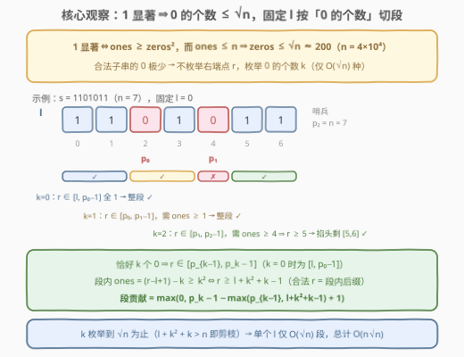
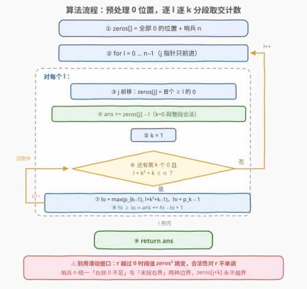
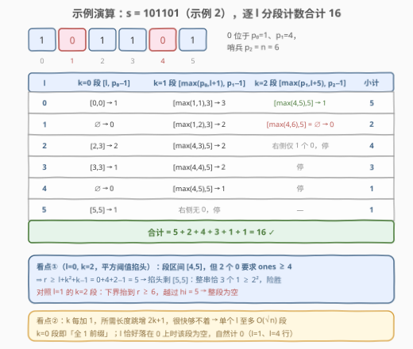

# 统计 1 显著的字符串的数量

- **题目名称**：统计 1 显著的字符串的数量
- **链接**：[3234. 统计 1 显著的字符串的数量](https://leetcode.cn/problems/count-the-number-of-substrings-with-dominant-ones/)
- **难度**：中等
- **标签**：字符串、枚举、数学

## 1. 题目概述

给定一个二进制字符串 `s`，统计其中 **1 显著** 的子字符串的数量。

如果字符串中 `1` 的数量**大于或等于** `0` 的数量的**平方**，则认为该字符串是一个 **1 显著** 的字符串。

**示例 1**：

```text
输入：s = "00011"
输出：5
解释：1 显著的子字符串共 5 个——
"1"（i=3）、"1"（i=4）、"01"（i=2..3）、"11"（i=3..4）、"011"（i=2..4）。
```

**示例 2**：

```text
输入：s = "101101"
输出：16
解释：总共 21 个子字符串，其中 5 个不是 1 显著的
（"0"、"0"、"0110"、"10110"、"01101"），故答案为 21 − 5 = 16。
```

**约束**：$1 \le s.length \le 4 \times 10^4$，`s` 仅包含字符 `'0'` 和 `'1'`。

> 💡 **审题关键**：① 判定条件是 $\text{ones} \ge \text{zeros}^2$——阈值是 0 个数的**平方**，不是 1 倍、不是 2 倍，这个平方关系是全题复杂度的命门；② 「子字符串」要求连续，共 $O(n^2)$ 个，$n = 4\times10^4$ 时约 $8 \times 10^8$ 个，逐个判定必然超时；③ 注意 $\text{zeros}=0$ 时条件为 $\text{ones} \ge 0$ 恒成立——**全 1 的段整段都合法**，包括单个 `'1'`。

---

## 2. 解题思路

### 2.1 暴力思路：枚举所有子串逐一判定（不可行）

最直接的做法：枚举全部 $O(n^2)$ 个子串，对每个子串数一遍 0/1 的个数再判定。用「固定左端点 $l$、右端点 $r$ 右移时增量维护 `ones`/`zeros`」可把单个子串的判定摊还成 $O(1)$，整体 $O(n^2)$：

```python
ans = 0
for l in range(n):
    ones = zeros = 0
    for r in range(l, n):
        ones += s[r] == '1'
        zeros += s[r] == '0'
        ans += ones >= zeros * zeros
```

$O(n^2) \approx 8 \times 10^8$ 在 Python 下稳超时，C++ 也贴近时限。必须想办法**不逐个右端点**看，而是一口气数出一段合法区间。

### 2.2 核心观察：0 的个数不超过 √n，按「0 的个数」分段计数



**观察 1（0 的个数有硬上界）**：若子串 1 显著，则 $\text{zeros}^2 \le \text{ones} \le n$，故

$$\text{zeros} \le \sqrt{n} \approx 200 \quad (n = 4\times10^4)$$

合法子串里 0 **少得可怜**——这提示我们不要枚举右端点，而是**枚举子串中 0 的个数 $k$**，$k$ 只有 $O(\sqrt n)$ 种取值。

**观察 2（固定 $l$，按 $k$ 切段）**：固定左端点 $l$，把 $s$ 中所有 `0` 的位置记为 $p_0 < p_1 < p_2 < \cdots$（末尾补**哨兵** $n$ 表示「右边没有 0 了」）。随着 $r$ 右移，$\text{zeros}(l..r)$ 单调不减，且只在 $r$ 越过某个 $p_i$ 时 +1。于是 $r$ 轴被 0 的位置天然切成若干段：

- $k = 0$ 段：$r \in [l,\ p_0 - 1]$；
- $k \ge 1$ 段（恰好 $k$ 个 0）：$r \in [p_{k-1},\ p_k - 1]$。

**观察 3（段内条件是「后缀」）**：在第 $k$ 段内 $\text{zeros} = k$ 固定，而 $\text{ones} = (r - l + 1) - k$ 随 $r$ **线性递增**，判定条件

$$\text{ones} \ge k^2 \iff (r - l + 1) - k \ge k^2 \iff r \ge l + k^2 + k - 1$$

是一个关于 $r$ 的**下界**——段内合法的 $r$ 是从 $l + k^2 + k - 1$ 起的一段连续后缀，无需逐点判定，与段区间取交直接算个数：

$$\text{段贡献} = \max\big(0,\ p_k - 1 - \max(p_{k-1},\ l + k^2 + k - 1) + 1\big)$$

$k = 0$ 时条件恒成立，整段 $[l, p_0 - 1]$ 都合法，贡献 $p_0 - l$。

> ⚠️ **为什么不能用滑动窗口**：条件 $\text{ones} \ge \text{zeros}^2$ 对 $r$ **不单调**——$r$ 越过一个 `0` 时 `ones` 不变而阈值平方跳变，原本合法的窗口可能瞬间非法且**再也不随右移恢复**；收缩左端点也不单调。双指针没有「单调淘汰」的抓手，必须按 $k$ 分段把不单调的总量拆成 $O(\sqrt n)$ 个单调的段。

### 2.3 算法流程图



| 步骤 | 操作 | 作用 |
|------|------|------|
| ① 预处理 | 收集全部 `0` 的位置进 `zeros[]`，末尾补哨兵 $n$ | 哨兵统一「右侧无 0」的边界，消掉特判 |
| ② 定位 | 对每个 $l$，移动指针 $j$ 使 `zeros[j]` 为首个 $\ge l$ 的 0 | $l$ 递增时 $j$ 只前进不回退，摊还 $O(1)$ |
| ③ k=0 段 | `ans += zeros[j] - l` | 全 1 前缀整段合法 |
| ④ k≥1 段 | `k` 递增：`lo = max(p_{k-1}, l+k²+k−1)`，`hi = p_k − 1`，`hi ≥ lo` 则累加 `hi−lo+1` | 段内后缀 $O(1)$ 计数 |
| ⑤ 剪枝 | `l + k² + k > n` 或右侧不足 $k$ 个 0 时停 | $k \le \sqrt{n}$，单 $l$ 至多 $O(\sqrt n)$ 段 |
| ⑥ 收尾 | 返回 `ans` | — |

### 2.4 示例演算



以示例 2 `s = "101101"`（$n=6$，0 位于 $1,4$，哨兵 $6$）为例，逐 $l$ 列表：

| $l$ | $k=0$ 段 $[l, p_0-1]$ | $k=1$ 段 $[\max(p_0,\,l{+}1),\ p_1{-}1]$ | $k=2$ 段 $[\max(p_1,\,l{+}5),\ p_2{-}1]$ | 小计 |
|---|---|---|---|---|
| 0 | $[0,0]$ → 1 | $[\max(1,1),3]=[1,3]$ → 3 | $[\max(4,5),5]=[5,5]$ → 1 | **5** |
| 1 | $[1,0]$ → 0 | $[\max(1,2),3]=[2,3]$ → 2 | $[\max(4,6),5]$ → 空 | **2** |
| 2 | $[2,3]$ → 2 | $[\max(4,3),5]=[4,5]$ → 2 | 右侧仅 1 个 0，停 | **4** |
| 3 | $[3,3]$ → 1 | $[\max(4,4),5]=[4,5]$ → 2 | 停 | **3** |
| 4 | $[4,3]$ → 0 | $[\max(4,5),5]=[5,5]$ → 1 | 停 | **1** |
| 5 | $[5,5]$ → 1 | 右侧无 0，停 | — | **1** |

合计 $5+2+4+3+1+1 = 16$，与官方答案一致。几个值得咀嚼的细节：

- $l=0$ 的 $k=2$ 段：区间本是 $[4,5]$，但 2 个 0 要求 $\text{ones}\ge 4$，即 $r \ge 0+4+2-1=5$，只剩 $r=5$（整串 `"101101"`，3 个 1 恰好 $\ge 2^2$）——**平方阈值在段内「掐头」**正是本算法的精髓；
- $l=1$ 的 $k=2$ 段：下界抬到 $r \ge 6$ 越过 $p_2 - 1 = 5$，整段为空——$k$ 增大 1，所需长度跳增 $2k+1$，很快就够不着；
- $k=0$ 列在 $l$ 落在 0 上时为空（$p_0 = l$），自然计 0。

---

## 3. 参考代码

### C++

```cpp
class Solution {
public:
    int numberOfSubstrings(string s) {
        int n = s.size();
        vector<int> zeros;                    // 全部 0 的位置
        for (int i = 0; i < n; i++)
            if (s[i] == '0') zeros.push_back(i);
        zeros.push_back(n);                   // 哨兵：右侧再无 0
        int m = zeros.size();                 // 前 m-1 个是真实 0

        long long ans = 0;
        int j = 0;                            // zeros[j] = 首个 >= l 的 0
        for (int l = 0; l < n; l++) {
            if (zeros[j] < l) j++;            // l 递增，j 只前进
            ans += zeros[j] - l;              // k=0 段整段合法
            for (int k = 1; j + k - 1 < m - 1 && l + k * k + k <= n; k++) {
                int lo = max(zeros[j + k - 1], l + k * k + k - 1);
                int hi = zeros[j + k] - 1;
                if (hi >= lo) ans += hi - lo + 1;
            }
        }
        return ans;
    }
};
```

> 💡 **写法要点**：① 循环条件 `j + k - 1 < m - 1` 保证第 $k$ 个 0 真实存在（不是哨兵），此时 `zeros[j + k]` 至多是哨兵、下标必然合法；② `l + k*k + k <= n` 表示所需最短右端点 $l+k^2+k-1$ 还落在串内，否则往后 $k$ 更大只会更够不着，直接停；③ 答案上界 $\frac{n(n+1)}{2} \approx 8\times10^8$ 虽未爆 `int`，但用 `long long` 累加更稳妥。

### Python

```python
class Solution:
    def numberOfSubstrings(self, s: str) -> int:
        n = len(s)
        zeros = [i for i, c in enumerate(s) if c == '0']
        zeros.append(n)                       # 哨兵：右侧再无 0
        m = len(zeros)

        ans = 0
        j = 0                                 # zeros[j] = 首个 >= l 的 0
        for l in range(n):
            if zeros[j] < l:
                j += 1
            ans += zeros[j] - l               # k=0 段整段合法
            k = 1
            while j + k - 1 < m - 1 and l + k * k + k <= n:
                lo = max(zeros[j + k - 1], l + k * k + k - 1)
                hi = zeros[j + k] - 1
                if hi >= lo:
                    ans += hi - lo + 1
                k += 1
        return ans
```

### Python（暴力对拍版，仅限小串验证）

```python
class Solution:
    def numberOfSubstrings(self, s: str) -> int:
        n, ans = len(s), 0
        for l in range(n):
            ones = zeros = 0
            for r in range(l, n):
                if s[r] == '1':
                    ones += 1
                else:
                    zeros += 1
                ans += ones >= zeros * zeros
        return ans
```

> 💡 对拍版即 2.1 的 $O(n^2)$ 增量维护写法，在 $n \le 40$ 的随机 01 串上与正解全量对拍一致，可作验算基准（实测通过 3000+ 组）。

---

## 4. 复杂度分析

| 维度 | 复杂度 | 说明 |
|------|--------|------|
| **时间** | $O(n\sqrt{n})$ | 每个 $l$ 至多枚举 $\min(\text{右侧 0 个数},\ \sqrt{n})$ 段，$4\times10^4 \times 200 = 8\times10^6$ 次基本运算 |
| **空间** | $O(n)$ | `zeros` 位置数组（含哨兵），其余 $O(1)$ |
| **暴力对照** | $O(n^2)$ | 逐右端点判定，$8\times10^8$ 次比较，超时 |

---

## 5. 扩展：把平方换成线性，就能回到 O(n)

本题的 $O(\sqrt n)$ 套路完全是**平方阈值**逼出来的。若判定条件改为线性的 $\text{ones} \ge c \cdot \text{zeros}$（$c$ 为正常数），套路立刻退化：

- **前缀和视角**：$\text{ones} - c \cdot \text{zeros} = \sum_{i=l}^{r} w_i$，其中 $w_i = 1 - c\cdot[s_i = 0]$ 只取两个值。求「权和 $\ge 0$ 的子数组数」——当 $c = 1$ 时 $w_i \in \{+1, -1\}$，正是 [525. 连续数组](https://leetcode.cn/problems/contiguous-array/) 的套路（0 视作 $-1$、前缀和 + 哈希存最早下标）；
- **桶计数视角**：前缀和的取值范围只有 $O(n)$ 种，用桶代替哈希即可 $O(n)$ 统计「之前有多少个更小的前缀和」。

反过来看本题：$\text{ones} \ge \text{zeros}^2$ 中 0 的「代价」随个数**非线性膨胀**，前缀和没有意义（每个 0 的贡献取决于它和多少同伴一起出现），这才不得不回到「枚举 0 的个数」的老路。**条件的形式决定算法的形态**——面试遇到计数题先盯住判定条件的数学形状，再选工具。

---

## 6. 面试要点

1. **为什么枚举「0 的个数」而不是右端点？**

   合法子串满足 $\text{zeros}^2 \le \text{ones} \le n$，故 $\text{zeros} \le \sqrt{n} \approx 200$。固定 $l$ 后右端点有 $O(n)$ 个但 0 的个数只有 $O(\sqrt n)$ 种，按 0 的个数切段后每段 $O(1)$ 计数，总复杂度从 $O(n^2)$ 降到 $O(n\sqrt n)$。

2. **滑动窗口为什么失效？**

   窗口右移遇 `0` 时 `ones` 不变、阈值 $\text{zeros}^2$ 跳增，合法性对 $r$ 不单调；左端点收缩同样不恢复单调。滑动窗口需要「窗口越大约束越紧/越松」的单调性，平方条件没有。

3. **恰好 $k$ 个 0 的右端点区间怎么来的？**

   设 $p_0 < p_1 < \cdots$ 为 0 的位置（含哨兵 $n$）。$r$ 落在 $[p_{k-1}, p_k - 1]$ 内当且仅当子串恰含 $k$ 个 0（$k=0$ 时为 $[l, p_0-1]$）。段内 $\text{ones} = (r-l+1)-k$ 随 $r$ 线性增，条件化为下界 $r \ge l + k^2 + k - 1$，与段区间取交即可。

4. **如何保证计数不重不漏？**

   按 $(l, k)$ 二元组划分所有子串：任一子串的左端点 $l$ 与 0 个数 $k$ 唯一确定其所属段，段与段互斥（$r$ 区间不重叠）；段内合法 $r$ 是连续后缀，区间长度即贡献。划分对全部 $\binom{n+1}{2}$ 个子串完备。

5. **哨兵和剪枝各解决什么问题？**

   哨兵 $n$ 统一「右侧无 0 / 0 不够 $k$ 个」的边界，让 `zeros[j+k]` 永不越界、末段上界自然为 $n-1$；剪枝 `l + k*k + k > n` 利用「$k$ 每加 1，所需长度跳增 $2k+1$」的单调性提前止损，保证单 $l$ 循环 $O(\sqrt n)$ 次。

---

## 7. 同类练习题

- [696. 计数二进制子串](https://leetcode.cn/problems/count-binary-substrings/)：同为 01 串子串计数，但约束关于「0/1 分组」线性，可用分组线性扫描
- [930. 和相同的二元子数组](https://leetcode.cn/problems/binary-subarrays-with-sum/)：01 串按目标和计数子数组，前缀和 + 哈希的 $O(n)$ 范式（本题条件非线性时的对照面）
- [1248. 统计「优美子数组」](https://leetcode.cn/problems/count-number-of-nice-subarrays/)：「恰好 k 个」→「至多 k 个」差分的经典转化，子串计数通用工具箱
- [525. 连续数组](https://leetcode.cn/problems/contiguous-array/)：0 视作 $-1$ 后前缀和 + 哈希，第 5 节「平方退化成线性」后本题的最近亲戚
- [1588. 所有奇数长度子数组的和](https://leetcode.cn/problems/sum-of-all-odd-length-subarrays/)：同为「按子串结构参数（长度奇偶 / 0 个数）分类 $O(1)$ 求和」而非逐串枚举
