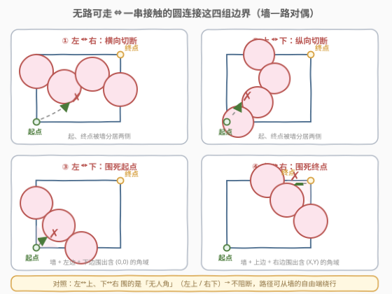
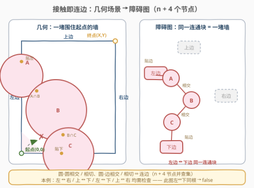
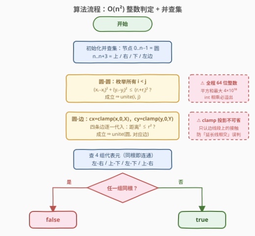
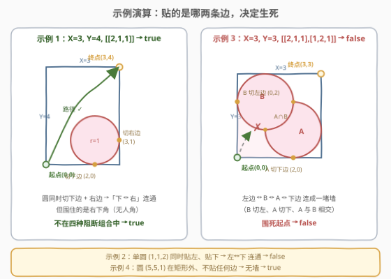

# 判断矩形的两个角落是否可达

- **题目名称**：判断矩形的两个角落是否可达
- **链接**：[3235. 判断矩形的两个角落是否可达](https://leetcode.cn/problems/check-if-the-rectangle-corner-is-reachable/)
- **难度**：困难
- **标签**：并查集、深度优先搜索、广度优先搜索、几何、数学

## 1. 题目概述

坐标平面内有一个左下角在原点、右上角在 $(xCorner, yCorner)$ 的矩形，以及 $n$ 个圆，其中 $circles[i] = [x_i, y_i, r_i]$ 表示圆心在 $(x_i, y_i)$、半径为 $r_i$ 的圆。

需要判断是否存在一条从**左下角 $(0,0)$** 到**右上角 $(xCorner, yCorner)$** 的路径，同时满足：

1. 路径**完全**在矩形内部；
2. **不会**触碰或经过**任何**圆的内部**和边界**（圆是「闭集障碍」，沾到边也不行）；
3. **只**在起点和终点接触到矩形——其余任何位置不能踩到矩形的边。

存在这样的路径返回 `true`，否则返回 `false`。

**示例 1**：

```text
输入：X = 3, Y = 4, circles = [[2,1,1]]
输出：true
解释：圆虽然同时贴住了下边界 (2,0) 和右边界 (3,1)，但黑色曲线可以从左上方绕过去。
```

**示例 2**：

```text
输入：X = 3, Y = 3, circles = [[1,1,2]]
输出：false
解释：这一个圆同时压住了左边界和下边界，把起点 (0,0) 围死在角落里。
```

**示例 3**：

```text
输入：X = 3, Y = 3, circles = [[2,1,1],[1,2,1]]
输出：false
解释：圆 A 贴下边界、圆 B 贴左边界、A 与 B 相交——两圆连成一堵「墙」，同样围死起点。
```

**示例 4**：

```text
输入：X = 4, Y = 4, circles = [[5,5,1]]
输出：true
解释：圆完全在矩形外面，不构成障碍。
```

**约束**：

- $3 \le xCorner, yCorner \le 10^9$
- $1 \le circles.length \le 1000$
- $1 \le x_i, y_i, r_i \le 10^9$

> 💡 **审题关键**：① 坐标尺度高达 $10^9$，但圆**最多只有 1000 个**——在连续平面上「搜路径」绝无可能，出路必然是考察圆与圆、圆与边之间的**关系**；② 圆的内部**和边界**都不能碰，说明两圆哪怕恰好外切，切点也被封锁，「接触」就要按「相连」处理；③ 路径只在起终点碰矩形——所以圆一旦贴住某条边，圆和这条边就「无缝焊接」成一堵整体障碍（缝隙宽度为 0）。

---

## 2. 解题思路

### 2.1 暴力思路：在平面上搜索路径？

最朴素的想法是把平面离散化成网格做 BFS：但坐标范围 $10^9$，网格要么爆炸要么丢失精度；在圆的交点处构造 Voronoi 式导航点也因「路径不能踩边、不能碰圆」的严格约束而极其脆弱。

换个角度：路径的存在性本质是个**拓扑**问题——从 $(0,0)$ 到 $(X,Y)$ 的路被堵住，当且仅当有「一堵墙」把矩形切成两半，起终点分居两侧。而墙只能由圆（和矩形的边）拼成，圆只有 1000 个。于是问题从「在 $10^9 \times 10^9$ 的平面上找路」转化为「在 1000 个圆的关系图上找墙」——规模骤降 6 个数量级。

### 2.2 核心观察：墙—路对偶，障碍图建模



**观察 1（对偶转化）**：「存在路径」与「不存在阻隔墙」互为否定。把每个圆看作一个障碍节点，矩形的 4 条边也各看作一个节点——**圆与圆相交（或相切）、圆与边相交（或相切），就在对应节点之间连一条边**。一串两两接触的圆构成一条「墙」，墙连接哪两条边，决定了它切断的是哪些区域。这就是官方提示的 $n+4$ 节点障碍图：节点 $0..n-1$ 是圆，$n$（上边）、$n+1$（右边）、$n+2$（下边）、$n+3$（左边）是边界。

**观察 2（恰好四种阻断组合）**：起点 $(0,0)$ 贴左、下两条边，终点 $(X,Y)$ 贴上、右两条边。墙要阻断路径，只有四种连法：

| 阻断组合 | 几何含义 |
|----------|----------|
| **左 ↔ 右** | 墙横向切断矩形，起点（下侧）与终点（上侧）分居两半 |
| **上 ↔ 下** | 墙纵向切断矩形，起点（左侧）与终点（右侧）分居两半 |
| **左 ↔ 下** | 墙 + 左边 + 下边围出一个含 $(0,0)$ 的封闭角域，**围死起点** |
| **上 ↔ 右** | 墙 + 上边 + 右边围出一个含 $(X,Y)$ 的封闭角域，**围死终点** |

而「左 ↔ 上」「下 ↔ 右」**不算阻断**：它们围住的是左上角、右下角这两个无关角落，路径可以从墙的自由端绕过去（示例 1 正是圆贴住「下 ↔ 右」却返回 `true` 的活例子）。

> 💡 **为什么「圆盖住起点/终点」不用特判？** 若某圆覆盖 $(0,0)$，则它到左边线段、下边线段的最近点都取在角点 $(0,0)$ 处，距离 $\le r$——该圆同时「贴左」又「贴下」，左↔下连通自动触发 `false`。终点被覆盖同理（上↔右连通）。模型天然吞掉这两种退化情形。

**观察 3（接触判定的纯整数实现）**：全部判定只需两种公式，且都能用整数平方比较完成（彻底绕开 $\sqrt{\cdot}$ 的浮点误差）：

- **圆 $(x_i,y_i,r_i)$ 与圆 $(x_j,y_j,r_j)$**：相交或相切 $\iff (x_i-x_j)^2 + (y_i-y_j)^2 \le (r_i+r_j)^2$；
- **圆 $(x,y,r)$ 与边线段**：等价于「圆心到线段的距离 $\le r$」。用**投影钳制**（clamp）把「到线段」化成「到点」——记 $c_x = \max(0, \min(X, x))$（$x$ 在 $[0,X]$ 上的投影）、$c_y = \max(0, \min(Y, y))$，则四条边的判定为：

| 边 | 线段 | 判定式 |
|----|------|--------|
| 上边 | $y = Y,\ x \in [0,X]$ | $(x - c_x)^2 + (y - Y)^2 \le r^2$ |
| 右边 | $x = X,\ y \in [0,Y]$ | $(x - X)^2 + (y - c_y)^2 \le r^2$ |
| 下边 | $y = 0,\ x \in [0,X]$ | $(x - c_x)^2 + y^2 \le r^2$ |
| 左边 | $x = 0,\ y \in [0,Y]$ | $x^2 + (y - c_y)^2 \le r^2$ |

> ⚠️ **clamp 千万不能省**：若直接用「整条直线」判定（如左边只看 $x \le r$），一个圆心在矩形上方外侧、只与左边的**延长线**相交的圆会被误判为「贴左」，凭空连出一条不存在的墙导致误报 `false`。投影钳制保证接触点真正落在边线段上。



### 2.3 算法流程图



| 步骤 | 操作 | 说明 |
|------|------|------|
| ① 建图 | 初始化 $n+4$ 节点的并查集 | $0..n-1$ 为圆，$n..n+3$ 为上/右/下/左边 |
| ② 圆-圆合并 | 枚举所有 $i < j$，判定相交则 `union` | $O(n^2) \approx 5 \times 10^5$ 对，整数运算 |
| ③ 圆-边合并 | 每个圆对四条边分别做 clamp 投影判定 | $4n$ 次，注意 64 位防溢出 |
| ④ 组合检查 | 查四对代表元：左-右、上-下、左-下、上-右 | 任一同根 → `false`，否则 `true` |

### 2.4 示例演算



**示例 1**（$X=3, Y=4$, 圆心 $(2,1)$, $r=1$）：
- 贴下边？$c_x = 2$，$(2-2)^2 + 1^2 = 1 \le 1$ ✓（相切于 $(2,0)$）；
- 贴右边？$c_y = 1$，$(2-3)^2 + (1-1)^2 = 1 \le 1$ ✓（相切于 $(3,1)$）；
- 于是「下 ↔ 右」连通——但这是**右下角**组合，不在四种阻断组合里，返回 **true**。这个圆贴住的两条边围死的是右下角，与起点（左下）、终点（右上）都无关。

**示例 3**（$X=Y=3$, 圆 A $(2,1,1)$、圆 B $(1,2,1)$）：
- 圆 A 贴下边：$(2-2)^2 + 1^2 = 1 \le 1$ ✓；圆 B 贴左边：$1^2 + (2-2)^2 = 1 \le 1$ ✓；
- A、B 相交？$(2-1)^2 + (1-2)^2 = 2 \le (1+1)^2 = 4$ ✓；
- 于是「左 ↔ B ↔ A ↔ 下」连成一堵墙，围死起点 $(0,0)$，返回 **false**。

**示例 2** 是示例 3 的退化版：一个圆 $(1,1,2)$ 同时贴左（$1^2 + 0 \le 4$ ✓）和贴下（$0 + 1^2 \le 4$ ✓），单独一堵墙就围死了起点。

---

## 3. 参考代码

### C++

```cpp
class Solution {
public:
    bool canReachCorner(int X, int Y, vector<vector<int>>& circles) {
        int n = circles.size();
        // 节点 0..n-1：圆；n：上边，n+1：右边，n+2：下边，n+3：左边
        vector<int> parent(n + 4);
        iota(parent.begin(), parent.end(), 0);
        function<int(int)> find = [&](int x) {
            return parent[x] == x ? x : parent[x] = find(parent[x]);
        };
        auto unite = [&](int a, int b) { parent[find(a)] = find(b); };

        for (int i = 0; i < n; i++) {
            long long xi = circles[i][0], yi = circles[i][1], ri = circles[i][2];
            for (int j = i + 1; j < n; j++) {
                long long dx = xi - circles[j][0];
                long long dy = yi - circles[j][1];
                long long sr = ri + circles[j][2];
                if (dx * dx + dy * dy <= sr * sr) unite(i, j);
            }
        }

        for (int i = 0; i < n; i++) {
            long long x = circles[i][0], y = circles[i][1], r = circles[i][2];
            long long cx = max(0LL, min((long long)X, x));  // x 在 [0,X] 上的投影
            long long cy = max(0LL, min((long long)Y, y));  // y 在 [0,Y] 上的投影
            if ((x - cx) * (x - cx) + (y - Y) * (y - Y) <= r * r) unite(i, n);     // 上边
            if ((x - X) * (x - X) + (y - cy) * (y - cy) <= r * r) unite(i, n + 1); // 右边
            if ((x - cx) * (x - cx) + y * y <= r * r) unite(i, n + 2);             // 下边
            if (x * x + (y - cy) * (y - cy) <= r * r) unite(i, n + 3);             // 左边
        }

        int top = find(n), right = find(n + 1), bottom = find(n + 2), left = find(n + 3);
        return !(left == right || top == bottom || left == bottom || top == right);
    }
};
```

> 💡 **写法要点**：① 一切几何判定都是**整数平方比较**，坐标、半径最大 $10^9$，平方和最大 $4 \times 10^{18}$，恰好在 `long long`（约 $9.2 \times 10^{18}$）安全范围内，`int` 相乘必溢出；② `cx`/`cy` 先转 `long long` 再参与运算，防止 `int` 中间结果先溢出；③ 相切也算接触（用 $\le$ 而非 $<$），因为路径连圆的边界都不能碰。

### Python

```python
class Solution:
    def canReachCorner(self, X: int, Y: int, circles: List[List[int]]) -> bool:
        n = len(circles)
        TOP, RIGHT, BOTTOM, LEFT = n, n + 1, n + 2, n + 3
        parent = list(range(n + 4))

        def find(x):
            while parent[x] != x:
                parent[x] = parent[parent[x]]   # 路径减半
                x = parent[x]
            return x

        def union(a, b):
            parent[find(a)] = find(b)

        for i in range(n):
            xi, yi, ri = circles[i]
            for j in range(i + 1, n):
                xj, yj, rj = circles[j]
                if (xi - xj) ** 2 + (yi - yj) ** 2 <= (ri + rj) ** 2:
                    union(i, j)

        for i, (x, y, r) in enumerate(circles):
            cx = min(X, max(0, x))   # x 在 [0, X] 上的投影
            cy = min(Y, max(0, y))   # y 在 [0, Y] 上的投影
            if (x - cx) ** 2 + (y - Y) ** 2 <= r * r:  # 上边
                union(i, TOP)
            if (x - X) ** 2 + (y - cy) ** 2 <= r * r:  # 右边
                union(i, RIGHT)
            if (x - cx) ** 2 + y * y <= r * r:         # 下边
                union(i, BOTTOM)
            if x * x + (y - cy) ** 2 <= r * r:         # 左边
                union(i, LEFT)

        top, right, bottom, left = find(TOP), find(RIGHT), find(BOTTOM), find(LEFT)
        return not (left == right or top == bottom
                    or left == bottom or top == right)
```

> 💡 Python 大整数天然无溢出之忧；两两判定约 $5 \times 10^5$ 次，实测轻松通过。若追求常数更小，可在 `union` 前先比 `find(i) == find(j)` 跳过无效合并。

---

## 4. 复杂度分析

| 维度 | 复杂度 | 说明 |
|------|--------|------|
| **时间** | $O(n^2 \alpha(n))$ | 圆-圆两两判定 $\binom{1000}{2} \approx 5 \times 10^5$ 对是瓶颈，$\alpha$ 为反阿克曼常数，视作 $O(1)$ |
| **空间** | $O(n)$ | 并查集 $n + 4$ 个节点 |
| 等价写法 | DFS / BFS $O(n^2)$ | 把接触关系建成邻接表后从「左/下侧」出发搜索，复杂度同阶；并查集写法最短 |

---

## 5. 扩展：正确性论证的方向与实战翻车点

**为什么「无墙 ⇒ 有路」？** 必要性方向（有墙 ⇒ 无路）即上文表格的 Jordan 曲线论证；充分性方向（无墙 ⇒ 有路）的严格证明需要拓扑工具（把每个圆膨胀 $\varepsilon$ 形成开障碍，用紧区域的连通分支随 $\varepsilon \to 0$ 的稳定性收尾），面试中给出「墙—路对偶」的直觉即可。另一个值得一提的细节是约束 $x_i, y_i \ge 1$——**圆心被限制在第一象限**，这排除了「障碍链从矩形外面绕行」的边界 case：若允许圆心在第三象限，可以构造一串在矩形外相连、却各自贴住左边和下边的圆，模型会误报 `false`；而第一象限的圆心要么自己就在矩形内（是实打实的内部障碍），要么大到必然贴住更多边界。约束与模型是配套的。

**周赛实战两大翻车点**（本题 hack 数据重灾区）：

1. **用直线代替线段判定圆-边接触**：缺少 clamp 投影，矩形外只与边的延长线相交的圆被误连进墙，误报 `false`；
2. **32 位溢出**：$r_i + r_j$ 可达 $2 \times 10^9$，平方后 $4 \times 10^{18}$，`int` 直接爆负数，相交判定随机失真——症状是「小数据全对、大数据随机错」。

一个更隐蔽的第三点：**忘记路径不能踩边**这个条件时，容易误以为「圆贴边」不算障碍锚点（圆只是路过边界而已）。恰恰相反——圆贴边的接触点落在边上，而路径不能踩边，所以圆与边在接触点处「无缝焊接」，这正是左↔下/上↔右能「围死角落」的前提。

---

## 6. 面试要点

1. **怎么想到把「路径存在性」转成「障碍连通性」？**

   两个信号：坐标 $10^9$ 级别宣告平面搜索死刑；圆只有 1000 个暗示关系图才是主战场。再由「路径被堵 ⟺ 存在墙隔开起终点」的拓扑直觉（画一条从左到右的墙，起点下方终点上方）落到「墙 = 一串接触的圆 + 两端锚在边界上」。这与「逃离大迷宫」一题的思路同宗：几何/巨型网格的可达性问题，往往转化为障碍之间的关系问题。

2. **为什么恰好是四种组合？「左↔上」「下↔右」为什么不算？**

   墙连接的两条边 + 这两条边围出的角域决定它困住谁。起点贴左、下两条边，终点贴上、右两条边：左↔右、上↔下是「切断」型；左↔下围住起点、上↔右围住终点是「包围」型。而左↔上围住的是左上角、下↔右围住右下角——两个「无人区」，路径从墙的自由端绕行即可，示例 1 就是圆贴住下↔右仍返回 `true` 的实例。

3. **圆与边的接触判定为什么要用「到线段的距离」？如何不用浮点数实现？**

   用整条直线会把「只与边的延长线相交、实际在矩形外」的圆误判为贴边，凭空造墙。到线段的距离通过 clamp 投影实现：$c_x = \max(0, \min(X, x))$、$c_y = \max(0, \min(Y, y))$ 把圆心坐标钳到边的参数范围内，剩下就是勾股定理的平方比较——全程整数，规避 $\sqrt{\cdot}$ 在 $10^9$ 尺度下的浮点误差。

4. **为什么相切（恰好等于）也算接触？**

   题目要求路径不碰圆的内部**和边界**，圆是闭集障碍。两圆外切时切点无法穿越；圆与边相切时切点在边上，而路径除起终点外不能踩边——圆与边在切点处无缝焊接成整体障碍。所以两种判定都用 $\le$。

5. **本题的溢出/精度风险在哪？**

   坐标与半径上限 $10^9$：圆-圆判定的 $(r_i + r_j)^2$ 最大 $4 \times 10^{18}$，圆-边判定的平方和最大约 $2 \times 10^{18}$，均逼近但不超过 `long long` 上限——C++ 必须 64 位整数（且注意先转换再相乘），Python 天然免疫；任何用 `double`/`sqrt` 的写法在临界相切案例上都有精度翻车风险。

---

## 7. 同类练习题

- [1036. 逃离大迷宫](https://leetcode.cn/problems/escape-a-large-maze/)：同为「巨型平面上的可达性」问题，用「障碍有限」的数学观察替代暴力搜索——思考方式同宗
- [836. 矩形重叠](https://leetcode.cn/problems/rectangle-overlap/)：几何相交判定的基本功，体会「投影/区间」视角如何替代逐点检验
- [947. 移除最多的同行或同列石头](https://leetcode.cn/problems/most-stones-removed-with-same-row-or-column/)：把几何关系（同行同列）抽象成并查集连边的经典建模
- [1971. 寻找图中是否存在路径](https://leetcode.cn/problems/find-if-path-exists-in-graph/)：并查集判定连通的最裸模板，本题的「基础设施」
