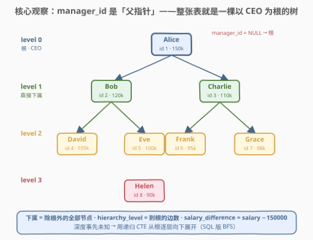
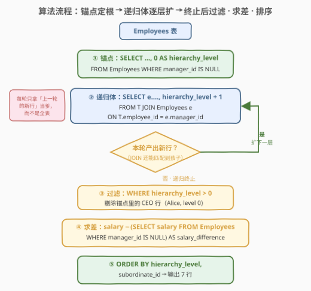
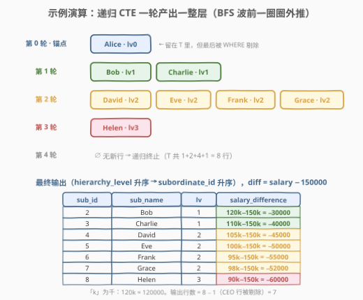

# LeetCode 首席执行官下属层级 题解

## 1. 题目概述

- **标题 / 题号**：首席执行官下属层级（#3236，hard）
- **链接**：https://leetcode.cn/problems/ceo-subordinate-hierarchy/
- **难度**：困难
- **标签**：数据库、SQL、递归 CTE、`WITH RECURSIVE`、树遍历、BFS、自连接、LeetCode 锁题

> ⚠️ 本题为 LeetCode 付费题（锁题），题意描述根据官方示例用例与外部资料重建，可能与官方题面有出入。（题面已与社区镜像 doocs/leetcode 的官方中文翻译交叉核对，示例输入输出与 GraphQL 接口返回一致，出入风险较低。）

**表结构**：`Employees`

| 列名 | 类型 |
|------|------|
| employee_id | int |
| employee_name | varchar |
| manager_id | int |
| salary | int |

- `employee_id` 是这张表的唯一标识符。
- `manager_id` 是 `employee_id` 对应员工的经理；**首席执行官（CEO）的 `manager_id` 为 `NULL`**。

**目标**：编写一个解决方案，找到 CEO 的**直接**和**非直接**下属，以及他们的**层级**和**与 CEO 的薪资差异**。结果包含以下列：

- `subordinate_id`：下属的 `employee_id`；
- `subordinate_name`：下属的名字；
- `hierarchy_level`：下属在等级制度中的级别（`1` 表示直接下属，`2` 表示他们的直接下属，以此类推）；
- `salary_difference`：下属与 CEO 的薪资差异。

返回结果以 `hierarchy_level` **升序**排序，再按 `subordinate_id` **升序**排序。

**示例 1**：

```text
输入：Employees 表
+-------------+----------------+------------+---------+
| employee_id | employee_name  | manager_id | salary  |
+-------------+----------------+------------+---------+
| 1           | Alice          | NULL       | 150000  |
| 2           | Bob            | 1          | 120000  |
| 3           | Charlie        | 1          | 110000  |
| 4           | David          | 2          | 105000  |
| 5           | Eve            | 2          | 100000  |
| 6           | Frank          | 3          | 95000   |
| 7           | Grace          | 3          | 98000   |
| 8           | Helen          | 5          | 90000   |
+-------------+----------------+------------+---------+

输出：
+----------------+------------------+------------------+-------------------+
| subordinate_id | subordinate_name | hierarchy_level  | salary_difference |
+----------------+------------------+------------------+-------------------+
| 2              | Bob              | 1                | -30000            |
| 3              | Charlie          | 1                | -40000            |
| 4              | David            | 2                | -45000            |
| 5              | Eve              | 2                | -50000            |
| 6              | Frank            | 2                | -55000            |
| 7              | Grace            | 2                | -52000            |
| 8              | Helen            | 3                | -60000            |
+----------------+------------------+------------------+-------------------+
```

**解释**：

- Alice 的 `manager_id` 为 `NULL`，是 CEO；Bob 和 Charlie 直接向 Alice 汇报，`hierarchy_level = 1`；
- David、Eve 下属于 Bob，Frank、Grace 下属于 Charlie，`hierarchy_level = 2`；
- Helen 下属于 Eve，`hierarchy_level = 3`；
- 薪资差异相对 CEO Alice 的 150000 计算（如 Bob：$120000 - 150000 = -30000$）。

**约束条件**（重建推测）：

- `employee_id` 是表的唯一标识（主键），`manager_id` 为指向 `Employees.employee_id` 的自引用外键；
- 恰好有一名员工的 `manager_id` 为 `NULL`（即 CEO），汇报链无环；
- 判题数据规模小；层级深度事先未知。

> 💡 **审题关键**：三个输出列各对应一个「距离」——`hierarchy_level` 是**结构距离**（到 CEO 的边数），`salary_difference` 是**数值距离**（薪资与 CEO 之差），而「下属」本身是**集合判定**（在 CEO 子树中）。一题同时考「树遍历 + 逐行携带信息 + 跨行引用根节点」，是组织架构类 SQL 的集大成者。

## 2. 解题思路

### 2.1 暴力思路：固定层数的多重自连接 / 应用层递归

「工程暴力」是把整表拉到应用层，在程序里从 CEO 开始 BFS：建邻接表、逐层入队、记层号、算差值——逻辑直白，但 SQL 只当搬运工。

SQL 层的「笨办法」是**多重自连接**：一次 `JOIN` 只能展开一层汇报关系（下属 → 经理），要覆盖 $D$ 层就得自连接 $D-1$ 次再逐层 `UNION`：

```sql
-- 第 1 层
SELECT e.employee_id, e.employee_name, 1 AS lv, e.salary - c.salary
FROM Employees e, Employees c
WHERE e.manager_id = c.employee_id AND c.manager_id IS NULL
UNION ALL
-- 第 2 层（再 JOIN 一次）
SELECT e2.employee_id, e2.employee_name, 2, e2.salary - c.salary
FROM Employees e2
JOIN Employees e1 ON e2.manager_id = e1.employee_id
JOIN Employees c  ON e1.manager_id = c.employee_id AND c.manager_id IS NULL
UNION ALL
-- 第 3 层、第 4 层……每层一段，手写到最深层为止
```

> ⚠️ 暴力思路的根本问题：**层数必须事先写死**。本题不保证汇报链深度，写 3 层可能漏人、写 10 层 SQL 已不可维护；而且每一段都要重新拼一遍「到 CEO 的链」，重复劳动随深度线性膨胀。SQL 处理「任意深度的层级展开」有专用武器——递归 CTE。

### 2.2 核心观察：一张自引用表就是一棵树，递归 CTE 就是 SQL 的逐层 BFS



把每行的 `manager_id` 看成**指向父亲的指针**，整张 `Employees` 表就是一棵**以 CEO 为根的树**：

- **根**：`manager_id IS NULL` 的那一行（Alice）——锚点唯一、天然好定位；
- **下属集合**：树中**除根以外的全部节点**（数据无环、单根时，任何非 CEO 员工都在 CEO 子树中，无需逐个判定）；
- **层级**：节点**深度**——根为 0，直接下属为 1，以此类推。递归展开时每向下一层 `+1`，正好顺着生成；
- **薪资差**：每行自己的 `salary` 减 CEO 的 `salary`——CEO 的薪资可以再查一次表（标量子查询），也可以直接从 T 里 level 0 那一行取。

于是模板与 [1270. 向公司CEO汇报工作的所有人](../1201-1300/1270_向公司CEO汇报工作的所有人.md) 同款，只是递归时要多**携带三列信息**（名字、层级、薪资）：

$$\text{下属} \iff \text{从 CEO 出发沿 } \text{manager\_id} \text{ 反向边可达},\qquad \text{hierarchy\_level} = \text{路径边数}$$

> 💡 **为什么「向下展开」优于「向上追溯」**：从 CEO 出发向下 BFS，天然只访问 CEO 子树——不在子树里的节点根本不会进入结果，无需排除逻辑；且 `hierarchy_level` 顺着递归「上一层 +1」就能带上，不用回头数链长。若反过来对每个员工向上追链，还得再判「链的终点是不是 CEO」。

### 2.3 算法流程图



**逻辑执行步骤**：

| 步骤 | SQL 片段 | 作用 | 示例数据流 |
|------|----------|------|-----------|
| ① | `WHERE manager_id IS NULL` | 锚点：定位 CEO（树根），层级记 0 | `(Alice, 0)` |
| ② | `JOIN Employees e ON T.employee_id = e.manager_id` | 递归体：拿上一轮新行当「爹」，找直接下属，层级 +1 | 一圈圈外推 |
| ③ | 某轮 JOIN 无新行 | 递归自动终止 | T 共 8 行 |
| ④ | `WHERE hierarchy_level > 0` | 剔除锚点行（CEO 本人不在输出里） | 8 行 → 7 行 |
| ⑤ | `salary − (CEO 的 salary)` | 逐行算薪资差 | `−30000` 等 |
| ⑥ | `ORDER BY hierarchy_level, subordinate_id` | 双键升序输出 | 7 行有序 |

> 💡 **递归 CTE 的执行机制**：先执行锚点得到初始集合 $S_0$（这里只有 CEO 一行）；用 $S_0$ 作为 `T` 执行递归体得到 $S_1$；再用 $S_1$ 得到 $S_2$……直到某轮产出**空集**停止，`UNION ALL` 把 $S_0 \cup S_1 \cup \cdots$ 合并为最终 CTE。每轮只拿「上一轮的新行」当驱动（而非全表），这就是**SQL 版的 BFS 波前**。注意递归体 JOIN 条件的方向：`T.employee_id = e.manager_id` 是「e 的经理是 T 里的人」= 向下找孩子；写反就变成向上找爹，语义全错。

### 2.4 示例演算



以示例数据逐步跟踪递归 CTE 的每轮展开：

**第 0 轮（锚点）**：`manager_id IS NULL` → $S_0 = \{(\text{Alice}, 0)\}$

**第 1 轮**：找 `manager_id = 1` 的员工 → $S_1 = \{(\text{Bob}, 1), (\text{Charlie}, 1)\}$

**第 2 轮**：找 `manager_id ∈ {2, 3}` 的员工 → $S_2 = \{(\text{David}, 2), (\text{Eve}, 2), (\text{Frank}, 2), (\text{Grace}, 2)\}$

**第 3 轮**：找 `manager_id ∈ {4, 5, 6, 7}` 的员工 → $S_3 = \{(\text{Helen}, 3)\}$

**第 4 轮**：找 `manager_id = 8` 的员工 → $S_4 = \emptyset$ → **递归终止**

**收尾**：T 共 $1+2+4+1 = 8$ 行；剔除 level 0 的 CEO 行剩 7 行；每行算 `salary − 150000`；按 `(level, id)` 排序输出。

> 💡 **一眼验证**：输出行数应为 $n - 1$（全表人数减 CEO）。层级排序后恰好是「一圈一圈」的顺序——第 1 层 2 人、第 2 层 4 人、第 3 层 1 人，同一层内按 `employee_id` 升序。

## 3. 参考代码

### SQL（解法 A：递归 CTE + 标量子查询，推荐）

```sql
# Write your MySQL query statement below
WITH RECURSIVE T AS (
    SELECT
        employee_id,
        employee_name,
        0 AS hierarchy_level,
        salary
    FROM Employees
    WHERE manager_id IS NULL
    UNION ALL
    SELECT
        e.employee_id,
        e.employee_name,
        T.hierarchy_level + 1,
        e.salary
    FROM T
    JOIN Employees e ON T.employee_id = e.manager_id
)
SELECT
    employee_id        AS subordinate_id,
    employee_name      AS subordinate_name,
    hierarchy_level,
    salary - (SELECT salary FROM Employees WHERE manager_id IS NULL) AS salary_difference
FROM T
WHERE hierarchy_level > 0
ORDER BY hierarchy_level, subordinate_id;
```

> 💡 **写法要点**：
> - **锚点**：`WHERE manager_id IS NULL` 精准命中 CEO（本题约定根用 NULL 表示，没有 [1270](../1201-1300/1270_向公司CEO汇报工作的所有人.md) 那种 `manager_id = 1` 自引用的坑），层级起步记 `0`——比记 `1` 好，CEO 行可被 `hierarchy_level > 0` 干净剔除；
> - **递归体**：`JOIN ... ON T.employee_id = e.manager_id`——上一轮的人当经理，找他的直接下属；`hierarchy_level + 1` 顺着递归逐行携带，无需事后计算；
> - **CEO 薪资**：用不相关的标量子查询取一次；判题规模下与 JOIN 版无差别；
> - **`UNION ALL` 而非 `UNION`**：树结构中每个员工只有一个经理，只会被匹配一次，各轮产出天然无重复，`UNION ALL` 免去逐轮去重开销；
> - **终止条件**：某轮 JOIN 无新行时递归自动停止，深度任意、SQL 长度与树深无关。

### SQL（解法 B：递归 CTE + 窗口函数「一趟带走」）

```sql
# Write your MySQL query statement below
WITH RECURSIVE T AS (
    SELECT employee_id, employee_name, 0 AS hierarchy_level, salary
    FROM Employees
    WHERE manager_id IS NULL
    UNION ALL
    SELECT e.employee_id, e.employee_name, T.hierarchy_level + 1, e.salary
    FROM T
    JOIN Employees e ON T.employee_id = e.manager_id
)
SELECT subordinate_id, subordinate_name, hierarchy_level,
       salary - ceo_salary AS salary_difference
FROM (
    SELECT
        employee_id   AS subordinate_id,
        employee_name AS subordinate_name,
        hierarchy_level,
        salary,
        MAX(CASE WHEN hierarchy_level = 0 THEN salary END) OVER () AS ceo_salary
    FROM T
) x
WHERE hierarchy_level > 0
ORDER BY hierarchy_level, subordinate_id;
```

> 💡 **解法 B 的取舍**：
> - 锚点行（level 0）本身就带着 CEO 薪资，用 `MAX(CASE ...) OVER ()` 把它广播到每一行，**不再二次访问 Employees 表**；
> - ⚠️ **必须套一层派生表**：SQL 的逻辑执行顺序是 `WHERE → 窗口函数`。若把窗口写在最外层，`WHERE hierarchy_level > 0` 会先删掉 level 0 的行，CEO 薪资随之为 `NULL`，差值全变 `NULL`——这是窗口函数题的第一大坑（与 [1651. Hopper公司查询III](../1601-1700/1651_Hopper公司查询III.md) 的滑动窗口同理）；
> - 也可以更简单地把过滤换成 `QUALIFY` 风格的写法——MySQL 不支持 `QUALIFY`，但 Snowflake / DuckDB 支持。工程上解法 A 的标量子查询最直白，解法 B 的价值在于演示「CTE 自带的信息尽量在 CTE 内消化」。

### Python（pandas）

```python
import pandas as pd
from collections import deque


def ceo_subordinate_hierarchy(employees: pd.DataFrame) -> pd.DataFrame:
    name = dict(zip(employees["employee_id"], employees["employee_name"]))
    salary = dict(zip(employees["employee_id"], employees["salary"]))
    children = employees.groupby("manager_id")["employee_id"].apply(list).to_dict()

    ceo = int(employees.loc[employees["manager_id"].isna(), "employee_id"].iloc[0])
    rows, queue = [], deque([(ceo, 0)])
    while queue:
        emp, level = queue.popleft()
        if level > 0:
            rows.append((emp, name[emp], level, salary[emp] - salary[ceo]))
        for child in children.get(emp, []):
            queue.append((child, level + 1))

    return pd.DataFrame(
        rows,
        columns=["subordinate_id", "subordinate_name", "hierarchy_level", "salary_difference"],
    )
```

> 💡 **pandas 对照**（付费题无官方函数签名，函数名按题名约定）：
> - `children` 是邻接表——`groupby("manager_id")` 对应递归体里 `manager_id` 上的 JOIN；
> - `deque` 上的 BFS 与递归 CTE 的「波前迭代」逐轮同构：`queue` 里同批入队的正是同一层全员；
> - `(ceo, 0)` 入队对应锚点；`level > 0` 跳过 CEO 行对应 `WHERE hierarchy_level > 0`；
> - BFS 按层出队，结果天然按 `hierarchy_level` 有序；同层内 `children.get(...)` 的列表顺序取决于 `groupby` 的组内顺序（默认按表序，即 `employee_id` 升序的输入），如需严格保证再补一次 `sort_values`。

## 4. 复杂度分析

设 $n$ 为 `Employees` 表行数，$D$ 为树高（最大层级）。

| 维度 | 复杂度 | 说明 |
|------|--------|------|
| **时间复杂度** | $O(n \cdot D)$ | 递归共 $D+1$ 轮，无索引时每轮对 `Employees` 全表扫描匹配 `manager_id` |
| **时间（有索引）** | $O(n \log n)$ 量级 | `manager_id` 建索引后每轮按上一层的行数走索引查找，总访问量 $\sum \text{各层行数} = n$ |
| **空间复杂度** | $O(n)$ | CTE 结果累积 $n$ 行（含 CEO 行），每行常数个携带列 |
| **对比多重自连接** | $O(n \cdot D)$ 但需预知 $D$ | 固定写 $k$ 层，深度超过 $k$ 即漏人；SQL 长度随 $D$ 线性膨胀 |

> - 标量子查询取 CEO 薪资只执行一次，不影响量级；解法 B 的窗口函数对 T 单趟扫描，同样是 $O(n)$；
> - 本题输出必须排序：`ORDER BY hierarchy_level, subordinate_id` 附加 $O(n \log n)$，$n$ 个整数排序开销很小；
> - 生产环境在 `manager_id` 上建索引是组织架构表的标准配置——递归每轮的「找孩子」从全表扫描降为索引点查。

## 5. 扩展

### 5.1 递归 CTE 三要素与 MySQL 的深度护栏

| 要素 | 本题对应 | 说明 |
|------|----------|------|
| 锚点（anchor） | `WHERE manager_id IS NULL` | 递归的起点，非递归查询，只执行一次 |
| 递归体（recursive member） | `JOIN Employees e ON T.employee_id = e.manager_id` | 引用 CTE 自身，**只能引用一次、且不能含聚合/窗口** |
| 终止（termination） | 新一轮产出空集 | `UNION ALL` 累积所有轮次的行 |

- **`UNION ALL` vs `UNION`**：`UNION` 会对（累积结果 ∪ 本轮产出）去重，若数据异常（如汇报链成环导致同一行被反复产出），`UNION` 能靠去重止损、`UNION ALL` 会无限膨胀——但正解是数据侧修环，而非指望 `UNION` 兜底；
- **`cte_max_recursion_depth`**：MySQL 默认递归深度上限 1000，超过报错 `ER_CTE_MAX_RECURSION_DEPTH`。本题层级很浅无虞；真实组织架构（层级数远小于人数）也极少触线，但面试值得主动一提。

### 5.2 脏数据防御：环与悬空指针

「从 CEO 向下展开」有一个被低估的优良性质——**天然免疫不在 CEO 子树中的环**。若员工 X、Y 互为经理（`X.manager_id = Y` 且 `Y.manager_id = X`），从 CEO 出发的 BFS 根本走不到他们，递归照常在 CEO 子树耗尽后终止，X、Y 只是不会出现在结果里（合理：他们本就不向 CEO 汇报）。对照 [1270](../1201-1300/1270_向公司CEO汇报工作的所有人.md) 的员工 3 自引用案例——同一性质。真正危险的是「把全表都当锚点」式的向上递归，环会直接转死。工程上的三道防线：

- **约束层**：`CHECK (manager_id IS NULL OR manager_id != employee_id)` 禁自引用；`FOREIGN KEY (manager_id) REFERENCES Employees(employee_id)` 禁悬空指针（对照 [1978. 上级经理已离职的公司员工](../1901-2000/1978_上级经理已离职的公司员工.md)——那张表就悬空了）；
- **查询层**：递归体里带路径数组判重，或给 `hierarchy_level` 设上限作保险丝；
- **对账层**：`SELECT COUNT(*) FROM T` 与全表行数比对，不等即存在「不向 CEO 汇报」的游离子树。

### 5.3 变体追问：每人统计全树下级数（子树大小）

面试官常追问：「每人管几个人（含间接）？」单靠本题「从根向下」的展开答不了——需要**全表的传递闭包**：让每个员工各自向上爬，`(员工, 途径经理)` 每碰一次记一行，再按经理分组计数：

```sql
WITH RECURSIVE up(emp, mgr) AS (
    SELECT employee_id, manager_id FROM Employees
    UNION ALL
    SELECT u.emp, e.manager_id
    FROM up u
    JOIN Employees e ON u.mgr = e.employee_id
    WHERE e.manager_id IS NOT NULL      -- 爬到 CEO 为止
)
SELECT mgr AS employee_id, COUNT(*) AS total_subordinates
FROM up
WHERE mgr IS NOT NULL
GROUP BY mgr;
```

> 💡 视角升级：本题的递归 CTE 展开的其实是「CEO 一列的传递闭包」——锚点锁定根、沿反向边闭包出整棵子树；把锚点换成全表（5.3 的写法）就得到**任意人对任意人**的汇报关系。组织架构、物料 BOM、评论楼层、分类目录，凡「父指针表」皆可套此两板斧：**要一个人的全下游 → 单根闭包；要所有人的两两关系 → 全表闭包**。

## 6. 面试要点

1. **为什么说这张表是一棵树？CEO 的 `manager_id = NULL` 起什么作用？**

   > 每行恰有一个 `manager_id` 指向另一行的 `employee_id`，即每个节点恰有一个父指针；全表无环时这就是一棵树（或森林）。`NULL` 把 CEO 标记为**唯一根**：既是「向下展开」递归 CTE 的锚点条件（`WHERE manager_id IS NULL`），也是「向上追溯」链的终止哨兵。若存在多根/有环，表是森林而非树，需按 5.2 防御。

2. **递归 CTE 的执行模型是什么？终止条件在哪里写的？**

   > 锚点先执行产出 $S_0$；之后每轮把**上一轮的新行**作为 `T` 代入递归体，产出 $S_{i+1}$；当某轮产出空集时递归终止——**没有显式的终止判断语句**，终止由「JOIN 匹配不到新行」隐式触发。`UNION ALL` 把各轮结果全部累积成最终 CTE。每轮只驱动上一轮新行（工作表机制），等价于 BFS 的波前推进。

3. **解法 B 为什么必须在派生表里算窗口、再在外层 `WHERE` 过滤？**

   > SQL 逻辑执行顺序是 `FROM → WHERE → GROUP BY → SELECT(含窗口) → ORDER BY`，`WHERE` 先于窗口函数。若把 `MAX(CASE WHEN hierarchy_level = 0 ...) OVER ()` 写在最外层，`WHERE hierarchy_level > 0` 会先删掉唯一携带 CEO 薪资的 level 0 行，窗口算出 `NULL`、差值全错。正确姿势：派生表内先算窗口（此时 CEO 行还在），外层再过滤排序。

4. **`UNION ALL` 换成 `UNION` 会怎样？各有什么代价？**

   > 本题树结构保证每个员工只被唯一经理匹配一次，各轮产出天然无重复，`UNION ALL` 正确且省去去重开销。`UNION` 会对「累积结果 ∪ 新行」做去重，多付每轮排序/哈希的成本；但当数据有环时，`UNION` 的去重能让递归在行集不再增长后终止（止损），`UNION ALL` 则无限循环直至触发 `cte_max_recursion_depth`。原则：数据干净用 `UNION ALL`，防御脏数据或语言不支持 `UNION ALL` 递归时（如部分方言要求 `UNION`）换 `UNION`。

5. **如果组织表出现环或悬空 `manager_id`，查询会怎样？如何防御？**

   > 从 CEO 向下展开对「不在 CEO 子树中的环」天然免疫——BFS 根本到不了它们；但悬空指针若落在 CEO 子树内（某中间经理被删但孩子还在），那些孩子会从结果中静默消失（向上断链）。防御：约束层 `CHECK` 禁自引用 + 外键禁悬空；查询层路径数组判重或层级上限保险丝；对账层用 `COUNT(*)` 比对 T 与全表行数，发现游离子树（见 5.2）。

> 💡 **一句话总结**：3236 是「父指针表 = 树」的招牌题——锚点 `manager_id IS NULL` 定根、递归体 `ON T.employee_id = e.manager_id` 一层层向下扩（SQL 版 BFS），层级 `+1` 顺着递归携带、薪资差对 CEO 标量一次相减，最后 `level > 0` 剔根、双键排序收尾。与 [1270](../1201-1300/1270_向公司CEO汇报工作的所有人.md) 同模板，多考了「逐行携带信息」与「跨行引用根节点」两步。

## 同类练习题

| # | 题目 | 与本题的关联 |
|---|------|-------------|
| 1270 | [向公司CEO汇报工作的所有人](https://leetcode.cn/problems/all-people-report-to-the-given-manager/)（[站内题解](../1201-1300/1270_向公司CEO汇报工作的所有人.md)） | 同款递归 CTE 向下展开的「只问归属」版，本题是其「带层级 + 带薪资差」升级；注意 1270 的根是 `manager_id = 1` 自引用，本题是 `NULL`，两种根约定对照 |
| 181 | [超过经理收入的员工](https://leetcode.cn/problems/employees-earning-more-than-their-managers/)（[站内题解](../0101-0200/181_超过经理收入的员工.md)） | 单层自连接入门（`JOIN ON e.managerId = m.id`），也是「两列薪资相减」的最小原型，对照本题的多层递归 + 与根相减 |
| 570 | [至少有 5 名直接下属的经理](https://leetcode.cn/problems/managers-with-at-least-5-direct-reports/)（[站内题解](../0501-0600/570_至少有5名直接下属的经理.md)） | `GROUP BY manager_id` 只数直属孩子，对照本题「全子树逐层展开」，一深一广正好互补 |
| 608 | [树节点](https://leetcode.cn/problems/tree-node/)（[站内题解](../0601-0700/608_树节点.md)） | `parent_id` 表判 root/inner/leaf，树查询基础件；本题的 NULL 根判定即它的 root 判定 |
| 1978 | [上级经理已离职的公司员工](https://leetcode.cn/problems/employees-whose-manager-left-the-company/)（[站内题解](../1901-2000/1978_上级经理已离职的公司员工.md)） | `manager_id` 悬空（指向已删除的员工）的判定，正好是 5.2 脏数据防御的实战对照 |
