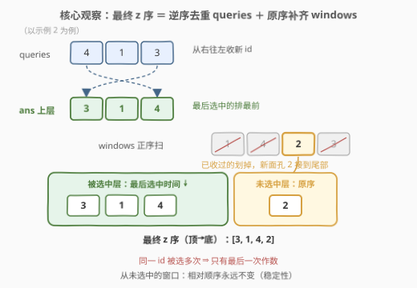
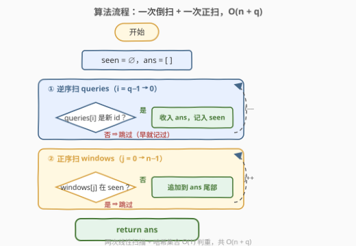
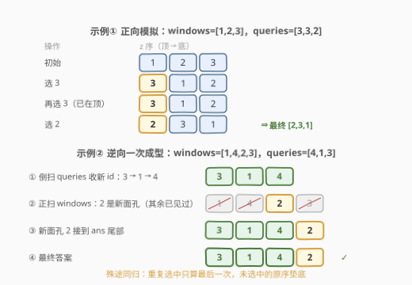

# Alt 和 Tab 模拟

- **题目名称**：Alt 和 Tab 模拟
- **链接**：[3237. Alt 和 Tab 模拟](https://leetcode.cn/problems/alt-and-tab-simulation/)
- **难度**：中等
- **标签**：数组、哈希表、模拟

## 1. 题目概述

> ⚠️ 本题为 LeetCode 付费题，题意描述根据官方示例用例与 hints 重建，可能与官方题面有出入。

操作系统里，**Alt + Tab** 是切换窗口的经典快捷键：选中某个窗口时，它会被「拉」到所有窗口的最前面（z 序顶端）。

给定两个整数数组：

- `windows`：当前所有打开窗口的 **z 序**（从前到后即从顶层「最近使用」到底层「最久未用」），`windows[i]` 是第 $i$ 个窗口的 id，元素互不相同；
- `queries`：`queries[i]` 表示第 $i$ 次按 Alt+Tab 时用户**选中**的窗口 id——该窗口立即被提到 z 序最顶端，其余窗口相对顺序不变。

请返回**处理完所有查询后**的窗口 z 序（同样从顶到底）。

**示例 1**：

```text
输入：windows = [1,2,3], queries = [3,3,2]
输出：[2,3,1]
解释（顶→底逐步模拟）：
- 初始：[1, 2, 3]
- 选中 3 → [3, 1, 2]
- 再选 3 → [3, 1, 2]（已在顶端，位置不变）
- 选中 2 → [2, 3, 1]
```

**示例 2**：

```text
输入：windows = [1,4,2,3], queries = [4,1,3]
输出：[3,1,4,2]
解释（顶→底逐步模拟）：
- 初始：[1, 4, 2, 3]
- 选中 4 → [4, 1, 2, 3]
- 选中 1 → [1, 4, 2, 3]
- 选中 3 → [3, 1, 4, 2]
```

**约束**（按官方示例与 hints 推断，具体量级以官网为准）：两个数组的长度均可达 $10^5$ 量级；`windows` 中 id 互不相同；`queries` 中的 id 都出现在 `windows` 中。

> 💡 **审题关键**：① 问的是**最终一层快照**而非过程——查询全部给定，可以**离线倒着推**；② 同一窗口被选多次，**只有最后一次**说了算；③ 从未选中的窗口**相对顺序永远不变**。

---

## 2. 解题思路

### 2.1 暴力思路：数组真实模拟（会超时）

用数组维护 z 序，对每个查询三步走：定位元素 $O(n)$、删除 $O(n)$、头插 $O(n)$：

```python
z = list(windows)
for q in queries:
    z.remove(q)      # O(n) 定位 + 删除
    z.insert(0, q)   # O(n) 头插
return z
```

单次查询 $O(n)$，总计 $O(n \cdot q)$。$n, q$ 均为 $10^5$ 量级时约 $10^{10}$ 次元素搬移，**必然超时**。瓶颈不在「模拟对不对」，而在「每一步都在做全局搬移」——而最终答案其实只依赖极少数信息。

### 2.2 核心观察：正难则反——只认「最后一次」



**观察 1（重复选中，只算最后一次）**：窗口 $w$ 若被选中 $k$ 次，前 $k-1$ 次「提到顶端」的效果都会被之后的操作覆盖——决定它最终位置的只有**最后一次**选中。所以 `queries` 中每个 id 只需保留最后出现的那一次。

**观察 2（最终结构天然分两层）**：窗口一旦被选中就被提到当时的顶端，此后能压到它上面的只能是**更晚被选中**的窗口；而**从未被选中**的窗口从未获得上浮机会，彼此之间也从不交换。于是：

$$\text{最终 z 序} = \underbrace{\text{被选中的（按最后选中时间，从晚到早）}}_{\text{上层}} + \underbrace{\text{从未选中的（按 windows 原序）}}_{\text{下层}}$$

**观察 3（逆序扫描天然产出正确顺序）**：从 `queries` **末尾往前**扫，遇到没见过的 id 就收进 `ans`——先收到的正是「最后选中时间最晚」的，恰好就是最顶层的；再把 `windows` 里没收过的 id 按原序接到 `ans` 尾部。一次倒扫 + 一次正扫，配合哈希集合 $O(1)$ 判重即可。

> 💡 这是**离线处理**的典型威力：既然只要终态，就从终态倒推，跳过所有中间搬移。

### 2.3 算法流程图



| 步骤 | 操作 | 作用 |
|------|------|------|
| ① 初始化 | `seen = ∅`，`ans = []` | `seen` 记录已收入 `ans` 的 id |
| ② 倒扫 queries | $i$ 从 $q-1$ 到 $0$；`queries[i]` 不在 `seen` ⇒ 收入 `ans` 并记录 | 构造上层：最后选中的排最前 |
| ③ 正扫 windows | `windows[j]` 不在 `seen` ⇒ 追加到 `ans` 尾部 | 构造下层：未选中的原序垫底 |
| ④ 返回 | `return ans` | 上层 + 下层即最终 z 序 |

### 2.4 示例演算



| 输入 | 逆序收取（上层） | 原序补尾（下层） | 输出 |
|------|------------------|------------------|------|
| `windows=[1,2,3]`, `queries=[3,3,2]` | 倒扫 2,3,3 → 收 2、3 → `[2,3]` | 1 未见过 → 接尾 | `[2,3,1]` |
| `windows=[1,4,2,3]`, `queries=[4,1,3]` | 倒扫 3,1,4 → 收 3、1、4 → `[3,1,4]` | 2 未见过 → 接尾 | `[3,1,4,2]` |

第一行 `queries=[3,3,2]` 里有重复的 3：倒扫时第二次遇到 3 直接跳过（早已收入），正体现「重复选中只算最后一次」。

---

## 3. 参考代码

### C++（逆序去重 + 原序补齐）

```cpp
class Solution {
public:
    vector<int> simulationResult(vector<int>& windows, vector<int>& queries) {
        unordered_set<int> seen;
        vector<int> ans;
        ans.reserve(windows.size());

        for (int i = (int)queries.size() - 1; i >= 0; --i) {
            if (!seen.count(queries[i])) {      // 只认最后一次
                seen.insert(queries[i]);
                ans.push_back(queries[i]);
            }
        }
        for (int w : windows)                    // 没选过的原序垫底
            if (!seen.count(w))
                ans.push_back(w);
        return ans;
    }
};
```

> 💡 付费题抓不到官方代码模板，函数签名以官网为准，不影响思路与实现。

### Python（同款逻辑）

```python
class Solution:
    def simulationResult(self, windows: List[int], queries: List[int]) -> List[int]:
        seen = set()
        ans = []
        for q in reversed(queries):              # 从右往左，只收新 id
            if q not in seen:
                seen.add(q)
                ans.append(q)
        ans += [w for w in windows if w not in seen]   # 未选中的原序接尾
        return ans
```

### Python（正向模拟对拍版，仅限小规模验证）

```python
class Solution:
    def simulationResult(self, windows: List[int], queries: List[int]) -> List[int]:
        z = list(windows)
        for q in queries:
            z.remove(q)
            z.insert(0, q)
        return z
```

> 💡 对拍版忠实复刻「提到顶端」语义，$O(n \cdot q)$，用于在随机小数据上与正解对拍验证。

---

## 4. 复杂度分析

| 维度 | 复杂度 | 说明 |
|------|--------|------|
| **时间（正解）** | $O(n + q)$ | 逆序扫 queries 一次 + 正序扫 windows 一次，哈希集合 $O(1)$ 判重 |
| **时间（暴力）** | $O(n \cdot q)$ | 每次查询的定位 / 删除 / 头插均为 $O(n)$ |
| **空间** | $O(n)$ | `seen` 集合至多存全部 $n$ 个 id（`ans` 为返回值不计） |

---

## 5. 扩展：在线版怎么办？——LRU 式「哈希 + 双向链表」

本题能倒序投机，前提是**所有查询一次性给全（离线）**。若改成在线版——查询逐条到达、随时要输出当前 z 序——倒扫技巧失效，得回到数据结构：

- 哈希表 `id → 链表节点` + **双向链表**维护 z 序；
- 每次选中：$O(1)$ 摘下节点、$O(1)$ 接到头部（C++ 用 `std::list::splice` 可零拷贝完成）；
- 输出：沿链表从头扫到尾，$O(n)$。

这正是 [146. LRU 缓存](https://leetcode.cn/problems/lru-cache/) 的 move-to-front 套路：本题正向模拟的每一步，就是一次 LRU 的「访问」。**能离线就倒着想，必须在线就上链表**——两种视角合起来才是这类题的完整答案。

---

## 6. 面试要点

1. **为什么每个窗口只有最后一次选中重要？**

   早先的「提到顶端」会被之后任何一次选中覆盖：此后它要么被更晚选中的窗口压到下面，要么被自己最后一次选中重新定位。倒序扫描 + 哈希去重天然实现「只认最后一次」。

2. **为什么未被选中的窗口保持 windows 原序？**

   「提到顶端」只改变被选中窗口与其他窗口的相对关系，从不交换两个都没动过的窗口。未选中窗口之间的相对顺序自始至终不变（操作是稳定的）。

3. **为什么「被选过的」必然整体压在「没选过的」上面？**

   任何窗口第一次被选中时就被提到了当时的顶端；此后能压到它上面的，只能是后来也被选中的窗口。从未选中的窗口没有上浮机会，只能整体垫底。

4. **倒扫得到的顺序为什么恰好正确？**

   归纳：倒扫中第 $k$ 个被收入的 id，其最后选中时间严格晚于第 $k+1$ 个被收入的；而最终 z 序中，最后选中时间越晚位置越靠上，二者一一对应。

5. **如果查询逐条在线到来怎么办？**

   放弃离线倒推，用哈希表 + 双向链表（LRU 套路）每次 $O(1)$ move-to-front，输出时 $O(n)$ 遍历链表。

---

## 7. 同类练习题

- [146. LRU 缓存](https://leetcode.cn/problems/lru-cache/)：访问即提到最前的**在线**版，哈希 + 双向链表 $O(1)$ 搬移
- [3217. 从链表中移除在数组中存在的节点](https://leetcode.cn/problems/delete-nodes-from-linked-list-present-in-array/)：同款「哈希集合判重 + 保序拼接」组合拳
- [950. 按递增顺序显示卡牌](https://leetcode.cn/problems/reveal-cards-in-increasing-order/)：逆向模拟经典题——正着难推就倒着构造
- [380. O(1) 时间插入、删除和获取随机元素](https://leetcode.cn/problems/insert-delete-getrandom-o1/)：哈希表与另一结构互相索引的通用手法，与本题扩展节的哈希↔链表互指同源
