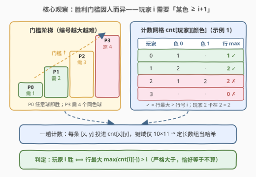
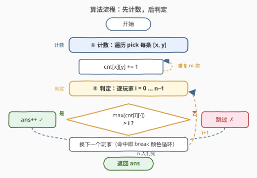
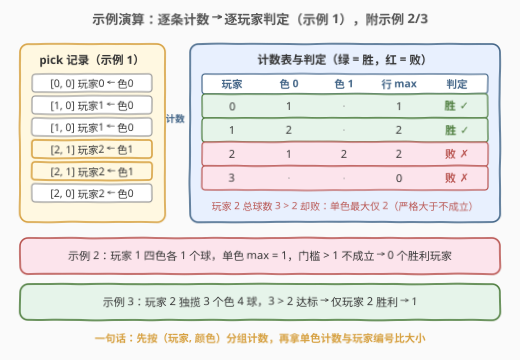

# 求出胜利玩家的数目

- **题目名称**：求出胜利玩家的数目
- **链接**：[3238. 求出胜利玩家的数目](https://leetcode.cn/problems/find-the-number-of-winning-players/)
- **难度**：简单
- **标签**：数组、哈希表、计数

## 1. 题目概述

给你一个整数 `n`，表示游戏中的玩家数目。同时给你一个二维整数数组 `pick`，其中 `pick[i] = [x_i, y_i]` 表示玩家 `x_i` 获得了一个颜色为 `y_i` 的球。

如果玩家 `i` 获得的球中**任何一种颜色**的球数目**严格大于** `i` 个，那么玩家 `i` 是胜利玩家。换句话说：

- 如果玩家 0 获得了**任何**的球，那么玩家 0 是胜利玩家；
- 如果玩家 1 获得了至少 2 个**相同颜色**的球，那么玩家 1 是胜利玩家；
- ……
- 如果玩家 `i` 获得了至少 `i + 1` 个**相同颜色**的球，那么玩家 `i` 是胜利玩家。

请你返回游戏中**胜利玩家**的数目。注意，可能有多个玩家是胜利玩家。

**示例 1**：

```text
输入：n = 4, pick = [[0,0],[1,0],[1,0],[2,1],[2,1],[2,0]]
输出：2
解释：玩家 0 和玩家 1 是胜利玩家，玩家 2 和玩家 3 不是胜利玩家。
```

**示例 2**：

```text
输入：n = 5, pick = [[1,1],[1,2],[1,3],[1,4]]
输出：0
解释：没有胜利玩家。
```

**示例 3**：

```text
输入：n = 5, pick = [[1,1],[2,4],[2,4],[2,4]]
输出：1
解释：玩家 2 是胜利玩家，因为玩家 2 获得了 3 个颜色为 4 的球。
```

**约束**：$2 \le n \le 10$，$1 \le pick.length \le 100$，$pick[i].length = 2$，$0 \le x_i \le n-1$，$0 \le y_i \le 10$。

> 💡 **审题关键**：① 门槛**因人而异**——玩家 `i` 的及格线是「某色 $\ge i+1$ 个」，编号本身就是难度，玩家 0 拿到任意球即胜，编号越大越难；② 比较是**严格大于**，恰好 `i` 个同色球不算赢（示例 1 的玩家 2 正是栽在这里）；③ 判定对象是**单色数量**而非总球数——玩家 2 拿了 3 个球、总数超过门槛，却因最多单色只有 2 个而落败；④ 记录顺序无关紧要，本质是一道纯计数题。

---

## 2. 解题思路

### 2.1 暴力思路：逐玩家反复扫描 pick

最直接的做法：对每个玩家 `i`，把 `pick` 从头到尾扫一遍，统计他每种颜色的球数，再看是否存在某个颜色计数 $> i$。全程要扫 $n$ 遍 `pick`，复杂度 $O(n \cdot m)$（$m$ 为 `pick` 长度）。

在 $n \le 10$、$m \le 100$ 的约束下这样也能过，但同一个数组被反复遍历显然浪费——`pick` 中每条记录 $(x, y)$ 对**且仅对**玩家 `x` 有意义，一次遍历就能把所有人的账本同时记好。

### 2.2 核心观察：门槛因人而异的二维计数



**观察 1（判定只依赖「玩家 × 颜色」的二元计数）**：胜利条件里没有任何顺序、位置信息，只关心「玩家 $x$ 一共拿了几个颜色 $y$ 的球」。把每条记录 $(x, y)$ 投进一张 `cnt[玩家][颜色]` 的二维表，问题就变成查表。

**观察 2（键域小到可以直接开数组）**：$n \le 10$ 且 $0 \le y_i \le 10$，键域大小只有 $10 \times 11 = 110$，连哈希表都不必用，一个定长二维数组就是最完美的「哈希表」——无哈希开销、缓存友好、还自带零初始化。

**观察 3（判定即「行最大值 vs 行号」）**：「任何一种颜色的数目严格大于 $i$」等价于**第 $i$ 行的最大值 $> i$**。每个玩家扫一遍自己那行取最大值即可；又因为门槛随 $i$ 线性升高，玩家 0 行内只要有非零格就赢，而编号最大的玩家需要凑齐 $n$ 个同色球才赢。

> ⚠️ **别掉进「总球数」陷阱**：示例 1 中玩家 2 总共拿了 3 个球（$3 > 2$），却不是胜利玩家——因为 $3 = 1 + 2$ 分散在两种颜色上，单色最多 2 个，不满足 $2 > 2$。计数维度是**（玩家, 颜色）二元组**，先按颜色分组再比门槛。

### 2.3 算法流程图



| 步骤 | 操作 | 作用 |
|------|------|------|
| ① 计数 | 遍历 `pick`，执行 `cnt[x][y] += 1` | 一趟把所有玩家的「颜色账本」记全 |
| ② 判定 | 对每个玩家 `i`，查其行内是否存在 `cnt[i][y] > i` | 行最大值超过行号即胜利玩家 |
| ③ 汇总 | 统计胜利玩家个数并返回 | 命中一个颜色即可 `break`，无需继续扫行 |

### 2.4 示例演算



以示例 1（`n = 4`）为例，逐条计数后得到：

| 玩家 | 各色球数 | 行最大 | 门槛（严格大于 $i$） | 判定 |
|------|----------|--------|----------|------|
| 0 | 色 0 × 1 | 1 | $> 0$ | ✅ 胜（任意球即胜） |
| 1 | 色 0 × 2 | 2 | $> 1$ | ✅ 胜 |
| 2 | 色 0 × 1、色 1 × 2 | 2 | $> 2$ | ❌ 败（单色恰好 2 个，不严格大于） |
| 3 | 无球 | 0 | $> 3$ | ❌ 败 |

答案为 **2**。再看另外两个示例：

- **示例 2**：玩家 1 拿到 4 个球但颜色互不相同，单色计数最多 1，而门槛是 $> 1$——四色各一正好卡死在门槛上，无人胜利，答案 **0**；
- **示例 3**：玩家 2 独揽 3 个颜色 4 的球，$3 > 2$ 达标；玩家 1 只有 1 个球，$1 > 1$ 不成立，答案 **1**。

三个示例共同印证：**先按（玩家, 颜色）分组计数，再拿单色计数与玩家编号比大小**，总球数从头到尾都不参与判定。

---

## 3. 参考代码

### C++（定长二维数组版）

```cpp
class Solution {
public:
    int winningPlayerCount(int n, vector<vector<int>>& pick) {
        int cnt[10][11] = {};                 // 键域 10×11，数组当哈希
        for (auto& p : pick) cnt[p[0]][p[1]]++;
        int ans = 0;
        for (int i = 0; i < n; i++)
            for (int y = 0; y <= 10; y++)
                if (cnt[i][y] > i) { ans++; break; }   // 命中一个颜色即可
        return ans;
    }
};
```

### Python（二维列表版）

```python
class Solution:
    def winningPlayerCount(self, n: int, pick: List[List[int]]) -> int:
        cnt = [[0] * 11 for _ in range(n)]
        for x, y in pick:
            cnt[x][y] += 1
        return sum(any(c > i for c in cnt[i]) for i in range(n))
```

### Python（Counter 一行判定版）

```python
class Solution:
    def winningPlayerCount(self, n: int, pick: List[List[int]]) -> int:
        cnt = Counter(map(tuple, pick))          # (玩家, 颜色) 二元组计数
        return len({x for (x, y), c in cnt.items() if c > x})
```

> 💡 一行版把 `pick` 中的 `[x, y]` 直接转成**二元组键**计数，随后用集合推导收集所有达标玩家——集合天然去重，即使某玩家多种颜色都超标也只记一次；`n` 参数只在玩家全程无球时才用不上，无人达标的空集长度即为 0。

---

## 4. 复杂度分析

| 维度 | 复杂度 | 说明 |
|------|--------|------|
| **时间** | $O(m + n \cdot C)$ | 计数一趟 $O(m)$（$m$ 为 `pick` 长度），判定扫全表 $O(n \times C)$，其中颜色数 $C = 11$ |
| **空间** | $O(n \cdot C)$ | 定长计数表 $10 \times 11 = 110$ 格，视为常数 |

在 $m \le 100$、$n \le 10$ 的约束下，总运算量不过几百次，属于「读题比写码慢」的签到题。

---

## 5. 扩展：值域放大与在线询问

- **颜色值域放大**：若把 $0 \le y_i \le 10$ 放开成 $0 \le y_i \le 10^9$，键域不可枚举，定长数组失效——改为哈希表（`unordered_map` / `dict`）以 $(x, y)$ 二元组为键，复杂度仍是 $O(m)$。这个「值域小用数组、值域大用哈希」的取舍正是 [3160. 所有球里面不同颜色的数目](https://leetcode.cn/problems/find-the-number-of-distinct-colors-among-the-balls/) 的考点，两题同用「球-颜色」背景，可以对照练习。
- **流式在线版**：如果 `pick` 是一条条流式到达、且随时要回答「当前有几个胜利玩家」，注意到**计数只增不减，门槛一旦达到永不消失**——维护每玩家当前单色最大计数与「是否已达标」标记，新球到达时先 `++` 再判一次门槛，均摊 $O(1)$ 更新、$O(1)$ 应答。
- **语义变体**：把「严格大于 $i$」改成「至少 $i$ 个」后玩家 0 只需……零个球就胜利（$0 \ge 0$），全体玩家无条件获胜，答案恒为 $n$——条件里的一个词再次决定整题的输出空间（与 [3232. 判断是否可以赢得数字游戏](https://leetcode.cn/problems/find-if-digit-game-can-be-won/) 的「严格大于」陷阱如出一辙）。

---

## 6. 面试要点

1. **为什么玩家 0 拿到任意球就赢？**

   玩家 `i` 的门槛是「某色计数严格大于 $i$」；$i = 0$ 时任何非零计数都满足 $> 0$，所以一条记录就能送他获胜。

2. **总球数多的玩家为什么可能反而输？**

   判定维度是（玩家, 颜色）二元组：示例 1 的玩家 2 总球数 3 超过门槛 2，但分散成色 0 一个、色 1 两个，单色最大 2 不严格大于 2。**先按颜色分组，再比门槛**，总球数从不参与判定。

3. **为什么用定长数组而不用哈希表？**

   $n \le 10$、$y \le 10$，键域仅 110 个格子，完全可以被数组枚举覆盖。值域小到可枚举时，「数组当哈希」无哈希开销且缓存友好，是标准优化；值域一大（如 $10^9$）才退回哈希表。

4. **能否一趟遍历里边计数边判定？**

   可以。计数只增不减，玩家 `x` 的门槛一旦被某个颜色触发就永久保持；所以计数时顺手检查 `cnt[x][y] > x`，达标即标记，已标记的玩家后续直接跳过，结果与两趟版完全一致。

5. **这道题在面试里的核心考点是什么？**

   把「个性化门槛的判定」翻译成**二维计数 + 行最大值比较**的建模能力，外加两个细节意识：严格大于的边界（恰好等于不算）、以及根据值域大小在数组与哈希表之间做工程取舍。

---

## 7. 同类练习题

- [3160. 所有球里面不同颜色的数目](https://leetcode.cn/problems/find-the-number-of-distinct-colors-among-the-balls/)：同款「球-颜色」背景的哈希计数，从「每玩家每色计数」换成「全局颜色计数 + 移除标记」，体会值域放大后必须用哈希表
- [1512. 好数对的数目](https://leetcode.cn/problems/number-of-good-pairs/)：哈希计数后倒推组合数 $\binom{c}{2}$，Counter 一行求和的入门题
- [1207. 独一无二的出现次数](https://leetcode.cn/problems/unique-number-of-occurrences/)：两层计数——先数元素频次，再数频次是否互异
- [383. 赎金信](https://leetcode.cn/problems/ransom-note/)：频次差判定，计数相减出现负数即不可行
- [347. 前 K 个高频元素](https://leetcode.cn/problems/top-k-frequent-elements/)：计数之后的 Top-K 筛选（堆 / 桶排），计数题的高频进阶出口
