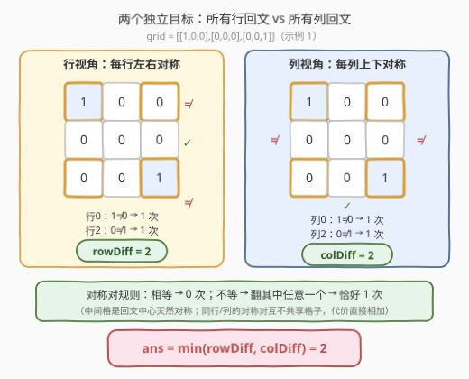
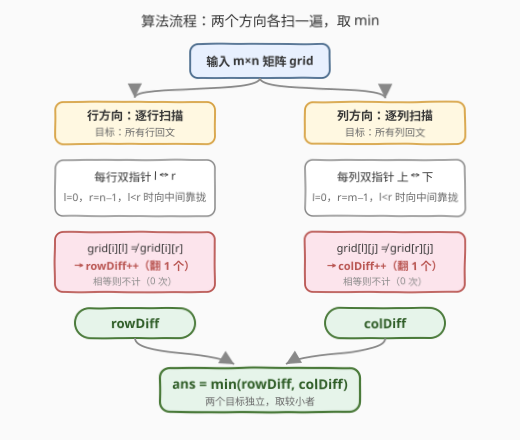

# LeetCode 最少翻转次数使二进制矩阵回文 I 题解

## 1. 题目概述

- **标题 / 题号**：最少翻转次数使二进制矩阵回文 I（#3239，medium）
- **链接**：https://leetcode.cn/problems/minimum-number-of-flips-to-make-binary-grid-palindromic-i/
- **难度**：中等
- **标签**：数组、双指针、矩阵

**题意**：给你一个 $m \times n$ 的二进制矩阵 `grid`。

如果矩阵中一行或者一列从前向后与从后向前读是一样的，那么我们称这一行或者这一列是**回文**的。

你可以将 `grid` 中任意格子的值**翻转**，也就是将格子里的值从 `0` 变成 `1`，或者从 `1` 变成 `0`。

请你返回**最少**翻转次数，使得矩阵**要么**所有行是**回文的**，要么所有列是**回文的**。

**示例 1**：

```text
输入：grid = [[1,0,0],[0,0,0],[0,0,1]]
输出：2
解释：翻转 (0,0) 与 (2,2) 两格（1→0），三行都变成 [0,0,0]，所有行回文。
```

**示例 2**：

```text
输入：grid = [[0,1],[0,1],[0,0]]
输出：1
解释：翻转 (2,1)（0→1），列 0 = [0,0,0]，列 1 = [1,1,1]，所有列回文。
```

**示例 3**：

```text
输入：grid = [[1],[0]]
输出：0
解释：每行长度为 1，单格行天然回文，无需任何翻转。
```

**约束**：

- $m = grid.length$，$n = grid[i].length$
- $1 \le m \times n \le 2 \times 10^5$
- $grid[i][j] \in \{0, 1\}$

> 💡 读题关键：① 目标是「**要么**全行回文 **要么** 全列回文」的**二选一**——两种方案各自求最小代价，再取较小者；②「回文」只约束一行/一列**自身**的对称位置相等，与邻行邻列毫无关系，这让「逐对独立修复」成为可能。

## 2. 解题思路

### 2.1 暴力思路

每个格子翻或不翻，共 $2^{mn}$ 种组合——$mn$ 最大 $2 \times 10^5$，直接枚举不可行。

退一步：判断「所有行回文」只需逐行检查对称位置 $grid[i][l]$ 与 $grid[i][n-1-l]$ 是否相等。一对不相等的格子，直觉上「翻转其中任意一个」就能修复。真正要回答的问题是：**能否证明逐对独立修复就是全局最优**？会不会存在「连环翻转」用更少的次数同时摆平多对？2.2 用**代价下界**回答：不会。

### 2.2 核心观察：对称对独立计数，两方向取 min



**观察 1（回文 ⇔ 对称对全部相等）**：一行回文，当且仅当对所有 $l < n/2$ 有

$$grid[i][l] = grid[i][n-1-l]$$

列同理。于是每行拆成 $\lfloor n/2 \rfloor$ 个**对称对**；奇数长度时中间格是天然的回文中心，自己等于自己，永远不用翻。

**观察 2（每对代价恰好 0 或 1，对与对独立）**：

- 一对相等：代价 $0$；
- 一对不等：翻转其中**任意一个**格子即相等，代价 $1$。

关键在**下界论证**：一对不等的格子，若两个都不翻，它们永远不等——所以每对不等**至少**要动其中 1 个格子。又因为同一行内的对称对**互不共享格子**（每个格子只属于一个对称对），各对的下界可以直接相加。逐对修复恰好同时取到每对的下界，因此行方向的最小代价精确等于

$$rowDiff = \sum_{i}\sum_{l < n/2} \big[\, grid[i][l] \ne grid[i][n-1-l] \,\big]$$

**观察 3（两个目标独立，取 min）**：把矩阵换个视角按列做同样的统计，得 $colDiff$。任何翻转方案最终得到**一个**矩阵，它若合法必属「全行回文集」或「全列回文集」之一，而到这两个集合的最小距离已由观察 2 精确给出，故

$$ans = \min(rowDiff,\ colDiff)$$

> ⚠️ 不必纠结「一次翻转同时影响行、列两个对称对」——那只是说明两个目标集合有交集（一个矩阵可以既全行回文又全列回文），并不影响 $\min$ 的正确性：混合方案产出的终态矩阵仍然要落在某一个集合里，其代价不会低于该集合的最小距离。

### 2.3 算法流程图



两次独立扫描：第一遍按行双指针统计 $rowDiff$，第二遍按列双指针统计 $colDiff$（行列视角互换，同一模板复用），返回较小者。

### 2.4 示例演算

![示例演算：grid = [[0,1],[0,1],[0,0]]](../images/p3239_walkthrough.svg)

以示例 2 的 `grid = [[0,1],[0,1],[0,0]]`（$m=3, n=2$）为例：

- **行视角**（每行仅 1 个对称对，首格 vs 尾格）：
  - 行 0：$0 \ne 1$ → 1 次；行 1：$0 \ne 1$ → 1 次；行 2：$0 = 0$ → 0 次；
  - $rowDiff = 1+1+0 = 2$。
- **列视角**（每列仅 1 个对称对，首行 vs 末行）：
  - 列 0：$0 = 0$ → 0 次；列 1：$1 \ne 0$ → 1 次；
  - $colDiff = 0+1 = 1$。
- $ans = \min(2, 1) = 1$：翻转 $(2,1)$，列 1 变为 $[1,1,1]$，所有列回文。

对照示例 1：四个角两两不等，$rowDiff = colDiff = 2$，$\min = 2$；示例 3 单列矩阵每行长度 1，$rowDiff = 0$，白送。

## 3. 参考代码

### C++（两遍扫描 + 双指针）

```cpp
class Solution {
  public:
    int minFlips(vector<vector<int>>& grid) {
        int m = grid.size(), n = grid[0].size();
        int rowDiff = 0, colDiff = 0;
        for (int i = 0; i < m; i++)                      // 行方向：所有行回文
            for (int l = 0, r = n - 1; l < r; l++, r--)
                rowDiff += grid[i][l] != grid[i][r];
        for (int j = 0; j < n; j++)                      // 列方向：所有列回文
            for (int l = 0, r = m - 1; l < r; l++, r--)
                colDiff += grid[l][j] != grid[r][j];
        return min(rowDiff, colDiff);
    }
};
```

### Python（负索引表达镜像位置）

```python
class Solution:
    def minFlips(self, grid: List[List[int]]) -> int:
        m, n = len(grid), len(grid[0])
        row_diff = sum(row[j] != row[-1 - j]          # row[j] vs row[n-1-j]
                       for row in grid for j in range(n // 2))
        col_diff = sum(grid[i][j] != grid[-1 - i][j]  # grid[i][j] vs grid[m-1-i][j]
                       for j in range(n) for i in range(m // 2))
        return min(row_diff, col_diff)
```

> 💡 Python 的负索引 `row[-1-j]` 即 `row[n-1-j]`，天然表达「镜像位置」；`bool` 直接参与 `sum` 累加。C++ 的内层双指针条件 `l < r` 对奇偶长度通吃——`l == r`（正中间格）自动跳过，无需特判。

## 4. 复杂度分析

| 维度 | 复杂度 | 说明 |
|------|--------|------|
| 时间复杂度 | $O(m \times n)$ | 行、列各扫一遍，每个对称对 $O(1)$ 判定 |
| 空间复杂度 | $O(1)$ | 仅两个计数器，不转置、不复制矩阵 |
| 暴力对照 | $O(2^{mn})$ | 枚举翻转组合，$mn \le 2 \times 10^5$ 下完全不可行 |

## 5. 扩展：3240 回文 II——行列同时回文 + 1 的总数是 4 的倍数

[3240. 最少翻转次数使二进制矩阵回文 II](https://leetcode.cn/problems/minimum-number-of-flips-to-make-binary-grid-palindromic-ii/) 把目标升级为「行、列**同时**回文，且 **1 的总个数能被 4 整除**」。此时每个格子 $(i,j)$ 与三个镜像位置构成**四元对称组**：

$$(i,j),\quad (i,\,n-1-j),\quad (m-1-i,\,j),\quad (m-1-i,\,n-1-j)$$

组内 4 格必须全相等。设组内 1 的个数为 $c$：$c=0/4$ 代价 $0$（已全相等）；$c=1/3$ 代价 $1$（少数服从多数）；$c=2$ 代价 $2$（全变 0 或全变 1 都要翻 2 个）。妙的是四元组无论终态全 0 还是全 1，对 1 总数的贡献都是 $0$ 或 $4$（$\equiv 0 \pmod 4$）——**余数压力全部落在中心条带**：奇数行数的中间行、奇数列数的中间列只沿一个轴对称，拆成**二元组**（恰 1 个 1 时花 1 次可终态 00 或 11，自由选择用以凑总量；恰 2 个 1 时保持 11 贡献 $2$ 或花 2 次变 00）；正中心单格必须为 0（可证 11 对数须为偶数，此时中心格贡献只能取 0）。

```python
class Solution:
    def minFlips(self, grid: List[List[int]]) -> int:
        m, n = len(grid), len(grid[0])
        ans = pair11 = flex = 0
        for i in range(m // 2):                    # 四元对称组
            for j in range(n // 2):
                c = grid[i][j] + grid[i][-1-j] + grid[-1-i][j] + grid[-1-i][-1-j]
                ans += 2 if c == 2 else c & 1      # c=2 → 2 次；c=1,3 → 1 次
        if m % 2:                                  # 中间行拆二元组
            for j in range(n // 2):
                c = grid[m // 2][j] + grid[m // 2][-1-j]
                if c == 1: ans += 1; flex += 1     # 1 次，终态 00/11 任选
                elif c == 2: pair11 += 1           # 暂保持 11（贡献 2 个 1）
        if n % 2:                                  # 中间列拆二元组
            for i in range(m // 2):
                c = grid[i][n // 2] + grid[-1-i][n // 2]
                if c == 1: ans += 1; flex += 1
                elif c == 2: pair11 += 1
        if pair11 % 2 and flex == 0:               # 11 对数为奇且无可调配 → 多花 2 次
            ans += 2
        if m % 2 and n % 2 and grid[m // 2][n // 2]:   # 正中心格必须为 0
            ans += 1
        return ans
```

对比可见：I 是 II 的「单方向、无整除约束」的温和版——先把对称对的下界论证想清楚，II 的分类讨论只是它的四元组化。

## 6. 面试要点

1. **为什么每个不等的对称对恰好翻 1 次就够，且是最优？**

   - 一对不等的格子，翻转其中任意一个即相等；而两个都不动则永远不等，故每对代价**下界**为 1。同一行/列的对称对互不共享格子，下界可加——逐对翻 1 个恰好同时取到所有对的下界，即全局最优。

2. **「要么全行、要么全列」为什么直接 min 两个方向的代价？**

   - 任何合法终态矩阵必落在「全行回文集」或「全列回文集」之一，到两集合的最小距离分别是 $rowDiff$、$colDiff$（均由下界论证给出精确值），到并集的距离即两者的 min。翻转一个格子同时影响行、列两个对称对只说明两集合有交集，不影响该论证。

3. **奇数长度的行/列怎么处理？**

   - 中间格是回文中心，自身恒对称，无需翻转；双指针 `l < r`（或 Python `range(n // 2)` + 负索引）天然跳过，零特判。

4. **$mn$ 大到 $2 \times 10^5$ 时要注意什么？**

   - 只需 $O(mn)$ 时间、$O(1)$ 空间；切忌真的转置或复制矩阵（不必要的 $O(mn)$ 空间）。列方向按 `grid[l][j]` 直接访问缓存不友好，但总量级下毫无压力。

5. **和 832 翻转图像的双指针有何异同？**

   - 同：都在行内用 $l/r$ 双指针对称位置操作；异：832 要原地交换并取反（写操作），本题只统计不等对数（只读），双指针退化为「镜像位置遍历」。

## 同类练习题

| # | 题目 | 与本题的关联 |
|---|------|-------------|
| 3240 | [最少翻转次数使二进制矩阵回文 II](https://leetcode.cn/problems/minimum-number-of-flips-to-make-binary-grid-palindromic-ii/) | 行列**同时**回文 + 1 的总数是 4 的倍数，四元对称组分类讨论（见第 5 节） |
| 832 | [翻转图像](https://leetcode.cn/problems/flipping-an-image/) | 行内水平翻转 + 反转，同一套 $l/r$ 双指针原地操作 |
| 867 | [转置矩阵](https://leetcode.cn/problems/transpose-matrix/) | 行列视角互换的基本功，本题列方向扫描即「按转置视角遍历」 |
| 1252 | [奇数值单元格的数目](https://leetcode.cn/problems/cells-with-odd-values-in-a-matrix/) | 矩阵行/列两个视角各自独立计数（行加 + 列加），同款「两个方向分别统计再合并」 |
