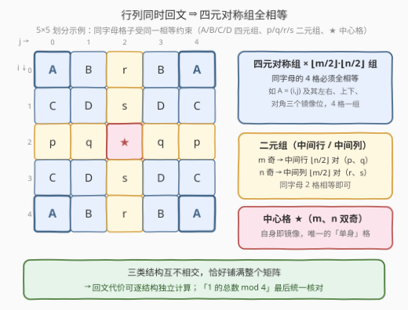
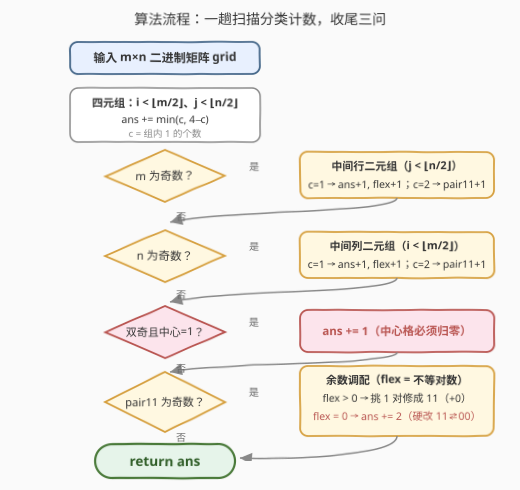
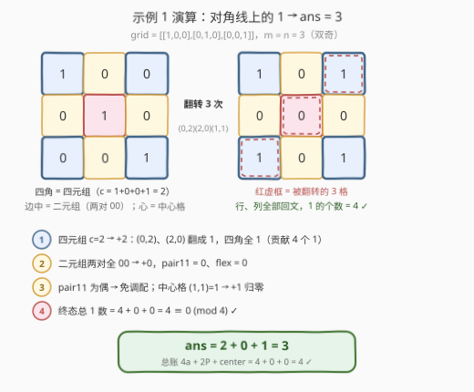

# 最少翻转次数使二进制矩阵回文 II

- **题目名称**：最少翻转次数使二进制矩阵回文 II
- **链接**：[3240. 最少翻转次数使二进制矩阵回文 II](https://leetcode.cn/problems/minimum-number-of-flips-to-make-binary-grid-palindromic-ii/)
- **难度**：中等
- **标签**：数组、双指针、矩阵

## 1. 题目概述

给你一个 $m \times n$ 的二进制矩阵 `grid`。

如果矩阵中一行或者一列从前向后与从后向前读是一样的，那么我们称这一行或者这一列是**回文**的。

你可以将 `grid` 中任意格子的值**翻转**，也就是将格子里的值从 `0` 变成 `1`，或者从 `1` 变成 `0`。

请你返回**最少**翻转次数，使得矩阵中**所有**行和列都是**回文的**，且矩阵中 `1` 的数目可以被 `4` **整除**。

**示例 1**：

```text
输入：grid = [[1,0,0],[0,1,0],[0,0,1]]
输出：3
解释：翻转 (0,2)、(2,0)（0→1）与 (1,1)（1→0），得 [[1,0,1],[0,0,0],[1,0,1]]，
      所有行、列均回文，且恰有 4 个 1，可被 4 整除。
```

**示例 2**：

```text
输入：grid = [[0,1],[0,1],[0,0]]
输出：2
解释：翻转 (0,1)、(1,1)（1→0），矩阵全 0，行、列均回文，1 的个数为 0。
```

**示例 3**：

```text
输入：grid = [[1],[1]]
输出：2
解释：矩阵本身行列已回文，但 1 的个数为 2 不能被 4 整除——把两个 1 都翻成 0。
```

**约束条件**：

- $m = grid.length$，$n = grid[i].length$
- $1 \le m \times n \le 2 \times 10^5$
- $grid[i][j] \in \{0, 1\}$

> 💡 读题关键：① 相比 [3239. 回文 I](https://leetcode.cn/problems/minimum-number-of-flips-to-make-binary-grid-palindromic-i/) 有两处升级——行、列**同时**回文（不再是二选一），外加「1 的总数 $\equiv 0 \pmod 4$」的**全局**约束；② 行回文管左右镜像、列回文管上下镜像，两个约束叠加会把格子绑定成**四元对称组**；③ 整除约束无法逐组局部满足，需要「先按回文代价逐结构记账，再统一调配余数」。

---

## 2. 解题思路

### 2.1 暴力思路

每个格子翻或不翻共 $2^{mn}$ 种组合，$mn \le 2 \times 10^5$ 直接爆炸。退一步只想回文约束：直觉上「哪个对称组不相等就翻其中一个」应该最省，但**整除约束是全局的**——局部最省的终态拼起来，1 的总数未必是 4 的倍数（示例 3 就是现成的反例：一字不翻行列全回文，总数却是 2）。于是问题拆成两问：

1. 只看回文约束，各对称结构的**最小代价**是多少？能否逐结构独立最优？
2. 在代价不增加（或几乎不增加）的前提下，终态还剩多少**自由度**可以拿来凑整除？

### 2.2 核心观察：四元对称组 + mod 4 记账



**观察 1（行列双回文 ⇔ 四元对称组全相等）**：行回文要求 $grid[i][j] = grid[i][n-1-j]$，列回文要求 $grid[i][j] = grid[m-1-i][j]$。两条约束叠加，$(i,j)$ 必须与三个镜像位置全部相等：

$$(i,j),\quad (i,\,n-1-j),\quad (m-1-i,\,j),\quad (m-1-i,\,n-1-j)$$

于是整个矩阵被划分为**互不相交**的三类结构：$\lfloor m/2 \rfloor \times \lfloor n/2 \rfloor$ 个**四元对称组**；中间行（$m$ 奇）与中间列（$n$ 奇）上的**二元组**——它们只沿单轴对称；以及 $m, n$ 双奇时的**中心格**。

**观察 2（四元组不背余数债）**：设组内 1 的个数为 $c$。回文要求 4 格全等，终态只能**全 0** 或**全 1**：

| $c$ | 0 | 1 | 2 | 3 | 4 |
|------|---|---|---|---|---|
| 代价 $\min(c, 4-c)$ | 0 | 1 | 2 | 1 | 0 |
| 终态 1 的贡献 | 0 或 4 | 0 或 4 | 0 或 4 | 0 或 4 | 0 或 4 |

妙就妙在最后一行：无论终态选全 0 还是全 1，贡献都是 $0$ 或 $4$——**恒 $\equiv 0 \pmod 4$**。所以四元组只管把代价降到 $\min(c, 4-c)$，永远不会破坏整除性；且组与组不共享格子，代价下界直接相加。


**观察 3（二元组是唯一的余数调节器）**：中间行格子 $(mid, j)$ 只受左右镜像约束，与中间行外的格子无关，拆成 $\lfloor n/2 \rfloor$ 个二元组；中间列同理。每个二元组 $(a, b)$：

- $a = b$：代价 $0$；$00$ 贡献 $0$ 个 1，$11$ 贡献 $2$ 个 1；
- $a \ne b$：翻其中任意 1 个即相等，代价 $1$，且终态 $00$ / $11$ **任选**——这就是整道题唯一的**弹性（flex）**。

设终态 11 对数为 $P$、全 1 的四元组有 $a$ 组，则总 1 数 $= 4a + 2P + center$，整除条件等价于：**$P$ 为偶数，且 $center = 0$**。

**观察 4（中心格必须归零）**：中心格自己等于自己，天然满足回文，贡献 $0$ 或 $1$。其余结构的贡献全为**偶数**——若中心格为 1，总数必为奇数，绝无可能被 4 整除，只能翻成 0（$+1$ 次）。

**调配规则（收尾三问）**：设初始 11 对数为 $pair11$、不等对数为 $flex$：

- $pair11$ 为偶：所有不等对修成 $00$，$P = pair11$ 已是偶数，代价就是各结构下界之和；
- $pair11$ 为奇且 $flex > 0$：把**某一个**不等对修成 $11$（反正都要修 1 次，翻 0 还是翻 1 不加价），$P = pair11 + 1$ 为偶——**白嫖**；
- $pair11$ 为奇且 $flex = 0$：终态 $P$ 必须为偶，与初始差一个配对；所有二元组现在都相等，不花代价无法改变 $P$ 的奇偶，至少要把一对 $11 \to 00$ 或 $00 \to 11$（各翻 2 格），且 2 次必然足够——**$+2$**。

> ⚠️ 下界可加性：三类结构互不相交且覆盖全矩阵，单看回文约束时各结构的代价下界互不影响、可直接相加；唯一的全局耦合（整除）只作用于二元组的终态选择与中心格，其代价影响已被「$+0$ / $+2$ / $+1$」三个收尾分支精确计入——这正是「先局部最优、再全局微调」的正确性来源。

### 2.3 算法流程图



一趟线性扫描完成所有计数：四元组区域枚举 $\lfloor m/2 \rfloor \times \lfloor n/2 \rfloor$ 组，中间行/列各扫一半，最后三个判定收尾（中心格、余数调配）。

### 2.4 示例演算



以示例 1 的 `grid = [[1,0,0],[0,1,0],[0,0,1]]`（$m = n = 3$）为例：

- **四元组**（仅 1 组，四角）：$c = 1 + 0 + 0 + 1 = 2$ → 代价 $2$，把 $(0,2)$、$(2,0)$ 翻成 1，四角全 1，贡献 4 个 1；
- **中间行对** $(1,0),(1,2) = 0,0$、**中间列对** $(0,1),(2,1) = 0,0$ → 代价 $0$，$pair11 = 0$、$flex = 0$；
- $pair11$ 为偶 → 免调配；**中心格** $(1,1) = 1$ → 必须归零，$+1$。

$ans = 2 + 0 + 1 = 3$，终态 `[[1,0,1],[0,0,0],[1,0,1]]`，总 1 数 $= 4$ ✓。

对照示例 2（`[[0,1],[0,1],[0,0]]`，$m=3$ 奇、$n=2$ 偶）：四元组 $c = 0+0+1+0 = 1$ → $+1$；中间行对 $(1,0),(1,1) = 0,1$ 不等 → $+1$ 且 $flex = 1$；无中间列、无中心格；$pair11 = 0$ 为偶，把该对修成 $00$，总 1 数 $= 0$ ✓，$ans = 2$。

示例 3（`[[1],[1]]`，$n=1$ 奇）：无四元组，中间列对 $(0,0),(1,0) = 1,1$ → $pair11 = 1$；$pair11$ 为奇且 $flex = 0$ → $+2$（两格全翻成 0）；$ans = 2$——局部回文代价明明是 0，多出的 2 次全是替整除约束还债。

---

## 3. 参考代码

### C++（结构化计数 + 收尾调配）

```cpp
class Solution {
  public:
    int minFlips(vector<vector<int>>& grid) {
        int m = grid.size(), n = grid[0].size();
        int ans = 0, pair11 = 0, flex = 0;
        for (int i = 0; i < m / 2; i++)                  // ① 四元对称组
            for (int j = 0; j < n / 2; j++) {
                int c = grid[i][j] + grid[i][n - 1 - j]
                      + grid[m - 1 - i][j] + grid[m - 1 - i][n - 1 - j];
                ans += min(c, 4 - c);                    // 全 0 或全 1，取较省的一侧
            }
        if (m % 2)                                       // ② 中间行二元组
            for (int j = 0; j < n / 2; j++) {
                int c = grid[m / 2][j] + grid[m / 2][n - 1 - j];
                if (c == 1) { ans += 1; flex += 1; }     // 修 1 次，终态 00/11 任选
                else if (c == 2) pair11 += 1;            // 免费，贡献 2 个 1
            }
        if (n % 2)                                       // ③ 中间列二元组
            for (int i = 0; i < m / 2; i++) {
                int c = grid[i][n / 2] + grid[m - 1 - i][n / 2];
                if (c == 1) { ans += 1; flex += 1; }
                else if (c == 2) pair11 += 1;
            }
        if (pair11 % 2 && flex == 0) ans += 2;           // ④ 余数差 2 且无可调配
        if (m % 2 && n % 2 && grid[m / 2][n / 2])        // ⑤ 中心格必须为 0
            ans += 1;
        return ans;
    }
};
```

### Python（负索引表达三个镜像位）

```python
class Solution:
    def minFlips(self, grid: List[List[int]]) -> int:
        m, n = len(grid), len(grid[0])
        ans = pair11 = flex = 0
        for i in range(m // 2):                          # ① 四元对称组
            for j in range(n // 2):
                c = (grid[i][j] + grid[i][-1 - j]
                     + grid[-1 - i][j] + grid[-1 - i][-1 - j])
                ans += min(c, 4 - c)                     # 全 0 或全 1，取较省的一侧
        if m % 2:                                        # ② 中间行二元组
            for j in range(n // 2):
                c = grid[m // 2][j] + grid[m // 2][-1 - j]
                if c == 1: ans += 1; flex += 1           # 终态 00/11 任选
                elif c == 2: pair11 += 1                 # 免费贡献 2 个 1
        if n % 2:                                        # ③ 中间列二元组
            for i in range(m // 2):
                c = grid[i][n // 2] + grid[-1 - i][n // 2]
                if c == 1: ans += 1; flex += 1
                elif c == 2: pair11 += 1
        if pair11 % 2 and flex == 0:                     # ④ 余数差 2 且无可调配
            ans += 2
        if m % 2 and n % 2 and grid[m // 2][n // 2]:     # ⑤ 中心格必须为 0
            ans += 1
        return ans
```

> 💡 三个计数器的分工：`ans` 累加确定代价；`pair11` 只关心奇偶——记录已经「免费」贡献 2 个 1 的对数；`flex` 记录终态可选 00/11 的弹性对数。注意 `c == 2` 时**不**加代价——那是余数账本里唯一的「资产」。

---

## 4. 复杂度分析

| 维度 | 复杂度 | 说明 |
|------|--------|------|
| 时间复杂度 | $O(m \times n)$ | 四元组区 + 中间行 + 中间列各扫一遍，每格 $O(1)$ |
| 空间复杂度 | $O(1)$ | 仅三个计数器，原地统计 |
| 暴力对照 | $O(2^{mn})$ | 枚举翻转组合，$mn \le 2 \times 10^5$ 完全不可行 |

---

## 5. 扩展：整除约束的「模数」还能怎么变？

- **改成「1 的总数为偶数」**：只需中心格为 0（其余贡献全为偶数），四元组、二元组全部取局部最优，`flex` 调配整段删掉——mod 2 的债只有中心格能欠。
- **为什么恰是 4？** 四元组终态贡献 0 或 4，天然与模 4 同构；题目把余数弹性集中到中间条带的二元组，正是「局部结构决定全局模数」的漂亮示范。
- **对照 3239 回文 I**：I 把「行列同时」放松为「二选一」且没有整除约束——对称结构是二元组、无全局耦合，逐对修 1 次即最优。II 的全部新意都在「四元组化 + mod 4 记账」这两步。

---

## 6. 面试要点

1. **为什么「行列同时回文」等价于四元对称组全相等？**

   - 行回文绑定左右镜像 $(i,j) \leftrightarrow (i, n-1-j)$，列回文绑定上下镜像 $(i,j) \leftrightarrow (m-1-i, j)$；同时成立时 $(i,j)$ 沿两轴反射得到的 4 个位置传递相等，构成四元组。中间行/列只剩单轴约束退化为二元组，中心格无约束。

2. **四元组为什么完全不用管整除约束？**

   - 回文要求组内 4 格全等，终态只能全 0（贡献 0）或全 1（贡献 4），都 $\equiv 0 \pmod 4$。四元组只管取 $\min(c, 4-c)$ 的局部最优，整除压力 100% 落在中间条带与中心格。

3. **什么时候必须额外 +2？为什么恰好是 2？**

   - $pair11$ 为奇且 $flex = 0$ 时。终态 11 对数 $P$ 必须为偶，而当前所有二元组都已相等，不花代价无法改变 $P$ 的奇偶；把一对 $11 \to 00$ 或 $00 \to 11$ 恰好翻 2 格、改变 $P$ 的奇偶，故下界 2 且可达成。若 $flex > 0$ 则白嫖：不等对反正要修 1 次，修成 11 即可翻转奇偶。

4. **中心格为什么必须为 0？**

   - 除中心格外所有结构的贡献都是偶数（0/4 或 0/2），中心格为 1 会使总数为奇数，不可能被 4 整除——只能花 1 次翻掉，别无选择。

5. **各类结构的代价为什么能直接相加？**

   - 三类结构互不相交且覆盖全矩阵，单看回文约束时每类最小代价互不影响（下界可加）；唯一的全局耦合是整除约束，而它只影响二元组终态选择与中心格，代价影响被精确归入「$+0$ / $+2$ / $+1$」三个收尾分支。

---

## 7. 同类练习题

- [3239. 最少翻转次数使二进制矩阵回文 I](https://leetcode.cn/problems/minimum-number-of-flips-to-make-binary-grid-palindromic-i/)：本题的温和前作——行列二选一、无整除约束，二元对称对逐对修复
- [409. 最长回文串](https://leetcode.cn/problems/longest-palindrome/)：同款「配对贡献 2 + 中心贡献 1」的奇偶记账，中心至多挂一个
- [2131. 连接两字母单词得到的最长回文串](https://leetcode.cn/problems/longest-palindrome-by-concatenating-two-letter-words/)：配对计数凑回文，练习「配对资产 + 剩余量奇偶调配」
- [832. 翻转图像](https://leetcode.cn/problems/flipping-an-image/)：行内镜像位置双指针操作的基本功
