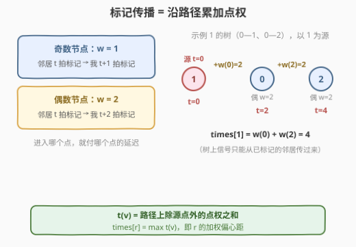
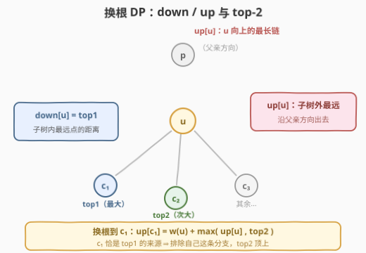
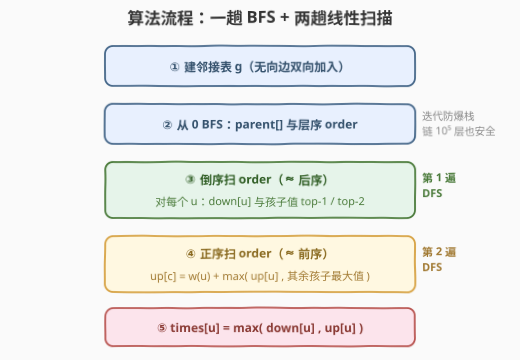
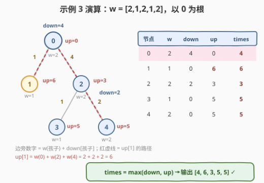

# LeetCode 标记所有节点需要的时间 题解

## 1. 题目概述

- **标题 / 题号**：标记所有节点需要的时间（#3241，hard）
- **链接**：https://leetcode.cn/problems/time-taken-to-mark-all-nodes/
- **难度**：困难
- **标签**：树、深度优先搜索、动态规划、树形 DP

**题意**：给你一棵**无向**树，节点从 $0$ 到 $n-1$ 编号，边数组 `edges` 长度为 $n-1$。一开始**所有**节点都**未标记**。对于节点 $i$：

- 当 $i$ 是**奇数**时，若时刻 $x-1$ 该节点有**至少一个**相邻节点已被标记，则 $i$ 在时刻 $x$ 被标记；
- 当 $i$ 是**偶数**时，若时刻 $x-2$ 该节点有**至少一个**相邻节点已被标记，则 $i$ 在时刻 $x$ 被标记。

返回数组 `times`：若你在时刻 $t=0$ 标记节点 $i$，则时刻 `times[i]` 时全树标记完成。每个 `times[i]` 的答案**相互独立**。

**示例 1**：

```text
输入：edges = [[0,1],[0,2]]
输出：[2,4,3]
解释：t=0 标记 0：节点 1 在 t=1 被标记，节点 2 在 t=2 被标记，故 times[0]=2；
     t=0 标记 1：节点 0 在 t=2、节点 2 在 t=4 被标记，故 times[1]=4；
     t=0 标记 2：节点 0 在 t=2、节点 1 在 t=3 被标记，故 times[2]=3。
```

**示例 2**：

```text
输入：edges = [[0,1]]
输出：[1,2]
```

**示例 3**：

```text
输入：edges = [[2,4],[0,1],[2,3],[0,2]]
输出：[4,6,3,5,5]
```

**约束**：

- $2 \le n \le 10^5$
- `edges.length == n - 1`
- 输入保证 `edges` 表示一棵合法的树

> 💡 读题关键：把奇偶规则读成「**传播延迟**」——标记信号沿边扩散，**进入**奇数点要等 1 拍、**进入**偶数点要等 2 拍。`times[i]` 就是「以 $i$ 为信号源，涟漪铺满全树的时刻」。信号源自身 $t=0$ 即标记，不付延迟。

## 2. 解题思路

### 2.1 暴力思路：每个源点模拟一遍传播

最直白的做法：对每个 $i$ 独立跑一遍传播模拟（BFS / Dijkstra 式松弛），单次 $O(n)$，总计 $O(n^2) = 10^{10}$，$n \le 10^5$ 直接超时。

> ⚠️ 卡点：答案只与「源点到全树各点的**最远**传播距离」有关，即源点的**偏心距**。树上「一次性求出所有点的偏心距」正是**换根 DP**（rerooting）的招牌场景——两遍 DFS 全搞定。

### 2.2 核心观察一：传播时刻 = 点权路径和



给每个点定义**进入代价**：

$$w(v) = \begin{cases} 1 & v \text{ 为奇数} \\ 2 & v \text{ 为偶数} \end{cases}$$

**断言**：固定源 $r$（$t_r = 0$），树上任意点 $v \ne r$ 的标记时刻恰为

$$t_v = \sum_{x \,\in\, \mathrm{path}(r, v),\; x \ne r} w(x)$$

即源到 $v$ 的**点权路径和**（不含源点、含终点）。

理由：把树看成以 $r$ 为根，$v$ 的邻居只有「父方向」与「子方向」两类。树上 $r$ 到 $v$ 子树内任何点都必经 $v$，所以子方向的信号只能从 $v$ 自己传下去，子邻居的标记时刻必然**更晚**；于是 $v$ **最早被标记的邻居必是父节点** $p$，即 $t_v = t_p + w(v)$。自根向下逐层归纳，即得路径和公式。

于是问题坍缩为：

$$\mathrm{times}[r] = \max_{v \ne r} D(r, v)$$

其中 $D(r,v)$ 是点权路径和——也就是 $r$ 的**加权偏心距**。[310. 最小高度树](https://leetcode.cn/problems/minimum-height-trees/) 的无权版正是它的特例。

### 2.3 核心观察二：换根 DP + top-2 子链



以节点 $0$ 为根定向，两遍 DFS 求出所有点的偏心距：

- **down[u]**：$u$ 到**子树内**最远点的加权距离（自底向上合并）：

  $$\mathrm{down}[u] = \max_{c \,\in\, \mathrm{children}(u)} \big(w(c) + \mathrm{down}[c]\big) \quad (\text{叶子为 } 0)$$

- **up[u]**：$u$ 到**子树外**最远点的加权距离（自顶向下回填）。把根从 $u$ 换到孩子 $c$：$c$ 向外的路径必先到 $u$（付出 $w(u)$），之后要么继续向上（$\mathrm{up}[u]$），要么拐进 $u$ 的**其他**孩子的子树：

  $$\mathrm{up}[c] = w(u) + \max\big(\mathrm{up}[u],\ \mathrm{sib}\big)$$

  其中 $\mathrm{sib}$ 是 $u$ 的其他孩子中最大的 $w(s) + \mathrm{down}[s]$（没有其他孩子则取 $0$，表示路径止步于 $u$）。

最终 $\mathrm{times}[u] = \max(\mathrm{down}[u], \mathrm{up}[u])$，且 $\mathrm{up}[\text{root}] = 0$。

**为什么必须维护 top-2**：换根到孩子 $c$ 时，$u$ 的「向下最长链」不能再用 $c$ 自己的分支，得取**其余孩子**的最大值；若 $c$ 恰好就是最大值的来源，就要用**次大值**顶上。所以每个点要同时维护孩子值的**第一大（含来源孩子）与第二大**——并列最大也要保证次大来自另一条分支（更新时用严格大于才替换第一名）。

### 2.4 算法流程图



流程共五步：

1. 建邻接表（无向边双向加入）；
2. 从 $0$ 出发 BFS：求出 `parent[]` 与层序 `order`（迭代写法，防链状树递归爆栈）；
3. **倒序**扫 `order`（$\approx$ 后序）：对每个 $u$ 合并孩子信息，得 `down[u]` 与 top-2（`best1/best2` 及第一名来源）；
4. **正序**扫 `order`（$\approx$ 前序）：由父亲侧信息回填 `up[c] = w(u) + max(up[u], sib)`；
5. `times[u] = max(down[u], up[u])` 输出。

### 2.5 示例演算

以示例 3 演算：`edges = [[2,4],[0,1],[2,3],[0,2]]`，$w = [2,1,2,1,2]$，以 $0$ 为根：



| 节点 | $w$ | down | up | times |
|------|-----|------|----|-------|
| 0 | 2 | 4 | 0 | **4** |
| 1 | 1 | 0 | 6 | **6** |
| 2 | 2 | 2 | 3 | **3** |
| 3 | 1 | 0 | 5 | **5** |
| 4 | 2 | 0 | 5 | **5** |

输出 $[4,6,3,5,5]$ ✓。两个值得盯的细节：

- **节点 1 的 up = 6**：向上路径 $1 \to 0 \to 2 \to 4$，路径点权 $w(0)+w(2)+w(4) = 2+2+2 = 6$；
- **节点 2 的 up = 3**：父亲 $0$ 的最长向下链本是「经 $2$」的 $4$（top-1），但换根到 $2$ 时必须**排除自己**，改取次大值（经 $1$ 的 $1$），$\mathrm{up}[2] = w(0) + \max(\mathrm{up}[0], 1) = 3$——这正是 top-2 存在的意义。

## 3. 参考代码

### C++

```cpp
class Solution {
  public:
    vector<int> timeTaken(vector<vector<int>>& edges) {
        int n = edges.size() + 1;
        vector<vector<int>> g(n);
        for (auto& e : edges) {
            g[e[0]].push_back(e[1]);
            g[e[1]].push_back(e[0]);
        }
        auto w = [](int v) { return v % 2 == 1 ? 1 : 2; };   // 进入奇点延迟 1，偶点延迟 2

        vector<int> order, parent(n, -1);
        order.reserve(n);
        order.push_back(0);
        for (int i = 0; i < n; i++) {          // BFS：父指针 + 层序（迭代防爆栈）
            int u = order[i];
            for (int v : g[u])
                if (v != parent[u]) {
                    parent[v] = u;
                    order.push_back(v);
                }
        }

        vector<int> down(n, 0), up(n, 0), best1(n, 0), best2(n, 0), best1c(n, -1);
        for (int i = n - 1; i >= 0; i--) {     // 倒层序 ≈ 后序：先孩子后父亲
            int u = order[i];
            for (int v : g[u]) {
                if (v == parent[u]) continue;
                int val = w(v) + down[v];
                if (val > best1[u]) { best2[u] = best1[u]; best1[u] = val; best1c[u] = v; }
                else if (val > best2[u]) best2[u] = val;
            }
            down[u] = best1[u];
        }
        for (int i = 0; i < n; i++) {          // 正层序 ≈ 前序：up[u] 已就绪
            int u = order[i];
            for (int v : g[u]) {
                if (v == parent[u]) continue;
                int sib = (best1c[u] == v) ? best2[u] : best1[u];   // 排除 v 自己的分支
                up[v] = w(u) + max(up[u], sib);
            }
        }

        vector<int> ans(n);
        for (int i = 0; i < n; i++) ans[i] = max(down[i], up[i]);
        return ans;
    }
};
```

### Python

```python
class Solution:
    def timeTaken(self, edges: List[List[int]]) -> List[int]:
        n = len(edges) + 1
        g = [[] for _ in range(n)]
        for a, b in edges:
            g[a].append(b)
            g[b].append(a)

        w = lambda v: 1 if v % 2 else 2        # 进入奇点延迟 1，偶点延迟 2

        parent = [-1] * n
        order = [0]
        for u in order:                          # BFS：父指针 + 层序（迭代防爆栈）
            for v in g[u]:
                if v != parent[u]:
                    parent[v] = u
                    order.append(v)

        down = [0] * n
        up = [0] * n
        best1 = [0] * n                          # 孩子值 top-1
        best2 = [0] * n                          # 孩子值 top-2
        best1c = [-1] * n                        # top-1 来自哪个孩子

        for u in reversed(order):                # 倒层序 ≈ 后序：先孩子后父亲
            for v in g[u]:
                if v == parent[u]:
                    continue
                val = w(v) + down[v]
                if val > best1[u]:
                    best2[u], best1[u], best1c[u] = best1[u], val, v
                elif val > best2[u]:
                    best2[u] = val
            down[u] = best1[u]

        for u in order:                          # 正层序 ≈ 前序：up[u] 已就绪
            for v in g[u]:
                if v == parent[u]:
                    continue
                sib = best2[u] if best1c[u] == v else best1[u]   # 排除 v 自己的分支
                up[v] = w(u) + max(up[u], sib)

        return [max(d, p) for d, p in zip(down, up)]
```

> 💡 细节盘点：Python 的 `for u in order` 边遍历边 `append` 是合法技巧（for 循环按索引推进），等价于 BFS 队列；倒序扫层序天然满足「孩子先于父亲」，正序扫天然满足「父亲先于孩子」，两趟就把递归后序/前序拍平成循环。$n \ge 2$ 保证源点必有邻居，`best1/best2` 初值 0 兼容「无其他孩子」（路径止步于父亲）与叶子（down 为 0），全程无需特判。

## 4. 复杂度分析

| 维度 | 复杂度 | 说明 |
|------|--------|------|
| 时间复杂度 | $O(n)$ | 建表 + BFS + 两趟线性扫描，每条边各访问常数次 |
| 空间复杂度 | $O(n)$ | 邻接表 + order/parent + down/up/top-2 共 6 个 $n$ 长数组 |
| 暴力对照 | $O(n^2)$ | 每个源点独立模拟一遍传播，$n = 10^5$ 时超时 |

## 5. 扩展：换根 DP 家族与推广

- **换根 DP 三部曲**：[310. 最小高度树](https://leetcode.cn/problems/minimum-height-trees/)（所有根的树高 = 无权偏心距）、[834. 树中距离之和](https://leetcode.cn/problems/sum-of-distances-in-tree/)（所有根的距离和）、本题（所有源的**加权**偏心距）。骨架统一：第一遍后序算「子树内」，第二遍前序用「父亲侧」信息回填。
- **权重推广**：$w(v)$ 为任意正整数时算法**原样成立**——top-2 换根不依赖权重取值；$w \equiv 1$ 时本题退化为「输出全部偏心距」的无权版。
- **树上改一般图**：传播仍满足 $t_v = \min_{u \sim v} (t_u + w(v))$，即**点权最短路**（把点权折叠到入边上就是标准 Dijkstra）。但一般图没有「父方向唯一」的结构，换根失效，$n$ 个源点只能各自跑一遍。

## 6. 面试要点

1. **为什么 $v$ 的标记时刻恰为「父时刻 + $w(v)$」，而不是从孩子方向先来？**

   - 以源 $r$ 为根，$r$ 到 $v$ 子树内任何点的路径必经 $v$，子方向的信号只能由 $v$ 传出，故子邻居的标记时刻严格更晚；$v$ 最早被标记的邻居必是父节点。自根向下归纳得 $t_v$ = 路径点权和（不含源）。

2. **为什么必须维护 top-2，只存最大值不够吗？**

   - 换根到孩子 $c$ 时要取「其余孩子的最大值」，若 $c$ 恰是最大值来源就必须用次大值顶上。并列最大时也要保证次大来自**另一条分支**——更新时用「严格大于」替换第一名，并列值落入次大，天然正确。

3. **up[c] = w(u) + max(up[u], sib) 里各项对应什么路径？**

   - $c$ 向子树外走必先到 $u$（付 $w(u)$）；随后要么沿父方向继续向上（$\mathrm{up}[u]$），要么拐进 $u$ 其他孩子的子树（sib）；没有其他孩子时 sib 取 0，对应路径止步于 $u$。三种走向取最远。

4. **为什么用 BFS 序迭代，而不写递归 DFS？**

   - $n \le 10^5$ 且树可退化为链，递归深度 $10^5$：Python 默认上限 1000 直接 `RecursionError`，C++ 深递归也可能爆栈。BFS 层序的**倒序**扫描等价后序、**正序**扫描等价前序，两趟循环安全完成两次 DFS。

5. **times[r] = max(down[r], up[r]) 为什么是对的？**

   - 根的子树即全树：$\mathrm{down}[\text{root}]$ 覆盖其余所有点，$\mathrm{up}[\text{root}] = 0$；非根点的最远点要么在子树内（down）、要么在子树外（up），两方向取较大即偏心距。

## 同类练习题

| # | 题目 | 与本题的关联 |
|---|------|-------------|
| 310 | [最小高度树](https://leetcode.cn/problems/minimum-height-trees/) | 无权版「所有根的偏心距」，换根 DP 入门（拓扑剥叶子亦可） |
| 834 | [树中距离之和](https://leetcode.cn/problems/sum-of-distances-in-tree/) | 换根 DP 求所有根的距离和，同款两遍 DFS 骨架 |
| 2246 | [相邻字符不同的最长路径](https://leetcode.cn/problems/longest-path-with-different-adjacent-characters/) | 树形 DP 维护 top-2 子链拼接，top-2 技巧进阶 |
| 2538 | [最大价值和与最小值之差](https://leetcode.cn/problems/difference-between-maximum-and-minimum-price-sum/) | 换根 DP Hard，同样要「排除自身分支」取次大 |
| 337 | [打家劫舍 III](https://leetcode.cn/problems/house-robber-iii/) | 树形 DP 入门，先掌握「后序合并孩子信息」的基本功 |
