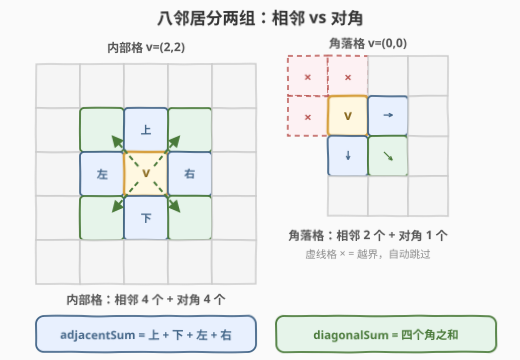
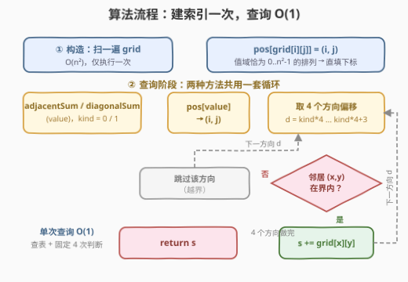
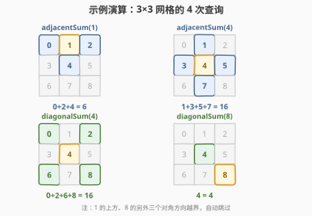

# 设计相邻元素求和的服务

- **题目名称**：设计相邻元素求和的服务
- **链接**：[3242. 设计相邻元素求和的服务](https://leetcode.cn/problems/design-neighbor-sum-service/)
- **难度**：简单
- **标签**：设计、数组、哈希表、矩阵、模拟

## 1. 题目概述

给你一个 $n \times n$ 的二维数组 `grid`，包含范围 $[0, n^2-1]$ 内**互不相同**的元素。实现 `neighborSum` 类：

- `neighborSum(int[][] grid)`：初始化对象；
- `int adjacentSum(int value)`：返回 `grid` 中与 `value` **相邻**的元素之和——相邻指 `value` 的上、左、右、下四个方向的元素；
- `int diagonalSum(int value)`：返回 `grid` 中与 `value` **对角线相邻**的元素之和——对角线相邻指 `value` 的左上、右上、左下、右下四个方向的元素。

**示例 1**：

```text
输入：
["neighborSum", "adjacentSum", "adjacentSum", "diagonalSum", "diagonalSum"]
[[[[0, 1, 2], [3, 4, 5], [6, 7, 8]]], [1], [4], [4], [8]]
输出：[null, 6, 16, 16, 4]
解释：1 的相邻元素是 0、2 和 4；4 的相邻元素是 1、3、5 和 7；
     4 的对角线相邻元素是 0、2、6 和 8；8 的对角线相邻元素是 4。
```

**示例 2**：

```text
输入：
["neighborSum", "adjacentSum", "diagonalSum"]
[[[[1, 2, 0, 3], [4, 7, 15, 6], [8, 9, 10, 11], [12, 13, 14, 5]]], [15], [9]]
输出：[null, 23, 45]
解释：15 的相邻元素是 0、10、7 和 6；9 的对角线相邻元素是 4、12、14 和 15。
```

**约束条件**：

- $3 \le n = \text{grid.length} = \text{grid[0].length} \le 10$
- $0 \le \text{grid}[i][j] \le n^2 - 1$，所有元素**互不相同**
- 查询的 `value` 均在 $[0, n^2-1]$ 范围内
- `adjacentSum` 与 `diagonalSum` 总计最多调用 $2n^2$ 次

> 💡 **审题关键**：① 元素互不相同且值域恰为 $[0, n^2-1]$，说明 `grid` 是 $0 \sim n^2-1$ 的一个**全排列**——「值」与「下标」双向单射，这是开**直填下标表**（完美哈希）的条件；② 两类邻居合起来正是「王走八方」的**八个方向偏移**拆成两组：相邻 $(\pm 1, 0), (0, \pm 1)$ 与对角 $(\pm 1, \pm 1)$；③ 查询是在线到达的，但 `grid` **不可变**——「不可变数据 + 反复查询」的结构天然指向**预处理索引**的设计套路。

---

## 2. 解题思路

### 2.1 暴力思路：每次查询全表扫描定位

最直接的做法：每次查询先用双重循环扫全网格找 `value` 所在格子（$O(n^2)$），再把界内邻居加起来。最多 $q = 2n^2$ 次查询，总计 $O(n^4)$；$n \le 10$ 时约 $2 \times 10^4$ 次操作，能过但别扭——**同一个值可能被反复查询**，每次都做一遍「大海捞针」，定位成本远高于求和成本（求和至多 8 格）。

### 2.2 核心观察：全排列直填下标 + 八方偏移分组



**观察 1（值是全排列 ⇒ 直填下标表）**：元素互不相同且值域恰为 $[0, n^2-1]$，故 `grid` 是 $0 \sim n^2-1$ 的排列。开一个长 $n^2$ 的 `pos` 数组，构造时一次 $O(n^2)$ 扫描执行 `pos[grid[i][j]] = (i, j)`，此后**按值定位是 O(1)**——数组下标就是一张无冲突、无哈希开销的「完美哈希表」，比 `unordered_map` 更快更省。

**观察 2（相邻 + 对角 = 八方偏移拆两组）**：

$$\text{相邻} = \{(\pm 1, 0),\ (0, \pm 1)\}, \qquad \text{对角} = \{(\pm 1, \pm 1)\}$$

把两组偏移**首尾相接**拼进同一张长度 8 的方向向量表 `dx/dy`：前 4 个是相邻偏移、后 4 个是对角偏移。两个查询方法共用同一条求和循环——起始下标 `kind * 4`，`adjacentSum`/`diagonalSum` 分别对应 `kind = 0 / 1`，一个 `calc(value, kind)` 通吃两种询问。

**观察 3（边界格子自动瘦身）**：角落/边缘格凑不齐 8 个邻居——角格只有 2 相邻 + 1 对角，边格 3 + 2。无需任何特判，对每个候选邻居做一次**越界检查**即可：出界就跳过。示例 1 中右下角的 8，对角方向只有左上（4）存在，故 `diagonalSum(8) = 4`。

> ⚠️ **别急着上哈希表**：「值 → 位置」的第一反应常是 `unordered_map` / `dict`，但本题值域小且是排列，数组直填既简单又快。「值域小用数组、值域大用哈希」的取舍与 [3238. 求出胜利玩家的数目](https://leetcode.cn/problems/find-the-number-of-winning-players/) 一脉相承。

### 2.3 算法流程



| 阶段 | 操作 | 代价 |
|------|------|------|
| ① 构造函数 | 扫 `grid`，`pos[grid[i][j]] = (i, j)` | $O(n^2)$，仅一次 |
| ② 查询 `calc(value, kind)` | 查 `(i,j) = pos[value]`；取偏移 `d = kind*4 .. kind*4+3`；逐个越界检查并累加 | 固定 4 次判断，$O(1)$ |

### 2.4 示例演算



以示例 1 的 `grid = [[0,1,2],[3,4,5],[6,7,8]]`（$n=3$，值恰为 $0 \sim 8$ 的排列）演算：

| 查询 | 定位 | 命中格子 | 结果 |
|------|------|----------|------|
| `adjacentSum(1)` | (0,1) 顶边格 | 0、2、4（上方出界） | **6** |
| `adjacentSum(4)` | (1,1) 中心格 | 1、3、5、7 | **16** |
| `diagonalSum(4)` | (1,1) 中心格 | 0、2、6、8 | **16** |
| `diagonalSum(8)` | (2,2) 角格 | 4（另三角出界） | **4** |

注意两个边界案例：1 在顶边上，相邻邻居只剩 3 个；8 在右下角，对角邻居只剩 1 个——**出界方向由越界检查自动跳过，代码无需按位置分类讨论**。

---

## 3. 参考代码

### C++

```cpp
class NeighborSum {
public:
    NeighborSum(vector<vector<int>>& grid) : g(grid), n(grid.size()) {
        pos.resize(n * n);
        for (int i = 0; i < n; ++i)
            for (int j = 0; j < n; ++j)
                pos[g[i][j]] = {i, j};          // 值 → (i,j) 直填下标表
    }

    int adjacentSum(int value) { return calc(value, 0); }
    int diagonalSum(int value) { return calc(value, 1); }

private:
    static constexpr int dx[8] = {-1, 1, 0, 0, -1, -1, 1, 1};   // 前 4 个：相邻
    static constexpr int dy[8] = {0, 0, -1, 1, -1, 1, -1, 1};   // 后 4 个：对角

    int calc(int value, int kind) {
        auto [i, j] = pos[value];               // O(1) 定位
        int s = 0;
        for (int d = kind * 4; d < kind * 4 + 4; ++d) {
            int x = i + dx[d], y = j + dy[d];
            if (x >= 0 && x < n && y >= 0 && y < n)   // 越界跳过
                s += g[x][y];
        }
        return s;
    }

    vector<vector<int>> g;
    vector<pair<int, int>> pos;
    int n;
};
```

### Python

```python
class NeighborSum:
    DX = (-1, 1, 0, 0, -1, -1, 1, 1)   # 前 4 个：相邻；后 4 个：对角
    DY = (0, 0, -1, 1, -1, 1, -1, 1)

    def __init__(self, grid: List[List[int]]):
        self.g = grid
        self.n = len(grid)
        self.pos = [None] * (self.n * self.n)
        for i, row in enumerate(grid):
            for j, v in enumerate(row):
                self.pos[v] = (i, j)          # 值 → (i,j) 直填下标表

    def _sum(self, value: int, kind: int) -> int:
        i, j = self.pos[value]                # O(1) 定位
        s = 0
        for d in range(kind * 4, kind * 4 + 4):
            x, y = i + self.DX[d], j + self.DY[d]
            if 0 <= x < self.n and 0 <= y < self.n:
                s += self.g[x][y]             # 越界跳过
        return s

    def adjacentSum(self, value: int) -> int:
        return self._sum(value, 0)

    def diagonalSum(self, value: int) -> int:
        return self._sum(value, 1)
```

### Python（全预计算版：空间换时间）

```python
class NeighborSum:
    def __init__(self, grid: List[List[int]]):
        n = len(grid)
        adj = [0] * (n * n)
        diag = [0] * (n * n)
        for i, row in enumerate(grid):
            for j, v in enumerate(row):
                for x, y in ((i-1, j), (i+1, j), (i, j-1), (i, j+1)):
                    if 0 <= x < n and 0 <= y < n:
                        adj[v] += grid[x][y]
                for x, y in ((i-1, j-1), (i-1, j+1), (i+1, j-1), (i+1, j+1)):
                    if 0 <= x < n and 0 <= y < n:
                        diag[v] += grid[x][y]
        self.adj, self.diag = adj, diag

    def adjacentSum(self, value: int) -> int:
        return self.adj[value]

    def diagonalSum(self, value: int) -> int:
        return self.diag[value]
```

> 💡 全预计算版在构造时把**所有**值的答案一次算完（每格把自己的值「撒」进 8 个邻居的桶里，总工作量 $O(8n^2)$），查询退化为纯数组读。本题 $q \le 2n^2$，两版渐近相同；但当「查询多、单次查询贵」时，预计算把全部开销前移到初始化，是「不可变数据 → 预处理索引」套路的彻底形态，与前缀和同宗。

---

## 4. 复杂度分析

| 维度 | 复杂度 | 说明 |
|------|--------|------|
| 初始化 | $O(n^2)$ | 扫一遍 `grid` 建 `pos` 表（全预计算版为 $O(8n^2)$，仍是 $O(n^2)$） |
| 单次查询 | $O(1)$ | 一次查表 + 固定 4 次越界判断与累加 |
| 空间 | $O(n^2)$ | 长 $n^2$ 的 `pos` 表（全预计算版另有 `adj/diag` 两张答案表） |
| 暴力对照 | $O(n^4)$ | 每次查询全表扫描定位，共 $2n^2$ 次查询 |

---

## 5. 扩展：沿三个轴推广

- **距离推广**：把「相邻/对角」换成「切比雪夫距离 $\le k$ 的所有格」或「曼哈顿距离恰为 $k$ 的格子」——只需把方向向量换成 $(\Delta i, \Delta j)$ 的双层枚举，骨架不变。[1266. 访问所有点的最小时间](https://leetcode.cn/problems/minimum-time-visiting-all-points/) 研究的正是「斜走一步也算一步」（切比雪夫距离）。
- **动态更新**：若追加 `update(value, newValue)` 接口，直填下标表只需同步维护 `pos ↔ grid` 的对应关系；但若值**可重复**（不再是排列），直填表失效，须退化为 `value → 位置列表`（哈希 + 链表）甚至回退到扫描。
- **值域放大**：若元素是任意 32 位整数而非 $[0, n^2-1]$ 的排列，直填表开不下，换成 `unordered_map<int, pair<int,int>>`，其余逻辑一字不改——这正是「数组下标当哈希」与「真哈希表」的分界线。

---

## 6. 面试要点

1. **为什么能用直填数组而非哈希表做「值 → 位置」？**

   题目保证元素互不相同且值域恰为 $[0, n^2-1]$——`grid` 是全排列，值与下标双向单射，数组下标就是无冲突的完美哈希。值域只有 100 格，直填无哈希开销、缓存友好；值域一大才退回哈希表。

2. **角落/边缘格怎么处理，需要 if-else 特判吗？**

   不需要。对 4 个候选邻居逐一越界检查（$0 \le x, y < n$），出界即跳过：角格自动只剩 2 相邻 + 1 对角，边格 3 + 2，代码对位置零特判——方向向量 + 越界检查是网格遍历的通用范式。

3. **为什么把两类方向拼接成一张表？**

   两种查询只差「取哪 4 个偏移」。首尾拼接 + `kind*4` 定起点，把两条几乎相同的循环压成一条 `calc(value, kind)`；日后新增第三类邻居（如马步）只需往表尾追加，求和循环零改动。

4. **什么时候值得用全预计算版？**

   查询次数多、或单次查询本身昂贵时。本题 $q \le 2n^2$ 且单次查询本就 $O(1)$，两版皆可；但若接口升级为「值的邻居 Top-K」这类需要排序的查询，把计算前移到构造期一次做完更稳。通用判断：**不可变数据 + 反复查询 → 预计算索引或答案**。

5. **这题有哪些易错细节？**

   ① 两类偏移别混（对角是 $(\pm 1, \pm 1)$，不是 $(\pm 2, 0)$）；② 越界检查两侧都是非严格/严格配对（$0 \le x < n$）；③ `pos` 表长度是 $n^2$ 而非 $n$；④ C++ 按引用存 `grid` 时注意被调用方生命周期——LeetCode 保证 `grid` 比对象活得久，工程场景则建议拷贝一份。

---

## 7. 同类练习题

- [303. 区域和检索 - 数组不可变](https://leetcode.cn/problems/range-sum-query-immutable/)：构造时预计算前缀和、查询 O(1)——「不可变数据 + 预计算索引」设计套路的鼻祖
- [304. 二维区域和检索 - 矩阵不可变](https://leetcode.cn/problems/range-sum-query-2d-immutable/)：二维前缀和版，与本题同结构，只是索引换成前缀和
- [1476. 子矩形查询](https://leetcode.cn/problems/subrectangle-queries/)：设计 + 矩阵，向「支持更新」演化，对比两种索引的维护成本
- [999. 可以被一步捕获的棋子数](https://leetcode.cn/problems/available-captures-for-rook/)：网格四方向遍历，方向向量 + 越界检查的基本功练习
- [1266. 访问所有点的最小时间](https://leetcode.cn/problems/minimum-time-visiting-all-points/)：切比雪夫距离，正交步与对角步合并的八方邻居模型
