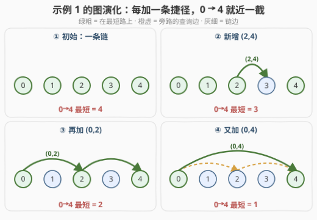
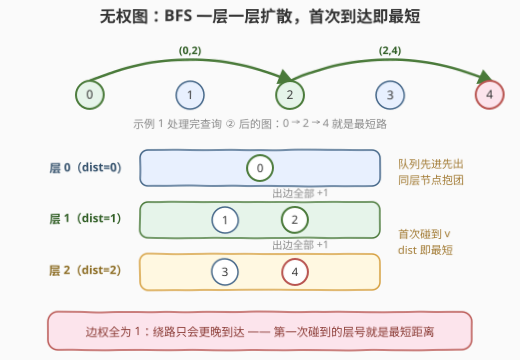
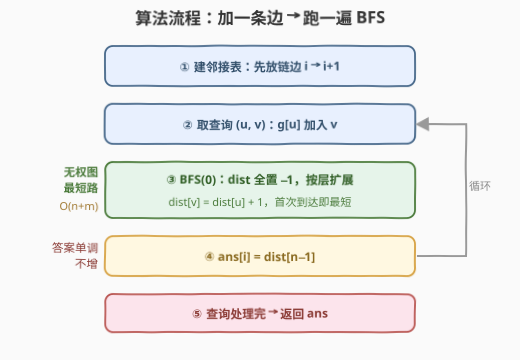
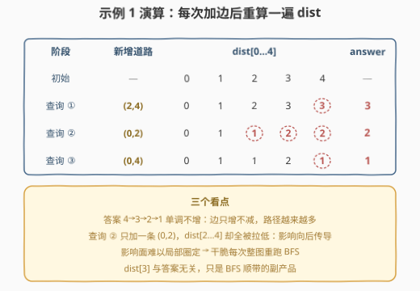

# LeetCode 新增道路查询后的最短距离 I 题解

## 1. 题目概述

- **标题 / 题号**：新增道路查询后的最短距离 I（#3243，medium）
- **链接**：https://leetcode.cn/problems/shortest-distance-after-road-addition-queries-i/
- **难度**：中等
- **标签**：广度优先搜索、图、数组

**题意**：给你一个整数 $n$ 和一个二维整数数组 `queries`。有 $n$ 个城市，编号从 $0$ 到 $n-1$。初始时，每个城市 $i$ 都有一条**单向**道路通往城市 $i+1$（$0 \le i < n-1$）——即一条链 $0 \to 1 \to \cdots \to n-1$。

`queries[i] = [u_i, v_i]` 表示新建一条从城市 $u_i$ 到城市 $v_i$ 的**单向**道路（保证 $u_i < v_i$，且查询中没有重复道路）。**每次查询后**，你需要求出从城市 $0$ 到城市 $n-1$ 的最短路径的**长度**（边数）。

返回数组 `answer`，其中 `answer[i]` 是处理完**前 $i+1$ 条查询**后，从城市 $0$ 到城市 $n-1$ 的最短路径长度。

**示例 1**：

```text
输入：n = 5, queries = [[2,4],[0,2],[0,4]]
输出：[3,2,1]
解释：加 (2,4) 后最短路 0→1→2→4，长 3；
     加 (0,2) 后最短路 0→2→4，长 2；
     加 (0,4) 后最短路 0→4，长 1。
```

**示例 2**：

```text
输入：n = 4, queries = [[0,3],[0,2]]
输出：[1,1]
解释：加 (0,3) 后 0→3 直达，长 1；再加 (0,2) 后仍走 0→3，长 1。
```

**约束**：

- $3 \le n \le 500$
- $1 \le \mathrm{queries.length} \le 500$
- $0 \le \mathrm{queries}[i][0] < \mathrm{queries}[i][1] < n$
- 查询中没有重复的道路

> 💡 读题关键：这是一道**在线**问题——边一条条加入，每一步都要立刻作答。好在规模极小（$n, q \le 500$），每次加边后**整图重算**一遍最短路也绰绰有余；难点不在优化，而在**选对最短路的工具**。

## 2. 解题思路

### 2.1 暴力思路：每次加边后重算最短路，但选什么工具？

框架是显然的：加一条边 → 算一次 $0 \to n-1$ 的最短路 → 记录答案。真正的问题是**用哪个最短路算法**：

- **Floyd**：单次 $O(n^3)$，总计 $500 \times 1.25 \times 10^8 \approx 6 \times 10^{10}$ —— 直接超时；而且它求的是**全源**最短路，本题只关心单源，纯属浪费；
- **Dijkstra**：单次 $O(m \log n)$，总计约 $4.5 \times 10^6$ —— 能过，但依然「杀鸡用牛刀」。

> ⚠️ 卡点：两个算法都忽略了本题最显眼的性质——**所有边的长度都是 1**。边权全相同的图求单源最短路，根本轮不到 Dijkstra 登场。

### 2.2 核心观察：边权全 1 的图，BFS 一趟分层就是最短路



三个层层递进的观察：

**观察 1（图只增不减）**：查询只会**加边**、从不删边。因此图结构可以**增量维护**——邻接表 `g[u]` 追加 $v$ 即可，不用每次重建；同时从 $0$ 出发到任何点的距离 $\mathrm{dist}[v]$ **只会变小或不变**（可选路径集合只增不减，示例 1 的答案 $4 \to 3 \to 2 \to 1$ 单调不增正是佐证）。

**观察 2（边权全 1）**：所有道路长度都是 1，这正是 **BFS** 的主场——从 $0$ 出发按层扩散，第几层碰到 $v$，$0 \to v$ 的最短路就是几：



**观察 3（正确性一句话）**：队列**先进先出**，同层的节点在队列中「抱团」依次扩展；如果存在更短的路，$v$ 必然在更早的层就被扩展到。所以**第一次**给 $v$ 赋的 $\mathrm{dist}[v]$ 就是最终答案——`dist` 数组兼任 visited 标记，一遍 BFS 结束直接读 $\mathrm{dist}[n-1]$。

顺带一提：本题所有边都从小编号指向大编号（链边 $i \to i+1$，查询保证 $u < v$），图其实是个 **DAG**——不过 BFS 不需要这个性质，它的通用性反而是加分项（见第 5 节扩展）。

### 2.3 算法流程图



流程共四步（②–④ 循环 $q$ 次）：

1. 建邻接表：只放链边 $i \to i+1$；
2. 取下一条查询 $(u, v)$，把 $v$ 追加进 $g[u]$；
3. 从 $0$ 跑一遍 BFS，得到 `dist[]`；
4. `ans[i] = dist[n−1]`；全部处理完返回 `ans`。

### 2.4 示例演算



以示例 1 演算（$n = 5$，初始 $\mathrm{dist} = [0,1,2,3,4]$）：

| 阶段 | 新增道路 | dist[0..4] | answer |
|------|----------|------------|--------|
| 初始 | — | $[0,1,2,3,4]$ | — |
| 查询① | $(2,4)$ | $[0,1,2,3,\mathbf{3}]$ | **3** |
| 查询② | $(0,2)$ | $[0,1,\mathbf{1},\mathbf{2},\mathbf{2}]$ | **2** |
| 查询③ | $(0,4)$ | $[0,1,1,2,\mathbf{1}]$ | **1** |

两个值得盯的细节：

- **查询② 只加了一条 $(0,2)$，却把 $\mathrm{dist}[2..4]$ 全拉低了**——单点改动的收益会沿图向后传导。既然改动影响面难以局部圈定，干脆每次**整图重跑** BFS，最省心也最难写错；
- $\mathrm{dist}[3]$ 与答案无关，它只是 BFS 的副产品——BFS 天然算出**所有点**的距离，顺带而已。

## 3. 参考代码

### C++

```cpp
class Solution {
  public:
    vector<int> shortestDistanceAfterQueries(int n, vector<vector<int>>& queries) {
        vector<vector<int>> g(n);
        for (int i = 0; i + 1 < n; i++) g[i].push_back(i + 1);   // 链边 i → i+1

        vector<int> ans;
        ans.reserve(queries.size());
        for (auto& q : queries) {
            g[q[0]].push_back(q[1]);        // 只加不删，邻接表增量维护
            ans.push_back(bfs(g, n));
        }
        return ans;
    }

  private:
    int bfs(vector<vector<int>>& g, int n) {
        vector<int> dist(n, -1);            // -1 兼任 visited
        queue<int> que;
        dist[0] = 0;
        que.push(0);
        while (!que.empty()) {
            int u = que.front();
            que.pop();
            for (int v : g[u]) {
                if (dist[v] == -1) {
                    dist[v] = dist[u] + 1;  // 首次到达即最短
                    que.push(v);
                }
            }
        }
        return dist[n - 1];
    }
};
```

### Python

```python
class Solution:
    def shortestDistanceAfterQueries(self, n: int, queries: List[List[int]]) -> List[int]:
        g = [[i + 1] for i in range(n - 1)]
        g.append([])

        def bfs() -> int:
            dist = [-1] * n                 # -1 兼任 visited
            dist[0] = 0
            q = [0]
            for u in q:                     # 边遍历边 append = 队列
                for v in g[u]:
                    if dist[v] == -1:
                        dist[v] = dist[u] + 1
                        q.append(v)
            return dist[n - 1]

        ans = []
        for u, v in queries:
            g[u].append(v)                  # 只加不删，邻接表增量维护
            ans.append(bfs())
        return ans
```

> 💡 细节盘点：`dist` 初始化为 $-1$ 一物两用（距离 + visited）；弹出 $n-1$ 时可提前 `return`（可选剪枝，收益不大）；「邻接表直接 append」的合法性来自图只增不减——若查询会**删边**，就得每次重建或上更复杂的数据结构了。

## 4. 复杂度分析

| 维度 | 复杂度 | 说明 |
|------|--------|------|
| 时间复杂度 | $O\big(q\,(n+q)\big)$ | 每次 BFS 为 $O(n+m)$，边数 $m = n-1+\text{已加边数} \le n+q-1$；总计约 $500 \times 1000 = 5 \times 10^5$ |
| 空间复杂度 | $O(n+q)$ | 邻接表 + dist 数组 + 队列 |
| 暴力对照 | $O(q\,n^3)$ | 每次跑 Floyd，$\approx 6 \times 10^{10}$ 超时；Dijkstra $O(q\,m\log n)$ 能过但多余 |

## 5. 扩展：DAG 正序 DP 与「区间覆盖」视角——通往 3244 的钥匙

**变体一：正序 DP 代替 BFS。** 本题所有边都从小编号指向大编号，节点编号就是天然拓扑序，于是最短路可以一遍线性扫描递推：

$$\mathrm{dist}[v] = \min\big(\mathrm{dist}[v-1] + 1,\ \min_{(u,v)\,\in\,E} \mathrm{dist}[u] + 1\big)$$

复杂度与 BFS 同阶，写起来更短；而且它**天然支持边权不为 1** 的推广（BFS 在带权图上直接失效）。

**变体二（更有意思）：把「走图」翻译成「选区间」。** 一条 $0 \to n-1$ 的路径 = 沿链直行 + 若干次「跳跃」。每用一次查询边 $(u, v)$，就**跳过**开区间 $(u, v)$ 内的 $v - u - 1$ 个点；又因为只能前进，路径使用的跳跃对应区间**两两不相交**（$v_i \le u_{i+1}$）。反过来，任意一组两两不相交的跳跃也总能串成合法路径。于是：

$$\mathrm{answer} = (n-1) \;-\; \max\Big\{\, \sum_i (v_i - u_i - 1) \;:\; \text{已加入的跳跃两两不相交} \Big\}$$

用示例 1 验证：加 $(2,4)$ 后最多跳过 $1$ 个点，$4 - 1 = 3$ ✓；再加 $(0,2)$ 可与 $(2,4)$ 同时选，共跳过 $2$ 个点，$4 - 2 = 2$ ✓；再加 $(0,4)$ 单独跳过 $3$ 个点，$4 - 3 = 1$ ✓。最短路问题摇身一变成了**最大不相交区间覆盖**。

**为什么值得做这些变形？** 姊妹题 [3244](https://leetcode.cn/problems/shortest-distance-after-road-addition-queries-ii/) 把 $n, q$ 放大到 $10^5$，逐查询 BFS 的 $O(q(n+q)) \approx 10^{10}$ 彻底失效。突破口正是上面的结构观察：最短路的「转向点」全部是查询端点 → 链可以压缩成带权边、图缩到 $O(q)$ 规模；再叠加「距离只减不增」的均摊性质做增量维护，即可通过。**小数据范围的题，恰恰是练「为放大做准备」的结构思维的最好素材。**

## 6. 面试要点

1. **为什么用 BFS 而不是 Dijkstra / Floyd？**

   - 边权全为 1：BFS 单次 $O(n+m)$ 求单源最短路，已是理论最优量级；Dijkstra 多付一个 $\log$，Floyd $O(n^3)$ 还求了用不上的全源。选型口诀：**无权图 BFS，非负权 Dijkstra，有负权 Bellman-Ford**。

2. **每次加边后都要重跑完整 BFS 吗？能否增量更新？**

   - 理论上可以：新边 $(u,v)$ 仅当 $\mathrm{dist}[u] + 1 < \mathrm{dist}[v]$ 时才有影响，且从 $v$ 向后松弛传播即可（距离只减不增）。但本题规模下重跑一遍只要 $O(n+m)$，**简单压倒聪明**；增量版留给 3244 那样的规模。

3. **dist 数组初始化为 −1 起什么作用？**

   - 一物两用：既表示「未确定距离」，又兼任 visited 标记——无权图 BFS 首次到达即最短，每个点只会入队一次，无需二次松弛。

4. **答案一定存在吗？上界是多少？**

   - 一定存在：初始链保证 $0 \to n-1$ 沿链直行可达，加边不删边，可达性只增不减；答案上界 $n-1$（链长），且随查询**单调不增**。

5. **本题的图是 DAG，题解用到了吗？**

   - BFS 主线没用到（它不依赖无环性，更通用）；DAG 性质（所有边 $u \to v$ 均满足 $u < v$）支撑了扩展里的正序 DP 与区间覆盖视角，也是 3244 做图压缩的根基。面试时主动指出「我的解法不依赖这个性质」，往往比炫技更加分。

## 同类练习题

| # | 题目 | 与本题的关联 |
|---|------|-------------|
| 3244 | [新增道路查询后的最短距离 II](https://leetcode.cn/problems/shortest-distance-after-road-addition-queries-ii/) | 本题的放大版（$n, q \le 10^5$），必须利用「转向点全是查询端点」做图压缩 + 增量维护 |
| 743 | [网络延迟时间](https://leetcode.cn/problems/network-delay-time/) | 边权不为 1 时的单源最短路，堆优化 Dijkstra 模板题（对照本文的 BFS 选型） |
| 787 | [K 站中转内最便宜的航班](https://leetcode.cn/problems/cheapest-flights-within-k-stops/) | 带权最短路 + 限制松弛轮数的 Bellman-Ford，选型口诀的第三块拼图 |
| 1976 | [到达目的地的方案数](https://leetcode.cn/problems/number-of-ways-to-arrive-at-destination/) | 最短路的经典伴生题——求完距离再数路径 |
| 1334 | [阈值距离内邻居最少的城市](https://leetcode.cn/problems/find-the-city-with-the-smallest-number-of-neighbors-at-a-threshold-distance/) | Floyd 全源最短路的正确打开方式，看看 $O(n^3)$ 什么时候才值得出手 |
