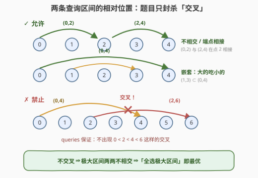
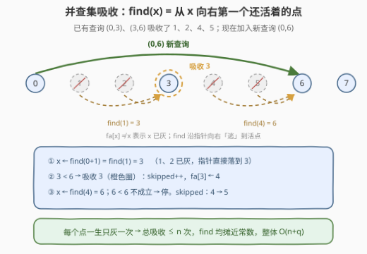
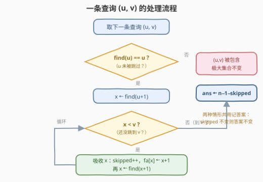
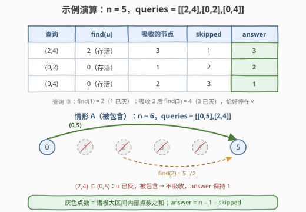

# 新增道路查询后的最短距离 II

- **题目名称**：新增道路查询后的最短距离 II
- **链接**：[3244. 新增道路查询后的最短距离 II](https://leetcode.cn/problems/shortest-distance-after-road-addition-queries-ii/)
- **难度**：困难
- **标签**：贪心、图、数组、有序集合

## 1. 题目概述

给你一个整数 $n$ 和一个二维整数数组 `queries`。有 $n$ 个城市，编号从 $0$ 到 $n-1$。初始时，每个城市 $i$ 都有一条**单向**道路通往城市 $i+1$（$0 \le i < n-1$）——即一条链 $0 \to 1 \to \cdots \to n-1$。

`queries[i] = [u_i, v_i]` 表示新建一条从城市 $u_i$ 到城市 $v_i$ 的**单向**道路（保证 $u_i < v_i$ 且 $v_i - u_i \ge 2$，查询中没有重复道路）。**每次查询后**，你需要求出从城市 $0$ 到城市 $n-1$ 的最短路径的**长度**（边数）。返回数组 `answer`，`answer[i]` 是处理完前 $i+1$ 条查询后的最短路长度。

**额外保证（本题的灵魂）**：所有查询中不存在两个查询 $i \ne j$ 同时满足

$$\mathit{queries}[i][0] < \mathit{queries}[j][0] < \mathit{queries}[i][1] < \mathit{queries}[j][1]$$

——翻译成区间语言：**新增道路对应的区间两两不交叉**。

**示例 1**：

```text
输入：n = 5, queries = [[2,4],[0,2],[0,4]]
输出：[3,2,1]
解释：加 (2,4) 后最短路 0→1→2→4，长 3；
     加 (0,2) 后最短路 0→2→4，长 2；
     加 (0,4) 后最短路 0→4，长 1。
```

**示例 2**：

```text
输入：n = 4, queries = [[0,3],[0,2]]
输出：[1,1]
解释：加 (0,3) 后 0→3 直达，长 1；再加 (0,2) 后仍走 0→3，长 1。
```

**约束条件**：

- $3 \le n \le 10^5$
- $1 \le \mathrm{queries.length} \le 10^5$
- $0 \le \mathit{queries}[i][0] < \mathit{queries}[i][1] < n$，且 $1 < \mathit{queries}[i][1] - \mathit{queries}[i][0]$
- 查询中不存在重复的道路，也不存在满足上述交叉关系的两个查询

> 💡 读题关键：题面与 3243 几乎逐字相同，只有两处变化——**规模放大 200 倍**（$500 \to 10^5$），以及多了一条**区间不交叉**的保证。前者宣判了「每次重跑 BFS」的死刑；后者则是命题人递过来的梯子，解法的全部灵感都藏在这句话里。

---

## 2. 解题思路

### 2.1 暴力思路：照搬 3243 的逐次 BFS？

3243 的做法是每次加边后整图重跑 BFS，单次 $O(n+m)$，总计 $O(q(n+q))$。代入本题规模：

$$10^5 \times (10^5 + 2 \times 10^5) = 3 \times 10^{10}$$

——彻底超时。规模逼着我们放弃「每步重算」、转向**增量维护**；而增量维护需要结构性质兜底，兜底的正是「不交叉」保证。

### 2.2 核心观察：不交叉 ⇒ 全选极大区间即最优

先把「走图」翻译成「选区间」（3243 题解扩展里埋过的伏笔）：一条 $0 \to n-1$ 的路径 = 沿链直行 + 若干次「跳跃」，每用一次查询边 $(u, v)$ 就**跳过**开区间 $(u, v)$ 内的 $v - u - 1$ 个点，且路径所用的跳跃两两不相交。于是

$$\mathrm{answer} = (n-1) \;-\; \max\Big\{ \text{两两不相交的跳跃总共跳过的点数} \Big\}$$

没有「不交叉」保证时，这是一个需要动态规划的难题；带上了，它直接坍缩成一道**计数题**。

**第一步：把保证翻译成区间语言。** 任意两条查询区间 $[a,b]$、$[c,d]$（不妨 $a \le c$），不交叉意味着相对位置只有两种：$d \le b$（**嵌套**）或 $c \ge b$（**不相交**，端点相接也算）。这种「要么嵌套要么不相交」的区间族在数学上叫 **laminar 族**（层叠族）：



**第二步：两个推论。**

- **推论 1（极大区间两两不相交）**：称不被其他查询区间包含的区间为**极大区间**。若两个极大区间内部相交，由 laminar 性其中一个必包含另一个，与「极大」矛盾——所以极大区间两两不相交（端点相接无妨）。

- **推论 2（全选极大区间即最优）**：最优跳跃方案就是**全部极大区间**，即

$$\mathrm{answer} = (n-1) \;-\; \sum_{\text{极大区间 } [u,v]} (v - u - 1)$$

  证明（换上界论证）：任何可行方案 $S$ 中，每条区间都被某个极大区间包含；落在同一个极大区间 $m$ 内的所选区间互不相交、总跨度不超过 $m$ 的跨度，合计跳过 $\le v_m - u_m - 1$ 个点；不同极大区间互不相交、各自独立计账。故 $\mathrm{skip}(S) \le \sum_m (v_m - u_m - 1)$。而「全选极大区间」本身两两不相交、可以串成合法路径，恰好取到该上界。∎

> 💡 直觉版理解：嵌套时「大的吃掉小的」——选包含者永远不亏；相离时互不干扰——可以全都要。两类关系都不产生「二选一」的抉择，最优化问题自然退化为**维护一个集合再求和**。

**第三步：增量维护极大区间。** 加入新查询 $(u, v)$ 时只有两种情形：

- **情形 A（被包含，答案不变）**：已有极大区间 $[a,b] \supseteq [u,v]$。判定方法出人意料地简单：此时 $u$ 必然已被跳过（$u$ 在 $(a,b)$ 内部）。
- **情形 B（成为新极大，吸收）**：$(u, v)$ 不被任何极大区间包含。极大区间集合更新为「删掉内部嵌套的 + 加入 $(u,v)$」，跳过总数的变化恰好等于 $(u, v)$ 内部**尚未被跳过**的点数。

两种情形可以用同一套动作统一实现——**并查集吸收**：



维护数组 `fa`：`fa[x] = x` 表示点 $x$ 还**活着**（未被跳过）；跳过 $x$ 时置 `fa[x] = x + 1`。于是 **`find(x)` 返回从 $x$ 向右第一个还活着的点**（路径压缩让指针越跳越快）。处理查询 $(u, v)$：

- 若 `find(u) ≠ u`：$u$ 已被跳过 ⇒ 情形 A，什么都不用做（正确性论证见面试要点 3）；
- 否则从 `x = find(u+1)` 出发，只要 `x < v` 就跳过 $x$（`skipped++`，`fa[x] = x+1`），再 `x = find(x+1)`——这个循环正是情形 B 的「吸收内部所有活点」。

> ⚠️ 共享左端点的嵌套（如已有 $[0,4]$ 再来 $[0,2]$）落在情形 B 的边界上：$u = 0$ 活着，但 $(u,v)$ 内部的点全灰，吸收循环空转一圈一个不吸收，`skipped` 不变——答案自然不变，依然正确。另一个细节：约束 $v - u \ge 2$ 保证 `u+1`、`x+1` 永不越界。

**均摊关键**：每个点至多被跳过（变灰）一次，$n$ 个点总共只有 $n$ 次吸收；`find` 带路径减半均摊近常数。总复杂度 $O(n + q)$ 量级，比逐次 BFS 快了五个数量级。

### 2.3 算法流程图



处理一条查询 $(u, v)$ 共三步：① `find(u) ≠ u` → 直接记旧答案（被包含）；② 否则从 `find(u+1)` 起向右吸收活点，直到碰到 $v$；③ 记录 $\mathrm{ans} = n - 1 - \mathrm{skipped}$。两种情形共用「记答案」这一步——`skipped` 没变，答案自然没变。

### 2.4 示例演算



以示例 1（$n = 5$）演算，初始 `skipped = 0`：

| 查询 | find(u) | 吸收的节点 | skipped | answer |
|------|---------|-----------|---------|--------|
| $(2,4)$ | $2$（存活） | $3$ | $1$ | $4 - 1 = \mathbf{3}$ |
| $(0,2)$ | $0$（存活） | $1$ | $2$ | $4 - 2 = \mathbf{2}$ |
| $(0,4)$ | $0$（存活） | $2$ | $3$ | $4 - 3 = \mathbf{1}$ |

查询 ③ 的指针跳跃值得盯：`find(1)` 直接定位到 2（1 已灰），吸收 2 后 `find(3)` 直接跳到 4（3 已灰）恰好停住——已灰的点是「透明」的，循环只碰活点。

再演算一个情形 A 的小例子（$n = 6$，`queries = [[0,5],[2,4]]`）：$(0,5)$ 吸收 $1,2,3,4$，`skipped = 4`，答案 $5 - 4 = 1$；随后 $(2,4)$ 中 `find(2) = 5 ≠ 2`——$u$ 已被跳过，$(2,4)$ 被包含在 $(0,5)$ 里，不吸收，答案保持 $1$。（若把它真当新极大区间吸收反而错：$(0,5)$ 才是更大的跳跃。）

---

## 3. 参考代码

### C++

```cpp
class Solution {
  public:
    vector<int> shortestDistanceAfterQueries(int n, vector<vector<int>>& queries) {
        vector<int> fa(n);
        iota(fa.begin(), fa.end(), 0);          // fa[x] == x：点 x 还活着
        auto find = [&](int x) {
            while (fa[x] != x) {
                fa[x] = fa[fa[x]];              // 路径减半：指针越跳越快
                x = fa[x];
            }
            return x;                           // ≥ x 的第一个活点
        };

        vector<int> ans;
        ans.reserve(queries.size());
        int skipped = 0;                        // 已被跳过的点数
        for (auto& q : queries) {
            int u = q[0], v = q[1];
            if (find(u) == u) {                 // u 活着 → (u,v) 不被包含
                for (int x = find(u + 1); x < v; x = find(x + 1)) {
                    skipped++;                  // 吸收活点 x
                    fa[x] = x + 1;
                }
            }                                   // 否则被包含：skipped 不变
            ans.push_back(n - 1 - skipped);     // 两种情形统一记答案
        }
        return ans;
    }
};
```

### Python

```python
class Solution:
    def shortestDistanceAfterQueries(self, n: int, queries: List[List[int]]) -> List[int]:
        fa = list(range(n))                     # fa[x] == x：点 x 还活着

        def find(x: int) -> int:
            while fa[x] != x:
                fa[x] = fa[fa[x]]               # 路径减半
                x = fa[x]
            return x                            # ≥ x 的第一个活点

        ans = []
        skipped = 0                             # 已被跳过的点数
        for u, v in queries:
            if find(u) == u:                    # u 活着 → (u,v) 不被包含
                x = find(u + 1)
                while x < v:
                    skipped += 1                # 吸收活点 x
                    fa[x] = x + 1
                    x = find(x + 1)
            ans.append(n - 1 - skipped)         # 两种情形统一记答案
        return ans
```

> 💡 细节盘点：`find(u) == u` 一行承担了「情形判定」——活着 ⇒ 新区间会成为极大区间，已灰 ⇒ 被包含；两种情形共用「记答案」一行代码，因为 `skipped` 不变时答案自动不变。并查集全程只有「变灰」这一种写操作（`fa[x] ← x+1`），没有常规并查集的合并方向问题；也不用按秩合并，「每点只灰一次」的均摊已足够。

---

## 4. 复杂度分析

| 维度 | 复杂度 | 说明 |
|------|--------|------|
| 时间复杂度 | $O\big((n+q)\,\alpha(n)\big) \approx O(n+q)$ | 每个点至多被吸收一次（共 $n$ 次），每次 `find` 均摊近常数（路径减半） |
| 空间复杂度 | $O(n)$ | `fa` 数组；返回的答案数组不计 |
| 暴力对照 | $O\big(q(n+q)\big) \approx 3 \times 10^{10}$ | 逐次 BFS（3243 做法），规模放大后直接超时 |

---

## 5. 扩展：有序集合写法与「允许交叉」的世界

**变体一：有序集合维护极大区间（官方标签里的 Ordered Set）。** 维护当前极大区间集合（按左端点有序、两两不相交）及跳过总数 `total`。加入 $(u,v)$：先找左端点 $\le u$ 的前驱区间，若它覆盖 $(u,v)$ 则是情形 A 直接跳过；否则删除所有落在 $(u,v)$ 内的区间（贡献从 `total` 扣除），插入 $(u,v)$。C++ `std::set` 每步 $O(\log n)$。并查集写法本质上是同一过程的「节点视角」——把区间集合操作翻译成了「点变灰」，还顺手免掉了有序容器。

**变体二：若去掉「不交叉」保证会怎样？** 交叉一旦出现（如 $[0,4]$ 与 $[2,6]$），两个极大区间可以内部相交，推论 1、2 同时失效，问题退回「动态维护 DAG 最短路」的本行——把链压缩到 $O(q)$ 个查询端点、增量松弛，那是另一个量级的难题（3243 的小数据正是为一般形态准备的）。

**为什么这份题解值得记住？** 它是「**约束即算法**」的范本：命题人收紧了输入结构（laminar 区间族），最优化就坍缩成计数，动态维护就坍缩成并查集吸收。读约束时多问一句「这条保证替我消灭了什么坏情况」，往往就是整道题的题眼。

---

## 6. 面试要点

1. **本题和 3243 的本质区别是什么？**

   题面只差一条保证与数据规模，解法却天壤之别：3243 靠「规模小」纵容整图重算 BFS；本题规模放大 200 倍，逐次 BFS 达 $3 \times 10^{10}$，必须吃透「区间不交叉」做增量维护——**输入结构决定算法档次**。

2. **「不交叉」保证带来了哪两个推论？**

   区间族是 laminar 的 ⇒ ① 极大区间两两不相交；② 最优方案 = 全选极大区间，答案退化为 $(n-1) - \sum (v-u-1)$，最优化问题坍缩为维护计数。

3. **为什么 `find(u) ≠ u` 就能断定「被包含、答案不变」？**

   $u$ 已灰 ⇒ $u$ 在某极大区间 $(a,b)$ 的**内部**（$a < u < b$）。由 laminar 性，$(u,v)$ 与 $(a,b)$ 只能嵌套；若 $(a,b) \subseteq (u,v)$ 则 $a \ge u$，与 $a < u$ 矛盾；故必为 $(u,v) \subseteq (a,b)$，极大集合不变，答案不变。

4. **这里的并查集和常规用法有何不同？**

   常规并查集维护「合并等价类」；这里只维护「向右的逃生指针」——`fa[x] ≠ x` 表示 $x$ 已灰，`find(x)` 返回 $\ge x$ 的第一个活点。只有「变灰」单方向写操作，不需要按秩合并，复杂度靠「每点只灰一次」的均摊。

5. **吸收循环为什么不会超时？**

   每圈吸收恰好让一个**活点**变灰，而活点只减不增、总共 $n$ 个，故吸收总次数 $\le n$；灰点之间的跳跃由路径减半均摊掉。即使 $10^5$ 条查询全部触发循环，总工作量仍是 $O(n+q)$。

---

## 7. 同类练习题

- [3243. 新增道路查询后的最短距离 I](https://leetcode.cn/problems/shortest-distance-after-road-addition-queries-i/)：去掉不交叉保证的小数据版，逐次 BFS 对照本题的增量维护
- [684. 冗余连接](https://leetcode.cn/problems/redundant-connection/)：并查集判环模板，体会并查集「只问连通性」时的含金量
- [435. 无重叠区间](https://leetcode.cn/problems/non-overlapping-intervals/)：不相交区间的贪心调度，与本题「极大区间两两不相交」互为表里
- [56. 合并区间](https://leetcode.cn/problems/merge-intervals/)：排序 + 扫描处理区间相对位置的基本功
- [2276. 统计区间中的整数数目](https://leetcode.cn/problems/count-integers-in-intervals/)：有序集合动态维护不相交区间集，官方标签 Ordered Set 的正牌考法
