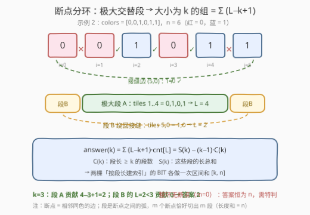
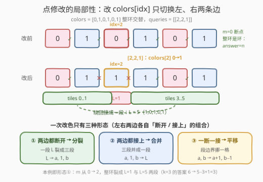
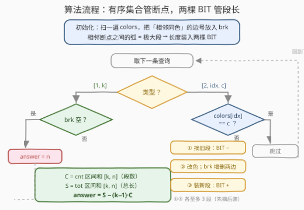
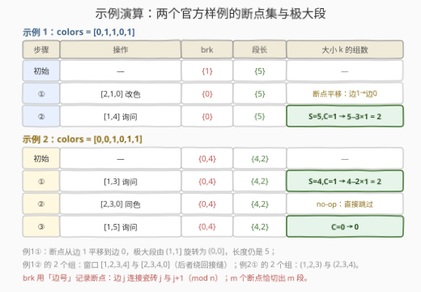

# 交替组 III

- **题目名称**：交替组 III
- **链接**：[3245. 交替组 III](https://leetcode.cn/problems/alternating-groups-iii/)
- **难度**：困难
- **标签**：树状数组、有序集合、数组

## 1. 题目概述

给你一个整数数组 `colors` 和一个二维整数数组 `queries`。`colors` 表示一个由红色和蓝色瓷砖组成的**环**，第 `i` 块瓷砖的颜色为 `colors[i]`：`0` 表示红色，`1` 表示蓝色。环中**连续若干块**瓷砖的颜色如果是**交替**颜色（除第一块和最后一块外，中间每块瓷砖与它左边、右边的颜色都不同），称为一个**交替组**。你需要处理两种查询：

- `queries[i] = [1, size_i]`：统计大小**恰好为** $size_i$ 的交替组的数量；
- `queries[i] = [2, index_i, color_i]`：把 `colors[index_i]` 更改为 $color_i$。

返回数组 `answer`，按顺序包含所有第一种查询的结果。注意 `colors` 表示的是**环**——第一块和最后一块瓷砖相邻。

**示例 1**：

```text
输入：colors = [0,1,1,0,1], queries = [[2,1,0],[1,4]]
输出：[2]
解释：先把 colors[1] 改为 0，colors 变为 [0,0,1,0,1]。
     大小为 4 的交替组有两个：窗口 (1,2,3,4) 与 (2,3,4,0)，后者跨过首尾接缝。
```

**示例 2**：

```text
输入：colors = [0,0,1,0,1,1], queries = [[1,3],[2,3,0],[1,5]]
输出：[2,0]
解释：大小为 3 的组有 (1,2,3) 与 (2,3,4)；[2,3,0] 是同色 no-op；
     最长交替段只有 4，不存在大小为 5 的组。
```

**约束条件**：

- $4 \le colors.length \le 5 \times 10^4$
- $colors[i] \in \{0, 1\}$
- $1 \le queries.length \le 5 \times 10^4$
- 查询 1：$3 \le size_i \le n - 1$；查询 2：$0 \le index_i \le n - 1$，$color_i \in \{0, 1\}$

> 💡 读题关键：① 「大小为 $size_i$」是**恰好**等于，且窗口起点在环上任取——这正是 [3208. 交替组 II](https://leetcode.cn/problems/alternating-groups-ii/) 的滑动窗口计数；但本题把它搬进了**在线 + 带点修改**的场景，3208 那套一遍扫描的 $O(n)$ 统计会被任意一次改色整个作废。② 改一块瓷砖的颜色只牵动它**左、右两条边**的交替性——这个局部性是全题的破口。③ $n, q \le 5 \times 10^4$，需要 $O((n+q)\log n)$ 级别的动态维护，与官方标签「树状数组 + 有序集合」对上。

---

## 2. 解题思路

### 2.1 暴力思路：每次查询全量重扫

最直接的做法：每遇到查询 1，就枚举 $n$ 个起点逐窗判定（3208 的老办法），单次 $O(nk)$；哪怕先把环预切成极大交替段、每次查询只对段求和，单次也是 $O(n)$（段数可达 $n$）。$q$ 次操作总计 $O(nq) \approx 2.5 \times 10^9$，必然超时。

> ⚠️ 卡点：查询 2 的点修改会**反复作废**任何静态统计——上一秒还算好的段结构，改一块瓷砖就变了。这是「带修改的区间统计」的经典命题（对照 [3187. 数组中的峰值](../3101-3200/3187_数组中的峰值.md)），出路只有一条：让统计结构**增量维护**。

### 2.2 核心观察：断点分环 + 两棵按段长建索引的 BIT



**观察 1（断点分环，段贡献公式）**：两色环上「大小为 $k$ 的交替组」$\iff$ 窗口内每一对相邻都不同色。把**相邻同色**的边称为**断点**：断点把环切成若干**极大交替段**（弧）。长度为 $L$ 的段内部，每个长度 $k$ 的窗口都交替，故贡献 $\max(0,\ L-k+1)$ 个组。于是

$$\mathrm{answer}(k) \;=\; \sum_{L \ge k} cnt[L] \cdot (L - k + 1) \;=\; S(k) - (k-1) \cdot C(k)$$

其中 $C(k)$ 是段长 $\ge k$ 的**段数**，$S(k)$ 是这些段的**长度总和**。二者都是「按段长索引」的前缀和：用两棵值域 $1..n$ 的树状数组分别装 $cnt[\cdot]$（每段 +1）与 $len[\cdot]$（每段 +长），查询时各做一次 $[k, n]$ 区间和、相减即可，$O(\log n)$。这正是官方提示所说的「用 $\ge k$ 的段数与它们的长度和求出答案」。

**观察 2（点修改的局部性）**：改 `colors[idx]` 只会翻转**左、右两条边**的断点状态，其余 $n-2$ 条边纹丝不动。因此**只有包含 $idx{-}1$、$idx$、$idx{+}1$ 这三块瓷砖的至多 3 个极大段**会发生变化。用有序集合维护断点集（边号 $0..n{-}1$，边 $j$ 连接瓷砖 $j$ 与 $j{+}1$）：给定瓷砖 $t$，「$< t$ 的最大断点 $p$」与「$\ge t$ 的最小断点 $q$」（环形回绕）就围出了包含 $t$ 的段，长度为 $(q - p) \bmod n$。一次更新就是「先摘旧段、再装新段」，各至多 3 段、每段两次 BIT 单点加。



左右两边各自「断开 / 接上」，组合出仅有的三种形态：

| 左边 | 右边 | 形态 | 段结构变化 |
|------|------|------|------------|
| 断开 | 断开 | **分裂** | 一段 $L$ → 三段 $a,\ 1,\ b$（$a+1+b=L$） |
| 接上 | 接上 | **合并** | 三段 $a,\ 1,\ b$ → 一段 $L$ |
| 一断一接 | 一断一接 | **平移** | 相邻两段的边界挪一格：$a, b \to a{+}1,\ b{-}1$ |

> 💡 **为什么恰好是这 3 个段**（精确性论证）：不含 $idx{-}1/idx/idx{+}1$ 的段，其内部边与两条边界断点都不在改动范围内，段原封不动；反过来，与左、右两条边相邻的段必然包含这三块瓷砖之一。摘除与装回都以这三块瓷砖为锚点定位，不多不少。

**观察 3（两种特殊形态，链 vs 环）**：① **整环交替**（断点数 $m = 0$，仅偶数 $n$ 可能）：环是一个**循环**，$n$ 个起点全部合法，$\mathrm{answer}(k) = n$ 而非 $n-k+1$——3208 第 5 节的「整环陷阱」在此显式特判。② **唯一断点** $m = 1$：极大段是一条**覆盖全部 $n$ 块的链**（路径而非环），长度记 $n$、贡献 $n-k+1$；长度公式 $(q-p) \bmod n$ 在 $p = q$ 时取 0，恰好统一按 $n$ 处理。链与环一步之差，贡献却差 $k-1$ 个窗口，这是本题最 subtle 的边界。

### 2.3 算法流程图



初始化一遍扫描建断点集、按相邻断点把初始段装入两棵 BIT；随后逐条处理查询——查询 1 走「两次区间和 + 公式」，查询 2 走「摘旧段 → 改色并增删断点 → 装新段」。每条查询 $O(\log n)$。

### 2.4 示例演算



以示例 1 的改色看「平移」形态：初始 `colors = [0,1,1,0,1]`，唯一断点在边 1（瓷砖 1、2 同色），极大段是链 $2 \to 3 \to 4 \to 0 \to 1$，长 5。`[2,1,0]` 把 `colors[1]` 改成 0 后：边 0 变断点（0,0 同色）、边 1 接上（0,1 异色）——断点从边 1 **平移**到边 0，极大段旋转成 $1 \to 2 \to 3 \to 4 \to 0$，仍长 5。随后 `[1,4]`：$C = 1$、$S = 5$，答案 $5 - 3 \times 1 = 2$。

---

## 3. 参考代码

### C++（有序集合管断点 + 两棵 BIT 管段长）

```cpp
class Solution {
  public:
    vector<int> numberOfAlternatingGroups(vector<int>& colors, vector<vector<int>>& queries) {
        n = colors.size();
        col = colors;
        brk.clear();
        for (int j = 0; j < n; j++)
            if (col[j] == col[(j + 1) % n]) brk.insert(j);       // 断点：相邻同色的边
        cnt.assign(n + 1, 0);
        tot.assign(n + 1, 0);
        if (!brk.empty()) {                                      // 初始极大段装入 BIT
            int first = *brk.begin(), prev = first;
            for (auto it = next(brk.begin()); it != brk.end(); ++it) {
                addRun(*it - prev, 1);
                prev = *it;
            }
            addRun(n - prev + first, 1);                         // 环回绕末段（m=1 时恰为 n）
        }

        vector<int> ans;
        for (auto& q : queries) {
            if (q[0] == 1) {
                if (brk.empty()) ans.push_back(n);               // 整环交替：n 个起点全合法
                else ans.push_back((int)(range(tot, q[1], n) - (q[1] - 1) * range(cnt, q[1], n)));
            } else {
                update(q[1], q[2]);
            }
        }
        return ans;
    }

  private:
    int n;
    vector<int> col;
    set<int> brk;                        // 断点边集：边 j 连接瓷砖 j 与 j+1（mod n）
    vector<long long> cnt, tot;          // 两棵 BIT：段长→段数 / 段长→总长

    void bitAdd(vector<long long>& t, int i, long long v) {
        for (; i <= n; i += i & -i) t[i] += v;
    }
    long long bitPre(vector<long long>& t, int i) {               // 前缀和 t[1..i]
        long long s = 0;
        for (; i > 0; i -= i & -i) s += t[i];
        return s;
    }
    long long range(vector<long long>& t, int l, int r) {
        return bitPre(t, r) - bitPre(t, l - 1);
    }
    void addRun(int L, int sign) {
        bitAdd(cnt, L, sign);
        bitAdd(tot, L, (long long)sign * L);
    }
    void around(int idx, int sign) {     // 摘除/装回含 idx−1, idx, idx+1 的极大段（去重）
        vector<pair<int, int>> keys;
        for (int t : {(idx - 1 + n) % n, idx, (idx + 1) % n}) {
            auto it = brk.lower_bound(t);
            int p = (it == brk.begin()) ? *brk.rbegin() : *prev(it);  // < t 的最大断点
            int q = (it == brk.end()) ? *brk.begin() : *it;           // ≥ t 的最小断点
            keys.emplace_back(p, q);
        }
        sort(keys.begin(), keys.end());
        keys.erase(unique(keys.begin(), keys.end()), keys.end());
        for (auto& [p, q] : keys) {
            int L = (q - p + n) % n;
            addRun(L ? L : n, sign);     // p == q：唯一断点，整环一条链长 n
        }
    }
    void update(int idx, int c) {
        if (col[idx] == c) return;
        if (!brk.empty()) around(idx, -1);                // 先摘旧段
        col[idx] = c;
        int L = (idx - 1 + n) % n, R = idx;               // 受影响的两条边
        if (col[L] == c) brk.insert(L); else brk.erase(L);
        if (c == col[(idx + 1) % n]) brk.insert(R); else brk.erase(R);
        if (!brk.empty()) around(idx, +1);                // 再装新段
    }
};
```

### Python（SortedList 版，逻辑与 C++ 逐行同构）

```python
from typing import List
from sortedcontainers import SortedList

class Fenwick:
    def __init__(self, n):
        self.t = [0] * (n + 1)
    def add(self, i, v):
        while i < len(self.t):
            self.t[i] += v
            i += i & -i
    def pre(self, i):                      # 前缀和 t[1..i]
        s = 0
        while i:
            s += self.t[i]
            i -= i & -i
        return s
    def rng(self, l, r):                   # 区间和 [l..r]
        return self.pre(r) - self.pre(l - 1)

class Solution:
    def numberOfAlternatingGroups(self, colors: List[int], queries: List[List[int]]) -> List[int]:
        n = len(colors)
        cnt, tot = Fenwick(n), Fenwick(n)  # 段长→段数 / 段长→总长
        brk = SortedList(j for j in range(n) if colors[j] == colors[(j + 1) % n])

        def add_run(L, sign):
            cnt.add(L, sign)
            tot.add(L, sign * L)

        if brk:                            # 初始极大段：相邻断点之间的弧
            for a, b in zip(brk, brk[1:]):
                add_run(b - a, 1)
            add_run(n - brk[-1] + brk[0], 1)   # 环回绕末段（m=1 时恰为 n）

        def run_key(t):                    # 含瓷砖 t 的极大段，用两端断点标识
            i = brk.bisect_left(t)
            p = brk[i - 1] if i else brk[-1]        # < t 的最大断点（环回绕）
            q = brk[i] if i < len(brk) else brk[0]  # ≥ t 的最小断点
            return p, q

        def run_len(key):
            p, q = key
            return (q - p) % n or n        # p == q：唯一断点，整环一条链长 n

        def around(idx, sign):             # 摘除/装回含 idx−1、idx、idx+1 的极大段（去重）
            for key in {run_key(t) for t in ((idx - 1) % n, idx, (idx + 1) % n)}:
                add_run(run_len(key), sign)

        ans = []
        for q in queries:
            if q[0] == 1:
                k = q[1]
                if not brk:                # 整环交替：n 个起点全合法
                    ans.append(n)
                else:
                    c = cnt.rng(k, n)      # 段长 ≥ k 的段数
                    ans.append(tot.rng(k, n) - (k - 1) * c)
            else:
                idx, c = q[1], q[2]
                if colors[idx] == c:
                    continue
                if brk:
                    around(idx, -1)        # 先摘旧段
                colors[idx] = c
                lft, rgt = (idx - 1) % n, idx
                if colors[lft] == c: brk.add(lft)
                else: brk.discard(lft)
                if c == colors[(idx + 1) % n]: brk.add(rgt)
                else: brk.discard(rgt)
                if brk:
                    around(idx, 1)         # 再装新段
        return ans
```

> 💡 实现细节盘点：① 段的「身份证」用**两端断点对 $(p, q)$** 而非长度——两个不同的段可能同长（比如一次更新牵出的两个旧段恰好等长），按长度去重会漏摘漏装，BIT 计数悄悄错位，这是对拍实测踩出来的坑；② 更新顺序必须是「摘旧段 → 改色 + 增删断点 → 装新段」：摘时用旧断点集定位、装时用新断点集定位，断点集与 `colors` 时刻保持一致；③ `set::insert/erase` 与 `SortedList.add/discard` 都按**目标状态**强制写入，天然兼容「边状态恰好没变」的分支；④ 溢出无忧：段长 $\ge k$ 的段至多 $\lfloor n/k \rfloor$ 个，故 $(k-1) \cdot C(k) < n \le 5 \times 10^4$，`int` 绰绰有余。

---

## 4. 复杂度分析

| 维度 | 复杂度 | 说明 |
|------|--------|------|
| 时间复杂度 | $O((n+q)\log n)$ | 初始化 $O(n\log n)$；每次改色：常数次 set 定位 + 至多 3 段 × 2 棵 BIT 单点加；每次询问：4 次前缀和 |
| 空间复杂度 | $O(n)$ | 断点有序集合 + 两棵 BIT |
| 暴力对照 | $O(nqk)$ / $O(nq)$ | 逐窗重扫 / 每次重构极大段再求和，$2.5 \times 10^9$ 超时 |

实测：$n = q = 5 \times 10^4$ 的随机与「整环交替 + 连续翻转」对抗数据均在 0.05s 内完成（C++，含随机对拍 4000 组验证正确性）。

---

## 5. 扩展：结构选型的两条岔路

**岔路一：为什么是「有序集合 + 2 BIT」而不是线段树？** 官方提示给的是「线段树维护极大段 + 另一结构维护长度」。线段树版本把「位置的连续段」直接放到树上做分裂/合并，要处理区间回收、边界拼接，写起来相当重。本题的洞察在于：**极大段需要保留的全部信息只有长度**——位置只用来定位「哪几个段受了影响」。于是「有序集合存断点（前驱 + 后继就是段边界）+ 按长度建 BIT（计数与求和都是可减信息）」用几十行拿下同样的 $O(\log n)$。选型口诀与 [3187. 数组中的峰值](../3101-3200/3187_数组中的峰值.md) 一脉相承：**单点改 + 信息可减 → BIT；区间懒标记 / $\max$ 不可减 → 线段树**。

**岔路二：Python 没有 `sortedcontainers` 怎么办？** 断点集的前驱/后继查询可以换成一棵**位置域 BIT**：`brk[j] ∈ {0,1}` 标记边 $j$ 是否断点，前驱/后继 = 在 BIT 上做前缀和**二分下降**（倍增找「$\le t-1$ 的最大标记位」与「$\ge t$ 的最小标记位」），单次 $O(\log n)$。注意本题断点**既要增又要删**，3161 题解里「离线时间倒流 + 并查集」的招数在这里用不上——那招只适用于只删不增（或只增不删）的场景。

---

## 6. 面试要点

1. **改一块瓷砖的颜色，为什么至多影响 3 个极大段？**

   - 只有边 $(idx{-}1, idx)$ 与 $(idx, idx{+}1)$ 的断点状态可能翻转；一个段发生变化 $\iff$ 它与这两条边相邻 $\iff$ 它包含 $idx{-}1$、$idx$、$idx{+}1$ 之一。其余段的内部边与边界断点都不在影响范围内，原封不动。所以「摘三块瓷砖所在的段、装回新段」就完成了增量维护。

2. **长度为 $L$ 的段为何贡献 $L-k+1$？整环交替时为什么不是？**

   - 段是**链**，链上合法起点恰好 $L-k+1$ 个；整环交替（$m=0$）是**环**，绕一圈每个起点都合法，共 $n$ 个。同理 $m=1$ 时段是一条覆盖全环的链，长度 $n$ 但贡献 $n-k+1$——「链 vs 环」一字之差，贡献差 $k-1$。

3. **为什么需要两棵 BIT？一棵不行吗？**

   - 贡献 $\sum_{L \ge k} (L-k+1)\, cnt[L]$ 同时依赖 $\sum L$ 与 $\sum cnt$，而 $k$ 每次询问都在变，不能把 $L-k+1$ 预乘进权值。两棵按段长索引的 BIT 分别装「段数」与「总长」，各查一次 $[k,n]$ 区间和相减即可——一次询问 4 次前缀和。

4. **段的去重为什么用断点对 $(p,q)$ 而不是长度？**

   - 一次更新牵出的至多 3 个段可能两两同长（或新旧段恰好同长）。按长度去重会少摘/少装，BIT 从此错位且难以察觉。断点对是段的唯一标识——这也解释了为什么段长 $(q-p) \bmod n$ 要在 $p=q$（唯一断点）时特判成 $n$。

5. **「先摘后装」的顺序能颠倒吗？**

   - 不能。摘旧段必须用**旧断点集**定位（它编码着旧 `colors` 的全部交替信息），装新段必须用**新断点集**；中间夹着「改色 + 按目标状态增删两条边」恰好完成新旧切换。顺序一颠倒，就会拿着错误的断点集找段，摘/装全乱。

---

## 7. 同类练习题

- [3208. 交替组 II](https://leetcode.cn/problems/alternating-groups-ii/)（[站内题解](../3201-3300/3208_交替组II.md)）：本题的**静态版**，一遍 run 计数；其第 5 节「极大段贡献法」维护的正是本题 BIT 里装的东西
- [3206. 交替组 I](https://leetcode.cn/problems/alternating-groups-i/)：$k=3$ 特例，「中间锚点」判定视角，交替组三部曲的起点
- [3187. 数组中的峰值](https://leetcode.cn/problems/peaks-in-array/)（[站内题解](../3101-3200/3187_数组中的峰值.md)）：同款「点修改作废静态统计 → BIT 增量维护」命题，选型口诀同源
- [352. 将数据流变为多个不相交区间](https://leetcode.cn/problems/data-stream-as-disjoint-intervals/)（[站内题解](../0301-0400/352_将数据流变为多个不相交区间.md)）：有序集合维护区间的分裂与合并，本题断点集定位的同款操作
- [307. 区域和检索 - 数组可变](https://leetcode.cn/problems/range-sum-query-mutable/)（[站内题解](../0301-0400/307_区域和检索 - 数组可变.md)）：BIT「单点改 + 区间和」入门模板，本题两棵 BIT 的地基
