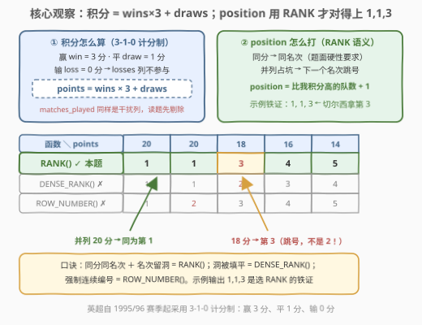
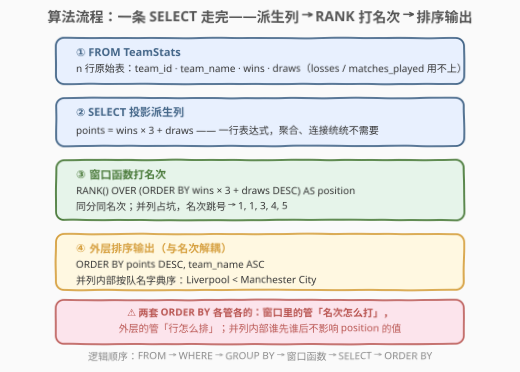
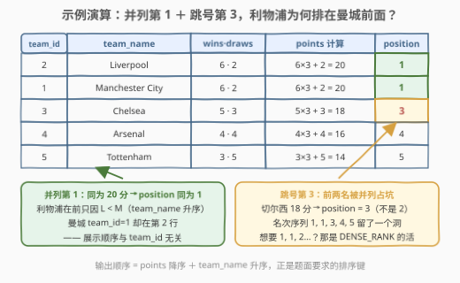

# 英超积分榜排名

- **题目名称**：英超积分榜排名
- **链接**：[3246. 英超积分榜排名 🔒](https://leetcode.cn/problems/premier-league-table-ranking/)
- **难度**：简单
- **标签**：数据库、SQL、窗口函数、`RANK()`、派生列、多键排序、LeetCode 锁题

## 1. 题目概述

> ⚠️ 本题为 LeetCode 付费题（锁题），题意描述根据官方示例用例与外部资料重建，可能与官方题面有出入。（题面已与社区镜像 doocs/leetcode 的官方中文翻译交叉核对，示例输入输出与 GraphQL 接口返回一致，出入风险较低。）

**表结构**：`TeamStats`

| 列名 | 类型 |
|------|------|
| team_id | int |
| team_name | varchar |
| matches_played | int |
| wins | int |
| draws | int |
| losses | int |

- `team_id` 是这张表的唯一主键；
- 每行包含一支球队的 id、队名、已赛场次、胜场数、平局数与负场数。

**目标**：编写一个解决方案，计算联盟中每支球队的**得分**与**排名**。积分规则（英超自 1995/96 赛季启用的 **3-1-0 计分制**）：

- **赢局**得 `3` 分；
- **平局**得 `1` 分；
- **输局**得 `0` 分。

**注意**：积分相同的球队必须分配**相同的排名**。

返回结果表以 `points` **降序**排序，再以 `team_name` **升序**排序，输出列为 `team_id, team_name, points, position`。

**示例 1**：

```text
输入：
TeamStats 表：
+---------+-----------------+----------------+------+-------+--------+
| team_id | team_name       | matches_played | wins | draws | losses |
+---------+-----------------+----------------+------+-------+--------+
| 1       | Manchester City | 10             | 6    | 2     | 2      |
| 2       | Liverpool       | 10             | 6    | 2     | 2      |
| 3       | Chelsea         | 10             | 5    | 3     | 2      |
| 4       | Arsenal         | 10             | 4    | 4     | 2      |
| 5       | Tottenham       | 10             | 3    | 5     | 2      |
+---------+-----------------+----------------+------+-------+--------+

输出：
+---------+-----------------+--------+----------+
| team_id | team_name       | points | position |
+---------+-----------------+--------+----------+
| 2       | Liverpool       | 20     | 1        |
| 1       | Manchester City | 20     | 1        |
| 3       | Chelsea         | 18     | 3        |
| 4       | Arsenal         | 16     | 4        |
| 5       | Tottenham       | 14     | 5        |
+---------+-----------------+--------+----------+
```

**解释**：

- 曼城和利物浦均拿下 20 分（6 胜 × 3 分 + 2 平 × 1 分），并列第 1；
- 切尔西拿下 18 分（5 胜 × 3 分 + 3 平 × 1 分），位列第 **3**；
- 阿森纳 16 分第 4；热刺 14 分第 5。

> 💡 **审题关键**：① 切尔西的 `position = 3`——并列两队**占了前两个名次坑**，后续名次跳号，这是 **RANK** 而非 DENSE_RANK 的语义铁证；② 利物浦排在曼城之前**不是**因为 `team_id`（曼城才是 1），而是队名字典序 `Liverpool < Manchester City`——输出排序键是 `points DESC, team_name ASC`；③ `matches_played` 与 `losses` 自始至终不参与计算（输局 0 分），是典型的**干扰列**。

---

## 2. 解题思路

### 2.1 暴力思路：把表拉到应用层手动排名

最直觉的过程式做法：`SELECT * FROM TeamStats` 拉到内存 → 按 `wins*3+draws` 降序排序 → 逐行扫描，与前一队同分则沿用名次，否则名次 = 已扫行数 + 1 → 再按 `points DESC, team_name ASC` 排一次输出。

落到 SQL 里，等价于**相关子查询**逐行问一遍「比我积分高的队伍有几家」：

```sql
-- position = 比我分高的队伍数 + 1
SELECT ..., (SELECT COUNT(*) FROM TeamStats t2
             WHERE t2.wins*3 + t2.draws > t1.wins*3 + t1.draws) + 1 AS position
FROM TeamStats t1;
```

- **正确性**：这正是 RANK 的数学定义，能对；
- **效率**：每行都全表回扫一遍，$O(n^2)$；
- **别扭之处**：排名本质是「对同一个排序键的一次全局打号」，逐行回表问询把一件事拆成了 $n$ 件事。

> ⚠️ 暴力的根源是把「排名」当成每行各自的私有计算。突破口：排名是**整行集**在某个排序键下的属性——这正是窗口函数的本职。

### 2.2 核心观察：派生列积分 + `RANK()` 窗口



**观察 1（积分是派生列，不需要任何聚合）**：`points = wins*3 + draws` 在 `SELECT` 里一行表达式就能投影出来——无 `GROUP BY`、无 `JOIN`、无子查询。输局 0 分，`losses` 乘 0 不写；`matches_played` 与积分无关。SQL 题也考「不写无用计算」。

**观察 2（position 的语义 = RANK，铁证在示例里）**：把三兄弟套在同一积分序列 `[20, 20, 18, 16, 14]` 上：

| 函数 | 输出名次序列 | 名次是否跳号 | 对/错 |
|------|-------------|--------------|-------|
| `RANK()` | 1, 1, **3**, 4, 5 | 跳号（并列占坑） | ✅ 与示例一致 |
| `DENSE_RANK()` | 1, 1, **2**, 3, 4 | 不跳号 | ❌ 切尔西会是 2 |
| `ROW_NUMBER()` | 1, **2**, 3, 4, 5 | 强制连续 | ❌ 并列两队名次不同 |

题面「积分相同的球队必须分配相同的排名」排除 `ROW_NUMBER`；示例里切尔西拿 3 不是 2，排除 `DENSE_RANK`——「同分同名次 + 并列后名次跳号」正是 `RANK()` 的教科书语义。

**观察 3（两套 `ORDER BY` 各管各的）**：窗口里的 `ORDER BY points DESC` 只决定**名次怎么打**；`RANK()` 对排序键完全相等的行给同名次，并列内部谁先谁后**不影响任何输出值**。最终**展示顺序**由外层 `ORDER BY points DESC, team_name` 负责——利物浦与曼城同为 20 分、同为第 1，谁排在上面完全由外层排序说了算。

### 2.3 算法流程图



**逻辑执行步骤**：

| 步骤 | SQL 片段 | 作用 | 示例数据流 |
|------|----------|------|-----------|
| ① | `FROM TeamStats` | 读入 $n$ 行原始表 | 5 支球队 |
| ② | `wins * 3 + draws AS points` | 投影派生列 | 20, 20, 18, 16, 14 |
| ③ | `RANK() OVER (ORDER BY points DESC) AS position` | 按 points 降序打名次 | 1, 1, 3, 4, 5 |
| ④ | `ORDER BY points DESC, team_name` | 决定输出顺序 | Liverpool → Man City → Chelsea → Arsenal → Tottenham |

> 💡 逻辑执行顺序 `FROM → WHERE → GROUP BY → 窗口函数 → SELECT → ORDER BY`：窗口函数排在最外层 `ORDER BY` **之前**求值，所以「打名次」与「排输出」天然是两个独立阶段——名次算完后随便怎么重排行，`position` 的值都不变。

### 2.4 示例演算



**积分计算与排名**：

| team_id | team_name | wins · draws | points 计算 | position |
|---------|-----------|--------------|-------------|----------|
| 2 | Liverpool | 6 · 2 | $6\times3+2=20$ | **1** |
| 1 | Manchester City | 6 · 2 | $6\times3+2=20$ | **1** |
| 3 | Chelsea | 5 · 3 | $5\times3+3=18$ | **3** ⚠️ |
| 4 | Arsenal | 4 · 4 | $4\times3+4=16$ | 4 |
| 5 | Tottenham | 3 · 5 | $3\times3+5=14$ | 5 |

- **并列第 1**：利物浦与曼城同为 20 分，`position` 同为 1；利物浦排在第一行只因 `Liverpool < Manchester City`（字典序），与 `team_id` 无关——曼城 `team_id=1` 却屈居第二行；
- **跳号第 3**：前两名被并列占坑，切尔西 18 分的名次直接跳到 3（名次序列 `1,1,3,4,5` 留了一个洞）；
- **无关列**：五队 `matches_played`、`losses` 各不相同却毫无影响——积分只看 `wins` 与 `draws`。

---

## 3. 参考代码

### SQL（解法 A：`RANK()` 窗口函数，推荐）

```sql
# Write your MySQL query statement below
SELECT
    team_id,
    team_name,
    wins * 3 + draws AS points,
    RANK() OVER (ORDER BY wins * 3 + draws DESC) AS position
FROM TeamStats
ORDER BY points DESC, team_name;
```

> 💡 **写法要点**：
> - 窗口定义里**重复表达式** `wins * 3 + draws` 而不写别名 `points`——多数实现（含 MySQL 8.0）的窗口 `ORDER BY` 看不到同一层 `SELECT` 的别名（会报 `Unknown column`），别名只在最外层 `ORDER BY` 可用；
> - 最外层 `ORDER BY points DESC, team_name` 用别名没问题：它在 `SELECT` 之后求值；追求标准 SQL 可移植可写 `ORDER BY 3 DESC, 2`（第 3 列降序、第 2 列升序）；
> - `team_name` 升序即字典序比较，`Liverpool < Manchester City` 由 MySQL 默认 collation 决定。

### SQL（解法 B：相关子查询——RANK 的定义式，免窗口函数）

```sql
# Write your MySQL query statement below
SELECT
    team_id,
    team_name,
    wins * 3 + draws AS points,
    (SELECT COUNT(*)
     FROM TeamStats t2
     WHERE t2.wins * 3 + t2.draws > t1.wins * 3 + t1.draws) + 1 AS position
FROM TeamStats t1
ORDER BY points DESC, team_name;
```

> 💡 **写法要点**：
> - `position` = **严格比我积分高的队伍数 + 1**，正是 RANK 的数学定义：同分者互不计数 → 天然同名次；下一档的名次 = 前面所有行数 + 1 → 天然跳号，语义与 `RANK()` 完全等价；
> - 适用场景：MySQL 5.x 等无窗口函数的老引擎、或面试官明确「不许用窗口函数」时的保底写法；
> - 代价：每行相关子查询回扫全表，$O(n^2)$；判题数据规模小无所谓，生产环境大表慎用。

### Python（pandas）

```python
import pandas as pd


def calculate_team_standings(team_stats: pd.DataFrame) -> pd.DataFrame:
    team_stats["points"] = team_stats["wins"] * 3 + team_stats["draws"]
    team_stats["position"] = (
        team_stats["points"].rank(method="min", ascending=False).astype(int)
    )
    return (
        team_stats.sort_values(["points", "team_name"], ascending=[False, True])[
            ["team_id", "team_name", "points", "position"]
        ]
        .reset_index(drop=True)
    )
```

> 💡 **pandas 对照**（付费题无官方函数签名，函数名按题名约定，以站点模板为准）：
> - `rank(method="min", ascending=False)` 就是 `RANK() OVER (ORDER BY points DESC)`：`ascending=False` 从高分往低数，`method="min"` 让并列取最小名次——两者合起来正是「同分同名次 + 跳号」；
> - `rank` 返回 `float`，`astype(int)` 转回整数与输出对齐；
> - 若要 `DENSE_RANK` 换 `method="dense"`，要 `ROW_NUMBER` 换 `method="first"`——三个参数对照第 5.1 节。

---

## 4. 复杂度分析

设 $n$ 为 `TeamStats` 行数。

| 维度 | 复杂度 | 说明 |
|------|--------|------|
| **时间（解法 A）** | $O(n \log n)$ | 窗口按 points 排序一次 + 输出排序一次，均为比较排序上界 |
| **时间（解法 B）** | $O(n^2)$ | 每行相关子查询全表回扫计数 |
| **空间** | $O(n)$ | 窗口函数物化中间结果 / 输出缓冲 |

> - 两趟排序理论上可共享一序（先按 `(points DESC, team_name ASC)` 排好再打名次），但优化器是否合并与写法无关，量级不变；
> - 判题数据规模（联赛球队数）极小，任何写法都瞬时通过——本题考点是**语义**而非性能。

---

## 5. 扩展

### 5.1 排名三兄弟速查：什么时候用哪个

| 函数 | `[20,20,18,16,14]` | 名次特点 | 典型语义 |
|------|-------------------|----------|----------|
| `RANK()` | 1, 1, 3, 4, 5 | 并列同名次，**留洞** | 体育榜/竞赛榜：并列占坑，第 3 名真的「前面有两支队」 |
| `DENSE_RANK()` | 1, 1, 2, 3, 4 | 并列同名次，**不留洞** | 「第几档」计数：Top-N **不同**薪水、成绩分档 |
| `ROW_NUMBER()` | 1, 2, 3, 4, 5 | 强制连续唯一 | 分页编号、每组任取一行（配 `PARTITION BY`） |

> 💡 判断口诀：**业务上「并列算几个人」用 RANK，「并列算一档」用 DENSE_RANK，「不许并列」用 ROW_NUMBER**。奥运金牌榜、F1 积分榜同分并列（RANK）与本题同源；185 题取「前三高的薪水」是 DENSE_RANK 的招牌应用。

### 5.2 系列题与真实英超规则

本题是一个三部曲的开篇，后两作在同一张 `TeamStats` 表上逐层加码：

- [3252. 英超积分榜排名 II](https://leetcode.cn/problems/premier-league-table-ranking-ii/)（中等）：在 `points`/`position` 之上再加 `tier` 三档划分（名次前 33% 为 Tier 1、中 33% 为 Tier 2、后 34% 为 Tier 3，边界平局进高档）——需要 `COUNT(*) OVER ()` 求总队数 + `CEIL` + `CASE WHEN`；
- [3322. 英超积分榜排名 III](https://leetcode.cn/problems/premier-league-table-ranking-iii/)（中等）：继续叠加维度；
- **真实英超**的同分 tie-break 链是：积分 → 净胜球 → 进球数 → 相互战绩……本题数据没有进球列，简化为「同分同名次」——工程里遇到真实榜单需求时，把 tie-break 键追加进窗口 `ORDER BY` 即可（如 `ORDER BY points DESC, goal_diff DESC`），骨架完全不变。

---

## 6. 面试要点

1. **为什么选 `RANK()` 而不是 `DENSE_RANK()` / `ROW_NUMBER()`？**

   > 三者对 `[20, 20, 18]` 分别给出 `1,1,3`、`1,1,2`、`1,2,3`。题面「积分相同的球队必须分配相同的排名」排除 `ROW_NUMBER`；示例输出切尔西 `position=3`（并列占坑后跳号）排除 `DENSE_RANK`——「同分同名次 + 名次跳号」唯一对应 `RANK()`。**从示例输出反推函数语义**是排名题的基本功。

2. **两套 `ORDER BY` 各自管什么？能只写一个吗？**

   > 窗口里的 `ORDER BY` 决定「名次怎么打」，外层的决定「行怎么展示」。不能只写窗口的：`RANK()` 不改变行的输出顺序，MySQL 不保证窗口排序后的行序被保留；也不能只写外层的：名次必须在窗口里按 points 打。两者作用于不同阶段（窗口求值在 `SELECT` 内、输出排序在其后），删掉任何一个都会错。

3. **窗口 `ORDER BY` 里为什么写 `wins * 3 + draws` 而不是别名 `points`？**

   > 窗口定义在 `SELECT` 列表求值阶段解析，此时多数实现（含 MySQL 8.0）不允许引用同一层的输出别名，会报 `Unknown column 'points' in 'window order'`；而最外层 `ORDER BY` 在 `SELECT` 之后求值，别名可用。可移植写法：窗口里重复表达式（本题如此），或先在 CTE 里算好 `points` 再开窗口。外层若追求严格标准 SQL，可用列号 `ORDER BY 3 DESC, 2`。

4. **不用窗口函数怎么实现？**

   > 用 RANK 的定义式：`position = (严格比我积分高的行数) + 1`，相关子查询逐行计数即得；同分者互不计数所以天然同名次，跳号自动出现。等价改写还有自连接 `JOIN t2 ON t2.score > t1.score` + `GROUP BY` + `COUNT`。代价 $O(n^2)$，是老引擎或「禁窗口」面试条件下的保底手段。

5. **利物浦为什么排在曼城前面？`team_id=1` 的不是曼城吗？**

   > 输出排序键是 `team_name` 升序（字典序），`Liverpool < Manchester City`，与 `team_id` 无关。这类「排序键与直觉列不一致」（顺手按 id 排序就错）以及干扰列（`matches_played`/`losses` 不参与计算）都是 SQL 报表题的**审题考点**——写之前先圈出题目明说的排序键与计算列。

> 💡 **一句话总结**：3246 = 派生列 `wins*3 + draws` + `RANK() OVER (ORDER BY points DESC)` + 外层 `ORDER BY points DESC, team_name`。示例输出 `1,1,3` 锁死 RANK 语义；窗口与外层两套 `ORDER BY` 一套打名次、一套管展示；相关子查询「比我分高的队数 + 1」是它的免窗口镜像。

---

## 7. 同类练习题

- [178. 分数排名](https://leetcode.cn/problems/rank-scores/)（[站内题解](../0101-0200/178_分数排名.md)）：`RANK()` 窗口函数的母题——同一套「同分同名次」骨架，无干扰列
- [2175. 世界排名的变化](https://leetcode.cn/problems/the-change-in-global-rankings/)（[站内题解](../2101-2200/2175_世界排名的变化.md)）：双 `RANK()` 差分算排名变化，排名语义的进阶应用
- [185. 部门工资前三高的所有员工](https://leetcode.cn/problems/department-top-three-salaries/)（[站内题解](../0101-0200/185_部门工资前三高的所有员工.md)）：`DENSE_RANK() ≤ N` 取组内 Top-N——对照 5.1 节「不留洞」分支
- [2377. 整理奥运表](https://leetcode.cn/problems/sort-the-olympic-table/)（[站内题解](../2301-2400/2377_整理奥运表.md)）：多键排序的体育奖牌榜，同为「榜单输出」题材
- [3252. 英超积分榜排名 II](https://leetcode.cn/problems/premier-league-table-ranking-ii/)：本题直接续作——在 `points`/`position` 之上再加三档 `tier` 划分
