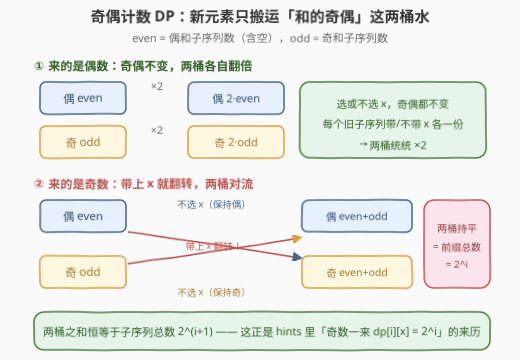
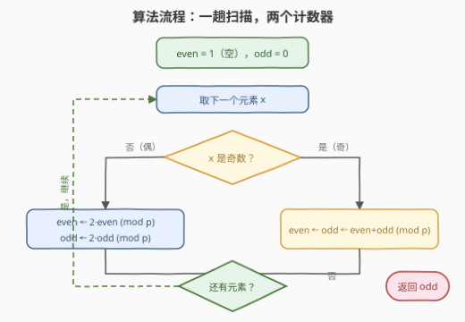
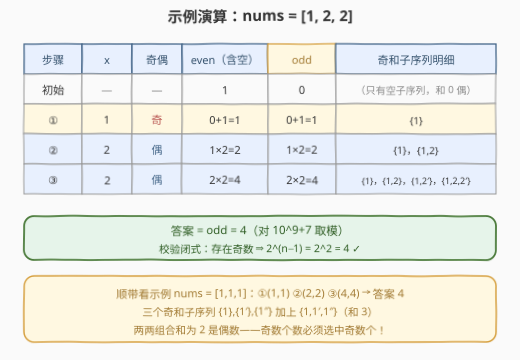
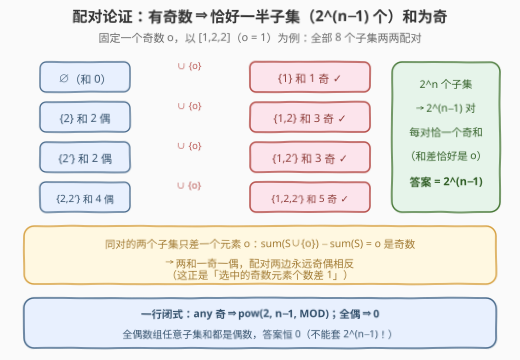

# 奇数和子序列的数量

- **题目名称**：奇数和子序列的数量
- **链接**：[3247. 奇数和子序列的数量](https://leetcode.cn/problems/number-of-subsequences-with-odd-sum/)
- **难度**：中等
- **标签**：数组、数学、动态规划、组合数学

## 1. 题目概述

> ⚠️ 本题为 LeetCode 付费题，题意描述根据官方示例用例与 hints 重建，可能与官方题面有出入。

给你一个整数数组 `nums`，返回其中**和为奇数**的**非空子序列**的数目。由于答案可能很大，请对 $10^9 + 7$ 取模后返回。

**示例 1**：

```text
输入：nums = [1,1,1]
输出：4
解释：奇和子序列有 {a₁}、{a₂}、{a₃} 与 {a₁,a₂,a₃}（和为 3），
     共 4 个；任取两个 1 的子序列和为 2，是偶数，不计入。
```

**示例 2**：

```text
输入：nums = [1,2,2]
输出：4
解释：奇和子序列有 {1}、{1,2}、{1,2′}、{1,2,2′}（和 1、3、3、5），
     共 4 个。
```

**约束条件**（依 hints 与规模重建，可能有出入）：

- $1 \le nums.length \le 10^5$
- $1 \le nums[i] \le 10^9$

> 💡 读题关键：① **子序列**不要求连续、只要求保序——子集计数问题，$n$ 达 $10^5$ 时 $2^n$ 级枚举想都别想；② 求和只关心**奇偶性**，而奇偶性是 $\bmod 2$ 的世界：和的奇偶**只由选中的奇数元素个数**决定；③ 空子序列的和为 $0$（偶），题目要求非空——好在空子序列永远进不了「奇和」的桶，这个边界自动安全。官方 hints 指向一个逐前缀的奇偶计数 DP：`dp[i][0]` / `dp[i][1]` 分别记录前缀 `[0, i]` 中偶和 / 奇和子序列的个数。

---

## 2. 解题思路

### 2.1 暴力思路：枚举全部子集

枚举 $\{0,1\}^n$ 的每一种选取方案，逐个求和判奇偶：$O(2^n \cdot n)$。$n = 20$ 就要千万级操作，$n = 10^5$ 是天文数字。即使把「求和」优化成增量维护（DFS 回溯累计），状态数 $2^n$ 本身就是不可逾越的墙。

> ⚠️ 卡点：把「和」当数值来维护注定爆炸——**必须把和压缩成一个比特（奇偶性）**，状态才会从 $2^n$ 种「子集」坍缩成「按奇偶分桶的计数」。

### 2.2 核心观察：奇偶计数 DP——一个元素只搬运两个桶



**观察 1（奇偶性只看奇数元素的个数）**：$\mathrm{sum}(S) \equiv \big(\text{S 中奇数元素的个数}\big) \pmod 2$。偶数元素加多少都不改变奇偶。于是 dp 无需记数值，只需两个计数器：

- $even$：已处理前缀中，**和为偶数**的子序列个数（**含空子序列**，它的和是 $0$）；
- $odd$：**和为奇数**的子序列个数。

**观察 2（转移由新元素的奇偶完全决定）**：设新来元素 $x$，旧子序列 $S$ 要么不选 $x$（奇偶不变），要么选上（和增加 $x$）：

- $x$ 为**偶**：选不选都不改变奇偶 → 每个旧子序列在两桶中各复制一份：$(even, odd) \to (2\,even,\ 2\,odd)$；
- $x$ 为**奇**：不选则奇偶不变，选上则**翻转** → 新偶桶 $=$ 旧偶（不选）$+$ 旧奇（选上翻转），新奇桶 $=$ 旧奇（不选）$+$ 旧偶（选上翻转），两桶对流后相等：$(even, odd) \to (even+odd,\ even+odd)$。

这正是官方 hints 的递推：`dp[i][0]`（偶）/`dp[i][1]`（奇）在 `nums[i]` 为偶时翻倍（`dp[i][x] = dp[i-1][x] * 2`），为奇时双双等于前缀子序列总数 $2^i$（`dp[i][x] = 2^i`）；边界 `dp[0][0] = 2, dp[0][1] = 0`（首元素为偶）或 `dp[0][0] = 1, dp[0][1] = 1`（首元素为奇），区别只在空子序列那只桶。

> 💡 **为什么 $even$ 要计入空子序列**：让「不选 $x$」的分支天然落在 $even$ 桶里，转移无需任何特判；若 $even$ 不含空子序列，每轮转移都要手工加减修正，边界极易出错。这也解释了 hints 里那句 "(since an empty subsequence has an even sum)"。

### 2.3 算法流程图



初始化 $(even, odd) = (1, 0)$，一趟扫描：偶数来了两桶翻倍，奇数来了两桶对流，全程取模；扫描结束 $odd$ 即答案。每个元素 $O(1)$。

### 2.4 示例演算



以 `nums = [1,2,2]` 走一遍：初始 $(even, odd) = (1, 0)$；$x=1$ 奇 → $(1, 1)$，奇和子序列 $\{1\}$；$x=2$ 偶 → $(2, 2)$，新增 $\{1,2\}$；$x=2$ 偶 → $(4, 4)$，新增 $\{1,2'\},\{1,2,2'\}$。最终答案 $odd = 4$，与示例一致。顺带一提，`[1,1,1]` 同样算出 $4$——三个「选一个」加一个「全选」。

---

## 3. 参考代码

> ⚠️ 付费题无法获取官方函数签名，方法名按英文题名惯例写作 `subsequenceCount`，实际提交时以官方签名为准。

### C++

```cpp
class Solution {
  public:
    int subsequenceCount(vector<int>& nums) {
        const long long MOD = 1e9 + 7;
        long long even = 1, odd = 0;                      // 空子序列和为 0，记进偶桶
        for (int x : nums) {
            if (x & 1) even = odd = (even + odd) % MOD;    // 奇数：两桶对流，双双等于总数
            else {
                even = even * 2 % MOD;                    // 偶数：奇偶不变，两桶翻倍
                odd = odd * 2 % MOD;
            }
        }
        return (int)odd;                                  // 非空奇和子序列个数
    }
};
```

### Python

```python
class Solution:
    def subsequenceCount(self, nums: List[int]) -> int:
        MOD = 10 ** 9 + 7
        even, odd = 1, 0                  # 空子序列和为 0，记进偶桶
        for x in nums:
            if x & 1:
                even = odd = (even + odd) % MOD   # 奇数：两桶对流
            else:
                even = even * 2 % MOD             # 偶数：两桶翻倍
                odd = odd * 2 % MOD
        return odd
```

> 💡 实现细节：① 初始 $(even, odd) = (1, 0)$ 而非 $(0, 0)$，那只空子序列是「不选任何元素」分支的锚点；② 先算 `even + odd` 再同时赋值，避免用旧值覆盖后污染另一桶；③ Python 大数不溢出，C++ 每步 `% MOD` 即可，计数全程 $< 2 \times 10^9$ 用 `long long` 稳妥。

---

## 4. 复杂度分析

| 维度 | 复杂度 | 说明 |
|------|--------|------|
| 时间复杂度 | $O(n)$ | 一趟扫描，每元素 $O(1)$ 转移 + 取模 |
| 空间复杂度 | $O(1)$ | 只有 `even` / `odd` 两个滚动计数器 |
| 暴力对照 | $O(2^n \cdot n)$ | 逐子集求和判奇偶，$n > 20$ 即不可行 |

实测：$n = 10^5$ 随机数据两语言均在毫秒级完成；另与 $O(2^n)$ 暴力对拍 2000 组随机小数据（$n \le 10$）全部一致。

---

## 5. 扩展：配对论证的一行闭式 $2^{n-1}$



DP 已经是 $O(n)$，但本题还有更狠的**组合恒等式**：只要数组里存在**至少一个奇数** $o$，答案就是

$$2^{n-1} \bmod (10^9+7)$$

**配对证明**：固定一个奇数 $o$，把全部 $2^n$ 个子集按「是否含 $o$」两两配对——$S \leftrightarrow S \cup \{o\}$，恰得 $2^{n-1}$ 对。同对两个子集的和只差 $o$（奇数），奇偶性**必然相反**，于是每对恰贡献一个奇和子集，合计 $2^{n-1}$ 个。反过来，若数组**全是偶数**，任何子集和都是偶数，答案为 $0$——这个特判不能省。

```python
class Solution:
    def subsequenceCount(self, nums: List[int]) -> int:
        MOD = 10 ** 9 + 7
        return pow(2, len(nums) - 1, MOD) if any(x & 1 for x in nums) else 0
```

> 💡 这个闭式也回头照亮了 DP 的不变量：奇数元素一到，两桶立即持平在 $2^i$——因为从那以后「含 / 不含某个奇数」的配对结构就已经成立，奇和子集恒占前缀子集总数的一半。若把题目改成「和为**偶数**的非空子序列」，同样的配对给出 $2^{n-1} - 1$（要抠掉空子序列；全偶数组则为 $2^n - 1$），思路完全平移。

---

## 6. 面试要点

1. **为什么和的奇偶性只取决于选中的奇数元素个数？**

   - $\mathrm{sum}(S) \equiv \#\{\text{奇数元素} \in S\} \pmod 2$：模 $2$ 意义下偶数贡献 $0$、奇数贡献 $1$，加法只累加这些 $0/1$。这是把「数值求和」降维成「一个比特」的根基。

2. **两个桶分别装什么？`even` 为什么必须含空子序列？**

   - `even` 装偶和子序列个数（**含空**，和为 $0$），`odd` 装奇和个数。含空子序列使「不选新元素」的分支天然落在 `even`，转移式干净无特判；去掉它每一步都要手工加减修正。空子序列和为偶，永不污染 `odd`，与非空要求不冲突。

3. **奇数元素到来时，为什么两桶都变成 $even + odd$？**

   - 不选 $x$：旧子序列原样保留（旧偶留偶、旧奇留奇）；选 $x$：奇偶翻转（旧偶变奇、旧奇变偶）。新奇桶 $=$ 旧奇（不选）$+$ 旧偶（选上翻转）$=$ 旧偶 $+$ 旧奇，新偶桶对称同理。两桶相等且等于前缀子序列总数 $2^i$——hints 的 `dp[i][x] = 2^i` 即此。

4. **闭式 $2^{n-1}$ 的配对证明怎么讲？为什么全偶要特判？**

   - 固定任一奇数 $o$，子集按「是否含 $o$」完美配对成 $2^{n-1}$ 对，同对两和相差奇数 $o$、奇偶必反，每对恰一个奇和。全偶数组没有奇数可配对，任意子集和皆偶，答案 $0$，不能套用 $2^{n-1}$。

5. **改成「和为奇数的子数组（连续）」怎么做？**

   - 子数组 $(i, j]$ 的和 $= pre[j] - pre[i]$，为奇 $\iff$ 两个前缀和异奇偶。统计前缀和（含 $pre[0]=0$）中偶、奇个数 $E, O$，答案 $= E \times O$——恰是 [1524. 和为奇数的子数组数目](https://leetcode.cn/problems/number-of-sub-arrays-with-odd-sum/)。子序列按「元素奇偶」分桶，子数组按「前缀和奇偶」分桶，一个盯元素、一个盯前缀，是这组姊妹题的分水岭。

---

## 7. 同类练习题

- [1524. 和为奇数的子数组数目](https://leetcode.cn/problems/number-of-sub-arrays-with-odd-sum/)（[站内题解](../1501-1600/1524_和为奇数的子数组数目.md)）：本题的**连续子数组版**，前缀和奇偶配对计数，面试要点 5 的完整展开
- [930. 和相同的二元子数组](https://leetcode.cn/problems/binary-subarrays-with-sum/)（[站内题解](../0901-1000/930_和相同的二元子数组.md)）：前缀和 + 哈希计数模板，「按前缀分桶」思路的进阶版
- [1863. 所有子集的异或总和再求和](https://leetcode.cn/problems/sum-of-all-subset-xor-totals/)（[站内题解](../1801-1900/1863_所有子集的异或总和.md)）：同属「全体子集按位统计」家族，位贡献 $\times 2^{n-1}$ 与本题闭式同源
- [494. 目标和](https://leetcode.cn/problems/target-sum/)（[站内题解](../0401-0500/494_目标和.md)）：子集选取带符号计数，转化为 0-1 背包，另一条「子集计数」主线
