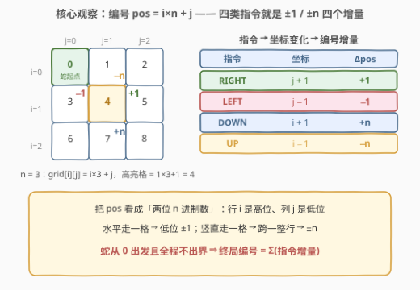
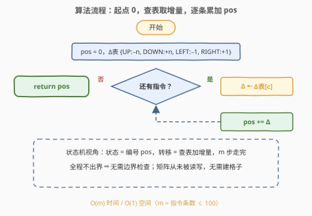
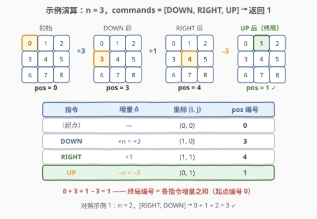

# 矩阵中的蛇

- **题目名称**：矩阵中的蛇
- **链接**：[3248. 矩阵中的蛇](https://leetcode.cn/problems/snake-in-matrix/)
- **难度**：简单
- **标签**：数组、字符串、模拟

## 1. 题目概述

大小为 $n \times n$ 的矩阵 `grid` 中有一条蛇，可以朝四个方向移动。矩阵每个单元格用编号标识：$grid[i][j] = i \times n + j$（**行优先**编号，左上角是 0）。

蛇从单元格 0 出发，依次执行字符串数组 `commands` 中的指令（`"UP"` / `"RIGHT"` / `"DOWN"` / `"LEFT"` 各移动一格）。题目**保证**蛇在整个移动过程中始终位于边界内。返回执行完所有指令后蛇所停留的最终单元格编号。

**示例 1**：

```text
输入：n = 2, commands = ["RIGHT","DOWN"]
输出：3
解释：0 →右→ 1 →下→ 3。
```

**示例 2**：

```text
输入：n = 3, commands = ["DOWN","RIGHT","UP"]
输出：1
解释：0 →下→ 3 →右→ 4 →上→ 1。
```

**约束**：$2 \le n \le 10$，$1 \le commands.length \le 100$，指令仅由四种方向字符串组成，测评数据保证不越界。

> 💡 **审题关键**：① 编号公式 $grid[i][j] = i \times n + j$ 说明矩阵里其实**没有任何内容**——它只是一张编号表，题目真正模拟的对象只有「位置」；② 数据保证不出界，连边界检查都可以省；③ 要求返回的是**编号**而非坐标，但两者可通过公式互相换算。

---

## 2. 解题思路

### 2.1 暴力思路：维护 (i, j) 坐标，逐条翻译指令

最直接的做法：把蛇抽象成坐标 $(i, j)$，从 $(0, 0)$ 出发，每条指令移动一格：

- `UP`：$i - 1$；`DOWN`：$i + 1$；`LEFT`：$j - 1$；`RIGHT`：$j + 1$

执行完所有指令后按公式 $i \times n + j$ 折算成编号返回。这个做法已经是 $O(m)$（$m$ 为指令条数），但它维护了**两个**变量、最后还要做一次乘加折算——坐标在这里只是「中间货币」。编号公式提示我们：也许可以直接在编号上做加减？

### 2.2 核心观察：编号即坐标，指令即增量



**观察 1（编号是「两位 n 进制数」）**：$pos = i \times n + j$ 恰好把 (行, 列) 当作 (高位, 低位) 拼成一个两位 $n$ 进制数——行 $i$ 是高位，列 $j$ 是低位。

**观察 2（四类指令 = 四个增量）**：

| 指令 | 坐标变化 | 编号变化 |
|------|----------|----------|
| `RIGHT` | $j+1$ | $+1$ |
| `LEFT` | $j-1$ | $-1$ |
| `DOWN` | $i+1$ | $+n$ |
| `UP` | $i-1$ | $-n$ |

水平移动只动**低位**（$\pm 1$），竖直移动恰好**跨一整行**（$\pm n$）。

**观察 3（起点为 0 ⇒ 答案 = 增量之和）**：蛇从编号 0 出发且全程不出界（保证列的增减不跨行边界、编号永不「串行」），于是最终编号就是各指令增量依次累加的结果：

$$\text{final} = \sum_{c \in \text{commands}} \Delta(c), \qquad \Delta(c) = \begin{cases} +n, & c = \text{DOWN} \\ -n, & c = \text{UP} \\ +1, & c = \text{RIGHT} \\ -1, & c = \text{LEFT} \end{cases}$$

> ⚠️ 直接累加的前提是**不出界**：若允许列从 $n-1$ 再右移，编号 $+1$ 会「串」到下一行行首——数值上看似合法，位置上却不存在。本题数据保证不出界，所以增量可以无脑累加；若改成可能越界，就必须退回坐标版做边界检查（见第 5 节扩展）。

### 2.3 算法流程图



| 步骤 | 操作 | 作用 |
|------|------|------|
| ① 初始化 | `pos = 0`，建增量表 {UP:−n, DOWN:+n, LEFT:−1, RIGHT:+1} | 状态机：状态 = 编号，转移 = 查表 |
| ② 逐条执行 | 对每条指令 `c`：`pos += Δ[c]` | 一趟遍历完成全部移动 |
| ③ 返回 | `return pos` | 免去坐标 ↔ 编号的最后折算 |

### 2.4 示例演算



| 步骤 | 指令 | 增量 $\Delta$ | 坐标 $(i, j)$ | pos |
|------|------|---------------|----------------|-----|
| 初始 | — | — | $(0, 0)$ | 0 |
| 1 | `DOWN` | $+n = +3$ | $(1, 0)$ | 3 |
| 2 | `RIGHT` | $+1$ | $(1, 1)$ | 4 |
| 3 | `UP` | $-n = -3$ | $(0, 1)$ | 1 |

$0 + 3 + 1 - 3 = 1$，返回 1。示例 1 同理：$0 + 1 + 2 = 3$。

对照两列可以发现：**坐标版与编号版每一步都严格等价**——坐标版维护 $(i, j)$ 最后折算，编号版直接维护折算结果本身；既然每条指令的增量都能直接加在编号上，中间过程的坐标就是多余的。

---

## 3. 参考代码

### C++（坐标版：直观模拟）

```cpp
class Solution {
public:
    int finalPositionOfSnake(int n, vector<string>& commands) {
        int i = 0, j = 0;
        for (string& c : commands) {
            if      (c == "UP")   --i;
            else if (c == "DOWN") ++i;
            else if (c == "LEFT") --j;
            else                  ++j;
        }
        return i * n + j;
    }
};
```

### C++（编号版：查表累加）

```cpp
class Solution {
public:
    int finalPositionOfSnake(int n, vector<string>& commands) {
        int pos = 0;
        for (auto& c : commands)
            pos += (c == "UP")   ? -n :
                   (c == "DOWN") ?  n :
                   (c == "LEFT") ? -1 : 1;
        return pos;
    }
};
```

### Python（一行查表版）

```python
class Solution:
    def finalPositionOfSnake(self, n: int, commands: List[str]) -> int:
        delta = {"UP": -n, "DOWN": n, "LEFT": -1, "RIGHT": 1}
        return sum(delta[c] for c in commands)
```

> 💡 起点编号为 0，`sum(增量)` 直接就是答案；若扩展到起点不固定（见第 5 节），加上起点编号即可。

---

## 4. 复杂度分析

| 维度 | 复杂度 | 说明 |
|------|--------|------|
| **时间** | $O(m)$ | $m = commands.length \le 100$，每条指令 $O(1)$ 查表累加 |
| **空间** | $O(1)$ | 仅一个整型 `pos`（增量表只有 4 个常数项） |

---

## 5. 扩展：出界不保证 / 起点不固定时会怎样

- **可能越界**：增量直加失效（编号会串行），需退回 $(i, j)$ 坐标版，每步检查 $0 \le i < n$、$0 \le j < n$，越界指令按题意跳过或判非法——这就接近 [874. 模拟行走机器人](https://leetcode.cn/problems/walking-robot-simulation/) 的骨架（外加障碍物哈希判停）。
- **要返回坐标而非编号**：一步 `divmod` 换算 $i,\ j = pos \//\ n,\ pos \bmod n$。
- **映射的通用性**：$pos = i \times n + j$ 正是 [74. 搜索二维矩阵](https://leetcode.cn/problems/search-a-2d-matrix/) 中「二维一维化」的映射——把二维矩阵当一维有序数组做二分，`mid` 折算回 $(mid \//\ n,\ mid \bmod n)$ 再比较。同一个公式，一边服务于模拟，一边服务于二分。
- **顺序无关性**：$\text{final} = \sum \Delta$ 是纯代数事实，由加法交换律可知指令重排不改变终局编号；但「中间状态不出界」依赖原顺序，换序后某些中间位置可能越界——**数据合法性保证与代数恒等式是两回事**。

---

## 6. 面试要点

1. **为什么不需要真的建 $n \times n$ 矩阵？**

   矩阵从未被读写，它只是编号公式 $i \times n + j$ 的可视化背景；真正被模拟的对象只有「位置」这一个状态，$n \le 10$ 的小矩阵是纯粹的烟雾弹。

2. **编号直加为什么正确？越界时会错在哪？**

   水平 $\pm 1$、竖直 $\pm n$ 恰是编号的每步变化量；不出界保证列的增减不跨行边界。若可越界，例如列 $j = n-1$ 时再右移，编号 $+1$ 会跳到下一行行首——数值上「看起来合法」，位置上却不存在。

3. **指令的顺序影响最终结果吗？**

   终局编号 = 增量总和，由加法交换律与顺序无关；但中间是否越界与顺序有关，题目只对**给定顺序**给出不出界保证。

4. **如果要求返回 $(i, j)$ 而不是编号？**

   `i, j = divmod(pos, n)`（坐标版则直接返回），两个方向的换算都是 $O(1)$。

5. **这道题面试里考察什么？**

   抽象建模能力：把「蛇 + 矩阵 + 指令串」剥离成「初值 + 状态转移表 + 累加」的最小状态机；顺带检验对编号公式（二维一维化映射）的敏感度。

---

## 7. 同类练习题

- [874. 模拟行走机器人](https://leetcode.cn/problems/walking-robot-simulation/)：坐标增量模拟 + 朝向旋转 + 障碍物哈希，本题的「全副武装」版
- [1041. 困于环中的机器人](https://leetcode.cn/problems/robot-bounded-in-circle/)：指令序列执行后的终态分析——方向余量决定能否回到原点
- [74. 搜索二维矩阵](https://leetcode.cn/problems/search-a-2d-matrix/)：同一个 $pos = i \times n + j$ 映射的另一种用法——二维一维化做二分
- [1266. 访问所有点的最小时间](https://leetcode.cn/problems/minimum-time-visiting-all-points/)：平面坐标步进模拟，切比雪夫距离求最少步数
