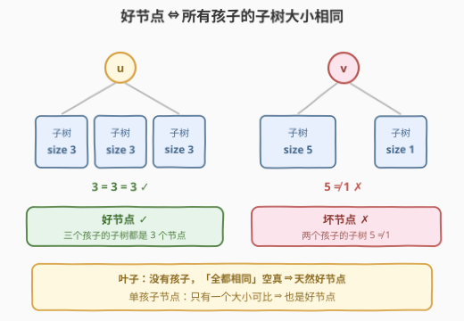
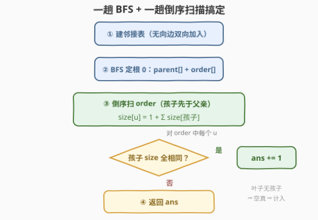
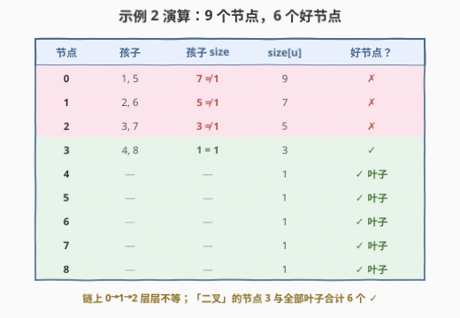

# 统计好节点的数目

- **题目名称**：统计好节点的数目
- **链接**：[3249. 统计好节点的数目](https://leetcode.cn/problems/count-the-number-of-good-nodes/)
- **难度**：中等
- **标签**：树、深度优先搜索

## 1. 题目概述

给你一棵**无向**树，包含 $n$ 个节点，按 $0$ 到 $n-1$ 标记，根节点为 $0$。边数组 `edges` 长度为 $n-1$，其中 `edges[i] = [ai, bi]` 表示节点 $a_i$ 与 $b_i$ 之间存在一条边。

如果一个节点的**所有子节点为根的子树包含的节点数相同**，则认为该节点是一个**好节点**。返回给定树中好节点的数量。

**子树**指的是一个节点以及它所有后代节点构成的一棵树。

**示例 1**：

```text
输入：edges = [[0,1],[0,2],[1,3],[1,4],[2,5],[2,6]]
输出：7
解释：树的所有节点都是好节点。
```

**示例 2**：

```text
输入：edges = [[0,1],[1,2],[2,3],[3,4],[0,5],[1,6],[2,7],[3,8]]
输出：6
解释：树中有 6 个好节点（节点 3、4、5、6、7、8）。
```

**示例 3**：

```text
输入：edges = [[0,1],[1,2],[1,3],[1,4],[0,5],[5,6],[6,7],[7,8],[0,9],[9,10],[9,12],[10,11]]
输出：12
解释：除了节点 9 以外其他所有节点都是好节点。
```

**约束条件**：

- $2 \le n \le 10^5$
- `edges.length == n - 1`
- `edges[i].length == 2`
- $0 \le a_i, b_i < n$
- 输入确保 `edges` 表示一棵有效的树

> 💡 读题关键：判定对象是**以每个孩子为根的子树大小**，与节点权值无关；「没有孩子」的叶子在空集合上「全都相同」自然成立，**天然是好节点**——示例 1 的答案 7（全部节点）正印证了这一点。

---

## 2. 解题思路

### 2.1 暴力思路：逐节点重新数子树

最直白的做法：对每个节点 $u$，把它当作根，对每个孩子方向各跑一遍 DFS 数节点数，再核对是否全相同。单点 $O(n)$，总计 $O(n^2) = 10^{10}$，$n \le 10^5$ 直接超时。

> ⚠️ 卡点：所有节点共用同一棵以 $0$ 为根的树，子树大小只需**自底向上算一遍**就能全体复用——这正是后序 DFS 的本职工作。

### 2.2 核心观察：一次后序遍历，「算 size」与「验均匀」同趟完成



定义 $\mathrm{size}[u]$ 为以 $u$ 为根的子树节点数，满足后序递推：

$$\mathrm{size}[u] = 1 + \sum_{c \,\in\, \mathrm{children}(u)} \mathrm{size}[c] \qquad (\text{叶子为 } 1)$$

而 $u$ 是否好节点，只看孩子 size 的多重集 $\{\mathrm{size}[c]\}$ 是否**所有元素相等**。两件事都只依赖「孩子的 size」，可以合并在同一趟后序里：

- **累加**：$\mathrm{size}[u] = 1 + \sum \mathrm{size}[c]$；
- **判定**：拿第一个孩子的 size 当基准，其余孩子逐一比较，全相等则 `ans++`。

叶子无孩子，基准不存在，判定**空真**（vacuously true），直接计入答案。

**正确性**：树以 $0$ 为根定向后，「孩子」集合由 `parent[]` 唯一确定（邻居中去掉父亲），与输入边序无关；$\sum_u |\mathrm{children}(u)| = n-1$，每个孩子只被枚举一次，判定与累加的总代价线性。

### 2.3 算法流程图



流程共四步：

1. 建邻接表（无向边双向加入）；
2. 从 $0$ 出发 BFS：求出 `parent[]` 与层序 `order`（迭代写法，防链状树递归爆栈）；
3. **倒序**扫 `order`（$\approx$ 后序，孩子先于父亲）：对每个 $u$ 累加得 `size[u]`，同时以首个孩子为基准比对，全相同则 `ans++`；
4. 返回 `ans`。

与换根 DP（如 [3241. 标记所有节点需要的时间](https://leetcode.cn/problems/time-taken-to-mark-all-nodes/)）需要正逆两趟不同，本题信息只自下而上流动，**一趟倒序扫描**足矣。

### 2.4 示例演算

以示例 2 演算：`edges = [[0,1],[1,2],[2,3],[3,4],[0,5],[1,6],[2,7],[3,8]]`，以 $0$ 为根定向后：



| 节点 | 孩子 | 孩子 size | size[u] | 好节点 |
|------|------|-----------|---------|--------|
| 0 | 1, 5 | 7, 1 | 9 | ✗ |
| 1 | 2, 6 | 5, 1 | 7 | ✗ |
| 2 | 3, 7 | 3, 1 | 5 | ✗ |
| 3 | 4, 8 | 1, 1 | 3 | ✓ |
| 4 | — | — | 1 | ✓ |
| 5 | — | — | 1 | ✓ |
| 6 | — | — | 1 | ✓ |
| 7 | — | — | 1 | ✓ |
| 8 | — | — | 1 | ✓ |

答案 $6$ ✓。一条链挂在 $0$、$1$、$2$ 上层层「7≠1、5≠1、3≠1」，恰好最底下「二叉」的节点 3 与全部叶子是好节点。

---

## 3. 参考代码

### C++

```cpp
class Solution {
  public:
    int countGoodNodes(vector<vector<int>>& edges) {
        int n = edges.size() + 1;
        vector<vector<int>> g(n);
        for (auto& e : edges) {
            g[e[0]].push_back(e[1]);
            g[e[1]].push_back(e[0]);
        }

        vector<int> parent(n, -1), order;
        order.reserve(n);
        order.push_back(0);
        for (int i = 0; i < n; i++) {          // BFS：父指针 + 层序（迭代防爆栈）
            int u = order[i];
            for (int v : g[u])
                if (v != parent[u]) {
                    parent[v] = u;
                    order.push_back(v);
                }
        }

        vector<int> size(n, 1);
        int ans = 0;
        for (int i = n - 1; i >= 0; i--) {     // 倒层序 ≈ 后序：孩子先于父亲
            int u = order[i];
            int base = -1;
            bool good = true;
            for (int v : g[u]) {
                if (v == parent[u]) continue;
                size[u] += size[v];
                if (base == -1) base = size[v];          // 首个孩子定基准
                else if (size[v] != base) good = false;
            }
            ans += good;                      // 叶子：无孩子，空真，计入
        }
        return ans;
    }
};
```

### Python

```python
class Solution:
    def countGoodNodes(self, edges: List[List[int]]) -> int:
        n = len(edges) + 1
        g = [[] for _ in range(n)]
        for a, b in edges:
            g[a].append(b)
            g[b].append(a)

        parent = [-1] * n
        order = [0]
        for u in order:                          # BFS：父指针 + 层序（迭代防爆栈）
            for v in g[u]:
                if v != parent[u]:
                    parent[v] = u
                    order.append(v)

        size = [1] * n
        ans = 0
        for u in reversed(order):                # 倒层序 ≈ 后序：孩子先于父亲
            base = -1
            good = True
            for v in g[u]:
                if v == parent[u]:
                    continue
                size[u] += size[v]
                if base == -1:                   # 首个孩子定基准
                    base = size[v]
                elif size[v] != base:
                    good = False
            ans += good                          # 叶子：无孩子，空真，计入
        return ans
```

> 💡 细节盘点：Python 的 `for u in order` 边遍历边 `append` 是合法技巧（for 循环按索引推进），等价于 BFS 队列；`base = -1` 作哨兵安全——size 恒 $\ge 1$，不会与真实值撞车；`ans += good` 把布尔直接当 0/1 累加，叶子无需特判。

---

## 4. 复杂度分析

| 维度 | 复杂度 | 说明 |
|------|--------|------|
| 时间复杂度 | $O(n)$ | 建表 + BFS + 一趟倒序扫描，每条边各访问常数次 |
| 空间复杂度 | $O(n)$ | 邻接表 + parent/order + size 共 3 个 $n$ 级结构 |
| 暴力对照 | $O(n^2)$ | 逐节点重新数子树，$n = 10^5$ 时超时 |

---

## 5. 扩展：整除捷径的陷阱与「子树大小」家族

- **整除捷径是个陷阱**：$u$ 为好节点 $\Rightarrow k \cdot s = \mathrm{size}[u] - 1$（$k$ 个孩子、每个大小 $s$），于是有人想用「$(\mathrm{size}[u]-1) \bmod k = 0$」偷懒——这只是**必要条件**：孩子大小 $\{1,1,3,3\}$ 时 $\mathrm{size}[u]-1 = 8$、$k=4$，整除成立但大小并不相同。判定必须逐孩子核对。
- **子树大小家族**：[2049. 统计最高分的节点数目](https://leetcode.cn/problems/count-nodes-with-the-highest-score/) 同样一次后序求出全部子树大小，只是还要拼上「父亲方向的剩余部分」；[1519. 子树中标签相同的节点数](https://leetcode.cn/problems/number-of-nodes-in-the-sub-tree-with-the-same-label/) 把「大小」换成 26 维标签计数做后序合并。骨架完全一致：**一趟自底向上，边聚合边判定**。
- **若要对每个根都数一遍好节点**：size 随根变化（换根后原父方向变成一棵子树），单次后序不再够用，进入换根 DP 领域——参见 [834. 树中距离之和](https://leetcode.cn/problems/sum-of-distances-in-tree/) 与 [3241. 标记所有节点需要的时间](https://leetcode.cn/problems/time-taken-to-mark-all-nodes/) 的两趟扫描骨架。

---

## 6. 面试要点

1. **叶子节点为什么是好节点？**

   - 「所有孩子的子树大小相同」是对**空集合**的全称命题，空集合上恒真（vacuous truth）。单孩子节点只有一个大小、无可比较，也必然是好节点。

2. **为什么倒序扫 BFS 层序等价于后序？**

   - BFS 序中孩子必排在父亲之后；倒序后孩子先于父亲处理，处理到 $u$ 时全部孩子的 size 已就绪，恰好复刻后序「先孩子后父亲」的信息流向。

3. **递归 DFS 有什么风险？**

   - $n \le 10^5$ 且树可退化为链，递归深度 $10^5$：Python 默认上限 1000 直接 `RecursionError`，C++ 深递归同样可能爆栈。BFS 层序 + 倒序循环是最稳的迭代替代。

4. **「$(\mathrm{size}[u]-1)$ 能被孩子数整除」能否替代逐孩子比较？**

   - 不能，整除只是必要条件。反例：孩子大小 $\{1,1,3,3\}$，总和 8、孩子数 4，$8 \bmod 4 = 0$ 但并非全相同。

5. **本题与换根 DP 的边界在哪里？**

   - 本题固定以 $0$ 为根，「孩子」集合由 parent 数组唯一确定，信息只需自下而上一趟；一旦答案依赖**每个**可能的根，size 会随根漂移，就必须 down/up 两趟（换根 DP）。

---

## 7. 同类练习题

- [2049. 统计最高分的节点数目](https://leetcode.cn/problems/count-nodes-with-the-highest-score/)：一次后序求全部子树大小，再补「上方剩余部分」，size 家族近亲
- [1519. 子树中标签相同的节点数](https://leetcode.cn/problems/number-of-nodes-in-the-sub-tree-with-the-same-label/)：后序合并 26 维计数数组，子树统计入门
- [1443. 收集树上所有苹果的最少时间](https://leetcode.cn/problems/minimum-time-to-collect-all-apples-in-a-tree/)：后序聚合「子树是否有苹果」决定是否下钻
- [3241. 标记所有节点需要的时间](https://leetcode.cn/problems/time-taken-to-mark-all-nodes/)：同款「BFS 序 + 倒序扫描」骨架的换根 DP 进阶
