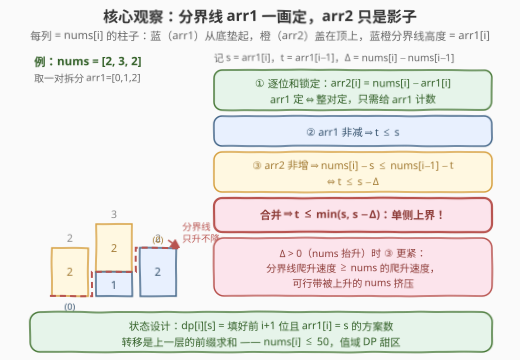
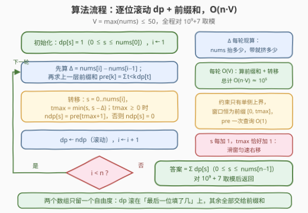
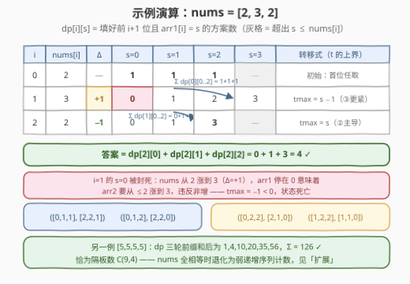

# LeetCode 单调数组对的数目 I 题解

## 1. 题目概述

- **标题 / 题号**：单调数组对的数目 I（#3250，hard）
- **链接**：https://leetcode.cn/problems/find-the-count-of-monotonic-pairs-i/
- **难度**：困难
- **标签**：数组、数学、动态规划、组合数学、前缀和

**题意**：给你一个长度为 $n$ 的**正**整数数组 `nums`。如果两个**非负**整数数组 $(arr1, arr2)$ 满足以下条件，我们称它们是**单调**数组对：

- 两个数组的长度都是 $n$。
- $arr1$ 是单调**非递减**的，即 $arr1[0] \le arr1[1] \le \dots \le arr1[n-1]$。
- $arr2$ 是单调**非递增**的，即 $arr2[0] \ge arr2[1] \ge \dots \ge arr2[n-1]$。
- 对于所有的 $0 \le i \le n-1$ 都有 $arr1[i] + arr2[i] = nums[i]$。

请你返回所有**单调**数组对的数目。由于答案可能很大，请对 $10^9 + 7$ **取余**后返回。

**示例 1**：

```text
输入：nums = [2,3,2]
输出：4
解释：单调数组对包括：
     ([0, 1, 1], [2, 2, 1])
     ([0, 1, 2], [2, 2, 0])
     ([0, 2, 2], [2, 1, 0])
     ([1, 2, 2], [1, 1, 0])
```

**示例 2**：

```text
输入：nums = [5,5,5,5]
输出：126
```

**约束**：

- $1 \le n = nums.length \le 2000$
- $1 \le nums[i] \le 50$

> 💡 读题关键：① 逐位和锁定 $arr1[i] + arr2[i] = nums[i]$——**arr2 完全由 arr1 决定**，一对数组只剩一个自由度；② 两条单调方向相反，直觉上互相打架，但它们都只约束**相邻两位的差**，是逐位局部条件，天然适合 DP；③ $nums[i] \le 50$、$n \le 2000$——值域极小，暗示把「最后一位填了几」当状态的**值域 DP**；④ 计数 + 取模，标准的 DP 计数信号。

## 2. 解题思路

### 2.1 暴力思路：逐位枚举 arr1

既然 arr2 是影子，暴力就枚举 arr1：每一位在 $[0, nums[i]]$ 里试一个值（arr2 随之确定），DFS 边填边校验两条单调性，走满 $n$ 位计数 $+1$。最坏组合数 $\prod_i (nums[i]+1) \le 51^{2000}$——指数爆炸，剪枝救不了状态空间本身。

> ⚠️ 卡点：以为要「同时安排」两个数组、双倍状态。其实逐位和锁定后 arr2 没有任何自由度，**只需给 arr1 计数**；而约束逐位局部、无后效性——正解必是 DP 计数。

### 2.2 核心观察：arr1 定则 arr2 定——双单调坍缩成一条增量下界



**观察 1（arr2 是影子）**：由 $arr1[i] + arr2[i] = nums[i]$ 得 $arr2[i] = nums[i] - arr1[i]$。选定 arr1 的每一位，整对数组就唯一确定——**数 arr1 的合法填法 = 数单调数组对**。

**观察 2（两条单调合并成单侧上界）**：记 $s = arr1[i]$，$t = arr1[i-1]$，$\Delta = nums[i] - nums[i-1]$（nums 的抬升量）：

- $arr1$ 非减 $\iff t \le s$；
- $arr2$ 非增 $\iff nums[i] - s \le nums[i-1] - t \iff t \le s - \Delta$；
- 合并：$t \le \min(s,\ s - \Delta)$。

两条约束**方向相同**——都是对前一位取值的**上界**！几何直觉见左图：把每个 $nums[i]$ 画成一根柱子，蓝色（arr1）从底部垫起、橙色（arr2）盖在顶上，蓝橙**分界线的高度就是 $arr1[i]$**。分界线只能不降（②），且 nums 抬升 $\Delta > 0$ 时分界线必须至少跟着抬 $\Delta$（③）——nums 涨得越快，可行带被挤压得越窄。示例中 $i=1$ 时 $s=0$ 的死路正是这个挤压：nums 从 2 涨到 3，arr1 停在 0 意味着 arr2 要从 $\le 2$ 涨到 3，违反非增。

**观察 3（值域甜区 + 前缀和）**：定义

$$dp[i][s] = \text{填好前 } i+1 \text{ 位、且 } arr1[i] = s \text{ 的合法 arr1 个数}$$

- **初始**：$dp[0][s] = 1$（$0 \le s \le nums[0]$）——首位无前驱，任取；
- **转移**：$dp[i][s] = \sum_{t=0}^{\min(s,\ s-\Delta)} dp[i-1][t]$，上界 $< 0$ 时为 $0$；
- **答案**：$\sum_{s} dp[n-1][s]$（$0 \le s \le nums[n-1]$）。

关键在转移的结构：合并约束只有**单侧上界**、没有下界——前一位的值越小越安全（历史包袱越轻），所以窗口恒为前缀 $[0, t_{\max}]$。预处理上一层的前缀和 $pre[k] = \sum_{t < k} dp[i-1][t]$ 后，每个状态一次 $O(1)$ 查询即得。更有趣的是 $s$ 每加 $1$，$t_{\max}$ 恰好加 $1$——滑窗匀速右移，这正是前缀和最舒服的形态。

### 2.3 算法流程图



初始化首位任取，之后逐位滚动：每轮先算 $\Delta$、再对上一层求前缀和，然后逐状态用 $t_{\max} = \min(s, s-\Delta)$ 截窗口转移，全程取模；跑满 $n$ 位后对末层求和返回。每轮 $O(V)$（$V = \max(nums)$），总计 $O(n \cdot V) \approx 10^5$。

### 2.4 示例演算



以 `nums = [2,3,2]` 走一遍：

| $i$ | $nums[i]$ | $\Delta$ | $dp$ 行（$s = 0, 1, 2, 3$） | 转移式 |
|-----|-----------|----------|------------------------------|--------|
| 0 | 2 | — | $1, 1, 1$ | 初始：首位任取 |
| 1 | 3 | $+1$ | $0, 1, 2, 3$ | $t_{\max} = \min(s, s-1) = s-1$（③更紧） |
| 2 | 2 | $-1$ | $0, 1, 3$ | $t_{\max} = \min(s, s+1) = s$（②主导） |

$i=1$ 这轮最能看清挤压：$\Delta = +1$ 把窗口整体压低一位，$s=0$ 时 $t_{\max} = -1 < 0$，状态直接死亡；而 $s=3$ 恰好收下整层前缀和 $1+1+1 = 3$。末层求和 $0+1+3 = 4$，与示例给出的四个数组对一一对应。顺带一提，`[5,5,5,5]` 算出 $126$，恰好是隔板数 $\binom{9}{4}$——这个彩蛋见「扩展」。

## 3. 参考代码

### C++

```cpp
class Solution {
  public:
    int countOfPairs(vector<int>& nums) {
        const long long MOD = 1e9 + 7;
        const int V = *max_element(nums.begin(), nums.end());
        vector<long long> dp(V + 1, 0), ndp(V + 1, 0), pre(V + 2, 0);
        for (int s = 0; s <= nums[0]; s++) dp[s] = 1;            // 首位无前驱：任取
        for (int i = 1; i < (int)nums.size(); i++) {
            for (int s = 0; s <= V; s++)                         // 上一层的前缀和
                pre[s + 1] = (pre[s] + dp[s]) % MOD;
            const int delta = nums[i] - nums[i - 1];             // nums 的抬升量
            fill(ndp.begin(), ndp.end(), 0);
            for (int s = 0; s <= nums[i]; s++) {
                int tmax = min(s, s - delta);                    // 双约束合并的上界
                if (tmax >= 0) ndp[s] = pre[tmax + 1];           // 窗口恒为 [0, tmax]
            }
            swap(dp, ndp);                                       // 滚动
        }
        long long ans = 0;
        for (int s = 0; s <= nums.back(); s++) ans = (ans + dp[s]) % MOD;
        return (int)ans;
    }
};
```

### Python

```python
class Solution:
    def countOfPairs(self, nums: List[int]) -> int:
        MOD = 10 ** 9 + 7
        V = max(nums)
        dp = [1] * (nums[0] + 1) + [0] * (V - nums[0])   # 首位无前驱：任取
        for i in range(1, len(nums)):
            pre = [0] * (V + 2)                          # 上一层的前缀和
            for s in range(V + 1):
                pre[s + 1] = (pre[s] + dp[s]) % MOD
            delta = nums[i] - nums[i - 1]                # nums 的抬升量
            ndp = [0] * (V + 1)
            for s in range(nums[i] + 1):
                tmax = min(s, s - delta)                 # 双约束合并的上界
                if tmax >= 0:
                    ndp[s] = pre[tmax + 1]               # 窗口恒为 [0, tmax]
            dp = ndp                                     # 滚动
        return sum(dp[: nums[-1] + 1]) % MOD
```

> 💡 实现细节：① `V` 用 `max(nums)` 动态取、数组按值域开——同一份代码**原样能过 3251**（值域 1000）；② `pre` 开到 `V + 2` 长度，查询统一写成 `pre[tmax + 1]`，`tmax = -1` 时先判 `>= 0` 再查，避免负下标；③ 转移只依赖上一层，两个数组交替滚动即可；④ 每个中间值都取模，C++ 用 `long long` 防溢出，Python 无忧。

## 4. 复杂度分析

| 维度 | 复杂度 | 说明 |
|------|--------|------|
| 时间复杂度 | $O(n \cdot V)$ | 每轮 $O(V)$ 算前缀和 + $O(V)$ 转移，$V = \max(nums) \le 50$，总计 $\approx 10^5$ |
| 空间复杂度 | $O(V)$ | 滚动数组只留上一层 + 前缀和 |
| 朴素 DP 对照 | $O(n \cdot V^2)$ | 每状态 $O(V)$ 枚举 $t$；$V = 50$ 时 $5 \times 10^6$ 尚可，$V = 1000$（3251）时 $2 \times 10^9$ 超时 |
| 暴力枚举对照 | $O(51^n)$ | 逐位组合枚举 arr1，$n > 20$ 即不可行 |

实测：与 DFS 暴力对拍 3000+ 组随机小数据（$n \le 9$，$nums[i] \le 12$）全部一致；两个示例均通过；$n = 2000$ 最坏规模仅 $10^5$ 级操作，毫秒完成。

## 5. 扩展：姊妹题 3251 与全相等时的闭式

**姊妹题 [3251. 单调数组对的数目 II](https://leetcode.cn/problems/find-the-count-of-monotonic-pairs-ii/)**：约束变为 $1 \le nums[i] \le 1000$（$n$ 仍为 2000）。值域一放大，朴素 $O(n V^2) = 2 \times 10^9$ 必然超时——前缀和优化从「锦上添花」变成「生死线」，降到 $O(nV) = 2 \times 10^6$ 轻松通过。本页代码动态取 $V$、数组按值域开，**一行不改直接提交 3251**。

**全相等时的闭式**：若 $nums$ 恒为 $V$（$\Delta \equiv 0$），合并约束退化为纯非减 $t \le s$，问题变成「$0 \le a_0 \le a_1 \le \dots \le a_{n-1} \le V$ 的序列计数」——从 $\{0, 1, \dots, V\}$ 中可重复地取 $n$ 个数的方案数，隔板法立得

$$\binom{n + V}{V}$$

验证示例 2：$n = 4$，$V = 5$，$\binom{9}{4} = 126$ ✓。一旦 nums 有起伏，两侧的「墙」开始移动，闭式失效，回到 DP。（若值域大到无法开数组，还可利用「每层 dp 的支撑集是一段连续区间」做端点离散化——带状 DP 的通用保命招，本题用不上。）

## 6. 面试要点

1. **为什么只数 arr1 就够了？arr2 去哪了？**

   - 逐位和 $arr1[i] + arr2[i] = nums[i]$ 把 arr2 完全钉死：$arr2[i] = nums[i] - arr1[i]$。一对数组的自由度只剩 arr1，arr2 的两条合法性要求全部转写成对 arr1 的约束，问题坍缩为单序列计数。

2. **两条方向相反的单调性，怎么合并成一条转移约束？**

   - 记 $s = arr1[i]$，$t = arr1[i-1]$，$\Delta = nums[i] - nums[i-1]$：非减给 $t \le s$，非增给 $nums[i] - s \le nums[i-1] - t \iff t \le s - \Delta$。两条都是对 $t$ 的**上界**，取 $\min$ 即可。$\Delta > 0$（nums 抬升）时第二条更紧——分界线爬升速度必须跟上 nums。

3. **转移为什么能 O(1)？窗口下界为什么永远是 0？**

   - 合并约束只有单侧上界、没有下界——前值越小越安全，窗口恒为前缀 $[0, t_{\max}]$。预处理上一层前缀和 $pre[k] = \sum_{t<k} dp[i-1][t]$，一次查询 $O(1)$；且 $s \to s+1$ 时 $t_{\max}$ 恰好 $+1$，滑窗匀速右移。

4. **初始化和最终答案为什么长那样？**

   - 首位无前驱，唯一约束是 $0 \le a_0 \le nums[0]$，每个 $s$ 恰一种取法 → $dp[0][s] = 1$；末位无后继，任何 $s \le nums[n-1]$ 都完整对应一个合法对 → 直接求和。只有中间位才受双约束夹击。

5. **值域放大（3251 的 $nums[i] \le 1000$）怎么办？dp 为什么能滚动？**

   - 朴素每状态枚举 $t$ 是 $O(nV^2) = 2 \times 10^9$，必须前缀和降到 $O(nV)$。转移只读上一层、写本层，两组数组交替即可滚动，空间 $O(V)$ 与 $n$ 无关。

## 同类练习题

| # | 题目 | 与本题的关联 |
|---|------|-------------|
| 3251 | [单调数组对的数目 II](https://leetcode.cn/problems/find-the-count-of-monotonic-pairs-ii/) | 值域放大到 1000 的姊妹题，逼出前缀和优化——本页代码原样可过 |
| 3129 | [找出所有稳定的二进制数组 I](https://leetcode.cn/problems/find-all-possible-stable-binary-arrays-i/)（[站内题解](../3101-3200/3129_找出所有稳定的二进制数组I.md)） | 同为 I/II 姊妹结构的计数 DP，用前缀和砍掉一维枚举 |
| 940 | [不同的子序列 II](https://leetcode.cn/problems/distinct-subsequences-ii/)（[站内题解](../0901-1000/940_不同的子序列II.md)） | dp 按「末尾字符」分层，转移恰是上一层求和——同款前缀和优化 |
| 837 | [新 21 点](https://leetcode.cn/problems/new-21-game/)（[站内题解](../0801-0900/837_新21点.md)） | 值域上滑动窗口求和的教科书，本题窗口只有上端在动，它两端都在动 |
| 1220 | [统计元音字母序列的数目](https://leetcode.cn/problems/count-vowels-permutation/)（[站内题解](../1201-1300/1220_统计元音字母序列的数目.md)） | 值域 DP 计数的入门款（值域只有 5 个元音），体会「状态开在值上」的通用套路 |
