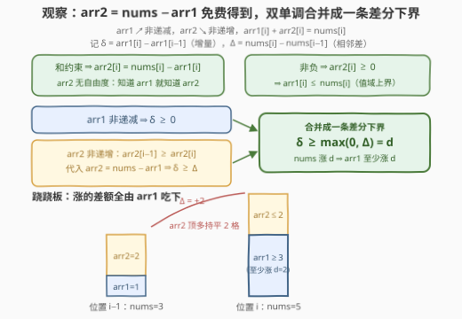
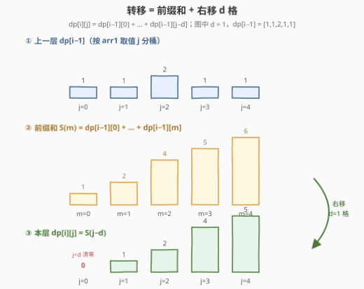
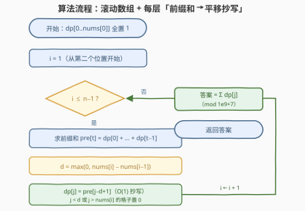
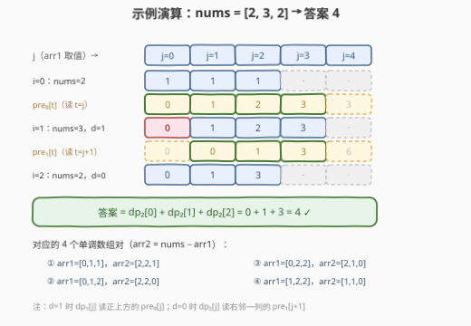

# 单调数组对的数目 II

- **题目名称**：单调数组对的数目 II
- **链接**：[3251. 单调数组对的数目 II](https://leetcode.cn/problems/find-the-count-of-monotonic-pairs-ii/)
- **难度**：困难
- **标签**：数组、数学、动态规划、组合数学、前缀和

## 1. 题目概述

给你一个长度为 $n$ 的**正**整数数组 `nums`。如果两个**非负**整数数组 $(arr1, arr2)$ 满足以下条件，我们称它们是**单调**数组对：

- 两个数组的长度都是 $n$；
- `arr1` 单调**非递减**：$arr1[0] \le arr1[1] \le \cdots \le arr1[n-1]$；
- `arr2` 单调**非递增**：$arr2[0] \ge arr2[1] \ge \cdots \ge arr2[n-1]$；
- 对所有 $0 \le i \le n-1$ 都有 $arr1[i] + arr2[i] = nums[i]$。

请返回所有单调数组对的数目。由于答案可能很大，请将它对 $10^9 + 7$ **取余**后返回。

**示例 1**：

```text
输入：nums = [2,3,2]
输出：4
解释：单调数组对包括：
     1. ([0,1,1], [2,2,1])
     2. ([0,1,2], [2,2,0])
     3. ([0,2,2], [2,1,0])
     4. ([1,2,2], [1,1,0])
```

**示例 2**：

```text
输入：nums = [5,5,5,5]
输出：126
```

**约束条件**：

- $1 \le n = nums.length \le 2000$
- $1 \le nums[i] \le 1000$

> 💡 读题关键：① 和约束 $arr1[i] + arr2[i] = nums[i]$ 说明 **arr2 完全由 arr1 决定**——$arr2[i] = nums[i] - arr1[i]$，「数对」计数其实是**单序列计数**；② 两条单调约束方向相反，看似要同时盯两个数组，实则可以合并成对 arr1 相邻**增量**的一条下界约束；③ $nums[i] \le 1000$ 是明示的复杂度甜区——把「arr1 当前取值」作为 DP 的一维，$n \times 1000 = 2 \times 10^6$ 状态量刚刚好。

---

## 2. 解题思路

### 2.1 暴力思路：逐位枚举 arr1

arr1 每一位可以在 $[0, nums[i]]$ 里任取，DFS 全部组合、逐位验证两条单调性：$O\big(\prod_i (nums[i]+1)\big)$，最坏 $1001^{2000}$ 种组合，纯天文数字。即使边填边剪枝（前缀已非法就回溯），剪掉的只是「已经非法」的分支，合法前缀仍会指数膨胀——必须把「前缀的合法性」聚合成可转移的状态。

### 2.2 核心观察：arr2 免费得到，双单调合并成一条差分下界



**观察 1（arr2 是 arr1 的影子）**：由和约束 $arr2[i] = nums[i] - arr1[i]$，arr2 不引入任何自由度；它非负还顺手给出值域上界 $arr1[i] \le nums[i]$。

**观察 2（两条单调约束合并）**：记增量 $\delta_i = arr1[i] - arr1[i-1]$、相邻差 $\Delta_i = nums[i] - nums[i-1]$：

- arr1 非递减 $\Rightarrow \delta_i \ge 0$；
- arr2 非递增 $\Rightarrow nums[i-1] - arr1[i-1] \ge nums[i] - arr1[i] \Rightarrow \delta_i \ge \Delta_i$。

两者合并成一条**差分下界**：

$$\delta_i \ge \max(0, \Delta_i) = d_i$$

> 💡 跷跷板直观：arr1 与 arr2 是一条跷跷板的两端，支点高度是 nums。nums 上涨时，arr2 那端只许降不许升——上涨的差额必须**全部由 arr1 吃下**，所以 $d_i > 0$ 时 arr1 至少涨 $d_i$；nums 持平或下降时 $d_i = 0$，约束只剩非递减本身。

**DP 设计**：$dp[i][j]$ = 已填好前 $i+1$ 个位置、$arr1[i] = j$ 的方案数（$0 \le j \le nums[i]$）：

- **初始**：$dp[0][j] = 1$（$0 \le j \le nums[0]$）——首位任取；
- **转移**：$dp[i][j] = \sum_{k=0}^{j - d_i} dp[i-1][k]$，其中 $k$ 是上一位置 arr1 的取值；$j < d_i$ 时和式为空，$dp[i][j] = 0$；
- **答案**：$\sum_{j=0}^{nums[n-1]} dp[n-1][j]$。

转移式是「$k \le j - d_i$」的**一段前缀和**。预处理 $pre[t] = \sum_{k=0}^{t-1} dp[i-1][k]$（$pre[0] = 0$，不含端点 $t$），则

$$dp[i][j] = pre[j - d_i + 1]$$

每步转移 $O(1)$，整体 $O(n \cdot U)$，$U = \max(nums) \le 1000$。

**「平移」的直观**：把 $dp[i][j] = \sum_{k \le j-d_i} dp[i-1][k]$ 里的前缀和（含端点版 $S(m) = \sum_{k \le m} dp[i-1][k]$）看成一条曲线，则本层分布是它**整体右移 $d_i$ 格**的结果——nums 上涨越多，分布被推得越靠右、左侧被清零的格子越多；$d_i = 0$（持平或下降）时就是普通前缀和，分布向右「堆积」变高。



### 2.3 算法流程图



滚动一维数组：每层先算前缀和 `pre`，再按 $d_i$ 平移抄写回 `dp`，全程取模；$n$ 层做完对 `dp` 求和即答案。

### 2.4 示例演算



以 `nums = [2,3,2]` 走一遍（$U = 3$）：

- $i = 0$：$dp_0 = [1,1,1,\cdot]$（$j \le nums[0] = 2$）；
- $i = 1$：$\Delta = +1 \Rightarrow d = 1$，$pre_0 = [0,1,2,3,3]$，$dp_1[j] = pre_0[j]$：$dp_1 = [0,1,2,3]$——右移 1 格，$j = 0$ 清零；
- $i = 2$：$\Delta = -1 \Rightarrow d = 0$，$pre_1 = [0,0,1,3,6]$，$dp_2[j] = pre_1[j+1]$：$dp_2 = [0,1,3]$（$j \le 2$）；
- 答案 $= 0 + 1 + 3 = 4$ ✓。

`[5,5,5,5]` 顺带验证：$dp$ 依次演化为 $[1,1,1,1,1,1] \to [1,2,3,4,5,6] \to [1,3,6,10,15,21] \to [1,4,10,20,35,56]$，求和恰为 $126$ ✓（这串数字就是杨辉三角的一斜线，扩展一节揭晓缘由）。

---

## 3. 参考代码

### C++

```cpp
class Solution {
  public:
    int countOfPairs(vector<int>& nums) {
        constexpr long long MOD = 1e9 + 7;
        int n = nums.size(), U = *max_element(nums.begin(), nums.end());
        vector<long long> dp(U + 1), pre(U + 2);
        for (int j = 0; j <= nums[0]; ++j) dp[j] = 1;        // 首位任取 0..nums[0]
        for (int i = 1; i < n; ++i) {
            for (int j = 0; j <= U; ++j)                     // dp 的前缀和（不含端点）
                pre[j + 1] = (pre[j] + dp[j]) % MOD;
            int d = max(0, nums[i] - nums[i - 1]);           // arr1 至少要涨 d
            fill(dp.begin(), dp.end(), 0);
            for (int j = d; j <= nums[i]; ++j)               // j<d 无解；j>nums[i] 则 arr2 为负
                dp[j] = pre[j - d + 1];
        }
        long long ans = 0;
        for (long long v : dp) ans = (ans + v) % MOD;
        return (int)ans;
    }
};
```

### Python

```python
class Solution:
    def countOfPairs(self, nums: List[int]) -> int:
        MOD = 10 ** 9 + 7
        U = max(nums)
        dp = [1] * (nums[0] + 1) + [0] * (U - nums[0])       # 首位任取
        for i in range(1, len(nums)):
            pre = [0] * (U + 2)                              # dp 的前缀和（不含端点）
            for j, v in enumerate(dp):
                pre[j + 1] = (pre[j] + v) % MOD
            d = max(0, nums[i] - nums[i - 1])                # arr1 至少要涨 d
            dp = [pre[j - d + 1] if d <= j <= nums[i] else 0
                  for j in range(U + 1)]
        return sum(dp) % MOD
```

> 💡 实现细节：① `pre` 用「不含端点」定义（$pre[t]$ 恰是前 $t$ 项之和，$pre[0]=0$），配 $dp[i][j] = pre[j-d+1]$ 全程零边界特判；② 每层先整层清 0，再抄写 $j \in [d, nums[i]]$——$j < d$（增量不够）与 $j > nums[i]$（arr2 变负）两类非法值自然归零，上一层的越界 0 也随前缀和自动传播；③ $n = 1$ 时循环不执行，答案 $nums[0] + 1$（首位任取），边界自洽。

---

## 4. 复杂度分析

| 维度 | 复杂度 | 说明 |
|------|--------|------|
| 时间复杂度 | $O(n \cdot U)$ | 每层一趟前缀和 + 一趟抄写，$U = \max(nums) \le 1000$，总量 $\le 2 \times 10^6$ |
| 空间复杂度 | $O(U)$ | 滚动 `dp` + 前缀和 `pre` 两个一维数组 |
| 暴力对照 | $O\big(\prod_i (nums[i]+1)\big)$ | 最坏 $1001^{2000}$，剪枝也压不平指数 |

实测（本机）：$n = 2000$、$nums[i]$ 全取 $1000$ 的极端用例，C++ 约 10ms、Python 约 0.4s；另与 DFS 暴力对拍随机小数据（$n \le 6$，$nums[i] \le 8$）650 组全部一致。

---

## 5. 扩展：全相等数组的组合闭式与支撑区间裁剪

**闭式（交叉验证利器）**：当 $nums = [c, c, \ldots, c]$ 全相等时，$d_i \equiv 0$，约束退化为「arr1 非递减、值域 $[0, c]$」——这正是**多重集组合**（隔板法）：长度 $n$、取值 $[0,c]$ 的非递减序列个数

$$\binom{n + c}{n}$$

$[5,5,5,5]$：$\binom{9}{4} = 126$ ✓；演算中那串 $[1,4,10,20,35,56]$ 正是杨辉三角第 9 行的前半段。用阶乘 + 乘法逆元预处理可 $O(n + c)$ 直接算出，是检验 DP 实现的好对拍器（本文的极端用例即用它验证）。

**支撑区间裁剪**：$dp[i]$ 的非零区间（支撑）恰为 $[\ell_i,\ nums[i]]$（若左端越过右端则区间为空，答案为 0），其中 $\ell_i = \max(0,\ \ell_{i-1} + d_i)$——下界随「累计净上涨量」右移，上界随 nums 回落左收。每层只扫支撑区间，最坏仍是 $O(nU)$，但大起大落的数据能省掉大量空格子；对 $U \le 1000$ 的本题属于锦上添花。

**与 3250 的关系**：[3250. 单调数组对的数目 I](https://leetcode.cn/problems/find-the-count-of-monotonic-pairs-i/) 是同一道题的弱化版（$nums[i] \le 50$），「I / II」的区别只在值域上界，本节的 $O(nU)$ 解法一份代码通吃两题。

---

## 6. 面试要点

1. **为什么只需枚举 arr1，arr2 去哪了？**

   - 和约束 $arr1[i] + arr2[i] = nums[i]$ 把 $arr2[i]$ 定成 $nums[i] - arr1[i]$，不引入任何自由度；它非负还顺带给出 $arr1[i] \le nums[i]$ 的值域上界。双序列计数坍缩为单序列计数。

2. **两条方向相反的单调约束怎么合并成一条？**

   - 记 $\delta_i = arr1[i] - arr1[i-1]$、$\Delta_i = nums[i] - nums[i-1]$：arr1 非递减给 $\delta_i \ge 0$；arr2 非递增代入 $arr2 = nums - arr1$ 整理得 $\delta_i \ge \Delta_i$。合并为 $\delta_i \ge \max(0, \Delta_i)$——一条增量下界，nums 涨多少 arr1 至少涨多少。

3. **前缀和优化里的「平移」怎么理解？为什么不是普通前缀和？**

   - $dp[i][j] = \sum_{k \le j - d_i} dp[i-1][k]$：求和上限不是 $j$ 而是 $j - d_i$。把含端点前缀和 $S(m) = \sum_{k \le m} dp[i-1][k]$ 看成曲线，$dp[i][\cdot] = S(\cdot - d_i)$ 就是它右移 $d_i$ 格的形状——上涨层左侧清零 $d_i$ 格，持平/下降层（$d_i = 0$）退化为普通前缀和堆积。实现上用不含端点的 $pre[t] = \sum_{k<t} dp[i-1][k]$，则 $dp[i][j] = pre[j - d_i + 1]$，一步到位无特判。

4. **哪些状态恒为 0，为什么敢整层清零重写？**

   - 三个零来源：$j < d_i$（增量不足，无合法前驱）、$j > nums[i]$（arr2 为负）、上一层的越界 0（已在前一轮清零，经前缀和自动传播）。滚动数组每层先清零再抄写 $[d_i, nums[i]]$，三类一起处理，不会误留旧值。

5. **和 3250（单调数组对的数目 I）什么关系？还能更快吗？**

   - 同一道题，I 限制 $nums[i] \le 50$、II 放宽到 $\le 1000$，$O(nU)$ DP 一份代码通吃。进一步：dp 支撑区间 $[\ell_i, nums[i]]$ 随累计上涨量右移、随回落左收，按区间裁剪可跳过空格子；全相等数据另有组合闭式 $\binom{n+c}{n}$ 可 $O(n+c)$ 直出。

---

## 7. 同类练习题

- [3250. 单调数组对的数目 I](https://leetcode.cn/problems/find-the-count-of-monotonic-pairs-i/)：同一道题的约束弱化版（$nums[i] \le 50$），先用小值域练熟「差分下界 + 前缀和平移」再回来做本题
- [1735. 生成乘积数组的方案数](https://leetcode.cn/problems/count-ways-to-make-array-with-product/)（[站内题解](../1701-1800/1735_生成乘积数组的方案数.md)）：乘法维度的姊妹题——相邻元素整除关系 + 因子转移表计数 DP，同样是「相邻约束进状态」
- [2435. 矩阵中和能被 K 整除的路径](https://leetcode.cn/problems/paths-in-matrix-whose-sum-is-divisible-by-k/)（[站内题解](../2401-2500/2435_矩阵中和能被K整除的路径.md)）：网格计数 DP，约束（路径和余数）作为状态维度，同属取模计数家族
- [1444. 切披萨的方案数](https://leetcode.cn/problems/number-of-ways-of-cutting-a-pizza/)（[站内题解](../1401-1500/1444_切披萨的方案数.md)）：计数 DP + 前缀和优化——二维苹果数前缀和加速状态判定，前缀和服务计数的另一形态
