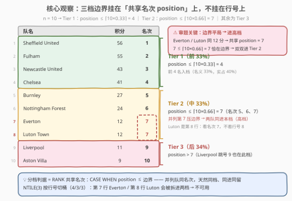
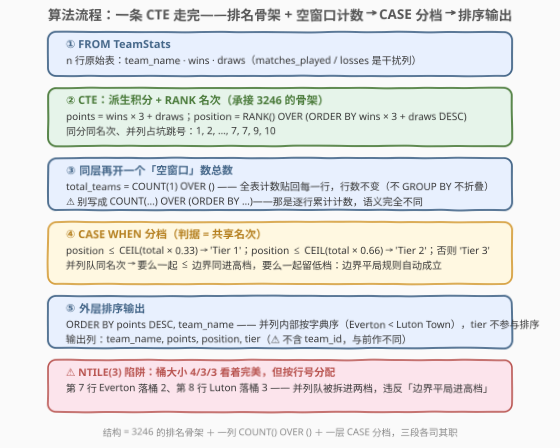
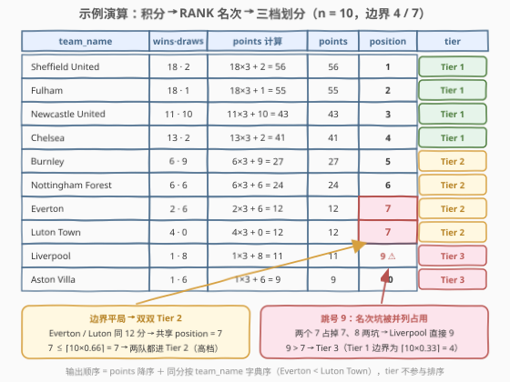

# LeetCode 英超积分榜排名II 题解

## 1. 题目概述

- **标题 / 题号**：英超积分榜排名II（#3252，medium）
- **链接**：https://leetcode.cn/problems/premier-league-table-ranking-ii/
- **难度**：中等
- **标签**：数据库、SQL、窗口函数、`RANK()`、`COUNT() OVER ()`、`CEIL`、`CASE WHEN`、分档（Top 百分比）、LeetCode 锁题

> ⚠️ 本题为 LeetCode 付费题（锁题），题意描述根据官方示例用例与外部资料重建，可能与官方题面有出入。（题面已与社区镜像 doocs/leetcode 的官方中文翻译交叉核对，示例输入输出与 GraphQL 接口返回一致，出入风险较低。）

**表结构**：`TeamStats`（与前作 [3246. 英超积分榜排名](3246_英超积分榜排名.md) 完全同款）

| 列名 | 类型 |
|------|------|
| team_id | int |
| team_name | varchar |
| matches_played | int |
| wins | int |
| draws | int |
| losses | int |

- `team_id` 是这张表的唯一主键；
- 每行包含一支球队的 id、队名、已赛场次、胜场数、平局数与负场数。

**目标**：计算联盟中每支球队的**得分 points**、**排名 position** 与**等级 tier**。积分规则（3-1-0 计分制）：

- **赢局**得 `3` 分；
- **平局**得 `1` 分；
- **输局**得 `0` 分。

**注意**：积分相同的球队必须分配**相同的排名**（同分同名次、并列占坑后名次跳号——即前作锁定的 `RANK()` 语义）。

**等级评级**：根据积分把联盟分成 3 个等级：

- 等级 1（Tier 1）：前 `33%` 的队伍；
- 等级 2（Tier 2）：中间 `33%` 的队伍；
- 等级 3（Tier 3）：最后 `34%` 的队伍；
- **如果等级边界出现平局，平局的队伍分配到更高的等级**。

返回结果表以 `points` **降序**排序，再以 `team_name` **升序**排序，输出列为 `team_name, points, position, tier`。

**示例**：

```text
输入：
TeamStats 表：
+---------+-------------------+----------------+------+-------+--------+
| team_id | team_name         | matches_played | wins | draws | losses |
+---------+-------------------+----------------+------+-------+--------+
| 1       | Chelsea           | 22             | 13   | 2     | 7      |
| 2       | Nottingham Forest | 27             | 6    | 6     | 15     |
| 3       | Liverpool         | 17             | 1    | 8     | 8      |
| 4       | Aston Villa       | 20             | 1    | 6     | 13     |
| 5       | Fulham            | 31             | 18   | 1     | 12     |
| 6       | Burnley           | 26             | 6    | 9     | 11     |
| 7       | Newcastle United  | 33             | 11   | 10    | 12     |
| 8       | Sheffield United  | 20             | 18   | 2     | 0      |
| 9       | Luton Town        | 5              | 4    | 0     | 1      |
| 10      | Everton           | 14             | 2    | 6     | 6      |
+---------+-------------------+----------------+------+-------+--------+

输出：
+-------------------+--------+----------+---------+
| team_name         | points | position | tier    |
+-------------------+--------+----------+---------+
| Sheffield United  | 56     | 1        | Tier 1  |
| Fulham            | 55     | 2        | Tier 1  |
| Newcastle United  | 43     | 3        | Tier 1  |
| Chelsea           | 41     | 4        | Tier 1  |
| Burnley           | 27     | 5        | Tier 2  |
| Nottingham Forest | 24     | 6        | Tier 2  |
| Everton           | 12     | 7        | Tier 2  |
| Luton Town        | 12     | 7        | Tier 2  |
| Liverpool         | 11     | 9        | Tier 3  |
| Aston Villa       | 9      | 10       | Tier 3  |
+-------------------+--------+----------+---------+
```

**解释**：

- 谢菲尔德联队 56 分（18 胜 × 3 + 2 平 × 1）位列第 1，富勒姆 55 分第 2，纽卡斯尔联队 43 分第 3，切尔西 41 分第 4；
- 伯恩利 27 分第 5，诺丁汉森林 24 分第 6；
- **埃弗顿和卢顿镇均拿下 12 分**（埃弗顿 2 胜 × 3 + 6 平 × 1；卢顿镇 4 胜 × 3），**并列第 7**；
- 利物浦 11 分第 **9**（并列两队占了 7、8 两个名次坑，名次跳号），阿斯顿维拉 9 分第 10。

> 💡 **审题关键**：① **分档的判据是「共享名次 position」而非行号**——埃弗顿与卢顿镇并列第 7，恰好压在 Tier 2/3 的边界上（$\lceil 10 \times 0.66 \rceil = 7$），按「边界平局进高档」两队**都进 Tier 2**；若按行号判档，第 8 行的卢顿镇会错进 Tier 3；② 利物浦**跳号到 9** 仍在 Tier 3——跳号不豁免分档，判档看 `9 > 7` 只认名次值；③ 33% 是名义比例，硬规则是 `CEIL` **向上取整**的边界：$n=10 \Rightarrow \lceil 3.3 \rceil = 4$，Tier 1 实际装 4 队（占 40%）；④ 输出列**不含 `team_id`**（前作输出含），列清单以本题题面为准；⑤ `matches_played` 与 `losses` 依旧是不参与计算的**干扰列**。

## 2. 解题思路

### 2.1 暴力思路：把 3246 的榜单拉到应用层手工分档

前作 3246 已经解决 `points` 与 `position`，最直觉的做法是把整张表 `SELECT` 到应用层，排个序、数一下队伍总数 $n$，再逐行判断 `position <= ceil(n * 0.33)` —— 但数据库题要求**一条 SQL 直接返回结果**。

落到 SQL 里，「逐行问全局信息」的等价物是**相关子查询**：`position` 用「比我积分高的队伍数 + 1」（RANK 的定义式，见解法 B），$n$ 用标量子查询 `(SELECT COUNT(*) FROM TeamStats)`。每行都回表扫一遍，$O(n^2)$。

另一个更隐蔽的「暴力陷阱」是**行号思维**：拿 `ROW_NUMBER()` 排出 $1..n$ 再 CASE 分档——第 8 行的卢顿镇会被判成 Tier 3，与示例输出直接矛盾。并列队的档位必须看**共享名次**，行号天然不合规。

> ⚠️ 暴力的问题不在正确性（相关子查询版本完全正确），而在把「排名」和「分档」这两个**行集的全局属性**拆成了 $n$ 次逐行私有计算。突破口：窗口函数一次全局打号，`CASE WHEN` 逐行消费——各干各的。

### 2.2 核心观察：共享名次 + 空窗口计数 + `CEIL` 边界



**观察 1（排名骨架整体复用前作）**：`points = wins * 3 + draws` 与 `position = RANK() OVER (ORDER BY points DESC)` 与 3246 一字不差。本题真正新增的只有一层「分档」——**组合式审题**：先把已会的骨架钉死，再琢磨新增量。

**观察 2（`COUNT(1) OVER ()`：把全表计数当列用）**：分档边界需要队伍总数 $n$。普通 `COUNT(*)` 配 `GROUP BY` 会把表**折叠**成一行；而**空括号窗口** `OVER ()` 表示「整个结果集是一个分区」，聚合值作为新列**贴回每一行**，行数不变。这是「窗口聚合 vs 分组聚合」的教科书对比。⚠️ 注意别写成 `COUNT(1) OVER (ORDER BY ...)`——加了 `ORDER BY` 的窗口聚合是**逐行累计**（RUNNING TOTAL），语义完全不同：`RANK` 的窗口要 `ORDER BY`，`COUNT` 的窗口不要。

**观察 3（「边界平局进高档」⟺ 判据挂在共享名次上）**：`CASE WHEN position <= CEIL(n * 0.33) THEN 'Tier 1' ...` 用**共享的 RANK 名次**与边界比较：并列队 `position` 相同，要么一起 `≤` 边界（同进高档），要么一起 `>` 边界（同留低档）——规则**自动成立**，不需要任何特判。反例是 `NTILE(3)`：

| 分档姿势 | 10 行的分配 | Everton（第 7 行） | Luton（第 8 行） | 对/错 |
|----------|-------------|--------------------|------------------|-------|
| `NTILE(3) OVER (ORDER BY ...)` | 桶 4/3/3（按**行号**切） | 桶 2 → Tier 2 | 桶 3 → Tier 3 | ❌ 并列队被拆档 |
| `ROW_NUMBER()` 判档 | 行号 1..10 逐行 CASE | Tier 2 | Tier 3 | ❌ 同上 |
| `RANK()` 名次判档 | 名次 1..7,7,9,10 与边界比 | Tier 2 | Tier 2 | ✅ 与示例一致 |

`NTILE(3)` 的桶大小恰好也是 4/3/3，看似完美，但它按**行号**分配——并列的埃弗顿/卢顿镇必然被切进两个桶，违反「边界平局进高档」。

### 2.3 算法流程图



**逻辑执行步骤**：

| 步骤 | SQL 片段 | 作用 | 示例数据流 |
|------|----------|------|-----------|
| ① | `FROM TeamStats` | 读入 $n$ 行原始表 | 10 支球队 |
| ② | `wins * 3 + draws AS points` + `RANK() OVER (...)` | 派生积分 + 打名次 | 56, 55, …, 12, 12, 11, 9 → 1..7, 7, 9, 10 |
| ③ | `COUNT(1) OVER () AS total_teams` | 空窗口数总数，贴到每行 | 每行都是 10 |
| ④ | `CASE WHEN position <= CEIL(...)` | 按共享名次判档 | 4 队 Tier 1，4 队 Tier 2，2 队 Tier 3 |
| ⑤ | `ORDER BY points DESC, team_name` | 决定输出顺序 | Everton 排在 Luton Town 前（字典序） |

> 💡 逻辑执行顺序 `FROM → WHERE → GROUP BY → 窗口函数 → SELECT → ORDER BY`：`RANK` 与 `COUNT` 两个窗口同层求值、互不干扰；`CASE` 在外层消费窗口产物；`ORDER BY` 最后才排展示顺序——tier 不参与排序。

### 2.4 示例演算



**积分、名次与分档**（$n = 10$，边界 $\lceil 10 \times 0.33 \rceil = 4$、$\lceil 10 \times 0.66 \rceil = 7$）：

| team_name | wins · draws | points | position | tier |
|-----------|--------------|--------|----------|------|
| Sheffield United | 18 · 2 | $18\times3+2=56$ | 1 | Tier 1 |
| Fulham | 18 · 1 | $18\times3+1=55$ | 2 | Tier 1 |
| Newcastle United | 11 · 10 | $11\times3+10=43$ | 3 | Tier 1 |
| Chelsea | 13 · 2 | $13\times3+2=41$ | **4** ⚠️ | Tier 1 |
| Burnley | 6 · 9 | $6\times3+9=27$ | 5 | Tier 2 |
| Nottingham Forest | 6 · 6 | $6\times3+6=24$ | 6 | Tier 2 |
| Everton | 2 · 6 | $2\times3+6=12$ | **7** ⚠️ | Tier 2 |
| Luton Town | 4 · 0 | $4\times3+0=12$ | **7** ⚠️ | Tier 2 |
| Liverpool | 1 · 8 | $1\times3+8=11$ | **9** ⚠️ | Tier 3 |
| Aston Villa | 1 · 6 | $1\times3+6=9$ | 10 | Tier 3 |

- **切尔西的 4**：Tier 1 边界恰为 $\lceil 3.3 \rceil = 4$，向上取整把她留在档内——若误用 `FLOOR` 得 3，她会被挤出 Tier 1；
- **并列第 7 压边界**：埃弗顿与卢顿镇共享 `position = 7`，而 $7 \le \lceil 10 \times 0.66 \rceil = 7$ 恰好成立 → 双双 Tier 2（边界平局进高档）；卢顿镇虽是**第 8 行**，判档看名次不看行号；
- **跳号第 9**：两个并列队占掉 7、8 两个名次坑，利物浦的名次直接跳到 9；$9 > 7$ → Tier 3——**跳号不豁免分档**；
- **并列内部顺序**：输出按 `points DESC, team_name ASC`，`Everton < Luton Town`（字典序），与 `team_id`（9/10）无关。

## 3. 参考代码

### SQL（解法 A：`RANK()` + `COUNT() OVER ()` 窗口函数，推荐）

```sql
# Write your MySQL query statement below
WITH t AS (
    SELECT
        team_name,
        wins * 3 + draws AS points,
        RANK() OVER (ORDER BY wins * 3 + draws DESC) AS position,
        COUNT(1) OVER () AS total_teams
    FROM TeamStats
)
SELECT
    team_name,
    points,
    position,
    CASE
        WHEN position <= CEIL(total_teams * 0.33) THEN 'Tier 1'
        WHEN position <= CEIL(total_teams * 0.66) THEN 'Tier 2'
        ELSE 'Tier 3'
    END AS tier
FROM t
ORDER BY points DESC, team_name;
```

> 💡 **写法要点**：
> - 两个窗口（`RANK` / `COUNT`）写在**同一个 CTE** 里即可——窗口函数之间互不干扰：`RANK` 看排序键，`COUNT(1) OVER ()` 看全表，空括号不带 `ORDER BY`（带了就变成累计计数）；
> - 窗口 `ORDER BY` 里**重复表达式** `wins * 3 + draws` 而不写别名 `points`——MySQL 8.0 的窗口定义看不到同一层 `SELECT` 的别名（报 `Unknown column`），与 3246 同款坑；先在 CTE 里算好再开窗也行；
> - 外层 `ORDER BY points DESC, team_name` 用别名没问题（它在 `SELECT` 之后求值）；**tier 不参与排序**；
> - `CEIL(total_teams * 0.33)` 也可写 `CEIL(total_teams / 3.0)`：判题数据 $n=10$ 时同为 4/7，均 AC；两者在 $n=100$ 时分别为 33/66 与 34/67——题面明写 33%/66%，百分比语义更贴前者，细节见 5.1 节。

### SQL（解法 B：免窗口函数——RANK 定义式 + 标量子查询）

```sql
# Write your MySQL query statement below
SELECT
    team_name,
    points,
    position,
    CASE
        WHEN position <= CEIL(total * 0.33) THEN 'Tier 1'
        WHEN position <= CEIL(total * 0.66) THEN 'Tier 2'
        ELSE 'Tier 3'
    END AS tier
FROM (
    SELECT
        team_name,
        wins * 3 + draws AS points,
        (SELECT COUNT(*)
         FROM TeamStats t2
         WHERE t2.wins * 3 + t2.draws > t1.wins * 3 + t1.draws) + 1 AS position,
        (SELECT COUNT(*) FROM TeamStats) AS total
    FROM TeamStats t1
) AS t
ORDER BY points DESC, team_name;
```

> 💡 **写法要点**：
> - `position` = **严格比我积分高的队伍数 + 1**——RANK 的数学定义式（3246 解法 B 同款）：同分者互不计数 → 天然同名次、天然跳号；
> - `total` 用**不相关标量子查询** `(SELECT COUNT(*) FROM TeamStats)`：不引用外层列，优化器只需算一次；
> - 里层算好 `position`/`total`，外层套派生表让它们变成可见列再 `CASE`——否则要在 `CASE` 里重复整段子查询；
> - 适用场景：MySQL 5.x 等无窗口函数的老引擎、或面试官明确「不许用窗口函数」的保底写法；代价 $O(n^2)$。

### Python（pandas）

```python
import numpy as np
import pandas as pd


def calculate_team_tiers(team_stats: pd.DataFrame) -> pd.DataFrame:
    team_stats["points"] = team_stats["wins"] * 3 + team_stats["draws"]
    team_stats["position"] = (
        team_stats["points"].rank(method="min", ascending=False).astype(int)
    )
    total = len(team_stats)
    team_stats["tier"] = np.where(
        team_stats["position"] <= np.ceil(total * 0.33),
        "Tier 1",
        np.where(team_stats["position"] <= np.ceil(total * 0.66), "Tier 2", "Tier 3"),
    )
    return (
        team_stats.sort_values(["points", "team_name"], ascending=[False, True])[
            ["team_name", "points", "position", "tier"]
        ]
        .reset_index(drop=True)
    )
```

> 💡 **pandas 对照**（付费题无官方函数签名，函数名按题意约定，以站点模板为准）：
> - `rank(method="min", ascending=False)` 就是 `RANK() OVER (ORDER BY points DESC)`：`ascending=False` 从高分往低数，`method="min"` 并列取最小名次——「同分同名次 + 跳号」一步到位；
> - `len(df)` 就是 `COUNT(1) OVER ()`：总数本来就不依赖窗口，普通变量即可；
> - 两层 `np.where` 嵌套就是 `CASE WHEN` 链；若追求可读性可用 `pd.cut(position, bins=[0, t1, t2, inf], labels=[...])`，但边界点必须同样用 `ceil` 先算好。

## 4. 复杂度分析

设 $n$ 为 `TeamStats` 行数。

| 维度 | 复杂度 | 说明 |
|------|--------|------|
| **时间（解法 A）** | $O(n \log n)$ | `RANK` 窗口排序一次 + 输出排序一次，均为比较排序上界 |
| **时间（解法 B）** | $O(n^2)$ | 每行相关子查询回扫全表计数（`total` 不相关，可被缓存成一次） |
| **空间** | $O(n)$ | 窗口函数物化中间结果 / 输出缓冲 |

> - `COUNT(1) OVER ()` 本身不引入额外排序（空窗口无 `PARTITION BY`/`ORDER BY`），代价只是每行附带一个常数；
> - 判题数据规模（联赛球队数）极小，任何写法都瞬时通过——本题考点是**窗口语义与边界规则**而非性能。

## 5. 扩展

### 5.1 边界的取整：`CEIL`、`FLOOR` 还是三分之一？

- 题面给的是名义百分比 33/33/34，硬边界是 `CEIL(n * 0.33)` 与 `CEIL(n * 0.66)`——**向上取整**保证「前 33%」至少覆盖到名次 $\lceil 0.33n \rceil$：$n=10$ 时 $\lceil 3.3 \rceil = 4$；
- 若误用 `FLOOR`：$n=10 \to 3$，切尔西（第 4 名）会被挤出 Tier 1，与示例输出矛盾；
- `CEIL(n / 3.0)` 同样通过本题（$n=10$ 同为 4/7），但 $n=100$ 时给出 34/67，与 `×0.33` 版的 33/66 出现分歧：题面明说「后 34%」，百分比语义下 100 队应是 33/33/34，`×0.33` 版更贴题面。两种写法判题均 AC（测试数据未覆盖分歧点）——**面试遇到先问清取整规则再动手**；
- 若担心浮点误差（如 `0.33 * n` 在极端 $n$ 下的二进制表示），可写纯整数上取整：`(n * 33 + 99) DIV 100`。

### 5.2 系列题与真实英超规则

本题是三部曲的中篇，同一张 `TeamStats` 表逐层加码：

- [3246. 英超积分榜排名](https://leetcode.cn/problems/premier-league-table-ranking/)（[站内题解](3246_英超积分榜排名.md)）（简单）：开篇——派生列积分 + `RANK()` 排名，本题的骨架；
- [3322. 英超积分榜排名 III](https://leetcode.cn/problems/premier-league-table-ranking-iii/)（中等）：终章——多赛季 `PARTITION BY season_id` + 净胜球 `goals_for - goals_against` 做同分 tie-break + `ROW_NUMBER()` 强制连续名次；
- **真实英超**的同分 tie-break 链是：积分 → 净胜球 → 进球数 → 相互战绩……本题数据没有进球列，简化为「同分同名次 + 分档看边界」——工程里遇到真实榜单需求，把 tie-break 键追加进窗口 `ORDER BY` 即可（III 正是这么干的），骨架完全不变。

## 6. 面试要点

1. **为什么分档判据用「共享名次」而不是行号？`NTILE(3)` 能用吗？**

   > 题面规定「边界平局进高档」：埃弗顿/卢顿镇并列 `position=7`，恰好压在 $\lceil 0.66n \rceil = 7$ 的边界上，两队都要进 Tier 2。用 `RANK` 的共享名次做 `CASE` 判据，并列队同名次 → 天然同档（一起 `≤` 边界即同进高档）。`NTILE(3)` 按行号切桶（10 行 → 4/3/3），第 7 行与第 8 行的并列队被拆进桶 2/桶 3——**桶大小看着对，并列分配必错**；`ROW_NUMBER()` 判档同理翻车。

2. **`COUNT(1) OVER ()` 和普通 `GROUP BY + COUNT(*)` 差在哪？**

   > 空括号窗口 = 整个结果集是一个分区，聚合值作为**新列贴回每一行**，行数不变；`GROUP BY` 是把行**折叠**成组，一行一组。要「每行都看到全局 $n$」必须用前者。⚠️ 顺带的高频手滑点：`COUNT(1) OVER (ORDER BY x)` 是**逐行累计计数**（RUNNING TOTAL），不是全表计数——`RANK` 的窗口要 `ORDER BY`，`COUNT` 的窗口不要。

3. **33% 的边界怎么取整？**

   > 向上取整：$\lceil 0.33n \rceil$。$n=10 \to 4$（Tier 1 装 4 队，占 40%——百分比是名义值，`CEIL` 边界才是硬规则）。`FLOOR` 会把第 4 名挤出 Tier 1，与示例矛盾；`CEIL(n/3.0)` 在本题数据下等价（4/7），但 $n=100$ 时与 `×0.33` 版分歧（34/67 vs 33/66），判题均 AC、面试先问规则；要绝对避险可用整数上取整 `(n * 33 + 99) DIV 100`。

4. **与前作 3246 相比，输出上有哪些审题陷阱？**

   > ① 输出列**不含 `team_id`**（前作含）；② 新增 `tier` 列，但 `tier` **不参与排序**——排序键仍是 `points DESC, team_name ASC`，并列内部按字典序（`Everton < Luton Town`，与 `team_id` 9/10 无关）；③ `matches_played`、`losses` 依旧不参与计算。SQL 报表题的列清单与排序键必须按题面逐字圈出，「顺手沿用前作模板」最容易在这里翻车。

5. **不用窗口函数怎么实现？**

   > `position` 用 RANK 定义式相关子查询「严格比我积分高的行数 + 1」；`total` 用不相关标量子查询 `(SELECT COUNT(*) FROM TeamStats)`；外层套派生表把两个值变成可见列再 `CASE`。等价改写还有自连接 `JOIN` + `GROUP BY` + `COUNT`。代价 $O(n^2)$，是老引擎或「禁窗口」条件下的保底手段。

> 💡 **一句话总结**：3252 = 3246 的 `RANK()` 排名骨架 + 一列 `COUNT(1) OVER ()` 空窗口总数 + 一层 `CASE WHEN position <= CEIL(n×0.33/0.66)` 分档。判档挂在**共享名次**上，「边界平局进高档」自动成立；`NTILE(3)`/行号判档都会把并列队拆档，是本题最大的陷阱。

## 同类练习题

| # | 题目 | 与本题的关联 |
|---|------|-------------|
| 3246 | [英超积分榜排名](https://leetcode.cn/problems/premier-league-table-ranking/)（[站内题解](3246_英超积分榜排名.md)） | 前作——同一张表上的 `RANK()` 排名母题，本题骨架的直接来源 |
| 3322 | [英超积分榜排名 III](https://leetcode.cn/problems/premier-league-table-ranking-iii/) | 续作——多赛季 `PARTITION BY` + 净胜球 tie-break + `ROW_NUMBER()` 强排，三部曲收官 |
| 178 | [分数排名](https://leetcode.cn/problems/rank-scores/)（[站内题解](../0101-0200/178_分数排名.md)） | `RANK()` 窗口函数的母题——「同分同名次」骨架的最早出处 |
| 185 | [部门工资前三高的所有员工](https://leetcode.cn/problems/department-top-three-salaries/)（[站内题解](../0101-0200/185_部门工资前三高的所有员工.md)） | `DENSE_RANK()` 组内 Top-N——对照「并列不拆档」的另一套语义 |
| 2377 | [整理奥运表](https://leetcode.cn/problems/sort-the-olympic-table/)（[站内题解](../2301-2400/2377_整理奥运表.md)） | 多键排序的体育奖牌榜输出，同属「榜单报表」题材 |
