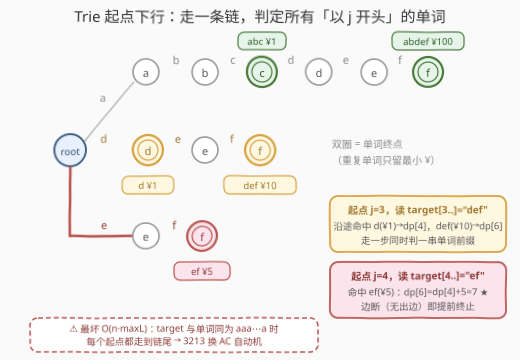
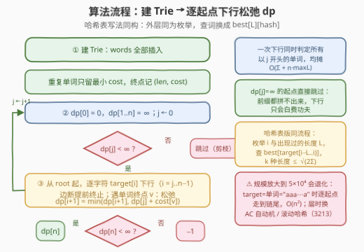
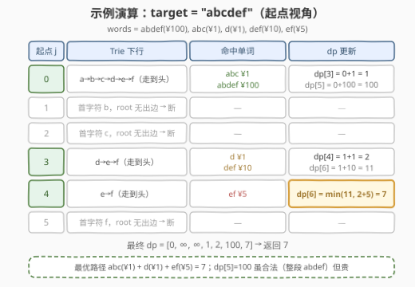

# LeetCode 最小代价构造字符串（简单） 题解

## 1. 题目概述

- **标题 / 题号**：最小代价构造字符串（简单）（#3253，medium）
- **链接**：https://leetcode.cn/problems/construct-string-with-minimum-cost-easy/
- **难度**：中等
- **标签**：字符串，动态规划，字典树，哈希表

> ⚠️ 本题为 LeetCode 付费题（锁题），题意描述根据官方示例用例与 GraphQL hints 重建，可能与官方题面有出入。（题面与困难版 [3213. 最小代价构造字符串](3213_最小代价构造字符串.md) 完全同构——示例用例逐字一致、hints 同为「前缀 DP」表述，仅为数据规模缩小的「简单版」，出入风险较低。）

**题意**：给定字符串 `target`、字符串数组 `words` 与等长整数数组 `costs`。初始 `s` 为空串，可以执行任意次（含 **零** 次）操作：

1. 选择范围 `[0, words.length - 1]` 内的索引 `i`；
2. 把 `words[i]` 追加到 `s` 末尾；
3. 该操作花费 `costs[i]`。

返回使 `s` 等于 `target` 的**最小**总代价；无法构造返回 `-1`。

**示例 1**：

```text
输入：target = "abcdef", words = ["abdef","abc","d","def","ef"], costs = [100,1,1,10,5]
输出：7
解释：追加 "abc"(1) + "d"(1) + "ef"(5)，s = "abcdef"，总代价 7。
```

**示例 2**：

```text
输入：target = "aaaa", words = ["z","zz","zzz"], costs = [1,10,100]
输出：-1
解释：任何单词都不含 'a'，无法构造 target。
```

**约束条件**（付费锁题，精确上界以官方题面为准）：

- `target`、`words`、`costs` 的规模显著小于困难版 3213（该版为 $5 \times 10^4$）；官方 hints 只给出朴素前缀 DP、未提示 AC 自动机 / 哈希等加速结构，可断定本版允许 $O(n \cdot \max|w|)$ 级别的直接 DP 通过
- $1 \le words[i].length \le target.length$；`target` 与 `words[i]` 仅由小写字母组成；$1 \le costs[i]$

> 💡 读题关键：操作只能**往末尾追加**，每次追加的单词互不重叠、按序无缝衔接——每个单词恰好覆盖 `target` 的一段连续区间。问题等价于：**把 `target` 切成若干段，每段恰好等于某个单词，最小化代价和**。这就是 139 单词拆分的「带权最优化」版；与困难版 3213 的唯一区别是数据规模——本题朴素 DP + 哈希/Trie 即可，无需 AC 自动机。

## 2. 解题思路

### 2.1 暴力思路：逐位置枚举全部单词

定义 $dp[i]$ = 构造 `target` 前 $i$ 个字符的最小代价，$dp[0] = 0$：

$$dp[i] = \min_{\substack{j < i \\ target[j..i) \in words}} dp[j] + cost(target[j..i))$$

直接实现：对每个终点 $i$ 枚举全部 $m$ 个单词，逐字符比对 `target[i-L..i)` 是否等于 `words[k]`——整体 $O(n \cdot m \cdot L)$（$m$ = 单词数，$L$ = 单词长度）。困难版量级（$n = m = 5\times10^4$）下天文数字；简单版勉强能摸到边，但依然浪费：**「哪个单词结束于 $i$」这个子问题，被每个终点用「逐单词重比一遍」的笨办法重复回答**。

### 2.2 核心观察：拆分模型 + 两种「查词」加速

![核心观察：尾部追加 = 带权拆分，dp[i] 枚举最后一段](../images/p3253_concept_wordbreak.svg)

**观察 1（拆分模型）**：追加操作按顺序无缝衔接，第 $k$ 次操作拼上的 `words[i]` 恰好占据 `target` 的一段区间。合法方案 $\iff$ `target` 的一个有序划分，每段是一个单词——与 139 单词拆分完全同构，只是从「能否划分」升级为「最小代价划分」。

**观察 2（最后一段视角）**：$dp[i]$ 的转移只需枚举**结束于 $i$ 的单词** $w$：$dp[i] = dp[i - |w|] + cost(w)$。状态设计本身与困难版一致，瓶颈全在**查词效率**。

**观察 3（哈希表查词）**：把 `words` 预处理成「单词 → 最小代价」的哈希表 `best`（重复单词取最小 $cost$）。转移时枚举**出现过的单词长度** $L$，查 `best[target[i-L..i)]`——单词长度种类数 $k$ 满足 $1 + 2 + \cdots + k \le \Sigma$（$\Sigma = \sum|words[i]|$），故 $k \le \sqrt{2\Sigma}$，总复杂度 $O(\Sigma + n \cdot k \cdot \bar L)$。

**观察 4（Trie 起点下行）**：把 `words` 建成 Trie，**换个枚举方向**——不按终点 $i$ 找单词，而是按起点 $j$ 走链：从 `root` 出发沿 `target[j], target[j+1], ...` 逐字符下行，**沿途每遇到一个单词终点 $v$，就松弛 $dp[j + len(v)] = \min(dp[j + len(v)],\; dp[j] + cost[v])$**；一旦下一步无出边（当前串不再是任何单词的前缀）立即终止。一次走链同时判定所有「以 $j$ 开头」的单词，配合 $dp[j] = \infty$ 跳过剪枝，总复杂度 $O(\Sigma + n \cdot \max L)$。



> ⚠️ 注意方向对偶：3213 题解用的是**终点视角**（AC 自动机沿 fail 链枚举「结束于 $j$ 的单词」）；本题规模小，**起点视角**（Trie 下行枚举「开始于 $j$ 的单词」）更简单直接。两者在 $n = \Sigma = 5 \times 10^4$ 时都会退化（`target` 与单词同为 `"aaa⋯a"` 时逐起点走到链尾，$O(n^2)$），届时必须换 AC 自动机——这正是简单版与困难版的分水岭。

### 2.3 算法流程图



三阶段：① 建 Trie，重复单词只留最小 $cost$；② 初始化 $dp[0] = 0$、其余 $\infty$；③ 逐起点 $j$ 扫描——$dp[j] = \infty$ 直接跳过，否则沿 Trie 下行，边断即停，每遇单词终点松弛对应 $dp$ 值；最后 $dp[n] = \infty$ 则返回 $-1$。

### 2.4 示例演算



以示例 1 为例（$dp[0] = 0$）：

| 起点 $j$ | Trie 下行 | 命中单词 | dp 更新 |
|---------|-----------|----------|---------|
| 0 | a→b→c→d→e→f | abc ¥1；abdef ¥100 | $dp[3] = 1$；$dp[5] = 100$ |
| 1 | 首字符 b 无出边，断 | — | — |
| 2 | 首字符 c 无出边，断 | — | — |
| 3 | d→e→f | d ¥1；def ¥10 | $dp[4] = 2$；$dp[6] = 11$ |
| 4 | e→f | ef ¥5 | $dp[6] = \min(11,\, 2+5) = \mathbf{7}$ |
| 5 | 首字符 f 无出边，断 | — | — |

最终 $dp = [0, \infty, \infty, 1, 2, 100, 7]$，返回 $7$。注意两个细节：① 起点 $j=0$ 的同一条走链先后命中 abc 与 abdef 两个单词——「一次走链判一串」正是 Trie 方案的效率来源；② $dp[5] = 100$（整段用 abdef）虽然合法但昂贵，最优路径 `abc + d + ef` 跨过它取 $dp[4] + 5 = 7$。

## 3. 参考代码

### C++（Trie 起点下行）

```cpp
class Solution {
  public:
    int minimumCost(string target, vector<string>& words, vector<int>& costs) {
        int n = target.size();

        // ---- 1. 建 Trie：ch[u][c] = 子节点编号（0 表示缺失），cost[v] = 单词最小代价 ----
        vector<array<int, 26>> ch(1);
        ch[0].fill(0);
        vector<long long> cost(1, -1);
        for (int i = 0; i < (int)words.size(); ++i) {
            int u = 0;
            for (char c : words[i]) {
                int d = c - 'a';
                if (!ch[u][d]) {
                    ch[u][d] = ch.size();
                    ch.emplace_back();
                    ch.back().fill(0);
                    cost.push_back(-1);
                }
                u = ch[u][d];
            }
            if (cost[u] < 0 || costs[i] < cost[u]) cost[u] = costs[i];   // 重复单词取最小
        }

        // ---- 2. 逐起点下行松弛 dp ----
        const long long INF = 1e15;
        vector<long long> dp(n + 1, INF);
        dp[0] = 0;
        for (int j = 0; j < n; ++j) {
            if (dp[j] >= INF) continue;              // 剪枝：前缀不可达，下行无意义
            int u = 0;
            for (int i = j; i < n; ++i) {
                u = ch[u][target[i] - 'a'];
                if (!u) break;                        // 不再是任何单词的前缀
                if (cost[u] >= 0)                     // 走到一个单词终点
                    dp[i + 1] = min(dp[i + 1], dp[j] + cost[u]);
            }
        }
        return dp[n] >= INF ? -1 : (int)dp[n];
    }
};
```

### Python（哈希表 + 按长度枚举）

```python
class Solution:
    def minimumCost(self, target: str, words: List[str], costs: List[int]) -> int:
        n = len(target)

        # 1. 预处理：单词 -> 最小代价；只保留出现过的长度
        best = {}
        for w, c in zip(words, costs):
            if w not in best or c < best[w]:
                best[w] = c
        lens = sorted({len(w) for w in best})          # 长度种类 <= sqrt(2Σ)

        # 2. dp[i] = 构造前 i 个字符的最小代价
        INF = float('inf')
        dp = [0] + [INF] * n
        for i in range(1, n + 1):
            for L in lens:                             # 枚举最后一段的长度
                if L > i:
                    break
                c = best.get(target[i - L:i])          # O(1) 查词（切片 O(L)）
                if c is not None and dp[i - L] + c < dp[i]:
                    dp[i] = dp[i - L] + c
        return -1 if dp[n] == INF else dp[n]
```

> 💡 两份代码已用随机对拍 + 定向用例验证。两版正好对应 2.2 的两条加速路线：C++ 走 Trie（$O(\Sigma + n\max L)$），Python 走哈希分桶（$O(\Sigma + nk\bar L)$，$k \le \sqrt{2\Sigma}$）；简单版数据量下双双轻松通过，写哪个看口味。

## 4. 复杂度分析

| 维度 | 复杂度 | 说明 |
|------|--------|------|
| 时间复杂度（Trie 版） | $O(\Sigma + n\cdot\max L)$ | 建树 $O(\Sigma)$；每个起点至多下行 $\max L$ 步（边断提前终止），$\max L \le n$ |
| 时间复杂度（哈希版） | $O(\Sigma + n\cdot k\cdot\bar L)$ | $k$ = 单词长度种类数 $\le \sqrt{2\Sigma}$；每个终点枚举 $k$ 种长度，各付一次 $O(L)$ 切片哈希 |
| 空间复杂度 | $O(\Sigma\cdot 26 + n)$ 或 $O(\Sigma + n)$ | Trie 边表 $O(26\Sigma)$（Python 字典版 $O(\Sigma)$）+ dp 数组 |
| 暴力对照 | $O(n\cdot m\cdot L)$ | 每个终点逐单词逐字符重比，$m$ = 单词数 |

简单版数据量下，两条路线都在「眨眼级」完成；若把规模拉到困难版 3213 的 $n = \Sigma = 5\times10^4$，$\max L$ 同为 $5\times10^4$，Trie 下行最坏 $O(n^2) = 2.5\times10^9$ 次转移判定——超时，必须升级数据结构（见下节）。

## 5. 扩展：规模放大后的进化路线（通往 3213）

本题与 3213 题面相同、只差数据规模，正好构成一条完整的「查词结构」进化链：

1. **139 单词拆分（可行性）**：哈希集合存单词，$dp[i] = dp[i-L] \lor \cdots$，只判能不能拆；
2. **3253 本题（小规模最优化）**：哈希表带最小代价 / Trie 起点下行，$O(n\max L)$ 级别；
3. **3213 困难版（$5\times10^4$ 最优化）**：起点下行会退化——`target` 与单词同为 `"aaa⋯a"` 时每个起点都走到链尾；两条出路：
   - **AC 自动机**：BFS 建 fail/dict 指针，单趟扫描 `target`，沿 dict 链枚举「结束于当前位置」的全部单词，匹配总量摊还到 $O(n\sqrt{2\Sigma})$，确定性不依赖哈希；
   - **滚动哈希**：预处理 `target` 前缀哈希，按长度分桶查 $O(1)$ 判子串是否为单词，复杂度同阶，代码更短但要防哈希冲突。

> 💡 一句话记忆：**状态设计（前缀 dp + 最后一段转移）从头到尾没变，变的是「一次能查多少个单词」**——哈希表查一个、Trie 下行查一条链、AC 自动机一趟扫完全部。3213 的完整推导见 [3213. 最小代价构造字符串题解](3213_最小代价构造字符串.md)。

## 6. 面试要点

1. **怎么把「拼接操作」转成 DP？**

   追加操作按序无缝覆盖 `target` 的区间 ⇒ 合法方案 = `target` 的有序划分。定义 $dp[i]$ = 前 $i$ 个字符的最小代价，转移枚举「结束于 $i$ 的最后一段单词」。与 139 单词拆分同构，可行性布尔 dp 换成最优化数值 dp。

2. **哈希表与 Trie 两种查词各好在哪？**

   哈希表：实现 10 行，复杂度 $O(nk\bar L)$，$k \le \sqrt{2\Sigma}$，缺点是切片/哈希的 $O(L)$ 隐藏成本与冲突风险；Trie：一次下行判定一串前缀，复杂度 $O(n\max L)$，前缀失配即断链，无哈希不确定性。小规模随便选，面试口述两者取舍是加分项。

3. **`dp[j] = ∞` 的剪枝为什么值得写？**

   前缀 $j$ 本身拼不出来的话，从 $j$ 下行得到的一切松弛目标 $dp[j + len]$ 都会是 $\infty + cost$，纯属白走；跳过后最坏情形（多数位置不可达，如单词首字符稀疏）能省掉绝大多数走链。注意它救不了 `aaa⋯a` 型全可达反例——那要靠 AC 自动机。

4. **重复单词、答案上界怎么处理？**

   `words` 可含重复串：哈希表 / Trie 终点只存**最小 cost**，建结构时顺手去重。答案上界 = 段数 × 最大单价 $\le n \times 10^4$，`int` 勉强装下，工程上用 `long long` 更稳；不可行以 $\infty$ 判定后返回 $-1$。

5. **面试官追问「数据范围 ×100 怎么办」？**

   指出退化反例：`target` 与唯一长单词同为 `"aaa⋯a"`，起点下行每个位置走到尾，$O(n^2)$。然后给两条升级路：AC 自动机（fail 链摊还，确定性）或滚动哈希按长度分桶（代码短，防冲突）；匹配总量上界 $n\sqrt{2\Sigma}$ 的证明见 3213 题解。

## 同类练习题

| # | 题目 | 与本题的关联 |
|---|------|-------------|
| 139 | [单词拆分](https://leetcode.cn/problems/word-break/) | 本题的「可行性判定」原型——同一套前缀 dp，布尔版 |
| 3213 | [最小代价构造字符串](https://leetcode.cn/problems/construct-string-with-minimum-cost/) | 本题的困难版，$5\times10^4$ 规模逼出 AC 自动机 / 滚动哈希 |
| 140 | [单词拆分 II](https://leetcode.cn/problems/word-break-ii/) | 单词拆分的「枚举全部方案」版，记忆化 DFS |
| 208 | [实现 Trie (前缀树)](https://leetcode.cn/problems/implement-trie-prefix-tree/) | Trie 模板题，本题下行查词的地基 |
| 472 | [连接词](https://leetcode.cn/problems/concatenated-words/) | Trie + DFS 判「能否由更短单词拼接」，另一角度的拆分问题 |
