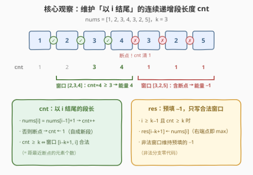
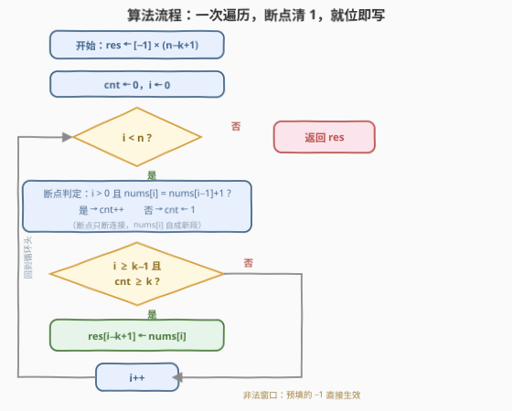
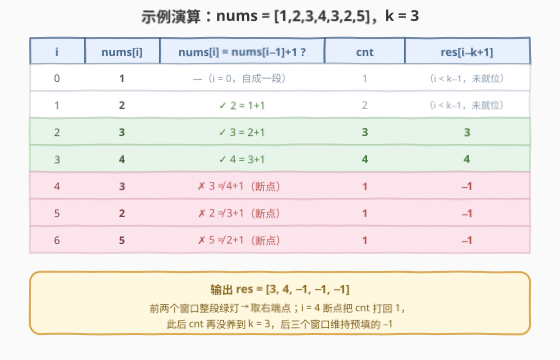

# LeetCode 长度为 K 的子数组的能量值 I 题解

## 1. 题目概述

- **标题 / 题号**：长度为 K 的子数组的能量值 I（#3254，medium）
- **链接**：https://leetcode.cn/problems/find-the-power-of-k-size-subarrays-i/
- **难度**：中等
- **标签**：数组、滑动窗口

**题意**：给你一个长度为 $n$ 的整数数组 `nums` 和一个正整数 $k$。

一个数组的**能量值**定义为：

- 如果**所有**元素都是依次**连续**且**上升**的，那么能量值为**最大**的元素。
- 否则为 $-1$。

你需要求出 `nums` 中所有长度为 $k$ 的**子数组**的能量值。

返回一个长度为 $n - k + 1$ 的整数数组 `results`，其中 `results[i]` 是子数组 `nums[i..(i+k-1)]` 的能量值。

**示例 1**：

```text
输入：nums = [1,2,3,4,3,2,5], k = 3
输出：[3,4,-1,-1,-1]
解释：
     [1,2,3] 连续上升 → 能量 = 最大元素 3
     [2,3,4] 连续上升 → 能量 = 最大元素 4
     [3,4,3] 不连续；[4,3,2] 不上升；[3,2,5] 不连续 → 均为 -1
```

**示例 2**：

```text
输入：nums = [2,2,2,2,2], k = 4
输出：[-1,-1]
```

**示例 3**：

```text
输入：nums = [3,2,3,2,3,2], k = 2
输出：[-1,3,-1,3,-1]
```

**约束**：

- $1 \le n = nums.length \le 500$
- $1 \le nums[i] \le 10^5$
- $1 \le k \le n$

> 💡 读题关键：① 「连续**且**上升」= 相邻差**恰好为 1**（$nums[j+1] = nums[j] + 1$），不是只要严格递增——$[3,5,7]$ 递增但不连续，$[2,2,2]$ 相等更不行，能量都是 $-1$；② 合法窗口内元素依次 $+1$，**最大值必是右端点**——能量值无需单独求 max；③ 输出长度 $n-k+1$，本质是「以每个 $i \ge k-1$ 为右端点的定长窗口」逐一定夺；④ $n \le 500$ 暴力可过，但姊妹题 3255 放大到 $10^5$——一步到位写 $O(n)$。

## 2. 解题思路

### 2.1 暴力思路：逐窗口检查

对每个起点 $i \in [0, n-k]$，向右扫 $k-1$ 对相邻元素，验证 $nums[j+1] = nums[j] + 1$ 是否全部成立：全成立则 `results[i] = nums[i+k-1]`（右端点即最大），否则 $-1$。时间 $O(nk)$——$n = 500$、$k = 500$ 时约 $2.5 \times 10^5$，轻松通过；但姊妹题 3255 的 $n = 10^5$ 就是 $10^{10}$ 级，必超时。相邻窗口重叠 $k-1$ 个元素却每次从头查，重复劳动正是优化的切入点。

### 2.2 核心观察：一次遍历 + 连续段计数



**观察 1（合法性 = 窗口内无断点）**：窗口 $[l, r]$ 连续上升 $\iff$ 窗口内每对相邻元素差都恰为 $1$ $\iff$ 窗口内没有**断点**（$nums[j] \ne nums[j-1] + 1$ 的位置 $j$）。断点是否落在窗口内，只与窗口覆盖的区间有关，与端点怎么移动无关——这正是滑动窗口类问题得以增量维护的结构性条件。

**观察 2（维护「以 $i$ 结尾」的段长）**：与其显式记录断点位置，不如直接维护

$$cnt = \text{以 } i \text{ 结尾的最长连续递增段的长度}$$

- $nums[i] = nums[i-1] + 1$：段延长，$cnt \gets cnt + 1$；
- 否则断点降临，$nums[i]$ 自成新段，$cnt \gets 1$。

于是**一行判定**：以 $i$ 为右端点的窗口 $[i-k+1, i]$ 合法 $\iff cnt \ge k$。连断点在哪都不用记——$cnt$ 的语义就是「从最近一次断点之后（含自己）数到 $i$ 的元素个数」。

**观察 3（能量值 = 右端点）**：合法窗口内元素严格 $+1$ 递增，最大值必然是 $nums[i]$。$cnt \ge k$ 时直接写 `results[i-k+1] = nums[i]`——**单调队列、优先队列一概不需要**（239 那套重武器在此毫无用武之地）。

$k = 1$ 天然兼容：$cnt \ge 1$ 恒成立，`results[i] = nums[i]` 正是单元素子数组的能量值，无需特判。

### 2.3 算法流程图



`res` 预填 $-1$，单指针 $i$ 从左到右：每步先用相邻差更新 $cnt$（断点即清 1），再在「窗口就位（$i \ge k-1$）且 $cnt \ge k$」时把右端点写进答案；预填的 $-1$ 自动覆盖所有非法窗口，**非法分支零代码**。跑满 $n$ 步返回。

### 2.4 示例演算



以 `nums = [1,2,3,4,3,2,5], k = 3` 走一遍（见上表）：

前半段 $1 \to 2 \to 3 \to 4$ 一路绿灯，$cnt$ 顺势涨到 4——$i = 3$ 时窗口 $[1,3] = [2,3,4]$ 整体落在同一段内，$res[1] = 4$。$i = 4$ 处 $4 \to 3$ 断崖，$cnt$ 瞬间跌回 1；此后 $3 \to 2$、$2 \to 5$ 又是两个断点，$cnt$ 再没养到 3，后三个窗口全部维持预填的 $-1$。最终 $res = [3,4,-1,-1,-1]$，与示例一致。

## 3. 参考代码

### C++

```cpp
class Solution {
  public:
    vector<int> resultsArray(vector<int>& nums, int k) {
        int n = nums.size();
        vector<int> res(n - k + 1, -1);      // 预填 -1：非法窗口零代码
        int cnt = 0;                          // 以 i 结尾的连续递增段长度
        for (int i = 0; i < n; i++) {
            cnt = (i > 0 && nums[i] == nums[i - 1] + 1) ? cnt + 1 : 1;
            if (i >= k - 1 && cnt >= k)       // 窗口就位且整段连续上升
                res[i - k + 1] = nums[i];     // 右端点即最大元素
        }
        return res;
    }
};
```

### Python

```python
class Solution:
    def resultsArray(self, nums: List[int], k: int) -> List[int]:
        res = [-1] * (len(nums) - k + 1)     # 预填 -1：非法窗口零代码
        cnt = 0                               # 以 i 结尾的连续递增段长度
        for i, x in enumerate(nums):
            cnt = cnt + 1 if i and x == nums[i - 1] + 1 else 1
            if i >= k - 1 and cnt >= k:       # 窗口就位且整段连续上升
                res[i - k + 1] = x            # 右端点即最大元素
        return res
```

> 💡 实现细节：① 判定务必写**等式** `nums[i] == nums[i-1] + 1` 而非 `>`——「连续」要求差恰为 1；② 相邻判定前先短路判 `i > 0`：Python 里 `i = 0` 时 `nums[i-1]` 不报错而是**悄悄读到末元素**，是典型隐蔽 bug，C++ 亦同理；③ 断点重置为 1 而非 0——$nums[i]$ 自己就是长度为 1 的新段；④ `res` 预填 $-1$ 后，主循环只写合法窗口，非法分支被「免单」。

## 4. 复杂度分析

| 维度 | 复杂度 | 说明 |
|------|--------|------|
| 时间复杂度 | $O(n)$ | 每个元素一次相邻差比较、至多一次写答案 |
| 空间复杂度 | $O(1)$ | 只维护 cnt 一个计数器（不含输出数组） |
| 暴力对照 | $O(n \cdot k)$ | 逐窗口从头检查；$n = 500$ 可过，3255 的 $n = 10^5$ 必超时 |
| 断点前缀和对照 | $O(n)$ / $O(n)$ | 等价做法：断点标记做前缀和，窗口合法 $\iff$ 区间和为 0；多耗一个数组 |

实测：三个示例全部通过；与 $O(nk)$ 暴力对拍随机数据（$n \le 300$，值域 $[1, 10^5]$）数千组一致；同份代码在 $n = 10^5$ 规模下毫秒级完成——3255 数据量免疫。

## 5. 扩展：姊妹题 3255 与两种等价变形

**姊妹题 [3255. 长度为 K 的子数组的能量值 II](https://leetcode.cn/problems/find-the-power-of-k-size-subarrays-ii/)**：题面完全相同，仅约束放大到 $n \le 10^5$。$O(nk)$ 暴力在 $10^{10}$ 面前当场出局，而本页 $O(n)$ 代码**一行不改直接提交**——I/II 姊妹题里罕见的「正解免疫数据放大」型。

**变形一（断点前缀和）**：令 $bad[i] = 1$ 若 $i > 0$ 且 $nums[i] \ne nums[i-1] + 1$，做前缀和 $pre$。窗口 $[l, r]$ 合法 $\iff pre[r] - pre[l] = 0$（区间内无断点）。与段长计数完全等价，但多一个数组；当「断点」条件变复杂（比如允许差 $\le d$ 的跳跃、或要统计窗口内断点个数）时，前缀和形态更易推广。

**变形二（记录最近断点位置）**：维护 $last$ = 最近一次断点位置（初始视为 $-1$）。窗口 $[i-k+1, i]$ 合法 $\iff last < i-k+1$。与 $cnt \ge k$ 互为变形：$cnt = i - last$。

**为什么不用单调队列**：[239. 滑动窗口最大值](https://leetcode.cn/problems/sliding-window-maximum/)的单调队列解决的是「窗口最大值无结构可利用」的通用场景；这里合法窗口严格 $+1$ 递增，右端点天然就是最大值——结构越强，维护越省。识别题目给了额外结构从而免掉通用重武器，正是定长滑窗的进阶功课。

## 6. 面试要点

1. **「连续且上升」和「严格递增」有什么区别？判定条件怎么写？**

   - 连续要求相邻差**恰好为 1**：$nums[j+1] = nums[j] + 1$。$[3,5,7]$ 严格递增但不连续，$[2,2,2]$ 既不递增也不连续，能量均为 $-1$。条件必须写等式，写成 `>` 是本题最常见的翻车点。

2. **为什么不需要单调队列 / 优先队列求窗口最大值？**

   - 合法窗口内元素依次 $+1$，最大值必为右端点 $nums[i]$；非法窗口答案是 $-1$，更与 max 无关。把 239 的模板硬套上来是负优化。

3. **断点处 cnt 为什么重置为 1 而不是 0？**

   - 断点只否定「$i-1$ 与 $i$ 的连接」，不否定 $nums[i]$ 本身：以 $i$ 结尾的最长连续段至少包含自己，长度为 1。重置成 0 会让后续所有窗口判定系统性偏小。$cnt$ 的语义是「从最近断点之后数到 $i$（含自身）的元素个数」。

4. **k = 1、k = n 这些边界要特判吗？**

   - 不用。$k = 1$：$cnt \ge 1$ 恒真，每个 $i$ 都写 $res[i] = nums[i]$，正是单元素子数组的能量值；$k = n$：仅 $i = n-1$ 时窗口就位，判定整段连续上升。统一循环天然覆盖，这也是把 $i = 0$ 放进循环统一处理的原因。

5. **数据放大到 n = 10^5（即 3255）怎么办？**

   - 本解法 $O(n)$ / $O(1)$，直接过；会挂的只有 $O(nk)$ 暴力。面试先报「一次遍历 + 段长计数」，再补一句断点前缀和的等价变形，展示滑窗判定的两种视角。

## 同类练习题

| # | 题目 | 与本题的关联 |
|---|------|-------------|
| 3255 | [长度为 K 的子数组的能量值 II](https://leetcode.cn/problems/find-the-power-of-k-size-subarrays-ii/) | 数据放大到 $n \le 10^5$ 的姊妹题，本页代码原样可过 |
| 674 | [最长连续递增序列](https://leetcode.cn/problems/longest-continuous-increasing-subsequence/)（[站内题解](../0601-0700/674_最长连续递增序列.md)） | 同款「以 i 结尾的段长」计数，只是求全局最长段 |
| 485 | [最大连续 1 的个数](https://leetcode.cn/problems/max-consecutive-ones/)（[站内题解](../0401-0500/485_最大连续1的个数.md)） | run counting 入门款——断点重置思想的启蒙 |
| 239 | [滑动窗口最大值](https://leetcode.cn/problems/sliding-window-maximum/)（[站内题解](../0201-0300/239_滑动窗口最大值.md)） | 对照题——窗口最大值无结构可用时才需要单调队列 |
| 209 | [长度最小的子数组](https://leetcode.cn/problems/minimum-size-subarray-sum/)（[站内题解](../0201-0300/209_长度最小的子数组.md)） | 变长滑窗代表；本题定长滑窗免收缩逻辑，体会两类窗口的差异 |
