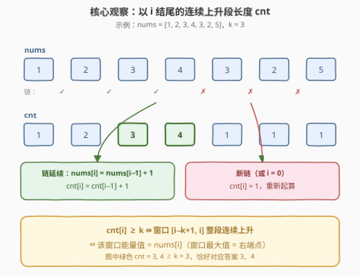
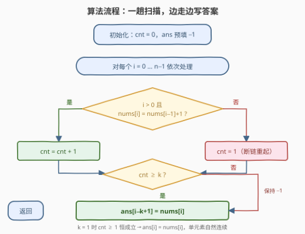
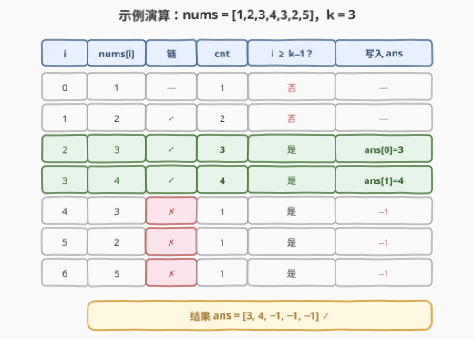

# 长度为 K 的子数组的能量值 II

- **题目名称**：长度为 K 的子数组的能量值 II
- **链接**：[3255. 长度为 K 的子数组的能量值 II](https://leetcode.cn/problems/find-the-power-of-k-size-subarrays-ii/)
- **难度**：中等
- **标签**：数组、动态规划、滑动窗口

## 1. 题目概述

给你一个长度为 $n$ 的整数数组 `nums` 和一个正整数 $k$。一个数组的**能量值**定义为：

- 如果**所有**元素都是依次**连续**（即 $nums[i] + 1 = nums[i + 1]$）且**上升**的，那么能量值为**最大**的元素；
- 否则为 $-1$。

你需要求出 `nums` 中所有长度为 $k$ 的**子数组**的能量值。返回一个长度为 $n - k + 1$ 的整数数组 `results`，其中 $results[i]$ 是子数组 $nums[i..(i+k-1)]$ 的能量值。

**示例 1**：

```text
输入：nums = [1,2,3,4,3,2,5], k = 3
输出：[3,4,-1,-1,-1]
解释：
     [1,2,3] → 连续上升，最大值 3
     [2,3,4] → 连续上升，最大值 4
     [3,4,3] / [4,3,2] / [3,2,5] → 不满足，均为 -1
```

**示例 2**：

```text
输入：nums = [2,2,2,2,2], k = 4
输出：[-1,-1]
```

**示例 3**：

```text
输入：nums = [3,2,3,2,3,2], k = 2
输出：[-1,3,-1,3,-1]
```

**约束条件**：

- $1 \le n = nums.length \le 10^5$
- $1 \le nums[i] \le 10^6$
- $1 \le k \le n$

> 💡 读题关键：① 「依次连续且上升」是对**相邻对**的约束——窗口 $[i,\ i+k-1]$ 合法当且仅当其中 $k-1$ 个相邻对都满足 $nums[j+1] = nums[j] + 1$；② 合法窗口是**连续上升段**，最大值天然就是**右端点** $nums[i+k-1]$，「求最大值」这步是免费的；③ II 版 $n \le 10^5$、$n \cdot k$ 最坏 $10^{10}$，暴力必超时，必须 $O(n)$。

---

## 2. 解题思路

### 2.1 暴力思路：逐窗口验证

对每个起点 $i \in [0,\ n-k]$，花 $O(k)$ 扫一遍窗口内的 $k-1$ 个相邻对，全部满足则答案为 $nums[i+k-1]$，否则为 $-1$。总复杂度 $O(nk)$，最坏 $10^{10}$ 次比较，II 版直接超时（I 版 3254 的 $n \le 500$ 才允许这么做）。

问题出在**相邻对被反复检查**：位置 $j$ 与 $j+1$ 这一对关系，会出现在至多 $k$ 个窗口里被验证 $k$ 次。把「一对只查一次」的信息**聚合**起来向右传递，就能消掉这层 $k$。

### 2.2 核心观察：以 i 结尾的连续段长度，一个变量通吃



**定义** $cnt[i]$ = **以 $i$ 结尾**的最长连续上升段长度：

$$cnt[i] = \begin{cases} cnt[i-1] + 1, & i > 0 \text{ 且 } nums[i] = nums[i-1] + 1 \\ 1, & \text{否则（断链或 } i = 0\text{，重新起算）} \end{cases}$$

**关键等价**：窗口 $[i-k+1,\ i]$ 整段连续上升 $\iff$ 其中 $k-1$ 个相邻对全部无断点 $\iff$ $cnt[i] \ge k$（计数从断点后一路累计，没断到 $i$ 就至少攒够 $k$ 个）。

于是一趟扫描即可边走边写答案：

$$results[i-k+1] = \begin{cases} nums[i], & cnt[i] \ge k \\ -1, & \text{否则} \end{cases}$$

> 💡 两个「免费」：① 合法窗口是连续上升段，**最大值 = 右端点** $nums[i]$，无需 239 那样的单调队列；② $cnt$ 只依赖 $cnt[i-1]$，滚动成一个 $O(1)$ 变量即可，连 DP 数组都不用开——这本质是 [674. 最长连续递增序列](https://leetcode.cn/problems/longest-continuous-increasing-subsequence/) 的段长数组顺手拿来判窗口。

### 2.3 算法流程图



`ans` 预填 $-1$（非法窗口的默认值），单变量 `cnt` 随扫描维护，`cnt ≥ k` 时把右端点值写进对应答案位。

### 2.4 示例演算



以 `nums = [1,2,3,4,3,2,5]`、$k = 3$ 走一遍：

| $i$ | $nums[i]$ | 链 | $cnt$ | 写入 |
|-----|-----------|-----|-------|------|
| 0 | 1 | — | 1 | —（窗口未形成） |
| 1 | 2 | ✓ | 2 | — |
| 2 | 3 | ✓ | **3** | $results[0] = 3$ |
| 3 | 4 | ✓ | **4** | $results[1] = 4$ |
| 4 | 3 | ✗ | 1 | $results[2] = -1$ |
| 5 | 2 | ✗ | 1 | $results[3] = -1$ |
| 6 | 5 | ✗（$5 \ne 2+1$） | 1 | $results[4] = -1$ |

结果 $[3, 4, -1, -1, -1]$，与示例一致 ✓。注意 $i = 6$：值 $5$ 比 $2$ 大，但**大不行，要恰好大 $1$**——「连续」比「上升」更苛刻。

---

## 3. 参考代码

### C++

```cpp
class Solution {
  public:
    vector<int> resultsArray(vector<int>& nums, int k) {
        int n = nums.size();
        vector<int> ans(n - k + 1, -1);          // 非法窗口默认 -1
        int cnt = 0;                             // 以 i 结尾的连续上升段长度
        for (int i = 0; i < n; ++i) {
            cnt = (i > 0 && nums[i] == nums[i - 1] + 1) ? cnt + 1 : 1;
            if (cnt >= k)                        // 窗口 [i-k+1, i] 整段连续
                ans[i - k + 1] = nums[i];        // 最大值 = 右端点
        }
        return ans;
    }
};
```

### Python

```python
class Solution:
    def resultsArray(self, nums: List[int], k: int) -> List[int]:
        n = len(nums)
        ans = [-1] * (n - k + 1)                 # 非法窗口默认 -1
        cnt = 0                                  # 以 i 结尾的连续上升段长度
        for i, x in enumerate(nums):
            cnt = cnt + 1 if i and x == nums[i - 1] + 1 else 1
            if cnt >= k:                         # 窗口 [i-k+1, i] 整段连续
                ans[i - k + 1] = x               # 最大值 = 右端点
        return ans
```

> 💡 实现细节：① $k = 1$ 时 $cnt \ge 1$ 恒成立，自动得到 $results[i] = nums[i]$（单元素天然连续），**无需特判**；② $nums[i] \le 10^6$，`nums[i-1] + 1` 在 `int` 内绝不溢出；③ `cnt` 用条件表达式而非 `if/else` 块，断链与 $i = 0$ 共用「重新起算」分支。

---

## 4. 复杂度分析

| 维度 | 复杂度 | 说明 |
|------|--------|------|
| 时间复杂度 | $O(n)$ | 每个位置 $O(1)$：一次相邻比较 + 一次写答案 |
| 空间复杂度 | $O(1)$ | 只滚动了 `cnt` 一个变量（输出数组不计） |
| 暴力对照 | $O(nk)$ | 相邻对被至多 $k$ 个窗口重复检查，最坏 $10^{10}$ |

实测（本机）：$n = 10^5$ 的极端用例（全连续上升 / 全随机各一），C++ 约 0.1ms、Python 约 15ms；另与 $O(nk)$ 暴力对拍随机数据（$n \le 12$）20000 组全部一致。

---

## 5. 扩展：滑动窗口「断点计数」视角与官方 hint 的红鲱鱼

**断点计数**：把每个满足 $nums[j] \ne nums[j-1] + 1$ 的位置记为一个**断点**，则「窗口合法 $\iff$ 窗口内断点数为 $0$」。维护窗口 $[i,\ i+k-1]$ 内的断点数 `broken`：右端进入时累加新相邻对的断点状态，左端滑出时减去离开的相邻对——这是标准的滑窗增量更新：

```cpp
vector<int> resultsArray(vector<int>& nums, int k) {
    int n = nums.size(), broken = 0;
    vector<int> ans;
    for (int j = 1; j < k; ++j)                // 首个窗口 [0, k-1] 的断点数
        broken += (nums[j] != nums[j - 1] + 1);
    ans.push_back(broken == 0 ? nums[k - 1] : -1);
    for (int i = 1; i + k <= n; ++i) {         // 窗口右移一格，增量更新
        broken += (nums[i + k - 1] != nums[i + k - 2] + 1);  // 新相邻对进入
        broken -= (nums[i] != nums[i - 1] + 1);              // 旧相邻对离开
        ans.push_back(broken == 0 ? nums[i + k - 1] : -1);
    }
    return ans;
}
```

> 💡 同为 $O(n)/O(1)$，**段长计数版（正文解法）把「断点位置」坍缩成「距上个断点的距离」**，一个 `cnt` 变量完成同样的判断，且无首个窗口的初始化分支，是更优雅的实现。断点计数的价值在于**通用性**：若窗口的判定条件换成一棵平衡树/哈希表能维护的任意谓词（如「窗口内元素互不相同」「窗口内众数出现次数 $\ge m$」），这套「右进左出增量更新」框架依然成立——本质与 [239. 滑动窗口最大值](https://leetcode.cn/problems/sliding-window-maximum/) 的单调队列同属「窗口结构复用」思想。

**关于官方 hints**：本题 hint 依次提示「dp[i] 表示以 i 结尾的最长连续段」「用 TreeMap 配滑窗」——其中 TreeMap 是把简单问题复杂化的红鲱鱼（本题值无需有序维护），真正有用的只有第一条：$cnt[i] \ge k$ 的判定让「窗口内是否存在断点」退化为「距最近断点的距离」，TreeMap、单调栈（最后一条 hint）统统不需要。

**与 3254 的关系**：[3254. 长度为 K 的子数组的能量值 I](https://leetcode.cn/problems/find-the-power-of-k-size-subarrays-i/) 是同一道题的弱化版（$n \le 500$，$O(nk)$ 暴力可过）；II 版把 $n$ 放大到 $10^5$ 逼出线性解。本文的 $O(n)$ 代码一份通吃两题。

---

## 6. 面试要点

1. **合法窗口的最大值为什么不用单调队列求？**

   - 窗口合法的前提是「整段连续上升」，此时最大值**恒等于右端点** $nums[i+k-1]$，直接取用即可。[239. 滑动窗口最大值](https://leetcode.cn/problems/sliding-window-maximum/) 的单调队列是给「窗口内元素任意」准备的；先想清楚「合法性判定」与「最值查询」谁才是本题的瓶颈，能省掉一整个数据结构。

2. **$cnt[i] \ge k$ 为什么恰好等价于窗口整段连续？两个方向怎么论证？**

   - **充分**：$cnt[i] \ge k$ 说明从某个断点后一路累计，$[i-k+1,\ i]$ 内的 $k-1$ 个相邻对全无断点，窗口合法；**必要**：窗口合法则这 $k-1$ 对都不断，计数从窗口左端（或更早）累计到 $i$，至少为 $k$。本质是「断点位置」与「距上个断点距离」的互推。

3. **$k = 1$、$k = n$、全相等数组这些边界怎么处理？**

   - $k = 1$：$cnt \ge 1$ 恒真，答案就是 `nums` 本身，代码无需特判；$k = n$：输出只有一个元素，仅当整个数组连续上升时非 $-1$；全相等如 `[2,2,2,2,2]`：$nums[j] \ne nums[j-1]+1$，$cnt$ 恒为 $1$，只要 $k > 1$ 全为 $-1$（示例 2 验证）。

4. **这个「以 i 结尾」的套路还在哪里见过？**

   - 它是 [300. 最长递增子序列](https://leetcode.cn/problems/longest-increasing-subsequence/) 家族中「**连续**版」的统一姿态：[674. 最长连续递增序列](https://leetcode.cn/problems/longest-continuous-increasing-subsequence/) 直接对 $cnt$ 取全局 max；[413. 等差数列划分](https://leetcode.cn/problems/arithmetic-slices/) 把「相邻差为 1」换成「相邻差为公差 $d$」并统计段内方案数；[3208. 交替组 II](https://leetcode.cn/problems/alternating-groups-ii/)（[站内题解](3208_交替组II.md)）把相邻关系换成「交替」并破环成链。**相邻对的局部约束 → 段长/方案的右向传递**，是同一招的不同皮肤。

5. **如果值域是负数或可能溢出，比较 `nums[i] == nums[i-1] + 1` 要注意什么？**

   - `nums[i-1] + 1` 在 `int` 边界（$nums[i-1] = \text{INT\_MAX}$）会上溢成 UB；稳妥写法是比较差值 `nums[i] - nums[i-1] == 1`（有符号溢出同样要小心时改用 `long long`），或比较 `nums[i] > nums[i-1] && nums[i] - nums[i-1] == 1`。本题 $1 \le nums[i] \le 10^6$，无此顾虑。

---

## 7. 同类练习题

- [3254. 长度为 K 的子数组的能量值 I](https://leetcode.cn/problems/find-the-power-of-k-size-subarrays-i/)：同一道题的弱化版（$n \le 500$），可先用 $O(nk)$ 暴力过关，再用本文 $O(n)$ 解法一份代码通吃 I/II
- [674. 最长连续递增序列](https://leetcode.cn/problems/longest-continuous-increasing-subsequence/)：$cnt$ 数组的原型——「以 $i$ 结尾的连续递增段长」取全局最大值，本题只是顺手多判了一个阈值 $k$
- [413. 等差数列划分](https://leetcode.cn/problems/arithmetic-slices/)：把「相邻差恰为 1」推广为「相邻差恒为 $d$」，同样以 $i$ 结尾的段长计数，再按段长统计方案数
- [3208. 交替组 II](https://leetcode.cn/problems/alternating-groups-ii/)（[站内题解](3208_交替组II.md)）：同区间姊妹题——环形数组上「相邻交替」的定长窗口判定，破环成链 + 段长计数，与本题互为镜像练习
- [239. 滑动窗口最大值](https://leetcode.cn/problems/sliding-window-maximum/)（[站内题解](../0201-0300/239_滑动窗口最大值.md)）:对照题——当窗口**没有**「整段连续」这种结构可白嫖右端点时，才需要单调队列维护任意窗口最值
