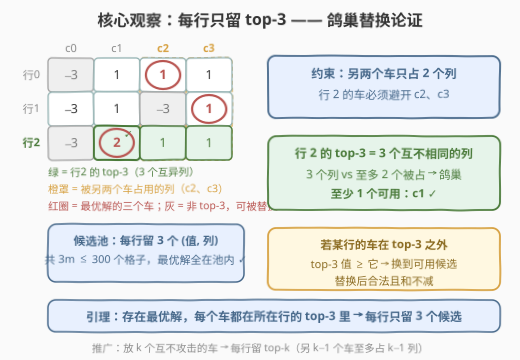
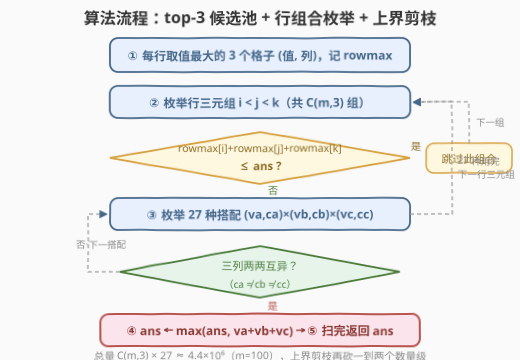
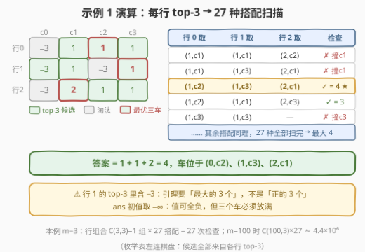

# LeetCode 放三个车的价值和最大 I 题解

## 1. 题目概述

- **标题 / 题号**：放三个车的价值和最大 I（#3256，hard）
- **链接**：https://leetcode.cn/problems/maximum-value-sum-by-placing-three-rooks-i/
- **难度**：困难
- **标签**：数组、枚举、矩阵、动态规划

**题意**：给你一个 $m \times n$ 的二维整数数组 `board`，表示一个国际象棋棋盘，`board[i][j]` 是格子 $(i, j)$ 的**价值**。处于**同一行**或**同一列**的车会互相攻击。你需要放**恰好三个**车，使它们两两无法互相攻击，返回三个车所在格子的**价值之和最大**为多少。

一句话读题：在矩阵里选 3 个格子，任意两格**不同行且不同列**，最大化三格之和。

**示例 1**：

```text
输入：board = [[-3,1,1,1],[-3,1,-3,1],[-3,2,1,1]]
输出：4
解释：车放在 (0,2)、(1,3)、(2,1)，价值和 1 + 1 + 2 = 4。
```

**示例 2**：

```text
输入：board = [[1,2,3],[4,5,6],[7,8,9]]
输出：15
解释：车放在 (0,0)、(1,1)、(2,2)，主对角线 1 + 5 + 9 = 15。
```

**示例 3**：

```text
输入：board = [[1,1,1],[1,1,1],[1,1,1]]
输出：3
解释：任何行列互异的三个格子都行，和恒为 3。
```

**约束**：

- $3 \le m = board.length \le 100$
- $3 \le n = board[i].length \le 100$
- $-10^9 \le board[i][j] \le 10^9$

> 💡 读题关键：两个陷阱先立起来——① 值域低至 $-10^9$，**全负的棋盘也得硬着头皮放满 3 个车**（车数是定值不是上限），所以答案要初始化为 $-\infty$ 而非 0，累加和最高 $3 \times 10^9$ 还得防 int 溢出；② 规模 $m, n \le 100$ 意味着 $\binom{m}{3} \times 27 \approx 4.4 \times 10^6$ 落在枚举甜区——这正是版本 I 与 II（3257，$m,n \le 500$）的分水岭。

## 2. 解题思路

### 2.1 暴力思路：枚举格子三元组

无脑做法是枚举全部 $\binom{mn}{3} \approx \binom{10^4}{3} \approx 1.7 \times 10^{11}$ 个格子三元组，逐个验证行、列互异——天文数字。退一步，先在外层锁定**行组合** $\binom{m}{3} \approx 1.6 \times 10^5$，行内再枚举列组合 $\binom{n}{3} \approx 1.7 \times 10^5$，相乘仍是 $10^{10}$ 量级，不可行。

> ⚠️ 卡点：行互异这维已经被压到 $\binom{m}{3}$，剩下的爆炸源是「每行不知道该看哪几列」。如果每行只需考察**常数个**候选列，整体就降到 $O(m^3)$——这正是下面的核心观察。

### 2.2 核心观察：每行只需保留 top-3（鸽巢替换论证）



**引理**：存在一个最优解，其中每个车都落在它所在行**值最大的 3 个格子**之一。

**证明（替换论证）**：任取一个最优解 $\{(r_1,c_1),(r_2,c_2),(r_3,c_3)\}$（行、列分别互异）。看行 $r_1$ 里的车：另外两个车只占用了 $c_2, c_3$ **两个列**。若 $(r_1, c_1)$ 不在行 $r_1$ 的 top-3 中，则行 $r_1$ 的 top-3 值都 $\ge board[r_1][c_1]$（最大的 3 个值不小于任何落选值）；而 top-3 是**同一行的 3 个不同位置**，占据 3 个互不相同的列——3 个列里至多 2 个被 $\{c_2, c_3\}$ 占着，**鸽巢原理**保证至少有 1 个候选列 $c' \notin \{c_2, c_3\}$。把车挪到 $(r_1, c')$：仍在行 $r_1$、列避开另外两车，约束依然满足，总和不减。对行 $r_2, r_3$ 如法炮制，即得一个全部落在各行 top-3 上的最优解。∎

于是把每行 top-3（值 + 列号）收进**候选池**：

- 池大小 $3m \le 300$，**最优解完全落在池内**；
- 枚举行组合 $\binom{m}{3}$，每个组合内 $3 \times 3 \times 3 = 27$ 种候选搭配，逐一检查列互异——总量 $\approx 4.4 \times 10^6$，轻松通过。

> 💡 放 $k$ 个互不攻击的车，同样的论证给出一般结论：另 $k-1$ 个车至多占 $k-1$ 列，每行只需保留 **top-k**。本题 $k = 3$。

### 2.3 算法流程图



流程共五步：

1. 每行取出值最大的 3 个格子（值, 列），同时记录每行最大值 $rowmax[i]$；
2. 枚举所有行三元组 $i < j < k$（共 $\binom{m}{3}$ 组）；
3. **上界剪枝**：若 $rowmax[i] + rowmax[j] + rowmax[k] \le ans$，这个三元组不可能更优，直接跳过（一次比较省掉 27 次内层检查）；
4. 对三元组的 27 种候选搭配逐一验证三列两两互异，合法则用 $va + vb + vc$ 更新 $ans$；
5. 所有行三元组处理完，返回 $ans$。

### 2.4 示例演算

以示例 1 的 `board = [[-3,1,1,1],[-3,1,-3,1],[-3,2,1,1]]` 为例，$m = 3$ 只有唯一的行组合 $(0,1,2)$，焦点全在「每行留哪 3 个」与「27 种搭配怎么扫」：



每行 top-3（值, 列），并列时任取：

| 行 | 全部值 | top-3（值, 列） | 淘汰 |
|----|--------|-----------------|------|
| 0 | $-3,1,1,1$ | $(1,c_1),(1,c_2),(1,c_3)$ | $-3$（$c_0$） |
| 1 | $-3,1,-3,1$ | $(1,c_1),(1,c_3),(-3,c_0)$ | $-3$（$c_2$） |
| 2 | $-3,2,1,1$ | $(2,c_1),(1,c_2),(1,c_3)$ | $-3$（$c_0$） |

注意**行 1 的 top-3 里含 $-3$**——引理要的是「最大的 3 个」，不是「正的 3 个」。27 种搭配中若干典型步骤：

| 步骤 | 行 0 取 | 行 1 取 | 行 2 取 | 检查 | 结果 |
|------|---------|---------|---------|------|------|
| 1 | $(1,c_1)$ | $(1,c_1)$ | $(2,c_2)$ | $c_1$ 撞列 | ✗ 跳过 |
| 2 | $(1,c_1)$ | $(1,c_3)$ | $(2,c_1)$ | $c_1$ 撞列 | ✗ 跳过 |
| 3 | $(1,c_2)$ | $(1,c_3)$ | $(2,c_1)$ | 三列互异 ✓ | $1+1+2=\mathbf{4}$ ★ |
| 4 | $(1,c_2)$ | $(1,c_1)$ | $(2,c_3)$ | 三列互异 ✓ | $1+1+1=3$ |
| 5 | $(1,c_3)$ | $(1,c_3)$ | $(2,c_2)$ | $c_3$ 撞列 | ✗ 跳过 |
| … | … | … | … | … | 最大值维持 4 |

27 种搭配全部扫完，**答案 = 4**，与示例一致（车位于 $(0,2),(1,3),(2,1)$）。

## 3. 参考代码

### C++

```cpp
class Solution {
  public:
    long long maximumValueSum(vector<vector<int>>& board) {
        int m = board.size();
        vector<vector<pair<int, int>>> top(m);   // 每行 top-3：(值, 列)
        vector<long long> rowmax(m);             // 每行最大值，用于上界剪枝
        for (int i = 0; i < m; i++) {
            vector<pair<int, int>> cells;
            for (int j = 0; j < (int)board[i].size(); j++)
                cells.emplace_back(board[i][j], j);
            partial_sort(cells.begin(), cells.begin() + 3, cells.end(),
                         greater<pair<int, int>>());
            top[i].assign(cells.begin(), cells.begin() + 3);
            rowmax[i] = cells[0].first;
        }

        long long ans = LLONG_MIN;
        for (int i = 0; i < m; i++)
            for (int j = i + 1; j < m; j++)
                for (int k = j + 1; k < m; k++) {
                    if (rowmax[i] + rowmax[j] + rowmax[k] <= ans)
                        continue;                 // 上界剪枝：此行三元组不可能更优
                    for (auto& [va, ca] : top[i])
                        for (auto& [vb, cb] : top[j]) {
                            if (ca == cb) continue;
                            for (auto& [vc, cc] : top[k]) {
                                if (cc == ca || cc == cb) continue;
                                ans = max(ans, (long long)va + vb + vc);
                            }
                        }
                }
        return ans;
    }
};
```

### Python

```python
class Solution:
    def maximumValueSum(self, board: List[List[int]]) -> int:
        m = len(board)
        top, rowmax = [], []
        for row in board:
            # 值最大的 3 个列（并列时任取），降序
            idx = sorted(range(len(row)), key=lambda c: row[c], reverse=True)[:3]
            top.append([(row[c], c) for c in idx])
            rowmax.append(row[idx[0]])

        ans = float('-inf')
        for i in range(m):
            for j in range(i + 1, m):
                for k in range(j + 1, m):
                    if rowmax[i] + rowmax[j] + rowmax[k] <= ans:
                        continue                  # 上界剪枝：此行三元组不可能更优
                    for va, ca in top[i]:
                        for vb, cb in top[j]:
                            if ca == cb:
                                continue
                            ab = va + vb
                            for vc, cc in top[k]:
                                if cc == ca or cc == cb:
                                    continue
                                if ab + vc > ans:
                                    ans = ab + vc
        return ans
```

> 💡 细节盘点：① `ans` 初始化 $-\infty$——三个车**必须放满**，全负棋盘也要选「最不亏」的三格，绝不能用 0；② 和最高 $3 \times 10^9$，C++ 用 `long long`，`rowmax` 同步用 `long long` 防剪枝表达式溢出；③ `n >= 3` 恒成立，`partial_sort` 取前 3 个不会越界；④ 上界剪枝是纯加速不影响正确性——$rowmax$ 之和是该行三元组能达到的理论上限，$\le ans$ 时 27 种搭配全可跳过，实测能把随机 $100 \times 100$ 用例的枚举量砍掉两个数量级。

## 4. 复杂度分析

| 维度 | 复杂度 | 说明 |
|------|--------|------|
| 时间复杂度 | $O(mn + m^3)$ | 每行取 top-3 共 $O(mn)$；行组合 $\binom{m}{3} \times 27 = O(m^3)$，$m = 100$ 时约 $4.4 \times 10^6$ 次内层检查 |
| 空间复杂度 | $O(m)$ | 每行只存 3 个候选（值, 列）与一个 $rowmax$ |
| 暴力对照 | $O(m^3 n^3)$ | 行组合 $\times$ 每行列组合 $\approx 2.7 \times 10^{10}$；top-3 把「每行列枚举」压成常数 27，降了 4 个数量级 |

## 5. 扩展：版本 II（3257）——规模放大后的出路

同场的 [3257. 放三个车的价值和最大 II](https://leetcode.cn/problems/maximum-value-sum-by-placing-three-rooks-ii/) 把 $m, n$ 放大到 $500$：$\binom{500}{3} \times 27 \approx 5.6 \times 10^8$，C++ 勉强、Python 必超时。**top-3 引理与规模无关、依然成立**，要换掉的是「三重组合枚举」本身：

- **思路一（枚举前两个 + 预处理第三个）**：枚举候选池中前两辆车（$O(m^2)$ 对，行、列互异），第三辆车需避开它们的 2 行 2 列。对每个**列对** $(c_1, c_2)$ 预先保留「避开这两列时值最大的 3 行」——又是一层鸽巢：前两辆车只占 2 行，3 行里必有 1 行可用，查表 O(1)。预处理 $O(mn^2)$（$m > n$ 时转置取小者），总计 $O(mn^2 + m^2)$，C++ 稳过。
- **思路二（逐行 DP）**：把组合枚举改成一遍扫描——状态携带已放车数与已用列集合（大小 $\le 3$，且都来自已处理行的候选列），行内转移时才做列冲突判断，避免在「还没确定同伴」时盲目组合。

> 💡 两版对照是很好的复杂度敏感性训练：约束从 $100$ 放大到 $500$，$O(m^3)$ 从 $4 \times 10^6$ 膨胀到 $5 \times 10^8$——同一个引理，枚举结构必须跟着换。

## 6. 面试要点

1. **为什么每行只保留 top-3 不会漏掉最优解？**

   - 替换论证：最优解中另外两个车只占 2 个列，本行 top-3 占 3 个互不相同的列，鸽巢原理保证至少 1 个候选列可用；且 top-3 的值不小于被替换格子的值——替换后仍合法且总和不减。逐行替换即得全落在 top-3 内的最优解。

2. **为什么是 3 个而不是 2 个？少了多了会怎样？**

   - 若只留 top-2，两个候选列可能恰好被另外两个车全占，被迫丢解；留 4 个则浪费。一般放 $k$ 个互不攻击的车，每行留 top-k（另 $k-1$ 个车至多占 $k-1$ 列）。

3. **值可能全负，实现上有哪些坑？**

   - 三个车必须放满：`ans` 初始化 $-\infty$ 而非 0；`max` 比较不能用「正数才更新」；和最高 $3 \times 10^9$，C++ 需要 `long long`，连剪枝表达式 `rowmax[i]+rowmax[j]+rowmax[k]` 也要防 int 溢出。

4. **枚举为什么按「行组合」组织而不是「格子组合」？**

   - 行互异先在外层锁定 $\binom{m}{3}$，行内候选被 top-3 压成常数，总量 $\binom{m}{3} \times 27 \approx 4.4 \times 10^6$；而格子组合 $\binom{mn}{3} \approx 10^{11}$，差 5 个数量级。「先定哪几行，再定每行哪几列」是这类二维约束题的通用降维姿势。

5. **如果 $m, n$ 放大到 500（版本 II）怎么办？**

   - $O(m^3)$ 膨胀到 $5.6 \times 10^8$ 不可行。改「枚举前两辆车 + 按列对预处理第三辆车的 top-3 行」（鸽巢再用一次），或逐行 DP 携带已用列集合——见第 5 节。

## 同类练习题

| # | 题目 | 与本题的关联 |
|---|------|-------------|
| 3257 | [放三个车的价值和最大 II](https://leetcode.cn/problems/maximum-value-sum-by-placing-three-rooks-ii/) | 同场进阶版，$m, n \le 500$ 逼你把三重枚举换成「枚举两个 + 预处理第三个」的结构 |
| 1439 | [有序矩阵中的第 k 个最小数组和](https://leetcode.cn/problems/find-the-kth-smallest-sum-of-a-matrix-with-sorted-rows/) | 同样吃透「每行只需保留前 k 个候选」的多路归并思想，与 top-k 引理互为镜像 |
| 52 | [N 皇后 II](https://leetcode.cn/problems/n-queens-ii/) | 棋盘无攻击放置的计数版（约束更严：加对角线），DFS 回溯与本题为「计数 vs 最优化」对照 |
| 1937 | [扣分后的最大得分](https://leetcode.cn/problems/maximum-number-of-points-with-cost/) | 矩阵逐行 DP 处理列约束（前缀/后缀最大值优化），与第 5 节思路二同属「逐行扫描」家族 |
