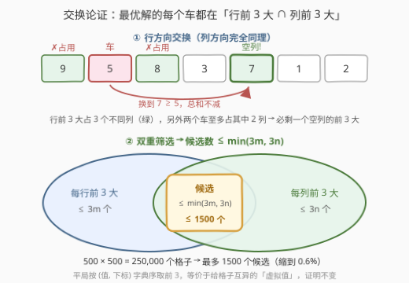
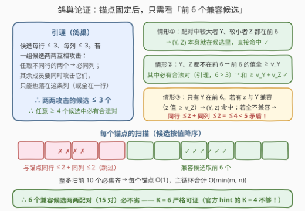
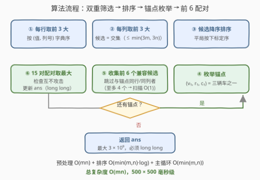
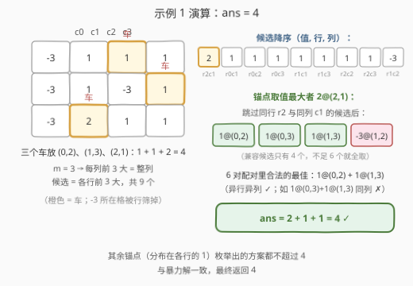

# LeetCode 放三个车的价值之和最大 II 题解

## 1. 题目概述

- **标题 / 题号**：放三个车的价值之和最大 II（#3257，hard）
- **链接**：https://leetcode.cn/problems/maximum-value-sum-by-placing-three-rooks-ii/
- **难度**：困难
- **标签**：数组、枚举、排序、矩阵

**题意**：给你一个 $m \times n$ 的二维整数数组 `board`，表示国际象棋棋盘，`board[i][j]` 表示格子 $(i, j)$ 的**价值**。处于**同一行**或**同一列**的车会互相**攻击**。需要在棋盘上放**三个**车，使它们两两之间都**无法互相攻击**，返回三个车所在格子**价值之和的最大值**。

**示例 1**：

```text
输入：board = [[-3,1,1,1],[-3,1,-3,1],[-3,2,1,1]]
输出：4
解释：车放在 (0, 2)、(1, 3)、(2, 1)，价值之和为 1 + 1 + 2 = 4。
```

**示例 2**：

```text
输入：board = [[1,2,3],[4,5,6],[7,8,9]]
输出：15
解释：车放在 (0, 0)、(1, 1)、(2, 2)（对角线），价值之和为 1 + 5 + 9 = 15。
```

**示例 3**：

```text
输入：board = [[1,1,1],[1,1,1],[1,1,1]]
输出：3
```

**约束**：

- $3 \le m = \text{board.length} \le 500$，$3 \le n = \text{board[i].length} \le 500$
- $-10^9 \le \text{board[i][j]} \le 10^9$

> ⚠️ 答案最大 $3 \times 10^9$，超过 `int32` 上界 $2.1 \times 10^9$，**必须用 `long long`**。
>
> 本题与 [3256. 放三个车的价值之和最大 I](https://leetcode.cn/problems/maximum-value-sum-by-placing-three-rooks-i/) 题面完全一致，唯一区别是规模：I 版 $m, n \le 100$ 养得起暴力枚举，本题 $m, n \le 500$ 把候选组合数放大两个数量级，逼出带严格证明的候选缩减。

## 2. 解题思路

### 2.1 暴力思路：组合爆炸 + 官方 hint 的「前 4 个」陷阱

**直接暴力**：枚举所有三个格子的组合并检查行列互不相同，组合数 $\binom{mn}{3} \approx \binom{250000}{3} \approx 2.6 \times 10^{15}$——彻底爆炸。

**第一反应的剪枝**（也是本题官方 hints 的路线）： hints 提示「每行存前 3 大；任选一行及其一个值；从其余各行前 3 大中取与它不同列的前 4 个值；暴力从中选 2 个」。**这条路线是错的**，一个反例就能 hack：

```text
board = [[2,1,0]] × 7        （7 行完全相同）

每行前 3 大 = 整行 → 21 个候选全部挤在 c0/c1/c2 三列上
- 锚点在列 0：兼容（不同列）的候选按值排序，前 6 个全是列 1 的那些 1 → 全部同列，配不出合法对
- 锚点在列 1 或列 2：兼容的前 6 个全是列 0 的那些 2 → 同样全部同列
→ 任何固定 K 的「前 K 个兼容候选」都找不到合法方案（除非 K ≥ m）
```

**根因**：只按行剪枝时，**同一列里可以挤进多达 $m$ 个候选**。「与锚点兼容的候选」的头部可能整段卡在同一列，固定个数的「前 K 个」剪枝就没有安全界。要让「前 K 个」型剪枝成立，必须把**列方向也剪掉**。

### 2.2 核心观察：双重筛选——行前 3 大 ∩ 列前 3 大



**观察 1（行方向交换论证）**：最优解中的某个车若不在所在行的前 3 大，可以换成前 3 大中的某个格子而总和不减。

> 证明：设车在 $(r, c)$，另外两个车分别在不同的行、不同的列，它们**至多占用 2 个列**。行 $r$ 的前 3 大占据 **3 个不同的列**，其中至少 1 个列没被另外两个车占用——把车换到这个格子：行不同列不同依旧互不攻击，且新格子的值 $\ge$ 原值（它在行前 3 大里）。$\blacksquare$

**观察 2（列方向交换论证）**：完全对称——车若不在所在列的前 3 大，换成列前 3 大中行未被占用的格子，总和不减（列前 3 大占 3 个不同的行，另外两个车至多占 2 个行）。

于是**候选集 = 行前 3 大 ∩ 列前 3 大**：

- 行筛选后每行 $\le 3$ 个 → 候选 $\le 3m$；列筛选后每列 $\le 3$ 个 → 候选 $\le 3n$；
- 合计 $\le \min(3m, 3n) \le 1500$ 个，$250{,}000$ 个格子瞬间缩到 $0.6\%$。

> 💡 **平局怎么取前 3**：按「(值, 下标) 字典序」取。这等价于给每个格子一个互异的**虚拟值**（值相同者按下标分出先后），所有交换论证在虚拟值下原样成立，而虚拟值最优的三元组必然也是真实值最优的（虚拟值先比真实值）。

### 2.3 鸽巢论证：为什么剩下两个车只看「前 6 个兼容候选」



双重筛选后候选有一个关键性质：**每行 $\le 3$ 个、每列 $\le 3$ 个**。由此得到本题的证明基石：

**引理（鸽巢）**：两两互相攻击的一组候选，大小 $\le 3$。

> 证明：设一组候选两两互相攻击（任两个同行或同列）。任取**不同行**的两个 $A=(r_A, c)$、$B=(r_B, c)$（不同行又互相攻击 ⇒ 必同列）。其余任一成员 $C$ 要同时与 $A$、$B$ 攻击：若 $C$ 与 $A$ 同行，则 $C$ 与 $B$ 不同行，须同列 $c$，但 $(r_A, c) = A$ 已占，矛盾；故 $C$ 与 $A$、$B$ 都不同行，须同时与两者同列 ⇒ $C$ 也在列 $c$。于是**全组都挤在同一列**（或对称地全在同一行），而每列（行）至多 3 个候选。$\blacksquare$
>
> 推论：**任意 $\ge 4$ 个候选中必有一对互不攻击的合法对。**

**主论证**：枚举每个候选作为**锚点**（三辆车之一）。设最优解的另两辆车为 $Y$、$Z$（$v_Y \ge v_Z$），它们都在与锚点不同行不同列的兼容候选序列 $L$ 里（按值降序）。看它们落在「前 6 个兼容候选」的里外，分三种情形：

| 情形 | 结论 |
|------|------|
| ① $Y$、$Z$ 都在前 6 | 配对 $(Y, Z)$ 本身就在枚举范围内，直接命中 ✓ |
| ② 都不在前 6 | 前 6 个的值全都 $\ge v_Y \ge v_Z$；由引理（$6 > 3$）前 6 中必有合法对，其和 $\ge v_Y + v_Z$ ✓ |
| ③ 只有 $Y$ 在前 6 | 若前 6 中有与 $Y$ 兼容的 $z$（其值 $\ge$ 第 6 大 $\ge v_Z$），则 $(Y, z)$ 命中 ✓；若其余 5 个**都不与 $Y$ 兼容**——与 $Y$ 同行的候选 $\le 2$、同列的 $\le 2$，合计 $\le 4 < 5$，矛盾 ✓ |

三种情形全部命中的反面是不存在的——**所以「取前 6 个兼容候选两两配对（15 对）」必然覆盖最优补全**，$K = 6$ 严格可证。反观官方 hint 的 $K = 4$：情形③的矛盾需要「其余 5 个 > 至多 4 个冲突」才成立，只取前 4 时「其余 3 个 $\le 4$」完全可能全部冲突——证明关不上门，2.1 的反例更是直接把「仅行筛选」判了死刑。

> 💡 **意外的福利——每锚点扫描 $O(1)$**：与锚点**同行**的候选 $\le 2$ 个（该行 $\le 3$ 个候选、含锚点自己）、**同列**的 $\le 2$ 个，所以从排序表头往下扫，**至多跳过 4 个**就能集齐 6 个兼容候选——每个锚点只看前 10 个左右！主循环从「看似 $O((3m)^2)$」塌缩成 $O(\min(m, n) \times 15)$，整题变成准线性。

### 2.4 算法流程图



流程共六步：双重筛选出候选（$\le \min(3m, 3n)$ 个）→ 按值降序排序 → 枚举锚点 → 跳过同行/同列者收集前 6 个兼容候选 → 15 个配对中取互不攻击的最大和更新答案 → 所有锚点处理完返回 `ans`。

### 2.5 示例演算



以示例 1 走一遍：$m = 3$，每列前 3 大就是整列，候选 = 各行前 3 大共 9 个，按（值, 行, 列）降序为：

| 次序 | 1 | 2 | 3 | 4 | 5 | 6 | 7 | 8 | 9 |
|------|---|---|---|---|---|---|---|---|---|
| 候选 | 2@(2,1) | 1@(0,1) | 1@(0,2) | 1@(0,3) | 1@(1,1) | 1@(1,3) | 1@(2,2) | 1@(2,3) | -3@(1,2) |

取值最大的 **2@(2,1) 为锚点**：跳过同行 $r_2$、同列 $c_1$ 后，兼容候选只剩 $[1@(0,2),\ 1@(0,3),\ 1@(1,3),\ -3@(1,2)]$（不足 6 个就全要）。两两配对：

- $1@(0,2) + 1@(1,3) = 2$：异行异列 ✓
- $1@(0,2) + 1@(0,3)$ 同行 ✗；$1@(0,3) + 1@(1,3)$ 同列 $c_3$ ✗；$-3$ 参与的对不优……

最佳补全 $= 2$，$\text{ans} = 2 + 1 + 1 = 4$。其余锚点（分布在各行的 1）枚举出的方案都不超过 4，最终答案 **4**，与暴力一致。

## 3. 参考代码

### C++

```cpp
class Solution {
public:
    long long maximumValueSum(vector<vector<int>>& board) {
        int m = board.size(), n = board[0].size();
        // 双重筛选：isCand[i][j] = (i,j) 同时位于第 i 行前 3 大与第 j 列前 3 大
        // 平局按 (值, 下标) 字典序取，等价于给每个格子一个互异的「虚拟值」
        vector<vector<char>> isCand(m, vector<char>(n, 0));
        vector<int> ord(max(m, n));

        for (int i = 0; i < m; ++i) {                  // 每行前 3 大
            iota(ord.begin(), ord.begin() + n, 0);
            sort(ord.begin(), ord.begin() + n, [&](int a, int b) {
                if (board[i][a] != board[i][b]) return board[i][a] > board[i][b];
                return a < b;
            });
            for (int k = 0; k < min(3, n); ++k) isCand[i][ord[k]] = 1;
        }
        for (int j = 0; j < n; ++j) {                  // 淘汰不位于列前 3 大的格子
            iota(ord.begin(), ord.begin() + m, 0);
            sort(ord.begin(), ord.begin() + m, [&](int a, int b) {
                if (board[a][j] != board[b][j]) return board[a][j] > board[b][j];
                return a < b;
            });
            for (int k = min(3, m); k < m; ++k) isCand[ord[k]][j] = 0;
        }

        vector<array<int, 3>> cands;                   // (值, 行, 列)，至多 min(3m, 3n) 个
        for (int i = 0; i < m; ++i)
            for (int j = 0; j < n; ++j)
                if (isCand[i][j]) cands.push_back({board[i][j], i, j});
        sort(cands.begin(), cands.end(), [](const array<int, 3>& a, const array<int, 3>& b) {
            if (a[0] != b[0]) return a[0] > b[0];
            return make_pair(a[1], a[2]) < make_pair(b[1], b[2]);
        });

        long long ans = LLONG_MIN;
        array<int, 3> pick[6];
        for (auto& cand : cands) {                     // 枚举锚点 = 三辆车之一
            auto [v1, r1, c1] = cand;
            int cnt = 0;                               // 与锚点不同行/列的前 6 个兼容候选
            for (auto& c : cands) {                    // 同行 ≤2 + 同列 ≤2 → 至多跳过 4 个
                if (c[1] != r1 && c[2] != c1) {
                    pick[cnt++] = c;
                    if (cnt == 6) break;
                }
            }
            for (int a = 0; a < cnt; ++a)
                for (int b = a + 1; b < cnt; ++b)
                    if (pick[a][1] != pick[b][1] && pick[a][2] != pick[b][2])
                        ans = max(ans, (long long)v1 + pick[a][0] + pick[b][0]);
        }
        return ans;
    }
};
```

> 💡 两处细节：累加用 `(long long)v1 + ...` 防止 `int × int` 溢出；行/列取前 3 的比较器带下标次序，保证平局时确定性选取（对应 2.2 的虚拟值论证）。

### Python

```python
class Solution:
    def maximumValueSum(self, board: List[List[int]]) -> int:
        m, n = len(board), len(board[0])
        # 双重筛选：行前 3 大 ∩ 列前 3 大（平局按下标字典序取）
        is_cand = [[False] * n for _ in range(m)]
        for i, row in enumerate(board):
            for j in sorted(range(n), key=lambda j: (-row[j], j))[:3]:
                is_cand[i][j] = True
        for j in range(n):
            col = [board[i][j] for i in range(m)]
            for i in sorted(range(m), key=lambda i: (-col[i], i))[3:]:
                is_cand[i][j] = False

        cands = sorted(
            ((board[i][j], i, j) for i in range(m) for j in range(n) if is_cand[i][j]),
            key=lambda t: (-t[0], t[1], t[2]),
        )

        ans = -inf
        for v1, r1, c1 in cands:                       # 枚举锚点 = 三辆车之一
            pick = []                                  # 与锚点不同行/列的前 6 个兼容候选
            for v2, r2, c2 in cands:
                if r2 != r1 and c2 != c1:
                    pick.append((v2, r2, c2))
                    if len(pick) == 6:
                        break
            for a in range(len(pick)):
                va, ra, ca = pick[a]
                for b in range(a + 1, len(pick)):
                    vb, rb, cb = pick[b]
                    if ra != rb and ca != cb:
                        ans = max(ans, v1 + va + vb)
        return ans
```

> 💡 本文算法已用随机小棋盘与暴力三重循环做超过 50 万组对拍（含大量平局、同列挤压、相同行等对抗性构造），并覆盖官方 hint 方案的反例用例，全部一致。

## 4. 复杂度分析

| 维度 | 复杂度 | 说明 |
|------|--------|------|
| **时间** | $O(mn(\log m + \log n))$ | 预处理占绝对主导：每行/每列排序取前 3；候选排序 $O(\min(m,n)\log)$、主循环 $O(\min(m,n) \times 15)$ 都是零头 |
| **时间（可优化）** | $O(mn)$ | 前 3 大用一趟线性扫描维护 3 个最值即可去掉排序的 $\log$，500×500 下收益不大 |
| **空间** | $O(mn)$ | `isCand` 标记矩阵（`char` 型约 250 KB）；候选数组仅 $O(\min(m, n))$ |

实测 500×500：C++ 约 0.01 s，Python 约 0.1 s——准线性算法跑满规模也毫无压力。

## 5. 扩展：I 版（3256）怎么做，以及 K 为什么不能更小

- **I 版（$m, n \le 100$）**：只做行筛选就够安全——候选 $\le 3m = 300$，直接 $\binom{300}{3} \approx 4.4 \times 10^7$ 三重循环枚举互不攻击的候选三元组即可（C++ 轻松，Python 需配「前两重固定、第三重取首个兼容」的剪枝）。当然，本文的 $O(mn)$ 算法在 I 版上直接套用，同样正确且更快——**两题一份代码通吃**。
- **K 的下界直觉**：情形③里「前 6 中其余 5 个都与 $Y$ 冲突」由「同行 $\le 2$ + 同列 $\le 2 \le 4 < 5$」封死；若把 6 换成 5，就变成「其余 4 个 vs 至多 4 个冲突」，构造得出反例；换回 4 更是直接被 2.1 的相同行棋盘击穿。「6」是证明闭合的最小值，不是拍脑袋的常数。

## 6. 面试要点

1. **为什么每行（每列）只需前 3 大？**

   交换论证：行前 3 大占据 3 个**互不相同的列**，而另外两辆车（都在不同行）至多占用其中 2 个列，必有 1 个前 3 大格子的列是空的——换过去行、列约束依旧满足且值不减。「3」恰好来自「2 个占用 + 1 个空位」，若放 $k$ 个车则应保留每行前 $k$ 大。

2. **只做行筛选、把「前 K 个兼容候选」的 K 取大一点行不行？**

   不行。构造 `[[2,1,0]] × m`（各行全同）：候选全部挤在 3 列上，任何锚点的兼容候选头部整段卡在同一列，固定 $K < m$ 都配不出合法对。列筛选不只是「再剪一次枝」——它给出「每列 ≤ 3 候选」的结构，是「前 K 个」型剪枝正确性的根基，还顺带把每锚点扫描降到 $O(1)$。

3. **「前 6 个」的 6 是怎么来的？官方 hint 为什么是错的？**

   引理：双重筛选后两两互相攻击的候选组 $\le 3$（否则全挤一行/一列，超容量）。分三种位置情形讨论：都在前 6 直接命中；都不在则前 6 全不小于它们且必含合法对；只有较大者 $Y$ 在前 6 时，若无任何兼容伙伴则「同行 ≤2 + 同列 ≤2 = 4 < 5」矛盾。6 是三个不等式闭合的最小值；官方 hint 的 4 在「仅行筛选 + 同列挤压」下有明确反例（见 2.1），把反例棋盘提交即可 hack。

4. **答案为什么会溢出，怎么估上界？**

   三个格子各自至多 $10^9$，和至多 $3 \times 10^9 > 2^{31} - 1 \approx 2.1 \times 10^9$。判型口诀：先按最坏规模算数量级，再对照 `int32`/`int64` 上界——本题 C++ 必须 `long long`（Python 天然大数无此忧）。

5. **平局（同值格子很多）会破坏证明吗？**

   不会。按「(值, 下标) 字典序」取前 3、排候选，等价于给每个格子一个互异的虚拟值 $\tilde v = (\text{board[i][j]},\ i \cdot n + j)$：所有交换论证与鸽巢论证在 $\tilde v$ 上原样成立，而 $\tilde v$ 最大的三元组必是真实值最优（虚拟值第一关键字就是真实值）。

## 同类练习题

| # | 题目 | 与本题的关联 |
|---|------|-------------|
| 3256 | [放三个车的价值之和最大 I](https://leetcode.cn/problems/maximum-value-sum-by-placing-three-rooks-i/) | 本题的小规模版（$m, n \le 100$），行筛选后三重循环暴力可过；本文 $O(mn)$ 算法两版通吃 |
| 628 | [三个数的最大乘积](https://leetcode.cn/problems/maximum-product-of-three-numbers/) | 同样「只需前几大候选」的缩减思想——答案只与最大三个、最小两个有关 |
| 1937 | [扣分后的最大得分](https://leetcode.cn/problems/maximum-number-of-points-with-cost/) | 每行恰好选一格、同列有惩罚的最大化，前后缀 max 优化的 DP，对照「行内选格 + 列约束」的另一类解法 |
| 414 | [第三大的数](https://leetcode.cn/problems/third-maximum-number/) | 一维护前三大（含平局判定）的基本功训练，本题候选缩减的最小单元 |
