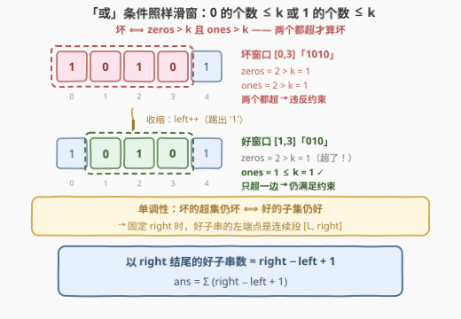
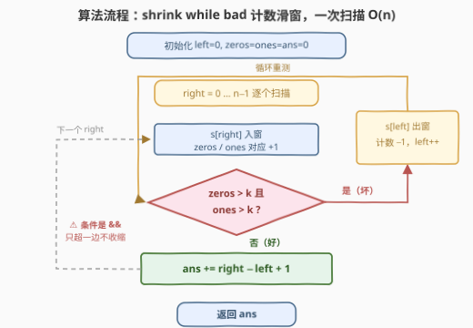
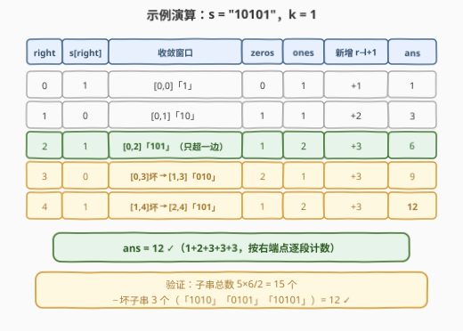

# 统计满足 K 约束的子字符串数量 I

- **题目名称**：统计满足 K 约束的子字符串数量 I
- **链接**：[3258. 统计满足 K 约束的子字符串数量 I](https://leetcode.cn/problems/count-substrings-that-satisfy-k-constraint-i/)
- **难度**：简单
- **标签**：字符串、滑动窗口

## 1. 题目概述

给你一个**二进制**字符串 $s$ 和一个整数 $k$。如果一个二进制字符串满足以下**任一**条件，则认为该字符串满足 **k 约束**：

- 字符串中 `0` 的数量**最多**为 $k$；
- 字符串中 `1` 的数量**最多**为 $k$。

返回 $s$ 的所有满足 **k 约束**的**子字符串**（连续子串）的数量。

**示例 1**：

```text
输入：s = "10101", k = 1
输出：12
解释：s 的所有子字符串中，除了 "1010"、"10101" 和 "0101" 外，
     其余子字符串都满足 k 约束。
```

**示例 2**：

```text
输入：s = "1010101", k = 2
输出：25
解释：除了长度大于 5 的子字符串（"101010"、"010101"、"1010101"）外，
     其余子字符串都满足 k 约束。
```

**示例 3**：

```text
输入：s = "11111", k = 1
输出：15
解释：s 的所有子字符串都满足 k 约束（0 的个数恒为 0 ≤ k）。
```

**约束条件**：

- $1 \le s.length \le 50$
- $1 \le k \le s.length$
- $s[i]$ 是 `'0'` 或 `'1'`

> 💡 读题关键：① 「**任一**条件」——$0$ 和 $1$ 的计数**只要有一个**不超 $k$ 即可，真正违反约束的子串是「$0$ 超且 $1$ 超」，这个取逆否的视角是全题的钥匙；② 子串是**连续区间** $[i,\ j]$，且「好坏」随区间长度单调（见 2.2），标准滑窗适用；③ 本题 $n \le 50$ 是白给的数据范围（暴力也能过），但姊妹题 [3261. II 版](https://leetcode.cn/problems/count-substrings-that-satisfy-k-constraint-ii/)把 $n$ 放大到 $10^5$，直接把线性滑窗变成必经之路；④ $n \le 50 \Rightarrow$ 答案上界 $\frac{50 \times 51}{2} = 1275$，`int` 绰绰有余。

---

## 2. 解题思路

### 2.1 暴力思路：枚举所有子串

双重循环枚举子串右端 $j$、起点 $i \le j$，起点向左（或向右）延伸时**增量**维护 `zeros` / `ones` 两个计数器，检查 `zeros ≤ k 或 ones ≤ k`。总复杂度 $O(n^2)$，$n \le 50$ 时至多 $2500$ 个子串，轻松通过。

问题在于**判定信息的浪费**：同一个起点 $i$ 出发的子串，其计数被反复用于不同右端点的判定；而当窗口已经「坏」了，继续向右扩只会更坏，这些注定失败的判定却还在一个个做。$n$ 放大到 $10^5$（II 版）后 $O(n^2) = 10^{10}$ 直接爆炸——需要让每个「坏」的判定直接推动左端点跳跃，而不是原地重复。

### 2.2 核心观察：坏子串对扩窗封闭，好子串按右端点计数



**第一步：取逆否**。满足约束 $\iff zeros \le k$ **或** $ones \le k$，于是：

$$\text{坏子串} \iff zeros > k \ \textbf{且} \ ones > k$$

**第二步：单调性**。$zeros([i,\ j])$ 与 $ones([i,\ j])$ 都随窗口扩大**单调不减**，因此：

- 若 $[i,\ j]$ 坏（两个计数都超），则它的任何**超集** $[i',\ j'] \supseteq [i,\ j]$ 仍然坏——坏对扩窗**封闭**；
- 等价地，好子串的任何**子集**仍然好——好对缩窗**向下封闭**。

**第三步：按右端点计数**。固定右端点 $right$，由向下封闭性，好子串的左端点构成一段**连续后缀** $[L,\ right]$：存在阈值 $L$，$start \ge L$ 的全好、$start < L$ 的全坏。用标准滑窗维护这个阈值——$right$ 右移进入新字符，若当前窗口「坏」就收缩 $left$，直到恰好变好：

$$ans = \sum_{right=0}^{n-1} (right - left + 1)$$

> 💡 两个顺手的事实：① $k \ge 1$ 时**单字符窗口**的计数是 $(1,\ 0)$ 或 $(0,\ 1)$，都 $\le k$，必然是好窗口——所以 `while` 循环最迟在 $left = right$ 时停下，`left` 永远不会越过 `right`；② 本题的「或」条件并不破坏滑窗模板——模板真正需要的只是「坏条件随扩窗单调」，条件本身长什么样无所谓（详见面试要点第 1 问）。这正是 [713. 乘积小于 K 的子数组](https://leetcode.cn/problems/subarray-product-less-than-k/)（[站内题解](../0701-0800/713_乘积小于K的子数组.md)）一脉相承的「`right − left + 1` 计数」骨架。

### 2.3 算法流程图



骨架就是标准「shrink while bad」计数滑窗，两个计数器进窗出窗**对称更新**。最容易写错的点已用红笔标出：**`while` 条件是 `&&`（两个都超才收缩），不是 `||`**——题目条件是「任一满足」，取逆否后恰好变成「且」，这步取反错了整题就错。

### 2.4 示例演算



以 `s = "10101"`、$k = 1$ 走一遍（收敛后的窗口、计数、每步贡献）：

| $right$ | $s[right]$ | 收缩动作 | 收敛窗口 | zeros | ones | 新增 $right-left+1$ | $ans$ |
|---------|-----------|----------|----------|-------|------|--------------------|-------|
| 0 | `1` | — | $[0,0]$「1」 | 0 | 1 | 1 | 1 |
| 1 | `0` | — | $[0,1]$「10」 | 1 | 1 | 2 | 3 |
| 2 | `1` | — | $[0,2]$「101」 | 1 | 2 | 3 | 6 |
| 3 | `0` | $[0,3]$: 2>1 且 2>1 坏 → $left{=}1$ | $[1,3]$「010」 | 2 | 1 | 3 | 9 |
| 4 | `1` | $[1,4]$: 2>1 且 2>1 坏 → $left{=}2$ | $[2,4]$「101」 | 1 | 2 | 3 | 12 |

结果 $12$ ✓。注意 $right = 2$ 时窗口「101」的 $ones = 2 > k$，但 $zeros = 1 \le k$——**只超一边仍是好窗口**，不做收缩；而 $right = 3$ 时两个计数同时超界，才触发收缩。对照总数验证：全部子串 $\frac{5 \times 6}{2} = 15$ 个，坏子串恰为 `"1010"`、`"10101"`、`"0101"` 共 3 个，$15 - 3 = 12$ ✓。

---

## 3. 参考代码

### C++

```cpp
class Solution {
  public:
    int countKConstraintSubstrings(string s, int k) {
        int n = s.size(), left = 0, zeros = 0, ones = 0, ans = 0;
        for (int right = 0; right < n; ++right) {
            (s[right] == '0' ? zeros : ones)++;        // 右端入窗
            while (zeros > k && ones > k)              // 坏 = 两个都超，注意是 &&
                (s[left++] == '0' ? zeros : ones)--;   // 左端出窗，对称回退
            ans += right - left + 1;                   // 以 right 结尾的好子串数
        }
        return ans;
    }
};
```

### Python

```python
class Solution:
    def countKConstraintSubstrings(self, s: str, k: int) -> int:
        left = zeros = ones = ans = 0
        for right, ch in enumerate(s):
            if ch == '0':                    # 右端入窗
                zeros += 1
            else:
                ones += 1
            while zeros > k and ones > k:    # 坏 = 两个都超，注意是 and
                if s[left] == '0':           # 左端出窗，对称回退
                    zeros -= 1
                else:
                    ones -= 1
                left += 1
            ans += right - left + 1          # 以 right 结尾的好子串数
        return ans
```

> 💡 实现细节：① `while` 条件必须是 `&&` / `and`——两个计数**同时**超界才收缩；误写 `||` 会把「只超一边」的好窗口也收缩掉，导致漏计（见面试要点第 3 问）；② 入窗与出窗的计数器更新严格**对称**（同一个三元/分支结构），这是滑窗不变式的纪律；③ $k \ge 1$ 保证单字符窗口恒好，`left ≤ right` 恒成立，无需防御性判空。

---

## 4. 复杂度分析

| 维度 | 复杂度 | 说明 |
|------|--------|------|
| 时间复杂度 | $O(n)$ | `left` / `right` 各自单调右移、合计至多 $2n$ 步（摊还分析），每步 $O(1)$ |
| 空间复杂度 | $O(1)$ | 仅两个计数器 + 三个下标变量 |
| 暴力对照 | $O(n^2)$ | 本题 $n \le 50$ 可过；II 版 3261 的 $n \le 10^5$ 必须 $O(n)$ 预处理 |

实测：三组官方示例分别得 $12 / 25 / 15$；另与 $O(n^2)$ 暴力对拍随机数据（$n \le 12$、$k \in [1,\ n]$ 随机）20000 组全部一致。

---

## 5. 扩展：II 版（3261）——把滑窗的副产品留下来

[3261. 统计满足 K 约束的子字符串数量 II](https://leetcode.cn/problems/count-substrings-that-satisfy-k-constraint-ii/) 把数据范围放大到 $n \le 10^5$，并给出 $q \le 10^5$ 个查询 $[l,\ r]$，要求统计**完全落在** $[l,\ r]$ 内的好子串数量。逐查询重新滑窗是 $O(nq) = 10^{10}$，不可行——正确姿势是把本题滑窗过程中**每个右端点的最小合法左端点**记录下来：

1. **预处理**：照跑一遍本题的滑窗，额外存下 $L[b]$ = 让 $[left,\ b]$ 恰好变好的最小 `left`（即 `while` 退出时的 `left` 值）；
2. **单查询** $[l,\ r]$：子串 $[a,\ b]$ 好 $\iff a \ge L[b]$，故

   $$ans(l, r) = \sum_{b=l}^{r} \bigl(b - \max(l,\ L[b]) + 1\bigr)$$

3. **加速**：$L$ 单调不降（$[L[b],\ b]$ 好 $\Rightarrow [L[b],\ b-1]$ 是其子集也好 $\Rightarrow L[b-1] \le L[b]$），于是求和式在某个分界点 $p$ 处从「$\max$ 取 $l$」切换为「$\max$ 取 $L[b]$」：前段是等差数列 $O(1)$ 求和，后段对 $b - L[b] + 1$ 做前缀和，$p$ 用二分或离线双指针定位——单查询 $O(\log n)$ 乃至 $O(1)$。

核心启示：**滑窗每一步「右端点 ↔ 最小合法左端点」的对应关系本身就是有价值的信息，算完别扔**——把 $L$ 数组留下来，区间查询类的追问往往迎刃而解。

---

## 6. 面试要点

1. **条件是「或」，为什么还能套标准滑窗模板？**

   - 滑窗模板真正依赖的不是条件的具体形状，而是**单调性**：坏 $\iff zeros > k$ 且 $ones > k$，两个计数都随窗口扩大不减，所以坏窗口的任何超集仍坏（坏对扩窗封闭），等价地好窗口的任何子集仍好（向下封闭）。于是固定右端点时左端点存在单阈值分界，`shrink while bad` 骨架照常工作——把「合法性谓词」当成可插拔组件即可。

2. **`ans += right − left + 1` 为什么不重不漏？**

   - **不重**：每个子串按**右端点**归类计数，各类互斥；**不漏**：以 $right$ 结尾的好子串左端点恰为连续段 $[left,\ right]$——`while` 退出时 $[left,\ right]$ 好 $\Rightarrow$ 左端点 $\ge left$ 的（都是它的子集）全好；而 $[left-1,\ right]$ 坏（或 $left = 0$）$\Rightarrow$ 左端点 $< left$ 的（都是它的超集）全坏。分界线两侧恰好被切干净。

3. **`while` 条件误写成 `||` 会发生什么？**

   - 会把「只超一边」的好窗口误判为坏而**过度收缩、漏计**。如 $k = 1$ 的窗口「101」：$ones = 2 > 1$ 但 $zeros = 1 \le 1$，本身满足约束、贡献应为 $3$；若用 `||` 收缩到「01」再计数，只贡献 $2$，漏掉子串「101」。根源在于把「任一满足」直接搬进了收缩条件——必须先取**逆否**（两个都超才算坏），这一步取反是本题第一易错点。

4. **`left` 会不会追过 `right`？需要防御 `left ≤ right` 吗？**

   - 不会。$k \ge 1$ 时单字符窗口计数为 $(1,\ 0)$ 或 $(0,\ 1)$，均 $\le k$ 必然合法，`while` 最迟在 $left = right$ 时条件失效而停止。反例是假想的 $k = 0$：全 `1` 串会一路缩成空窗（此时 `left = right + 1`）——本题约束 $1 \le k$ 恰好挡住了这个坑，但面试口头补充这个边界分析是加分项。

5. **和 713 / 2302 这类「单一计数器」滑窗计数题的区别是什么？**

   - 结构上**完全同款**（`shrink while bad` + 按右端点计数 `right − left + 1`），区别只在合法性谓词：[713](https://leetcode.cn/problems/subarray-product-less-than-k/) 是「乘积 $< k$」，[2302. 统计得分小于 K 的子数组数目](https://leetcode.cn/problems/count-subarrays-with-score-less-than-k/) 是「和 $\times$ 长度 $< k$」，本题是「$zeros \le k$ 或 $ones \le k$」。滑窗计数的通用心法：**坏条件随扩窗单调 ⟹ 同一副骨架，只换谓词**；反过来 [1248. 统计「优美子数组」](https://leetcode.cn/problems/count-number-of-nice-subarrays/)（[站内题解](../1201-1300/1248_统计优美子数组.md)）展示的是「恰好型」约束如何用 $atMost(K) - atMost(K-1)$ 差分拼装，本题的计数滑窗正是那套积木里的 $atMost$。

---

## 7. 同类练习题

- [3261. 统计满足 K 约束的子字符串数量 II](https://leetcode.cn/problems/count-substrings-that-satisfy-k-constraint-ii/)：同题强化版——$n$ 到 $10^5$ + 区间查询，把本题滑窗的 $L$ 数组留下来配前缀和/二分，见本文第 5 节
- [713. 乘积小于 K 的子数组](https://leetcode.cn/problems/subarray-product-less-than-k/)（[站内题解](../0701-0800/713_乘积小于K的子数组.md)）：同款「`right − left + 1`」计数模板的单一计数器版，入门首选
- [2302. 统计得分小于 K 的子数组数目](https://leetcode.cn/problems/count-subarrays-with-score-less-than-k/)：同款计数滑窗，谓词换成「子数组和 $\times$ 长度 $< k$」，注意累计变量要用 `long long`
- [1248. 统计「优美子数组」](https://leetcode.cn/problems/count-number-of-nice-subarrays/)（[站内题解](../1201-1300/1248_统计优美子数组.md)）：恰好型约束的通用解法 $atMost(K) - atMost(K-1)$，本题正是其中的 $atMost$ 积木
- [2958. 最多 K 个重复元素的最长子数组](https://leetcode.cn/problems/length-of-longest-subarray-with-at-most-k-frequency/)：同一套「shrink while bad」骨架求**最长**而非**计数**，对照练习换个产出方向
