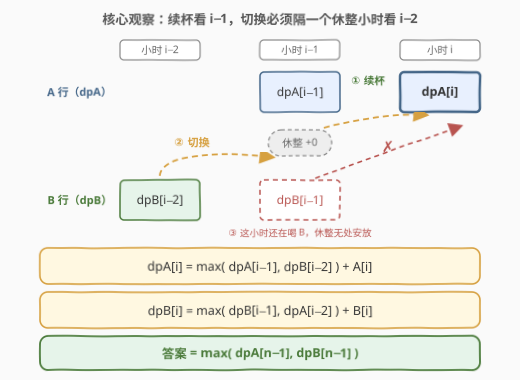
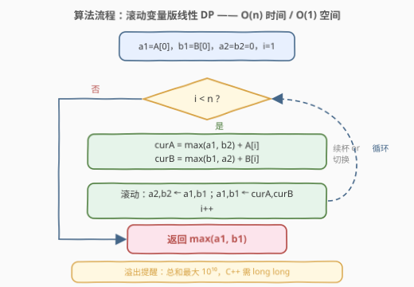

# 超级饮料的最大强化能量

- **题目名称**：超级饮料的最大强化能量
- **链接**：[3259. 超级饮料的最大强化能量](https://leetcode.cn/problems/maximum-energy-boost-from-two-drinks/)
- **难度**：中等
- **标签**：数组、动态规划

## 1. 题目概述

来自未来的体育科学家给你两个长度均为 $n$ 的整数数组 `energyDrinkA` 和 `energyDrinkB`，分别代表 A、B 两种能量饮料**每小时**能提供的强化能量。

你需要**每小时**饮用一种能量饮料来最大化总强化能量。但如果从一种能量饮料**切换**到另一种，你需要等待一小时来梳理身体的能量体系——**那个小时不会获得任何强化能量**。

返回在接下来 $n$ 小时内你能获得的最大总强化能量。注意：你可以选择从饮用任意一种能量饮料开始。

**示例 1**：

```text
输入：energyDrinkA = [1,3,1], energyDrinkB = [3,1,1]
输出：5
解释：只喝 A（1+3+1）或只喝 B（3+1+1）都是 5——全程不切换。
```

**示例 2**：

```text
输入：energyDrinkA = [4,1,1], energyDrinkB = [1,1,3]
输出：7
解释：第 1 小时喝 A（+4）→ 切换到 B，第 2 小时休整（+0）→ 第 3 小时喝 B（+3）。
```

**约束**：

- $n = \text{energyDrinkA.length} = \text{energyDrinkB.length}$
- $3 \le n \le 10^5$
- $1 \le \text{energyDrinkA}[i], \text{energyDrinkB}[i] \le 10^5$

> 💡 **审题关键**：① 每小时要么喝 A 要么喝 B，正常喝获得对应数组该小时的值；② A↔B **切换**会强制插入一个「休整小时」，收益为 0——代价不是扣分，而是**浪费一整小时**；③ **起手任选**一种，没有切换代价；④ 所有值 $\ge 1$（严格正），所以「不切换也休整」「切换后连休两小时」永远不优——最优解中休整小时只会**恰好**出现在每次切换处。

---

## 2. 解题思路

### 2.1 暴力思路：枚举每小时的决策

把每小时的选择分成三种：喝 A、喝 B、休整（+0）。枚举全部 $3^n$ 条决策序列，剔除非法序列（相邻两次饮用若是不同饮料，中间必须隔至少一个休整小时），对合法序列求和取最大。$n = 10^5$ 时指数级爆炸，完全不可行。

但决策序列的结构其实非常受限：**休整永远只出现在切换处**，于是任何合法方案都是「若干段连续同种饮料，段与段之间恰好夹一个休整小时」。而且每小时的决策只依赖「上一次喝的是什么、在哪个小时」——**无后效性**成立，天然适合线性 DP：状态只需记录**当前小时喝的是哪种饮料**。

### 2.2 核心观察：双状态线性 DP，「切换」要跨过一个休整小时



定义两个状态：

$$dpA[i] = \text{只考虑前 } i+1 \text{ 小时、且第 } i \text{ 小时喝 A 的最大总强化能量}$$

$$dpB[i] = \text{只考虑前 } i+1 \text{ 小时、且第 } i \text{ 小时喝 B 的最大总强化能量}$$

第 $i$ 小时喝 A 的方案，按「上一次喝的是什么」分成两类：

- **① 续杯**：第 $i-1$ 小时也在喝 A，无切换代价——$dpA[i-1] + A[i]$；
- **② 切换**：之前喝的是 B，那么**最近一次喝 B 最早只能在第 $i-2$ 小时**——第 $i-1$ 小时被强制休整（+0），第 $i$ 小时才喝上 A——$dpB[i-2] + 0 + A[i]$。

$$dpA[i] = \max(dpA[i-1],\ dpB[i-2]) + A[i] \qquad dpB[i] = \max(dpB[i-1],\ dpA[i-2]) + B[i]$$

**为什么是 $dpB[i-2]$ 而不是 $dpB[i-1]$？** 若第 $i-1$ 小时还在喝 B（拿满 $B[i-1]$ 的收益），第 $i$ 小时就**不可能**立刻换成 A 还拿满 $A[i]$——切换的休整小时无处安放。切换的代价是「**牺牲一整小时的收益**」，在转移里就体现为**隔一格**回看。

**边界**：$dpA[0] = A[0]$、$dpB[0] = B[0]$（起手任选，免费）；$i=1$ 时 $i-2<0$，切换分支不可用，只剩续杯。**答案**：

$$\text{ans} = \max(dpA[n-1],\ dpB[n-1])$$

> ⚠️ **溢出**：总和最大 $10^5 \times 10^5 = 10^{10}$，超出 `int32` 上界，C++ 必须用 `long long`（函数签名也返回 `long long`）；Python 天然大数无虞。

> 💡 转移只回看 $i-1$ 和 $i-2$ 两行，两张 dp 表各保留两个变量即可滚动，空间 $O(1)$。全程不切换的方案（如示例 1）就是一路走「续杯」分支，被 ① 自动涵盖，无需特判。

### 2.3 算法流程图



| 步骤 | 操作 | 作用 |
|------|------|------|
| ① 初始化 | $a1 = A[0]$，$b1 = B[0]$，$a2 = b2 = 0$，$i = 1$ | $a1/b1$ 即 $dpA/dpB[i-1]$；$a2/b2$ 即 $dpA/dpB[i-2]$（占位 0） |
| ② 逐小时转移 | $i$ 从 $1$ 到 $n-1$：$curA = \max(a1,\ b2) + A[i]$，$curB = \max(b1,\ a2) + B[i]$ | 续杯 vs 切换，取较优 |
| ③ 滚动更新 | $a2, b2 \leftarrow a1, b1$；$a1, b1 \leftarrow curA, curB$；$i{+}{+}$ | 只保留最近两行 |
| ④ 返回 | $\max(a1,\ b1)$ | 即 $\max(dpA[n-1],\ dpB[n-1])$ |

> 💡 $i=1$ 时本应不可用的 $dpB[i-2]$ 用 0 占位是安全的：占位值 0 永远竞争不过真实的 $dpA[0] = A[0] \ge 1$，$\max$ 不会误选。

### 2.4 示例演算

![示例演算：A=[4,1,1]，B=[1,1,3]，切换一次反而更优](../images/p3259_energy_walkthrough.svg)

对示例 2 逐小时填表：

| $i$ | $A[i]$ | $B[i]$ | $dpA[i]$ | $dpB[i]$ | 说明 |
|-----|--------|--------|----------|----------|------|
| 0 | 4 | 1 | 4 | 1 | 起手任选一种，各自开喝 |
| 1 | 1 | 1 | $\max(4)+1=5$ | $\max(1)+1=2$ | $i-2<0$，只能续杯 |
| 2 | 1 | 3 | $\max(5,1)+1=6$ | $\max(2,\mathbf{4})+3=\mathbf{7}$ | $dpB[2]$ 抛弃续杯，从 $dpA[0]$ **切换**而来 |

答案是 $\max(6, 7) = 7$。回溯 $dpB[2]$ 的来路正是官方解释的方案：**喝 A（第 1 小时，+4）→ 休整（第 2 小时，+0）→ 喝 B（第 3 小时，+3）**。A 的开局太香（4 对 1）、B 的收尾太肥（3 对 1），中间牺牲一小时换赛道反而净赚 2。示例 1 则相反：两边都平淡，最优就是全程不切换（$dpA$ 一路续杯得 5）。

---

## 3. 参考代码

### C++

```cpp
class Solution {
public:
    long long maxEnergyBoost(vector<int>& energyDrinkA, vector<int>& energyDrinkB) {
        int n = energyDrinkA.size();
        // a1/b1 = dpA/dpB[i-1]，a2/b2 = dpA/dpB[i-2]（占位 0）
        long long a1 = energyDrinkA[0], b1 = energyDrinkB[0];
        long long a2 = 0, b2 = 0;
        for (int i = 1; i < n; i++) {
            long long curA = max(a1, b2) + energyDrinkA[i];  // 续杯 or 从 B 切换
            long long curB = max(b1, a2) + energyDrinkB[i];  // 续杯 or 从 A 切换
            a2 = a1; b2 = b1;
            a1 = curA; b1 = curB;
        }
        return max(a1, b1);
    }
};
```

### Python

```python
class Solution:
    def maxEnergyBoost(self, energyDrinkA: List[int], energyDrinkB: List[int]) -> int:
        a1, b1 = energyDrinkA[0], energyDrinkB[0]   # dpX[i-1]
        a2 = b2 = 0                                 # dpX[i-2]，占位 0
        for i in range(1, len(energyDrinkA)):
            a1, b1, a2, b2 = (max(a1, b2) + energyDrinkA[i],
                              max(b1, a2) + energyDrinkB[i],
                              a1, b1)
        return max(a1, b1)
```

> 💡 **写法要点**：① Python 用元组赋值一次性完成「算新值 + 滚动」——等号右侧先整体求值，天然无中间覆盖问题；② C++ 必须先暂存 `curA/curB` 再按 `a2=a1; b2=b1; a1=curA; b1=curB` 的顺序滚动；③ 若不想抠边界，直接开两张 `long long` 数组、$i<2$ 时跳过切换分支，代码更直白，$O(n)$ 空间也完全够用。

> 💡 本文两个版本均已用 $O(3^n)$ 暴力（枚举每小时 喝A/喝B/休整，校验「不同饮料的相邻饮用之间必须隔休整」）对拍 500 组随机数据，全部一致。

---

## 4. 复杂度分析

| 维度 | 复杂度 | 说明 |
|------|--------|------|
| **时间** | $O(n)$ | 每小时 $O(1)$ 转移，共 $n-1$ 轮 |
| **空间** | $O(1)$ | 滚动变量 4 个（数组版为 $O(n)$） |
| 暴力对照 | $O(3^n)$ | 枚举每小时三种决策，仅用于对拍锚定 |

---

## 5. 扩展：把切换代价记到「新饮料的落位小时」——一步转移的等价建模

「隔一格回看 $i-2$」还有个等价变形：把休整小时记在**切换后的第一个小时**——该小时名义上已换到新饮料、但收益记 0。定义 $fA[i]$ = 前 $i+1$ 小时、第 $i$ 小时「处于 A 阵营」（正常喝 A，或刚从 B 切过来正在落位）的最大收益：

$$fA[i] = \max(fA[i-1] + A[i],\ fB[i-1]) \qquad fB[i] = \max(fB[i-1] + B[i],\ fA[i-1])$$

第二项 $fB[i-1]$ 表示：上一小时还在喝 B，本小时切换落位、收益 0。同一份「切换方案」在两种建模下只是把那个 0 收益的小时记在**切换前的最后一格**（官方版）还是**切换后的第一格**（本变形），数值完全等价（两版已对拍一致，见上文）。

这种「**代价记账位置可以平移**」的视角在冷却类问题里很常用——309 冷冻期既可把冷却记在卖出后一天，也可记在买入前一天，同一个味道。当「动作之间有强制间隔」时，通用的三种等价写法是：转移跨格回看（本题官方 hint）、显式插入「休整/冷却」状态、把冷却记到新动作的第一步——选最好写的那种即可。

---

## 6. 面试要点

1. **转移里为什么回看的是 $dpB[i-2]$ 而不是 $dpB[i-1]$？**

   切换的代价是一整小时收益归零。若第 $i-1$ 小时还在拿 B 的收益，休整小时就无处安放；从 B 切到 A 的最近合法时机是「第 $i-2$ 小时喝 B → 第 $i-1$ 小时休整（+0）→ 第 $i$ 小时喝 A」，所以隔一格回看。把「冷却/间隔」正确折算成转移的下标距离，是这类题最核心的一步。

2. **需要为「休整小时」单独设一个 dp 状态吗？**

   不需要。休整永远是切换的附属品：它前一小时必然是旧饮料、后一小时必然是新饮料，收益恒为 0，不产生独立的最优子结构，折叠进「跨格转移」即可。显式建三状态（喝A/喝B/休整）也正确，但休整状态的转移退化为同一件事，属于多绕一圈。

3. **「无意义休整」（不切换也休息、切换后连休两小时）为什么不用考虑？**

   收益严格为正（$\ge 1$），任何多余休整都能用「继续喝当前饮料」严格改进；即便 DP 意外覆盖了这类方案，它们也永远赢不了续杯分支。所以最优解里休整小时数必然恰等于切换次数，起手也绝不会休整（起手任选、无代价）——统统无需特判。

4. **边界 $i=1$ 用 0 占位为什么安全？**

   $i=1$ 时 $dpB[i-2] = dpB[-1]$ 不存在，用 0 占位：真实的竞争者 $dpA[0] = A[0] \ge 1$ 恒大于 0，$\max$ 不会误选。一般原则是「占位值不得大于任何真实可达值」——本题收益下界是正数，占位 0 天然满足；若收益可能为负，就得换成 $-\infty$。

5. **这题和 309 冷冻期、打家劫舍是什么关系？**

   同属「动作间有强制间隔」的多状态线性 DP：309 是「卖出后必须冷却一天」→ 转移跨两格；198 打家劫舍是「选了就必须隔一格」→ $dp[i] = \max(dp[i-1],\ dp[i-2]+v)$；本题是「换饮料必须休整一小时」。识别出「代价 = 损失一个时间步」后，把间隔折进转移下标，套路完全一致。

---

## 7. 同类练习题

- [309. 最佳买卖股票时机含冷冻期](https://leetcode.cn/problems/best-time-to-buy-and-sell-stock-with-cooldown/)：「卖出后冷却一天」与「切换后休整一小时」同款——把冷却折算成转移跨两格
- [746. 使用最小花费爬楼梯](https://leetcode.cn/problems/min-cost-climbing-stairs/)：双状态互相转移、只回看近两步的入门版
- [2140. 解决智力问题](https://leetcode.cn/problems/solving-questions-with-brainpower/)：选/不选 + 选后强制跳跃若干步，跨多格转移的近亲
- [198. 打家劫舍](https://leetcode.cn/problems/house-robber/)：「选了就必须隔一格」的 $dp[i-2]$ 回看雏形
