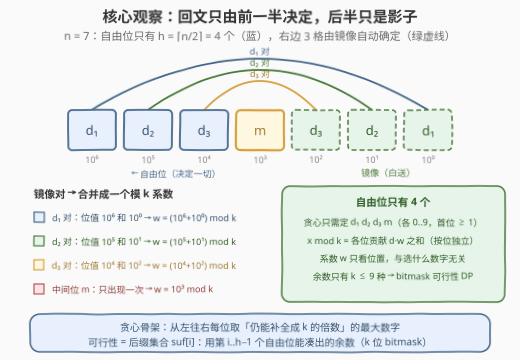
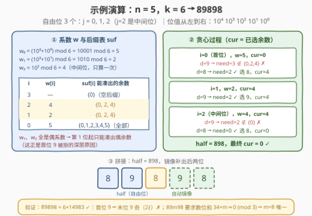

# LeetCode 找出最大的 N 位 K 回文数 题解

## 1. 题目概述

- **标题 / 题号**：找出最大的 N 位 K 回文数（#3260，hard）
- **链接**：https://leetcode.cn/problems/find-the-largest-palindrome-divisible-by-k/
- **难度**：困难
- **标签**：贪心、数学、动态规划、字符串、数论

**题意**：给你两个正整数 $n$ 和 $k$。如果整数 $x$ 满足以下**全部**条件，则称 $x$ 是一个 **k 回文数**：

1. $x$ 是回文数；
2. $x$ 可以被 $k$ 整除。

以字符串形式返回**最大的 $n$ 位 k 回文数**。注意，该整数**不含前导零**。

**示例 1**：

```text
输入：n = 3, k = 5
输出："595"
解释：595 是最大的 3 位 5 回文数。
```

**示例 2**：

```text
输入：n = 1, k = 4
输出："8"
解释：1 位 4 回文数只有 4 和 8。
```

**示例 3**：

```text
输入：n = 5, k = 6
输出："89898"
```

**约束**：

- $1 \le n \le 10^5$
- $1 \le k \le 9$

> 💡 **审题关键**：① 答案是恰好 $n$ 位且**无前导零**——首位 $\ge 1$；② 「最大」按数值比较，**同长度下等价于字典序最大**，这是逐位贪心的通行证；③ $k \le 9$ 是本题最值钱的约束——余数状态只有 $k$ 个，这是把指数级搜索压成线性 DP 的钥匙；④ 答案必然存在：把每一位都写成 $k$，则 $kk\cdots k = k \times \underbrace{11\cdots1}_{n}$ 恒为 $k$ 的倍数且是回文。

## 2. 解题思路

### 2.1 暴力思路：从全 9 回文开始向下枚举

回文数由前 $h = \lceil n/2 \rceil$ 位决定（后一半是镜像），所以候选只有 $9 \times 10^{h-1}$ 个。从最大的回文（全 9）开始往下枚举、逐个用 $O(n)$ 判整除——$n = 10^5$ 时候选数是 $10^{50000}$ 级别，天文数字，完全不可行。

但「从大到小试」的**方向感**是对的：同长度数字比大小就是字典序比较，所以从最高位开始，每一位都想取尽量大的数字。问题只剩一个——**当前位取了 $d$ 之后，剩下的自由位还能不能把整体余数补回 0？** 能回答这个问题，就不需要真的枚举。

### 2.2 核心观察：前一半定生死，余数可行性查表



三个观察层层递进：

**观察 1：回文只有前一半是自由的。** 设串 $s$ 从左数第 $j$ 位（0 起）与第 $n-1-j$ 位必须相等，因此**只需决定前 $h$ 个自由位的数字**（首位 $\ge 1$），后半自动镜像。观察 1 把搜索空间从 $10^n$ 压到 $10^h$，但仍指数级。

**观察 2：模 $k$ 可以按位分解。** 数 $x = \sum_j s_j \cdot 10^{\,n-1-j}$，由模运算对加法、乘法的封闭性，第 $j$ 位（从左数）与其镜像位 $n-1-j$ 数字相同、位值互补，可以**合并成一个只与位置有关的系数**：

$$w_j = \left(10^{\,n-1-j} + 10^{\,j}\right) \bmod k$$

奇数 $n$ 的中间位 $j = \frac{n-1}{2}$ 镜像到自己，只出现一次，$w_j = 10^{\,j} \bmod k$。于是

$$x \bmod k = \sum_{j=0}^{h-1} d_j \cdot w_j \pmod k$$

**系数 $w_j$ 与选什么数字无关**——每个自由位对余数的贡献是 $d \cdot w_j \bmod k$，各位之间相互独立，可以任意合并。

**观察 3：$k \le 9$ ⇒ 余数世界只有 $k$ 格。** 定义**后缀可行性 DP**：

$$suf[i] = \{\,\text{用第 } i \sim h-1 \text{ 个自由位能凑出的余数集合}\,\} \subseteq \{0, 1, \dots, k-1\}$$

$$suf[h] = \{0\} \qquad suf[i] = \bigcup_{d} \Big( d \cdot w_i + suf[i+1] \Big) \bmod k$$

其中 $d$ 取 $0 \sim 9$；$i = 0$（首位）时取 $1 \sim 9$，**无前导零约束直接写进转移**。集合用 $k$ 位 bitmask 存，每层转移 $O(10k)$。

**贪心**：从左往右逐位取数，维护已选部分的余数 $cur$（初始 0）。在位 $i$ 上按 $d = 9, 8, \dots$ 依次尝试：只要

$$suf[i+1] \ni \underbrace{(-cur - d \cdot w_i) \bmod k}_{\text{记为 } need}$$

——即「剩余自由位能把余数补回 0」——$d$ 就可行，取它并更新 $cur \leftarrow (cur + d \cdot w_i) \bmod k$。

> 💡 **贪心为什么对（交换论证）**：设最优解 $X$ 与贪心解在位 $i$ 首次分叉，$X$ 取 $d'$ 而贪心取 $d > d'$。贪心的可行性判定保证「前缀相同、位 $i$ 取 $d$」的可行数存在，而任何这样的数都在第 $i$ 位上严格大于 $X$，与 $X$ 最优矛盾。所以每一位取「可行的最大数字」必然得到全局最大。

> ⚠️ **贪心每步都必有解**：全 $k$ 数位（$k \le 9$ 时是一位数字）本身可行，故整个问题解存在；再由 DP 的完备性（转移枚举了全部数字），任何「有补全方案」的前缀在贪心中都不会走到死路。

### 2.3 算法流程图


| 步骤 | 操作 | 作用 |
|------|------|------|
| ① 预处理 | 递推 $pw[e] = 10^e \bmod k$；$w[j] = (pw[j] + pw[n-1-j]) \bmod k$ | 每个自由位一个合并系数；中间位只算一次 |
| ② 逆序 DP | $suf[h] = \{0\}$；$suf[i] = \bigcup_d (d \cdot w[i] + suf[i+1]) \bmod k$ | 后缀能凑出哪些余数，$i=0$ 时 $d \ge 1$ |
| ③ 逐位贪心 | $cur = 0$；位 $i$ 上 $d$ 从 9 往下试，$suf[i+1]$ 含 $need$ 则锁定 | 高位尽量大，可行性 $O(1)$ 查表，无回溯 |
| ④ 镜像拼接 | 偶数 $n$：$half + reverse(half)$；奇数 $n$：$half + reverse(half\text{ 去尾})$ | 自由位拼出前一半，镜像补全 |

### 2.4 示例演算



以示例 3（$n = 5$，$k = 6$）走一遍全程。自由位 3 个（$j = 0, 1, 2$，其中 $j=2$ 是中间位），位值从左到右为 $10^4 \sim 10^0$：

**第一步：算系数。** $w_0 = (10^4 + 10^0) \bmod 6 = 10001 \bmod 6 = 5$；$w_1 = (10^3 + 10^1) \bmod 6 = 1010 \bmod 6 = 2$；$w_2 = 10^2 \bmod 6 = 4$（中间位）。

**第二步：逆序求 $suf$。** $suf[3] = \{0\}$；$w_2 = 4$（偶）⇒ $suf[2] = \{0, 2, 4\}$；$w_1 = 2$（偶）⇒ 偶加偶还是偶，$suf[1] = \{0, 2, 4\}$；$w_0 = 5$（奇系数）⇒ $suf[0]$ 覆盖全部余数。

**第三步：贪心。**

| 自由位 | 权重 | 尝试 $d$ | $need = (-cur - d \cdot w) \bmod 6$ | 判定 | 动作 |
|--------|------|---------|-------------------------------------|------|------|
| $i=0$（首位） | 5 | 9 | $(-45) \bmod 6 = 3$ | ✗ $suf[1]$ 只含偶余数 | 放弃 |
| $i=0$ | 5 | 8 | $(-40) \bmod 6 = 2$ | ✓ | 选 8，$cur = 4$ |
| $i=1$ | 2 | 9 | $(-4-18) \bmod 6 = 2$ | ✓ $suf[2]$ 含 2 | 选 9，$cur = 4$ |
| $i=2$（中间位） | 4 | 9 | $(-4-36) \bmod 6 = 2$ | ✗ $suf[3] = \{0\}$ | 放弃 |
| $i=2$ | 4 | 8 | $(-4-32) \bmod 6 = 0$ | ✓ | 选 8，$cur = 0$ |

$half = $ "898"，镜像拼接得 **"89898"**，最终 $cur = 0$（整体 $\equiv 0 \pmod 6$）✓。

**为什么不能更大？** 换整除规则视角恰好互相印证：

- **首位 9**：末位必为 9（回文），是奇数，$2 \nmid$ ⇒ 6 不整除——对应余数视角里 $need = 3 \notin \{0,2,4\}$（$w_1, w_2$ 全偶，从第 1 位起只能凑出偶余数）；
- **前缀 89**：只能是 $89m98$，数位和 $34 + m$ 需 $\equiv 0 \pmod 3$ ⇒ $m \in \{2, 5, 8\}$ ⇒ $m = 8$ 唯一最大——对应贪心在 $i=2$ 处 9 被拒、8 通过；
- 验证：$89898 = 6 \times 14983$ ✓。

## 3. 参考代码

### C++

```cpp
class Solution {
public:
    string largestPalindrome(int n, int k) {
        int h = (n + 1) / 2;                       // 自由位个数（前一半，含中间位）
        vector<int> pw(n);                          // pw[e] = 10^e mod k
        pw[0] = 1 % k;
        for (int e = 1; e < n; ++e) pw[e] = pw[e - 1] * 10 % k;
        vector<int> w(h);                           // w[j] = 镜像对合并系数
        for (int j = 0; j < h; ++j)
            w[j] = (j == n - 1 - j) ? pw[j] : (pw[j] + pw[n - 1 - j]) % k;

        // suf[i]：位 i..h-1 能凑出的余数集合（第 r 位为 1 = 余数 r 可行）
        vector<int> suf(h + 1);
        suf[h] = 1;                                 // 空后缀只能贡献余数 0
        for (int i = h - 1; i >= 0; --i) {
            int mask = 0;
            for (int d = (i == 0 ? 1 : 0); d <= 9; ++d)   // 首位无前导零
                for (int r = 0; r < k; ++r)
                    if (suf[i + 1] >> r & 1)
                        mask |= 1 << ((d * w[i] + r) % k);
            suf[i] = mask;
        }

        string half;
        int cur = 0;                                // 已选部分贡献的余数
        for (int i = 0; i < h; ++i) {
            for (int d = 9; d >= (i == 0 ? 1 : 0); --d) {
                int need = ((-(cur + d * w[i])) % k + k) % k;  // 后缀需凑出的余数
                if (suf[i + 1] >> need & 1) {
                    half.push_back('0' + d);
                    cur = (cur + d * w[i]) % k;
                    break;
                }
            }
        }
        string ans = half;
        if (n & 1) ans.pop_back();                  // 奇数长度：中间位不重复
        reverse(half.begin(), half.end());
        return ans + half;
    }
};
```

### Python

```python
class Solution:
    def largestPalindrome(self, n: int, k: int) -> str:
        h = (n + 1) // 2
        FULL = (1 << k) - 1
        pw = [1 % k] * n                            # pw[e] = 10^e mod k
        for e in range(1, n):
            pw[e] = pw[e - 1] * 10 % k
        w = [pw[j] if j == n - 1 - j else (pw[j] + pw[n - 1 - j]) % k
             for j in range(h)]

        def rot(m, a):                              # 余数集合整体 +a (mod k)：循环左移
            return m if a == 0 else ((m << a) | (m >> (k - a))) & FULL

        suf = [0] * (h + 1)
        suf[h] = 1
        for i in range(h - 1, -1, -1):
            lo = 1 if i == 0 else 0                 # 首位无前导零
            m = 0
            for a in {d * w[i] % k for d in range(lo, 10)}:  # 10 个数字至多 k 种贡献
                m |= rot(suf[i + 1], a)
            suf[i] = m

        half, cur = [], 0
        for i in range(h):
            lo = 1 if i == 0 else 0
            for d in range(9, lo - 1, -1):
                if suf[i + 1] >> (-cur - d * w[i]) % k & 1:
                    half.append(str(d))
                    cur = (cur + d * w[i]) % k
                    break
        half = ''.join(half)
        return half + (half[:-1][::-1] if n % 2 else half[::-1])
```

> 💡 **写法要点**：① C++ 版转移是最朴素的「10 数字 × k 余数」双循环，$O(10kn) \approx 9 \times 10^6$，绰绰有余；② Python 版把「余数集合整体加 $a$」实现成 bitmask **循环左移**（`rot`），且 10 个数字的贡献 $d \cdot w_i \bmod k$ 去重后至多 $k$ 种，内层从 $10k$ 降到 $10 + k$，$n = 10^5$ 全部 9 个 $k$ 约 1 秒；③ `pw[0] = 1 % k` 顺手处理 $k = 1$（此时所有系数为 0，任何数都可行，贪心一路取 9）；④ 奇数 $n$ 的镜像拼接要**去掉中间位再反转**，否则中间位会重复。

> 💡 本文两个版本均已用 $O(10^{\lceil n/2 \rceil})$ 暴力（枚举全部回文判整除）对拍 $n \le 7$、$k \le 9$ 全部 63 组，另对 $n \le 12$ 随机 300 组做回文 + 整除性质校验，全部一致。

## 4. 复杂度分析

| 维度 | 复杂度 | 说明 |
|------|--------|------|
| **时间** | $O((10+k) \cdot n)$ | 预处理 $O(n)$；suf 每层 $O(10k)$（C++）或 $O(10+k)$（Python 移位版）；贪心每层至多试 10 个数字、$O(1)$ 查表。$n = 10^5$、$k \le 9$ 时约 $10^6 \sim 10^7$ 次基本操作 |
| **空间** | $O(n)$ | `pw`、`suf` 两个数组 + 答案字符串本身 $O(n)$；`suf` 每项是 $k$ 位 bitmask，可放心开 $h+1$ 个 |
| 暴力对照 | $O(10^{\lceil n/2 \rceil} \cdot n)$ | 枚举全部回文判整除，仅用于对拍锚定 |

## 5. 扩展：分 k 整除规则速查——O(n) 纯构造

$k \le 9$ 的整除性大多有初等规则，可以按 $k$ 逐个 $O(n)$ **直接构造**答案（面试被追问「能不能不用 DP」时的答案）：

| $k$ | 整除规则 | 最大的 $n$ 位 $k$ 回文数 |
|-----|----------|--------------------------|
| 1 | 无约束 | $\underbrace{9\cdots9}_{n}$ |
| 2 | 末位偶 ⇒（回文）首位偶，最大偶数字 8 | $8\,\underbrace{9\cdots9}_{n-2}\,8$（$n=1$ 为 8） |
| 3 | 数位和 $\equiv 0 \pmod 3$；全 9 的数位和 $9n$ 天然满足 | $\underbrace{9\cdots9}_{n}$ |
| 4 | 只看末两位 = 前两位镜像倒排 $10d_2 + d_1$：$d_1 = 9$ 时为奇数 ✗，$d_1 = 8$ 强制 $d_2$ 偶 ⇒ 88 | $n \le 3$ 为 $\underbrace{8\cdots8}_{n}$；$n \ge 4$ 为 $88\,\underbrace{9\cdots9}_{n-4}\,88$ |
| 5 | 末位 $\in \{0, 5\}$ ⇒ 首位 5 | $5\,\underbrace{9\cdots9}_{n-2}\,5$（$n=1$ 为 5） |
| 6 | $= 2 \times 3$：首位 8 + 数位和 $\equiv 0 \pmod 3$（奇数长度中间位降为 8，偶数长度最内一对降为 77） | $n{=}1$: 6，$n{=}2$: 66；奇数 $n \ge 3$: $8\,9\cdots9\,8\,9\cdots9\,8$；偶数 $n \ge 4$: $8\,9\cdots9\,77\,9\cdots9\,8$ |
| 7 | **无初等规则**（$10 \bmod 7$ 的幂以 6 为周期） | 用本文通法；彩蛋：$n=6$ 时 $\underbrace{9\cdots9}_{6} = 7 \times 142857$ |
| 8 | 只看末三位 = 前三位镜像倒排 $100d_3 + 10d_2 + d_1 \equiv 4d_3 + 2d_2 + d_1 \pmod 8$：$d_1 = 9$ 奇 ✗、$d_2 = 9$ 无解 ⇒ 888 | $n \le 6$ 为 $\underbrace{8\cdots8}_{n}$；$n \ge 7$ 为 $888\,\underbrace{9\cdots9}_{n-6}\,888$ |
| 9 | 数位和 $\equiv 0 \pmod 9$；全 9 天然满足 | $\underbrace{9\cdots9}_{n}$ |

> 💡 上表除 $k=7$ 外的全部构造，都已用本文的通法代码对拍验证到 $n \le 200$ 完全一致。$k=7$ 理论上也能按 $n \bmod 6$ 分情况构造（$10^i \bmod 7$ 周期为 6），但 case 繁多极易写错——**通法一套代码通吃 9 种 $k$，正是「可行性 DP + 贪心」的价值所在**：把整除规则的知识性问题，转化成机械的查表过程。

## 6. 面试要点

1. **逐位贪心为什么正确？**

   同长度数字比大小等价于字典序比较。交换论证：若最优解在第一个分歧位上取的数字比贪心小，而贪心判定「取大数字后仍可补全」保证存在一个该位更大、其余前缀相同的可行数，则最优解不再最优，矛盾。前提是可行性判定**精确**（不漏报），后缀 DP 恰好保证这一点。

2. **为什么 DP 要逆序做「后缀可行性」，而不是正序做前缀？**

   贪心从高位往低位**锁定前缀**，每一步要回答的问题是：「给定任意已选前缀（它只通过余数 $cur$ 影响后续），剩余位置能否把余数补回 0」。$suf[i]$ 的定义与「前缀具体是什么」完全无关（无后效性），于是可以在锁定过程中 $O(1)$ 查表。正序前缀 DP 回答的是「某个前缀是否出现」，方向反了，无法支撑逐位试探。

3. **无前导零的约束放在哪里？**

   两个位置都要放：DP 转移里 $i = 0$ 的数字枚举 $1 \sim 9$（保证 $suf$ 刻画的可行性与真实约束一致）；贪心枚举首位时同样从 9 试到 1。只在一处放会导致可行性误判。

4. **中间位（奇数长度）的系数为什么只算一次？如何识别？**

   条件 $j = n - 1 - j$（即 $n$ 为奇数且 $j = (n-1)/2$）：该位镜像到自己，位值 $10^j$ 只出现一次，$w_j = 10^j \bmod k$；其余自由位的两个镜像位值 $10^{n-1-j}$ 与 $10^j$ 相加合并。漏掉这一点会算出错误的余数。

5. **$k \le 9$ 用在哪几步？如果 $k$ 很大会怎样？**

   ① 余数集合 bitmask 至多 9 位、转移 $O(10k)$；② 「全 $k$ 数位」构造保证解存在，依赖 $k$ 是一位数字。若 $k$ 达到 $10^9$ 量级，余数状态爆炸，需改走数论路线（按 $k$ 的素因子分解 + CRT 逐因子构造），是另一道题了。

## 同类练习题

| # | 题目 | 与本题的关联 |
|---|------|-------------|
| 564 | [寻找最近的回文数](https://leetcode.cn/problems/find-the-closest-palindrome/) | 同样「回文由前一半决定」——枚举前一半再镜像，难点在进位与边界候选集 |
| 866 | [回文素数](https://leetcode.cn/problems/prime-palindrome/) | 按位数从小到大只构造回文的「前一半」再镜像 + 素数判定，观察 1 的枚举版应用 |
| 902 | [最大为 N 的数字组合](https://leetcode.cn/problems/numbers-at-most-n-given-digit-set/) | 数位 DP 逐位判定「当前位置之后能否补全」，与本题贪心可行性查表同一个味道 |
| 1015 | [可被 K 整除的最小整数](https://leetcode.cn/problems/smallest-integer-divisible-by-k/) | 整除性 + 「余数状态只有 K 个」的数论小品，体会本题观察 3 的威力 |
| 479 | [最大回文数乘积](https://leetcode.cn/problems/largest-palindrome-product/) | 回文 + 整除/乘积约束下的构造与搜索，回文家族的另一种变体 |
