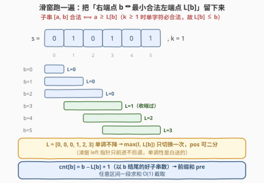
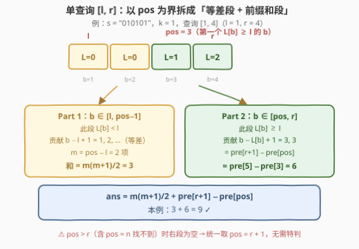
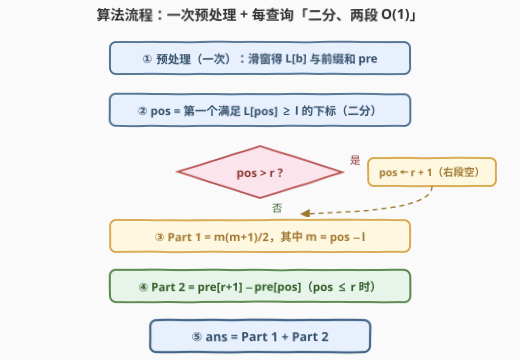
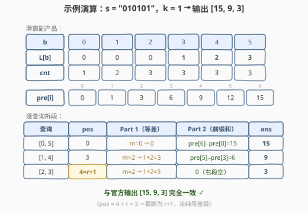

# LeetCode 统计满足 K 约束的子字符串数量 II 题解

## 1. 题目概述

- **标题 / 题号**：统计满足 K 约束的子字符串数量 II（#3261，hard）
- **链接**：https://leetcode.cn/problems/count-substrings-that-satisfy-k-constraint-ii/
- **难度**：困难
- **标签**：字符串、滑动窗口、前缀和、二分查找

**题意**：给你一个**二进制**字符串 $s$ 和一个整数 $k$。如果一个二进制字符串满足以下**任一**条件，则认为该字符串满足 **k 约束**：

- 字符串中 `0` 的数量**最多**为 $k$；
- 字符串中 `1` 的数量**最多**为 $k$。

另给你一个二维整数数组 $queries$，其中 $queries[i] = [l_i, r_i]$。返回一个整数数组 $answer$，其中 $answer[i]$ 表示 $s[l_i..r_i]$ 中满足 **k 约束**的**子字符串**数量。

**示例 1**：

```text
输入：s = "0001111", k = 2, queries = [[0,6]]
输出：[26]
解释：对于查询 [0, 6]，s[0..6] = "0001111" 的所有子字符串中，
     除 s[0..5] = "000111" 和 s[0..6] = "0001111" 外，其余子字符串都满足 k 约束。
```

**示例 2**：

```text
输入：s = "010101", k = 1, queries = [[0,5],[1,4],[2,3]]
输出：[15,9,3]
解释：s 的所有子字符串中，长度大于 3 的子字符串都不满足 k 约束。
```

**约束**：

- $1 \le s.length \le 10^5$
- $s[i]$ 是 `'0'` 或 `'1'$
- $1 \le k \le s.length$
- $1 \le queries.length \le 10^5$
- $queries[i] = [l_i, r_i]$ 且 $0 \le l_i \le r_i < s.length$
- 所有查询**互不相同**

> 💡 读题关键：① 这是 [3258. 统计满足 K 约束的子字符串数量 I](https://leetcode.cn/problems/count-substrings-that-satisfy-k-constraint-i/)（[站内题解](../3201-3300/3258_统计满足K约束的子字符串数量I.md)）的**查询强化版**——约束定义一模一样，但从「数整串一次」变成「$q$ 次区间询问」；② $n, q \le 10^5$ 意味着总预算只有 $O((n+q)\log n)$ 量级，任何「逐查询重新扫」的做法都是 $O(nq) = 10^{10}$ 必然超时；③ 「所有查询互不相同」只是防止 $q$ 缩水的装饰性条件，本题解法并不需要它；④ 单查询答案上界 $\frac{10^5 \times (10^5+1)}{2} \approx 5 \times 10^9$ **超过 `int32`**，C++ 必须全程 `long long`。

## 2. 解题思路

### 2.1 暴力思路：逐查询独立滑窗

I 版的单串计数是标准计数滑窗，$O(n)$ 一遍出答案。最直接的迁移是：对每个查询 $[l, r]$，在子串 $s[l..r]$ 上**独立**跑一遍同样的滑窗——单查询 $O(r-l+1)$，总计 $O(nq) = 10^{10}$，超时。

稍微聪明一点：预处理出 I 版滑窗的副产品 $L[b]$（下见 2.2），单查询变成

$$ans(l, r) = \sum_{b=l}^{r}\Bigl(b - \max\bigl(l,\ L[b]\bigr) + 1\Bigr)$$

但逐项累加仍是 $O(n)$ 每查询，$O(nq)$ 同阶爆炸；用二维表 $f[l][r] = f[l][r-1] + \bigl(r - \max(l, L[r]) + 1\bigr)$ 记忆化则是 $O(n^2)$ 时间 + 空间，$10^{10}$ 依旧不可行。

真正的障碍在于：查询的左边界 $l$ 把贡献函数 $\max(l, L[b])$ **拦腰截断**，$\max$ 交错取值时无法整体求和。突破口藏在 $L$ 的**单调性**里——它让 $\max$ 在 $b$ 轴上只切换**一次**。

### 2.2 核心观察：留下滑窗的副产品 L 数组——单调分界 + 前缀和拆段



**第一步：判定式**。回忆 I 版滑窗的结论（固定右端点 $b$，好子串的左端点是连续后缀）：存在数组 $L[b]$，使得

$$\text{子串 } [a, b] \text{ 合法} \iff a \ge L[b]$$

$L[b]$ 就是滑窗处理到 $b$ 时 `left` 指针的落点——**最小合法左端点**。I 版算完答案就把它扔了；II 版把它留下来，它就是区间查询的「索引结构」。

**第二步：$O(n)$ 预处理两个数组**。滑窗跑一遍，顺手记录：

- $L[b]$：如上；
- $cnt[b] = b - L[b] + 1$：以 $b$ 结尾的好子串个数；再做前缀和 $pre[b] = \sum_{t=0}^{b-1} cnt[t]$。

**第三步：$L$ 单调不降**。若 $[L[b],\ b]$ 合法，则其子集 $[L[b],\ b-1]$ 也合法（好子串的子集仍好），故 $L[b-1] \le L[b]$。代码视角更直观：滑窗的 `left` 指针只前进、不后退。**这个单调性一共用两次**：① 让「第一个 $L[b] \ge l$」可以二分（`lower_bound`）；② 保证 $\max(l, L[b])$ 的取值在 $b$ 轴上**单段切换**——左段全取 $l$、右段全取 $L[b]$，两段才能各自 $O(1)$ 求和。

**第四步：按右端点分类拆查询**。子串 $[a, b]$ 完全落在 $[l, r]$ 内 $\iff l \le a \le b \le r$。按右端点 $b$ 归类（每个子串唯一归属其右端点，不重不漏），每个 $b \in [l, r]$ 的贡献是合法起点落在 $[\max(l, L[b]),\ b]$ 内的个数，即 $b - \max(l, L[b]) + 1$。设 $pos$ = 第一个满足 $L[b] \ge l$ 的下标（二分得到），则：



$$ans(l, r) \;=\; \underbrace{\sum_{b=l}^{pos-1} (b - l + 1)}_{\text{Part 1：等差数列}} \;+\; \underbrace{\sum_{b=pos}^{r} \bigl(b - L[b] + 1\bigr)}_{\text{Part 2：前缀和}} \;=\; \frac{m(m+1)}{2} \;+\; \bigl(pre[r+1] - pre[pos]\bigr)$$

其中 $m = pos - l$。两段各自的道理：

- **Part 1**（$b < pos$，$L[b] < l$）：合法起点区间 $[L[b],\ b]$ **完全盖住** $[l,\ b]$，贡献 $b - l + 1$，即 $1, 2, \dots, m$ 的等差数列，$O(1)$ 求和；
- **Part 2**（$b \ge pos$，$L[b] \ge l$）：合法起点区间与 $[l,\ +\infty)$ 的交集恰是 $[L[b],\ b]$，贡献就是 $cnt[b]$，一段前缀和 $pre[r+1] - pre[pos]$ 直接截取。

**边界收口**：若 $pos > r$（含 $pos = n$ 即整个数组都不存在 $L[b] \ge l$ 的情形，例如全 `0` 串配 $l > 0$），右段为空——统一取 $pos \leftarrow \min(pos,\ r+1)$，公式便无需任何特判。另由 $L[b] \le b$（$k \ge 1$ 时单字符窗口计数为 $(1,0)$ 或 $(0,1)$，必然合法）可知：$b < l$ 时 $L[b] \le b < l$，故 $pos \ge l$ 恒成立，等差段项数 $m \ge 0$。

> 💡 一句话本质：**滑窗算整串答案时「右端点 ↔ 最小合法左端点」的对应关系是副产品，留下来就是区间查询的索引结构**——$L$ 数组负责「定位」（二分找分界点），$pre$ 前缀和负责「求和」（$O(1)$ 截取）。这与 [2055. 蜡烛之间的盘子](https://leetcode.cn/problems/plates-between-candles/)（[站内题解](../2001-2100/2055_蜡烛之间的盘子.md)）的「预处理 + 二分答询问」是同一副骨架。

### 2.3 算法流程图



骨架极简：预处理一次，之后每条查询「一次二分 + 两次 $O(1)$ 运算」。最容易写错的点已用橙色标出：**`pos > r` 时要截断为 $r+1$**，否则 Part 2 会把查询区间之外的 $cnt$ 也加进来（导致多算）。

### 2.4 示例演算



以 `s = "010101"`、$k = 1$ 走一遍。滑窗副产品（注意 $b = 3$ 起窗口「坏」过、`left` 被推着右移）：

| $b$ | 0 | 1 | 2 | 3 | 4 | 5 |
|-----|---|---|---|---|---|---|
| $L[b]$ | 0 | 0 | 0 | 1 | 2 | 3 |
| $cnt[b] = b - L[b] + 1$ | 1 | 2 | 3 | 3 | 3 | 3 |

前缀和 $pre = [0,\ 1,\ 3,\ 6,\ 9,\ 12,\ 15]$（$pre[i]$ 为前 $i$ 项 $cnt$ 之和）。三个查询逐条拆段：

| 查询 | pos | Part 1（等差） | Part 2（前缀和） | ans |
|------|-----|---------------|-----------------|-----|
| $[0, 5]$ | 0 | $m = 0 \to 0$ | $pre[6] - pre[0] = 15$ | **15** |
| $[1, 4]$ | 3 | $m = 2 \to 1 + 2 = 3$ | $pre[5] - pre[3] = 6$ | **9** |
| $[2, 3]$ | 4（$> r$，截为 $r+1$） | $m = 2 \to 1 + 2 = 3$ | 右段空，0 | **3** |

输出 $[15, 9, 3]$ 与官方一致 ✓。查询 $[2, 3]$ 正是边界情形的活教材：$L = [0,0,0,1,2,3]$ 中第一个 $\ge 2$ 的位置是 $4$，落在 $r = 3$ 之外——截断后走纯等差段。示例 1 同法可验：$L = [0,0,0,0,0,1,1]$，查询 $[0, 6]$ 的 $pos = 0$，答案 $pre[7] = 26$ ✓。

## 3. 参考代码

### C++

```cpp
class Solution {
  public:
    vector<long long> countKConstraintSubstrings(string s, int k, vector<vector<int>>& queries) {
        int n = s.size();
        vector<int> L(n);                 // L[b] = 使 [left, b] 合法的最小 left
        vector<long long> pre(n + 1);     // pre[i] = cnt[0] + ... + cnt[i-1]
        int zeros = 0, ones = 0;
        for (int i = 0, j = 0; i < n; ++i) {
            (s[i] == '0' ? zeros : ones)++;        // 右端入窗
            while (zeros > k && ones > k)          // 坏 = 两个都超（I 版同款，注意 &&）
                (s[j++] == '0' ? zeros : ones)--;  // 左端出窗
            L[i] = j;                              // 留下副产品
            pre[i + 1] = pre[i] + (i - j + 1);     // cnt[i] = i - j + 1
        }

        vector<long long> ans;
        ans.reserve(queries.size());
        for (auto& q : queries) {
            int l = q[0], r = q[1];
            // pos = 第一个 L[b] >= l 的下标（L 单调不降，可二分）
            int pos = lower_bound(L.begin(), L.end(), l) - L.begin();
            if (pos > r) pos = r + 1;              // 右段为空：截断防多算
            long long m = pos - l;                 // pos >= l 恒成立
            long long res = (m + 1) * m / 2;       // Part 1：1 + 2 + ... + m
            if (pos <= r) res += pre[r + 1] - pre[pos];  // Part 2
            ans.push_back(res);
        }
        return ans;
    }
};
```

### Python

```python
from bisect import bisect_left

class Solution:
    def countKConstraintSubstrings(self, s: str, k: int, queries: List[List[int]]) -> List[int]:
        n = len(s)
        L = [0] * n                    # L[b] = 使 [left, b] 合法的最小 left
        pre = [0] * (n + 1)            # pre[i] = 前 i 个 cnt 之和
        zeros = ones = j = 0
        for i, ch in enumerate(s):
            if ch == '0':
                zeros += 1
            else:
                ones += 1
            while zeros > k and ones > k:   # 坏 = 两个都超
                if s[j] == '0':
                    zeros -= 1
                else:
                    ones -= 1
                j += 1
            L[i] = j                        # 留下副产品
            pre[i + 1] = pre[i] + (i - j + 1)

        ans = []
        for l, r in queries:
            pos = bisect_left(L, l)         # 第一个 L[b] >= l
            if pos > r:
                pos = r + 1                 # 右段为空
            m = pos - l
            res = (m + 1) * m // 2          # Part 1
            if pos <= r:
                res += pre[r + 1] - pre[pos]  # Part 2
            ans.append(res)
        return ans
```

> 💡 实现细节：① 预处理段与 I 版滑窗**逐行同款**，只是多了「存 $L$、攒 $pre$」两行——II 版不是新算法，是 I 版的「记账版」；② `while` 条件依旧是 `&&` / `and`（两个计数同时超才算坏）；③ 溢出三处都要 `long long` / Python 天然大数：返回值、$pre$、以及等差求和中间量 $(m+1) \times m \approx 10^{10}$——C++ 里 `long long m` 先声明再运算，保证乘法不落在 `int` 上。

## 4. 复杂度分析

| 维度 | 复杂度 | 说明 |
|------|--------|------|
| 时间复杂度 | $O(n + q\log n)$ | 预处理滑窗 $O(n)$（`left`/`right` 各至多走 $n$ 步）；每查询一次二分 $O(\log n)$ + 两次 $O(1)$ 运算 |
| 空间复杂度 | $O(n)$ | $L$ 数组与 $pre$ 前缀和（不计返回值） |
| 暴力对照 | $O(nq)$ | 逐查询独立滑窗，$10^{10}$ 必然超时；二维记忆化 $O(n^2)$ 同样不可行 |
| 进一步 | $O(n + q)$ | 去掉二分的常数级优化，见第 5 节 |

实测：官方两组示例输出 $[26]$ 与 $[15, 9, 3]$；与 $O(n^2)$ 暴力对拍随机数据（$n \le 14$、$k \in [1, n]$、随机查询）3000 组全部一致；大数边界 $n = 10^5$ 全 `0` 串、查询 $[0, n-1]$ 得 $5{,}000{,}050{,}000$，验证 `long long` 必要性。

## 5. 扩展：去掉二分——$O(n + q)$ 的两种写法

二分不是必须的。注意到 $pos(l)$（第一个 $L[b] \ge l$ 的下标）关于 $l$ **同样单调不减**——$l$ 变大只会让门槛更高、切换点更靠右。据此有两种消掉 $\log$ 的方式：

**写法一：在线预处理 `posOf` 数组**。$l$ 从 $0$ 递增到 $n-1$，指针 $p$ 单调前进，$O(n)$ 直接算出每个 $l$ 的答案，之后每查询 $O(1)$：

```python
posOf = [n] * n          # posOf[l] = 第一个 L[b] >= l 的 b（不存在则 n）
p = 0
for l in range(n):
    while p < n and L[p] < l:
        p += 1
    posOf[l] = p
# 查询时：pos = min(posOf[l], r + 1)，其余不变
```

**写法二：离线双指针**。把查询按 $l$ 排序，$p$ 指针随 $l$ 单调推进，总移动量 $O(n + q)$。

两者取舍：写法一**保持在线性**（预处理完后查询可以任意顺序、甚至交互式地到达），写法二省一个 $O(n)$ 数组但要打乱查询顺序。本题 $q \log q$ 的排序和 $q \log n$ 的二分都是小头，实战中 `$O(n + q\log n)$` 的二分版通常已够用——它的价值在于**代码最短、最不容易写错**。

> 💡 更进一步的脑洞：若字符串还会**动态修改**（点更新 + 区间查询），$L$ 数组失效，需要线段树维护「区间合并时窗口信息的拼接」（类似 [239. 滑动窗口最大值](https://leetcode.cn/problems/sliding-window-maximum/)（[站内题解](../0201-0300/239_滑动窗口最大值.md)）之于单调队列的 segment tree beating 讨论），难度直接上探竞赛级——面试口头提一句即可，不必展开。

## 6. 面试要点

1. **为什么按右端点 $b$ 分类计数不重不漏？**

   - 每个子串由左右端点唯一确定，按右端点归类后各类两两互斥；$b$ 取遍 $[l, r]$ 恰好覆盖所有「完全落在查询区间内」的子串。再配合「固定 $b$ 时合法左端点是连续段 $[L[b], b]$」（I 版滑窗已证），每个 $b$ 的贡献就是一段区间长度，相加即得总数。

2. **$L$ 为什么单调不降？这条单调性在算法里用在几处？**

   - $[L[b], b]$ 合法 ⇒ 其子集 $[L[b], b-1]$ 也合法 ⇒ $L[b-1] \le L[b]$（等价地：滑窗 `left` 指针只前进）。用在**两处**：① `lower_bound` 二分找切换点 $pos$；② 保证 $\max(l, L[b])$ 在 $b$ 轴上单段切换（左段全 $l$、右段全 $L[b]$），两段才能分别用等差公式和前缀和 $O(1)$ 求和——若 $\max$ 交错出现就只能逐项累加，退回 $O(n)$ 每查询。

3. **`pos = min(pos, r+1)` 这行在防什么？**

   - 防右段为空的两种情形：① $pos = n$——整个数组都不存在 $L[b] \ge l$（如全 `0` 串、所有 $L[b] = 0$、$l > 0$）；② $r < pos < n$——切换点落在查询区间右侧。不截断的话 $pre[r+1] - pre[pos]$ 会取到负数下界的错误区间、等差段也会多算。截断后 $m = pos - l = r + 1 - l$，Part 2 恰为 0，公式统一。另由 $L[b] \le b$ 知 $pos \ge l$ 恒成立（$b < l \Rightarrow L[b] \le b < l$），$m \ge 0$ 无需防御。

4. **哪些量必须 `long long`？**

   - 单查询答案上界 $\binom{n+1}{2} \approx 5 \times 10^9 > 2^{31} - 1 \approx 2.1 \times 10^9$，返回值与 $pre$ 数组必须 64 位；最隐蔽的是**等差求和的中间量** $(m+1) \times m$：$m$ 可达 $10^5$，乘积约 $10^{10}$ 同样超 `int`——C++ 中若 `m` 声明为 `int`、写 `(long long)(m + 1) * m / 2` 或干脆 `long long m`，否则先乘后除的乘法在 32 位里悄悄溢出，且小样例全过、大样例才炸，极难排查。

5. **本题的查询是在线还是离线？还能更快吗？**

   - 本解法预处理完成后每条查询**独立可答**，天然支持在线（任意顺序、交互式给出都行），这是相对「离线排序双指针」更稳的属性。速度上还能把二分消掉：$pos(l)$ 关于 $l$ 单调不减，$O(n)$ 预处理 `posOf[l]` 或查询按 $l$ 排序后双指针，总量 $O(n + q)$（见第 5 节）。面试回答顺序建议：先给二分版（最短最稳），再主动提 $O(n+q)$ 优化，展示对「单调性复用」的敏感度。

## 同类练习题

| # | 题目 | 与本题的关联 |
|---|------|-------------|
| 3258 | [统计满足 K 约束的子字符串数量 I](https://leetcode.cn/problems/count-substrings-that-satisfy-k-constraint-i/)（[站内题解](../3201-3300/3258_统计满足K约束的子字符串数量I.md)） | 前传——单串版计数滑窗，本题的 $L$ 数组正是它滑窗时被扔掉的副产品 |
| 713 | [乘积小于 K 的子数组](https://leetcode.cn/problems/subarray-product-less-than-k/)（[站内题解](../0701-0800/713_乘积小于K的子数组.md)） | `right − left + 1` 计数滑窗的入门骨架，本题预处理阶段同款 |
| 795 | [区间子数组个数](https://leetcode.cn/problems/number-of-subarrays-with-bounded-maximum/)（[站内题解](../0701-0800/795_区间子数组个数.md)） | 同样「按右端点分类 + 找分界点拆段求和」处理带边界的子数组计数，对照本题的 $\max(l, L[b])$ 拆段 |
| 2055 | [蜡烛之间的盘子](https://leetcode.cn/problems/plates-between-candles/)（[站内题解](../2001-2100/2055_蜡烛之间的盘子.md)） | 预处理前缀和 + 二分回答区间询问，查询侧结构与本题完全同款 |
| 3152 | [特殊数组 II](https://leetcode.cn/problems/special-array-ii/)（[站内题解](../3101-3200/3152_特殊数组II.md)） | 「一次预处理 + 逐条 $O(1)$/$O(\log n)$ 答询问」的区间查询通用范式，把滑窗换成奇偶性前缀和即可 |
