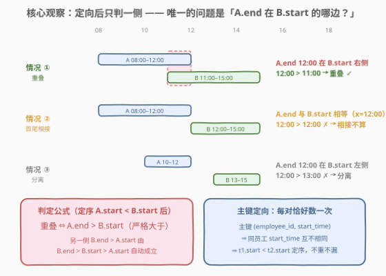
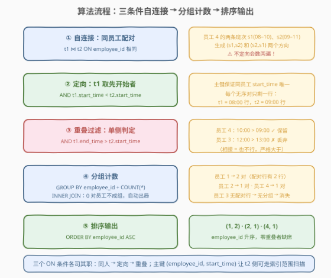
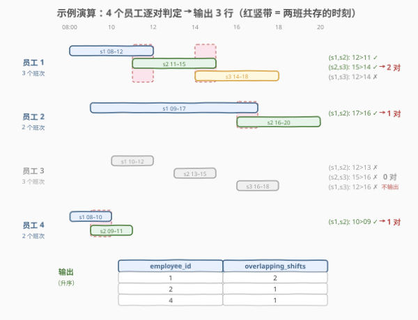

# LeetCode 查找重叠的班次 题解

## 1. 题目概述

- **标题 / 题号**：查找重叠的班次（#3262，medium）
- **链接**：https://leetcode.cn/problems/find-overlapping-shifts/
- **难度**：中等
- **标签**：数据库、SQL、自连接、JOIN、GROUP BY、COUNT、区间重叠、LeetCode 锁题

> ⚠️ 本题为 LeetCode 付费题（锁题），题意描述根据官方示例用例与外部资料重建，可能与官方题面有出入。（题面已与社区镜像 doocs/leetcode 的官方中文翻译交叉核对，示例输入输出与 GraphQL 接口返回一致，出入风险较低。）

**表结构**：`EmployeeShifts`

| 列名 | 类型 |
|------|------|
| employee_id | int |
| start_time | time |
| end_time | time |

- `(employee_id, start_time)` 是这张表的主键。
- 这张表包含员工的排班工作，包括特定日期的开始和结束时间。

**目标**：编写一个解决方案，为每个员工计算**重叠排班的数量**。如果一个排班的 `end_time` 比另一个排班的 `start_time` **更晚**（严格大于），则认为两个排班重叠。返回 `employee_id` 和 `overlapping_shifts` 两列，按 `employee_id` **升序**排序；**只有至少存在一个重叠对的员工**才出现在结果中。

**示例 1**：

```text
输入：EmployeeShifts 表
+-------------+------------+----------+
| employee_id | start_time | end_time |
+-------------+------------+----------+
| 1           | 08:00:00   | 12:00:00 |
| 1           | 11:00:00   | 15:00:00 |
| 1           | 14:00:00   | 18:00:00 |
| 2           | 09:00:00   | 17:00:00 |
| 2           | 16:00:00   | 20:00:00 |
| 3           | 10:00:00   | 12:00:00 |
| 3           | 13:00:00   | 15:00:00 |
| 3           | 16:00:00   | 18:00:00 |
| 4           | 08:00:00   | 10:00:00 |
| 4           | 09:00:00   | 11:00:00 |
+-------------+------------+----------+

输出：
+-------------+--------------------+
| employee_id | overlapping_shifts |
+-------------+--------------------+
| 1           | 2                  |
| 2           | 1                  |
| 4           | 1                  |
+-------------+--------------------+
```

**解释**：

- 员工 1 有 3 个排班：08:00–12:00、11:00–15:00、14:00–18:00。第 1 个与第 2 个重叠（12:00 > 11:00），第 2 个与第 3 个重叠（15:00 > 14:00），第 1 个与第 3 个不重叠（12:00 > 14:00 不成立）→ **2 个重叠对**；
- 员工 2 有 2 个排班：09:00–17:00、16:00–20:00，二者重叠（17:00 > 16:00）→ **1 个重叠对**；
- 员工 3 有 3 个排班：10:00–12:00、13:00–15:00、16:00–18:00，两两之间均有间隔，**无重叠 → 不输出**；
- 员工 4 有 2 个排班：08:00–10:00、09:00–11:00，二者重叠（10:00 > 09:00）→ **1 个重叠对**。

**约束**：

- `(employee_id, start_time)` 为主键 ⇒ **同一员工内 `start_time` 互不相同**，且每行是一条完整班次；
- `start_time` / `end_time` 为 `time` 类型（同一天内，不跨天；跨天版本见 3268 II）；
- 班次数据合法（`end_time > start_time`）。

> 💡 **审题关键**：`overlapping_shifts` 数的是**重叠「对」的个数**（组合数 $\binom{k}{2}$ 的一个子集），不是「有重叠的班次数」也不是「重叠时间段的段数」——按对计数是本题一切写法的出发点。

## 2. 解题思路

### 2.1 暴力思路：应用层双重循环

把整表拉到应用层，对每个员工把他的班次**两两组合**，逐对判断「先开始的那条是否在后者开始之后才结束」，统计满足条件的对数——$O(k^2)$ 的双重循环，逻辑直白。

SQL 层面同样可以暴力自连接，但会立刻撞上本题第一个坑：**同一对班次会被数两次**——`(a,b)` 和 `(b,a)` 都满足「一条的 end 晚于另一条的 start」这种对称描述。比如员工 4 的两条班次，`t1=08:00行, t2=09:00行` 数一次，`t1=09:00行, t2=08:00行` 又数一次，得到 2 而不是 1。

> ⚠️ 暴力的根本问题：**配对缺乏「方向」**。区间重叠本身是对称关系，而「计数每个无序对恰好一次」需要给每对定一个规范方向（canonical ordering）——这正是主键 `(employee_id, start_time)` 送上门的礼物。

### 2.2 核心观察：主键定向 + 单侧判定



两个观察把问题化成一次自连接：

| 观察 | 内容 | 带来的简化 |
|------|------|-----------|
| **主键定向** | `(employee_id, start_time)` 是主键 ⇒ 同一员工内 `start_time` 互不相同 ⇒ 任何两条班次必可按开始时间分先后 | 约定 `t1` 永远取**开始更早**的那条（`t1.start_time < t2.start_time`），**每个无序对恰好生成一行**，天然去重 |
| **单侧判定** | 定序后（`A.start < B.start`），重叠 ⇔ `A.end > B.start`；另一侧 `B.end > A.start` 由 `B.end > B.start > A.start` **自动成立** | 判定条件从两条压缩成一条，且就是题面那句「一个排班的 end_time 比另一个排班的 start_time 更晚」 |

于是配对条件浓缩为三行 `ON`：

```sql
t1.employee_id = t2.employee_id   -- 只和自己比
AND t1.start_time < t2.start_time -- 定向：t1 是先开始的那条（每对一次）
AND t1.end_time   > t2.start_time -- 单侧判定：先开始的没结束，后开始的就开始了
```

配对完成后，`GROUP BY employee_id` 数行数即重叠对数；**零重叠的员工没有任何配对行，INNER JOIN 后根本不成分组，自动从结果中消失**——连 `HAVING` 都不需要写。

### 2.3 算法流程图



| 步骤 | 操作 | 产出 |
|------|------|------|
| ① 自连接 | `EmployeeShifts t1 JOIN EmployeeShifts t2 ON employee_id 相同` | 同一员工内全部**有序对**（含两个方向） |
| ② 定向 | `AND t1.start_time < t2.start_time` | 每个无序对只留一行（t1 先开始） |
| ③ 重叠过滤 | `AND t1.end_time > t2.start_time` | 只剩真正重叠的对 |
| ④ 分组计数 | `GROUP BY t1.employee_id` + `COUNT(*)` | `(employee_id, overlapping_shifts)`；0 对的员工不成组 |
| ⑤ 排序 | `ORDER BY t1.employee_id` | 按 `employee_id` 升序输出 |

### 2.4 示例演算



以示例数据走一遍（每员工内按 `start_time` 排序后逐对判定 `A.end > B.start`）：

| 员工 | 班次（按开始排序） | 逐对判定 | 对数 |
|------|-------------------|----------|------|
| 1 | s1(08–12), s2(11–15), s3(14–18) | (s1,s2)：12>11 ✓；(s1,s3)：12>14 ✗；(s2,s3)：15>14 ✓ | **2** |
| 2 | s1(09–17), s2(16–20) | (s1,s2)：17>16 ✓ | **1** |
| 3 | s1(10–12), s2(13–15), s3(16–18) | (s1,s2)：12>13 ✗；(s1,s3)：12>16 ✗；(s2,s3)：15>16 ✗ | **0 → 排除** |
| 4 | s1(08–10), s2(09–11) | (s1,s2)：10>09 ✓ | **1** |

最终输出 `(1,2)`、`(2,1)`、`(4,1)`，与期望一致。

> 💡 **边界细节**：员工 1 的 s1 与 s2「首尾相接式」地交错（12:00 与 14:00 都落在对方区间附近），但判定始终只看 `A.end > B.start` 一侧；若某对班次正好首尾相接（前一条 `end_time` = 后一条 `start_time`，如 08–12 与 12–15），严格大于不成立，**不算重叠**。

## 3. 参考代码

### SQL（解法一：自连接 + 分组计数，推荐）

```sql
SELECT
    t1.employee_id,
    COUNT(*) AS overlapping_shifts
FROM EmployeeShifts t1
JOIN EmployeeShifts t2
    ON  t1.employee_id = t2.employee_id
    AND t1.start_time < t2.start_time
    AND t1.end_time   > t2.start_time
GROUP BY t1.employee_id
ORDER BY t1.employee_id;
```

> 💡 **写法要点**：
> - 三个 `ON` 条件各司其职：**同人**（防止跨员工误配）→ **定向**（每对恰好数一次）→ **重叠**（单侧判定）。少写「定向」会双倍计数，少写「同人」会把不同员工时间相近的班次误判为重叠。
> - **不需要 `HAVING`**：`JOIN` 是 INNER，零重叠的员工没有任何满足条件的配对行，分组阶段自然不存在，等价于隐式的 `HAVING COUNT(*) > 0`。显式写上也无妨（语义更醒目，且换成 `LEFT JOIN` 时就是必需的）。
> - 主键 `(employee_id, start_time)` 本身就是索引：`t2` 侧的匹配可以走 `employee_id = ? AND start_time > ?` 的**索引范围扫描**，再被 `start_time < t1.end_time` 截断，实际代价与「真实存在的重叠对数」同阶，远好于最坏 $O(n^2)$。

### SQL（解法二：相关子查询逐行计数）

```sql
SELECT
    employee_id,
    SUM(cnt) AS overlapping_shifts
FROM (
    SELECT t1.employee_id,
           (SELECT COUNT(*)
            FROM EmployeeShifts t2
            WHERE t2.employee_id = t1.employee_id
              AND t2.start_time > t1.start_time
              AND t2.start_time < t1.end_time) AS cnt
    FROM EmployeeShifts t1
) s
WHERE cnt > 0
GROUP BY employee_id
ORDER BY employee_id;
```

> 💡 **写法要点**：
> - 视角换成「**逐行数邻居**」：对每条班次 $i$，数开始时间落在开区间 $(start_i, end_i)$ 内的**更晚班次**条数 `cnt`；每个重叠对 $(i,j)$（$i$ 先开始）恰好被行 $i$ 数到一次，全体求和即为对数。
> - `WHERE cnt > 0` 先剔除无贡献的行再分组，效果与解法一「零重叠员工不成组」一致（`cnt` 恒非负，剔除不影响 SUM）。
> - 相关子查询每行触发一次，无索引时最坏 $O(n^2)$；有主键索引时可退化为 $n$ 次范围计数。**面试首选解法一**，本解法用于展示「同一计数目标的另一种分解视角」。

### Python（pandas）

```python
import pandas as pd

def find_overlapping_shifts(employee_shifts: pd.DataFrame) -> pd.DataFrame:
    merged = employee_shifts.merge(
        employee_shifts, on="employee_id", suffixes=("_1", "_2")
    )
    overlapping = merged[
        (merged["start_time_1"] < merged["start_time_2"])
        & (merged["end_time_1"] > merged["start_time_2"])
    ]
    result = (
        overlapping.groupby("employee_id")
        .size()
        .reset_index(name="overlapping_shifts")
    )
    return result.sort_values("employee_id").reset_index(drop=True)
```

> 💡 **pandas 对照**：`merge(on="employee_id")` 对应 SQL 的自连接（含两个方向）；布尔掩码的两个条件与 `ON` 中「定向 + 重叠」逐字对应；`groupby(...).size()` 对应 `GROUP BY` + `COUNT(*)`——零重叠员工在 `overlapping` 里没有行，分组后同样自动消失。`time` 列在 pandas 中按时间 dtype（或字符串）比较，序关系与 SQL 一致。

## 4. 复杂度分析

| 维度 | 复杂度 | 说明 |
|------|--------|------|
| **时间（解法一，无索引）** | $O(n^2)$ | 自连接最坏把同员工的全部有序对都生成出来再过滤；单员工 $k$ 条班次贡献 $k(k-1)/2$ 个候选对 |
| **时间（解法一，有主键索引）** | $O(n \log n + P)$ | `t2` 侧沿 `(employee_id, start_time)` 索引做范围扫描，代价近似「排序 + 输出真实重叠对数 $P$」 |
| **时间（解法二）** | $O(n^2)$ / 索引下 $O(n \cdot \log n + P)$ | 相关子查询逐行触发，依赖索引范围计数 |
| **空间** | $O(n)$ | 自连接中间结果与分组哈希表（引擎可流式处理分组，聚合本身 $O(\text{员工数})$） |
| **结果规模** | $O(\text{员工数})$ | 每个有重叠的员工恰输出一行 |

> ⚠️ SQL 复杂度取决于执行计划与索引：本题主键 `(employee_id, start_time)` 恰好覆盖连接键与定向键，是「索引友好」的典范。面试中说明「最坏平方、主键索引下近似线性于输出」即可。

## 5. 扩展：为什么不能用「只看相邻班次」偷懒

排序后用窗口函数只检查**相邻**两班（`LEAD(start_time) OVER (...) < end_time`）看似 $O(n \log n)$ 更优雅，**但它是错的**：

```text
员工 9 的班次（按开始时间排序）：
  s1: 08:00 ──────────── 18:00   （长班次）
  s2:     09:00 ── 09:30         （嵌在 s1 里的短班次）
  s3:       10:00 ── 12:00       （也嵌在 s1 里）

相邻判定：LEAD(s2).start=10:00 > s2.end=09:30 → 只数出 (s1,s2) 一对
真实对数：(s1,s2) ✓、(s1,s3) ✓（18:00 > 10:00）、(s2,s3) ✗ → 共 2 对
```

原因在于：**「与 $i$ 重叠」不是能沿相邻关系传递的链式性质**——长班次可以隔着一条短班次与更晚的班次重叠，相邻窗口看不到。要只看相邻就正确，需要区间满足「排序后前缀最大 end 单调不减」这类额外结构（如会议室类题目中常见的天花板扫描），本题没有这个保证。

正确的线性化思路是**天花板扫描**（排序后维护「目前见过的最大 `end_time`」，数 `start_time < max_end` 的行……但它数的是「与前面任一班次重叠的行数」，与「重叠对数」仍是两个口径，直接套用也会错——这正说明本题在 SQL 里最稳妥的表达就是自连接全对判定）。跨天、按对计数且要统计重叠区间的进阶版本见 [3268. 查找重叠的班次 II](https://leetcode.cn/problems/find-overlapping-shifts-ii/)。

## 6. 面试要点

1. **为什么 `t1.start_time < t2.start_time` 能保证每对恰好数一次？**

   - 主键 `(employee_id, start_time)` 保证同一员工内 `start_time` **互不相同**，于是任何两条班次按开始时间严格分先后；约定 `t1` 永远取先开始的那条，每个无序对 $\{A,B\}$ 只生成 $(A,B)$ 一行、$(B,A)$ 被条件排除。若表没有这层唯一性，就得引入行标识（如自增 id）来做定向，否则相同 `start_time` 的两行会被 `<` 同时漏掉、又被 `<=` 双向重复。

2. **为什么不用写成双向判定 `A.end > B.start AND B.end > A.start`？**

   - 定序后 `A.start < B.start`，又因班次合法有 `B.end > B.start`，链起来 `B.end > B.start > A.start` 恒成立——「另一侧」是自动满足的，写上是冗余（不影响正确性）。题面「一个排班的 end_time 比另一个排班的 start_time 更晚」在定序视角下就只剩 `A.end > B.start` 一句。

3. **首尾相接（前班 `end_time` = 后班 `start_time`）算重叠吗？**

   - **不算**。判定是严格大于：08:00–12:00 与 12:00–15:00 首尾相接，`12:00 > 12:00` 不成立。示例里员工 3 的班次之间隔得更远，同理全部不重叠。若题面改成「不早于」，条件相应变为 `>=`——一字之差，面试务必确认边界。

4. **零重叠的员工是怎么被排除的？需要 `HAVING` 吗？**

   - INNER JOIN 下没有任何配对行的员工在 `GROUP BY` 阶段不成分组，天然不出现在结果里，`HAVING COUNT(*) > 0` 是隐式成立的，可写可不写。但若把 `JOIN` 改成 `LEFT JOIN`（错误改法），每个员工都保留、零重叠员工计 0，就必须显式 `HAVING`——**连接类型与过滤位置要配套**。

5. **有索引的话这个自连接跑多快？**

   - 主键 `(employee_id, start_time)` 恰好覆盖「同人 + 定向」两个条件：对每条 `t1` 行，`t2` 侧可做 `employee_id = t1.employee_id AND start_time > t1.start_time` 的索引范围扫描，并在 `start_time < t1.end_time` 处截断——代价近似「$n$ 次对数定位 + 输出全部真实重叠对 $P$」，最坏 $O(n^2)$ 只在人人班次大规模互相重叠时出现。

> 💡 **一句话总结**：3262 是 SQL **「自连接按对计数」母题**——主键 `(employee_id, start_time)` 白送两件事：给每对班次**定向**（`<` 去重）和给 `t2` 侧**索引范围扫描**；定序之后重叠判定只剩一侧 `A.end > B.start`（严格大于，首尾相接不算），`GROUP BY` + `COUNT(*)` 收尾，零重叠员工因 INNER JOIN 无配对行而自动出局。与 56/986/435 等「区间家族」算法题共享同一条区间语义，只是把判定搬进了 `ON` 子句。

## 同类练习题

| # | 题目 | 与本题的关联 |
|---|------|-------------|
| 3268 | [查找重叠的班次 II](https://leetcode.cn/problems/find-overlapping-shifts-ii/) | 同族进阶版，`datetime` 跨天班次 + Hard，共享「按对计数重叠」的核心口径 |
| 56 | [合并区间](https://leetcode.cn/problems/merge-intervals/) | 区间重叠家族的算法侧经典，排序后用「当前区间 end ≥ 下一区间 start」判定可合并，与本题的单侧判定同源 |
| 986 | [区间列表的交集](https://leetcode.cn/problems/interval-list-intersections/) | 两组**有序且内部不重叠**的区间求交集，正因有序不重叠才允许只看相邻——对照本题「乱序区间必须全对判定」的边界 |
| 435 | [无重叠区间](https://leetcode.cn/problems/non-overlapping-intervals/) | 反方向问题——移除最少的区间使剩下的互不重叠，贪心保留右端点最小的区间 |
| 253 | [会议室 II](https://leetcode.cn/problems/meeting-rooms-ii/) | 把「重叠对计数」换成「最大同时重叠数」（天花板扫描 / 最小堆），是区间计数的另一个高频口径 |
