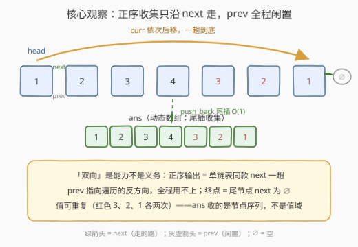
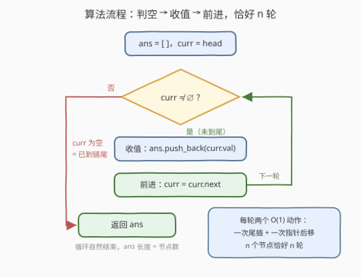
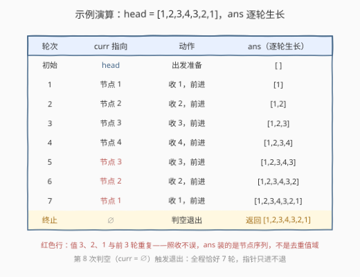

# 将双链表转换为数组I

- **题目名称**：将双链表转换为数组I
- **链接**：[3263. 将双链表转换为数组I](https://leetcode.cn/problems/convert-doubly-linked-list-to-array-i/)
- **难度**：简单
- **标签**：链表、双向链表、数组、遍历

## 1. 题目概述

> ⚠️ 本题为 LeetCode 付费题，官方接口不返回题面；题意描述依据公开镜像与官方示例用例重建，可能与官方题面有出入。

给定一个**双链表**（doubly linked list）的头节点 `head`。双链表的每个节点除 `val` 外还带两个指针：`next` 指向后一个节点，`prev` 指向前一个节点（头节点的 `prev`、尾节点的 `next` 均为空）。

要求返回一个整数数组 `ans`，**按顺序**（从链头到链尾）包含链表中所有节点的值。

**示例 1**：

```text
输入：head = [1,2,3,4,3,2,1]
输出：[1,2,3,4,3,2,1]
解释：从 head 出发依次经过 1, 2, 3, 4, 3, 2, 1，原样收集。
```

**示例 2**：

```text
输入：head = [2,2,2,2,2]
输出：[2,2,2,2,2]
```

**示例 3**：

```text
输入：head = [3,2,3,2,3,2]
输出：[3,2,3,2,3,2]
```

**约束条件**：

- 链表中节点数量在 $[1, 50]$ 范围内
- $1 \le \text{Node.val} \le 50$（**值允许重复**，见示例 2/3）

> 💡 **审题关键**：①「按顺序」= 从 `head` 沿 `next` 方向的遍历序，题目直接把起点（头节点）交到你手上；② 双链表虽然 `prev`/`next` 双全，但**正序输出只需要 `next` 一条链**，`prev` 是本题的「冗余配置」；③ 示例特意安排回文、全同、交替三组重复值——暗示收集的是**节点序列**而非去重值域，别自作聪明去重。

---

## 2. 解题思路

### 2.1 暴力思路：递归收集

「链表转数组」最直觉的数学表达是递归定义：

$$\text{toArray}(p) = \begin{cases} [\,], & p = \varnothing \\ [p.\text{val}] + \text{toArray}(p.\text{next}), & \text{否则} \end{cases}$$

一行递归就能写对，但代价是：每层递归压一个栈帧（$O(n)$ 栈空间），返回时还要逐层拼接列表——每次 `[a] + [b]` 都新建列表并整体复制，逐层累加最坏 $O(n^2)$。$n \le 50$ 时无所谓，但把 $n$ 放大到 $10^6$ 就是爆栈与平方拼接的双重风险。链表遍历的通用姿势是**迭代 + 动态数组尾插**——一个游标、一趟到底。

### 2.2 核心观察：正序只沿 next，prev 全程闲置



**观察 1（`prev` 用不上）**：双链表节点 = `val + prev + next`，但要从 `head` 收集**正序**序列，唯一的移动方式就是 `curr = curr.next`；`prev` 指向遍历的**反方向**，从头走到尾碰不到它一次。「双向」是能力，不是义务——正序遍历的代码与单链表（206 系）完全同款。

**观察 2（尾插均摊 $O(1)$）**：动态数组（C++ `vector` / Python `list`）的 `push_back` / `append` 均摊 $O(1)$（倍增扩容），$n$ 个值收集总代价 $O(n)$，无需预知长度——链表不支持随机访问，本就无法 $O(1)$ 查长度，「先数一遍再填」的两趟写法纯属浪费。

**观察 3（终止靠指针判空）**：链表没有 `length`，循环的终点是**尾节点的 `next` 为空**——「指针为空」而非「值满足条件」是链表遍历与数组 `for` 循环的本质区别。

> ⚠️ 顺序敏感小细节：**先判 `curr` 非空、再取 `curr.val`（先判后取）**。C++ 中解引用空指针是未定义行为；把判空写进循环条件 `for (; curr; curr = curr->next)` 是最省事的保险。

### 2.3 算法流程图



| 步骤 | 操作 | 作用 |
|------|------|------|
| ① 初始化 | `ans = []`，`curr = head` | 游标从链头出发 |
| ② 循环体 | `curr ≠ ∅` 时：`ans.push_back(curr.val)` → `curr = curr.next` | 收一个、走一格，两个均摊 $O(1)$ 动作 |
| ③ 终止 | `curr = ∅`（到尾），返回 `ans` | 恰好 $n$ 轮，指针只进不退 |

### 2.4 示例演算



以示例 1（`head = [1,2,3,4,3,2,1]`）为例，`curr` 从头走到尾共 7 轮，每轮「收值 + 前进」，`ans` 逐轮长成 $[1] \to [1,2] \to \cdots \to [1,2,3,4,3,2,1]$。第 5、6、7 轮收集到的 `3, 2, 1` 与前 3 轮的值**重复**——`ans` 记录的是节点序列，长度恒等于节点数，去重、排序都是画蛇添足。第 8 次判空（`curr = ∅`）退出循环，返回答案。

---

## 3. 参考代码

### C++（迭代 + 尾插）

```cpp
/**
 * Definition for a doubly-linked list node.
 * class Node {
 *     int val;
 *     Node *prev;
 *     Node *next;
 * };
 */
class Solution {
public:
    vector<int> toArray(Node* head) {
        vector<int> ans;                                  // 动态数组，无需预知长度
        for (Node* curr = head; curr; curr = curr->next) { // 判空即终止
            ans.push_back(curr->val);                     // 均摊 O(1) 尾插
        }
        return ans;
    }
};
```

### Python（迭代 + 尾插）

```python
"""
# Definition for a Node.
class Node:
    def __init__(self, val, prev=None, next=None):
        self.val = val
        self.prev = prev
        self.next = next
"""

class Solution:
    def toArray(self, root: "Optional[Node]") -> List[int]:
        ans = []
        while root:                # 先判空
            ans.append(root.val)   # 后取值，均摊 O(1) 尾插
            root = root.next       # 只用 next，prev 全程闲置
        return ans
```

> 💡 官方 Python 签名的形参名叫 `root`（C++ 为 `head`），语义相同，均指链表头节点。

---

## 4. 复杂度分析

| 维度 | 复杂度 | 说明 |
|------|--------|------|
| **时间** | $O(n)$ | 每个节点一次判空 + 一次尾插 + 一次指针后移，共 $n$ 轮 |
| **空间** | $O(1)$ | 不计输出数组，仅 `curr` 一个游标指针 |
| **对照：递归版** | 时间 $O(n^2)$、栈空间 $O(n)$ | 逐层拼接列表带来整体复制；$n$ 大时有爆栈风险 |

> 💡 输出数组本身占 $O(n)$ 空间，但它是题目要求的产物，按惯例不计入「额外空间」。

---

## 5. 扩展：给的不是头节点怎么办（3294）

姊妹题 [3294. 将双链表转换为数组II](https://leetcode.cn/problems/convert-doubly-linked-list-to-array-ii/)（中等，值互不相同）把入口换成**任意**节点 `node`——正序数组的起点必须是链头，于是多出一步「找头」：

```cpp
vector<int> toArray(Node* node) {
    while (node->prev) node = node->prev;    // 第一步：沿 prev 回溯到 head
    vector<int> ans;                         // 第二步：本题的正序收集
    for (; node; node = node->next) ans.push_back(node->val);
    return ans;
}
```

两趟共 $O(n)$，这正是 `prev` 指针的存在意义——**单链表**给你中间节点就无路可走（只能从 `head` 重走一遍），双链表却能反向自救。另一条思路是从 `node` 双向出发：沿 `prev` 收集前缀（天然逆序）、沿 `next` 收集后缀，再把前缀反转拼接，同样 $O(n)$，但两趟顺序版更清晰。

再往远处推：给**尾节点**要逆序数组 → 沿 `prev` 一趟即可；若怀疑链表**带环**（`next` 指回前方节点），判空终止会死循环，需先 Floyd 快慢指针判环（[141. 环形链表](https://leetcode.cn/problems/linked-list-cycle/)）——本题约束保证结构合法、无环，判空即安全。

---

## 6. 面试要点

1. **双链表的遍历和单链表有什么区别？**

   就「正序遍历」而言**没有任何区别**：都是从 `head` 沿 `next` 走到空。`prev` 的价值在反向遍历、给定任意节点定位链头（3294）、以及 $O(1)$ 删除已知节点（单链表删除必须先找前驱）。识别出「冗余能力」本身就是考点。

2. **为什么推荐迭代而不是递归？**

   迭代只用 $O(1)$ 游标；递归压 $O(n)$ 栈帧，且逐层拼接列表有整体复制的常数开销（朴素写法 $O(n^2)$），$n$ 大时爆栈。链表长度未知/很大时，「迭代 + 动态数组」是标准姿势。

3. **循环终止条件为什么是判空而不是计数？**

   链表不支持随机访问、没有 `size` 属性，唯一可靠的「到尾」信号是 `curr == ∅`（尾节点 `next` 为空）。同时注意**先判空后取值**，避免空指针解引用（C++ 中是未定义行为）。

4. **`push_back` / `append` 真的是 $O(1)$ 吗？**

   单次最坏 $O(n)$（触发扩容时整体搬迁），但**均摊** $O(1)$：倍增策略下 $n$ 次尾插的总搬迁代价为 $O(n)$。在意单次最坏延迟的场景（实时系统），可以先一趟数长度、`reserve` 后再填，代价是多扫一遍。

5. **本题面试里到底在考什么？**

   基本功核查：节点结构的读法（`val/prev/next` 三件套）、「判空-取值-后移」的循环三拍、以及能否一眼看出 `prev` 在正序任务里用不上——并为追问「什么时候必须用 `prev`」埋好伏笔（3294、逆序输出、$O(1)$ 删节点、LRU 双向链表）。

---

## 7. 同类练习题

- [3294. 将双链表转换为数组II](https://leetcode.cn/problems/convert-doubly-linked-list-to-array-ii/)：本题的直接进阶——入口换成任意节点，先沿 `prev` 回溯到链头再正序收集
- [430. 扁平化多级双向链表](https://leetcode.cn/problems/flatten-a-multilevel-doubly-linked-list/)（[题解](../0401-0500/430_扁平化多级双向链表.md)）：双向链表再挂一条 `child` 指针，DFS 深度优先把多级结构拉平成一条
- [206. 反转链表](https://leetcode.cn/problems/reverse-linked-list/)（[题解](../0201-0300/206_反转链表.md)）：单向 `next` 链指针操作的基本功，与本题互为正反面
- [141. 环形链表](https://leetcode.cn/problems/linked-list-cycle/)（[题解](../0101-0200/141_环形链表.md)）：遍历的「保险丝」——判空终止的前提是无环，带环时需快慢指针检测
- [146. LRU缓存](https://leetcode.cn/problems/lru-cache/)（[题解](../0101-0200/146_LRU缓存.md)）：双链表 `prev`/`next` 双向能力的实战主场——哈希 + 双向链表实现 $O(1)$ 定位与摘除
