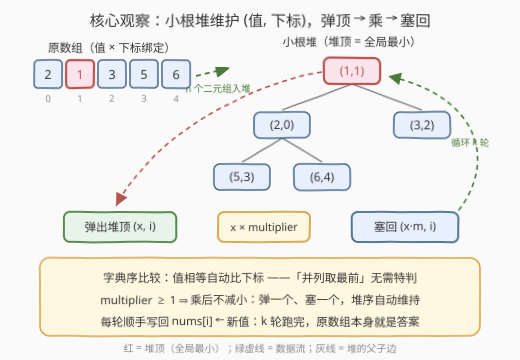
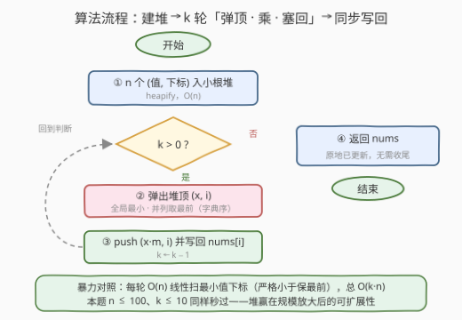
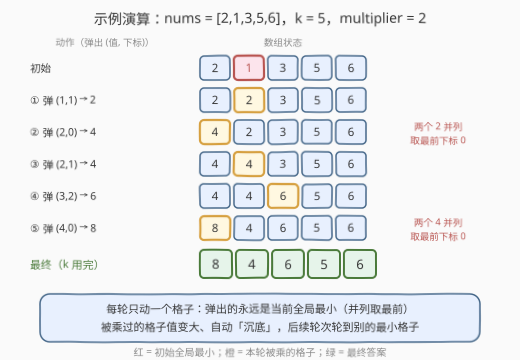

# K次乘运算后的最终数组状态I

- **题目名称**：K次乘运算后的最终数组状态I
- **链接**：[3264. K 次乘运算后的最终数组状态 I](https://leetcode.cn/problems/final-array-state-after-k-multiplication-operations-i/)
- **难度**：简单
- **标签**：数组、堆（优先队列）、模拟、数学

## 1. 题目概述

给你一个整数数组 `nums`、一个整数 `k` 和一个整数 `multiplier`。

你需要对 `nums` 执行 `k` 次操作，每次操作中：

- 找到 `nums` 中的**最小**值 `x`，如果存在多个最小值，选择最**前面**的一个；
- 将 `x` 替换为 `x * multiplier`。

返回执行完 `k` 次乘运算之后的最终 `nums` 数组。

**示例 1**：

```text
输入：nums = [2,1,3,5,6], k = 5, multiplier = 2
输出：[8,4,6,5,6]
解释：
操作         结果
1 次操作后   [2, 2, 3, 5, 6]
2 次操作后   [4, 2, 3, 5, 6]
3 次操作后   [4, 4, 3, 5, 6]
4 次操作后   [4, 4, 6, 5, 6]
5 次操作后   [8, 4, 6, 5, 6]
```

**示例 2**：

```text
输入：nums = [1,2], k = 3, multiplier = 4
输出：[16,8]
解释：[1,2] → [4,2] → [4,8] → [16,8]
```

**约束条件**：

- $1 \le \text{nums.length} \le 100$
- $1 \le \text{nums[i]} \le 100$
- $1 \le k \le 10$
- $1 \le \text{multiplier} \le 5$

> 💡 **审题关键**：① 并列最小**取最前**（按下标破平）——示例 1 的第 2、5 步都在考验这一条；② 元素**位置不动、只改值**，返回的是原数组形态而不是排序结果；③ `multiplier` 可以等于 1——乘了等于没乘，数组原样返回；④ 同一个元素可能**连续多轮**被乘（乘完仍是全局最小），如示例 2 的首元素连乘三次。

---

## 2. 解题思路

### 2.1 暴力思路：每轮线性扫最小

最直接的模拟：每轮从头到尾扫一遍数组找最小值下标（比较用**严格小于**，保证并列时保留更早的下标），原地乘上 `multiplier`，重复 `k` 轮：

```python
for _ in range(k):
    idx = min(range(len(nums)), key=lambda j: nums[j])  # min 并列返回最前
    nums[idx] *= multiplier
```

时间 $O(k \cdot n)$、空间 $O(1)$。本题 $n \le 100$、$k \le 10$，最多一千次比较，**暴力本身就是可行解**。但这套写法的浪费也很明显：每轮都把「找最小」从零做起，上一轮的信息全部作废——一旦 $n, k$ 放大到 $10^5$ 量级，$10^{10}$ 次比较就不可接受。把「动态集合反复取最小」沉淀成数据结构，就是小根堆。

### 2.2 核心观察：小根堆装 (值, 下标) 二元组



**观察 1（并列取前 = 字典序比较）**：把每个元素建模成 `(值, 下标)` 二元组塞进小根堆。`pair` / `tuple` 的比较规则是**字典序**——值相等时自动比较下标，小下标先弹出。「并列取最前」这条规则不需要任何特判，二元组天然编码了它。

**观察 2（乘后只增，弹一个塞一个）**：$\text{multiplier} \ge 1$ 意味着新值不小于旧值。每轮「弹出堆顶 → 乘 → 塞回去」，堆中始终维护着全部 $n$ 个元素的**当前值**，堆序自动维持，无需重建。

**观察 3（同步写回，原地成答）**：堆的弹出序是**值序**，题目要的是**原下标序**——好在位置信息就藏在二元组里：每轮弹出的下标 $i$ 顺手执行 `nums[i] = x * multiplier`，$k$ 轮跑完原数组本身就是答案，连收尾的一趟都省了。

**观察 4（连续被乘是正确行为）**：乘完的元素若仍是全局最小（如 `[1, 100]` 乘 2 后 2 仍最小），下一轮弹出的还是它——堆不会「嫌弃」刚塞回去的元素，这恰好就是题目语义（示例 2）。

> ⚠️ **值域核查**：本题最大值 $= 100 \times 5^{10} \approx 9.8 \times 10^8 < 2^{31} - 1$，`int` 不会溢出，可以放心乘。

### 2.3 算法流程图



| 步骤 | 操作 | 作用 |
|------|------|------|
| ① 建堆 | 所有 `(nums[i], i)` 入小根堆 | $O(n)$ 完成初始化 |
| ② 弹顶 | 取出堆顶 `(x, i)`——全局最小，并列取小下标 | $O(\log n)$ 定位目标 |
| ③ 乘塞回 | `push (x·multiplier, i)`，同步 `nums[i] ← 新值`，`k ← k − 1` | 值更新后堆序自动恢复 |
| ④ 收尾 | $k$ 轮用完，返回 `nums` | 原地更新，无需额外写回趟 |

### 2.4 示例演算



以示例 1（`nums = [2,1,3,5,6]`，`k = 5`，`multiplier = 2`）为例：

- 建堆后堆顶是 `(1, 1)`——全局最小 1 在下标 1，乘成 2 写回；
- 第 ② 轮：数组已是 `[2,2,3,5,6]`，两个 2 并列，堆中 `(2,0)` 与 `(2,1)` 值相等、比下标，弹出 `(2,0)`——**取最前**正是字典序的效果；
- 第 ⑤ 轮同理：两个 4 并列，弹出 `(4,0)` 乘成 8；
- 五轮结束，堆中剩 `(4,1), (5,3), (6,2), (6,4), (8,0)`——每一步都已同步写回，`nums` 即 `[8,4,6,5,6]`。

观察每一轮：**被乘的格子值变大后自动「沉」下去**，后续轮次自然轮到别的最小格子——乘法在堆上完成了一次「自我调度」。

---

## 3. 参考代码

### C++（小根堆 + 二元组）

```cpp
class Solution {
public:
    vector<int> getFinalState(vector<int>& nums, int k, int multiplier) {
        using P = pair<int, int>;                        // (值, 下标)
        priority_queue<P, vector<P>, greater<P>> pq;     // 小根堆，字典序
        for (int i = 0; i < (int)nums.size(); ++i)
            pq.emplace(nums[i], i);                      // ① O(n) 建堆
        while (k--) {
            auto [x, i] = pq.top(); pq.pop();            // ② 全局最小，并列取小下标
            x *= multiplier;
            pq.emplace(x, i);                            // ③ 乘完塞回
            nums[i] = x;                                 //    同步写回原位置
        }
        return nums;                                     // ④ 原数组即答案
    }
};
```

### Python（heapq）

```python
from heapq import heapify, heappop, heappush
from typing import List

class Solution:
    def getFinalState(self, nums: List[int], k: int, multiplier: int) -> List[int]:
        heap = [(x, i) for i, x in enumerate(nums)]  # ① (值, 下标) 二元组
        heapify(heap)                                #    O(n) 建堆
        for _ in range(k):
            x, i = heappop(heap)                     # ② 全局最小，并列取小下标
            x *= multiplier
            heappush(heap, (x, i))                   # ③ 乘完塞回
            nums[i] = x                              #    同步写回原位置
        return nums                                  # ④ 原数组即答案
```

> 💡 两种语言的堆都按字典序比较二元组，`greater<>` / `heapq` 默认即小根——「并列取最前」零特判。

---

## 4. 复杂度分析

| 维度 | 复杂度 | 说明 |
|------|--------|------|
| **时间** | $O(n + k \log n)$ | 建堆 $O(n)$；$k$ 轮各一次弹出 + 一次压入，每次 $O(\log n)$；写回 $O(1)$ |
| **空间** | $O(n)$ | 堆中常驻 $n$ 个二元组（输出即原数组，不计额外） |
| **对照：暴力** | $O(k \cdot n)$ / $O(1)$ | 本题范围（$\le 1000$ 次比较）瞬时完成；$n, k$ 到 $10^5$ 时堆版本仍是 $10^5 \cdot 17$ 量级 |

> 💡 本题 $n \le 100$、$k \le 10$，暴力与堆都是「秒过」——堆的价值在**可扩展性**：把「逐轮找最小」的重复劳动摊到 $\log n$。

---

## 5. 扩展：k 到 10^9 怎么办（3266）

[姊妹题 3266. K 次乘运算后的最终数组状态 II](https://leetcode.cn/problems/final-array-state-after-k-multiplication-operations-ii/)（困难）把 $k$ 与值域都放大到 $10^9$（还要对 $10^9+7$ 取模），逐轮模拟彻底失效，必须发现操作的**周期结构**：

- `multiplier == 1`：乘了等于没乘，直接返回；
- 否则先用小根堆逐轮模拟，直到 $k$ 用完，或出现**停机条件**：当前最小值 $\times \text{multiplier} >$ 当前最大值——此后每轮恰好按值从小到大轮流乘，$n$ 次一轮、全体同乘一个 $\text{multiplier}$、相对大小不变，**周期永续**；
- 剩余 $k = q \cdot n + r$：每个元素再乘 $\text{multiplier}^q$，当前最小的 $r$ 个再多乘一次；指数用快速幂在模意义下计算。

```python
class Solution:                                      # 3266 思路骨架
    def getFinalState(self, nums, k, multiplier):
        MOD = 10**9 + 7
        if multiplier == 1:
            return nums
        n = len(nums)
        heap = [(x, i) for i, x in enumerate(nums)]
        heapify(heap)
        mx = max(nums)
        while k and heap[0][0] * multiplier <= mx:    # 停机条件未满足前逐轮模拟
            x, i = heappop(heap)
            x *= multiplier                           # 比较阶段不可取模！
            mx = max(mx, x)
            heappush(heap, (x, i))
            k -= 1
        q, r = divmod(k, n)                           # 剩余 = q 整轮 + r 次
        ans = [0] * n
        for rank, (x, i) in enumerate(sorted(heap)):  # 值序 = 后续轮转顺序
            ans[i] = x * pow(multiplier, q + (rank < r), MOD) % MOD
        return ans
```

> ⚠️ 两个高频坑：① 模拟阶段**绝不能取模**——取模会破坏大小关系，堆顶就不再是真实最小；② 停机前每个值至多爬到 $\max \times \text{multiplier} \approx 10^{14}$，64 位整数安全，但停机后必须立刻切换到「指数 + 快速幂」。

---

## 6. 面试要点

1. **并列最小值取最前，堆怎么保证？**

   二元组 `(值, 下标)` 按字典序比较：值相等时比下标，小根堆先弹出小下标。Python 的 `min()` 恰好返回**第一个**最小元素，暴力版也天然正确——两种写法共享同一条 tie-break 语义。

2. **暴力和堆怎么取舍？**

   暴力 $O(k \cdot n)$、堆 $O(n + k \log n)$。本题范围两者都瞬时完成，**先报暴力再主动升级到堆**是面试的正确叙事；数据规模不明时，堆版本对 $n, k$ 的增长都是对数级消化。

3. **乘完的元素为什么能直接塞回堆里？**

   $\text{multiplier} \ge 1$ 保证新值不小于旧值，弹一个塞一个后堆中仍是全部 $n$ 个当前值，堆性质自动维持。同一元素连续被乘（乘完仍最小）不是 bug，恰是题目语义（示例 2）。

4. **会不会溢出？**

   本题值域上界 $100 \times 5^{10} \approx 9.8 \times 10^8 < 2^{31}-1$，`int` 安全。到 3266 的规模（$10^9$ 值域、$10^9$ 轮）就必须取模 + 快速幂，且**比较用真值、输出用模值**两套并行。

5. **为什么往堆里塞二元组而不是裸值？**

   值会变，但「身份」不能丢：下标既是 tie-break 的依据（并列取最前），又是写回原位置的地址（`nums[i]` 同步更新）。塞裸值两条信息全丢——「带身份入堆」是通用范式，单调栈存下标（如 [739. 每日温度](../0701-0800/739_每日温度.md)）是同一思想在栈上的镜像。

---

## 7. 同类练习题

- [3266. K 次乘运算后的最终数组状态 II](https://leetcode.cn/problems/final-array-state-after-k-multiplication-operations-ii/)：本题困难版——$k$ 到 $10^9$ 且取模，靠「停机条件 + 轮转周期 + 快速幂」快进模拟
- [1046. 最后一块石头的重量](https://leetcode.cn/problems/last-stone-weight/)（[题解](../1001-1100/1046_最后一块石头的重量.md)）：同为「堆 + 逐轮模拟」签到经典——每轮弹两个最大值相撞，把差塞回
- [215. 数组中的第K个最大元素](https://leetcode.cn/problems/kth-largest-element-in-an-array/)（[题解](../0201-0300/215_数组中的第K个最大元素.md)）：堆取最值的母题，对照「大根堆取最大」与本题「小根堆取最小」
- [703. 数据流中的第K大元素](https://leetcode.cn/problems/kth-largest-element-in-a-stream/)（[题解](../0701-0800/703_数据流中的第K大元素.md)）：小根堆只保 K 个候选——「弹一个塞一个」的流式版本
- [239. 滑动窗口最大值](https://leetcode.cn/problems/sliding-window-maximum/)（[题解](../0201-0300/239_滑动窗口最大值.md)）：动态集合取最值的另一条路——单调队列在滑窗场景 $O(1)$ 摊还取最值
