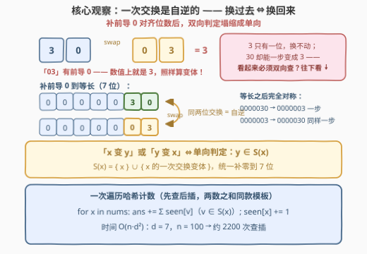
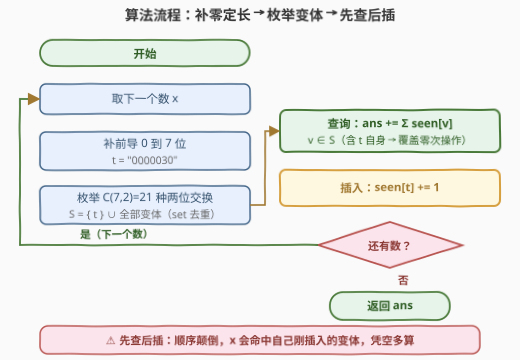
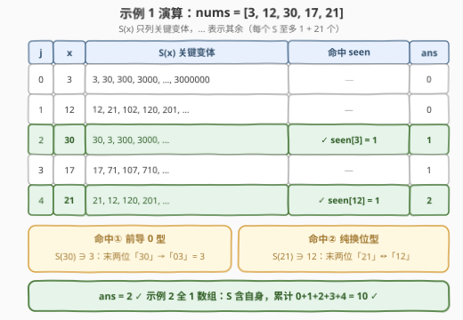

# 统计近似相等数对 I

- **题目名称**：统计近似相等数对 I
- **链接**：[3265. 统计近似相等数对 I](https://leetcode.cn/problems/count-almost-equal-pairs-i/)
- **难度**：中等
- **标签**：数组、哈希表、计数、枚举

## 1. 题目概述

给你一个**正整数**数组 $nums$。如果执行以下操作**至多一次**可以让两个整数 $x$ 和 $y$ 相等，则称这个数对是**近似相等**的：

- 选择 $x$ **或者** $y$ 之一，将这个数字中的**两个数位交换**。

请你返回 $nums$ 中，下标 $i < j$ 且 $nums[i]$ 和 $nums[j]$ **近似相等**的数对数目。注意，执行操作后一个整数可以有**前导 0**。

**示例 1**：

```text
输入：nums = [3,12,30,17,21]
输出：2
解释：近似相等数对包括：
     3 和 30 —— 交换 30 中的数位 3 和 0，得到 3。
     12 和 21 —— 交换 12 中的数位 1 和 2，得到 21。
```

**示例 2**：

```text
输入：nums = [1,1,1,1,1]
输出：10
解释：数组中的任意两个元素都是近似相等的。
```

**示例 3**：

```text
输入：nums = [123,231]
输出：0
解释：我们无法通过交换 123 或者 231 中的两个数位得到另一个数。
```

**约束条件**：

- $2 \le nums.length \le 100$
- $1 \le nums[i] \le 10^6$

> 💡 读题关键：① 「至多一次」包含**零次**——相等本身就是近似相等（示例 2 的 10 对全靠零次操作）；② 「选择 $x$ 或者 $y$ 之一」看着是双向判定，2.2 节会证明它能**塌缩成单向**，这正是哈希计数的关键；③ 前导 0 意味着 **30 和 3 也近似相等**（交换得 "03"）——位数不同的数也能配上，直接拿裸字符串比较会漏；④ $n \le 100$ 暗示 $O(n^2)$ 暴力可过，但哈希计数版代码同样短、复杂度低一个 $n$，且是 [3267. 统计近似相等数对 II](https://leetcode.cn/problems/count-almost-equal-pairs-ii/)（$n$ 放大到 5000、操作放宽到两次）的正解骨架，值得直接写成通版。

---

## 2. 解题思路

### 2.1 暴力思路：逐对双向判定

$n \le 100$，全部数对 $\binom{100}{2} = 4950$ 个。判定一个数对 $(a, b)$：$a = b$，或 $b \in \text{swap1}(a)$，或 $a \in \text{swap1}(b)$——其中 $\text{swap1}(x)$ 表示把 $x$ 的字符串任意两位交换后得到的**数值**集合（"03" 转 `int` 得 3，前导 0 自动消去）。每个数至多 7 位，$\binom{7}{2} = 21$ 种交换，双向共 42 次字符串变换每对，总计约 $2 \times 10^5$ 次基本操作，稳过。

暴力有两个必须绕开的坑：

- **变体必须数值化再比较**："03" 与 "3" 字符串不等但数值相等，若按字符串比较会漏掉 $3$ 与 $30$ 这对；
- **双向判定不能省**：$[3,\ 30]$ 中 $3$ 只有一位换不动，必须靠 $30$ 的变体 $03 = 3$ 命中；反过来 $[30,\ 3]$ 顺序变了又是另一个方向。另外注意「变体集合有交集」**不是**近似相等的充分条件——$213$ 与 $132$ 的变体集都含 $123/312/231$（各自一步都到得了），但它们互不为对方的变体（$1 \to 2 \to 3 \to 1$ 的三循环需要两次交换），答案应为 0。

### 2.2 核心观察：一次交换是自逆的——「或」塌缩成单向



**第一步：swap 是对合（involution）**。把字符串的两位 $i, j$ 交换，再对**同样两位**交换一次就还原。因此在**等长字符串**层面：

$$x \text{ 一步到 } y \iff y \text{ 一步到 } x$$

**第二步：前导 0 破坏对称，补零修复**。数值层面 $30 \to 03 = 3$ 是单向的——$3$ 只有一位换不动。修复方式极其简单：**全部补前导 0 到定长 7 位**（$nums[i] \le 10^6$ 至多 7 位）。"0000030" swap 第 5、6 位得 "0000003"，反向同样是这一步——位数对齐后，对称性完整体恢复。

**第三步：判定塌缩**。定义

$$S(x) = \{x\} \cup \{x \text{ 的一次交换变体}\} \quad (\text{统一 } 7 \text{ 位补零串})$$

则「近似相等」$= y \in S(x) \text{ 或 } x \in S(y)$，由对称性两者**等价**，只需查一个方向：

$$\text{近似相等} \iff \text{之前的原值} \in S(\text{当前数})$$

**第四步：先查后插**。从左到右扫一遍，哈希表 $seen$ 记录之前**原值**的出现次数；处理 $x$ 时先 $ans \mathrel{+}= \sum_{v \in S(x)} seen[v]$，再 $seen[x] \mathrel{+}= 1$——与 [1. 两数之和](https://leetcode.cn/problems/two-sum/)（[站内题解](../0001-0100/1_两数之和.md)）同款模板，只是查询键从一个 `target` 变成了一个变体集合。$S$ 用集合去重（"11" 换两位还是 "11"、补零串里交换两个 0 也产生重复），保证每个数对至多计一次。

### 2.3 算法流程图



骨架就四步：补零定长 → 枚举 $\binom{7}{2} = 21$ 种交换收集变体 → **查** → **插**。最容易写错的点已用橙色标出：**先查后插**——若先把 $seen[x]$ 加一再去查，$x$ 会命中自己刚插入的记录，凭空多算一堆 $(x, x)$ 对。

### 2.4 示例演算



以 $nums = [3, 12, 30, 17, 21]$ 走一遍（$S(x)$ 以 7 位补零串生成、数值化展示）：

| $j$ | $x$ | $S(x)$ 关键变体 | 命中 $seen$ | $ans$ |
|-----|-----|-----------------|-------------|-------|
| 0 | 3 | $\{3, 30, 300, \dots, 3000000\}$ | — | 0 |
| 1 | 12 | $\{12, 21, 102, 120, \dots\}$ | — | 0 |
| 2 | 30 | $\{30, 3, 300, \dots\}$ | $\checkmark\ seen[3] = 1$ | 1 |
| 3 | 17 | $\{17, 71, 107, \dots\}$ | — | 1 |
| 4 | 21 | $\{21, 12, 120, \dots\}$ | $\checkmark\ seen[12] = 1$ | 2 |

两次命中恰好是两种典型：**前导 0 型**（$30$ 的补零串末两位 "30" → "03"，数值 3 命中）与**纯换位型**（"21" ↔ "12"）。输出 $2$ 与示例一致 ✓。示例 2 中 $S(1) = \{1\}$（全同数位交换不变，去重后只剩自身），命中累计 $0 + 1 + 2 + 3 + 4 = 10$ ✓；示例 3 中 $123$ 与 $231$ 互不包含（三循环需两次交换）→ $0$ ✓。

---

## 3. 参考代码

### C++

```cpp
class Solution {
  public:
    int countPairs(vector<int>& nums) {
        unordered_map<int, int> seen;          // 之前原值 → 出现次数
        int ans = 0;
        for (int x : nums) {
            string t = to_string(x);
            t = string(7 - t.size(), '0') + t; // 补前导 0 到 7 位
            unordered_set<int> S{x};           // 零次操作：自身
            for (int i = 0; i < 7; ++i)
                for (int j = i + 1; j < 7; ++j) {
                    swap(t[i], t[j]);          // 一次交换
                    S.insert(stoi(t));         // "0000030" → 30，前导 0 自动消
                    swap(t[i], t[j]);          // 换回来（对合！）
                }
            for (int v : S)
                if (auto it = seen.find(v); it != seen.end())
                    ans += it->second;         // 先查
            ++seen[x];                         // 后插
        }
        return ans;
    }
};
```

### Python

```python
from itertools import combinations

class Solution:
    def countPairs(self, nums: List[int]) -> int:
        seen = Counter()                       # 之前原值 → 出现次数
        ans = 0
        for x in nums:
            t = f"{x:07d}"                     # 补前导 0 到 7 位
            S = {x}                            # 零次操作：自身
            lst = list(t)
            for i, j in combinations(range(7), 2):
                lst[i], lst[j] = lst[j], lst[i]
                S.add(int(''.join(lst)))       # "0000030" → 30，前导 0 自动消
                lst[i], lst[j] = lst[j], lst[i]  # 换回来（对合！）
            ans += sum(seen[v] for v in S)     # 先查
            seen[x] += 1                       # 后插
        return ans
```

> 💡 实现细节：① 变体统一转 `int` 入集合、哈希键也用原值数值——两侧键空间天然一致（"0000030" 数值化后就是原值 30），不会出现「一侧裸串、一侧带零串」永远查不中的错位；② 交换后**必须换回来**（或每次复制新串），否则 21 种交换会互相叠加成多次交换的产物；③ $S$ 含 $x$ 自身这一项覆盖「零次操作」，别漏——漏了示例 2 直接归零；④ 变体数值上界约 $10^7$（如 $0999999$ 的重排），`int` 足够，无需 64 位。

---

## 4. 复杂度分析

| 维度 | 复杂度 | 说明 |
|------|--------|------|
| 时间复杂度 | $O(n \cdot d^2)$ | 每个数生成 $1 + \binom{7}{2} = 22$ 个变体（去重后更少）并查哈希；$n = 100$ → 约 2200 次查插 |
| 空间复杂度 | $O(n)$ | $seen$ 哈希表 + 单个变体集合（不计返回值） |
| 暴力对照 | $O(n^2 \cdot d^2)$ | $4950$ 对 × 42 次变换，本题 $n \le 100$ 也能过，但 $n$ 放大一个量级即超时 |
| 进阶（3267） | $O(n \cdot d^4)$ | 变体闭包扩到两步交换（$\le 1 + 21 + 21^2 = 463$ 个），$n = 5000$ 仍可行 |

实测：官方三组示例输出 $2$、$10$、$0$；与 $O(n^2 \cdot d^2)$ 双向暴力对拍随机数据（$n \le 12$、值域 $[1, 10^6]$）3000 组全部一致；针对性构造的前导 0 用例 $[3, 30]$、$[30, 3]$、$[10, 1, 100]$ 均正确，反例 $[213, 132]$ 正确输出 0。

---

## 5. 扩展：暴力版与 II 版的升级路径

**暴力版**（$n \le 100$ 专用，思路最直白——直接沿用 2.1 的双向判定）：

```python
from itertools import combinations

class Solution:
    def countPairs(self, nums: List[int]) -> int:
        def swap1(x):                      # x 的一次交换变体（数值集合）
            s, res = str(x), {x}
            for i, j in combinations(range(len(s)), 2):
                a = list(s)
                a[i], a[j] = a[j], a[i]
                res.add(int(''.join(a)))   # "03" → 3，前导 0 自动消
            return res

        ans = 0
        for i in range(len(nums)):
            for j in range(i + 1, len(nums)):
                a, b = nums[i], nums[j]
                if b in swap1(a) or a in swap1(b):   # 双向判定，不能省
                    ans += 1
        return ans
```

**向 II 版（3267）升级**只改两处：

- **操作放宽到至多两次** → 变体闭包从「自身 ∪ 一步」扩成「自身 ∪ 一步 ∪ 两步」：在一步变体的基础上再做一轮 21 种交换（$\le 463$ 个变体）。对称性依然成立——两个 swap 的复合 $\sigma \circ \tau$，其逆 $\tau^{-1} \circ \sigma^{-1} = \tau \circ \sigma$ 仍是两个 swap 的复合，所以「两步可达」照样双向等价，**单向判定 + 先查后插的模板原封不动**；
- **$n$ 放大到 5000** → $O(n^2)$ 暴力约 $1.25 \times 10^7$ 对、每对两轮闭包展开，彻底不可行，哈希计数从「更优」变成「必选」。

这也解释了为什么本题推荐直接写哈希版：它不是暴力的小优化，而是这一整个题型家族的通用骨架。

---

## 6. 面试要点

1. **为什么「x 变 y 或 y 变 x」只需查一个方向？**

   - 单次交换是**对合**：同样的两位再换一次就还原，故等长字符串层面「x 一步到 y ⟺ y 一步到 x」。前导 0 会在数值层面破坏这条对称（30 → 03 = 3 单向），但**补前导 0 到定长 7 位**后位数对齐，对称性完整恢复。于是「或」条件塌缩成单向判定 $y \in S(x)$，哈希计数才成为可能——若真是双向独立条件，先查后插就得去重，模板复杂度翻倍。

2. **变体集合为什么必须去重？不去重会怎样？**

   - 两类重复：交换**相同的两个数位**（"11" 或补零串里的两个 0）结果不变；全同数位（如 111）的所有交换都回到自身。不去重的话，$x = 11$ 的变体表里 11 出现 22 次，查 $seen[11]$ 会把同一个 $j$ 前的同一数对计 22 次。集合去重后每个数对至多计一次，且「零次操作」与「交换不变」统一成同一个键。

3. **哈希键两侧为什么要「数值化」或「统一补零串」？**

   - 核心是**键空间一致**：原值侧若存裸字符串 "3"，变体侧是补零交换产物 "03"，字符串永远不相等。两侧都用 `int`（"03" 数值化即 3，与原值 3 同键）或都用 7 位补零串，才能对得上。这是本题最隐蔽的实现坑——示例 1 恰好不暴露它，纯靠 $[3, 30]$ 这类用例才能测出。

4. **先查后插的顺序反了会发生什么？**

   - 若先 $seen[x] \mathrel{+}= 1$ 再查，$x$ 自己（$S$ 含自身）以及自己的变体会命中刚插入的记录，把 $(x, x)$ 也算进答案。先查后插保证查询时表里只有**之前的**元素，天然满足 $i < j$ 且不重不漏——与两数之和的哈希写法完全同构。

5. **暴力 $O(n^2 d^2)$ 和哈希 $O(nd^2)$ 怎么取舍？**

   - 本题 $n = 100$ 都能过，但哈希版代码不更长、正确性不更难，且是 II 版（$n = 5000$、两步交换）的必选骨架——面试直接给哈希版，再口头补一句「n ≤ 100 时双重循环双向判定也可过」，展示对数据范围与算法族谱的双重敏感。

---

## 7. 同类练习题

- [3267. 统计近似相等数对 II](https://leetcode.cn/problems/count-almost-equal-pairs-ii/)：进阶版——至多两次交换 + $n$ 放大到 5000，变体闭包扩到两步（对换复合的逆仍是对换复合，对称性保持），同一套「补零 + 先查后插」直接升级
- [2006. 差的绝对值为 K 的数对数目](https://leetcode.cn/problems/count-number-of-pairs-with-absolute-difference-k/)（[站内题解](../2001-2100/2006_差的绝对值为K的数对数目.md)）：哈希一次遍历统计满足条件的数对，把本题的「变体集合查询」退化成「$x \pm k$ 两个键查询」
- [1. 两数之和](https://leetcode.cn/problems/two-sum/)（[站内题解](../0001-0100/1_两数之和.md)）：「先查后插」哈希模板的鼻祖，本题查询键从一个 target 变成一个变体集合
- [784. 字母大小写全排列](https://leetcode.cn/problems/letter-case-permutation/)：同款「逐位置枚举变化生成变体集合」的思路，把两位交换换成大小写翻转
